# 12. overlay_private.hh - Resources类详解

## 概述

`Resources` 类是Overlay引擎的核心资源管理器，继承自 `select::SelectMap`，负责管理所有渲染资源，包括着色器、帧缓冲、纹理、几何体缓存等。它是连接渲染管线各个组件的中央枢纽。

## Resources类架构图

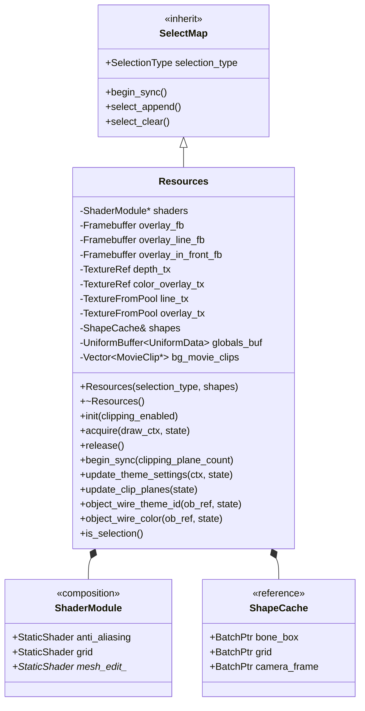

## 资源管理流程图

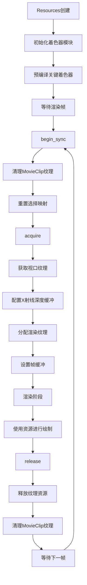

## GPU资源生命周期图

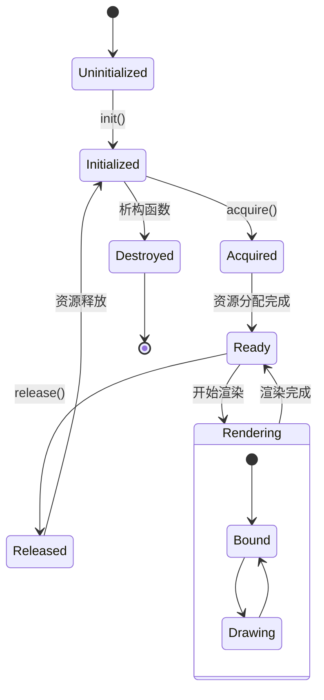

## 帧缓冲管理系统

### 帧缓冲类型层次

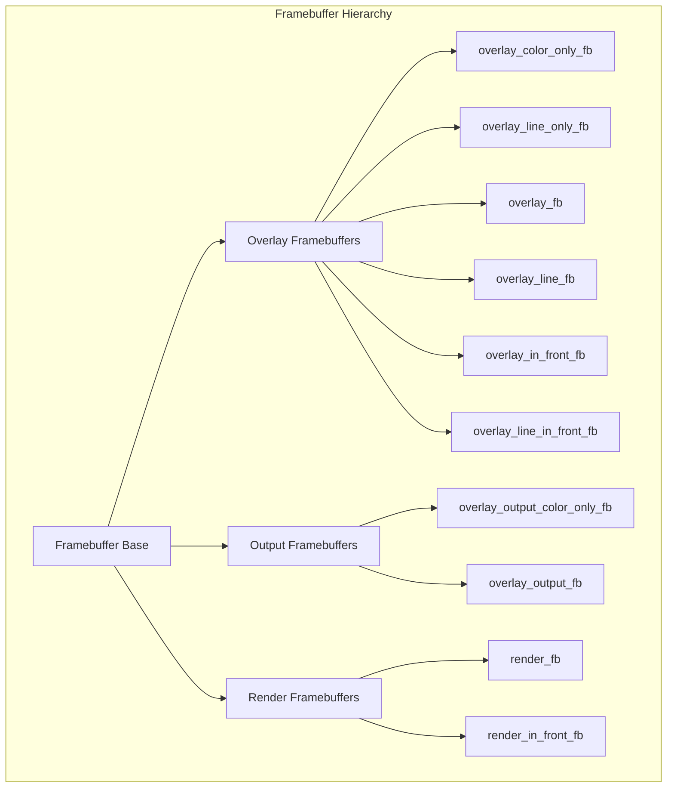

### 帧缓冲配置流程

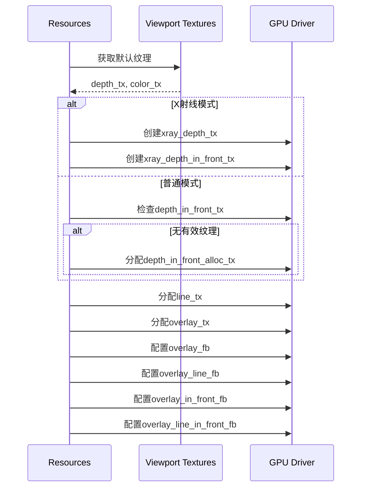

## 纹理管理架构

### 纹理分类体系

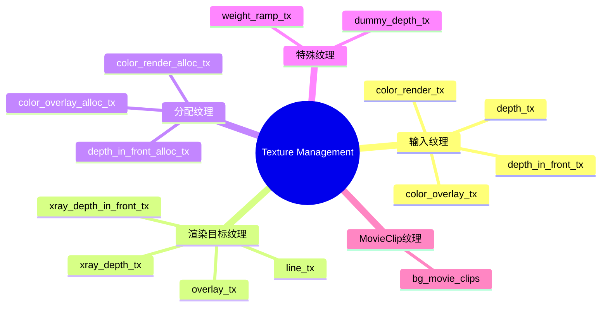

### 纹理生命周期管理

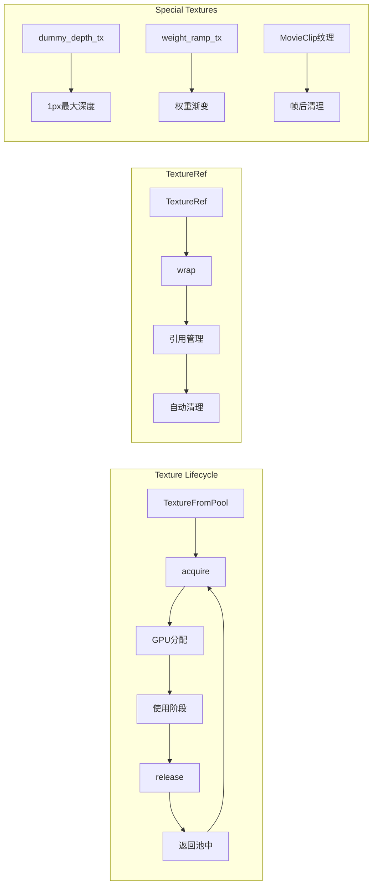

## 着色器资源管理

### 着色器初始化流程

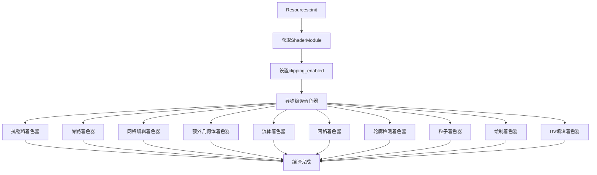

## 主题和颜色管理

### 颜色主题系统

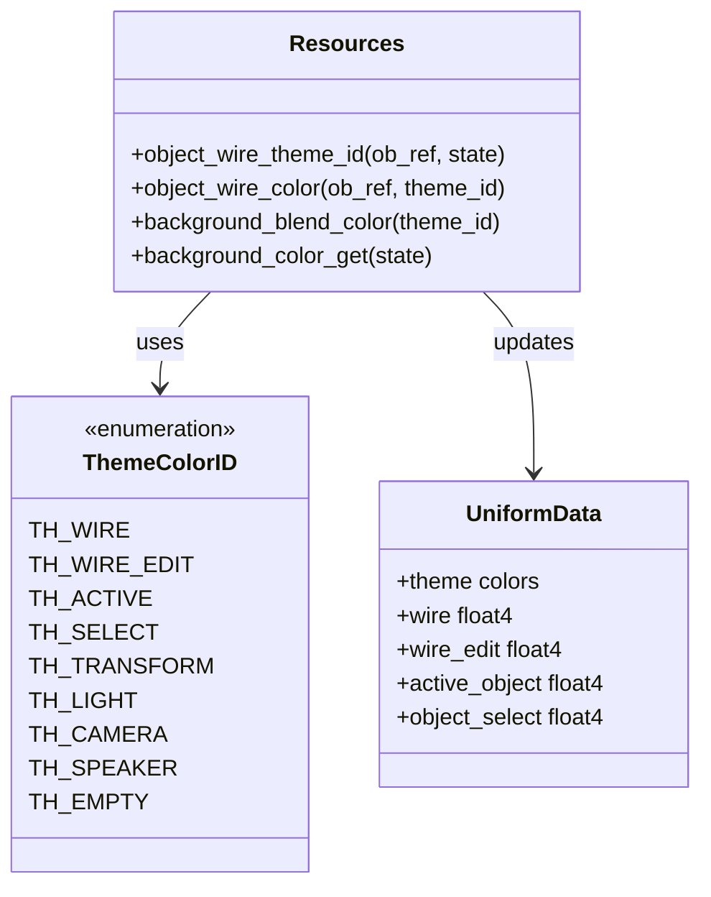

### 对象线框颜色决策树

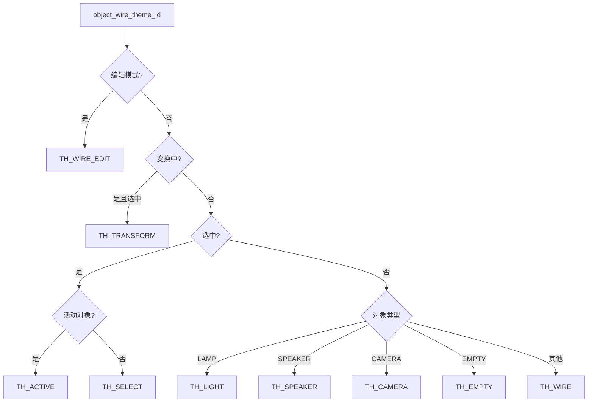

## 选择系统集成

### 选择映射机制

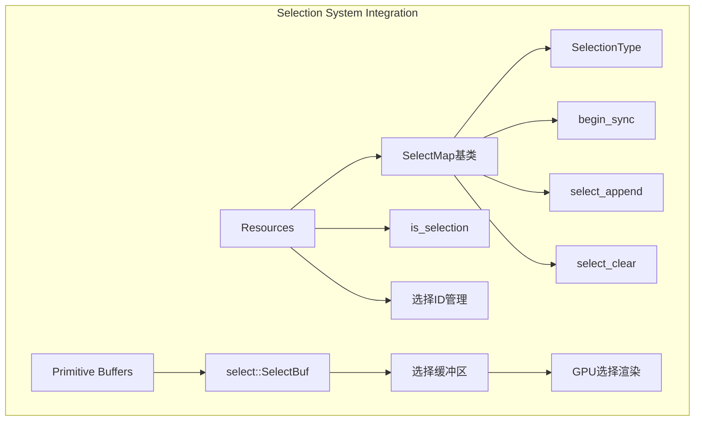

## 内存管理策略

### 资源分配模式

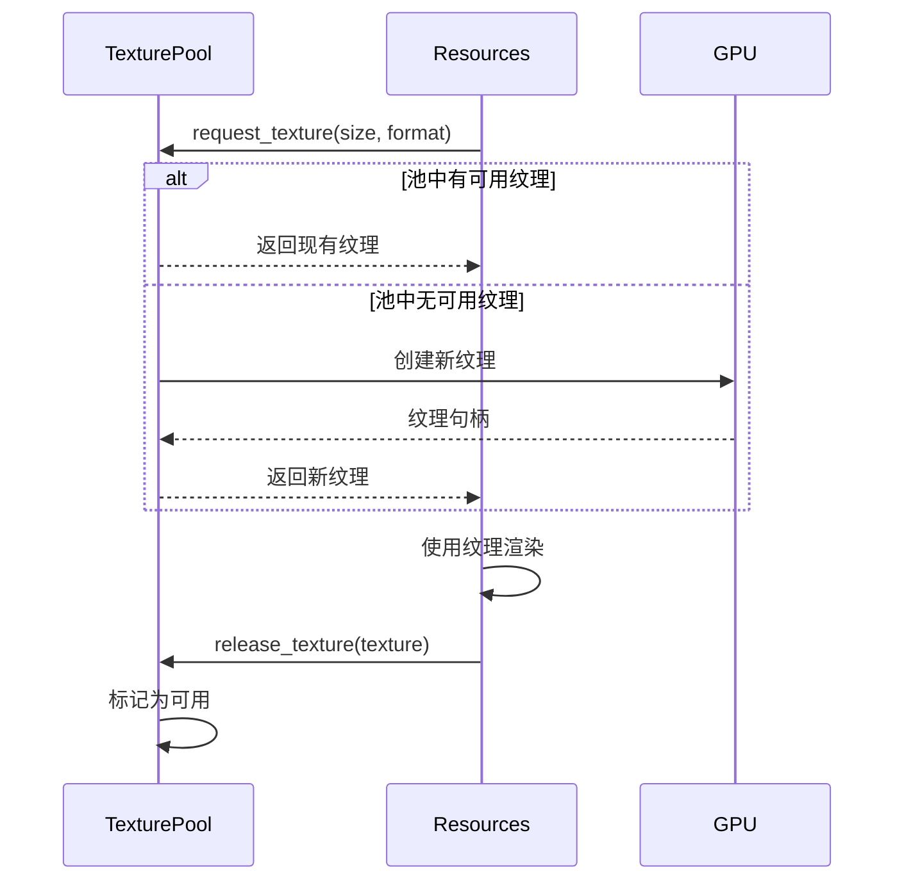

## 性能优化特性

### 关键优化策略

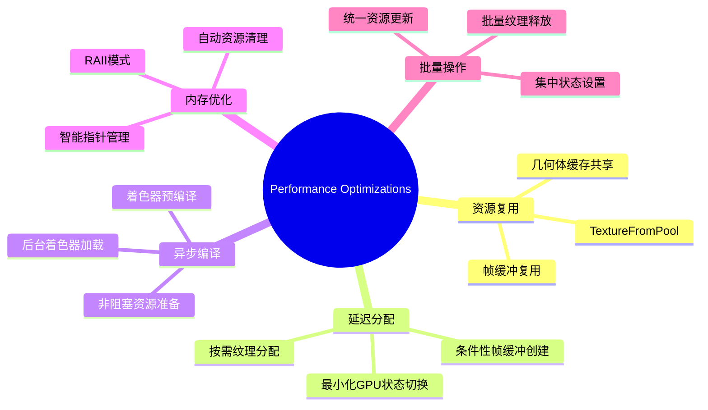

## 错误处理和恢复

### 资源管理错误处理

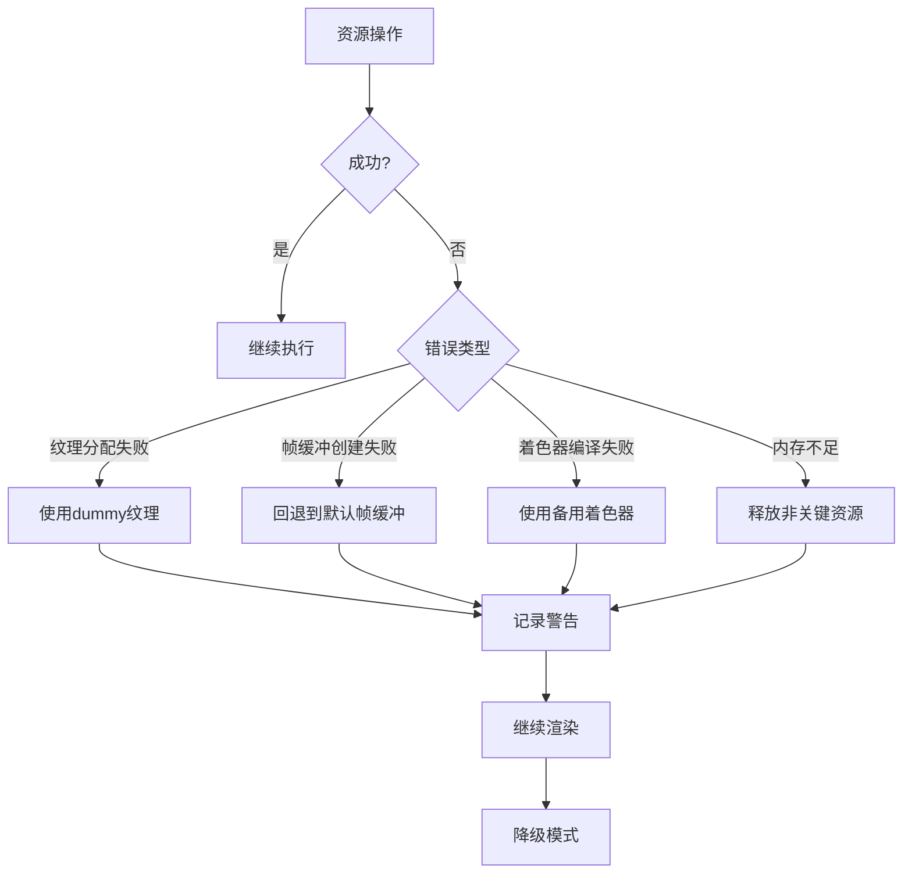

## 扩展点和自定义

### 自定义资源扩展

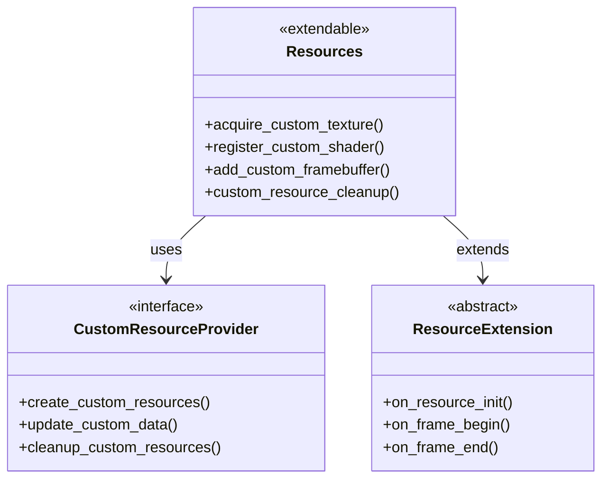

## 调试和诊断

### 资源监控工具

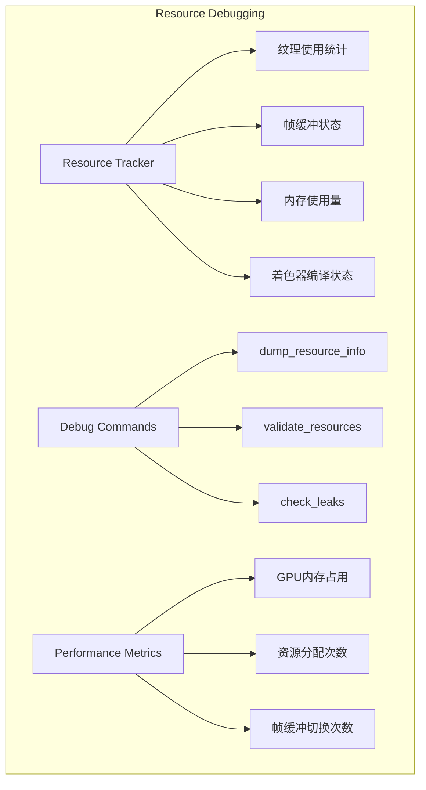

## 最佳实践指南

### 资源使用建议

1. **及时释放**: 确保在每帧结束时调用 `release()`
2. **避免重复分配**: 利用 `TextureFromPool` 的复用机制
3. **批量更新**: 在 `begin_sync()` 中集中更新状态
4. **错误处理**: 始终检查资源分配的返回值
5. **内存监控**: 定期检查资源使用情况

## 总结

`Resources` 类是Overlay引擎的资源管理核心，具有以下特点：

- **统一管理**: 集中管理所有渲染资源
- **高性能**: 多层次的缓存和优化策略
- **内存安全**: RAII和智能指针保证资源安全
- **可扩展**: 灵活的扩展点支持自定义功能
- **错误恢复**: 完善的错误处理和降级机制

该类为Overlay引擎提供了稳定、高效的资源管理基础，确保渲染管线的顺畅运行。