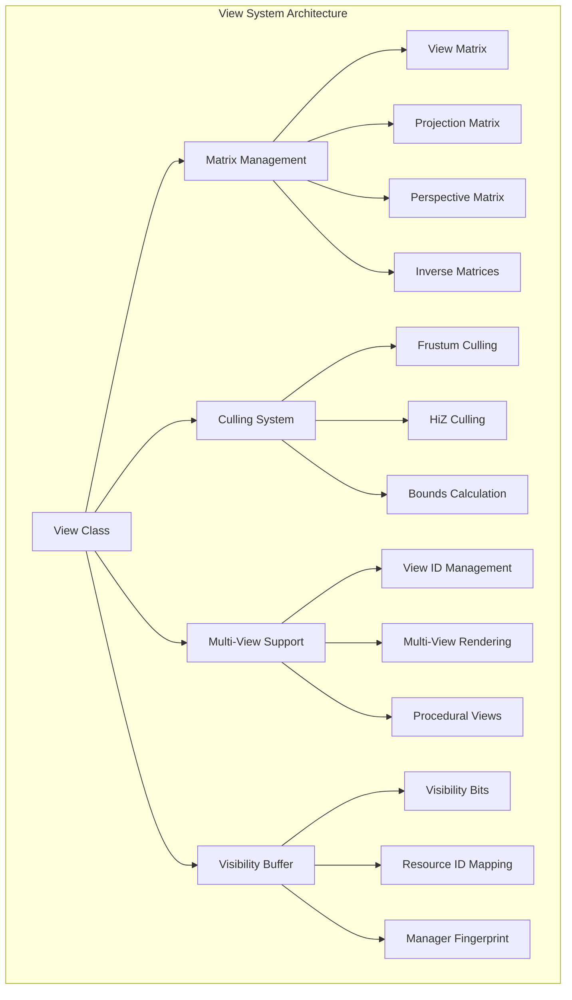
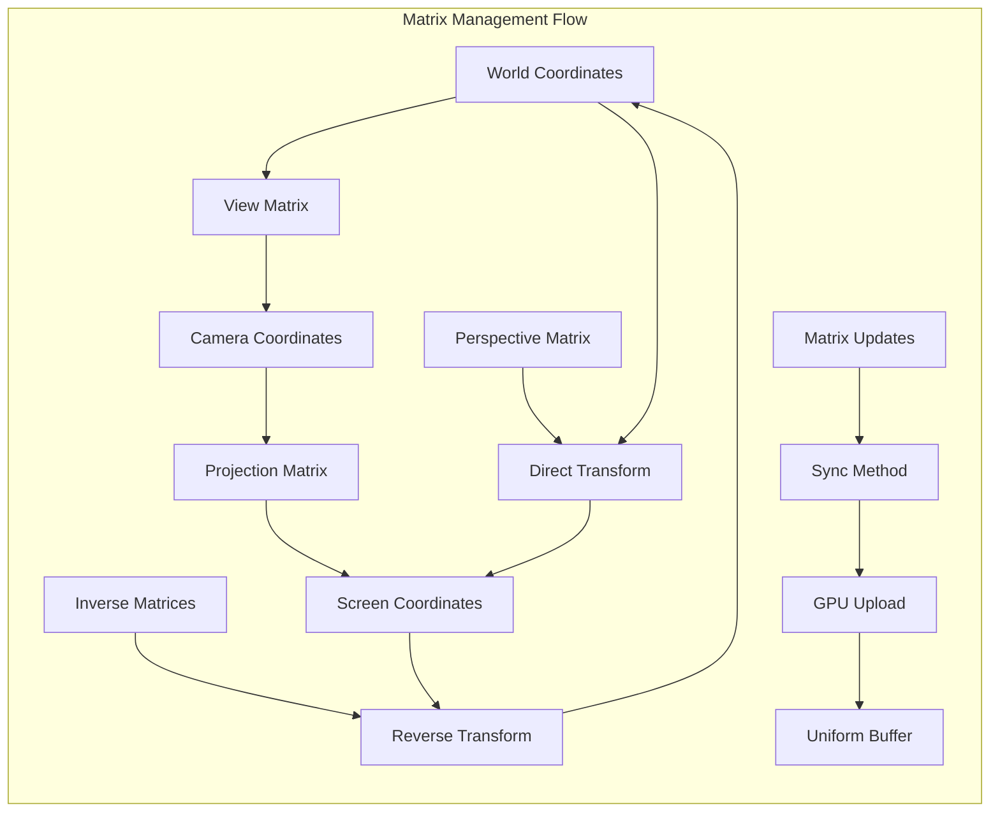
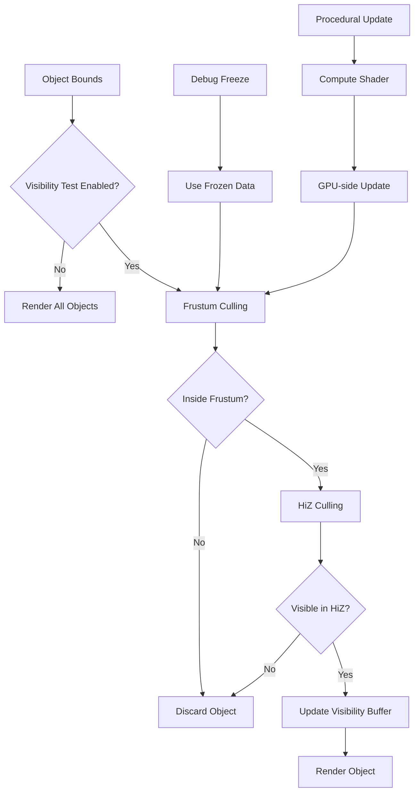
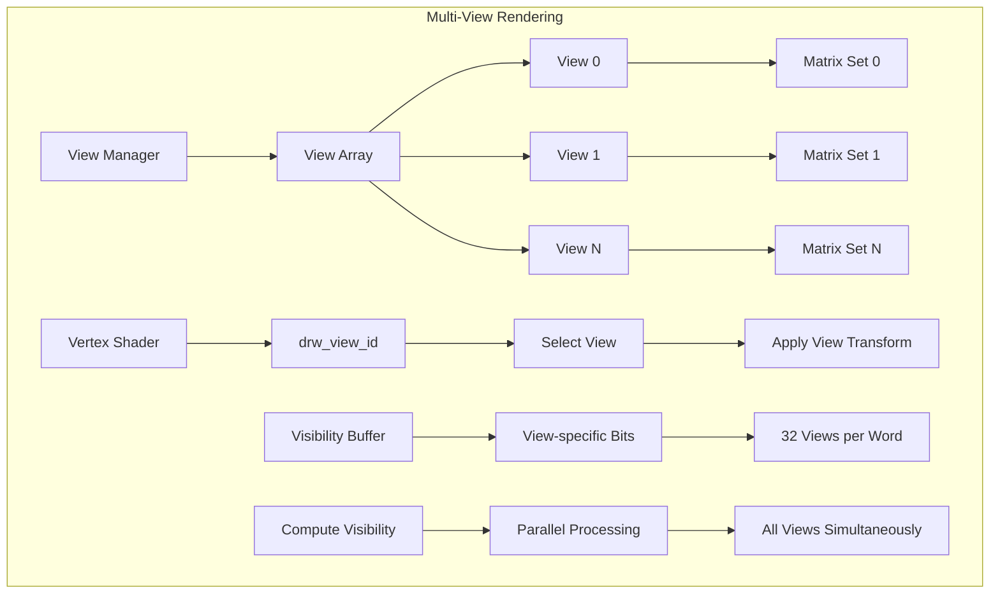

# 13. draw_view.hh 详解

## 概述

`draw_view.hh` 是Blender绘制系统中负责视图管理的核心头文件。它定义了 `View` 类，该类是DRW API中绘制几何体所必需的组件，提供了完整的视图描述和状态管理功能。

## 核心功能

### 1. 视图矩阵管理

View类管理着多个关键的变换矩阵：

- **视图矩阵 (viewmat)**: 世界坐标到相机坐标的变换
- **投影矩阵 (winmat)**: 相机坐标到屏幕坐标的变换  
- **透视矩阵 (persmat)**: 世界坐标到屏幕坐标的完整变换
- **逆矩阵**: 提供各种逆变换用于反向计算

### 2. 多视图支持

通过模板参数 `view_len` 支持多视图渲染：

```cpp
UniformArrayBuffer<ViewMatrices, DRW_VIEW_MAX> data_;
UniformArrayBuffer<ViewCullingData, DRW_VIEW_MAX> culling_;
```

### 3. 剔除系统

集成了高效的剔除系统：

- **视锥剔除**: 基于视锥体的几何剔除
- **HiZ剔除**: 基于深度层次的剔除优化
- **可见性缓冲**: 存储计算结果供后续使用

## View系统架构图



## 视图矩阵管理图



## 剔除系统流程图



## 多视图支持图



## 关键数据结构

### ViewMatrices
```cpp
struct ViewMatrices {
    float4x4 viewmat;      // 视图矩阵
    float4x4 viewinv;      // 视图逆矩阵
    float4x4 winmat;       // 投影矩阵
    float4x4 wininv;       // 投影逆矩阵
};
```

### ViewCullingData
```cpp
struct ViewCullingData {
    float4 frustum_planes[6];  // 视锥体平面
    float3 bounding_box[8];     // 包围盒角点
    float4 bounding_sphere;     // 包围球
};
```

## 主要方法

### 同步方法
- `sync()`: 同步视图矩阵
- `compute_procedural_bounds()`: 程序化边界计算

### 查询方法
- `is_persp()`: 检查是否为透视投影
- `far_clip()/near_clip()`: 获取远/近裁剪面
- `location()/forward()`: 获取相机位置和方向

### 剔除方法
- `visibility_test()`: 启用/禁用可见性测试
- `compute_visibility()`: 计算可见性
- `frustum_planes_get()`: 获取视锥体平面

## 性能优化

1. **Uniform Buffer**: 使用UBO高效传递矩阵数据
2. **GPU剔除**: 利用计算 shader 进行GPU端剔除
3. **缓存机制**: 缓存可见性结果避免重复计算
4. **批量处理**: 支持多视图同时处理

## 使用示例

```cpp
// 创建视图
View view("MainView", 1);

// 同步矩阵
view.sync(view_matrix, projection_matrix);

// 启用可见性测试
view.visibility_test(true);

// 获取矩阵用于着色器
auto& ubo = view.matrices_ubo_get();
```

## 调试支持

- **冻结模式**: 支持冻结剔除数据用于调试
- **指纹机制**: 通过指纹检测状态变化
- **调试名称**: 每个视图都有调试名称便于识别

## 总结

`draw_view.hh` 提供了完整的视图管理解决方案，支持复杂的渲染需求包括多视图渲染、高效剔除和性能优化。它是Blender现代渲染管线的重要组成部分。