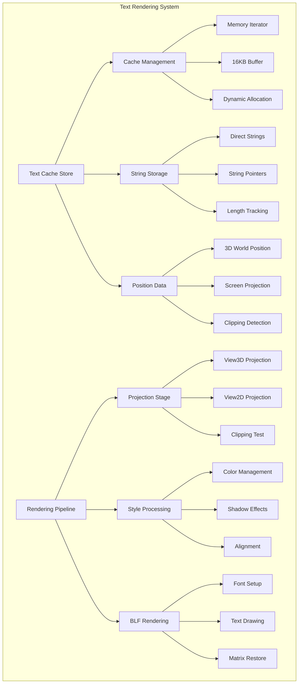
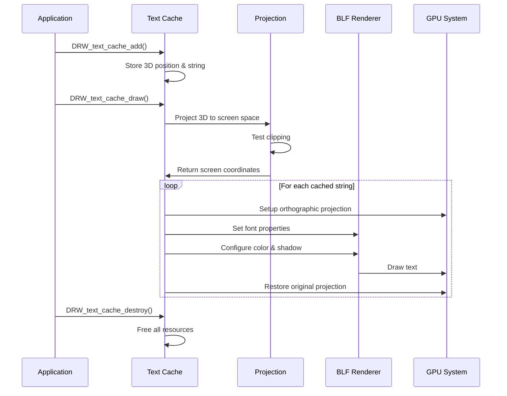
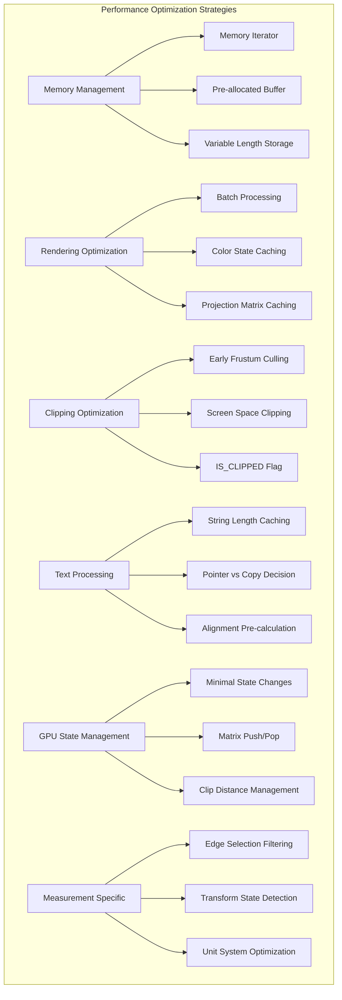

# 14. draw_manager_text.cc 详解

## 概述

`draw_manager_text.cc` 是Blender绘制系统中负责文本渲染的核心实现文件。它提供了高效的文本缓存、投影和渲染功能，主要用于3D视图中显示测量信息、调试文本和界面标注。

## 核心功能

### 1. 文本缓存系统

使用内存迭代器 (`BLI_memiter`) 实现高效的文本缓存：

```cpp
struct ViewCachedString {
    float vec[3];           // 3D位置
    union {
        uchar ub[4];        // 颜色 (RGBA)
        int pack;
    } col;
    short sco[2];           // 屏幕坐标
    short xoffs, yoffs;     // 偏移量
    short flag;             // 标志位
    int str_len;            // 字符串长度
    bool shadow;            // 阴影效果
    bool align_center;      // 居中对齐
    char str[0];            // 字符串内容 (变长)
};
```

### 2. 文本渲染流程

完整的文本渲染包括投影、裁剪、样式处理等步骤。

### 3. 测量信息显示

支持多种几何测量信息的显示：
- 边长度
- 边角度  
- 面积
- 面角度
- 索引显示

## 文本渲染系统架构图



## 文本缓存管理图

```mermaid
flowchart TD
    A[DRW_text_cache_create] --> B[Allocate DRWTextStore]
    B --> C[Create Memory Iterator]
    C --> D[16KB Initial Buffer]
    
    E[DRW_text_cache_add] --> F[Calculate Allocation Size]
    F --> G{String Pointer?}
    G -->|Yes| H[sizeof(void*)]
    G -->|No| I[str_len + 1]
    
    H --> J[Allocate from Iterator]
    I --> J
    J --> K[Copy Position Data]
    K --> L[Copy Color Data]
    L --> M[Copy String Content]
    M --> N[Update Cache]
    
    O[DRW_text_cache_draw] --> P[Iterate Cached Strings]
    P --> Q[Project to Screen]
    Q --> R[Apply Clipping]
    R --> S[Render with BLF]
    
    T[DRW_text_cache_destroy] --> U[Destroy Memory Iterator]
    U --> V[Free DRWTextStore]
```

## 文本渲染流程图



## 性能优化策略图



## 主要API函数

### 缓存管理
```cpp
DRWTextStore *DRW_text_cache_create(void);
void DRW_text_cache_destroy(DRWTextStore *dt);
void DRW_text_cache_add(DRWTextStore *dt, ...);
```

### 渲染函数
```cpp
void DRW_text_cache_draw(const DRWTextStore *dt, const ARegion *region, const View3D *v3d);
void DRW_text_edit_mesh_measure_stats(const ARegion *region, const View3D *v3d, 
                                     const Object *ob, const UnitSettings &unit, 
                                     DRWTextStore *dt);
```

## 测量信息渲染详解

### 边长度显示
```cpp
// 计算边长度并显示
const float length = len_v3v3(v1, v2);
const float3 mid_point = 0.5 * (v1 + v2);
DRW_text_cache_add(dt, mid_point, length_str, str_len, 0, offset, flag, color);
```

### 边角度显示
```cpp
// 计算相邻面法线夹角
const float angle = angle_normalized_v3v3(normal_a, normal_b);
const float3 edge_center = 0.5 * (v1_clip + v2_clip);
DRW_text_cache_add(dt, edge_center, angle_str, str_len, 0, -offset, flag, color);
```

### 面积显示
```cpp
// 计算三角形面积并累加
float area = 0.0f;
for (int j = 0; j < f_corner_tris_len; j++) {
    area += area_tri_v3(v1, v2, v3);
}
DRW_text_cache_add(dt, face_center, area_str, str_len, 0, 0, flag, color);
```

## 投影系统

### View3D投影
```cpp
// 3D视图投影
ED_view3d_project_short_ex(region, 
    (flag & DRW_TEXT_CACHE_GLOBALSPACE) ? rv3d->persmat : rv3d->persmatob,
    (flag & DRW_TEXT_CACHE_LOCALCLIP) != 0,
    world_pos, screen_pos, 
    V3D_PROJ_TEST_CLIP_BB | V3D_PROJ_TEST_CLIP_WIN | V3D_PROJ_TEST_CLIP_NEAR);
```

### View2D投影
```cpp
// 2D视图投影
float viewmat[4][4];
rctf region_space = {0.0f, float(region->winx), 0.0f, float(region->winy)};
BLI_rctf_transform_calc_m4_pivot_min(&v2d->cur, &region_space, viewmat);
mul_m4_v3(viewmat, world_pos);
```

## 样式处理

### 颜色管理
```cpp
// 根据亮度自动选择轮廓颜色
const uchar lightness = srgb_to_grayscale_byte(color);
bool outline_is_dark = lightness > 96;
float4 outline_color = outline_is_dark ? outline_dark_color : outline_light_color;
```

### 阴影效果
```cpp
// 配置文本阴影
if (shadow) {
    BLF_enable(font_id, BLF_SHADOW);
    BLF_shadow(font_id, FontShadowType::Outline, outline_color);
    BLF_shadow_offset(font_id, 0, 0);
}
```

### 居中对齐
```cpp
// 计算文本尺寸进行居中对齐
if (align_center) {
    float width, height;
    BLF_width_and_height(font_id, str, str_len, &width, &height);
    xoffs -= short(width / 2.0f);
    yoffs -= short(height / 2.0f);
}
```

## 单位系统支持

### 长度单位
```cpp
if (unit.system) {
    BKE_unit_value_as_string_scaled(numstr, sizeof(numstr), 
                                   length, 3, B_UNIT_LENGTH, unit, false);
} else {
    SNPRINTF_RLEN(numstr, conv_float, length);
}
```

### 角度单位
```cpp
const bool is_rad = (unit.system_rotation == USER_UNIT_ROT_RADIANS);
const char *unit_suffix = is_rad ? "r" : BLI_STR_UTF8_DEGREE_SIGN;
const float angle_display = is_rad ? angle : RAD2DEGF(angle);
```

## 性能考虑

1. **内存效率**: 使用内存迭代器避免频繁分配
2. **GPU状态**: 最小化GPU状态切换
3. **批量处理**: 一次性处理所有文本
4. **早期剔除**: 在投影阶段进行裁剪测试
5. **缓存友好**: 数据结构设计考虑缓存局部性

## 调试功能

- **索引显示**: 显示顶点、边、面的索引
- **测量信息**: 实时显示几何测量数据
- **选择过滤**: 只显示选中元素的测量信息
- **变换状态**: 支持变换过程中的动态更新

## 总结

`draw_manager_text.cc` 实现了完整的3D文本渲染系统，提供了高效的缓存机制、灵活的投影系统和丰富的样式选项。它是Blender 3D视图中信息显示的重要基础，支持从简单的文本标注到复杂的几何测量信息显示。