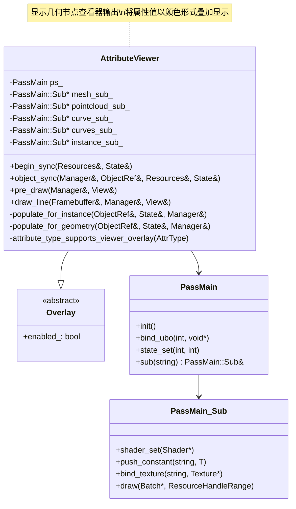
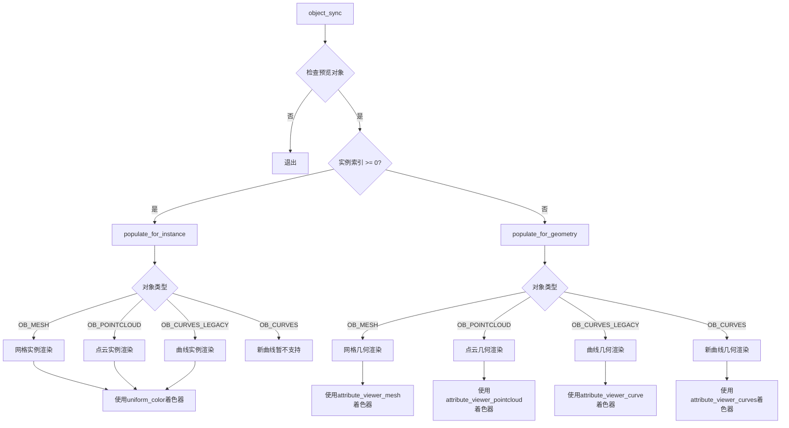
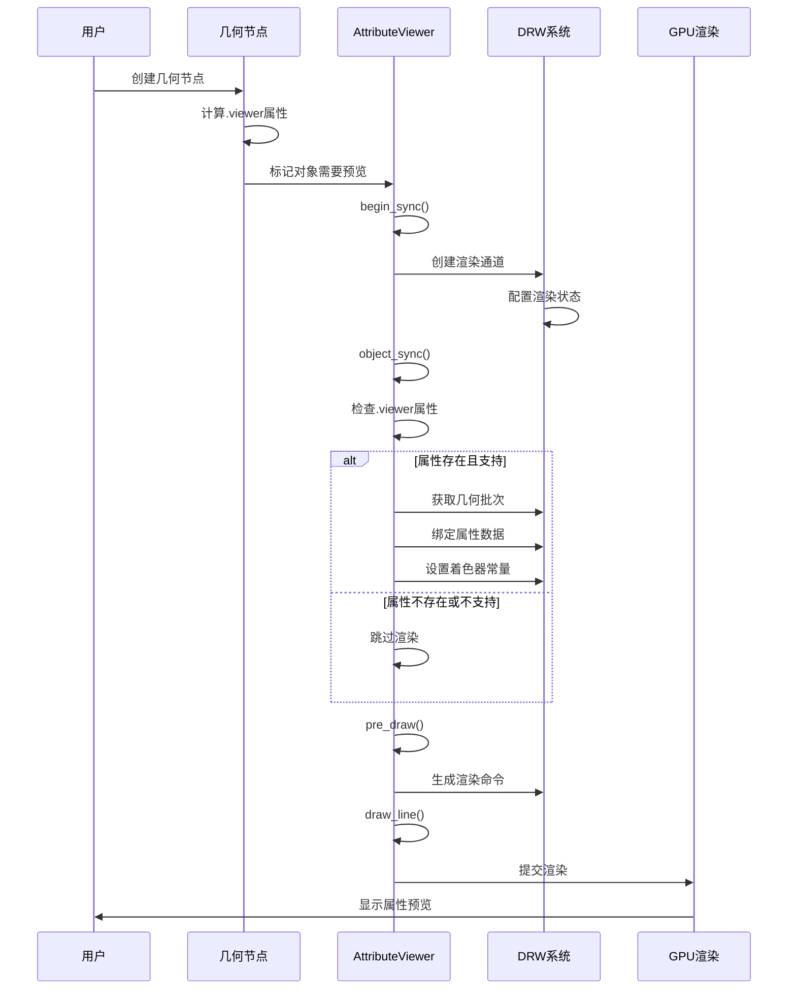
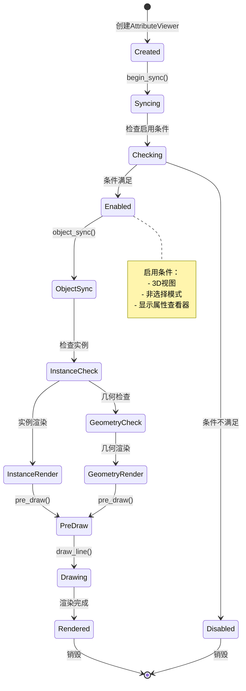

# 15. overlay_attribute_viewer.hh 详解

## 概述

`overlay_attribute_viewer.hh` 定义了 `AttributeViewer` 类，这是 Blender Overlay 引擎中的一个重要组件，专门用于显示几何节点查看器的输出。该组件将几何节点的属性值以顶点或面颜色的形式叠加显示在活动对象上。

## 类结构

### AttributeViewer 类

```cpp
class AttributeViewer : Overlay
```

继承自 `Overlay` 基类，实现了属性查看器的渲染功能。

#### 私有成员

- `PassMain ps_` - 主渲染通道
- `PassMain::Sub *mesh_sub_` - 网格子通道
- `PassMain::Sub *pointcloud_sub_` - 点云子通道  
- `PassMain::Sub *curve_sub_` - 曲线子通道
- `PassMain::Sub *curves_sub_` - 新曲线子通道
- `PassMain::Sub *instance_sub_` - 实例子通道

## 核心功能

### 1. 初始化同步 (begin_sync)

```cpp
void begin_sync(Resources &res, const State &state) final
```

**功能说明：**
- 初始化渲染通道和子通道
- 检查启用条件（3D视图、非选择模式、显示属性查看器）
- 绑定全局UBO和裁剪平面UBO
- 设置渲染状态

**启用条件：**
- 当前空间是3D视图
- 不是选择模式
- 状态显示属性查看器

### 2. 对象同步 (object_sync)

```cpp
void object_sync(Manager &manager, const ObjectRef &ob_ref, Resources &res, const State &state) final
```

**功能说明：**
- 检查对象是否为预览对象
- 处理实例属性和几何属性
- 根据对象类型调用相应的填充函数

**处理流程：**
1. 检查是否为预览基础几何体
2. 处理实例属性（如果有实例索引）
3. 处理几何属性

### 3. 预绘制 (pre_draw)

```cpp
void pre_draw(Manager &manager, View &view) final
```

**功能说明：**
- 生成渲染命令
- 为视图准备绘制指令

### 4. 绘制线条 (draw_line)

```cpp
void draw_line(Framebuffer &framebuffer, Manager &manager, View &view) final
```

**功能说明：**
- 绑定帧缓冲区
- 提交渲染通道

## 支持的几何类型

### 1. 网格 (OB_MESH)

**处理方式：**
- 查找 `.viewer` 属性
- 检查属性类型是否支持
- 使用网格表面批次进行渲染
- 支持透明度控制

### 2. 点云 (OB_POINTCLOUD)

**处理方式：**
- 查找 `.viewer` 属性
- 获取评估属性顶点缓冲区
- 绑定属性纹理
- 设置点云子通道

### 3. 传统曲线 (OB_CURVES_LEGACY)

**处理方式：**
- 检查曲线评估几何体
- 查找 `.viewer` 属性
- 使用曲线边缘线框批次

### 4. 新曲线 (OB_CURVES)

**处理方式：**
- 获取曲线几何体
- 查找 `.viewer` 属性
- 创建曲线纹理
- 支持点域和曲线域

### 5. 实例

**处理方式：**
- 获取实例组件
- 查找 `.viewer` 属性
- 根据实例对象类型进行渲染
- 使用统一颜色着色器

## 属性类型支持

### 支持的属性类型

```cpp
static bool attribute_type_supports_viewer_overlay(const bke::AttrType data_type)
{
  return !ELEM(data_type, bke::AttrType::Quaternion, bke::AttrType::Float4x4);
}
```

**不支持的类型：**
- `Quaternion` - 四元数
- `Float4x4` - 4x4浮点矩阵

**支持的类型：**
- 浮点数类型
- 整数类型
- 向量类型
- 颜色类型

## 渲染状态设置

```cpp
ps_.state_set(DRW_STATE_WRITE_COLOR | DRW_STATE_DEPTH_LESS_EQUAL | DRW_STATE_BLEND_ALPHA,
              state.clipping_plane_count);
```

**状态说明：**
- `DRW_STATE_WRITE_COLOR` - 启用颜色写入
- `DRW_STATE_DEPTH_LESS_EQUAL` - 深度测试（小于等于）
- `DRW_STATE_BLEND_ALPHA` - Alpha混合
- 支持裁剪平面

## 透明度控制

### 查看器属性透明度

```cpp
const float opacity = state.overlay.viewer_attribute_opacity;
```

通过 `state.overlay.viewer_attribute_opacity` 控制属性查看器的整体透明度。

### 实例颜色透明度

```cpp
color.a *= state.overlay.viewer_attribute_opacity;
```

实例颜色的Alpha通道乘以查看器透明度设置。

## 着色器配置

### 子通道着色器

- `mesh_sub_` - `attribute_viewer_mesh`
- `pointcloud_sub_` - `attribute_viewer_pointcloud`
- `curve_sub_` - `attribute_viewer_curve`
- `curves_sub_` - `attribute_viewer_curves`
- `instance_sub_` - `uniform_color`

### 着色器常量

- `opacity` - 透明度值
- `ucolor` - 统一颜色
- `is_point_domain` - 是否为点域（新曲线）

## 内存管理

### 资源句柄

```cpp
ResourceHandleRange res_handle = manager.unique_handle(ob_ref);
```

为每个对象创建唯一的资源句柄范围。

### 纹理绑定

```cpp
sub.bind_texture("attribute_tx", vertbuf);
sub.bind_texture("color_tx", texture);
```

将属性数据绑定到着色器纹理槽。

## 性能优化

### 早期退出

- 在 `begin_sync` 中检查启用条件
- 在 `object_sync` 中检查预览状态
- 在属性查找中检查属性存在性

### 批次重用

- 使用DRW缓存系统获取几何批次
- 避免重复创建相同的几何数据

### 条件渲染

- 只渲染具有 `.viewer` 属性的对象
- 跳过不支持的属性类型

## 调试支持

### 属性验证

- 检查属性元数据
- 验证属性类型支持
- 确保几何数据有效性

### 错误处理

- 空属性检查
- 无效几何体处理
- 着色器错误处理

## 使用示例

### 基本使用流程

```cpp
// 1. 创建属性查看器
AttributeViewer attribute_viewer;

// 2. 同步资源
attribute_viewer.begin_sync(resources, state);

// 3. 同步对象
for (auto &ob_ref : objects) {
    attribute_viewer.object_sync(manager, ob_ref, resources, state);
}

// 4. 预绘制
attribute_viewer.pre_draw(manager, view);

// 5. 绘制
attribute_viewer.draw_line(framebuffer, manager, view);
```

### 几何节点集成

属性查看器通常与几何节点系统配合使用：

1. 几何节点创建 `.viewer` 属性
2. 属性查看器检测并显示该属性
3. 用户可以实时查看节点计算结果

## 架构图



## 几何类型处理图



## 属性预览流程图



## 组件生命周期图



## 总结

`AttributeViewer` 类是 Blender Overlay 引擎中专门用于显示几何节点属性查看器输出的组件。它支持多种几何类型（网格、点云、曲线等），能够将几何节点计算的属性值以可视化的方式叠加显示在3D视图中。

该组件的设计特点包括：

1. **模块化设计** - 通过子通道支持不同几何类型
2. **性能优化** - 早期退出和条件渲染
3. **类型安全** - 严格的属性类型检查
4. **灵活配置** - 支持透明度和混合模式
5. **扩展性** - 易于添加新的几何类型支持

通过这个组件，用户可以实时查看几何节点的计算结果，大大提高了几何节点开发的效率和可视化体验。