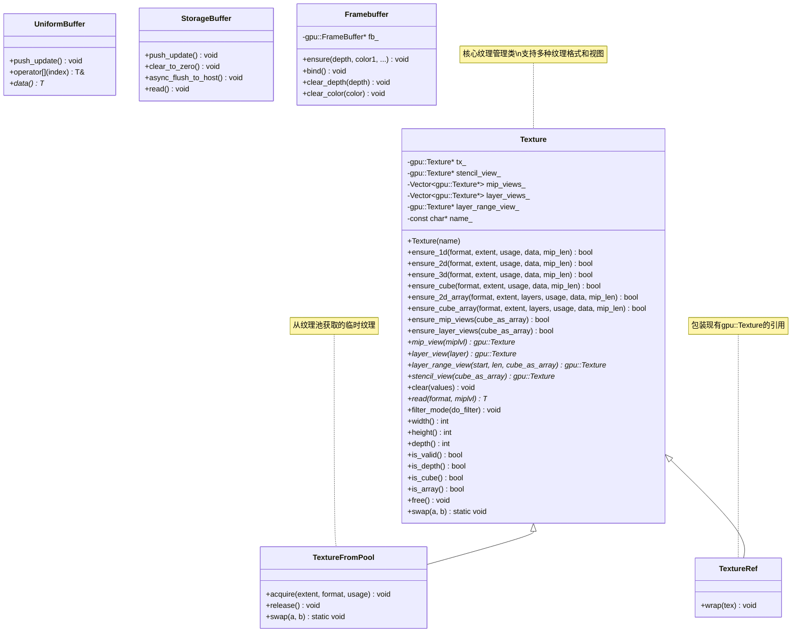
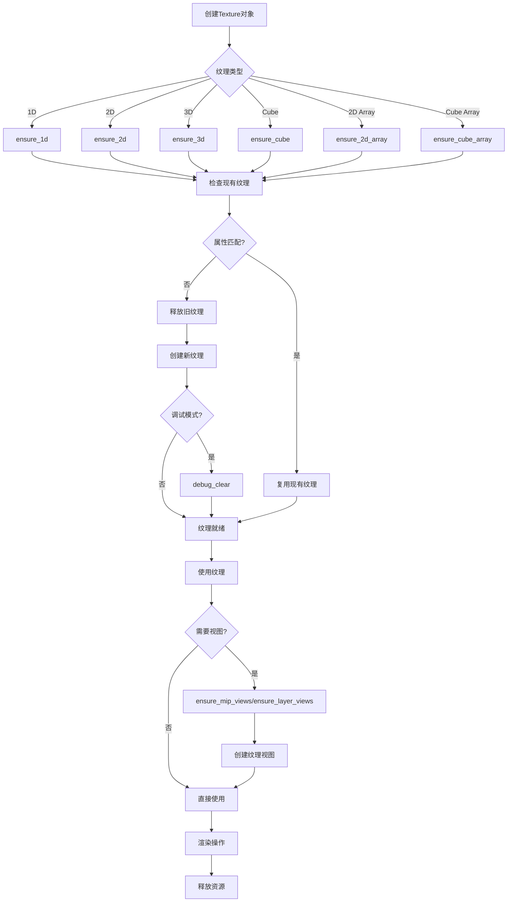
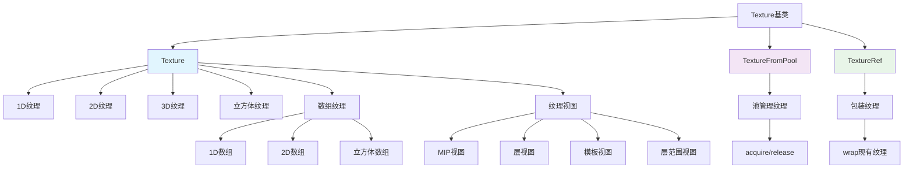
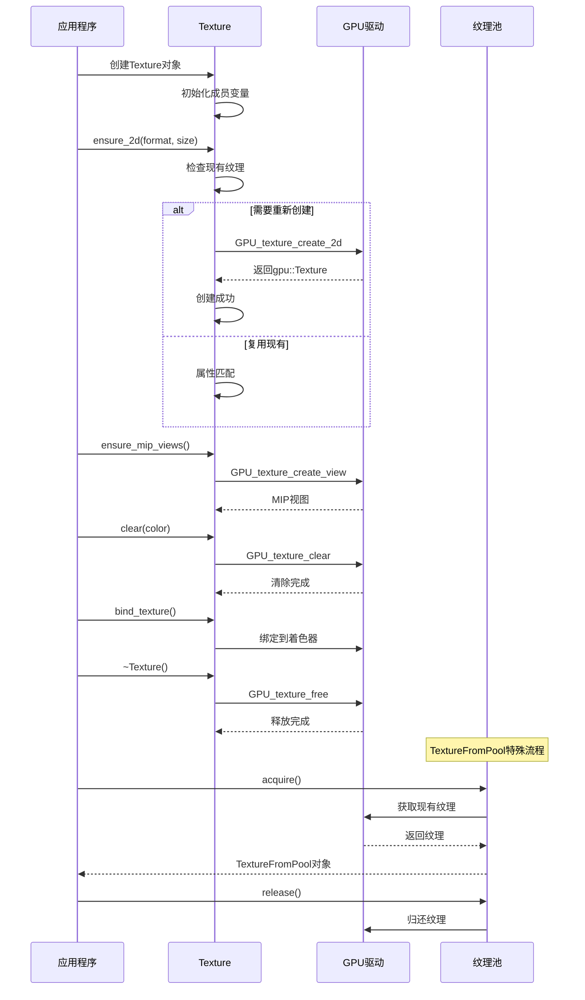

# 16. DRW_gpu_wrapper.hh - Texture类详解

## 概述

`DRW_gpu_wrapper.hh` 是 Blender Draw 模块的核心文件，提供了 GPU 对象的 C++ 包装类。这些包装类简化了 GPU 资源的管理，提供了类型安全的接口，并集成了 Blender 的内存管理系统。其中 `Texture` 类是最重要的组件之一，提供了完整的纹理管理功能。

## 文件结构

### 命名空间

```cpp
namespace blender::draw {
```

所有包装类都定义在 `blender::draw` 命名空间中。

### 主要组件

1. **缓冲区类** - UniformBuffer, StorageBuffer 等
2. **纹理类** - Texture, TextureFromPool, TextureRef
3. **帧缓冲区类** - Framebuffer
4. **工具类** - SwapChain

## Texture 类详解

### 类定义

```cpp
class Texture : NonCopyable {
protected:
    gpu::Texture *tx_ = nullptr;
    gpu::Texture *stencil_view_ = nullptr;
    Vector<gpu::Texture *, 0> mip_views_;
    Vector<gpu::Texture *, 0> layer_views_;
    gpu::Texture *layer_range_view_ = nullptr;
    const char *name_;
};
```

### 核心特性

- **不可复制** - 继承自 `NonCopyable`，只能移动
- **RAII 管理** - 自动管理 GPU 资源生命周期
- **视图支持** - 支持 MIP 视图、层视图、模板视图
- **类型安全** - 强类型的纹理创建和管理

## 构造函数

### 默认构造函数

```cpp
Texture(const char *name = "gpu::Texture") : name_(name) {}
```

创建一个空的纹理对象，不分配 GPU 资源。

### 1D 纹理构造函数

```cpp
Texture(const char *name,
        blender::gpu::TextureFormat format,
        eGPUTextureUsage usage,
        int extent,
        const float *data = nullptr,
        bool cubemap = false,
        int mip_len = 1)
```

### 2D 纹理构造函数

```cpp
Texture(const char *name,
        blender::gpu::TextureFormat format,
        eGPUTextureUsage usage,
        int2 extent,
        const float *data = nullptr,
        int mip_len = 1)
```

### 3D 纹理构造函数

```cpp
Texture(const char *name,
        blender::gpu::TextureFormat format,
        eGPUTextureUsage usage,
        int3 extent,
        const float *data = nullptr,
        int mip_len = 1)
```

### 数组纹理构造函数

```cpp
Texture(const char *name,
        blender::gpu::TextureFormat format,
        eGPUTextureUsage usage,
        int extent,
        int layers,
        const float *data = nullptr,
        bool cubemap = false,
        int mip_len = 1)
```

## 纹理确保方法

### 1D 纹理确保

```cpp
bool ensure_1d(blender::gpu::TextureFormat format,
               int extent,
               eGPUTextureUsage usage = GPU_TEXTURE_USAGE_GENERAL,
               const float *data = nullptr,
               int mip_len = 1)
```

### 2D 纹理确保

```cpp
bool ensure_2d(blender::gpu::TextureFormat format,
               int2 extent,
               eGPUTextureUsage usage = GPU_TEXTURE_USAGE_GENERAL,
               const float *data = nullptr,
               int mip_len = 1)
```

### 3D 纹理确保

```cpp
bool ensure_3d(blender::gpu::TextureFormat format,
               int3 extent,
               eGPUTextureUsage usage = GPU_TEXTURE_USAGE_GENERAL,
               const float *data = nullptr,
               int mip_len = 1)
```

### 立方体纹理确保

```cpp
bool ensure_cube(blender::gpu::TextureFormat format,
                 int extent,
                 eGPUTextureUsage usage = GPU_TEXTURE_USAGE_GENERAL,
                 float *data = nullptr,
                 int mip_len = 1)
```

### 数组纹理确保

```cpp
bool ensure_2d_array(blender::gpu::TextureFormat format,
                     int2 extent,
                     int layers,
                     eGPUTextureUsage usage = GPU_TEXTURE_USAGE_GENERAL,
                     const float *data = nullptr,
                     int mip_len = 1)

bool ensure_cube_array(blender::gpu::TextureFormat format,
                       int extent,
                       int layers,
                       eGPUTextureUsage usage = GPU_TEXTURE_USAGE_GENERAL,
                       const float *data = nullptr,
                       int mip_len = 1)
```

## 纹理视图管理

### MIP 视图

```cpp
bool ensure_mip_views(bool cube_as_array = false)
gpu::Texture *mip_view(int miplvl)
int mip_count() const
```

**功能说明：**
- 为每个 MIP 级别创建视图
- 支持立方体作为数组访问
- 自动管理视图生命周期

### 层视图

```cpp
bool ensure_layer_views(bool cube_as_array = false)
gpu::Texture *layer_view(int layer)
```

**功能说明：**
- 为数组的每一层创建视图
- 支持立方体纹理的层访问
- 动态创建和销毁视图

### 层范围视图

```cpp
gpu::Texture *layer_range_view(int layer_start, int layer_len, bool cube_as_array = false)
```

**功能说明：**
- 创建指定层的范围视图
- 支持动态范围调整
- 缓存机制避免重复创建

### 模板视图

```cpp
gpu::Texture *stencil_view(bool cube_as_array = false)
```

**功能说明：**
- 创建模板格式的视图
- 延迟创建机制
- 自动管理视图生命周期

## 纹理属性查询

### 尺寸信息

```cpp
int width() const
int height() const
int depth() const
int pixel_count() const
int3 size(int miplvl = 0) const
```

### 格式信息

```cpp
bool is_depth() const
bool is_stencil() const
bool is_integer() const
bool is_cube() const
bool is_array() const
```

### 状态信息

```cpp
bool is_valid() const
```

## 纹理操作

### 清除操作

```cpp
void clear(float4 values)
void clear(uint4 values)
void clear(int4 values)
void debug_clear()
```

**功能说明：**
- 支持不同数据类型的清除
- `debug_clear()` 用于调试未初始化数据
- 自动根据格式选择合适的清除方法

### 读取操作

```cpp
template<typename T> T *read(eGPUDataFormat format, int miplvl = 0)
```

**功能说明：**
- 读取纹理数据到 CPU 内存
- 支持模板类型推导
- 需要手动释放返回的内存

### 过滤模式

```cpp
void filter_mode(bool do_filter)
```

**功能说明：**
- 设置纹理过滤模式
- 控制纹理采样时的插值行为

## 资源管理

### 释放资源

```cpp
void free()
```

**功能说明：**
- 释放 GPU 纹理资源
- 清理所有相关视图
- 不销毁 Texture 对象本身

### 移动语义

```cpp
Texture(Texture &&other) = default;
Texture &operator=(Texture &&a)
```

**功能说明：**
- 支持高效的资源转移
- 自动管理源对象状态
- 避免不必要的资源复制

### 交换操作

```cpp
static void swap(Texture &a, Texture &b)
```

**功能说明：**
- 交换两个纹理的内容
- 高效的资源交换机制
- 保持对象有效性

## 特化纹理类

### TextureFromPool

```cpp
class TextureFromPool : public Texture, NonMovable
```

**特点：**
- 从纹理池获取资源
- 不可移动，只能从池中获取
- 必须在使用后释放回池中

**主要方法：**
```cpp
void acquire(int2 extent, blender::gpu::TextureFormat format, eGPUTextureUsage usage)
void release()
```

### TextureRef

```cpp
class TextureRef : public Texture
```

**特点：**
- 包装现有的 gpu::Texture
- 不拥有纹理资源
- 支持重新包装不同的纹理

**主要方法：**
```cpp
void wrap(gpu::Texture *tex)
```

## 缓冲区类

### UniformBuffer

```cpp
template<typename T> class UniformBuffer : public T, public detail::UniformCommon<T, 1, false>
```

**特点：**
- 继承自模板类型 T
- 直接访问数据成员
- 自动内存对齐

### UniformArrayBuffer

```cpp
template<typename T, int64_t len> class UniformArrayBuffer : public detail::UniformCommon<T, len, false>
```

**特点：**
- 固定长度的数组缓冲区
- 支持索引访问
- 16字节内存对齐

### StorageBuffer

```cpp
template<typename T, bool device_only = false> class StorageBuffer : public T, public detail::StorageCommon<T, 1, device_only>
```

**特点：**
- 大容量存储缓冲区
- 支持 device-only 模式
- 可读写访问

### StorageArrayBuffer

```cpp
template<typename T, int64_t len, bool device_only = false> class StorageArrayBuffer : public detail::StorageCommon<T, len, device_only>
```

**特点：**
- 动态大小调整
- 支持按需扩展
- 高效的内存管理

### StorageVectorBuffer

```cpp
template<typename T, int64_t len> class StorageVectorBuffer : public StorageArrayBuffer<T, len, false>
```

**特点：**
- 类似 std::vector 的接口
- 支持追加操作
- 自动容量管理

## Framebuffer 类

```cpp
class Framebuffer : NonCopyable
```

### 主要功能

```cpp
void ensure(GPUAttachment depth = GPU_ATTACHMENT_NONE,
            GPUAttachment color1 = GPU_ATTACHMENT_NONE,
            GPUAttachment color2 = GPU_ATTACHMENT_NONE,
            // ... 最多8个颜色附件
            )

void bind()
void clear_depth(float depth)
void clear_color(float4 color)
```

### 特点

- 支持多渲染目标
- 自动配置管理
- 移动语义支持

## SwapChain 工具类

```cpp
template<typename T, int64_t len> class SwapChain
```

### 功能

```cpp
void swap()
T &current()
T &previous()
T &next()
```

**用途：**
- 实现双缓冲/三缓冲
- 帧间数据交换
- 动画和渲染管线

## 内存管理策略

### GPU 资源生命周期

1. **创建** - 通过构造函数或 ensure 方法
2. **使用** - 通过各种操作方法
3. **销毁** - 通过析构函数或 free 方法

### 内存对齐

```cpp
BLI_STATIC_ASSERT(((sizeof(T) * len) % 16) == 0,
                  "Buffer size need to be aligned to size of float4.");
```

所有缓冲区都要求 16 字节对齐，确保 GPU 访问效率。

### 调试支持

```cpp
if (G.debug & G_DEBUG_GPU) {
    debug_clear();
}
```

在调试模式下自动清除未初始化数据。

## 使用示例

### 基本纹理使用

```cpp
// 创建2D纹理
draw::Texture color_tex("color_texture");
color_tex.ensure_2d(GPU_RGBA8, int2(1024, 1024));

// 清除纹理
color_tex.clear(float4(0.0f, 0.0f, 0.0f, 1.0f));

// 设置过滤模式
color_tex.filter_mode(true);

// 读取纹理数据
float *data = color_tex.read<float>(GPU_DATA_FLOAT, 0);
// ... 使用数据
MEM_freeN(data);
```

### 纹理视图使用

```cpp
// 创建MIP视图
color_tex.ensure_mip_views();
gpu::Texture *mip1 = color_tex.mip_view(1);

// 创建层视图
color_tex.ensure_layer_views();
gpu::Texture *layer0 = color_tex.layer_view(0);

// 创建层范围视图
gpu::Texture *layer_range = color_tex.layer_range_view(0, 4);
```

### 缓冲区使用

```cpp
// Uniform Buffer
struct UniformData {
    float4x4 model_matrix;
    float4 color;
};

draw::UniformBuffer<UniformData> ubo("uniforms");
ubo.model_matrix = model_matrix;
ubo.color = float4(1.0f, 0.0f, 0.0f, 1.0f);
ubo.push_update();

// Storage Buffer
draw::StorageArrayBuffer<float, 1024> ssbo("data");
for (int i = 0; i < 1024; i++) {
    ssbo[i] = float(i);
}
ssbo.push_update();
```

### 纹理池使用

```cpp
draw::TextureFromPool temp_tex("temp");
temp_tex.acquire(int2(512, 512), GPU_RGBA8);
// ... 使用纹理
temp_tex.release();
```

## 架构图



## 纹理管理流程图



## 纹理类型图



## GPU纹理操作图



## 性能优化策略

### 1. 延迟创建

- 纹理在首次使用时才创建
- 避免不必要的资源分配

### 2. 视图缓存

- MIP视图和层视图被缓存
- 避免重复创建相同视图

### 3. 纹理池

- `TextureFromPool` 复用纹理资源
- 减少GPU内存分配开销

### 4. 移动语义

- 高效的资源转移
- 避免深拷贝操作

### 5. 批量操作

- 支持批量清除和更新
- 减少GPU状态切换

## 调试和错误处理

### 调试模式

```cpp
if (G.debug & G_DEBUG_GPU) {
    debug_clear();
}
```

### 断言检查

```cpp
BLI_assert(index >= 0);
BLI_assert(index < len_);
BLI_assert(tx_ != nullptr);
```

### 错误处理

- 自动检查参数有效性
- 优雅处理资源不足
- 提供详细的错误信息

## 总结

`DRW_gpu_wrapper.hh` 中的 `Texture` 类和相关组件提供了完整的GPU纹理管理解决方案：

1. **类型安全** - 强类型的接口设计
2. **资源管理** - RAII和移动语义
3. **性能优化** - 延迟创建和视图缓存
4. **扩展性** - 支持多种纹理类型和视图
5. **调试支持** - 完善的错误检查和调试工具

这些包装类大大简化了GPU编程的复杂性，提供了现代C++的便利性，同时保持了高性能和低开销。通过这些类，开发者可以更专注于渲染逻辑而不是资源管理的细节。