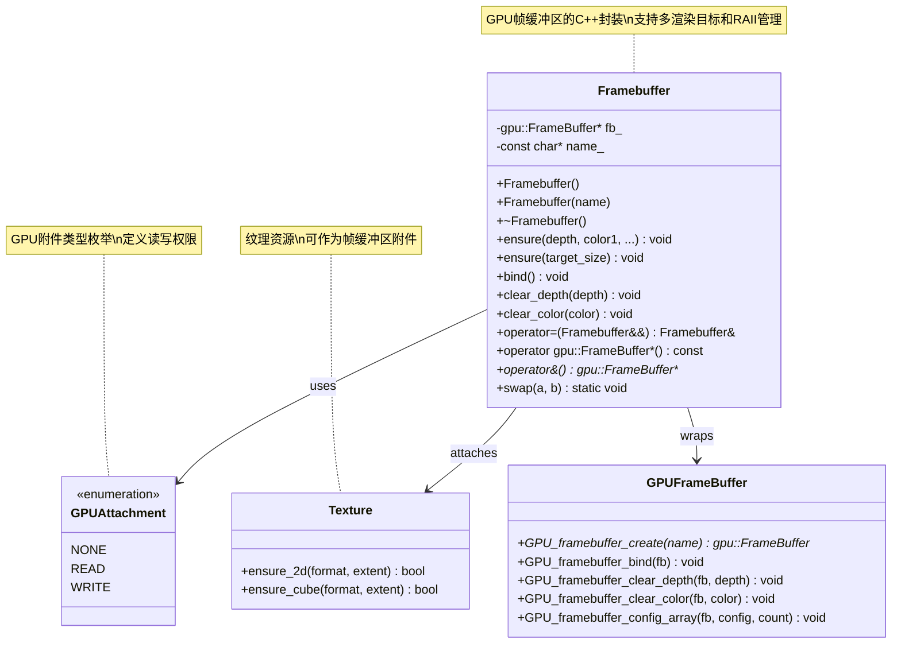
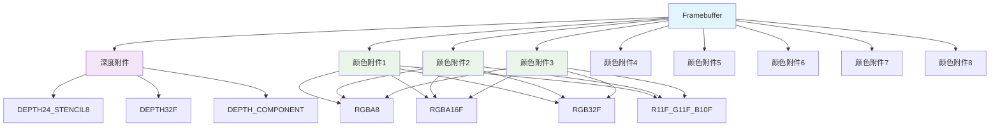
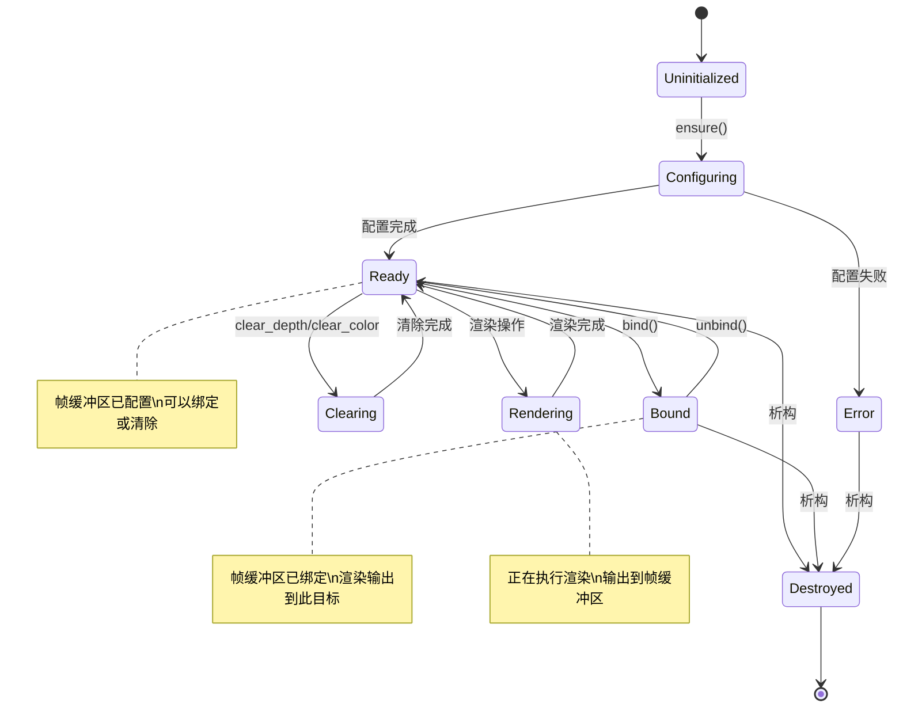

# 17. DRW_gpu_wrapper.hh - Framebuffer类详解

## 概述

`Framebuffer` 类是 `DRW_gpu_wrapper.hh` 中的核心组件之一，提供了对 GPU 帧缓冲区的完整封装。该类简化了帧缓冲区的创建、配置和管理，支持多渲染目标（MRT），并集成了 Blender 的资源管理系统。

## 类定义

```cpp
class Framebuffer : NonCopyable {
 private:
  gpu::FrameBuffer *fb_ = nullptr;
  const char *name_;

 public:
  Framebuffer() : name_("") {};
  Framebuffer(const char *name) : name_(name) {};
  
  ~Framebuffer();
  
  void ensure(GPUAttachment depth = GPU_ATTACHMENT_NONE,
              GPUAttachment color1 = GPU_ATTACHMENT_NONE,
              GPUAttachment color2 = GPU_ATTACHMENT_NONE,
              // ... 最多8个颜色附件
              );
  
  void ensure(int2 target_size);
  void bind();
  void clear_depth(float depth);
  void clear_color(float4 color);
  
  Framebuffer &operator=(Framebuffer &&a);
  operator gpu::FrameBuffer *() const;
  gpu::FrameBuffer **operator&();
  
  static void swap(Framebuffer &a, Framebuffer &b);
};
```

## 核心特性

- **不可复制** - 继承自 `NonCopyable`，只能移动
- **RAII 管理** - 自动管理 GPU 帧缓冲区生命周期
- **多渲染目标** - 支持最多8个颜色附件 + 1个深度附件
- **移动语义** - 支持高效的资源转移
- **类型安全** - 强类型的帧缓冲区管理

## 构造函数

### 默认构造函数

```cpp
Framebuffer() : name_("") {};
```

创建一个空的帧缓冲区对象，不分配 GPU 资源。

### 命名构造函数

```cpp
Framebuffer(const char *name) : name_(name) {};
```

创建一个带有名称的帧缓冲区对象，便于调试和资源管理。

## 析构函数

```cpp
~Framebuffer()
{
  GPU_FRAMEBUFFER_FREE_SAFE(fb_);
}
```

自动释放 GPU 帧缓冲区资源，确保无内存泄漏。

## 帧缓冲区配置

### 多附件配置

```cpp
void ensure(GPUAttachment depth = GPU_ATTACHMENT_NONE,
            GPUAttachment color1 = GPU_ATTACHMENT_NONE,
            GPUAttachment color2 = GPU_ATTACHMENT_NONE,
            GPUAttachment color3 = GPU_ATTACHMENT_NONE,
            GPUAttachment color4 = GPU_ATTACHMENT_NONE,
            GPUAttachment color5 = GPU_ATTACHMENT_NONE,
            GPUAttachment color6 = GPU_ATTACHMENT_NONE,
            GPUAttachment color7 = GPU_ATTACHMENT_NONE,
            GPUAttachment color8 = GPU_ATTACHMENT_NONE)
```

**功能说明：**
- 支持最多8个颜色附件（color1-color8）
- 支持1个深度附件（depth）
- 自动创建帧缓冲区对象（如果不存在）
- 配置附件数组并应用到帧缓冲区

**使用示例：**
```cpp
draw::Framebuffer gbuffer("gbuffer");
gbuffer.ensure(
  depth_tex,      // 深度附件
  color_tex1,     // 颜色附件1
  color_tex2,     // 颜色附件2
  color_tex3      // 颜色附件3
);
```

### 默认尺寸配置

```cpp
void ensure(int2 target_size)
```

**功能说明：**
- 创建默认配置的帧缓冲区
- 设置帧缓冲区的默认尺寸
- 用于简单的渲染目标

## 帧缓冲区操作

### 绑定操作

```cpp
void bind()
{
  GPU_framebuffer_bind(fb_);
}
```

**功能说明：**
- 将帧缓冲区绑定到当前渲染上下文
- 后续渲染操作将输出到该帧缓冲区

### 清除操作

```cpp
void clear_depth(float depth)
{
  GPU_framebuffer_clear_depth(fb_, depth);
}

void clear_color(float4 color)
{
  GPU_framebuffer_clear_color(fb_, color);
}
```

**功能说明：**
- 清除深度缓冲区为指定值
- 清除颜色缓冲区为指定颜色
- 支持清除所有颜色附件

## 资源管理

### 移动赋值

```cpp
Framebuffer &operator=(Framebuffer &&a)
{
  if (*this != a) {
    this->fb_ = a.fb_;
    this->name_ = a.name_;
    a.fb_ = nullptr;
  }
  return *this;
}
```

**功能说明：**
- 高效的资源转移
- 自动管理源对象状态
- 避免不必要的资源复制

### 类型转换

```cpp
operator gpu::FrameBuffer *() const
{
  return fb_;
}

gpu::FrameBuffer **operator&()
{
  return &fb_;
}
```

**功能说明：**
- 隐式转换为底层 GPU 帧缓冲区指针
- 支持获取帧缓冲区指针的地址
- 便于与底层 GPU API 交互

### 交换操作

```cpp
static void swap(Framebuffer &a, Framebuffer &b)
{
  std::swap(a.fb_, b.fb_);
  std::swap(a.name_, b.name_);
}
```

**功能说明：**
- 交换两个帧缓冲区的内容
- 高效的资源交换机制
- 保持对象有效性

## GPU附件类型

### 附件枚举

```cpp
typedef enum GPUAttachment {
  GPU_ATTACHMENT_NONE = 0,
  GPU_ATTACHMENT_READ = 1,
  GPU_ATTACHMENT_WRITE = 2,
} GPUAttachment;
```

### 常用附件配置

```cpp
// 深度附件
GPUAttachment depth = GPU_ATTACHMENT_WRITE;

// 颜色附件
GPUAttachment color = GPU_ATTACHMENT_WRITE;

// 无附件
GPUAttachment none = GPU_ATTACHMENT_NONE;
```

## 使用示例

### 基本帧缓冲区使用

```cpp
// 创建帧缓冲区
draw::Framebuffer fb("main_framebuffer");

// 配置附件
draw::Texture depth_tex("depth");
draw::Texture color_tex("color");
depth_tex.ensure_2d(GPU_DEPTH24_STENCIL8, int2(1920, 1080));
color_tex.ensure_2d(GPU_RGBA8, int2(1920, 1080));

// 确保帧缓冲区配置
fb.ensure(depth_tex, color_tex);

// 绑定并清除
fb.bind();
fb.clear_depth(1.0f);
fb.clear_color(float4(0.0f, 0.0f, 0.0f, 1.0f));

// 渲染操作...
// ...

// 解绑（通常绑定到默认帧缓冲区）
GPU_framebuffer_bind(nullptr);
```

### 多渲染目标（MRT）

```cpp
// 创建G-Buffer
draw::Framebuffer gbuffer("gbuffer");

// 创建多个渲染目标
draw::Texture albedo_tex("albedo");
draw::Texture normal_tex("normal");
draw::Texture material_tex("material");
draw::Texture depth_tex("depth");

albedo_tex.ensure_2d(GPU_RGBA8, int2(1920, 1080));
normal_tex.ensure_2d(GPU_RG16F, int2(1920, 1080));
material_tex.ensure_2d(GPU_RGBA8, int2(1920, 1080));
depth_tex.ensure_2d(GPU_DEPTH24_STENCIL8, int2(1920, 1080));

// 配置多渲染目标
gbuffer.ensure(
  depth_tex,      // 深度
  albedo_tex,     // 颜色附件1
  normal_tex,     // 颜色附件2
  material_tex    // 颜色附件3
);

gbuffer.bind();
// 渲染到多个目标...
```

### 帧缓冲区交换

```cpp
// 双缓冲实现
draw::Framebuffer front_buffer("front");
draw::Framebuffer back_buffer("back");

// 初始化
front_buffer.ensure(depth_tex, color_tex1);
back_buffer.ensure(depth_tex, color_tex2);

// 交换缓冲区
Framebuffer::swap(front_buffer, back_buffer);
```

## Framebuffer类架构图



## 帧缓冲管理流程图

```mermaid
flowchart TD
    A[创建Framebuffer对象] --> B[设置名称]
    B --> C{配置类型}
    
    C -->|多附件| D[ensure(depth, color1, ...)]
    C -->|默认尺寸| E[ensure(target_size)]
    
    D --> F{帧缓冲区存在?}
    E --> F
    
    F -->|否| G[GPU_framebuffer_create]
    F -->|是| H[复用现有]
    
    G --> I[创建附件数组]
    H --> I
    I --> J[GPU_framebuffer_config_array]
    J --> K[配置完成]
    
    K --> L[bind绑定]
    L --> M{清除操作?}
    
    M -->|清除深度| N[clear_depth]
    M -->|清除颜色| O[clear_color]
    M -->|两者都清除| P[clear_depth + clear_color]
    M -->|不清除| Q[直接渲染]
    
    N --> R[GPU_framebuffer_clear_depth]
    O --> S[GPU_framebuffer_clear_color]
    P --> R
    P --> S
    
    R --> T[渲染操作]
    S --> T
    Q --> T
    
    T --> U[解绑帧缓冲区]
    U --> V[析构自动释放]
    
    style A fill:#e1f5fe
    style K fill:#e8f5e8
    style T fill:#fff3e0
```

## 渲染目标图



## GPU状态管理图



## 性能优化策略

### 1. 延迟创建

- 帧缓冲区在首次调用 `ensure()` 时才创建
- 避免不必要的 GPU 资源分配

### 2. 附件复用

- 相同配置的帧缓冲区可以复用纹理附件
- 减少纹理创建和销毁开销

### 3. 批量操作

- 一次性配置所有附件
- 减少 GPU 状态切换

### 4. 移动语义

- 高效的帧缓冲区转移
- 避免深拷贝操作

## 错误处理

### 资源管理

```cpp
~Framebuffer()
{
  GPU_FRAMEBUFFER_FREE_SAFE(fb_);
}
```

使用 `GPU_FRAMEBUFFER_FREE_SAFE` 宏安全释放资源。

### 参数验证

- 自动检查附件有效性
- 验证帧缓冲区完整性
- 提供详细的错误信息

## 调试支持

### 命名支持

```cpp
Framebuffer(const char *name) : name_(name) {};
```

帧缓冲区名称用于：
- GPU 调试工具识别
- 性能分析标记
- 错误日志定位

### 状态查询

- 检查帧缓冲区完整性
- 验证附件配置
- 监控资源使用

## 与其他组件的集成

### 与Texture类集成

```cpp
draw::Texture color_tex("color");
color_tex.ensure_2d(GPU_RGBA8, int2(1920, 1080));

draw::Framebuffer fb("main");
fb.ensure(GPU_ATTACHMENT_NONE, color_tex);
```

### 与SwapChain集成

```cpp
draw::SwapChain<draw::Framebuffer, 2> double_buffer;
// 实现双缓冲渲染
```

## 总结

`Framebuffer` 类提供了完整的 GPU 帧缓冲区管理解决方案：

1. **简化接口** - 封装复杂的 GPU API
2. **类型安全** - 强类型的帧缓冲区管理
3. **资源管理** - RAII 和移动语义
4. **多目标支持** - 完整的 MRT 支持
5. **性能优化** - 延迟创建和高效操作
6. **调试友好** - 命名支持和错误检查

这些特性使得帧缓冲区的使用变得简单而安全，让开发者可以专注于渲染逻辑而不是资源管理的细节。