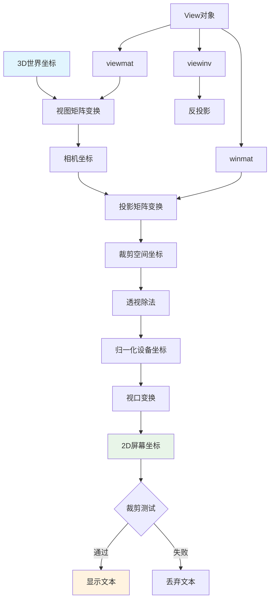
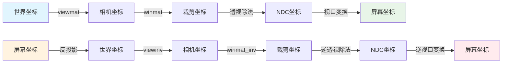
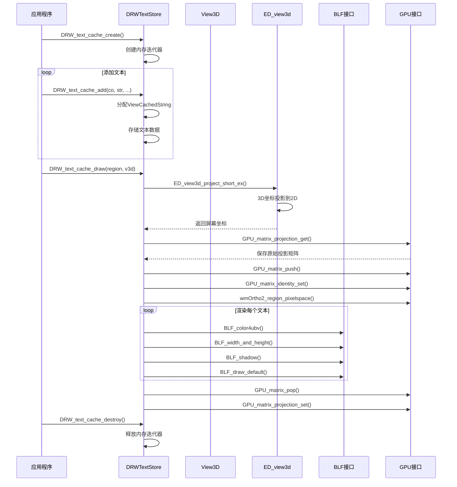

# 18. 3D投影和文本渲染核心函数详解

## 概述

3D投影和文本渲染是 Blender Draw 模块的重要组成部分，负责将3D世界坐标转换为2D屏幕坐标，并在屏幕上绘制文本信息。这些功能在编辑器界面、调试信息显示、测量标注等场景中发挥关键作用。

## 核心组件

### 3D投影系统
- **View类** - 视图矩阵管理
- **投影矩阵** - 3D到2D坐标转换
- **视锥体裁剪** - 可见性判断

### 文本渲染系统
- **DRWTextStore** - 文本缓存管理
- **ViewCachedString** - 文本数据结构
- **BLF接口** - 字体渲染引擎

## 3D投影核心函数

### View类投影方法

#### 基本投影矩阵获取

```cpp
const float4x4 &viewmat(int view_id = 0) const
{
  BLI_assert(view_id < view_len_);
  return data_[view_id].viewmat;
}

const float4x4 &viewinv(int view_id = 0) const
{
  BLI_assert(view_id < view_len_);
  return data_[view_id].viewinv;
}

const float4x4 &winmat(int view_id = 0) const
{
  BLI_assert(view_id < view_len_);
  return data_[view_id].winmat;
}
```

**功能说明：**
- `viewmat` - 视图矩阵（世界坐标到相机坐标）
- `viewinv` - 视图逆矩阵（相机坐标到世界坐标）
- `winmat` - 投影矩阵（相机坐标到裁剪空间）

#### 投影参数查询

```cpp
bool is_persp(int view_id = 0) const
{
  BLI_assert(view_id < view_len_);
  return data_[view_id].winmat[3][3] == 0.0f;
}

float far_clip(int view_id = 0) const
{
  BLI_assert(view_id < view_len_);
  if (is_persp(view_id)) {
    return -data_[view_id].winmat[3][2] / (data_[view_id].winmat[2][2] + 1.0f);
  }
  return -(data_[view_id].winmat[3][2] - 1.0f) / data_[view_id].winmat[2][2];
}

float near_clip(int view_id = 0) const
{
  BLI_assert(view_id < view_len_);
  if (is_persp(view_id)) {
    return -data_[view_id].winmat[3][2] / (data_[view_id].winmat[2][2] - 1.0f);
  }
  return -(data_[view_id].winmat[3][2] + 1.0f) / data_[view_id].winmat[2][2];
}
```

**功能说明：**
- `is_persp` - 判断是否为透视投影
- `far_clip` - 获取远裁剪面距离
- `near_clip` - 获取近裁剪面距离

#### 视图位置和方向

```cpp
const float3 &location(int view_id = 0) const
{
  BLI_assert(view_id < view_len_);
  return data_[view_id].viewinv.location();
}

const float3 &forward(int view_id = 0) const
{
  BLI_assert(view_id < view_len_);
  return data_[view_id].viewinv.z_axis();
}
```

**功能说明：**
- `location` - 获取相机在世界坐标中的位置
- `forward` - 获取相机朝向向量

### 3D坐标投影函数

#### ED_view3d_project_short_ex

```cpp
int ED_view3d_project_short_ex(const ARegion *region,
                               const float persmat[4][4],
                               const bool do_clip,
                               const float co[3],
                               short r_co[2],
                               const eV3DProjTest flag)
```

**功能说明：**
- 将3D坐标投影到2D屏幕坐标
- 支持裁剪测试
- 返回投影状态

**参数说明：**
- `region` - 视图区域
- `persmat` - 透视矩阵
- `do_clip` - 是否执行裁剪
- `co` - 输入3D坐标
- `r_co` - 输出2D坐标
- `flag` - 测试标志

#### GPU_matrix_unproject_3fv

```cpp
void GPU_matrix_unproject_3fv(const float win[3],
                              const float model[4][4],
                              const float proj[4][4],
                              const int view[4],
                              float r_co[3])
```

**功能说明：**
- 将2D屏幕坐标反投影到3D世界坐标
- 用于鼠标拾取和交互操作

## 文本渲染核心函数

### 文本缓存管理

#### DRWTextStore结构

```cpp
struct DRWTextStore {
  BLI_memiter *cache_strings;
};
```

#### ViewCachedString结构

```cpp
struct ViewCachedString {
  float vec[3];                    // 3D世界坐标
  union {
    uchar ub[4];                   // RGBA颜色
    int pack;                      // 打包的颜色值
  } col;
  short sco[2];                    // 2D屏幕坐标
  short xoffs, yoffs;              // 文本偏移
  short flag;                      // 文本标志
  int str_len;                     // 字符串长度
  bool shadow;                     // 是否绘制阴影
  bool align_center;               // 是否居中对齐
  char str[0];                     // 字符串内容（变长）
};
```

### 文本缓存操作

#### 创建和销毁缓存

```cpp
DRWTextStore *DRW_text_cache_create()
{
  DRWTextStore *dt = MEM_callocN<DRWTextStore>(__func__);
  dt->cache_strings = BLI_memiter_create(1 << 14); /* 16kb */
  return dt;
}

void DRW_text_cache_destroy(DRWTextStore *dt)
{
  if (dt == nullptr) {
    return;
  }
  BLI_memiter_destroy(dt->cache_strings);
  MEM_freeN(dt);
}
```

**功能说明：**
- `DRW_text_cache_create` - 创建文本缓存，分配16KB内存
- `DRW_text_cache_destroy` - 销毁文本缓存，释放内存

#### 添加文本到缓存

```cpp
void DRW_text_cache_add(DRWTextStore *dt,
                        const float co[3],
                        const char *str,
                        const int str_len,
                        short xoffs,
                        short yoffs,
                        short flag,
                        const uchar col[4],
                        const bool shadow,
                        const bool align_center)
```

**功能说明：**
- 将文本信息添加到缓存中
- 支持3D坐标、颜色、偏移等属性
- 使用内存迭代器高效存储

### 文本渲染函数

#### 主要渲染函数

```cpp
void DRW_text_cache_draw(const DRWTextStore *dt, 
                         const ARegion *region, 
                         const View3D *v3d)
```

**功能说明：**
- 渲染缓存中的所有文本
- 处理3D投影和2D显示
- 支持裁剪和可见性测试

#### 内部渲染实现

```cpp
static void drw_text_cache_draw_ex(const DRWTextStore *dt, const ARegion *region)
{
  ViewCachedString *vos;
  BLI_memiter_handle it;
  int col_pack_prev = 0;

  float original_proj[4][4];
  GPU_matrix_projection_get(original_proj);
  wmOrtho2_region_pixelspace(region);

  GPU_matrix_push();
  GPU_matrix_identity_set();

  BLF_default_size(blender::ui::style_get()->widget.points);
  const int font_id = BLF_set_default();

  float outline_dark_color[4] = {0, 0, 0, 0.8f};
  float outline_light_color[4] = {1, 1, 1, 0.8f};
  bool outline_is_dark = true;

  BLI_memiter_iter_init(dt->cache_strings, &it);
  while ((vos = static_cast<ViewCachedString *>(BLI_memiter_iter_step(&it)))) {
    if (vos->sco[0] != IS_CLIPPED) {
      // 颜色设置
      if (col_pack_prev != vos->col.pack) {
        BLF_color4ubv(font_id, vos->col.ub);
        const uchar lightness = srgb_to_grayscale_byte(vos->col.ub);
        outline_is_dark = lightness > 96;
        col_pack_prev = vos->col.pack;
      }

      // 居中对齐处理
      if (vos->align_center) {
        float width, height;
        BLF_width_and_height(font_id,
                             (vos->flag & DRW_TEXT_CACHE_STRING_PTR) ? *((const char **)vos->str) : vos->str,
                             vos->str_len,
                             &width,
                             &height);
        vos->xoffs -= short(width / 2.0f);
        vos->yoffs -= short(height / 2.0f);
      }

      // 阴影设置
      const int font_id = BLF_default();
      if (vos->shadow) {
        BLF_enable(font_id, BLF_SHADOW);
        BLF_shadow(font_id, FontShadowType::Outline,
                   outline_is_dark ? outline_dark_color : outline_light_color);
        BLF_shadow_offset(font_id, 0, 0);
      } else {
        BLF_disable(font_id, BLF_SHADOW);
      }

      // 绘制文本
      BLF_draw_default(float(vos->sco[0] + vos->xoffs),
                       float(vos->sco[1] + vos->yoffs),
                       2.0f,
                       (vos->flag & DRW_TEXT_CACHE_STRING_PTR) ? *((const char **)vos->str) : vos->str,
                       vos->str_len);
    }
  }

  GPU_matrix_pop();
  GPU_matrix_projection_set(original_proj);
}
```

## 3D投影流程图



## 文本渲染架构图

```mermaid
classDiagram
    class DRWTextStore {
        -BLI_memiter* cache_strings
        +DRW_text_cache_create() DRWTextStore*
        +DRW_text_cache_destroy(dt) void
        +DRW_text_cache_add(dt, co, str, ...) void
        +DRW_text_cache_draw(dt, region, v3d) void
    }
    
    class ViewCachedString {
        +float vec[3]
        +col{ub[4], pack}
        +short sco[2]
        +short xoffs, yoffs
        +short flag
        +int str_len
        +bool shadow
        +bool align_center
        +char str[0]
    }
    
    class BLFInterface {
        +BLF_default_size(size) void
        +BLF_set_default() int
        +BLF_color4ubv(font_id, col) void
        +BLF_width_and_height(font_id, str, len, w, h) void
        +BLF_enable(font_id, flag) void
        +BLF_shadow(font_id, type, color) void
        +BLF_draw_default(x, y, z, str, len) void
    }
    
    class GPUInterface {
        +GPU_matrix_projection_get(mat) void
        +GPU_matrix_push() void
        +GPU_matrix_identity_set() void
        +GPU_matrix_pop() void
        +GPU_matrix_projection_set(mat) void
    }
    
    class EDView3D {
        +ED_view3d_project_short_ex(region, persmat, ...) int
    }
    
    DRWTextStore --> ViewCachedString : contains
    DRWTextStore --> BLFInterface : uses
    DRWTextStore --> GPUInterface : uses
    DRWTextStore --> EDView3D : uses
    
    note for DRWTextStore "文本缓存管理器\n负责文本的批量渲染"
    note for ViewCachedString "单个文本项\n包含位置、颜色、内容等信息"
    note for BLFInterface "Blender字体库\n提供文本渲染功能"
```

## 矩阵变换图



## 函数调用关系图



## 使用示例

### 基本文本渲染

```cpp
// 创建文本缓存
DRWTextStore *text_cache = DRW_text_cache_create();

// 添加3D文本
float3 position = {1.0f, 2.0f, 3.0f};
const char *text = "Hello World";
uchar4 color = {255, 255, 255, 255};

DRW_text_cache_add(text_cache,
                   position,
                   text,
                   strlen(text),
                   0, 0,           // xoffs, yoffs
                   0,              // flag
                   color,
                   true,           // shadow
                   false);         // align_center

// 渲染文本
DRW_text_cache_draw(text_cache, region, v3d);

// 销毁缓存
DRW_text_cache_destroy(text_cache);
```

### 测量文本显示

```cpp
void DRW_text_edit_mesh_measure_stats(const ARegion *region,
                                      const View3D *v3d,
                                      const Object *ob,
                                      const UnitSettings &unit,
                                      DRWTextStore *dt)
{
  const short txt_flag = DRW_TEXT_CACHE_GLOBALSPACE;
  blender::uchar4 col = {0, 0, 0, 255};
  
  // 获取网格数据
  const Mesh *mesh = BKE_object_get_editmesh_eval_cage(ob);
  const BMEditMesh *em = mesh->runtime->edit_mesh.get();
  
  // 遍历边并显示长度
  BMIter iter;
  BMEdge *edge;
  BM_ITER_MESH(edge, &iter, em->bm, BM_EDGES_OF_MESH) {
    if (BM_elem_flag_test(edge, BM_ELEM_SELECT)) {
      float length = len_v3v3(edge->v1->co, edge->v2->co);
      char numstr[32];
      
      // 格式化长度文本
      if (unit.system) {
        bUnit_AsString(numstr, sizeof(numstr), 
                      double(length) * unit.scale_length, 
                      3, B_UNIT_LENGTH, &unit, false);
      } else {
        BLI_snprintf(numstr, sizeof(numstr), "%.3f", length);
      }
      
      // 计算边的中点
      float mid[3];
      mid_v3_v3v3(mid, edge->v1->co, edge->v2->co);
      
      // 添加文本到缓存
      DRW_text_cache_add(dt,
                         mid,
                         numstr,
                         strlen(numstr),
                         0, 10,          // 偏移
                         txt_flag,
                         col,
                         true,           // 阴影
                         true);          // 居中
    }
  }
}
```

### 3D坐标投影示例

```cpp
// 获取当前视图的投影矩阵
RegionView3D *rv3d = static_cast<RegionView3D *>(region->regiondata);
float persmat[4][4];
copy_m4_m4(persmat, rv3d->persmat);

// 3D坐标
float3 world_pos = {1.0f, 2.0f, 3.0f};
short screen_pos[2];

// 投影到屏幕坐标
int result = ED_view3d_project_short_ex(region,
                                       persmat,
                                       true,           // do_clip
                                       world_pos,
                                       screen_pos,
                                       V3D_PROJ_TEST_CLIP_BB | V3D_PROJ_TEST_CLIP_WIN);

if (result == V3D_PROJ_RET_OK) {
  // 投影成功，可以在此位置绘制文本
  printf("Screen position: %d, %d\n", screen_pos[0], screen_pos[1]);
}
```

## 性能优化策略

### 1. 批量渲染

- 所有文本先缓存，然后批量渲染
- 减少GPU状态切换
- 优化内存访问模式

### 2. 视锥体裁剪

- 只渲染可见的文本
- 提前剔除不可见对象
- 减少不必要的渲染操作

### 3. 内存管理

- 使用内存迭代器高效分配
- 避免频繁的内存分配/释放
- 预分配大块内存

### 4. 字体缓存

- BLF内部缓存字体纹理
- 复用相同大小的文本
- 减少字体渲染开销

## 调试和错误处理

### 调试标志

```cpp
// 文本缓存标志
#define DRW_TEXT_CACHE_STRING_PTR (1 << 0)
#define DRW_TEXT_CACHE_GLOBALSPACE (1 << 1)
#define DRW_TEXT_CACHE_LOCALCLIP (1 << 2)
```

### 投影状态

```cpp
// 投影返回值
#define V3D_PROJ_RET_OK 0
#define V3D_PROJ_RET_CLIP_NEAR 1
#define V3D_PROJ_RET_CLIP_FAR 2
#define V3D_PROJ_RET_CLIP_WIN 3
#define V3D_PROJ_RET_CLIP_BB 4
#define V3D_PROJ_RET_OVERFLOW 5
```

### 错误处理

- 自动检查参数有效性
- 处理内存分配失败
- 优雅处理投影失败

## 总结

3D投影和文本渲染系统提供了完整的3D世界到2D屏幕的转换和文本显示功能：

1. **完整的投影系统** - 支持透视和正交投影
2. **高效的文本渲染** - 批量处理和缓存优化
3. **灵活的文本样式** - 支持颜色、阴影、对齐等
4. **性能优化** - 视锥体裁剪和批量渲染
5. **调试友好** - 详细的错误检查和状态报告

这些功能为Blender的3D编辑器提供了强大的文本显示能力，支持测量标注、调试信息、用户界面文本等多种应用场景。