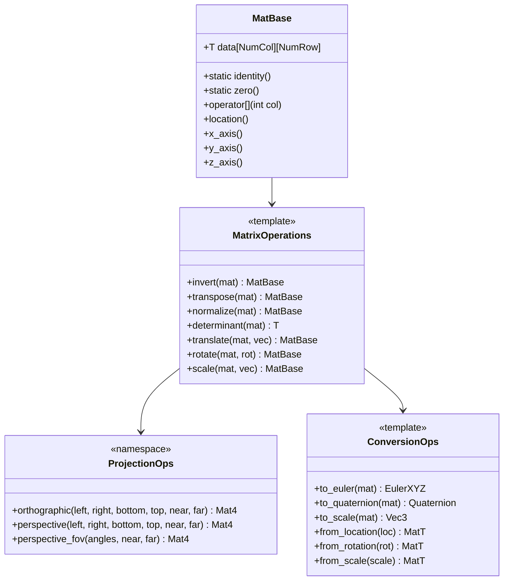
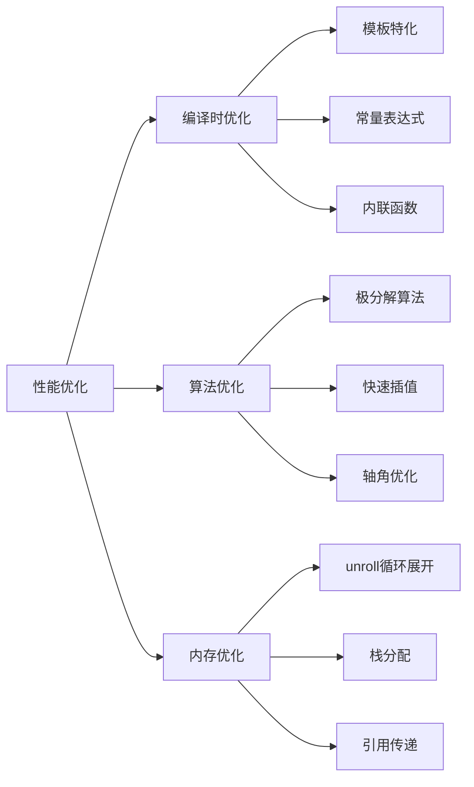
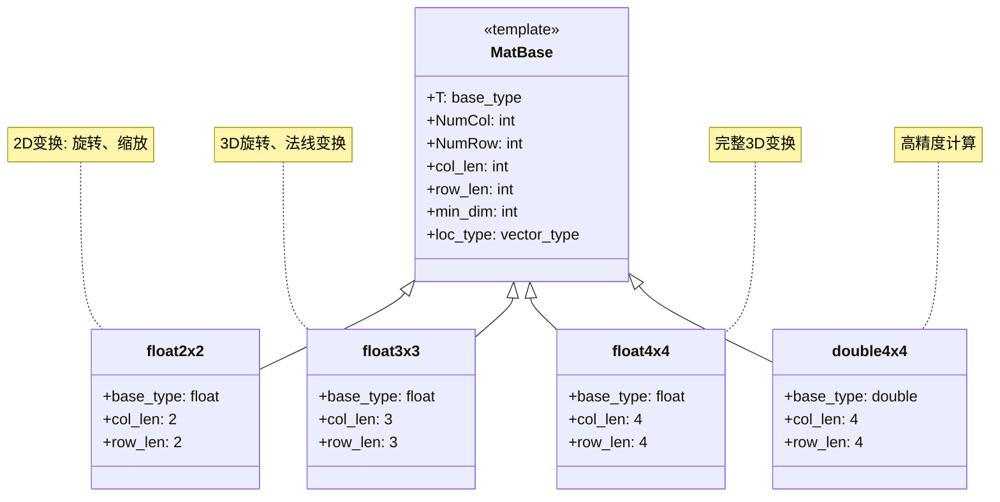

# 19. BLI_math_matrix.hh 矩阵运算详解

## 概述

`BLI_math_matrix.hh` 是 Blender 数学库的核心组件，提供了完整的矩阵运算功能。该文件实现了模板化的矩阵操作，支持不同数据类型和维度的矩阵计算，是 3D 图形变换、投影和几何计算的基础。

## 矩阵运算架构

```mermaid
graph TB
    A[BLI_math_matrix.hh] --> B[基础矩阵操作]
    A --> C[变换操作]
    A --> D[投影矩阵]
    A --> E[矩阵转换]
    A --> F[比较与测试]
    
    B --> B1[invert - 矩阵求逆]
    B --> B2[transpose - 转置]
    B --> B3[normalize - 归一化]
    B --> B4[determinant - 行列式]
    B --> B5[adjoint - 伴随矩阵]
    
    C --> C1[translate - 平移]
    C --> C2[rotate - 旋转]
    C --> C3[scale - 缩放]
    C --> C4[interpolate - 插值]
    
    D --> D1[orthographic - 正交投影]
    D --> D2[perspective - 透视投影]
    D --> D3[perspective_fov - 视野投影]
    
    E --> E1[to_euler - 转欧拉角]
    E --> E2[to_quaternion - 转四元数]
    E --> E3[to_scale - 提取缩放]
    E --> E4[from_rotation - 从旋转创建]
    
    F --> F1[is_equal - 相等判断]
    F --> F2[is_identity - 单位矩阵]
    F --> F3[is_orthogonal - 正交判断]
    F --> F4[is_negative - 负矩阵判断]
```



## 模板系统设计



## 核心功能模块

### 1. 基础矩阵操作

#### 矩阵求逆 (invert)
```cpp
template<typename T, int Size>
[[nodiscard]] MatBase<T, Size, Size> invert(const MatBase<T, Size, Size> &mat, bool &r_success);
```

**功能**: 计算方阵的逆矩阵，失败时返回零矩阵
**应用**: 坐标系变换、相机矩阵计算

#### 矩阵转置 (transpose)
```cpp
template<typename T, int NumCol, int NumRow>
[[nodiscard]] MatBase<T, NumCol, NumRow> transpose(const MatBase<T, NumRow, NumCol> &mat);
```

**功能**: 翻转矩阵对角线，非方阵也会翻转维度
**应用**: 法线变换、坐标系转换

#### 行列式计算 (determinant)
```cpp
template<typename T, Size> 
[[nodiscard]] T determinant(const MatBase<T, Size, Size> &mat);
```

**功能**: 计算矩阵行列式，表示单位立方体变换后的有符号体积
**应用**: 矩阵可逆性判断、体积计算

### 2. 变换操作

#### 平移变换 (translate)
```cpp
template<typename T, int NumCol, int NumRow, typename VectorT>
[[nodiscard]] MatBase<T, NumCol, NumRow> translate(const MatBase<T, NumCol, NumRow> &mat,
                                                   const VectorT &translation);
```

**优化**: 比 `mat * from_location(translation)` 更高效
**应用**: 物体位置更新、相机移动

#### 旋转变换 (rotate)
```cpp
template<typename T, int NumCol, int NumRow, typename RotationT>
[[nodiscard]] MatBase<T, NumCol, NumRow> rotate(const MatBase<T, NumCol, NumRow> &mat,
                                                 const RotationT &rotation);
```

**优化**: 针对基向量的轴角旋转进行特殊优化
**应用**: 物体旋转、动画关键帧

#### 缩放变换 (scale)
```cpp
template<typename T, int NumCol, int NumRow, typename VectorT>
[[nodiscard]] MatBase<T, NumCol, NumRow> scale(const MatBase<T, NumCol, NumRow> &mat,
                                                const VectorT &scale);
```

**应用**: 物体缩放、UI元素调整

### 3. 矩阵插值

#### 极分解插值 (interpolate)
```cpp
template<typename T>
[[nodiscard]] MatBase<T, 3, 3> interpolate(const MatBase<T, 3, 3> &a,
                                           const MatBase<T, 3, 3> &b,
                                           T t);
```

**特点**: 基于极分解的插值，比朴素插值慢5倍但结果更准确
**应用**: 动画平滑过渡、形变插值

#### 快速插值 (interpolate_fast)
```cpp
template<typename T>
[[nodiscard]] MatBase<T, 3, 3> interpolate_fast(const MatBase<T, 3, 3> &a,
                                                 const MatBase<T, 3, 3> &b,
                                                 T t);
```

**特点**: 速度更快，但在非均匀缩放时可能产生意外结果
**应用**: 实时渲染、预览计算

## 性能优化策略



### 1. 编译时优化

#### 模板特化
```cpp
// 针对常用维度的特化实现
extern template MatBase<float, 4, 4> from_rotation(const EulerXYZ &rotation);
extern template MatBase<float, 3, 3> from_rotation(const Quaternion &rotation);
```

#### 循环展开
```cpp
template<typename T, int NumCol, int NumRow>
MatBase<T, NumCol, NumRow> transpose(const MatBase<T, NumRow, NumCol> &mat)
{
  MatBase<T, NumCol, NumRow> result;
  unroll<NumCol>([&](auto i) { 
    unroll<NumRow>([&](auto j) { 
      result[i][j] = mat[j][i]; 
    }); 
  });
  return result;
}
```

### 2. 算法优化

#### 轴角旋转优化
```cpp
// 针对基向量旋转的特殊优化
if (axis_vec.x == T(1)) {
  unroll<MatT::row_len>([&](auto c) {
    result[2][c] = -angle_sin * mat[1][c] + angle_cos * mat[2][c];
    result[1][c] = angle_cos * mat[1][c] + angle_sin * mat[2][c];
  });
}
```

#### 四元数转换优化
```cpp
// Mike Day算法优化四元数提取
template<typename T> 
QuaternionBase<T> normalized_to_quat_fast(const MatBase<T, 3, 3> &mat)
{
  // 使用sqrt提高精度，避免归一化
  const T trace = 1.0f + mat[0][0] + mat[1][1] + mat[2][2];
  T s = 2.0f * math::sqrt(trace);
  // ...
}
```

## 矩阵类型系统



## 投影矩阵系统

### 1. 正交投影
```cpp
template<typename T>
MatBase<T, 4, 4> orthographic(T left, T right, T bottom, T top, T near_clip, T far_clip)
{
  const T x_delta = right - left;
  const T y_delta = top - bottom;
  const T z_delta = far_clip - near_clip;

  MatBase<T, 4, 4> mat = MatBase<T, 4, 4>::identity();
  if (x_delta != 0 && y_delta != 0 && z_delta != 0) {
    mat[0][0] = T(2.0) / x_delta;
    mat[3][0] = -(right + left) / x_delta;
    mat[1][1] = T(2.0) / y_delta;
    mat[3][1] = -(top + bottom) / y_delta;
    mat[2][2] = -T(2.0) / z_delta; /* NOTE: negate Z. */
    mat[3][2] = -(far_clip + near_clip) / z_delta;
  }
  return mat;
}
```

### 2. 透视投影
```cpp
template<typename T>
MatBase<T, 4, 4> perspective(T left, T right, T bottom, T top, T near_clip, T far_clip)
{
  const T x_delta = right - left;
  const T y_delta = top - bottom;
  const T z_delta = far_clip - near_clip;

  MatBase<T, 4, 4> mat = MatBase<T, 4, 4>::identity();
  if (x_delta != 0 && y_delta != 0 && z_delta != 0) {
    mat[0][0] = near_clip * T(2.0) / x_delta;
    mat[1][1] = near_clip * T(2.0) / y_delta;
    mat[2][0] = (right + left) / x_delta;
    mat[2][1] = (top + bottom) / y_delta;
    mat[2][2] = -(far_clip + near_clip) / z_delta;
    mat[2][3] = -1.0f;
    mat[3][2] = (-2.0f * near_clip * far_clip) / z_delta;
    mat[3][3] = 0.0f;
  }
  return mat;
}
```

## 坐标变换函数

### 点变换
```cpp
template<typename T>
VecBase<T, 3> transform_point(const MatBase<T, 4, 4> &mat, const VecBase<T, 3> &point)
{
  return mat.template view<3, 3>() * point + mat.location();
}
```

### 方向变换
```cpp
template<typename T>
VecBase<T, 3> transform_direction(const MatBase<T, 4, 4> &mat, const VecBase<T, 3> &direction)
{
  return mat.template view<3, 3>() * direction;
}
```

### 投影变换
```cpp
template<typename T, int N, int NumRow>
VecBase<T, N> project_point(const MatBase<T, N + 1, NumRow> &mat, const VecBase<T, N> &point)
{
  VecBase<T, N + 1> tmp(point, T(1));
  tmp = mat * tmp;
  return VecBase<T, N>(tmp) / math::abs(tmp[N]);
}
```

## 矩阵比较与测试

### 正交性测试
```cpp
template<typename MatT> 
[[nodiscard]] inline bool is_orthogonal(const MatT &mat)
{
  if (math::abs(math::dot(mat.x_axis(), mat.y_axis())) > 1e-5f) {
    return false;
  }
  if (math::abs(math::dot(mat.y_axis(), mat.z_axis())) > 1e-5f) {
    return false;
  }
  if (math::abs(math::dot(mat.z_axis(), mat.x_axis())) > 1e-5f) {
    return false;
  }
  return true;
}
```

### 标准正交测试
```cpp
template<typename MatT> 
[[nodiscard]] inline bool is_orthonormal(const MatT &mat)
{
  if (!is_orthogonal(mat)) {
    return false;
  }
  if (math::abs(math::length_squared(mat.x_axis()) - 1) > 1e-5f) {
    return false;
  }
  if (math::abs(math::length_squared(mat.y_axis()) - 1) > 1e-5f) {
    return false;
  }
  if (math::abs(math::length_squared(mat.z_axis()) - 1) > 1e-5f) {
    return false;
  }
  return true;
}
```

## 特殊矩阵构造

### 从旋转构造
```cpp
template<typename MatT, typename RotationT>
[[nodiscard]] MatT from_rotation(const RotationT &rotation)
{
  return detail::from_rotation<typename MatT::base_type, MatT::col_len, MatT::row_len>(rotation);
}
```

### 从位置、旋转、缩放构造
```cpp
template<typename MatT, typename RotationT, int ScaleDim>
[[nodiscard]] MatT from_loc_rot_scale(const typename MatT::loc_type &location,
                                      const RotationT &rotation,
                                      const VecBase<typename MatT::base_type, ScaleDim> &scale)
{
  using MatRotT = MatBase<typename MatT::base_type, MatT::loc_type::type_length, MatT::loc_type::type_length>;
  MatT mat = MatT(from_rot_scale<MatRotT>(rotation, scale));
  mat.location() = location;
  return mat;
}
```

## 应用场景

### 1. 3D物体变换
- 位置更新: `translate(matrix, position)`
- 旋转动画: `rotate(matrix, rotation)`
- 缩放操作: `scale(matrix, scale_vector)`

### 2. 相机系统
- 视图矩阵: `from_loc_rot(camera_pos, camera_rot)`
- 投影矩阵: `perspective()` 或 `orthographic()`
- MVP矩阵: `projection * view * model`

### 3. 法线变换
```cpp
// 使用逆转置矩阵变换法线
Mat3 normal_matrix = transpose(invert(Mat3(model_matrix)));
Vec3 transformed_normal = transform_direction(normal_matrix, normal);
```

### 4. 骨骼动画
```cpp
// 骨骼变换矩阵计算
Mat4 bone_matrix = from_loc_rot_scale(bone_pos, bone_rot, bone_scale);
Mat4 skinning_matrix = inverse(bind_pose_matrix) * bone_matrix;
```

## 性能考虑

1. **编译时优化**: 使用模板和常量表达式
2. **内存局部性**: 栈分配，避免动态内存
3. **算法选择**: 根据用途选择合适的插值方法
4. **精度平衡**: 在精度和性能间找到平衡点

## 总结

`BLI_math_matrix.hh` 提供了完整的矩阵运算框架，通过模板化设计支持多种数据类型和维度。其优化的算法实现和编译时技术确保了高性能，是 Blender 3D 系统的核心数学基础。该模块的设计体现了现代 C++ 的最佳实践，为复杂的 3D 图形计算提供了可靠高效的解决方案。