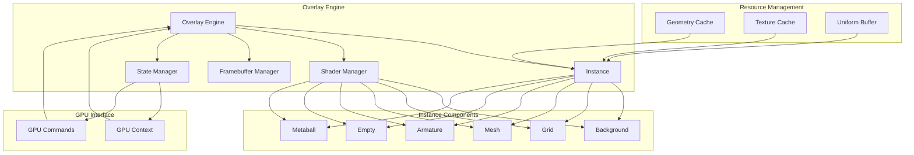
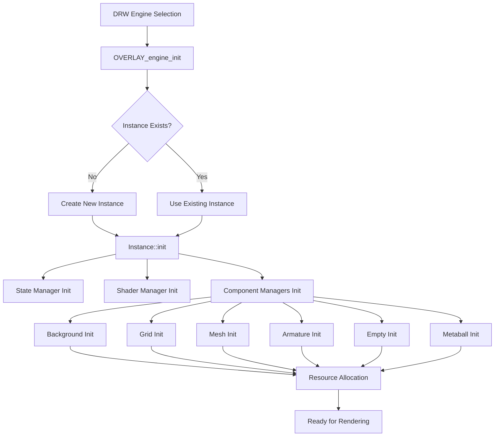
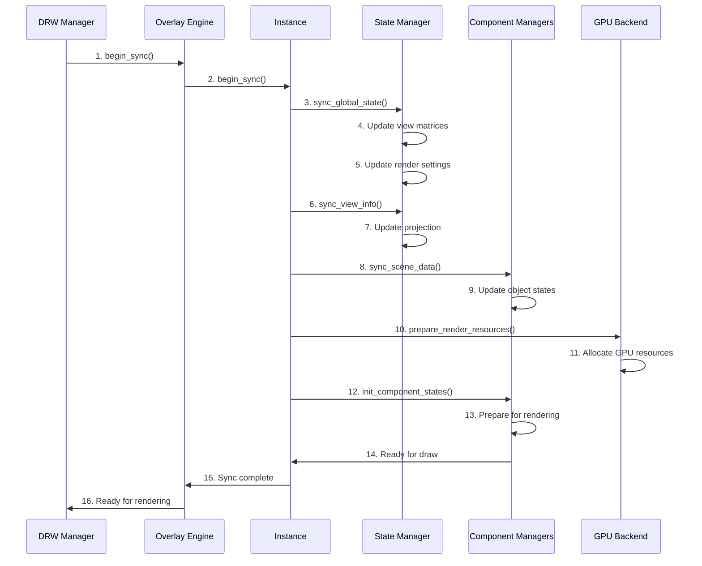
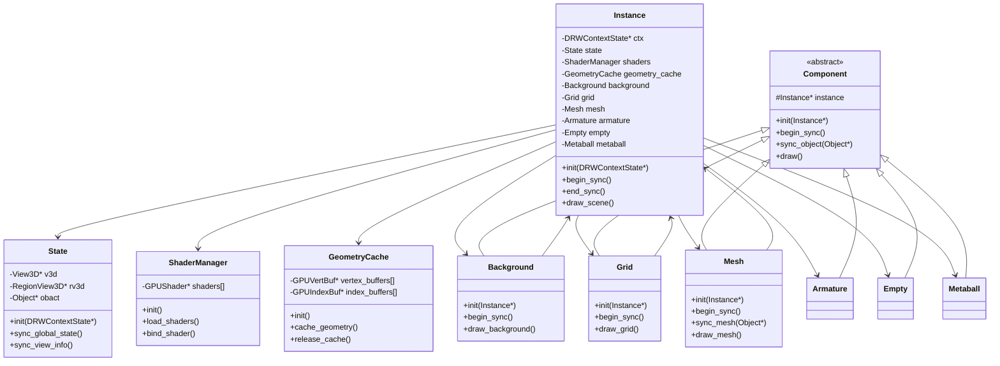

# Overlay引擎架构详解-引擎初始化流程

## 概述

Overlay引擎是Blender渲染系统中的一个重要组件，负责渲染3D视图中的覆盖层元素，包括网格线、边界框、骨骼、空物体等UI相关的可视化元素。本文档详细解析Overlay引擎的架构和初始化流程。

## Overlay引擎架构

### 核心组件

Overlay引擎由以下几个核心组件构成：

1. **Overlay Engine**: 主引擎类，管理整个Overlay渲染流程
2. **Instance**: 实例管理类，负责具体的渲染实例
3. **Shader Manager**: 着色器管理器
4. **Geometry Cache**: 几何数据缓存
5. **State Manager**: 渲染状态管理器

### 模块结构

```
Overlay Engine
├── Instance
│   ├── Background
│   ├── Grid
│   ├── Mesh
│   ├── Armature
│   ├── Empty
│   └── Metaball
├── Shaders
├── Framebuffers
└── State Management
```

### Overlay引擎架构图



## 引擎初始化流程

### 1. 引擎创建

Overlay引擎的创建过程始于DRW系统选择渲染引擎时：

```cpp
// 引擎初始化入口
void OVERLAY_engine_init(void *vedata)
{
    OVERLAY_Data *data = (OVERLAY_Data *)vedata;
    // 初始化引擎数据结构
}
```

### 2. Instance创建

Instance是Overlay引擎的核心工作单元，负责管理具体的渲染任务：

```cpp
class Instance {
private:
    // 渲染状态
    State state;
    
    // 组件管理器
    Background background;
    Grid grid;
    Mesh mesh;
    Armature armature;
    Empty empty;
    Metaball metaball;
    
    // 着色器管理
    ShaderManager shaders;
    
    // 缓存管理
    GeometryCache geometry_cache;
};
```

### Overlay引擎初始化流程图



### 3. begin_sync流程

`begin_sync`是每帧渲染开始时的同步过程，负责更新渲染状态和数据：

#### 3.1 状态同步
- 更新视图矩阵
- 更新渲染设置
- 更新显示选项

#### 3.2 数据同步
- 同步场景数据
- 更新对象状态
- 准备渲染数据

#### 3.3 资源准备
- 分配GPU资源
- 更新着色器参数
- 准备渲染目标

### begin_sync流程图



### 4. 组件初始化顺序

Overlay引擎的组件按照依赖关系进行初始化：

1. **基础组件** (State, Shaders)
2. **几何组件** (Grid, Background)
3. **对象组件** (Mesh, Armature, Empty, Metaball)
4. **后处理组件** (Anti-aliasing, Effects)

### 组件初始化顺序图

```mermaid
gantt
    title Overlay Engine Component Initialization Timeline
    dateFormat X
    axisFormat %s
    
    section Phase 1: Foundation
    State Manager     :active, state, 0, 2
    Shader Manager    :active, shader, 1, 3
    
    section Phase 2: Geometry
    Background        :active, bg, 3, 5
    Grid             :active, grid, 4, 6
    
    section Phase 3: Objects
    Mesh             :active, mesh, 6, 8
    Armature         :active, arm, 7, 9
    Empty            :active, empty, 8, 10
    Metaball         :active, meta, 9, 11
    
    section Phase 4: Post-Processing
    Anti-aliasing    :active, aa, 11, 13
    Effects          :active, fx, 12, 14
```



## 详细初始化流程

### Phase 1: 引擎级初始化

```cpp
void OVERLAY_engine_init(void *vedata)
{
    OVERLAY_Data *data = (OVERLAY_Data *)vedata;
    
    // 初始化默认状态
    const DRWContextState *draw_ctx = DRW_context_state_get();
    
    // 创建Instance
    if (!data->instance) {
        data->instance = new Instance();
    }
    
    // 初始化Instance
    data->instance->init(draw_ctx);
}
```

### Phase 2: Instance初始化

```cpp
void Instance::init(const DRWContextState *draw_ctx)
{
    // 保存上下文
    this->ctx = draw_ctx;
    
    // 初始化状态管理器
    state.init(draw_ctx);
    
    // 初始化着色器管理器
    shaders.init();
    
    // 初始化各个组件
    background.init(this);
    grid.init(this);
    mesh.init(this);
    armature.init(this);
    empty.init(this);
    metaball.init(this);
}
```

### Instance类创建过程图



### Phase 3: begin_sync详细流程

```cpp
void Instance::begin_sync()
{
    // 1. 同步全局状态
    sync_global_state();
    
    // 2. 同步视图信息
    sync_view_info();
    
    // 3. 同步渲染设置
    sync_render_settings();
    
    // 4. 同步场景数据
    sync_scene_data();
    
    // 5. 准备渲染资源
    prepare_render_resources();
    
    // 6. 初始化组件状态
    init_component_states();
}
```

## 组件详细说明

### Background组件

负责渲染背景颜色和渐变效果：
- 支持纯色背景
- 支持渐变背景
- 支持世界环境背景

### Grid组件

负责渲染3D网格：
- 支持不同网格密度
- 支持网格颜色自定义
- 支持网格轴对齐

### Mesh组件

负责渲染网格对象：
- 支持实体模式显示
- 支持线框模式显示
- 支持材质预览

### Armature组件

负责渲染骨骼系统：
- 支持骨骼线框显示
- 支持骨骼实体显示
- 支持骨骼关系显示

### Empty组件

负责渲染空物体：
- 支持不同空物体类型
- 支持自定义显示大小
- 支持颜色自定义

## 性能优化

### 实例化渲染

Overlay引擎大量使用实例化渲染来提高性能：
- 相同类型的对象使用实例化渲染
- 减少Draw Call数量
- 提高GPU利用率

### 数据缓存

- 几何数据缓存
- 着色器参数缓存
- 渲染状态缓存

### 条件渲染

- 视锥剔除
- 遮挡剔除
- 距离剔除

## 调试和诊断

Overlay引擎提供了丰富的调试功能：
- 渲染统计信息
- 性能分析工具
- 可视化调试选项

## 总结

Overlay引擎是Blender 3D视图渲染的核心组件，通过模块化设计和高效的渲染策略，为用户提供了流畅的3D编辑体验。理解其初始化流程对于Blender渲染系统的开发和优化具有重要意义。