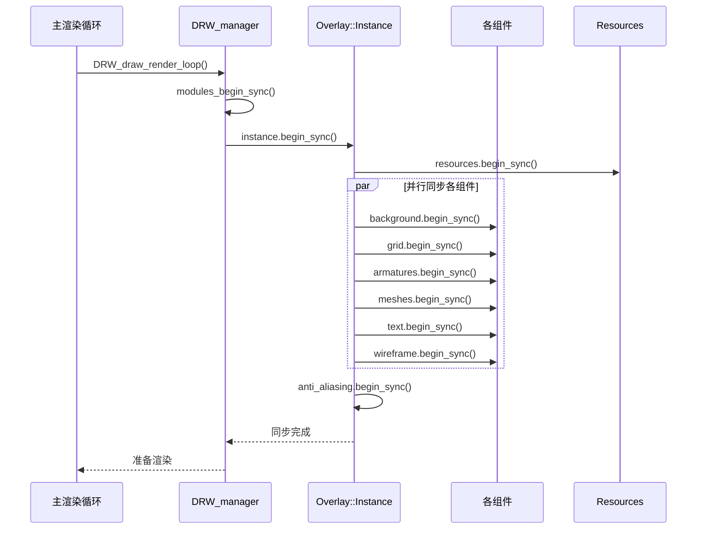
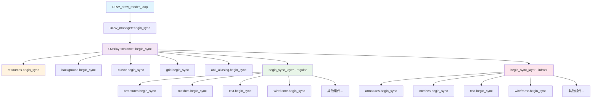
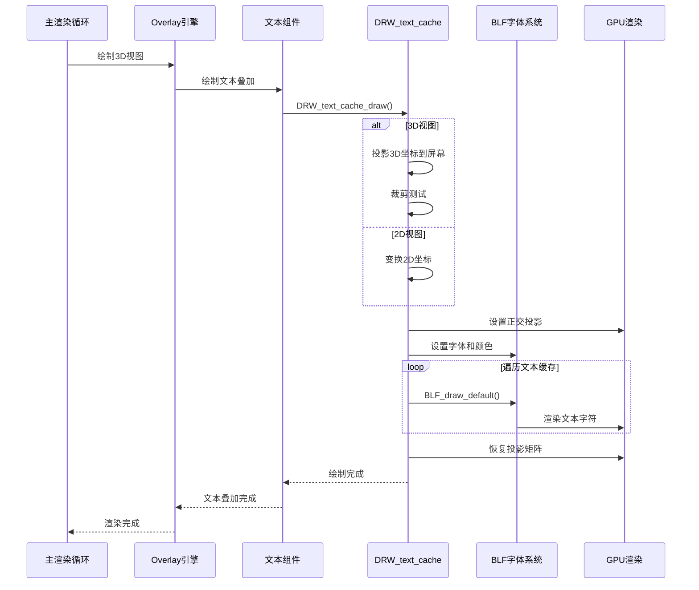
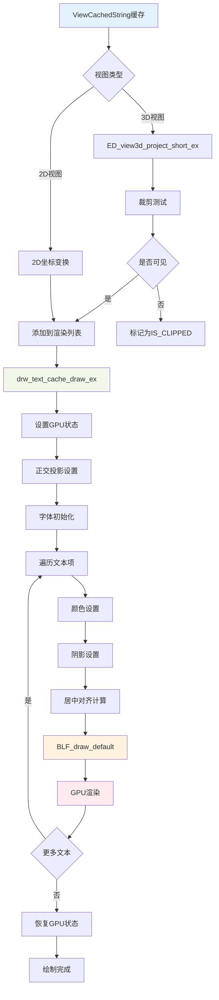
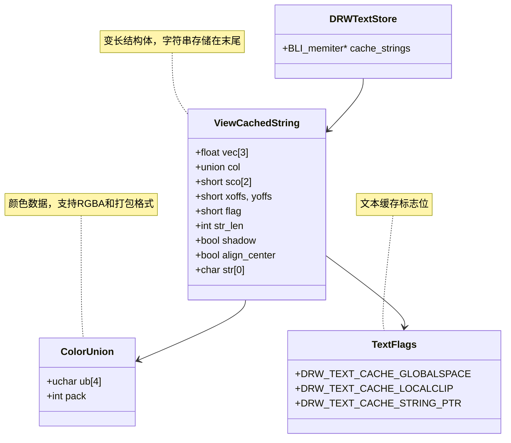
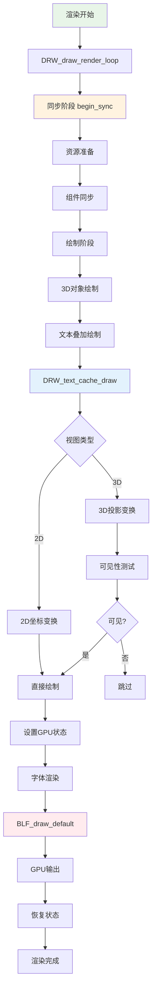

# 20. 调用堆栈详解 begin_sync 和 DRW_text_cache_draw

## 概述

本文档详细分析 Blender 绘制系统中两个关键函数的调用堆栈：`begin_sync` 和 `DRW_text_cache_draw`。这两个函数分别负责渲染同步阶段的初始化和文本缓存的绘制，是 Overlay 引擎和文本渲染系统的核心组件。

## begin_sync 调用堆栈流程



## begin_sync 函数调用关系图



## begin_sync 详细调用路径

### 1. 主入口点
```cpp
// source/blender/draw/intern/draw_context.cc:972
void DRW_draw_render_loop(DRWContext *C)
{
  // ...
  data->modules_begin_sync();
  // ...
}

// source/blender/draw/intern/draw_context.cc:392
void DRWData::modules_begin_sync()
{
  DRW_curves_begin_sync(this);
  DRW_smoke_begin_sync(this);
  // ...
}

// source/blender/draw/intern/draw_context.cc:998
view_data_active->manager->begin_sync(this->obact);
view_data_active->foreach_enabled_engine([&](DrawEngine &instance) { 
  instance.begin_sync(); 
});
```

### 2. Overlay 引擎同步
```cpp
// source/blender/draw/engines/overlay/overlay_instance.cc:445
void Instance::begin_sync()
{
  resources.begin_sync(state.clipping_plane_count);
  
  background.begin_sync(resources, state);
  cursor.begin_sync(resources, state);
  image_prepass.begin_sync(resources, state);
  motion_paths.begin_sync(resources, state);
  origins.begin_sync(resources, state);
  outline.begin_sync(resources, state);
  
  // 同步常规层
  auto begin_sync_layer = [&](OverlayLayer &layer) {
    layer.armatures.begin_sync(resources, state);
    layer.attribute_viewer.begin_sync(resources, state);
    layer.attribute_texts.begin_sync(resources, state);
    layer.axes.begin_sync(resources, state);
    layer.bounds.begin_sync(resources, state);
    layer.cameras.begin_sync(resources, state);
    layer.curves.begin_sync(resources, state);
    layer.text.begin_sync(resources, state);
    layer.empties.begin_sync(resources, state);
    layer.facing.begin_sync(resources, state);
    layer.fade.begin_sync(resources, state);
    layer.force_fields.begin_sync(resources, state);
    layer.fluids.begin_sync(resources, state);
    layer.grease_pencil.begin_sync(resources, state);
    layer.lattices.begin_sync(resources, state);
    layer.lights.begin_sync(resources, state);
    layer.light_probes.begin_sync(resources, state);
    layer.metaballs.begin_sync(resources, state);
    layer.meshes.begin_sync(resources, state);
    layer.mesh_uvs.begin_sync(resources, state);
    layer.mode_transfer.begin_sync(resources, state);
    layer.names.begin_sync(resources, state);
    layer.paints.begin_sync(resources, state);
    layer.particles.begin_sync(resources, state);
    layer.pointclouds.begin_sync(resources, state);
    layer.prepass.begin_sync(resources, state);
    layer.relations.begin_sync(resources, state);
    layer.speakers.begin_sync(resources, state);
    layer.sculpts.begin_sync(resources, state);
    layer.wireframe.begin_sync(resources, state);
  };
  
  begin_sync_layer(regular);
  begin_sync_layer(infront);
  
  grid.begin_sync(resources, state);
  anti_aliasing.begin_sync(resources, state);
  xray_fade.begin_sync(resources, state);
}
```

## DRW_text_cache_draw 调用堆栈流程



## DRW_text_cache_draw 数据流图



## DRW_text_cache_draw 核心实现

### 1. 主函数入口
```cpp
// source/blender/draw/intern/draw_manager_text.cc:201
void DRW_text_cache_draw(const DRWTextStore *dt, const ARegion *region, const View3D *v3d)
{
  ViewCachedString *vos;
  if (v3d) {
    RegionView3D *rv3d = static_cast<RegionView3D *>(region->regiondata);
    int tot = 0;
    
    /* 投影并测试可见性 */
    BLI_memiter_handle it;
    BLI_memiter_iter_init(dt->cache_strings, &it);
    while ((vos = static_cast<ViewCachedString *>(BLI_memiter_iter_step(&it)))) {
      if (ED_view3d_project_short_ex(
              region,
              (vos->flag & DRW_TEXT_CACHE_GLOBALSPACE) ? rv3d->persmat : rv3d->persmatob,
              (vos->flag & DRW_TEXT_CACHE_LOCALCLIP) != 0,
              vos->vec,
              vos->sco,
              V3D_PROJ_TEST_CLIP_BB | V3D_PROJ_TEST_CLIP_WIN | V3D_PROJ_TEST_CLIP_NEAR) == 
          V3D_PROJ_RET_OK)
      {
        tot++;
      }
      else {
        vos->sco[0] = IS_CLIPPED;
      }
    }

    if (tot) {
      /* 禁用文本裁剪 */
      const bool rv3d_clipping_enabled = RV3D_CLIPPING_ENABLED(v3d, rv3d);
      if (rv3d_clipping_enabled) {
        GPU_clip_distances(0);
      }

      drw_text_cache_draw_ex(dt, region);

      if (rv3d_clipping_enabled) {
        GPU_clip_distances(6);
      }
    }
  }
  else {
    /* 2D视图投影 */
    // ... 2D坐标变换代码
    drw_text_cache_draw_ex(dt, region);
  }
}
```

### 2. 实际绘制函数
```cpp
// source/blender/draw/intern/draw_manager_text.cc:134
static void drw_text_cache_draw_ex(const DRWTextStore *dt, const ARegion *region)
{
  ViewCachedString *vos;
  BLI_memiter_handle it;
  int col_pack_prev = 0;

  float original_proj[4][4];
  GPU_matrix_projection_get(original_proj);
  wmOrtho2_region_pixelspace(region);

  GPU_matrix_push();
  GPU_matrix_identity_set();

  BLF_default_size(blender::ui::style_get()->widget.points);
  const int font_id = BLF_set_default();

  float outline_dark_color[4] = {0, 0, 0, 0.8f};
  float outline_light_color[4] = {1, 1, 1, 0.8f};
  bool outline_is_dark = true;

  BLI_memiter_iter_init(dt->cache_strings, &it);
  while ((vos = static_cast<ViewCachedString *>(BLI_memiter_iter_step(&it)))) {
    if (vos->sco[0] != IS_CLIPPED) {
      if (col_pack_prev != vos->col.pack) {
        BLF_color4ubv(font_id, vos->col.ub);
        const uchar lightness = srgb_to_grayscale_byte(vos->col.ub);
        outline_is_dark = lightness > 96;
        col_pack_prev = vos->col.pack;
      }

      if (vos->align_center) {
        /* 测量字符串大小，然后偏移以对齐到顶点 */
        float width, height;
        BLF_width_and_height(font_id,
                             (vos->flag & DRW_TEXT_CACHE_STRING_PTR) ? *((const char **)vos->str) :
                                                                       vos->str,
                             vos->str_len,
                             &width,
                             &height);
        vos->xoffs -= short(width / 2.0f);
        vos->yoffs -= short(height / 2.0f);
      }

      const int font_id = BLF_default();
      if (vos->shadow) {
        BLF_enable(font_id, BLF_SHADOW);
        BLF_shadow(font_id,
                   FontShadowType::Outline,
                   outline_is_dark ? outline_dark_color : outline_light_color);
        BLF_shadow_offset(font_id, 0, 0);
      }
      else {
        BLF_disable(font_id, BLF_SHADOW);
      }
      BLF_draw_default(float(vos->sco[0] + vos->xoffs),
                       float(vos->sco[1] + vos->yoffs),
                       2.0f,
                       (vos->flag & DRW_TEXT_CACHE_STRING_PTR) ? *((const char **)vos->str) :
                                                                 vos->str,
                       vos->str_len);
    }
  }

  GPU_matrix_pop();
  GPU_matrix_projection_set(original_proj);
}
```

## 文本缓存数据结构



## 渲染流程图



## 性能优化策略

### 1. 内存管理优化
```cpp
// 使用内存迭代器减少分配开销
DRWTextStore *dt = MEM_callocN<DRWTextStore>(__func__);
dt->cache_strings = BLI_memiter_create(1 << 14); /* 16kb */

// 变长结构体存储字符串
ViewCachedString *vos = static_cast<ViewCachedString *>(
    BLI_memiter_alloc(dt->cache_strings, sizeof(ViewCachedString) + alloc_len));
```

### 2. 批量渲染优化
```cpp
// 颜色状态缓存，减少GPU状态切换
int col_pack_prev = 0;
if (col_pack_prev != vos->col.pack) {
  BLF_color4ubv(font_id, vos->col.ub);
  col_pack_prev = vos->col.pack;
}
```

### 3. 视锥裁剪优化
```cpp
// 3D投影时进行裁剪测试，避免渲染不可见文本
if (ED_view3d_project_short_ex(
        region,
        (vos->flag & DRW_TEXT_CACHE_GLOBALSPACE) ? rv3d->persmat : rv3d->persmatob,
        (vos->flag & DRW_TEXT_CACHE_LOCALCLIP) != 0,
        vos->vec,
        vos->sco,
        V3D_PROJ_TEST_CLIP_BB | V3D_PROJ_TEST_CLIP_WIN | V3D_PROJ_TEST_CLIP_NEAR) == 
    V3D_PROJ_RET_OK)
{
  // 只有可见的文本才进行渲染
}
```

## 应用场景

### 1. 3D视图文本叠加
- 物体名称显示
- 测量信息显示
- 编辑模式信息
- 调试信息输出

### 2. 编辑模式测量
```cpp
// 边长测量
if (v3d->overlay.edit_flag & V3D_OVERLAY_EDIT_EDGE_LEN) {
  // 计算边长并添加到文本缓存
  const size_t numstr_len = unit.system ?
      BKE_unit_value_as_string_scaled(numstr, sizeof(numstr), len_v3v3(v1, v2), 3, B_UNIT_LENGTH, unit, false) :
      SNPRINTF_RLEN(numstr, conv_float, len_v3v3(v1, v2));
  
  DRW_text_cache_add(dt, co, numstr, numstr_len, 0, edge_tex_sep, txt_flag, col);
}

// 角度测量
if (v3d->overlay.edit_flag & V3D_OVERLAY_EDIT_EDGE_ANG) {
  const float angle = angle_normalized_v3v3(no_a, no_b);
  const size_t numstr_len = SNPRINTF_RLEN(numstr,
                                          "%.3f%s",
                                          (is_rad) ? angle : RAD2DEGF(angle),
                                          (is_rad) ? "r" : BLI_STR_UTF8_DEGREE_SIGN);
  
  DRW_text_cache_add(dt, co, numstr, numstr_len, 0, -edge_tex_sep, txt_flag, col);
}
```

### 3. UI文本显示
- 菜单文本
- 按钮标签
- 状态栏信息
- 工具提示

## 调试和分析

### 1. 调用堆栈跟踪
```bash
# 使用调试器跟踪begin_sync调用
gdb blender
(gdb) break Overlay::Instance::begin_sync
(gdb) break DRW_text_cache_draw
(gdb) bt
```

### 2. 性能分析
```cpp
// 添加性能计时
double start_time = PIL_check_seconds_timer();
DRW_text_cache_draw(dt, region, v3d);
double end_time = PIL_check_seconds_timer();
printf("Text cache draw time: %.4f ms\n", (end_time - start_time) * 1000.0);
```

### 3. 内存使用分析
```cpp
// 监控文本缓存内存使用
size_t cache_size = BLI_memiter_get_size(dt->cache_strings);
printf("Text cache memory: %zu bytes\n", cache_size);
```

## 常见问题和解决方案

### 1. 文本不显示
- 检查投影矩阵设置
- 验证裁剪测试结果
- 确认字体初始化

### 2. 性能问题
- 减少文本数量
- 优化可见性测试
- 使用批量渲染

### 3. 内存泄漏
- 确保缓存正确销毁
- 检查内存迭代器释放
- 验证字符串内存管理

## 总结

`begin_sync` 和 `DRW_text_cache_draw` 是 Blender 渲染系统的关键组件，分别负责同步阶段的初始化和文本渲染。通过深入理解它们的调用堆栈和实现机制，可以更好地优化渲染性能，解决显示问题，并为开发新的渲染功能提供基础。

这两个函数的设计体现了现代渲染引擎的架构思想：分离同步和渲染阶段、批量处理、状态缓存等。掌握这些概念对于理解 Blender 的渲染系统至关重要。