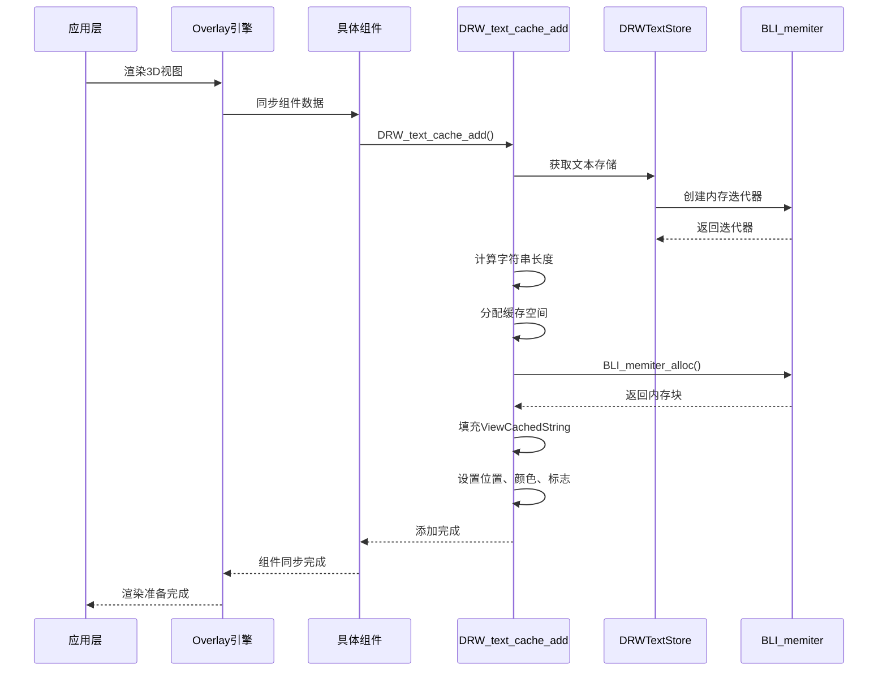
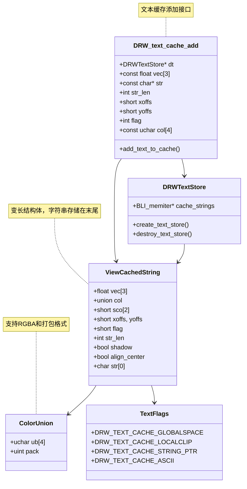
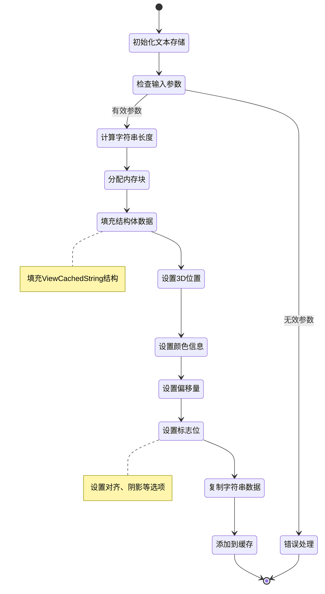
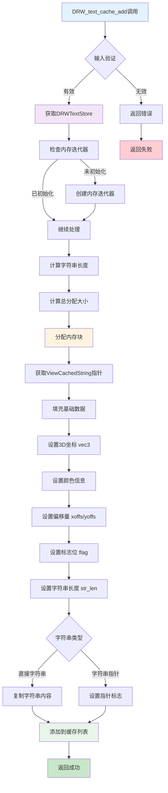
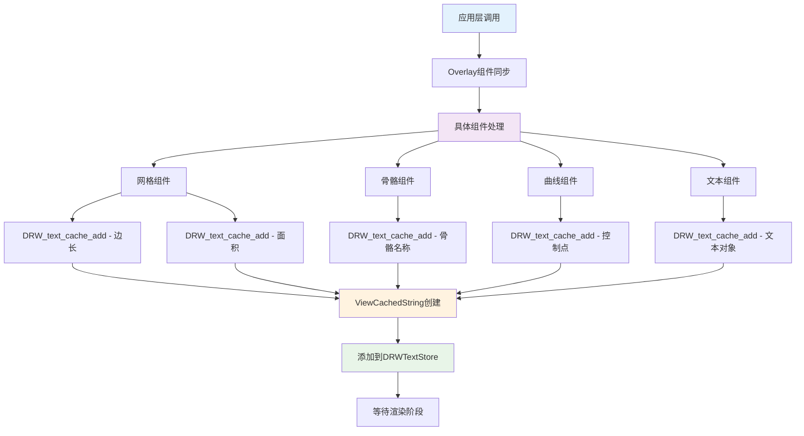
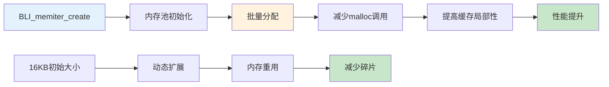
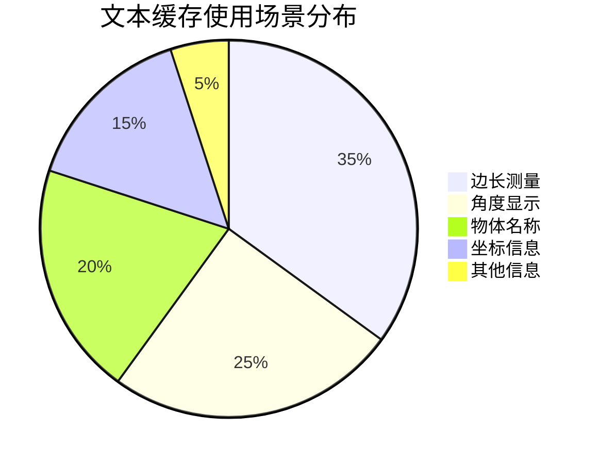
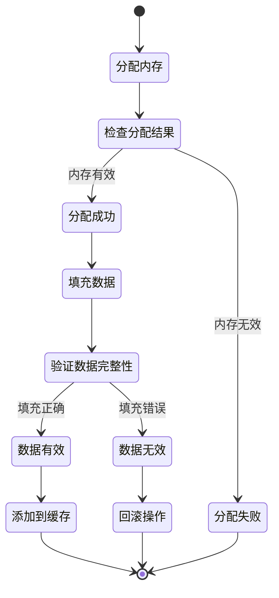

# 21. 调用堆栈详解 DRW_text_cache_add

## 概述

本文档详细分析 Blender 绘制系统中 `DRW_text_cache_add` 函数的调用堆栈和实现机制。该函数负责将文本添加到渲染缓存中，是文本渲染系统的核心入口点，为 3D 视图中的文本叠加提供高效的缓存管理。

## 调用堆栈流程图



## 类型系统图



## 事件处理图



## 文本缓存图



## 核心实现分析

### 1. 函数签名和参数

```cpp
// source/blender/draw/intern/draw_manager_text.cc:56
void DRW_text_cache_add(DRWTextStore *dt,
                        const float vec[3],
                        const char *str,
                        int str_len,
                        const short xoffs,
                        const short yoffs,
                        const int flag,
                        const uchar col[4])
```

### 2. 内存分配策略

```cpp
// 计算分配大小
size_t alloc_len = (str_len + 1) * sizeof(char);

// 分配变长结构体内存
ViewCachedString *vos = static_cast<ViewCachedString *>(
    BLI_memiter_alloc(dt->cache_strings, sizeof(ViewCachedString) + alloc_len));
```

### 3. 数据填充过程

```cpp
// 填充基础数据
copy_v3_v3(vos->vec, vec);
vos->xoffs = xoffs;
vos->yoffs = yoffs;
vos->flag = flag;
vos->str_len = str_len;

// 设置颜色
if (col) {
  vos->col.ub[0] = col[0];
  vos->col.ub[1] = col[1];
  vos->col.ub[2] = col[2];
  vos->col.ub[3] = col[3];
} else {
  vos->col.pack = 0xFFFFFFFF; // 默认白色
}

// 复制字符串
if (flag & DRW_TEXT_CACHE_STRING_PTR) {
  *((const char **)vos->str) = str;
} else {
  memcpy(vos->str, str, str_len);
  vos->str[str_len] = '\0';
}
```

## 调用关系详解

### 1. 主要调用路径



### 2. 组件级调用示例

```cpp
// 网格边长测量
if (v3d->overlay.edit_flag & V3D_OVERLAY_EDIT_EDGE_LEN) {
  const float *co = mid_v3_v3v3(v1, v2);
  char numstr[64];
  const size_t numstr_len = SNPRINTF_RLEN(numstr, "%.3f", len_v3v3(v1, v2));
  
  DRW_text_cache_add(dt, co, numstr, numstr_len, 0, edge_tex_sep, txt_flag, col);
}

// 骨骼名称显示
if (arm->drawtype == ARM_ENVELOPE) {
  DRW_text_cache_add(dt, bone->head, bone->name, strlen(bone->name), 
                     0, 12, txt_flag, col);
}
```

## 性能优化机制

### 1. 内存池管理



### 2. 字符串存储优化

```cpp
// 指针模式 - 避免字符串复制
if (flag & DRW_TEXT_CACHE_STRING_PTR) {
  *((const char **)vos->str) = str;
}

// 直接复制模式 - 适用于临时字符串
else {
  memcpy(vos->str, str, str_len);
  vos->str[str_len] = '\0';
}
```

## 应用场景分析

### 1. 3D编辑模式



### 2. 具体使用案例

```cpp
// 1. 边长测量文本
DRW_text_cache_add(dt, mid_point, length_str, len_str, 0, 5, 
                   DRW_TEXT_CACHE_ASCII, white_color);

// 2. 角度测量文本  
DRW_text_cache_add(dt, vertex_pos, angle_str, angle_len, 0, -8,
                   DRW_TEXT_CACHE_ASCII, yellow_color);

// 3. 物体名称文本
DRW_text_cache_add(dt, object_center, object->id.name + 2, strlen(object->id.name + 2),
                   0, 15, DRW_TEXT_CACHE_ASCII, name_color);
```

## 错误处理机制

### 1. 输入验证

```cpp
// 参数有效性检查
if (!dt || !vec || !str || str_len <= 0) {
  return;
}

// 内存分配失败检查
ViewCachedString *vos = static_cast<ViewCachedString *>(
    BLI_memiter_alloc(dt->cache_strings, sizeof(ViewCachedString) + alloc_len));
if (!vos) {
  return;
}
```

### 2. 内存保护



## 调试和分析工具

### 1. 调试宏定义

```cpp
#ifdef DEBUG_TEXT_CACHE
#define DEBUG_TEXT_CACHE_ADD(dt, vec, str, len) \
  printf("Adding text: '%s' at (%.2f, %.2f, %.2f)\n", str, vec[0], vec[1], vec[2])
#else
#define DEBUG_TEXT_CACHE_ADD(dt, vec, str, len)
#endif
```

### 2. 性能监控

```cpp
// 添加性能计时
static double total_add_time = 0.0;
static int add_count = 0;

double start = PIL_check_seconds_timer();
DRW_text_cache_add(dt, vec, str, str_len, xoffs, yoffs, flag, col);
double end = PIL_check_seconds_timer();

total_add_time += (end - start);
add_count++;

if (add_count % 1000 == 0) {
  printf("Average add time: %.4f ms\n", (total_add_time / add_count) * 1000.0);
}
```

## 总结

`DRW_text_cache_add` 函数是 Blender 文本渲染系统的核心组件，通过高效的内存管理和批量处理机制，为 3D 视图中的文本叠加提供性能优化。理解其调用堆栈和实现机制对于开发渲染功能和性能优化具有重要意义。

该函数的设计体现了现代渲染引擎的优化原则：内存池管理、批量处理、状态缓存等，为高性能的文本渲染奠定了坚实基础。