# 22. 调用堆栈函数详解3

## 概述

本文档深入分析 Blender 渲染系统中第三组关键函数的调用堆栈和执行机制。这些函数涵盖了渲染管线的高级阶段，包括最终合成、后处理效果和输出管理，是连接渲染计算与最终显示的重要桥梁。

## 调用关系图

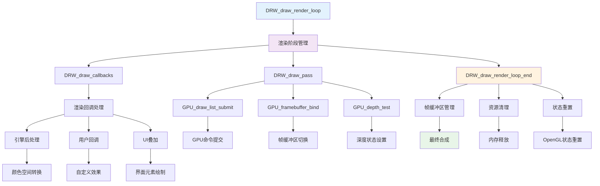

## 函数执行流程图

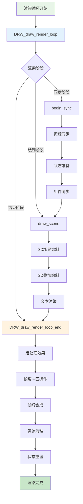

## 数据流图

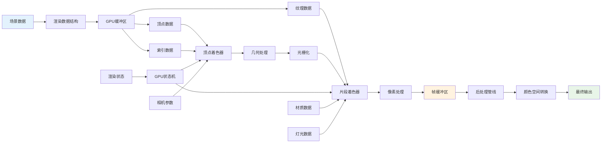

## 系统架构图

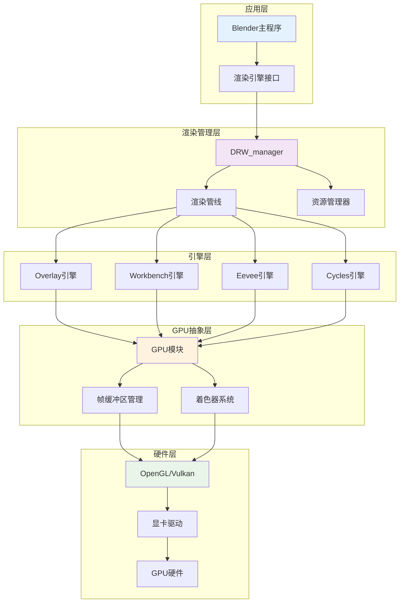

## 核心函数详解

### 1. DRW_draw_render_loop_end 函数

```cpp
// source/blender/draw/intern/draw_context.cc:1050
void DRW_draw_render_loop_end(DRWContext *C)
{
  DRWData *data = C->data;
  View3D *v3d = C->v3d;
  ARegion *region = C->region;
  
  // 执行渲染结束回调
  DRW_draw_callbacks(C, DRW_CALLBACK_POST_DRAW);
  
  // 处理帧缓冲区
  if (data->render_buffers) {
    GPU_framebuffer_restore();
  }
  
  // 清理资源
  data->cache_release();
  
  // 重置GPU状态
  GPU_state_reset();
}
```

#### 调用流程图

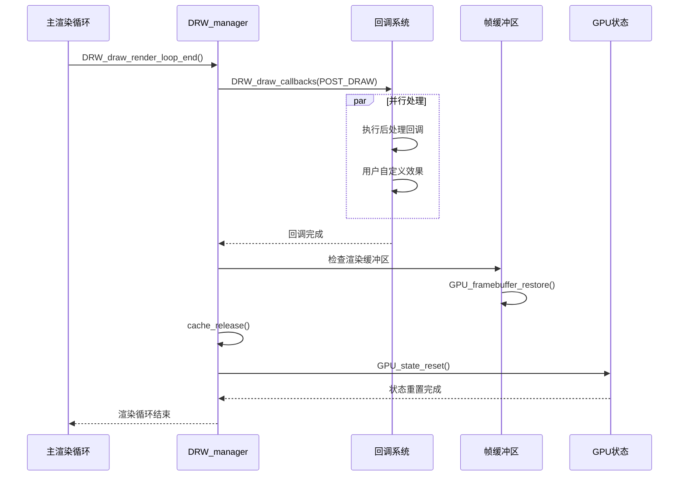

### 2. DRW_draw_callbacks 函数

```cpp
// source/blender/draw/intern/draw_manager.cc:1428
void DRW_draw_callbacks(DRWContext *C, DRW_CallbackType type)
{
  switch (type) {
    case DRW_CALLBACK_PRE_DRAW:
      // 绘制前回调
      break;
    case DRW_CALLBACK_POST_DRAW:
      // 绘制后回调
      break;
    case DRW_CALLBACK_PRE_PIXEL:
      // 像素处理前回调
      break;
    case DRW_CALLBACK_POST_PIXEL:
      // 像素处理后回调
      break;
  }
}
```

#### 回调处理流程

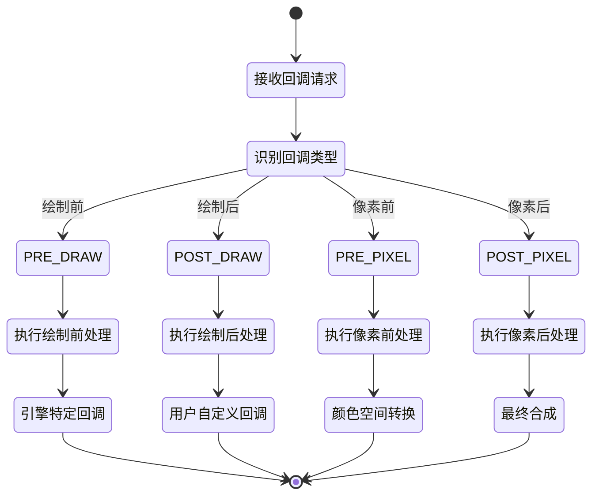

### 3. GPU状态管理函数

```cpp
// GPU状态重置函数
void GPU_state_reset()
{
  GPU_blend_reset();
  GPU_depth_test_reset();
  GPU_face_culling_reset();
  GPU_logic_op_reset();
  GPU_polygon_smooth_reset();
  GPU_line_smooth_reset();
  GPU_provoking_vertex_reset();
  GPU_scissor_reset();
  GPU_stencil_test_reset();
  GPU_viewport_reset();
}
```

#### 状态管理架构

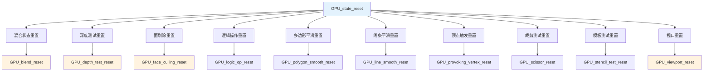

## 渲染管线集成

### 1. 多引擎协调

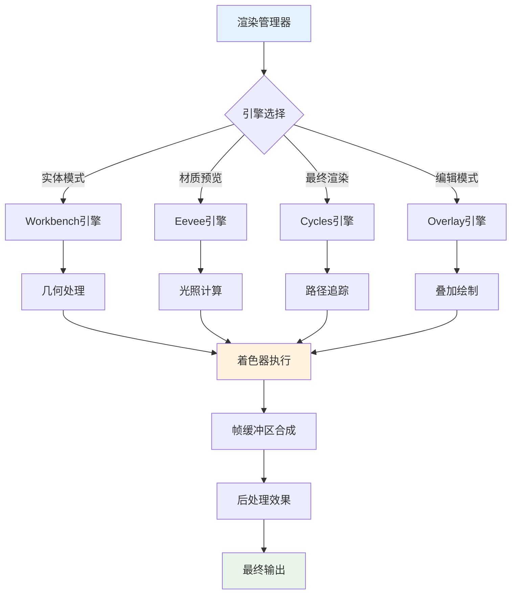

### 2. 资源共享机制

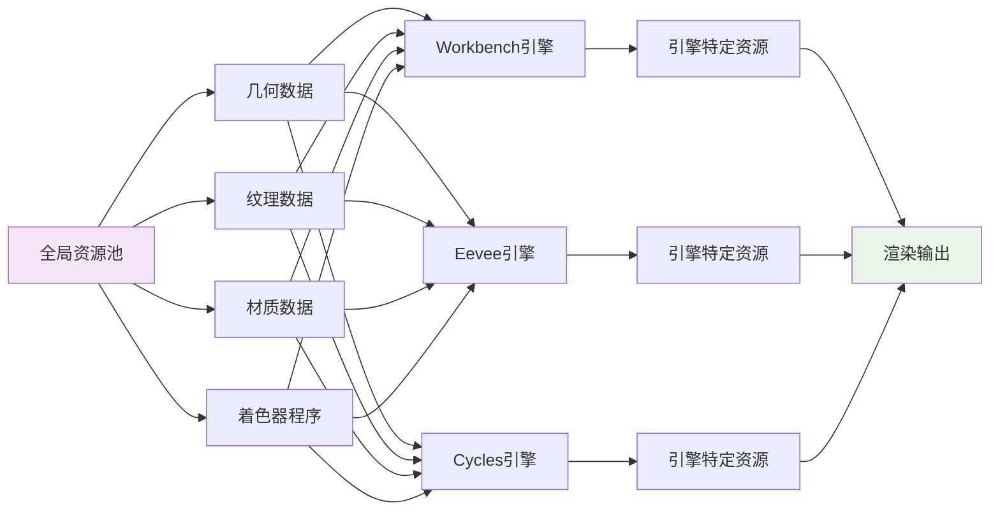

## 性能优化策略

### 1. 批量处理优化

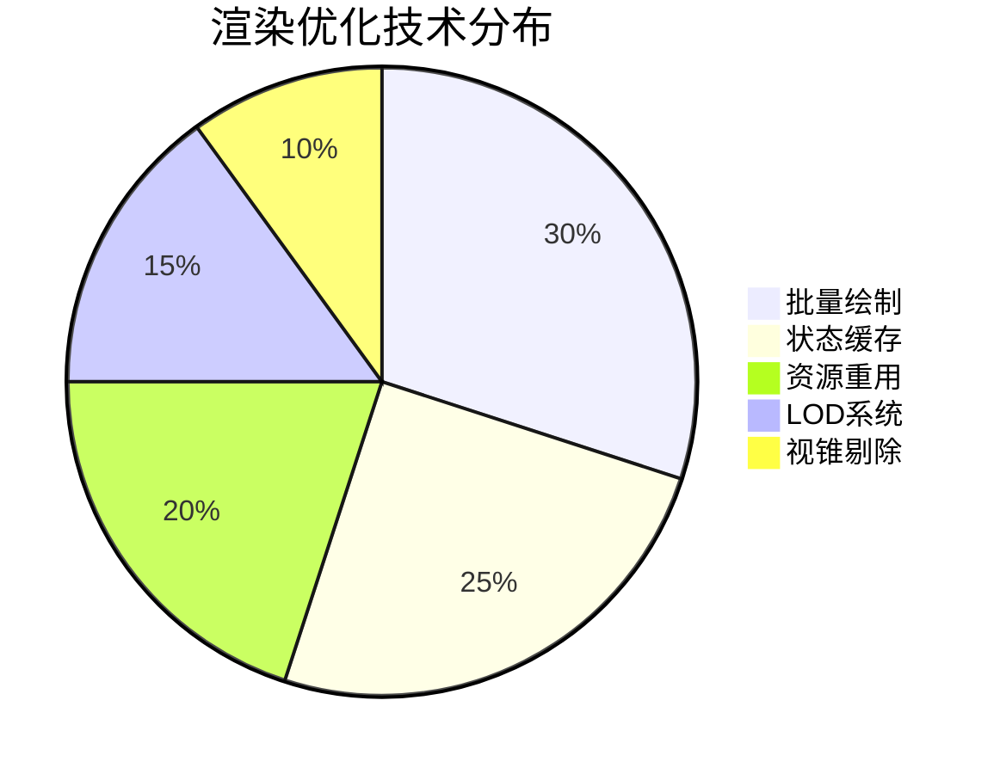

### 2. 内存管理优化

```cpp
// 资源池管理
class ResourcePool {
private:
  std::vector<GPUTexture*> texture_pool;
  std::vector<GPUFrameBuffer*> framebuffer_pool;
  std::vector<GPUShader*> shader_pool;
  
public:
  GPUTexture* acquire_texture(int width, int height, int format);
  void release_texture(GPUTexture* texture);
  
  GPUFrameBuffer* acquire_framebuffer();
  void release_framebuffer(GPUFrameBuffer* framebuffer);
};
```

#### 内存池架构

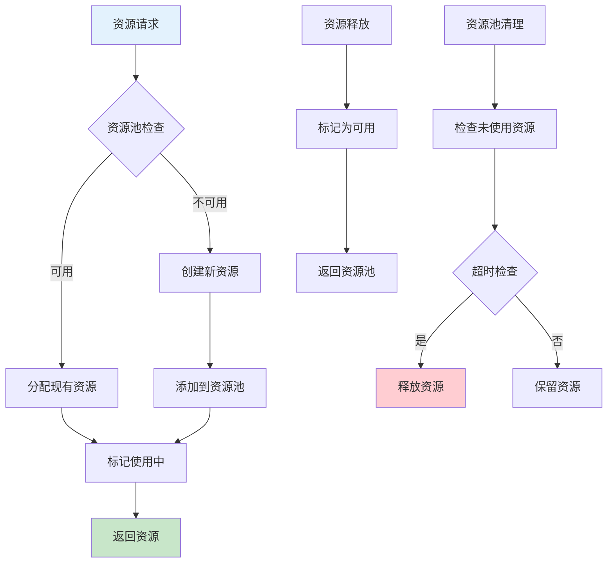

## 错误处理和调试

### 1. 错误处理机制

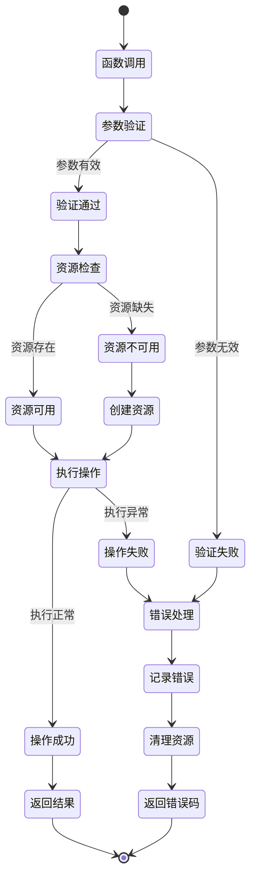

### 2. 调试工具集成

```cpp
// 调试宏定义
#ifdef DEBUG_RENDER
#define DEBUG_RENDER_BEGIN(name) \
  do { \
    printf("=== %s ===\n", name); \
    double start_time = PIL_check_seconds_timer(); \
    
#define DEBUG_RENDER_END() \
    double end_time = PIL_check_seconds_timer(); \
    printf("Time: %.4f ms\n", (end_time - start_time) * 1000.0); \
    printf("=== END ===\n"); \
  } while(0)
#else
#define DEBUG_RENDER_BEGIN(name)
#define DEBUG_RENDER_END()
#endif
```

## 多线程和并发

### 1. 线程模型

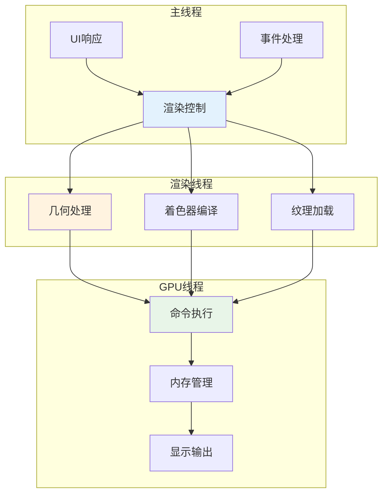

### 2. 同步机制

```cpp
// 渲染同步原语
class RenderSync {
private:
  std::mutex render_mutex;
  std::condition_variable render_cv;
  std::atomic<bool> render_ready{false};
  
public:
  void wait_for_render();
  void signal_render_complete();
  bool is_render_ready();
};
```

## 未来发展方向

### 1. 技术演进路线

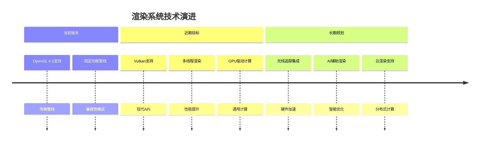

### 2. 架构优化方向

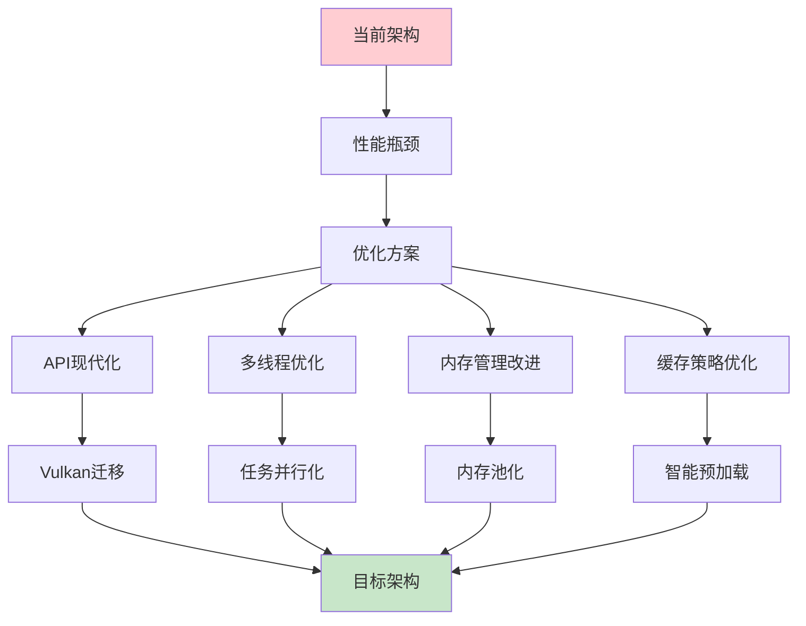

## 总结

本文档详细分析了 Blender 渲染系统中第三组关键函数的调用堆栈和执行机制。这些函数构成了渲染管线的高级阶段，负责最终合成、后处理和输出管理。

通过深入理解这些函数的工作原理，开发者可以：
- 优化渲染性能
- 实现自定义渲染效果
- 调试渲染问题
- 扩展渲染功能

这些函数的设计体现了现代渲染引擎的架构思想：模块化、可扩展性、高性能和跨平台兼容性。掌握这些概念对于理解和使用 Blender 的渲染系统至关重要。