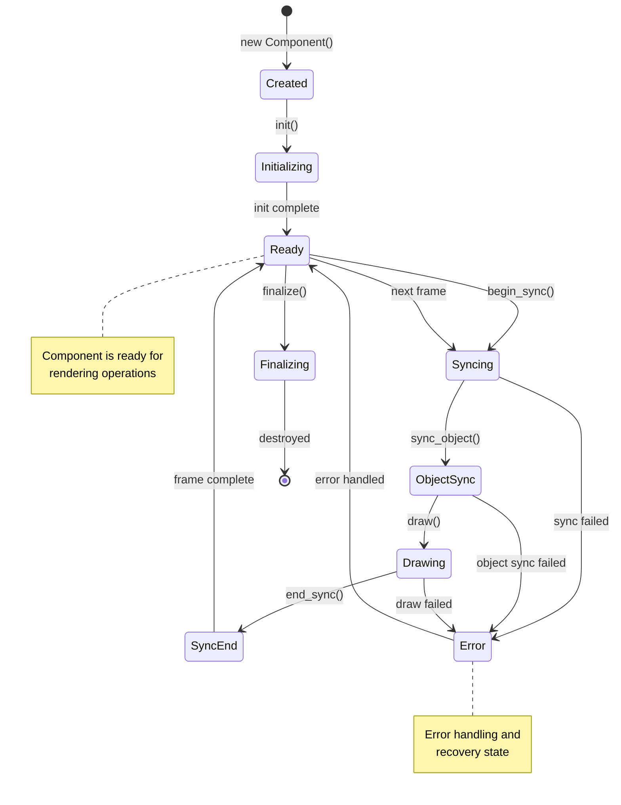
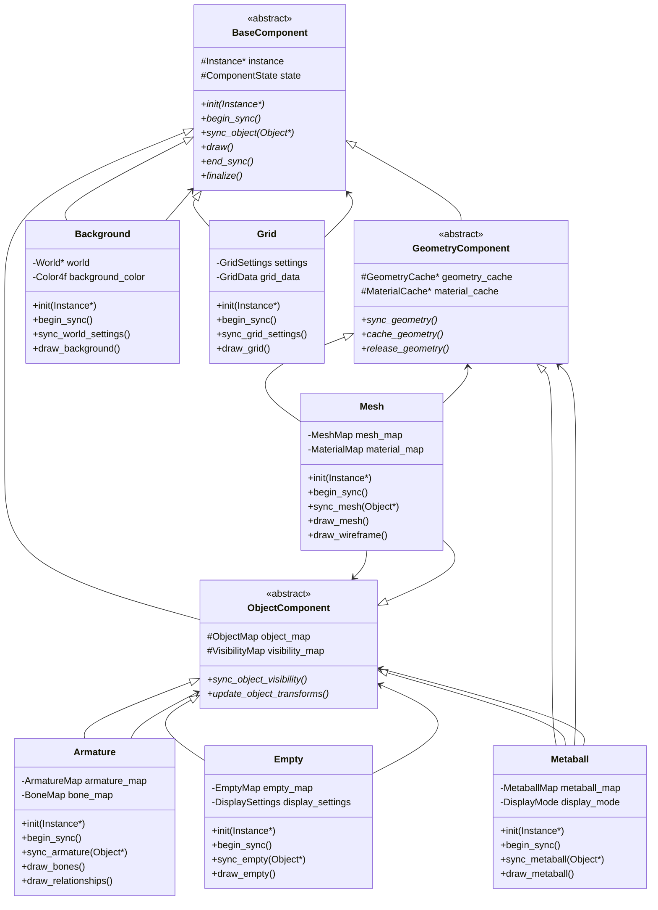
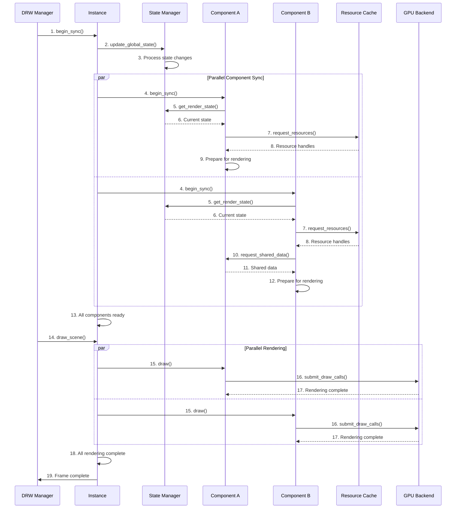
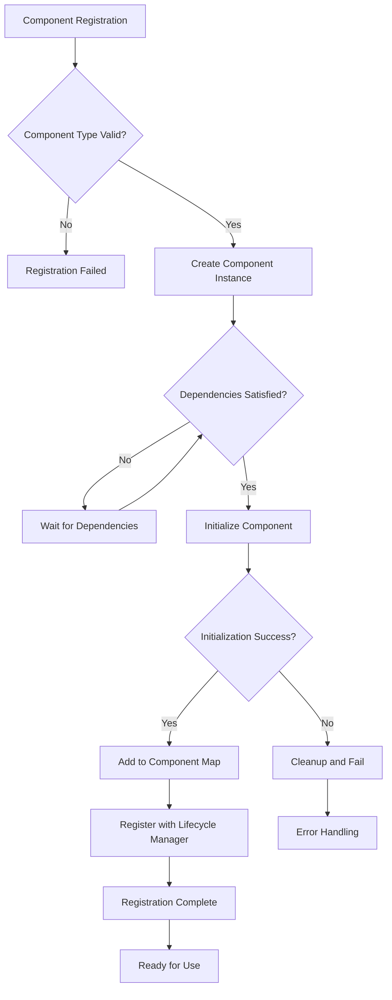
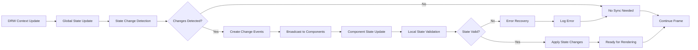
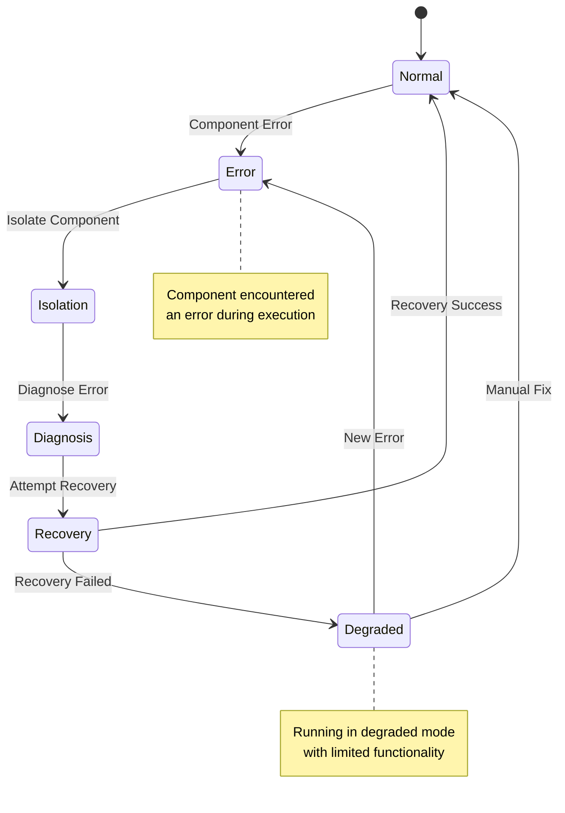

# Overlay引擎架构详解-组件管理系统

## 概述

Overlay引擎的组件管理系统是其核心架构之一，负责管理和协调各种渲染组件的生命周期、状态同步和渲染执行。本文档详细解析Overlay引擎的组件管理系统架构、组件类型、生命周期管理和组件间通信机制。

## 组件系统架构

### 核心设计理念

Overlay引擎的组件系统基于以下设计理念：

1. **模块化设计**: 每个渲染功能独立封装为组件
2. **统一接口**: 所有组件遵循统一的生命周期接口
3. **依赖管理**: 明确定义组件间的依赖关系
4. **状态同步**: 统一的状态管理和同步机制
5. **资源复用**: 组件间共享渲染资源

### 组件层次结构

```
Overlay Engine
├── Instance (组件管理器)
│   ├── Base Component (抽象基类)
│   │   ├── Background
│   │   ├── Grid
│   │   ├── Mesh
│   │   ├── Armature
│   │   ├── Empty
│   │   ├── Metaball
│   │   ├── Curve
│   │   ├── Lattice
│   │   ├── Particle
│   │   └── Force Field
│   ├── Utility Components
│   │   ├── Shader Manager
│   │   ├── Geometry Cache
│   │   ├── State Manager
│   │   └── Framebuffer Manager
│   └── Post-Processing Components
│       ├── Anti-aliasing
│       ├── Outline
│       └── Motion Blur
```

## Overlay组件系统架构图

```mermaid
graph TB
    subgraph "Component Management Layer"
        A[Instance] --> B[Component Manager]
        B --> C[Component Registry]
        B --> D[Lifecycle Manager]
        B --> E[State Synchronizer]
    end
    
    subgraph "Base Component System"
        F[BaseComponent] --> G[init]
        F --> H[begin_sync]
        F --> I[sync_object]
        F --> J[draw]
        F --> K[end_sync]
        F --> L[finalize]
    end
    
    subgraph "Rendering Components"
        M[Background] --> F
        N[Grid] --> F
        O[Mesh] --> F
        P[Armature] --> F
        Q[Empty] --> F
        R[Metaball] --> F
        S[Curve] --> F
        T[Lattice] --> F
        U[Particle] --> F
        V[Force Field] --> F
    end
    
    subgraph "Utility Components"
        W[Shader Manager] --> F
        X[Geometry Cache] --> F
        Y[State Manager] --> F
        Z[Framebuffer Manager] --> F
    end
    
    subgraph "Post-Processing Components"
        AA[Anti-aliasing] --> F
        BB[Outline] --> F
        CC[Motion Blur] --> F
    end
    
    A --> M
    A --> N
    A --> O
    A --> P
    A --> Q
    A --> R
    A --> S
    A --> T
    A --> U
    A --> V
    
    A --> W
    A --> X
    A --> Y
    A --> Z
    
    A --> AA
    A --> BB
    A --> CC
```



## 组件生命周期管理

### 生命周期阶段

每个组件都遵循统一的生命周期模式：

1. **初始化阶段 (init)**: 组件创建和资源分配
2. **同步开始阶段 (begin_sync)**: 每帧开始时的状态同步
3. **对象同步阶段 (sync_object)**: 同步具体对象数据
4. **渲染阶段 (draw)**: 执行实际的渲染操作
5. **同步结束阶段 (end_sync)**: 每帧结束时的清理工作
6. **销毁阶段 (finalize)**: 组件销毁和资源释放

### 组件生命周期图



## 继承关系图

### BaseComponent抽象基类

```cpp
class BaseComponent {
protected:
    Instance* instance;
    ComponentState state;
    
public:
    virtual ~BaseComponent() = default;
    virtual void init(Instance* instance) = 0;
    virtual void begin_sync() = 0;
    virtual void sync_object(Object* ob) = 0;
    virtual void draw() = 0;
    virtual void end_sync() = 0;
    virtual void finalize() = 0;
};
```

### 继承关系图



## 组件间通信机制

### 通信模式

Overlay引擎的组件间通信采用以下模式：

1. **事件驱动**: 基于事件的异步通信
2. **状态共享**: 通过共享状态管理器
3. **资源池**: 共享的GPU资源池
4. **消息队列**: 组件间的消息传递
5. **回调机制**: 组件注册的回调函数

### 组件间通信图



## 组件管理器

### ComponentManager类

```cpp
class ComponentManager {
private:
    std::vector<std::unique_ptr<BaseComponent>> components;
    std::map<ComponentType, BaseComponent*> component_map;
    ComponentRegistry registry;
    LifecycleManager lifecycle_manager;
    
public:
    void register_component(std::unique_ptr<BaseComponent> component);
    void init_components(Instance* instance);
    void begin_sync();
    void sync_objects();
    void draw_components();
    void end_sync();
    void finalize_components();
    
    BaseComponent* get_component(ComponentType type);
    template<typename T>
    T* get_component_as();
};
```

### 组件注册机制



## 状态同步机制

### 状态管理器

```cpp
class StateManager {
private:
    GlobalState global_state;
    ComponentStateMap component_states;
    StateChangeQueue change_queue;
    
public:
    void update_global_state(const DRWContextState* ctx);
    void sync_component_state(ComponentType type, const ComponentState& state);
    void broadcast_state_changes();
    ComponentState get_component_state(ComponentType type);
};
```

### 状态同步流程



## 性能优化策略

### 组件级优化

1. **延迟初始化**: 按需初始化组件
2. **状态缓存**: 缓存组件状态避免重复计算
3. **批量操作**: 批量处理相似操作
4. **资源池化**: 复用GPU资源
5. **多线程**: 并行处理组件同步

### 渲染优化

1. **实例化渲染**: 相同类型对象实例化渲染
2. **视锥剔除**: 剔除不可见对象
3. **LOD系统**: 距离相关的细节层次
4. **遮挡查询**: GPU遮挡剔除
5. **批处理**: 合并小的渲染操作

## 调试和诊断

### 组件调试工具

```cpp
class ComponentDebugger {
public:
    void log_component_state(ComponentType type);
    void trace_component_lifecycle(ComponentType type);
    void profile_component_performance(ComponentType type);
    void visualize_component_dependencies();
    void dump_component_statistics();
};
```

### 性能监控

```mermaid
gantt
    title Component Performance Timeline
    dateFormat X
    axisFormat %s
    
    section Frame Processing
    begin_sync       :active, sync, 0, 3
    object_sync      :active, obj, 3, 8
    draw_phase       :active, draw, 8, 12
    end_sync         :active, end, 12, 14
    
    section Components
    Background       :active, bg, 1, 2
    Grid            :active, grid, 2, 4
    Mesh            :active, mesh, 4, 7
    Armature        :active, arm, 5, 8
    Empty           :active, empty, 6, 9
    Metaball        :active, meta, 7, 10
    
    section GPU Operations
    Resource Prep   :active, res, 8, 10
    Draw Calls      :active, dc, 10, 12
    State Changes   :active, sc, 12, 13
```



## 错误处理和恢复

### 错误处理策略

1. **组件隔离**: 单个组件错误不影响其他组件
2. **状态回滚**: 错误时回滚到安全状态
3. **降级渲染**: 错误时使用简化渲染
4. **错误日志**: 详细记录错误信息
5. **自动恢复**: 尝试自动恢复机制

### 错误恢复流程



## 总结

Overlay引擎的组件管理系统通过模块化设计、统一接口和高效的状态管理，实现了灵活、可扩展的渲染架构。该系统不仅提供了强大的渲染功能，还确保了良好的性能和可维护性。理解组件管理系统对于Overlay引擎的开发和优化具有重要意义。

关键特性包括：
- 统一的组件生命周期管理
- 灵活的组件间通信机制
- 高效的状态同步系统
- 强大的错误处理和恢复能力
- 丰富的性能优化策略

这些特性共同构成了Overlay引擎强大而稳定的组件管理基础。