# Overlay引擎架构详解 - 资源管理机制

## 概述

Overlay引擎的资源管理机制是其高效渲染的核心基础，负责管理GPU资源的分配、使用、缓存和释放。本文档详细解析Overlay引擎的资源管理系统架构、GPU资源生命周期、缓冲区管理流程和内存管理策略。

## 资源管理系统架构

### 核心组件

Overlay引擎的资源管理系统由以下核心组件构成：

1. **ResourceManager**: 资源管理器，统一管理所有GPU资源
2. **GeometryCache**: 几何数据缓存系统
3. **TextureCache**: 纹理缓存系统
4. **ShaderManager**: 着色器资源管理
5. **BufferManager**: 缓冲区管理器
6. **MemoryPool**: 内存池管理
7. **GarbageCollector**: 垃圾回收器

### 资源层次结构

```
ResourceManager
├── GPU Resources
│   ├── Vertex Buffers
│   ├── Index Buffers
│   ├── Uniform Buffers
│   ├── Shader Storage Buffers
│   ├── Textures
│   ├── Framebuffers
│   └── Render Targets
├── Cache Systems
│   ├── Geometry Cache
│   ├── Texture Cache
│   ├── Shader Cache
│   └── Material Cache
├── Memory Management
│   ├── Memory Pool
│   ├── Allocator
│   ├── Deallocator
│   └── Garbage Collector
└── Resource Tracking
    ├── Resource Registry
    ├── Usage Statistics
    ├── Lifetime Tracker
    └── Reference Counter
```

## 资源管理系统架构图

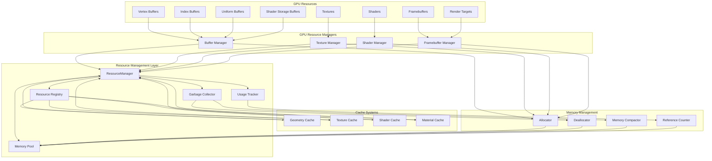

## GPU资源生命周期管理

### 资源生命周期阶段

GPU资源的生命周期包含以下阶段：

1. **请求阶段 (Request)**: 组件请求特定资源
2. **分配阶段 (Allocate)**: 从内存池分配资源
3. **初始化阶段 (Initialize)**: 初始化资源数据
4. **使用阶段 (Use)**: 资源被用于渲染
5. **缓存阶段 (Cache)**: 资源进入缓存系统
6. **释放阶段 (Release)**: 资源引用计数归零
7. **回收阶段 (Recycle)**: 资源被垃圾回收器回收

### GPU资源生命周期图

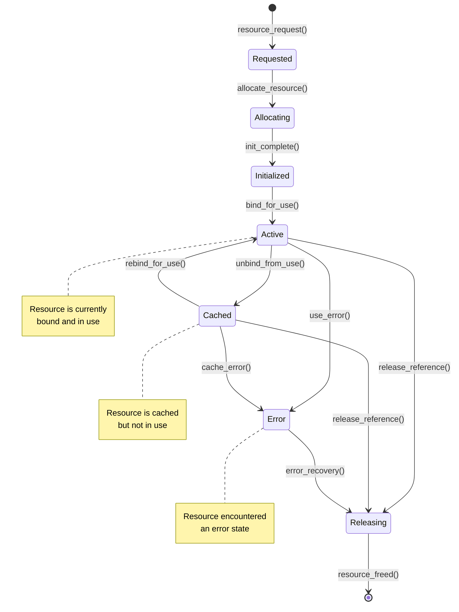

### 资源引用计数机制

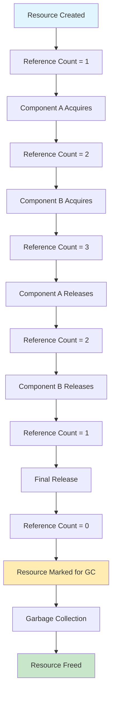

## 缓冲区管理流程

### BufferManager架构

```cpp
class BufferManager {
private:
    std::map<BufferType, std::vector<GPUBuffer*>> buffer_pools;
    MemoryPool memory_pool;
    BufferAllocator allocator;
    BufferDeallocator deallocator;
    
public:
    GPUBuffer* allocate_buffer(BufferType type, size_t size);
    void deallocate_buffer(GPUBuffer* buffer);
    void resize_buffer(GPUBuffer* buffer, size_t new_size);
    void update_buffer_data(GPUBuffer* buffer, const void* data, size_t size);
    void bind_buffer(GPUBuffer* buffer, int binding_point);
};
```

### 缓冲区类型

1. **Vertex Buffer**: 顶点数据存储
2. **Index Buffer**: 索引数据存储
3. **Uniform Buffer**: 统一变量存储
4. **Shader Storage Buffer**: 着色器存储缓冲区
5. **Indirect Buffer**: 间接渲染命令存储

### 缓冲区管理流程图

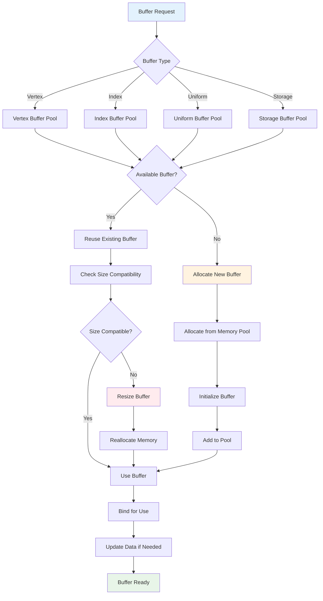

### 动态缓冲区管理

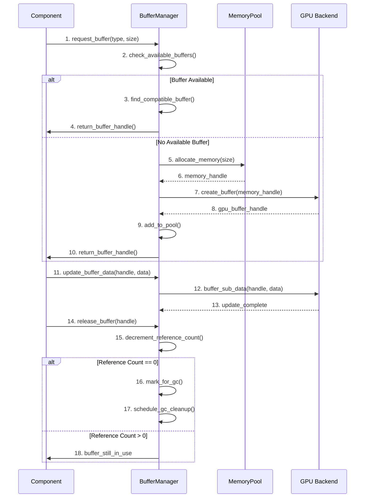

## 内存管理策略

### 内存池设计

Overlay引擎采用分层内存池设计：

1. **小型对象池**: 管理小于1KB的资源
2. **中型对象池**: 管理1KB-1MB的资源
3. **大型对象池**: 管理大于1MB的资源
4. **专用池**: 特殊用途的内存池

### 内存分配策略

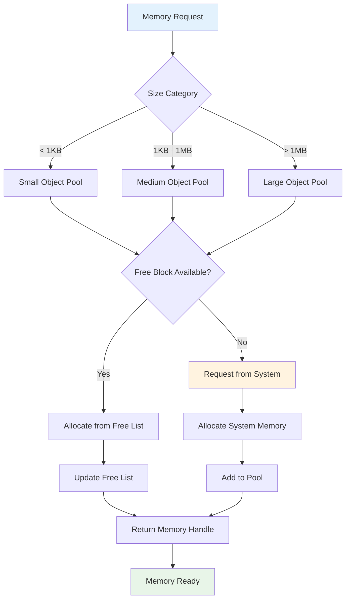

### 内存管理策略图

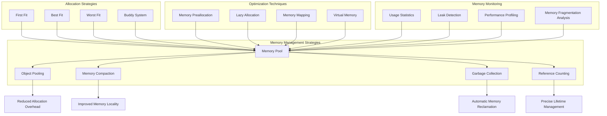

## 几何缓存系统

### GeometryCache架构

```cpp
class GeometryCache {
private:
    struct CacheEntry {
        GPUVertBuf* vertex_buffer;
        GPUIndexBuf* index_buffer;
        size_t vertex_count;
        size_t index_count;
        uint64_t hash;
        uint32_t ref_count;
        float last_used_time;
    };
    
    std::unordered_map<uint64_t, CacheEntry> cache_map;
    std::list<CacheEntry> lru_list;
    size_t max_cache_size;
    size_t current_cache_size;
    
public:
    CacheEntry* get_or_create_geometry(const MeshData& mesh_data);
    void release_geometry(uint64_t hash);
    void cleanup_unused_entries();
    void clear_cache();
};
```

### 几何缓存流程

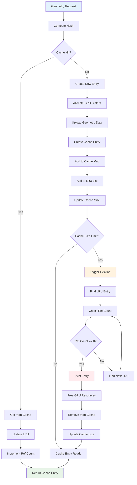

## 纹理缓存系统

### TextureCache架构

```cpp
class TextureCache {
private:
    struct TextureEntry {
        GPUTexture* texture;
        TextureType type;
        int width, height, depth;
        TextureFormat format;
        uint64_t hash;
        uint32_t ref_count;
        float last_used_time;
    };
    
    std::unordered_map<uint64_t, TextureEntry> texture_cache;
    std::queue<TextureEntry> upload_queue;
    std::thread upload_thread;
    
public:
    TextureEntry* get_or_create_texture(const TextureData& tex_data);
    void async_upload_texture(TextureEntry* entry, const TextureData& data);
    void release_texture(uint64_t hash);
    void process_upload_queue();
};
```

### 纹理上传流程

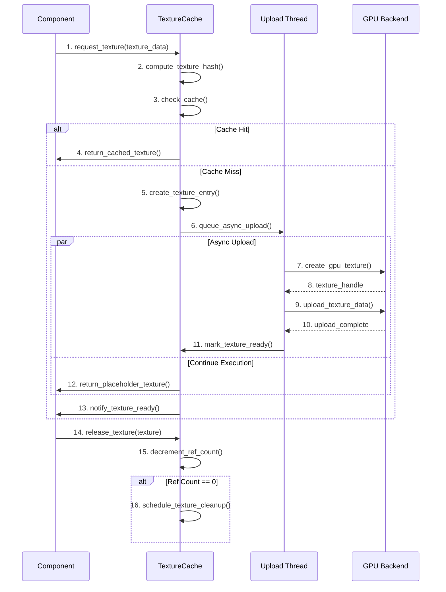

## 垃圾回收机制

### 垃圾回收策略

Overlay引擎采用增量式垃圾回收策略：

1. **标记阶段**: 标记仍在使用的资源
2. **清扫阶段**: 清理未标记的资源
3. **压缩阶段**: 压缩内存碎片
4. **整理阶段**: 整理资源布局

### 垃圾回收流程图

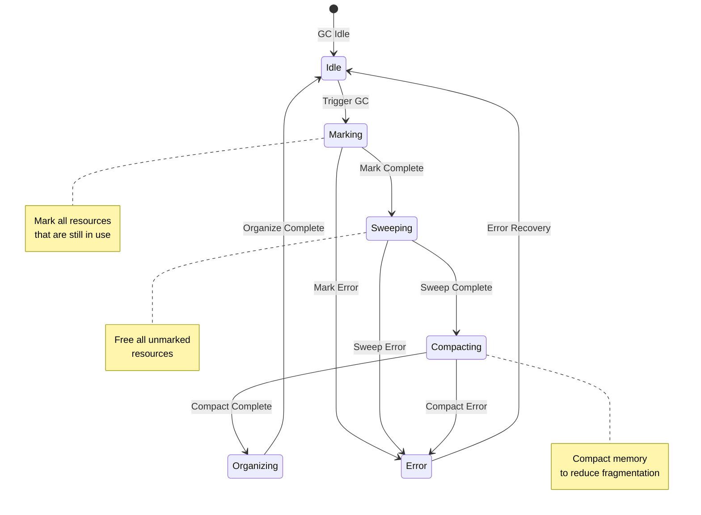

### 增量垃圾回收

```mermaid
gantt
    title Incremental Garbage Collection Timeline
    dateFormat X
    axisFormat %s
    
    section Frame N
    Mark Phase 1     :active, mark1, 0, 2
    Normal Rendering :active, render1, 2, 8
    
    section Frame N+1
    Mark Phase 2     :active, mark2, 0, 2
    Sweep Phase 1    :active, sweep1, 2, 4
    Normal Rendering :active, render2, 4, 10
    
    section Frame N+2
    Sweep Phase 2    :active, sweep2, 0, 2
    Compact Phase 1  :active, compact1, 2, 4
    Normal Rendering :active, render3, 4, 10
    
    section Frame N+3
    Compact Phase 2  :active, compact2, 0, 2
    Organize Phase   :active, organize, 2, 4
    Normal Rendering :active, render4, 4, 10
```

## 性能监控和优化

### 资源使用统计

```cpp
class ResourceProfiler {
private:
    struct ResourceStats {
        size_t total_memory_usage;
        size_t peak_memory_usage;
        uint32_t active_buffers;
        uint32_t active_textures;
        uint32_t cache_hits;
        uint32_t cache_misses;
        float gc_time;
        float allocation_time;
    };
    
    ResourceStats current_stats;
    ResourceStats peak_stats;
    
public:
    void update_memory_usage(size_t usage);
    void record_cache_hit();
    void record_cache_miss();
    void record_gc_time(float time);
    void dump_statistics();
};
```

### 性能优化策略

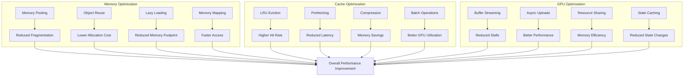

## 错误处理和恢复

### 资源错误处理

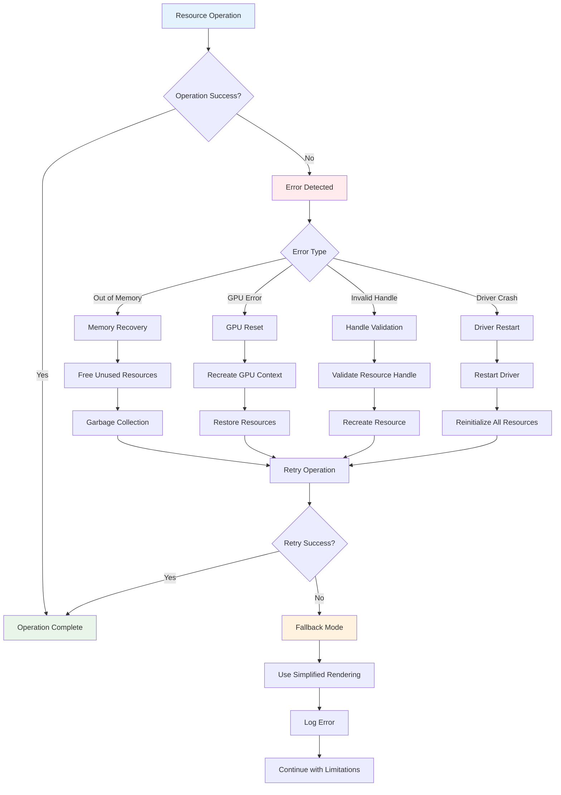

## 总结

Overlay引擎的资源管理机制通过分层设计、智能缓存和高效的生命周期管理，实现了优化的GPU资源利用。该系统不仅提供了强大的资源管理功能，还确保了良好的性能和稳定性。

关键特性包括：
- 统一的资源管理架构
- 高效的GPU资源生命周期管理
- 智能的缓存和内存管理策略
- 增量式垃圾回收机制
- 全面的性能监控和优化
- 强大的错误处理和恢复能力

这些特性共同构成了Overlay引擎高效、稳定的资源管理基础，为高质量的实时渲染提供了坚实保障。