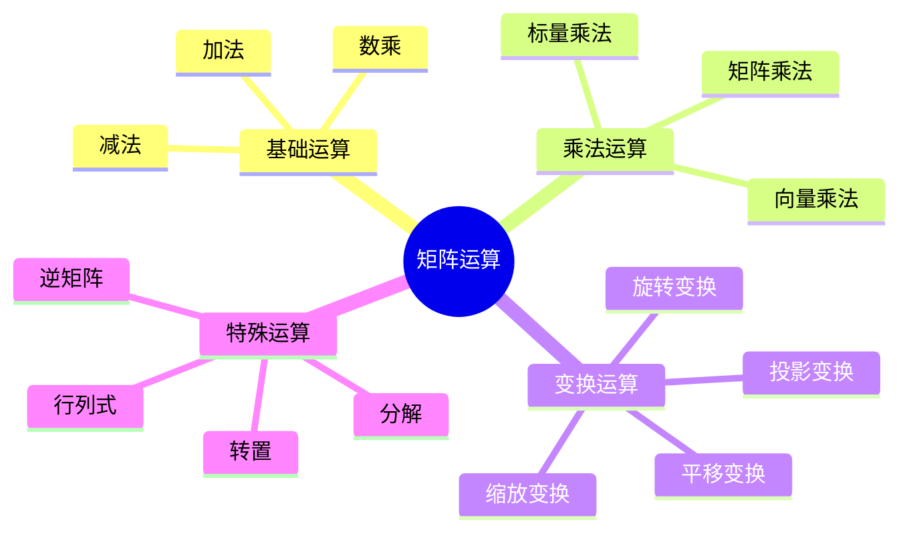
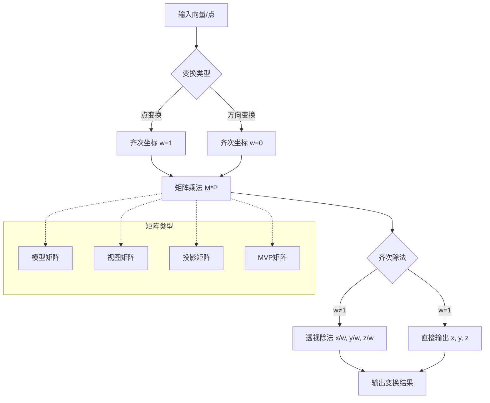
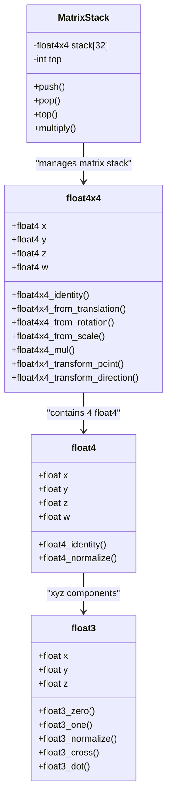
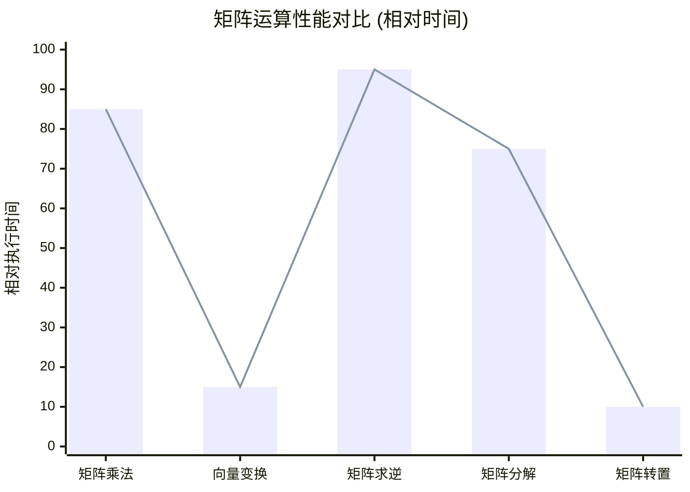

# 矩阵相关函数详解

## 概述

Blender的渲染系统大量使用矩阵运算来进行3D变换、投影和坐标系统转换。本文档详细解析Blender中矩阵相关的核心函数和数据结构，以及它们在渲染管线中的应用。

## 矩阵基础概念

### 矩阵类型

Blender中主要使用以下几种矩阵类型：

1. **4x4变换矩阵** (float4x4): 用于3D变换
2. **3x3矩阵** (float3x3): 用于旋转和缩放
3. **4x4投影矩阵** (float4x4): 用于相机投影
4. **向量** (float3, float4): 用于位置和方向

### 矩阵运算类型图



## 核心矩阵函数

### 1. 矩阵创建和初始化

#### 单位矩阵
```cpp
float4x4 float4x4_identity()
{
    float4x4 result;
    result.x = float4(1.0f, 0.0f, 0.0f, 0.0f);
    result.y = float4(0.0f, 1.0f, 0.0f, 0.0f);
    result.z = float4(0.0f, 0.0f, 1.0f, 0.0f);
    result.w = float4(0.0f, 0.0f, 0.0f, 1.0f);
    return result;
}
```

#### 平移矩阵
```cpp
float4x4 float4x4_from_translation(float3 translation)
{
    float4x4 result = float4x4_identity();
    result.w.xyz = translation;
    return result;
}
```

#### 旋转矩阵
```cpp
float4x4 float4x4_from_rotation(float3 euler)
{
    float4x4 result = float4x4_identity();
    // 实现欧拉角到旋转矩阵的转换
    float cx = cos(euler.x), sx = sin(euler.x);
    float cy = cos(euler.y), sy = sin(euler.y);
    float cz = cos(euler.z), sz = sin(euler.z);
    
    // 组合旋转矩阵
    // ... 具体实现
    return result;
}
```

#### 缩放矩阵
```cpp
float4x4 float4x4_from_scale(float3 scale)
{
    float4x4 result = float4x4_identity();
    result.x.x = scale.x;
    result.y.y = scale.y;
    result.z.z = scale.z;
    return result;
}
```

### 2. 矩阵运算函数

#### 矩阵乘法
```cpp
float4x4 float4x4_mul(float4x4 a, float4x4 b)
{
    float4x4 result;
    for (int i = 0; i < 4; i++) {
        for (int j = 0; j < 4; j++) {
            result[i][j] = a[i][0] * b[0][j] + 
                           a[i][1] * b[1][j] + 
                           a[i][2] * b[2][j] + 
                           a[i][3] * b[3][j];
        }
    }
    return result;
}
```

#### 向量变换
```cpp
float3 float4x4_transform_point(float4x4 matrix, float3 point)
{
    float4 result = matrix * float4(point, 1.0f);
    return result.xyz / result.w;
}

float3 float4x4_transform_direction(float4x4 matrix, float3 direction)
{
    float4 result = matrix * float4(direction, 0.0f);
    return result.xyz;
}
```

### 矩阵变换流程图



## 矩阵数据结构

### float4x4 结构体定义

```cpp
struct float4x4 {
    float4 x;  // 第一列
    float4 y;  // 第二列
    float4 z;  // 第三列
    float4 w;  // 第四列
    
    // 访问器
    float4& operator[](int index) {
        return (&x)[index];
    }
    
    const float4& operator[](int index) const {
        return (&x)[index];
    }
};
```

### float3 向量结构

```cpp
struct float3 {
    float x, y, z;
    
    // 构造函数
    float3() : x(0), y(0), z(0) {}
    float3(float x, float y, float z) : x(x), y(y), z(z) {}
    
    // 运算符重载
    float3 operator+(const float3& other) const {
        return float3(x + other.x, y + other.y, z + other.z);
    }
    
    float3 operator*(float scalar) const {
        return float3(x * scalar, y * scalar, z * scalar);
    }
};
```

### 矩阵数据结构图



## 特殊矩阵函数

### 1. 视图矩阵

```cpp
float4x4 float4x4_look_at(float3 eye, float3 center, float3 up)
{
    float3 f = normalize(center - eye);
    float3 s = normalize(cross(f, up));
    float3 u = cross(s, f);
    
    float4x4 result = float4x4_identity();
    result.x.x = s.x;
    result.y.x = s.y;
    result.z.x = s.z;
    result.x.y = u.x;
    result.y.y = u.y;
    result.z.y = u.z;
    result.x.z = -f.x;
    result.y.z = -f.y;
    result.z.z = -f.z;
    result.w.x = -dot(s, eye);
    result.w.y = -dot(u, eye);
    result.w.z = dot(f, eye);
    
    return result;
}
```

### 2. 投影矩阵

```cpp
float4x4 float4x4_perspective(float fov, float aspect, float near, float far)
{
    float4x4 result = float4x4_identity();
    
    float tan_half_fov = tan(fov * 0.5f);
    result.x.x = 1.0f / (aspect * tan_half_fov);
    result.y.y = 1.0f / tan_half_fov;
    result.z.z = -(far + near) / (far - near);
    result.z.w = -1.0f;
    result.w.z = -(2.0f * far * near) / (far - near);
    result.w.w = 0.0f;
    
    return result;
}
```

### 3. 正交投影矩阵

```cpp
float4x4 float4x4_orthographic(float left, float right, float bottom, float top, float near, float far)
{
    float4x4 result = float4x4_identity();
    
    result.x.x = 2.0f / (right - left);
    result.y.y = 2.0f / (top - bottom);
    result.z.z = -2.0f / (far - near);
    result.w.x = -(right + left) / (right - left);
    result.w.y = -(top + bottom) / (top - bottom);
    result.w.z = -(far + near) / (far - near);
    
    return result;
}
```

## 矩阵分解函数

### 欧拉角分解

```cpp
void float4x4_to_euler(float4x4 matrix, float3& euler)
{
    float sy = sqrt(matrix.x.x * matrix.x.x + matrix.y.x * matrix.y.x);
    
    if (sy > 1e-6f) {
        euler.x = atan2(matrix.z.y, matrix.z.z);
        euler.y = atan2(-matrix.z.x, sy);
        euler.z = atan2(matrix.y.x, matrix.x.x);
    } else {
        euler.x = atan2(-matrix.y.z, matrix.y.y);
        euler.y = atan2(-matrix.z.x, sy);
        euler.z = 0.0f;
    }
}
```

### 位置、旋转、缩放分解

```cpp
void float4x4_decompose(float4x4 matrix, float3& position, float4& rotation, float3& scale)
{
    // 提取位置
    position = matrix.w.xyz;
    
    // 提取缩放
    scale.x = length(matrix.x.xyz);
    scale.y = length(matrix.y.xyz);
    scale.z = length(matrix.z.xyz);
    
    // 提取旋转
    float4x4 rotation_matrix = matrix;
    rotation_matrix.x.xyz /= scale.x;
    rotation_matrix.y.xyz /= scale.y;
    rotation_matrix.z.xyz /= scale.z;
    rotation_matrix.w.xyz = float3(0, 0, 0);
    
    rotation = float4x4_to_quat(rotation_matrix);
}
```

## 性能优化

### 矩阵运算性能对比图



### 优化策略

1. **SIMD优化**: 使用SIMD指令加速矩阵运算
2. **缓存友好**: 按列主序存储矩阵数据
3. **预计算**: 缓存常用的矩阵组合
4. **惰性求值**: 延迟矩阵运算直到必要时

### SIMD优化示例

```cpp
// 使用SIMD指令优化的矩阵乘法
float4x4 float4x4_mul_simd(float4x4 a, float4x4 b)
{
    float4x4 result;
    
    // 使用SIMD指令并行计算
    __m128 a_row0 = _mm_load_ps(&a.x.x);
    __m128 a_row1 = _mm_load_ps(&a.y.x);
    __m128 a_row2 = _mm_load_ps(&a.z.x);
    __m128 a_row3 = _mm_load_ps(&a.w.x);
    
    __m128 b_col0 = _mm_set_ps(b.w.x, b.z.x, b.y.x, b.x.x);
    __m128 b_col1 = _mm_set_ps(b.w.y, b.z.y, b.y.y, b.x.y);
    __m128 b_col2 = _mm_set_ps(b.w.z, b.z.z, b.y.z, b.x.z);
    __m128 b_col3 = _mm_set_ps(b.w.w, b.z.w, b.y.w, b.x.w);
    
    // 并行计算矩阵乘法
    __m128 result_col0 = _mm_add_ps(
        _mm_add_ps(_mm_mul_ps(_mm_shuffle_ps(a_row0, a_row0, 0x00), b_col0),
                   _mm_mul_ps(_mm_shuffle_ps(a_row0, a_row0, 0x55), b_col0)),
        _mm_add_ps(_mm_mul_ps(_mm_shuffle_ps(a_row0, a_row0, 0xAA), b_col0),
                   _mm_mul_ps(_mm_shuffle_ps(a_row0, a_row0, 0xFF), b_col0))
    );
    
    // ... 其他列的计算
    
    _mm_store_ps(&result.x.x, result_col0);
    // ... 存储其他结果
    
    return result;
}
```

## 在渲染管线中的应用

### MVP矩阵组合

```cpp
float4x4 calculate_mvp_matrix(float4x4 model, float4x4 view, float4x4 projection)
{
    return float4x4_mul(projection, float4x4_mul(view, model));
}
```

### 法线矩阵计算

```cpp
float3x3 calculate_normal_matrix(float4x4 model_view)
{
    // 法线矩阵是模型视图矩阵左上角3x3的逆转置
    float3x3 normal_matrix = float3x3_from_float4x4(model_view);
    return float3x3_transpose(float3x3_inverse(normal_matrix));
}
```

### 坐标系转换

```cpp
// 世界坐标到视图坐标
float3 world_to_view(float3 world_pos, float4x4 view_matrix)
{
    return float4x4_transform_point(view_matrix, world_pos);
}

// 视图坐标到屏幕坐标
float3 view_to_screen(float3 view_pos, float4x4 projection_matrix)
{
    float4 clip_pos = projection_matrix * float4(view_pos, 1.0f);
    float3 ndc_pos = clip_pos.xyz / clip_pos.w;
    return (ndc_pos * 0.5f + 0.5f) * float3(screen_width, screen_height, 1.0f);
}
```

## 调试和验证

### 矩阵验证函数

```cpp
bool float4x4_is_valid(float4x4 matrix)
{
    // 检查是否包含NaN或无穷大
    for (int i = 0; i < 4; i++) {
        for (int j = 0; j < 4; j++) {
            if (!isfinite(matrix[i][j])) {
                return false;
            }
        }
    }
    return true;
}

bool float4x4_is_orthonormal(float4x4 matrix)
{
    float3x3 rotation = float3x3_from_float4x4(matrix);
    float3x3 transpose = float3x3_transpose(rotation);
    float3x3 identity = float3x3_mul(rotation, transpose);
    
    return float3x3_equals(identity, float3x3_identity(), 1e-6f);
}
```

## 总结

Blender的矩阵系统提供了完整的3D数学运算支持，从基础的矩阵运算到复杂的变换分解。理解这些函数的工作原理对于开发高效的渲染系统至关重要。通过合理使用这些函数和优化策略，可以显著提升渲染性能。

矩阵运算在3D图形学中是基础且核心的概念，Blender的实现既考虑了正确性，也注重了性能优化，为整个渲染系统提供了坚实的数学基础。