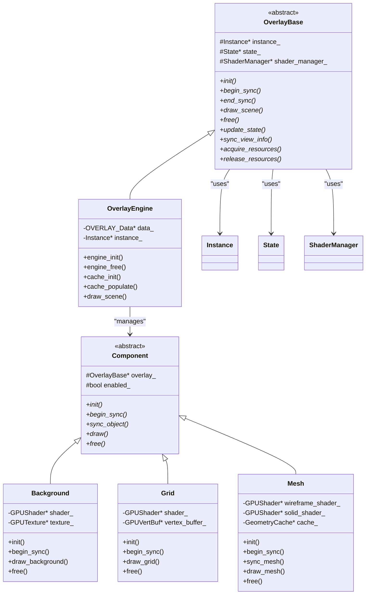
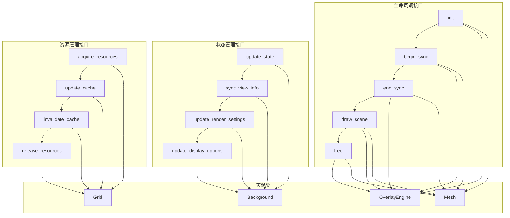
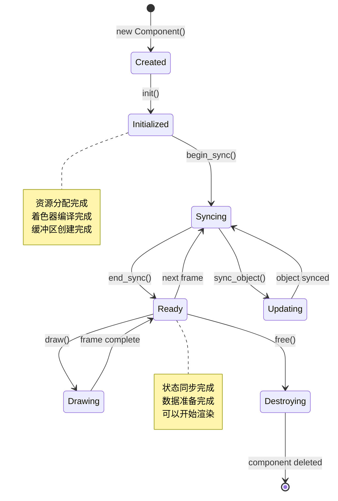
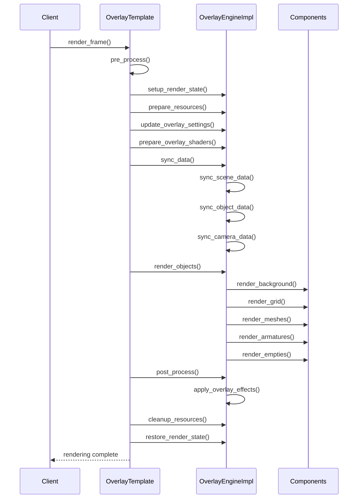

# overlay_base.hh 详解

## 概述

`overlay_base.hh` 是Overlay引擎的核心头文件，定义了Overlay系统的基类架构、接口规范和核心数据结构。本文档详细解析该文件的内容，包括类继承关系、虚函数接口、组件生命周期管理等关键概念。

## 文件结构概览

```cpp
// overlay_base.hh 文件结构
#pragma once

#include "draw_manager.hh"
#include "gpu_context.hh"

// 前向声明
class Instance;
class State;
class ShaderManager;

// 基类定义
class OverlayBase {
    // 核心接口定义
};

// 组件基类
class Component {
    // 组件接口定义
};

// 工具类和辅助函数
namespace overlay {
    // 工具函数
}
```

## Overlay基类架构

### OverlayBase 核心类

```cpp
class OverlayBase {
public:
    virtual ~OverlayBase() = default;
    
    // 生命周期接口
    virtual void init() = 0;
    virtual void begin_sync() = 0;
    virtual void end_sync() = 0;
    virtual void draw_scene() = 0;
    virtual void free() = 0;
    
    // 状态管理接口
    virtual void update_state(const State& state) = 0;
    virtual void sync_view_info(const ViewInfo& view_info) = 0;
    
    // 资源管理接口
    virtual void acquire_resources() = 0;
    virtual void release_resources() = 0;
    
protected:
    Instance* instance_;
    State* state_;
    ShaderManager* shader_manager_;
};
```

### Overlay基类架构图



## 虚函数接口系统

### 核心虚函数接口

#### 1. 生命周期接口

```cpp
// 初始化接口
virtual void init() = 0;
virtual void free() = 0;

// 同步接口
virtual void begin_sync() = 0;
virtual void end_sync() = 0;

// 渲染接口
virtual void draw_scene() = 0;
```

#### 2. 状态管理接口

```cpp
// 状态更新
virtual void update_state(const State& state) = 0;
virtual void sync_view_info(const ViewInfo& view_info) = 0;

// 渲染设置
virtual void update_render_settings(const RenderSettings& settings) = 0;
virtual void update_display_options(const DisplayOptions& options) = 0;
```

#### 3. 资源管理接口

```cpp
// 资源获取和释放
virtual void acquire_resources() = 0;
virtual void release_resources() = 0;

// 缓存管理
virtual void update_cache() = 0;
virtual void invalidate_cache() = 0;
```

### 虚函数接口图



## 组件基类系统

### Component 基类定义

```cpp
class Component {
public:
    Component(OverlayBase* overlay) : overlay_(overlay), enabled_(true) {}
    virtual ~Component() = default;
    
    // 核心接口
    virtual void init() = 0;
    virtual void begin_sync() = 0;
    virtual void sync_object(Object* object) = 0;
    virtual void draw() = 0;
    virtual void free() = 0;
    
    // 状态管理
    void set_enabled(bool enabled) { enabled_ = enabled; }
    bool is_enabled() const { return enabled_; }
    
    // 资源访问
    Instance* get_instance() const;
    State* get_state() const;
    ShaderManager* get_shader_manager() const;

protected:
    OverlayBase* overlay_;
    bool enabled_;
    
    // 辅助方法
    GPUShader* load_shader(const char* vertex, const char* fragment);
    void bind_shader(GPUShader* shader);
    void unbind_shader();
};
```

### 组件继承层次

```cpp
// 几何组件基类
class GeometryComponent : public Component {
public:
    GeometryComponent(OverlayBase* overlay) : Component(overlay) {}
    
    virtual void sync_geometry() = 0;
    virtual void update_vertex_buffer() = 0;
    virtual void update_index_buffer() = 0;

protected:
    GPUVertBuf* vertex_buffer_;
    GPUIndexBuf* index_buffer_;
    GeometryCache* geometry_cache_;
};

// 渲染组件基类
class RenderComponent : public Component {
public:
    RenderComponent(OverlayBase* overlay) : Component(overlay) {}
    
    virtual void setup_render_state() = 0;
    virtual void restore_render_state() = 0;
    virtual void bind_uniforms() = 0;

protected:
    GPUShader* shader_;
    GPUUniformBuf* uniform_buffer_;
    RenderState render_state_;
};
```

## 组件生命周期管理

### 生命周期状态图



### 生命周期实现

```cpp
// 组件生命周期管理器
class ComponentLifecycleManager {
private:
    std::vector<std::unique_ptr<Component>> components_;
    ComponentState state_;
    
public:
    void add_component(std::unique_ptr<Component> component) {
        components_.push_back(std::move(component));
    }
    
    void initialize_all() {
        for (auto& component : components_) {
            component->init();
        }
        state_ = ComponentState::Initialized;
    }
    
    void begin_sync_all() {
        for (auto& component : components_) {
            if (component->is_enabled()) {
                component->begin_sync();
            }
        }
        state_ = ComponentState::Syncing;
    }
    
    void end_sync_all() {
        for (auto& component : components_) {
            if (component->is_enabled()) {
                component->end_sync();
            }
        }
        state_ = ComponentState::Ready;
    }
    
    void draw_all() {
        for (auto& component : components_) {
            if (component->is_enabled()) {
                component->draw();
            }
        }
    }
    
    void free_all() {
        for (auto& component : components_) {
            component->free();
        }
        components_.clear();
        state_ = ComponentState::Destroyed;
    }
};
```

## 模板方法模式实现

### 模板方法基类

```cpp
class OverlayTemplate {
public:
    // 模板方法 - 定义算法骨架
    void render_frame() {
        // 1. 预处理阶段
        pre_process();
        
        // 2. 同步阶段
        sync_data();
        
        // 3. 渲染阶段
        render_objects();
        
        // 4. 后处理阶段
        post_process();
    }
    
    // 钩子方法 - 提供扩展点
    virtual void pre_process() {
        // 默认实现
        setup_render_state();
        prepare_resources();
    }
    
    virtual void post_process() {
        // 默认实现
        cleanup_resources();
        restore_render_state();
    }

protected:
    // 纯虚函数 - 必须由子类实现
    virtual void sync_data() = 0;
    virtual void render_objects() = 0;
    
    // 辅助方法
    virtual void setup_render_state() {}
    virtual void prepare_resources() {}
    virtual void cleanup_resources() {}
    virtual void restore_render_state() {}
};
```

### 具体实现类

```cpp
class OverlayEngineImpl : public OverlayTemplate {
protected:
    void sync_data() override {
        // 同步场景数据
        sync_scene_data();
        sync_object_data();
        sync_camera_data();
    }
    
    void render_objects() override {
        // 渲染各个组件
        render_background();
        render_grid();
        render_meshes();
        render_armatures();
        render_empties();
    }
    
    void pre_process() override {
        OverlayTemplate::pre_process();
        // Overlay特定的预处理
        update_overlay_settings();
        prepare_overlay_shaders();
    }
    
    void post_process() override {
        // Overlay特定的后处理
        apply_overlay_effects();
        OverlayTemplate::post_process();
    }

private:
    void sync_scene_data() { /* 实现 */ }
    void sync_object_data() { /* 实现 */ }
    void sync_camera_data() { /* 实现 */ }
    void render_background() { /* 实现 */ }
    void render_grid() { /* 实现 */ }
    void render_meshes() { /* 实现 */ }
    void render_armatures() { /* 实现 */ }
    void render_empties() { /* 实现 */ }
    void update_overlay_settings() { /* 实现 */ }
    void prepare_overlay_shaders() { /* 实现 */ }
    void apply_overlay_effects() { /* 实现 */ }
};
```

### 模板方法模式图



## 状态管理系统

### State 类定义

```cpp
class State {
public:
    // 视图状态
    struct ViewState {
        float4x4 view_matrix;
        float4x4 projection_matrix;
        float4x4 view_projection_matrix;
        float3 camera_position;
        float3 camera_direction;
        float fov;
        float near_clip;
        float far_clip;
    } view_state;
    
    // 渲染状态
    struct RenderState {
        bool wireframe_mode;
        bool material_preview;
        bool face_orientation;
        float3 grid_color;
        float3 background_color;
        float grid_scale;
        int grid_subdivisions;
    } render_state;
    
    // 对象状态
    struct ObjectState {
        Object* active_object;
        std::vector<Object*> selected_objects;
        std::vector<Object*> visible_objects;
        bool in_edit_mode;
        bool in_sculpt_mode;
        bool in_paint_mode;
    } object_state;
    
    // 状态更新方法
    void update_view_state(const RegionView3D* rv3d);
    void update_render_state(const View3D* v3d);
    void update_object_state(const Scene* scene);
    
    // 状态查询方法
    bool is_object_selected(const Object* object) const;
    bool is_object_visible(const Object* object) const;
    bool is_in_edit_mode() const { return object_state.in_edit_mode; }
};
```

## 着色器管理系统

### ShaderManager 类

```cpp
class ShaderManager {
private:
    std::map<std::string, GPUShader*> shaders_;
    std::map<std::string, std::string> shader_sources_;
    
public:
    // 着色器加载和编译
    GPUShader* load_shader(const std::string& name, 
                          const std::string& vertex_source,
                          const std::string& fragment_source);
    
    GPUShader* get_shader(const std::string& name);
    
    // 着色器管理
    void reload_shaders();
    void free_shaders();
    
    // 预定义着色器
    GPUShader* get_wireframe_shader();
    GPUShader* get_solid_shader();
    GPUShader* get_grid_shader();
    GPUShader* get_background_shader();
    
private:
    GPUShader* compile_shader(const std::string& vertex_source,
                             const std::string& fragment_source);
    bool validate_shader(GPUShader* shader);
};
```

## 资源管理系统

### ResourceManager 类

```cpp
class ResourceManager {
private:
    std::vector<GPUVertBuf*> vertex_buffers_;
    std::vector<GPUIndexBuf*> index_buffers_;
    std::vector<GPUTexture*> textures_;
    std::vector<GPUUniformBuf*> uniform_buffers_;
    
public:
    // 缓冲区管理
    GPUVertBuf* create_vertex_buffer(size_t size);
    GPUIndexBuf* create_index_buffer(size_t size);
    void release_buffer(GPUVertBuf* buffer);
    void release_buffer(GPUIndexBuf* buffer);
    
    // 纹理管理
    GPUTexture* create_texture(int width, int height, GPUTextureFormat format);
    void release_texture(GPUTexture* texture);
    
    // 统一缓冲区管理
    GPUUniformBuf* create_uniform_buffer(size_t size);
    void release_uniform_buffer(GPUUniformBuf* buffer);
    
    // 批量操作
    void release_all_resources();
    void garbage_collect();
    
private:
    void track_resource(void* resource);
    void untrack_resource(void* resource);
};
```

## 错误处理和调试

### 异常处理

```cpp
class OverlayException : public std::exception {
private:
    std::string message_;
    ErrorCode error_code_;
    
public:
    OverlayException(const std::string& message, ErrorCode code)
        : message_(message), error_code_(code) {}
    
    const char* what() const noexcept override {
        return message_.c_str();
    }
    
    ErrorCode get_error_code() const { return error_code_; }
};

// 错误代码枚举
enum class ErrorCode {
    SHADER_COMPILATION_FAILED,
    BUFFER_ALLOCATION_FAILED,
    TEXTURE_CREATION_FAILED,
    INVALID_STATE,
    RESOURCE_NOT_FOUND,
    OUT_OF_MEMORY
};
```

### 调试支持

```cpp
class DebugOverlay {
public:
    // 调试信息收集
    struct DebugInfo {
        uint32_t draw_calls;
        uint32_t triangles_rendered;
        uint32_t vertices_processed;
        float frame_time;
        float gpu_time;
        size_t memory_usage;
    };
    
    // 调试方法
    void begin_debug_frame();
    void end_debug_frame();
    void log_draw_call();
    void log_triangle_count(uint32_t count);
    void log_memory_usage(size_t bytes);
    
    // 调试信息获取
    DebugInfo get_debug_info() const;
    void print_debug_info() const;
    
    // 调试可视化
    void enable_wireframe_overlay(bool enable);
    void enable_bounding_boxes(bool enable);
    void enable_normals_display(bool enable);

private:
    DebugInfo current_frame_;
    bool debug_enabled_;
};
```

## 性能优化

### 内存池管理

```cpp
class MemoryPool {
private:
    struct Block {
        void* memory;
        size_t size;
        bool in_use;
    };
    
    std::vector<Block> blocks_;
    size_t total_allocated_;
    size_t peak_usage_;
    
public:
    void* allocate(size_t size, size_t alignment = 16);
    void deallocate(void* ptr);
    void reset();
    
    // 统计信息
    size_t get_total_allocated() const { return total_allocated_; }
    size_t get_peak_usage() const { return peak_usage_; }
    size_t get_fragmentation() const;
    
private:
    Block* find_free_block(size_t size);
    void merge_free_blocks();
};
```

### 批量渲染优化

```cpp
class BatchRenderer {
private:
    struct Batch {
        GPUVertBuf* vertex_buffer;
        GPUIndexBuf* index_buffer;
        GPUShader* shader;
        uint32_t start_index;
        uint32_t count;
    };
    
    std::vector<Batch> batches_;
    GPUShader* current_shader_;
    
public:
    void begin_batch(GPUShader* shader);
    void add_mesh(const MeshData& mesh);
    void end_batch();
    void render_batches();
    
private:
    bool can_batch_with_current(const MeshData& mesh) const;
    void flush_current_batch();
};
```

## 总结

`overlay_base.hh` 定义了Overlay引擎的核心架构，通过抽象基类、虚函数接口、模板方法模式等设计模式，提供了一个灵活、可扩展的渲染框架。该文件的主要特点包括：

1. **清晰的架构分层**: 基类定义接口，具体类实现功能
2. **灵活的组件系统**: 支持动态添加和管理渲染组件
3. **完整的生命周期管理**: 从初始化到销毁的完整流程控制
4. **高效的资源管理**: 统一的资源分配和释放机制
5. **强大的调试支持**: 丰富的调试和性能分析工具

这个架构为Overlay引擎提供了坚实的基础，支持复杂的3D覆盖层渲染需求，同时保持了代码的可维护性和可扩展性。