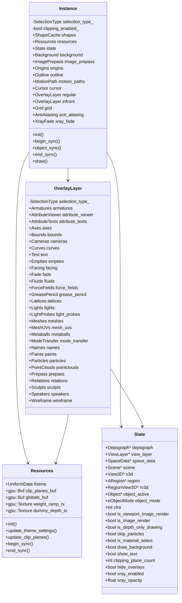
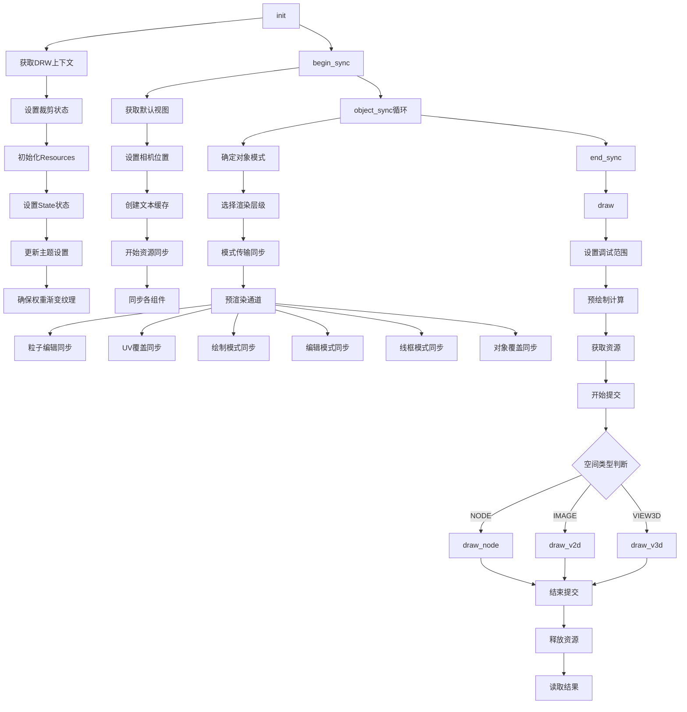
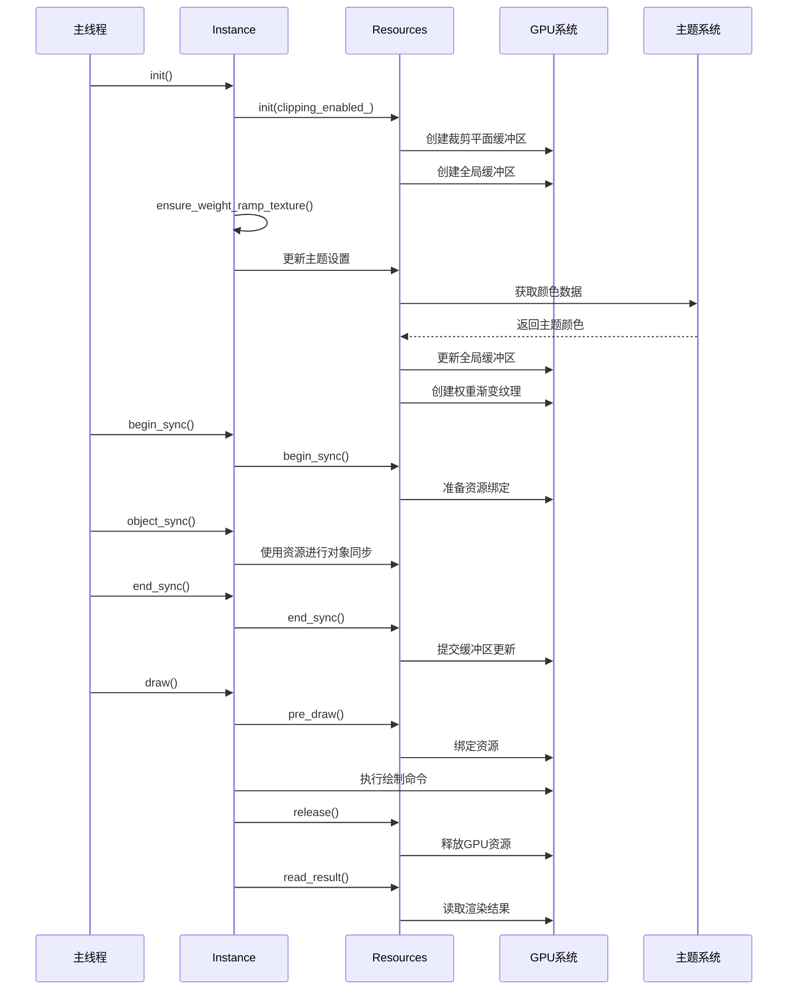

# overlay_instance.cc 详解

## 概述

`overlay_instance.cc` 是Blender Overlay引擎的核心实现文件，负责管理3D视图中所有覆盖元素的渲染。该文件包含了Instance类的完整实现，处理从初始化到最终渲染的整个流程。

## Instance类架构



## 渲染流程图



## 组件管理流程图

```mermaid
flowchart TD
    A[begin_sync] --> B[背景组件同步]
    B --> C[光标组件同步]
    C --> D[图像预通道同步]
    D --> E[运动路径同步]
    E --> F[原点同步]
    F --> G[轮廓同步]
    
    G --> H[Regular层级同步]
    H --> I[Armatures同步]
    I --> J[AttributeViewer同步]
    J --> K[AttributeTexts同步]
    K --> L[Axes同步]
    L --> M[Bounds同步]
    M --> N[Cameras同步]
    N --> O[Curves同步]
    O --> P[Text同步]
    P --> Q[Empties同步]
    Q --> R[Facing同步]
    R --> S[Fade同步]
    S --> T[ForceFields同步]
    T --> U[Fluids同步]
    U --> V[GreasePencil同步]
    V --> W[Lattices同步]
    W --> X[Lights同步]
    X --> Y[LightProbes同步]
    Y --> Z[Meshes同步]
    Z --> AA[MeshUVs同步]
    AA --> BB[ModeTransfer同步]
    BB --> CC[Names同步]
    CC --> DD[Paints同步]
    DD --> EE[Particles同步]
    EE --> FF[PointClouds同步]
    FF --> GG[Prepass同步]
    GG --> HH[Relations同步]
    HH --> II[Sculpts同步]
    II --> JJ[Speakers同步]
    JJ --> KK[Wireframe同步]
    
    KK --> LL[InFront层级同步]
    LL --> MM[重复所有组件同步]
    
    MM --> NN[Grid同步]
    NN --> OO[AntiAliasing同步]
    OO --> PP[XrayFade同步]
```



## 资源管理时序图



## 核心功能详解

### 1. 初始化流程 (init)

`init()` 方法是Instance的初始化入口，负责：

- 获取DRW上下文信息
- 设置裁剪状态
- 初始化资源管理器
- 配置渲染状态
- 更新主题设置
- 创建权重渐变纹理

### 2. 对象同步 (object_sync)

`object_sync()` 是核心的对象处理方法，根据对象类型和模式进行不同的处理：

- **模式判断**: 确定对象处于对象模式、编辑模式、绘制模式还是雕刻模式
- **层级选择**: 根据对象属性选择regular或infront渲染层级
- **组件同步**: 调用相应组件的同步方法处理对象数据

### 3. 渲染流程 (draw)

`draw()` 方法负责最终的渲染执行：

- **调试范围设置**: 根据渲染类型设置GPU调试范围
- **预绘制计算**: 执行所有计算步骤避免GPU上下文切换
- **空间类型处理**: 根据不同空间类型调用相应的绘制方法
- **资源管理**: 获取和释放渲染资源

### 4. 资源管理 (Resources)

Resources类负责管理所有渲染资源：

- **主题管理**: 动态更新主题颜色和设置
- **缓冲区管理**: 管理裁剪平面、全局数据等缓冲区
- **纹理管理**: 创建和管理权重渐变等纹理
- **GPU资源**: 管理GPU纹理和缓冲区的生命周期

## 关键特性

### 1. 双层级渲染系统

Instance包含两个OverlayLayer：regular和infront，分别处理：
- **regular**: 普通覆盖元素
- **infront**: 需要在最前面显示的元素（如骨骼、X射线模式）

### 2. 模式感知渲染

系统能够根据不同的对象模式（编辑、绘制、雕刻、粒子编辑）调整渲染行为：

```cpp
const bool in_object_mode = ob_ref.object->mode == OB_MODE_OBJECT;
const bool in_edit_mode = ob_ref.object->mode == OB_MODE_EDIT;
const bool in_paint_mode = object_is_paint_mode(ob_ref.object);
const bool in_sculpt_mode = object_is_sculpt_mode(ob_ref);
const bool in_particle_edit_mode = object_is_particle_edit_mode(ob_ref);
```

### 3. 资源优化

- **权重渐变纹理缓存**: 只在需要时重新创建
- **主题设置批量更新**: 一次性更新所有主题相关数据
- **GPU资源引用计数**: 防止资源被意外释放

### 4. 空间类型适配

支持多种空间类型的渲染：
- **SPACE_VIEW3D**: 3D视图的主要渲染
- **SPACE_IMAGE**: 图像编辑器的UV覆盖
- **SPACE_NODE**: 节点编辑器的背景处理

## 性能优化

1. **预计算可见性**: 在绘制前批量计算所有对象的可见性
2. **资源复用**: 通过SwapChain机制复用缓冲区
3. **批量更新**: 减少GPU状态切换
4. **条件渲染**: 根据状态跳过不必要的渲染步骤

这个文件体现了Blender现代渲染系统的设计理念：模块化、高效、可扩展。通过清晰的架构分层和资源管理，实现了复杂的3D视图覆盖功能。