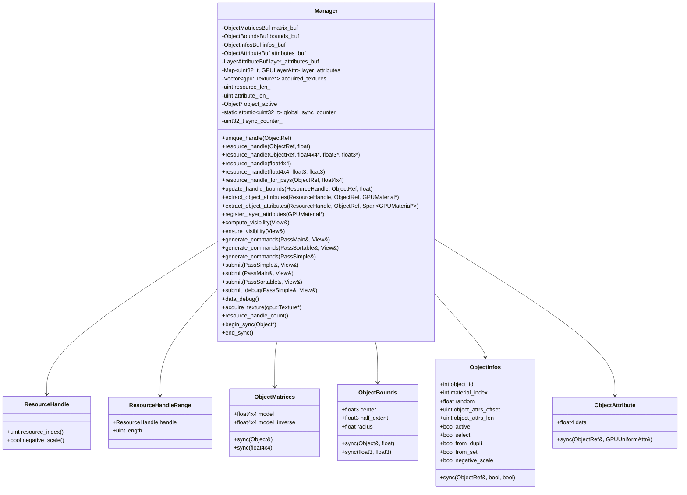
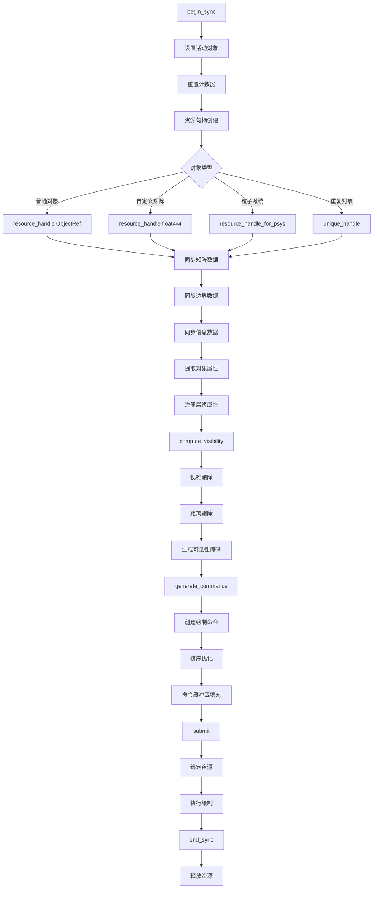
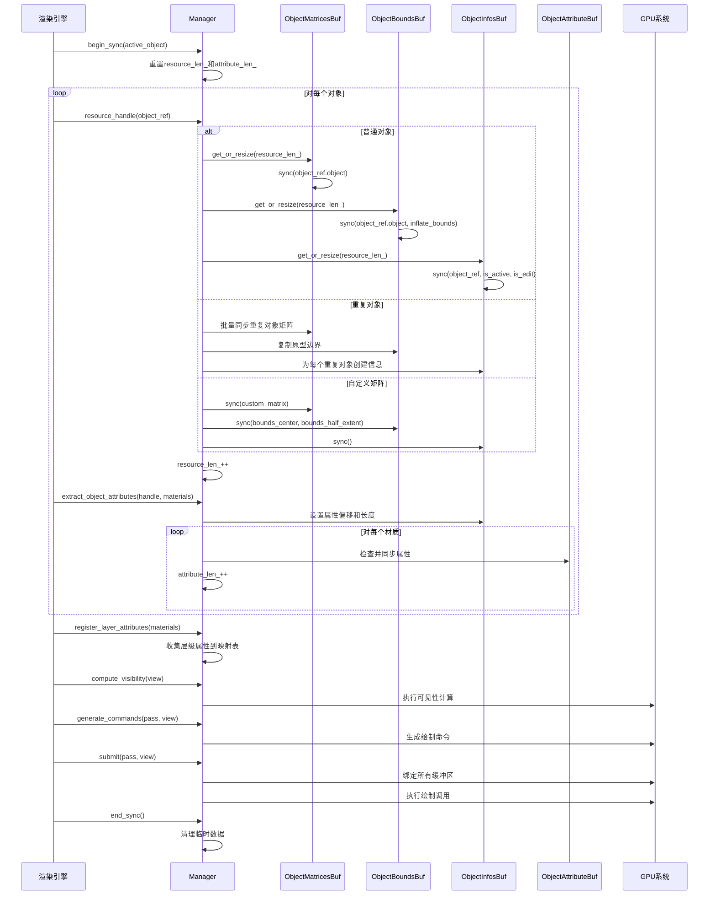

# draw_manager.hh 详解

## 概述

`draw_manager.hh` 是Blender绘制系统的核心管理器，作为场景数据和视口引擎之间的接口。它负责管理每个组件的数据（ObjectInfo、ObjectMatrices等），并通过ResourceHandle进行索引。这个类是现代Blender绘制架构的核心组件，正在逐步替代旧的绘制管理器。

## Manager类架构



## 资源管理流程图



## 缓冲区管理图

```mermaid
graph TB
    subgraph "SwapChain缓冲区系统"
        A[ObjectMatricesBuf] --> A1[当前缓冲区]
        A --> A2[历史缓冲区]
        A1 --> A3[模型矩阵]
        A1 --> A4[逆模型矩阵]
        
        B[ObjectBoundsBuf] --> B1[当前缓冲区]
        B --> B2[历史缓冲区]
        B1 --> B3[边界中心]
        B1 --> B4[边界半尺寸]
        B1 --> B5[边界半径]
        
        C[ObjectInfosBuf] --> C1[当前缓冲区]
        C --> C2[历史缓冲区]
        C1 --> C3[对象ID]
        C1 --> C4[材质索引]
        C1 --> C5[随机值]
        C1 --> C6[属性偏移]
        C1 --> C7[状态标志]
    end
    
    subgraph "动态缓冲区"
        D[ObjectAttributeBuf] --> D1[属性数据]
        D1 --> D2[颜色属性]
        D1 --> D3[自定义属性]
        
        E[LayerAttributeBuf] --> E1[层级属性]
        E1 --> E2[视图层属性]
        E1 --> E3[全局属性]
    end
    
    subgraph "资源映射"
        F[layer_attributes Map] --> F1[哈希表]
        F1 --> F2[属性哈希码]
        F2 --> F3[GPU层属性]
    end
    
    subgraph "纹理管理"
        G[acquired_textures] --> G1[纹理引用计数]
        G1 --> G2[图像纹理]
        G1 --> G3[渲染目标]
    end
    
    A1 --> H[GPU绑定]
    B1 --> H
    C1 --> H
    D1 --> H
    E1 --> H
    G1 --> H
```



## 对象同步流程图



## 核心数据结构详解

### 1. ObjectMatrices (对象矩阵)

```cpp
struct ObjectMatrices {
    float4x4 model;           // 模型矩阵
    float4x4 model_inverse;    // 逆模型矩阵
    
    void sync(const Object &object);
    void sync(const float4x4 &model_matrix);
};
```

存储对象的变换矩阵，用于顶点变换和法线计算。

### 2. ObjectBounds (对象边界)

```cpp
struct ObjectBounds {
    float3 center;         // 边界球中心
    float3 half_extent;    // AABB半尺寸
    float radius;          // 边界球半径
    
    void sync(const Object &object, float inflate_bounds = 0.0f);
    void sync(const float3 &center, const float3 &half_extent);
};
```

用于视锥剔除和距离剔除。

### 3. ObjectInfos (对象信息)

```cpp
struct ObjectInfos {
    int32_t object_id;           // 对象ID
    int32_t material_index;      // 材质索引
    float random;                // 随机值
    uint32_t object_attrs_offset; // 属性数据偏移
    uint32_t object_attrs_len;   // 属性数据长度
    bool active;                 // 是否为活动对象
    bool select;                 // 是否被选中
    bool from_dupli;             // 是否来自重复对象
    bool from_set;               // 是否来自集合
    bool negative_scale;         // 是否有负缩放
};
```

包含着色器需要的对象状态信息。

### 4. ObjectAttribute (对象属性)

```cpp
struct ObjectAttribute {
    float4 data;  // 属性数据（颜色、浮点数等）
    
    bool sync(const ObjectRef &ref, const GPUUniformAttr &attr);
};
```

存储自定义属性数据，支持颜色、浮点数等类型。

## 关键功能详解

### 1. 资源句柄管理

Manager提供多种资源句柄创建方法：

- **unique_handle()**: 为对象创建唯一句柄，避免重复
- **resource_handle()**: 为对象创建新的资源句柄
- **resource_handle_for_psys()**: 为粒子系统创建特殊句柄
- **resource_handle(matrix)**: 为自定义矩阵创建句柄

### 2. 可见性计算

```cpp
void compute_visibility(View &view);
void ensure_visibility(View &view);
```

- **视锥剔除**: 基于边界球进行视锥剔除
- **距离剔除**: 根据距离阈值剔除对象
- **分层剔除**: 支持多层级可见性判断

### 3. 命令生成

```cpp
void generate_commands(PassMain &pass, View &view);
void generate_commands(PassSortable &pass, View &view);
void generate_commands(PassSimple &pass);
```

- **PassMain**: 支持GPU实例化和排序的复杂通道
- **PassSortable**: 支持深度排序的透明对象通道
- **PassSimple**: 简单的CPU端命令生成

### 4. 属性系统

支持两种类型的属性：

- **对象属性**: 每个对象独立的属性数据
- **层级属性**: 整个视图层共享的属性数据

## 性能优化特性

### 1. SwapChain缓冲区

使用双缓冲机制避免GPU同步：

```cpp
SwapChain<ObjectMatricesBuf, 2> matrix_buf;
SwapChain<ObjectBoundsBuf, 2> bounds_buf;
SwapChain<ObjectInfosBuf, 2> infos_buf;
```

### 2. 批量处理

- **重复对象批量处理**: 一次性处理所有重复对象
- **属性去重**: 避免重复添加相同属性
- **材质分组**: 按材质分组减少状态切换

### 3. 内存优化

- **动态增长**: 缓冲区按需增长
- **紧凑存储**: 使用紧凑的数据结构
- **引用计数**: 纹理资源的自动管理

### 4. GPU优化

- **计算着色器**: 使用GPU进行可见性计算
- **间接绘制**: 支持GPU驱动的渲染
- **预编译**: 着色器特化常量预编译

## 调试和诊断

### 1. 调试输出

```cpp
struct SubmitDebugOutput {
    Span<uint32_t> visibility;    // 可见性数据
    Span<uint32_t> resource_id;    // 资源ID
};

struct DataDebugOutput {
    Span<ObjectMatrices> matrices; // 矩阵数据
    Span<ObjectBounds> bounds;     // 边界数据
    Span<ObjectInfos> infos;       // 信息数据
};
```

### 2. 指纹系统

```cpp
uint64_t fingerprint_get();
```

用于检测管理器状态变化，辅助调试。

## 使用模式

### 1. 标准渲染流程

```cpp
manager.begin_sync(active_object);

for (ObjectRef &ob_ref : objects) {
    ResourceHandle handle = manager.unique_handle(ob_ref);
    manager.extract_object_attributes(handle, ob_ref, materials);
}

manager.compute_visibility(view);
manager.generate_commands(pass, view);
manager.submit(pass, view);

manager.end_sync();
```

### 2. 优化的批量处理

```cpp
// 批量可见性计算
manager.compute_visibility(view1);
manager.compute_visibility(view2);

// 批量命令生成
manager.generate_commands(pass1, view1);
manager.generate_commands(pass2, view1);

// 批量提交
manager.submit(pass1, view1);
manager.submit(pass2, view1);
```

这个Manager类体现了现代GPU渲染的设计理念：数据驱动、批量处理、GPU加速。通过精心设计的数据结构和算法，实现了高效的3D场景渲染管理。