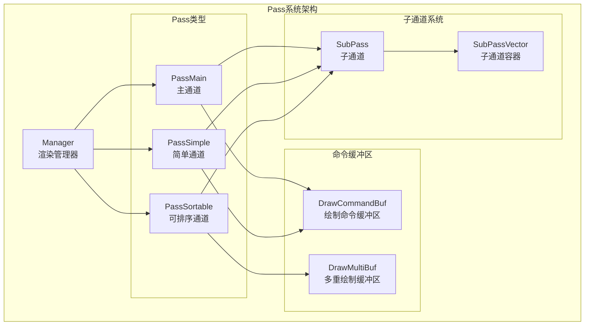
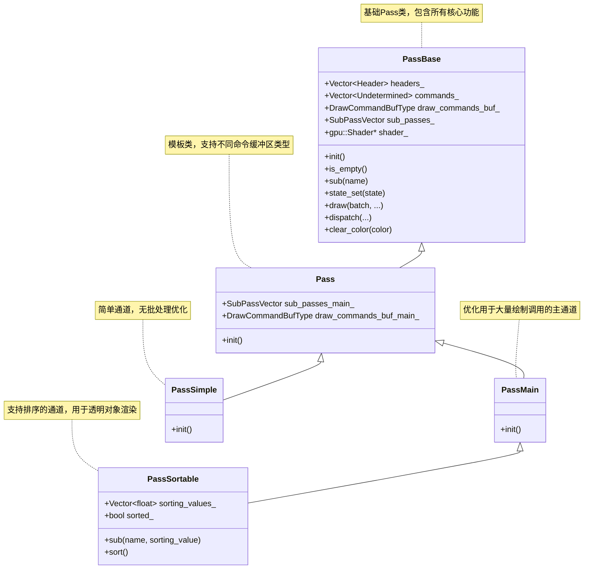
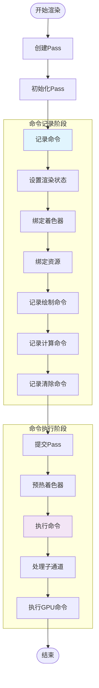
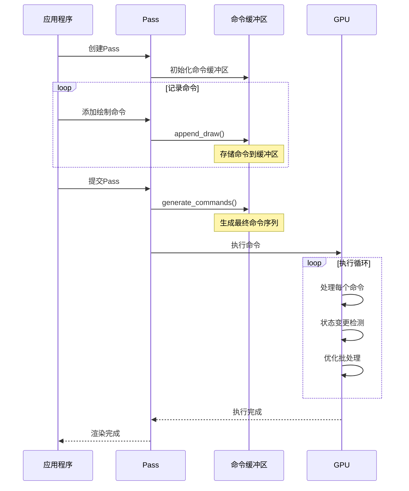
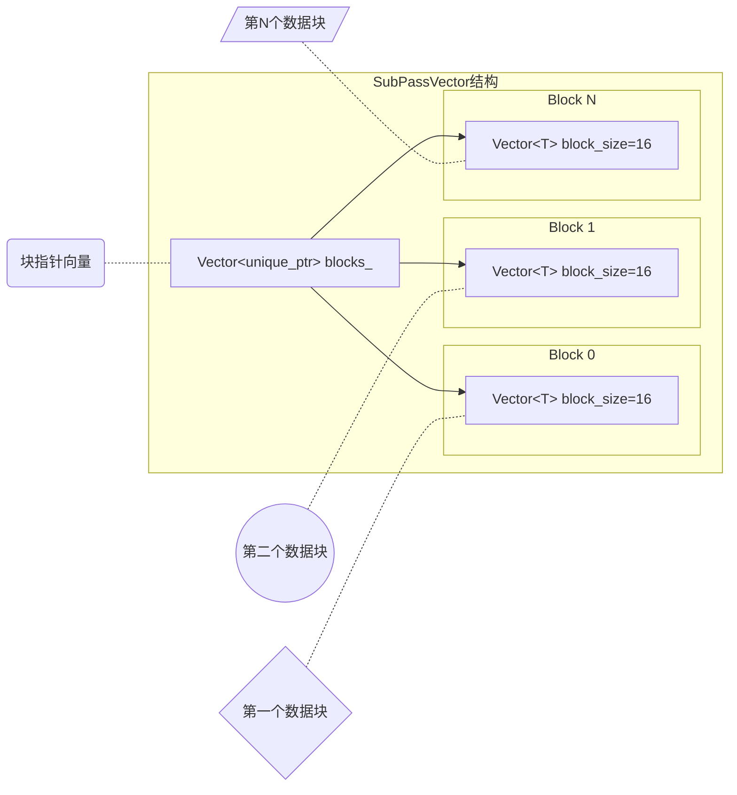
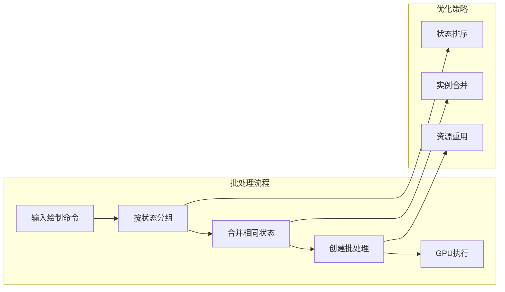

# draw_pass.hh 详解

## 概述

`draw_pass.hh` 是Blender绘制系统的核心组件，负责管理渲染通道(Pass)的创建、记录和执行。Pass系统是Blender GPU渲染架构的基础，提供了高效的命令录制和执行机制。

## 核心概念

### Pass系统架构



*图1: Pass系统整体架构，展示了不同类型的Pass及其相互关系*

### Pass类型关系图



*图2: Pass类型继承关系图*

## 渲染流程

### 渲染流程图



*图3: Pass渲染完整流程，从创建到执行*

### 命令缓冲区管理



*图4: 命令缓冲区管理时序图*

## 核心组件详解

### PassBase模板类

`PassBase`是所有Pass类型的基础模板类，提供了以下核心功能：

#### 命令管理
- **headers_**: 存储命令头部的向量，按类型分组
- **commands_**: 存储实际命令数据的向量
- **draw_commands_buf_**: 绘制命令缓冲区引用
- **sub_passes_**: 子通道容器

#### 状态管理
- **shader_**: 当前绑定的着色器
- **manager_fingerprint_**: 管理器指纹，用于检测变更
- **view_fingerprint_**: 视图指纹，用于检测变更

### SubPassVector容器

`SubPassVector`是一个特殊的容器，用于高效管理子通道：



*图5: SubPassVector内存布局*

### 命令类型系统

Pass系统支持多种命令类型：

```mermaid
graph TD
    Commands[命令类型]
    
    subgraph "绘制命令"
        Draw[Draw<br/>单次绘制]
        DrawMulti[DrawMulti<br/>多重绘制]
        DrawIndirect[DrawIndirect<br/>间接绘制]
    end
    
    subgraph "计算命令"
        Dispatch[Dispatch<br/>计算调度]
        DispatchIndirect[DispatchIndirect<br/>间接计算]
    end
    
    subgraph "状态命令"
        StateSet[StateSet<br/>状态设置]
        StencilSet[StencilSet<br/>模板设置]
        ShaderBind[ShaderBind<br/>着色器绑定]
    end
    
    subgraph "资源命令"
        ResourceBind[ResourceBind<br/>资源绑定]
        PushConstant[PushConstant<br/>常量推送]
        SpecializeConstant[SpecializeConstant<br/>特化常量]
    end
    
    subgraph "帧缓冲命令"
        FramebufferBind[FramebufferBind<br/>帧缓冲绑定]
        SubPassTransition[SubPassTransition<br/>子通道转换]
        Clear[Clear<br/>清除操作]
        ClearMulti[ClearMulti<br/>多重清除]
    end
    
    subgraph "同步命令"
        Barrier[Barrier<br/>内存屏障]
    end
    
    Commands --> Draw
    Commands --> DrawMulti
    Commands --> DrawIndirect
    Commands --> Dispatch
    Commands --> DispatchIndirect
    Commands --> StateSet
    Commands --> StencilSet
    Commands --> ShaderBind
    Commands --> ResourceBind
    Commands --> PushConstant
    Commands --> SpecializeConstant
    Commands --> FramebufferBind
    Commands --> SubPassTransition
    Commands --> Clear
    Commands --> ClearMulti
    Commands --> Barrier
```



*图6: Pass系统支持的命令类型*

## 性能优化特性

### 批处理优化

PassMain类型支持自动批处理优化：



*图7: 批处理优化流程*

### 内存管理

Pass系统采用高效的内存管理策略：

1. **预分配**: 向量容器预分配内存空间
2. **块分配**: SubPassVector使用块分配策略
3. **引用计数**: 资源使用引用计数管理
4. **延迟清理**: 延迟清理未使用的内存

## 使用示例

### 基本使用模式

```cpp
// 创建主Pass
PassMain main_pass("MyPass");
main_pass.init();

// 设置渲染状态
main_pass.state_set(DRW_STATE_WRITE_COLOR | DRW_STATE_WRITE_DEPTH);
main_pass.shader_set(shader);

// 绑定资源
main_pass.bind_texture("colorTex", texture);
main_pass.bind_ubo("uniforms", ubo);

// 添加绘制命令
main_pass.draw(batch, instance_count);

// 提交执行
main_pass.submit(state);
```

### 子通道使用

```cpp
// 创建子通道
auto& sub_pass = main_pass.sub("SubPass1");
sub_pass.state_set(DRW_STATE_BLEND_ALPHA);
sub_pass.draw(transparent_batch, instance_count);

// 子通道会自动插入到父Pass的适当位置
```

## 总结

`draw_pass.hh` 提供了一个强大而灵活的渲染通道管理系统，具有以下特点：

1. **模块化设计**: 支持多种Pass类型，满足不同渲染需求
2. **高效批处理**: 自动优化绘制调用，减少GPU状态切换
3. **灵活的命令系统**: 支持丰富的GPU命令类型
4. **内存优化**: 采用高效的内存管理策略
5. **易于扩展**: 模板化设计便于添加新功能

这个系统是Blender现代渲染架构的核心，为高性能实时渲染提供了坚实的基础。