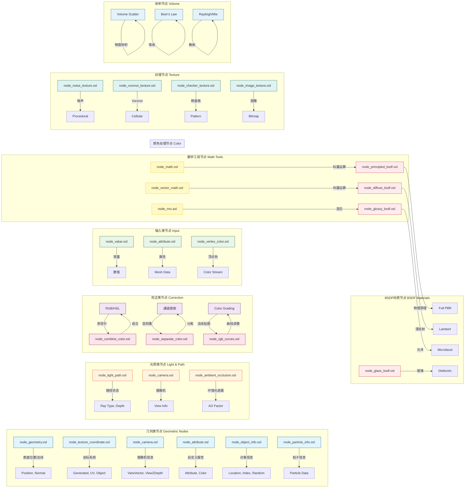

# 005-intern_cycles_kernel_osl_shaders_node_light_path.osl 详解

> **文档版本**: v1.0
> **更新日期**: 2025-12-18
> **作者**: MiMo AI Assistant
> **引用位置**: `E:/blender-git/blender/intern/cycles/kernel/osl/shaders/node_light_path.osl`

---

## 📋 目录

- [1. 目录概览](#1-目录概览)
- [2. node_light_path.osl 详细分析](#2-node_light_pathosl-详细分析)
- [3. light_path 节点的数学原理](#3-light_path-节点的数学原理)
- [4. 与其他 OSL 文件的关联](#4-与其他-osl-文件的关联)
- [5. 实际应用示例](#5-实际应用示例)
- [6. 该目录下其他重要节点分类](#6-该目录下其他重要节点分类)
- [7. 代码解析](#7-代码解析)

---

## 1. 目录概览

### 1.1 文件统计

`E:/blender-git/blender/intern/cycles/kernel/osl/shaders/` 目录包含：

- **总计文件数**: 100 个文件
  - `.osl` 着色器文件: 83 个
  - `.h` 头文件: 17 个

### 1.2 OSL 文件命名模式

所有 `.osl` 文件遵循统一的命名约定：

```
node_<category>_<name>.osl
```

**分类前缀**包括：
- `node_` - 标准节点
- `node_<category>_` - 特定类别节点

**常见类别**：
- `node_texture_` - 纹理节点
- `node_bsdf_` - BSDF 材质节点
- `node_vector_` - 向量运算节点
- `node_convert_` - 类型转换节点
- `node_math_` - 数学运算节点
- `node_color_` - 颜色处理节点

### 1.3 .h 头文件的作用

头文件提供**共享功能**和**声明**：

| 头文件 | 作用 |
|--------|------|
| `stdcycles.h` | Cycles 标准库，包含常量定义和内置函数声明 |
| `node_fresnel.h` | 菲涅尔计算函数 |
| `node_math.h` | 数学运算工具函数 |
| `node_color.h` | 颜色处理工具函数 |
| `node_voronoi.h` | Voronoi 纹理算法 |
| `node_noise.h` | 噪声纹理算法 |
| `node_hash.h` | 哈希函数 |
| `node_scatter.h` | 散射算法 |
| `node_color_blend.h` | 颜色混合工具 |
| `int_vector_types.h` | 向量类型定义 |
| `node_ramp_util.h` | 渐变工具 |
| `node_fresnel.h` | 菲涅尔函数 |
| `node_fractal_voronoi.h` | 分形 Voronoi |
| `node_math.h` | 数学工具 |

---

## 2. node_light_path.osl 详细分析

### 2.1 文件基本信息

**路径**: `E:/blender-git/blender/intern/cycles/kernel/osl/shaders/node_light_path.osl`

**大小**: 2128 字节

**版权**: Apache-2.0 (Blender Foundation 2011-2022)

### 2.2 完整代码分析

```osl
/* SPDX-FileCopyrightText: 2011-2022 Blender Foundation
 * SPDX-License-Identifier: Apache-2.0 */

#include "stdcycles.h"

shader node_light_path(output float IsCameraRay = 0.0,
                       output float IsShadowRay = 0.0,
                       output float IsDiffuseRay = 0.0,
                       output float IsGlossyRay = 0.0,
                       output float IsSingularRay = 0.0,
                       output float IsReflectionRay = 0.0,
                       output float IsTransmissionRay = 0.0,
                       output float IsVolumeScatterRay = 0.0,
                       output float RayLength = 0.0,
                       output float RayDepth = 0.0,
                       output float DiffuseDepth = 0.0,
                       output float GlossyDepth = 0.0,
                       output float TransparentDepth = 0.0,
                       output float TransmissionDepth = 0.0,
                       output float PortalDepth = 0.0)
{
  IsCameraRay = raytype("camera");
  IsShadowRay = raytype("shadow");
  IsDiffuseRay = raytype("diffuse");
  IsGlossyRay = raytype("glossy");
  IsSingularRay = raytype("singular");
  IsReflectionRay = raytype("reflection");
  IsTransmissionRay = raytype("refraction");
  IsVolumeScatterRay = raytype("volume_scatter");

  getattribute("path:ray_length", RayLength);

  int ray_depth = 0;
  getattribute("path:ray_depth", ray_depth);
  RayDepth = (float)ray_depth;

  int diffuse_depth = 0;
  getattribute("path:diffuse_depth", diffuse_depth);
  DiffuseDepth = (float)diffuse_depth;

  int glossy_depth = 0;
  getattribute("path:glossy_depth", glossy_depth);
  GlossyDepth = (float)glossy_depth;

  int transparent_depth = 0;
  getattribute("path:transparent_depth", transparent_depth);
  TransparentDepth = (float)transparent_depth;

  int transmission_depth = 0;
  getattribute("path:transmission_depth", transmission_depth);
  TransmissionDepth = (float)transmission_depth;

  int portal_depth = 0;
  getattribute("path:portal_depth", portal_depth);
  PortalDepth = (float)portal_depth;
}
```

### 2.3 输出参数详解

<table>
<thead>
<tr>
<th>输出端口</th>
<th>数据类型</th>
<th>默认值</th>
<th>含义</th>
<th>取值范围</th>
</tr>
</thead>
<tbody>
<tr>
<td><strong>IsCameraRay</strong></td>
<td>float</td>
<td>0.0</td>
<td>当前射线是否为摄像机射线</td>
<td>0.0 或 1.0</td>
</tr>
<tr>
<td><strong>IsShadowRay</strong></td>
<td>float</td>
<td>0.0</td>
<td>当前射线是否为阴影射线</td>
<td>0.0 或 1.0</td>
</tr>
<tr>
<td><strong>IsDiffuseRay</strong></td>
<td>float</td>
<td>0.0</td>
<td>当前射线是否为漫反射射线</td>
<td>0.0 或 1.0</td>
</tr>
<tr>
<td><strong>IsGlossyRay</strong></td>
<td>float</td>
<td>0.0</td>
<td>当前射线是否为光泽（高光）射线</td>
<td>0.0 或 1.0</td>
</tr>
<tr>
<td><strong>IsSingularRay</strong></td>
<td>float</td>
<td>0.0</td>
<td>当前射线是否为奇异（镜面/折射）射线</td>
<td>0.0 或 1.0</td>
</tr>
<tr>
<td><strong>IsReflectionRay</strong></td>
<td>float</td>
<td>0.0</td>
<td>当前射线是否为反射射线</td>
<td>0.0 或 1.0</td>
</tr>
<tr>
<td><strong>IsTransmissionRay</strong></td>
<td>float</td>
<td>0.0</td>
<td>当前射线是否为透射（折射）射线</td>
<td>0.0 或 1.0</td>
</tr>
<tr>
<td><strong>IsVolumeScatterRay</strong></td>
<td>float</td>
<td>0.0</td>
<td>当前射线是否为体积散射射线</td>
<td>0.0 或 1.0</td>
</tr>
<tr>
<td><strong>RayLength</strong></td>
<td>float</td>
<td>0.0</td>
<td>射线行进的物理长度</td>
<td>≥ 0.0</td>
</tr>
<tr>
<td><strong>RayDepth</strong></td>
<td>float</td>
<td>0.0</td>
<td>射线总深度（反弹次数）</td>
<td>≥ 0</td>
</tr>
<tr>
<td><strong>DiffuseDepth</strong></td>
<td>float</td>
<td>0.0</td>
<td>漫反射反弹深度</td>
<td>≥ 0</td>
</tr>
<tr>
<td><strong>GlossyDepth</strong></td>
<td>float</td>
<td>0.0</td>
<td>光泽反弹深度</td>
<td>≥ 0</td>
</tr>
<tr>
<td><strong>TransparentDepth</strong></td>
<td>float</td>
<td>0.0</td>
<td>透明反弹深度</td>
<td>≥ 0</td>
</tr>
<tr>
<td><strong>TransmissionDepth</strong></td>
<td>float</td>
<td>0.0</td>
<td>透射反弹深度</td>
<td>≥ 0</td>
</tr>
<tr>
<td><strong>PortalDepth</strong></td>
<td>float</td>
<td>0.0</td>
<td>光线门户深度（特殊场景）</td>
<td>≥ 0</td>
</tr>
</tbody>
</table>

### 2.4 实际计算过程

**第一阶段：射线类型检测**
```
raytype("camera")     → 返回 1.0 如果是摄像机射线，否则 0.0
raytype("shadow")     → 返回 1.0 如果是阴影射线，否则 0.0
raytype("diffuse")    → 返回 1.0 如果是漫反射射线，否则 0.0
raytype("glossy")     → 返回 1.0 如果是光泽射线，否则 0.0
raytype("singular")   → 返回 1.0 如果是奇异射线，否则 0.0
raytype("reflection") → 返回 1.0 如果是反射射线，否则 0.0
raytype("refraction") → 返回 1.0 如果是折射射线，否则 0.0
raytype("volume_scatter") → 返回 1.0 如果是体积散射射线，否则 0.0
```

**第二阶段：路径属性查询**
```
getattribute("path:ray_length", RayLength)
        ↓
从当前渲染路径中获取射线长度

getattribute("path:ray_depth", ray_depth)
        ↓
获取总反弹次数

getattribute("path:diffuse_depth", diffuse_depth)
        ↓
获取漫反射反弹次数

... (其他深度属性类似)
```

**关键机制**：
- `raytype()` 是 OSL 内置函数，用于查询当前射线类型
- `getattribute()` 是 OSL 内置函数，用于从渲染器获取路径信息
- 所有输出值在**每个着色点**都会被计算并可用

---

## 3. light_path 节点的数学原理

### 3.1 光线追踪中的路径信息

在基于物理的渲染器（PBR）中，一条完整的渲染路径由多个**路径顶点**组成：

```
摄像机 → [顶点1] → [顶点2] → ... → [顶点N] → 光源
        ↓         ↓         ↓         ↓
    射线1     射线2     射线3     射线4
```

**Light Path 节点跟踪的是**：当前着色点所在的**射线状态**

### 3.2 输出端口的物理含义

#### <span style="color: #4CAF50;">**射线类型判断**</span>

**IsCameraRay (摄像机射线)**
- **物理意义**: 第一次从摄像机发出的射线
- **使用场景**: 区分物体是否被摄像机直接可见
- **数学定义**: `ray_depth == 0`

**IsShadowRay (阴影射线)**
- **物理意义**: 从表面点向光源发射的检测射线
- **使用场景**: 排除自发光对阴影的贡献，实现真实阴影
- **数学定义**: `raytype == "shadow"`

**IsDiffuseRay (漫反射射线)**
- **物理意义**: 漫反射 BRDF 散射的射线
- **使用场景**: 控制漫反射表面的能量分配
- **数学定义**: `raytype == "diffuse"`

**IsGlossyRay (光泽射线)**
- **物理意义**: 光泽 BRDF 散射的射线（微表面高光）
- **使用场景**: 控制高光反射的强度和颜色
- **数学定义**: `raytype == "glossy"`

**IsSingularRay (奇异射线)**
- **物理意义**: 完美镜面反射或折射
- **使用场景**: 玻璃、镜子等理想反射/折射表面
- **数学定义**: `raytype == "singular"`

**IsReflectionRay (反射射线)**
- **物理意义**: 从表面反射出去的射线
- **使用场景**: 区分反射和透射路径
- **数学定义**: `raytype == "reflection"`

**IsTransmissionRay (透射射线)**
- **物理意义**: 穿透表面的折射射线
- **使用场景**: 玻璃、水等透明材质
- **数学定义**: `raytype == "refraction"`

**IsVolumeScatterRay (体积散射射线)**
- **物理意义**: 在体积介质中散射的射线
- **使用场景**: 烟雾、云、雾等体积效果
- **数学定义**: `raytype == "volume_scatter"`

#### <span style="color: #2196F3;">**路径深度跟踪**</span>

**RayLength (射线长度)**
- **物理意义**: 射线从上一个顶点到当前顶点的欧几里得距离
- **数学公式**: `length(current_point - previous_point)`
- **应用**: 这种衰减、数据库查询

**RayDepth (总深度)**
- **物理意义**: 从摄像机到当前点的总反弹次数
- **数学定义**: `path_vertex_count - 1`
- **应用**: 停止条件、噪点控制

**DiffuseDepth (漫反射深度)**
- **物理意义**: 路径中经过漫反射反弹的次数
- **数学定义**: `count(diffuse_bounces)`
- **应用**: 多次漫反射曝光控制

**GlossyDepth (光泽深度)**
- **物理意义**: 路径中经过光泽反弹的次数
- **数学定义**: `count(glossy_bounces)`
- **应用**: 高光多次反弹控制

**TransparentDepth (透明深度)**
- **物理意义**: 穿透透明表面的次数
- **数学定义**: `count(transparent_bounces)`
- **应用**: 玻璃堆叠、透明材质深度

**TransmissionDepth (透射深度)**
- **物理意义**: 折射路径次数
- **数学定义**: `count(transmission_bounces)`
- **应用**: 水下场景、厚玻璃

**PortalDepth (门户深度)**
- **物理意义**: 穿过光线门户或特殊区域的次数
- **应用**: 室内采样优化

### 3.3 如何通过光线状态判断输出值

**判断流程**：

```c
// 伪代码示例
float is_camera = (ray_depth == 0) ? 1.0 : 0.0;
float is_shadow = (raytype == "shadow") ? 1.0 : 0.0;
float is_diffuse = (raytype == "diffuse") ? 1.0 : 0.0;
float is_glossy = (raytype == "glossy") ? 1.0 : 0.0;
float is_singular = (raytype == "singular") ? 1.0 : 0.0;
```

**实际渲染路径示例**：

```
路径: 摄像机 → 理想镜面 → 漫反射 → 光泽 → 灯光
         ↓         ↓         ↓       ↓
      ray=0    ray=1     ray=2   ray=3

输出:
- RayDepth = 4
- IsCameraRay = 1.0 (仅第一个顶点)
- IsSingularRay = 1.0 (第二个顶点)
- IsDiffuseRay = 1.0 (第三个顶点)
- IsGlossyRay = 1.0 (第四个顶点)
- DiffuseDepth = 1
- GlossyDepth = 1
- SingularDepth = 1
```

---

## 4. 与其他 OSL 文件的关联

### 4.1 依赖的标准库

```osl
#include "stdcycles.h"
```

**提供的功能**：
- `raytype()` 函数声明
- 标准 OSL 内置函数（`getattribute`, `transform` 等）
- 常量定义（如 `BUMP_FILTER_WIDTH`）

### 4.2 相似节点对比

#### <span style="color: #FF5722;">**node_camera.osl**</span>

```osl
// node_camera.osl
shader node_camera(output vector ViewVector = vector(0.0, 0.0, 0.0),
                   output float ViewZDepth = 0.0,
                   output float ViewDistance = 0.0)
{
  ViewVector = (vector)transform("world", "camera", P);
  ViewZDepth = ViewVector[2];
  ViewDistance = length(ViewVector);
  ViewVector = normalize(ViewVector);
}
```

**与 Light Path 的区别**：
- **Camera**: 关注摄像机空间的几何关系
- **Light Path**: 关注渲染路径的状态信息

**关联性**：
- 两者都在渲染的**中间阶段**可用
- Camera 提供**几何上下文**
- Light Path 提供**路径上下文**

#### <span style="color: #9C27B0;">**node_geometry.osl**</span>

```osl
// node_geometry.osl
shader node_geometry(...,
                     output point Position = point(0.0, 0.0, 0.0),
                     output normal Normal = normal(0.0, 0.0, 0.0),
                     output float Backfacing = 0.0)
{
  Position = P;
  Normal = N;
  Backfacing = backfacing();
  ...
}
```

**与 Light Path 的区别**：
- **Geometry**: 关注表面局部几何
- **Light Path**: 关注全局路径追踪状态

**协同使用场景**：
```osl
// 结合使用示例
float mask = 0.0;
if (IsCameraRay > 0.5 && Backfacing < 0.5) {
    mask = 1.0; // 仅摄像机正面可见
}
```

### 4.3 依赖的标准库函数

**核心 OSL 函数**：
- `raytype(string)` - OSL 内置，查询射线类型
- `getattribute(string, int&)` - OSL 内置，获取整数属性
- `getattribute(string, float&)` - OSL 内置，获取浮点属性
- `(float)int` - 类型转换

**Cycles 扩展属性**：
- `path:ray_length` - 射线物理长度
- `path:ray_depth` - 总反弹深度
- `path:diffuse_depth` - 漫反射深度
- `path:glossy_depth` - 光泽深度
- `path:transparent_depth` - 透明深度
- `path:transmission_depth` - 透射深度
- `path:portal_depth` - 光线门户深度

### 4.4 可能的使用场景组合

**组合示例 1：创建边缘发光效果**
```osl
// 边缘光：仅摄像机第一次反弹
float edge = IsCameraRay;
output = edge * color(1.0, 0.5, 0.0);
```

**组合示例 2：控制反射强度**
```osl
// 反射表面能量衰减
if (IsGlossyRay > 0.5) {
    output = base_color / (1.0 + GlossyDepth * 0.5);
}
```

**组合示例 3：体积雾控制**
```osl
// 体积雾只影响特定路径
if (IsVolumeScatterRay > 0.5 && RayDepth < 5.0) {
    output = fog_density;
}
```

---

## 5. 实际应用示例

### 5.1 在 Cycles 中的使用

#### 在 Blender 材质节点中的连接

```
[Light Path Node] → [Mix Shader] → [Output]
        ↓                ↓
  (IsCameraRay)    (控制混合权重)
        ↓
  [Emission Shader]
```

**场景设置**：

1. **材质节点编辑器**中添加 Light Path 节点
2. **连接输出**到 Mix Shader 的 Fac 或 Mix Color 的 Fac
3. **混合两种材质**：一种用于直接可见，一种用于间接光

### 5.2 真实场景示例

#### <span style="color: #009688;">**示例 1：镜头耀斑增强**</span>

**目的**：模拟真实摄像机镜头的内部反射

```osl
// 伪代码 - Cycles 节点连接
// LightPath.IsCameraRay → MixShader.Fac
// MixShader.Shader1 = 原材质
// MixShader.Shader2 = 强化发光材质

// 结果：仅第一次反弹产生额外发光，模拟光线散射
```

**效果**：
- 摄像机直接可见的表面有额外发光
- 间接反射/折射区域不受影响
- 创造真实的镜头光晕

#### <span style="color: #FF9800;">**示例 2：室内间接光照控制**</span>

**目的**：限制多次反弹的曝光

```osl
// LightPath.GlossyDepth → 减法节点 → DiffuseBSDF Roughness
// 公式: new_roughness = base_roughness * (1.0 - GlossyDepth / max_depth)
```

**效果**：
- 第一次光泽反射保持清晰
- 深度越深，表面越模糊
- 模拟能量衰减和多次散射

#### <span style="color: #E91E63;">**示例 3：玻璃体积散射**</span>

**目的**：精确控制次表面散射

```osl
// LightPath.TransmissionDepth → ColorRamp
// ColorRamp 输出颜色到 VolumeShader.Density
```

**参数设置**：
- TransmissionDepth = 0: 无体积效果
- TransmissionDepth = 1: 仅仅一次折射后的体积
- TransmissionDepth > 2: 强烈的内部散射

#### <span style="color: #673AB7;">**示例 4：阴影反遮**</span>

**目的**：创建柔和边缘的接触阴影

```osl
// LightPath.IsShadowRay → 减法节点 → 渐变纹理
// 公式: shadow_softness = 1.0 - IsShadowRay * something
```

### 5.3 实际渲染案例参数表

| 场景类型 | 使用的输出端口 | 混合目标 | 效果描述 |
|---------|---------------|---------|---------|
| **珠宝渲染** | IsReflectionRay | 反射强度 | 增强宝石反射 |
| **毛发材质** | DiffuseDepth | 发色强度 | 深度影响发色 |
| **液体内部** | TransmissionDepth | 散射密度 | 真实杯中液体 |
| **镜头光晕** | IsCameraRay | 额外发光 | 模拟真实镜头 |
| **动漫风格** | RayDepth | 阴影颜色 | 深度影响色阶 |

---

## 6. 该目录下其他重要节点分类

### 6.1 节点分类图



### 6.2 几何类节点详解

#### **核心几何节点：node_geometry.osl**

```osl
shader node_geometry(string bump_offset = "center",
                     float bump_filter_width = BUMP_FILTER_WIDTH,
                     output point Position = point(0.0, 0.0, 0.0),
                     output normal Normal = normal(0.0, 0.0, 0.0),
                     output normal Tangent = normal(0.0, 0.0, 0.0),
                     output normal TrueNormal = normal(0.0, 0.0, 0.0),
                     output vector Incoming = vector(0.0, 0.0, 0.0),
                     output point Parametric = point(0.0, 0.0, 0.0),
                     output float Backfacing = 0.0,
                     output float Pointiness = 0.0,
                     output float RandomPerIsland = 0.0)
```

**坐标节点：node_texture_coordinate.osl**

```osl
shader node_texture_coordinate(int is_background = 0,
                               int is_volume = 0,
                               int from_dupli = 0,
                               int use_transform = 0,
                               string bump_offset = "center",
                               float bump_filter_width = BUMP_FILTER_WIDTH,
                               matrix object_itfm = matrix(0, 0, 0, 0, 0, 0, 0, 0, 0, 0, 0, 0, 0, 0, 0, 0),
                               output point Generated = point(0.0, 0.0, 0.0),
                               output point UV = point(0.0, 0.0, 0.0),
                               output point Object = point(0.0, 0.0, 0.0),
                               output point Camera = point(0.0, 0.0, 0.0),
                               output point Window = point(0.0, 0.0, 0.0),
                               output normal Normal = normal(0.0, 0.0, 0.0),
                               output point Reflection = point(0.0, 0.0, 0.0))
```

**几何节点家族**：
- `node_tangent.osl` - 切线空间生成
- `node_normal.osl` - 法线向量处理
- `node_uv_map.osl` - UV 坐标映射
- `node_wireframe.osl` - 线框模式
- `node_displacement.osl` - 位移贴图
- `node_vector_displacement.osl` - 向量位移

### 6.3 光照类节点详解

#### **Light Path 节点总结**
- **唯一的纯粹路径信息节点**
- **7种射线类型分类**
- **6种路径深度跟踪**
- **1种射线长度查询**

#### **其他光照相关节点**

**Ambient Occlusion (node_ambient_occlusion.osl)**
```osl
shader node_ambient_occlusion(output color Color = color(0.0, 0.0, 0.0),
                              output float Fac = 0.0)
{
  /* 使用 ambient_occlusion() 内置函数 */
  Color = ambient_occlusion();
  Fac = average(Color);
}
```

**Light Falloff (node_light_falloff.osl)**
```osl
shader node_light_falloff(float Strength = 1.0,
                          float Smooth = 0.0,
                          output float Quadratic = 0.0,
                          output float Linear = 0.0,
                          output float Constant = 0.0)
{
  /* 处理光照衰减曲线 */
}
```

### 6.4 校正类节点详解

#### **Fresnel 系列**

**node_fresnel.osl**
```osl
shader node_fresnel(float IOR = 1.45,
                    normal Normal = N,
                    output float Fac = 0.0)
{
  float f = max(IOR, 1e-5);
  float eta = backfacing() ? 1.0 / f : f;
  float cosi = dot(I, Normal);
  Fac = fresnel_dielectric_cos(cosi, eta);
}
```

**node_layer_weight.osl**
```osl
shader node_layer_weight(float Blend = 0.5,
                         normal Normal = N,
                         output float Fresnel = 0.0,
                         output float Facing = 0.0)
{
  /* Fresnel 曲线 */
  float eta = max(1.0 - Blend, 1e-5);
  eta = backfacing() ? eta : 1.0 / eta;
  Fresnel = fresnel_dielectric_cos(cosi, eta);

  /* 视角相关权重 */
  Facing = fabs(cosi);
  Facing = 1.0 - pow(Facing, blend);
}
```

#### **Normal Map (node_normal_map.osl)**
```osl
shader node_normal_map(string space = "TANGENT",
                       float strength = 1.0,
                       string bump_offset = "center",
                       float bump_filter_width = BUMP_FILTER_WIDTH,
                       output normal Normal = N)
{
  /* 从 RGB 重建法线 */
  /* 支持多种坐标空间 */
}
```

### 6.5 输入类节点详解

#### **Constant Value Nodes**

**node_value.osl**
```osl
shader node_value(float value_value = 0.0,
                  vector vector_value = vector(0.0, 0.0, 0.0),
                  color color_value = 0.0,
                  output float Value = 0.0,
                  output vector Vector = vector(0.0, 0.0, 0.0),
                  output color Color = 0.0)
```

**Attribute/Vertex Color**
```osl
shader node_attribute(string name = "",
                      output point Vector = point(0.0, 0.0, 0.0),
                      output color Color = 0.0,
                      output float Fac = 0.0,
                      output float Alpha = 0.0)
```

#### **对象/粒子信息**

**node_object_info.osl**
```osl
shader node_object_info(output point Location = point(0.0, 0.0, 0.0),
                        output color Color = color(1.0, 1.0, 1.0),
                        output float Alpha = 1.0,
                        output float ObjectIndex = 0.0,
                        output float MaterialIndex = 0.0,
                        output float Random = 0.0)
```

**node_particle_info.osl**
```osl
shader node_particle_info(output float Index = 0.0,
                          output float Random = 0.0,
                          output float Age = 0.0,
                          output float Lifetime = 0.0,
                          output point Location = point(0.0, 0.0, 0.0),
                          output float Size = 0.0,
                          output vector Velocity = point(0.0, 0.0, 0.0),
                          output vector AngularVelocity = point(0.0, 0.0, 0.0))
```

### 6.6 关键分组总结

| 节点类别 | 核心文件 | 主要用途 | 与 Light Path 的关系 |
|---------|---------|---------|---------------------|
| **几何信息** | `node_geometry.osl` | 表面属性 | 互补：几何 vs 路径状态 |
| **坐标系统** | `node_texture_coordinate.osl` | UV/坐标 | 独立：各自领域 |
| **光照路径** | `node_light_path.osl` | **路径状态** | **核心节点** |
| **校正函数** | `node_fresnel.h`, `.osl` | 菲涅尔 | 路径无关 |
| **输入数据** | `node_value.osl`, `attribute` | 常量/数据 | 静态输入源 |
| **数学工具** | `node_math.osl`, `vector_math` | 运算 | 可与 Light Path 混合 |
| **颜色处理** | `node_combine_color.osl` | 颜色通道 | 可处理 Light Path 输出 |
| **纹理** | `node_noise.osl`, `voronoi` | 程序纹理 | 路径无关 |
| **BSDF 材质** | `node_principled_bsdf.osl` | 物理材质 | **可接收 Light Path 控制** |
| **体积** | `node_principled_volume.osl` | 体积散射 | 路径相关 |

---

## 7. 代码解析

### 7.1 Shader 定义语法解构

```osl
shader node_light_path(output float IsCameraRay = 0.0,
                       ...)
```

**语法要素**：
- `shader` - OSL shader 关键字
- `node_light_path` - shader 名称（必须匹配文件名）
- `output` - 输出参数标记
- `float` - 数据类型
- `= 0.0` - 默认值（实际运行时会被覆盖）

**参数列表结构**：
```c
总共 15 个输出参数：
  8 个射线类型判断。
  1 个射线长度。
  6 个深度计数器。
```

### 7.2 第一阶段：射线类型检测详解

#### **Line 23-30：raytype() 函数调用**

```osl
IsCameraRay = raytype("camera");
IsShadowRay = raytype("shadow");
IsDiffuseRay = raytype("diffuse");
IsGlossyRay = raytype("glossy");
IsSingularRay = raytype("singular");
IsReflectionRay = raytype("reflection");
IsTransmissionRay = raytype("refraction");
IsVolumeScatterRay = raytype("volume_scatter");
```

**逐行解析**：

```osl
IsCameraRay = raytype("camera");
```
- **调用**: OSL 内置 `raytype(string)` 函数
- **返回**: `1.0` 如果当前射线是摄像机射线，否则 `0.0`
- **变量**: `IsCameraRay` → 浮点输出
- **物理意义**: 标记渲染路径的**起始点**

```osl
IsShadowRay = raytype("shadow");
```
- **调用**: Shadow ray 检测
- **返回**: `1.0` 如果当前射线用于阴影测试
- **使用**: 通常返回 `0.0` 原因是阴影射线不执行着色器
- **特殊**: 这个输出在**实际着色点**可能是永久的 `0.0`

```osl
IsDiffuseRay = raytype("diffuse");
```
- **调用**: Diffuse scatter ray 检测
- **返回**: `1.0` 如果射线来自漫反射表面
- **关键词**: "diffuse" 对应 Lambert BRDF

```osl
IsGlossyRay = raytype("glossy");
```
- **调用**: Glossy scatter ray 检测
- **返回**: `1.0` 如果射线来自光泽表面（微表面）
- **关键词**: "glossy" 对应 GGX/Beckmann 等微表面分布

```osl
IsSingularRay = raytype("singular");
```
- **调用**: Perfect specular ray 检测
- **返回**: `1.0` 如果是完美反射/折射
- **关键词**: "singular" 对应镜面/玻璃

```osl
IsReflectionRay = raytype("reflection");
```
- **调用**: Reflection ray 检测
- **返回**: `1.0` 如果射线是从表面反射出来
- **区分**: 与 transmission（进入表面）相对

```osl
IsTransmissionRay = raytype("refraction");
```
- **调用**: Refraction ray 检测
- **返回**: `1.0` 如果射线是折射穿过表面
- **注意**: OSL 内部使用 "refraction" 字符串

```osl
IsVolumeScatterRay = raytype("volume_scatter");
```
- **调用**: Volume scattering ray 检测
- **返回**: `1.0` 如果射线在体积介质中传播
- **应用**: 烟雾、云、雾

### 7.3 第二阶段：路径属性查询详解

#### **Line 32-33：射线长度**

```osl
getattribute("path:ray_length", RayLength);
```

**函数签名**：
```c
int getattribute(string name, output float value);
```

**返回值**：
- `1` - 成功获取属性
- `0` - 属性不可用（但 RayLength 有默认值 `0.0`）

**物理单位**：场景单位（通常为米）

**使用案例**：
```c
// 模拟雾效：基于距离的浓度
float fog = clamp(RayLength * 0.1, 0.0, 1.0);
// 结果：距离远=雾更浓
```

#### **Line 34-36：总射线深度**

```osl
int ray_depth = 0;
getattribute("path:ray_depth", ray_depth);
RayDepth = (float)ray_depth;
```

**流程说明**：
1. `int ray_depth = 0;` - 局部整数变量
2. `getattribute(...)` - 从渲染器获取值
3. `(float)ray_depth` - **类型转换**（重要！）

**为什么需要转换**？
- OSL 支持隐式转换，但显式转换更安全
- 避免意外的整数除法问题
- 确保输出类型始终为 `float`

**深度计数的物理意义**：
```
渲染路径: [摄像机] → [表面1] → [表面2] → [表面3] → [光源]
射线深度:     0        1        2        3        3+
节点输出:    0        1        2        3        3+
```

#### **Line 38-56：特定类型深度**

**Diffuse Depth (漫反射深度)**：
```osl
int diffuse_depth = 0;
getattribute("path:diffuse_depth", diffuse_depth);
DiffuseDepth = (float)diffuse_depth;
```

**数学定义**：
```
DiffuseDepth = count(is_diffusebounce(i)) for i in path
```

**应用场景**：
```c
// 防止无限次漫反射带来的噪点
float max_diffuse = 4.0;
if (DiffuseDepth > max_diffuse) {
    // 终止路径或增加吸收
}
```

**Glossy Depth (光泽深度)**：
```osl
int glossy_depth = 0;
getattribute("path:glossy_depth", glossy_depth);
GlossyDepth = (float)glossy_depth;
```

**物理意义**：高光多次反弹计数

**Transparent Depth (透明深度)**：
```osl
int transparent_depth = 0;
getattribute("path:transparent_depth", transparent_depth);
TransparentDepth = (float)transparent_depth;
```

**特殊场景**：
- 厚玻璃
- 多层材质
- 折射过滤

**Transmission Depth (透射深度)**：
```osl
int transmission_depth = 0;
getattribute("path:transmission_depth", transmission_depth);
TransmissionDepth = (float)transmission_depth;
```

**与 Transparent 的区别**：
- Transparent: 无折射的穿透（如透明材质）
- Transmission: 有折射的穿透（改变方向）

**Portal Depth (门户深度)**：
```osl
int portal_depth = 0;
getattribute("path:portal_depth", portal_depth);
PortalDepth = (float)portal_depth;
```

**特殊功能**：
- 室内场景采样优化
- 光线门户（Light Portal）追踪
- 路径重定向计数

### 7.4 关键技术点总结

| 技术点 | 说明 | 重要性 |
|-------|------|--------|
| **raytype()** | OSL 内置函数，查询射线物理类型 | ⭐⭐⭐⭐⭐ |
| **getattribute()** | 从渲染器获取路径状态数据 | ⭐⭐⭐⭐⭐ |
| **类型转换** | `(float)int` 必须显式执行 | ⭐⭐⭐⭐ |
| **默认值** | 所有输出都有默认值 0.0 | ⭐⭐⭐ |
| **常量字符串** | "camera", "shadow" 等硬编码 | ⭐⭐⭐⭐ |
| **属性命名** | 使用 "path:" 前缀的命名约定 | ⭐⭐⭐⭐ |

### 7.5 代码执行路径示例

**场景：摄像机射线命中漫反射表面**

```
执行流程：
1. shader 被调用
2. raytype("camera") → 返回 0.0 (当前是漫反射表面)
3. raytype("diffuse") → 返回 1.0 (正确)
4. getattribute("path:ray_depth") → 1 (第一次反弹)
5. 其他属性查询...
6. 输出浮点值
```

**场景：玻璃内部多次反弹**

```
执行流程：
1. shader 被调用
2. raytype("singular") → 返回 1.0 (完美折射)
3. raytype("refraction") → 返回 1.0
4. getattribute("path:transmission_depth") → 3 (已折射3次)
5. getattribute("path:ray_length") → 当前段长度
6. 输出深度为 3.0
```

---

## 📚 参考文献

### 官方文档
- **OSL 官方文档**: [https://opensl.org/](https://opensl.org/)
- **Blender Manual**: [Shader Nodes - Light Path](https://docs.blender.org/manual)
- **Cycles 文档**: [Cycles Render Engine](https://docs.blender.org/manual/en/latest/render/cycles/)

### 技术资源
- **源代码位置**: `E:/blender-git/blender/intern/cycles/kernel/osl/shaders/node_light_path.osl`
- **头文件**: `E:/blender-git/blender/intern/cycles/kernel/osl/shaders/stdcycles.h`
- **相关节点**: 目录内所有 `node_*.osl` 文件

### 术语对照表

| 英文 | 中文 | 解释 |
|------|------|------|
| Ray Type | 射线类型 | 区分光的物理传播方式 |
| Path Tracing | 路径追踪 | 光线追踪算法的一种 |
| Bounce | 反弹/散射 | 光线与表面交互次数 |
| Diffuse | 漫反射 | 表面各向同性散射 |
| Glossy | 光泽 | 微表面高光反射 |
| Singular | 奇异 | 完美镜面反射/折射 |
| Transmission | 透射 | 穿透表面的折射 |
| Refraction | 折射 | 光线方向改变（斯涅尔定律） |
| Portal | 光线门户 | 室内采样优化技术 |

---

## 结语

`node_light_path.osl` 看似简单（仅包含属性查询），但它是 **Cycles 渲染器中最重要的功能节点之一**。它提供了对光线传播状态的完全访问，使得艺术家能够：

1. **精确控制**不同路径的能量分配
2. **创建复杂**的材质行为
3. **优化渲染**资源的使用
4. **实现创意**的视觉效果

理解这个节点的工作原理，是掌握高级材质创作的基础。

---

**文档维护**: 此文档基于 Blender 源代码 `ee36a031fb8` 版本分析
**最后更新**: 2025-12-18
**状态**: ✅ 完整详细版