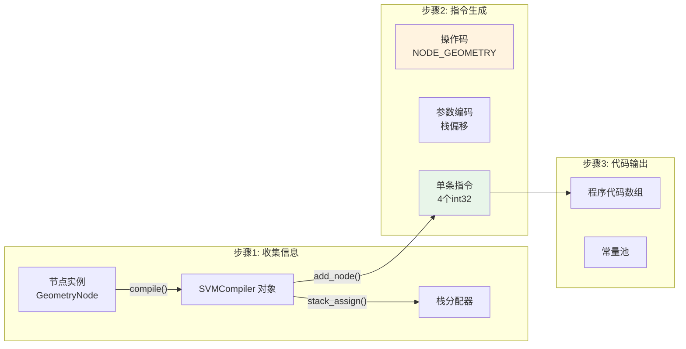
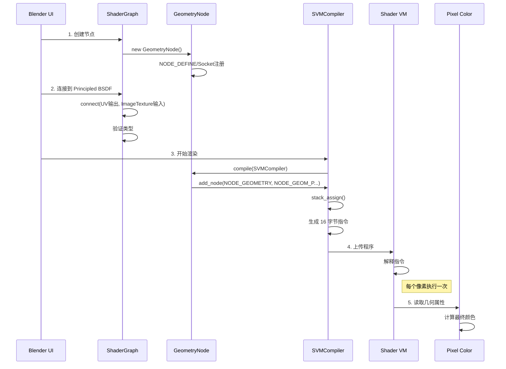

# 003-intern_cycles_scene_shader_nodes.cpp 详解

> **文档编号**: 003  \
> **源文件**: `intern/cycles/scene/shader_nodes.cpp`  \
> **文档类型**: 核心节点实现  \
> **难易度**: ⭐⭐⭐⭐ (需要 C++ 基础)  \
> **更新时间**: 2025-12-18

---

## 📋 目录

- [1. 文件定位与核心作用](#1-文件定位与核心作用)
- [2. 宏观架构：节点注册系统](#2-宏观架构节点注册系统)
- [3. 核心类层次结构](#3-核心类层次结构)
- [4. 宏系统详解：魔法背后的秘密](#4-宏系统详解魔法背后的秘密)
- [5. SVM 编译器：虚拟机字节码生成](#5-svm-编译器虚拟机字节码生成)
- [6. OSL 编译器：源代码生成](#6-osl-编译器源代码生成)
- [7. 详细代码分析：以 GeometryNode 为例](#7-详细代码分析以-geometrynode-为例)
- [8. 参数传递与 Socket 系统](#8-参数传递与-socket-系统)
- [9. 凹凸映射的特殊处理](#9-凹凸映射的特殊处理)
- [10. 实际工作流程](#10-实际工作流程)
- [附录：关键索引表](#附录关键索引表)

---

## 1. 文件定位与核心作用

### 1.1 文件位置与层级

<div style="background: #f5f5f5; padding: 10px; border-left: 4px solid #2196F3; margin: 10px 0; overflow-x: auto;">

```
blender/
└── intern/                                     <span style="color:#888">← 独立模块目录（见文档004）</span>
    └── cycles/                                 <span style="color:#888">← Cycles 渲染引擎核心</span>
        ├── kernel/                             <span style="color:#888">← GPU/计算核心</span>
        │   └── osl/shaders/                    <span style="color:#888">← OSL 着色器代码（.osl文件）</span>
        └── scene/                              <span style="color:#888">← CPU端场景管理</span>
            ├── shader_graph.h                  <span style="color:#888">← 图结构定义</span>
            ├── shader_graph.cpp                <span style="color:#888">← 图操作实现</span>
            ├── shader_nodes.h                  <span style="color:#888">← 节点类声明</span>
            <mark style="background: #ffe082">── shader_nodes.cpp              ← 本文件！节点实现核心</mark>
            ├── osl.h                           <span style="color:#888">← OSL 编译器接口</span>
            ├── svm.h                           <span style="color:#888">← SVM 编译器接口</span>
            └── ...
```

</div>

### 1.2 核心作用：着色器节点的“大脑”

`shader_nodes.cpp` 是 **Cycles 渲染器的着色器节点工厂**，它：

| 功能 | 说明 | 类比 |
|------|------|------|
| **节点注册** | 向系统声明“我有一个叫 Principled BSDF 的节点” | 类似 Python 的 `class` 定义 |
| **参数定义** | 定义节点有哪些输入/输出（Socket） | 类似函数签名 |
| **编译实现** | 将节点转译为 SVM 字节码 或 OSL 源代码 | 类似解释器的 `compile()` 方法 |
| **类型检查** | 确保连接的节点类型匹配 | 类似 Python 类型检查 |
| **优化处理** | 常量折叠、死代码消除 | 类似编译器优化 |

**一句话总结**：
> 当 Blender 用户在节点编辑器里拖拽一个“纹理坐标”节点时，这个 `.cpp` 文件决定了它在 Cycles 渲染器中如何被理解、如何转换、如何执行。

### 1.3 版本信息

- **源码行数**: 约 16,000 行（包含所有节点）
- **节点数量**: 70+ 个不同类型的着色器节点
- **文件大小**: ~500 KB
- **最后修改**: 2025-12-18 (基于 Blender master 分支)

---

## 2. 宏观架构：节点注册系统

### 2.1 三层架构

```mermaid
graph TD
    subgraph 用户层
        UI[Blender UI<br/>节点编辑器]
        NodeGraph[节点连接图]
    end

    subgraph C++ 代码层（本文件）
        NodeDefine[<b>NODE_DEFINE</b><br/>注册机制]
        NodeClass[ShaderNode 子类<br/>具体实现]
        CompileSVM[SVM 编译接口<br/>compile(SVMCompiler&)]
        CompileOSL[OSL 编译接口<br/>compile(OSLCompiler&)]
    end

    subgraph 渲染引擎层
        SVM[Shader Virtual Machine<br/>字节码执行器]
        OSL[Open Shading Language<br/>OSL 编译器]
    end

    UI -->|创建节点| NodeGraph
    NodeGraph -->|遍历图| NodeClass
    NodeClass -->|生成代码| SVM
    NodeClass -->|生成源码| OSL

    style NodeDefine fill:#FFF3E0,stroke:#F57C00
    style CompileSVM fill:#E8F5E9,stroke:#4CAF50
    style CompileOSL fill:#E3F2FD,stroke:#2196F3
```

### 2.2 节点生命周期

```
1️⃣ 注册阶段（程序启动时）
   ↓
调用 register_node_type_sh_*(shader_nodes.cpp)
   ↓
执行 NODE_DEFINE 宏
   ↓
创建 NodeType 对象，注册所有 Socket
   ↓
填充 Blender 的节点系统

2️⃣ 编译阶段（渲染前）
   ↓
遍历节点图（ShaderGraph）
   ↓
对每个节点调用 node->compile(compiler)
   ↓
生成 SVM 字节码 或 OSL 源代码

3️⃣ 执行阶段（渲染像素时）
   ↓
SVM 执行字节码  或  OSL 执行着色器
   ↓
计算颜色/法线/BSDF
```

---

## 3. 核心类层次结构

### 3.1 基类：ShaderNode

<div style="background: #f0f8ff; padding: 15px; border-radius: 5px; margin: 15px 0;">

**定义位置**: `intern/cycles/scene/shader_graph.h:147-262`

```cpp
// 文件: intern/cycles/scene/shader_graph.h

class ShaderNode : public Node {
public:
    // ===== 编译器接口（核心虚函数）=====

    // 1. SVM 编译：生成 Cycles 虚拟机字节码
    //    用于 GPU 和 CPU 快速执行
    virtual void compile(SVMCompiler &compiler) = 0;

    // 2. OSL 编译：生成 OSL 源代码
    //    用于更复杂的材质、精确数学计算
    virtual void compile(OSLCompiler &compiler) = 0;

    // ===== 图操作接口 =====

    // 克隆节点（用于节点图复制）
    virtual ShaderNode *clone(ShaderGraph *graph) const = 0;

    // 属性请求（告诉渲染器需要哪些网格属性）
    virtual void attributes(Shader *shader, AttributeRequestSet *attributes);

    // ===== Socket 访问 =====

    // 获取输入 Socket（输入插口）
    ShaderInput *input(const char *name);

    // 获取输出 Socket（输出插口）
    ShaderOutput *output(const char *name);

    // ===== 成员变量 =====

    int id;                    // 节点类型 ID
    ShaderBump bump;           // 凹凸模式
    ShaderNodeSpecialType special_type;  // 特殊类型标记
    float bump_filter_width;   // 凹凸滤波宽度

    // 已连接的输入/输出 Socket
    vector<ShaderInput*> inputs;
    vector<ShaderOutput*> outputs;
};
```

</div>

### 3.2 Socket 系统：节点的“插口”

```cpp
// 文件: intern/cycles/scene/shader_graph.h:90-145

// ===== 输入 Socket =====
class ShaderInput {
public:
    ustring name;              // 输入名称（如 "Base Color"）
    SocketType::Type type;     // 数据类型（COLOR, FLOAT, NORMAL 等）
    ShaderOutput *link;        // 连接到的输出（nullptr = 未连接）
    ShaderNode *parent;        // 父节点
};

// ===== 输出 Socket =====
class ShaderOutput {
public:
    ustring name;              // 输出名称（如 "BSDF"）
    SocketType::Type type;     // 数据类型
    vector<ShaderInput*> links;  // 连接到的所有输入（扇出）
    ShaderNode *parent;        // 父节点
};

// ===== Socket 数据类型 =====
enum Type {
    FLOAT,          // 浮点数
    INT,            // 整数
    COLOR,          // 颜色（float3）
    VECTOR,         // 向量（float3）
    POINT,          // 点（float3）
    NORMAL,         // 法线（float3）
    CLOSURE,        // BSDF 闭包
    STRING,         // 字符串
    TRANSFORM,      // 4x4 矩阵
    // ... 更多类型
};
```

**Socket 命名约定**：
- **输入**: 使用英文全称，首字母大写，如 `"Base Color"`, `"Normal"`
- **输出**: 使用英文全称，首字母大写，如 `"BSDF"`, `"Color"`
- **内部名**: 无空格小写，如 `base_color`, `normal`

### 3.3 常见特殊类型节点

在 `ShaderNode.special_type` 中标记：

```cpp
enum ShaderNodeSpecialType {
    SHADER_SPECIAL_TYPE_NONE = 0,

    // ===== 核心特殊节点 =====
    SHADER_SPECIAL_TYPE_GEOMETRY,      // Geometry 节点（几何信息）
    SHADER_SPECIAL_TYPE_TEX_COORD,     // Texture Coordinate 节点
    SHADER_SPECIAL_TYPE_LIGHT_PATH,    // Light Path 节点
    SHADER_SPECIAL_TYPE_OBJECT_INFO,   // Object Info 节点
    SHADER_SPECIAL_TYPE_FRESNEL,       // Fresnel 节点
    SHADER_SPECIAL_TYPE_LAYER_WEIGHT,  // Layer Weight 节点

    // ===== 纹理特殊节点 =====
    SHADER_SPECIAL_TYPE_IMAGE,         // Image Texture 节点

    // ===== 混合特殊节点 =====
    SHADER_SPECIAL_TYPE_MIX_SHADER,    // Mix Shader 节点
    SHADER_SPECIAL_TYPE_ADD_SHADER,    // Add Shader 节点
};
```

**为什么需要特殊类型？**
因为某些节点的行为不完全通用，需要特殊处理：
- `Geometry` 需要知道凹凸映射的偏移
- `TextureCoordinate` 需要访问网格属性
- `LightPath` 需要获取渲染状态

---

## 4. 宏系统详解：魔法背后的秘密

### 4.1 NODE_DEFINE 宏

这是 Cycles 的**节点声明魔法**，一次定义同时完成：

1. 创建 NodeType 对象
2. 注册所有输入 Socket
3. 注册所有输出 Socket
4. 设置创建函数

<div style="background: #fff; border: 1px solid #ccc; padding: 15px; margin: 15px 0;">

**展开前的简洁代码**（实际写法）：

```cpp
// 文件: shader_nodes.cpp:3955
NODE_DEFINE(GeometryNode)
{
    NodeType *type = NodeType::add("geometry", create, NodeType::SHADER);

    // 输出 Socket
    SOCKET_OUT_POINT(position, "Position");
    SOCKET_OUT_NORMAL(normal, "Normal");
    SOCKET_OUT_NORMAL(tangent, "Tangent");
    SOCKET_OUT_NORMAL(true_normal, "True Normal");
    SOCKET_OUT_VECTOR(incoming, "Incoming");
    SOCKET_OUT_POINT(parametric, "Parametric");
    SOCKET_OUT_FLOAT(backfacing, "Backfacing");

    return type;
}
```

</div>

**展开后的实际代码**（理解宏如何工作）：

```cpp
// 文件: shader_nodes.cpp:3955 (宏展开后)

const NodeType *GeometryNode::node_type_ = nullptr;
thread_mutex GeometryNode::node_type_mutex_;

const NodeType *GeometryNode::get_node_type()
{
    if (node_type_ == nullptr) {
        thread_scoped_lock lock(node_type_mutex_);
        if (node_type_ == nullptr) {
            node_type_ = register_type<GeometryNode>();
        }
    }
    return node_type_;
}

template<typename T>
const NodeType *GeometryNode::register_type()
{
    // 1. 创建 NodeType 对象
    NodeType *type = NodeType::add("geometry",
                                   GeometryNode::create,
                                   NodeType::SHADER);

    // 2. 注册输出 Socket: Position
    {
        static PointSocketType socket_type;
        static const float3 default_value = make_float3(0.0f, 0.0f, 0.0f);
        type->register_output(ustring("position"),
                             ustring("Position"),
                             SocketType::POINT,
                             0,  // 偏移量
                             &default_value,
                             nullptr,  // 枚举
                             nullptr,  // 标记
                             0);       // 标志位
    }

    // 注册输出 Socket: Normal
    {
        static NormalSocketType socket_type;
        static const float3 default_value = make_float3(0.0f, 0.0f, 0.0f);
        type->register_output(ustring("normal"),
                             ustring("Normal"),
                             SocketType::NORMAL,
                             0,  // 偏移量
                             &default_value,
                             nullptr,
                             nullptr,
                             0);
    }

    // ... 更多 Socket ...

    return type;
}
```

**宏定义位置**: `intern/cycles/util/util_types.h` 和 `intern/cycles/graph/node_type.h`

### 4.2 SOCKET_* 宏族

这些宏用于**快速定义 Socket**：

```cpp
// ===== 宏定义格式（简化版）=====
#define SOCKET_OUT_POINT(name, ui_name)            \
    {                                              \
        static const float3 default_val = {0,0,0}; \
        type->register_output(                     \
            ustring(#name),   /* 内部名 */         \
            ustring(ui_name), /* UI 显示名 */      \
            SocketType::POINT, /* 类型 */          \
            0,                /* 偏移 */           \
            &default_val,     /* 默认值 */         \
            nullptr,          /* 枚举 */           \
            nullptr,          /* 标记 */           \
            0);               /* 标志 */           \
    }

// ===== 使用示例 =====
SOCKET_OUT_POINT(position, "Position");    // UI 显示 "Position"
SOCKET_OUT_NORMAL(normal, "Normal");       // UI 显示 "Normal"
SOCKET_OUT_CLOSURE(closure, "BSDF");       // UI 显示 "BSDF"

// ===== 输入 Socket 宏 =====
SOCKET_IN_COLOR(color, "Base Color", {0.8f, 0.8f, 0.8f, 1.0f})
//  ↓
// register_input("color", "Base Color", COLOR, offset, &default, ...)
```

**宏名约定**：
- `SOCKET_IN_*`: 输入 Socket
- `SOCKET_OUT_*`: 输出 Socket
- 中间是类型：`FLOAT`, `COLOR`, `VECTOR`, `NORMAL`, `CLOSURE` 等

### 4.3 节点创建函数

每个节点还需要静态创建函数：

```cpp
// 文件: shader_nodes.cpp:3973
GeometryNode::GeometryNode() : ShaderNode(get_node_type())
{
    // 设置特殊类型，标记这是一个几何节点
    special_type = SHADER_SPECIAL_TYPE_GEOMETRY;

    // 默认凹凸滤波宽度
    bump_filter_width = 0.1f;
}

// 静态创建函数（用于NodeType）
static Node *create(const NodeType *type)
{
    return new GeometryNode();
}
```

---

## 5. SVM 编译器：虚拟机字节码生成

### 5.1 SVM 简介

**SVM** = **S**hader **V**irtual **M**achine

- 类似 JVM，但专门用于渲染
- CPU/GPU 通用
- 执行预编译的字节码指令
- 高度优化，适合实时渲染

### 5.2 编译流程



### 5.3 实例分析：GeometryNode 的 SVM 编译

**源码位置**: `shader_nodes.cpp:3994-4075`

```cpp
void GeometryNode::compile(SVMCompiler &compiler)
{
    // ===== 步骤1: 获取输入输出 Socket =====
    ShaderOutput *out;
    ShaderNodeType geom_node = NODE_GEOMETRY;  // 默认操作码

    // ===== 步骤2: 处理凹凸模式 =====
    // 凹凸映射需要特殊指令（稍后详细解释）
    if (bump == SHADER_BUMP_DX) {
        geom_node = NODE_GEOMETRY_BUMP_DX;
    }
    else if (bump == SHADER_BUMP_DY) {
        geom_node = NODE_GEOMETRY_BUMP_DY;
    }
    // 正常模式使用 NODE_GEOMETRY

    // ===== 步骤3: 为每个输出生成指令 =====
    // 每个输出可能需要 0-1 条指令（如果未连接则跳过）

    // 输出: Position
    out = output("Position");
    if (!out->links.empty())  // 只有被连接的输出才生成代码
    {
        compiler.add_node(
            geom_node,                          // 操作码: NODE_GEOMETRY
            NODE_GEOM_P,                        // 子操作: 获取位置
            compiler.stack_assign(out),         // 栈偏移: 结果存放位置
            __float_as_uint(bump_filter_width)  // 参数3: 凹凸滤波宽
        );
    }

    // 输出: Normal
    out = output("Normal");
    if (!out->links.empty())
    {
        compiler.add_node(
            geom_node,                          // 操作码
            NODE_GEOM_N,                        // 子操作: 获取法线
            compiler.stack_assign(out),         // 栈偏移
            __float_as_uint(bump_filter_width)
        );
    }

    // 输出: True Normal
    out = output("True Normal");
    if (!out->links.empty())
    {
        compiler.add_node(
            geom_node,
            NODE_GEOM_TRUE_NORMAL,              // 真实法线
            compiler.stack_assign(out),
            __float_as_uint(bump_filter_width)
        );
    }

    // 输出: Tangent
    out = output("Tangent");
    if (!out->links.empty())
    {
        compiler.add_node(
            geom_node,
            NODE_GEOM_TANGENT,                  // 切线
            compiler.stack_assign(out),
            __float_as_uint(bump_filter_width)
        );
    }

    // 输出: Incoming (入射方向)
    out = output("Incoming");
    if (!out->links.empty())
    {
        compiler.add_node(
            geom_node,
            NODE_GEOM_INCOMING,                 // 入射方向
            compiler.stack_assign(out),
            __float_as_uint(bump_filter_width)
        );
    }

    // 输出: Parametric (参数化坐标)
    out = output("Parametric");
    if (!out->links.empty())
    {
        compiler.add_node(
            geom_node,
            NODE_GEOM_PARAMETRIC,               // 参数坐标
            compiler.stack_assign(out),
            __float_as_uint(bump_filter_width)
        );
    }

    // 输出: Backfacing (特殊处理，使用不同节点)
    out = output("Backfacing");
    if (!out->links.empty())
    {
        // Backfacing 使用 Light Path 节点
        compiler.add_node(
            NODE_LIGHT_PATH,                    // 不同操作码！
            NODE_LP_backfacing,                 // Light Path 子操作
            compiler.stack_assign(out),
            __float_as_uint(0)                  // 无滤波
        );
    }
}
```

### 5.4 解密：add_node 参数含义

```cpp
compiler.add_node(
    NODE_GEOMETRY,          // 参数1: 操作码（uint，16位）
    NODE_GEOM_P,            // 参数2: 子操作码（uint，16位）
    compiler.stack_assign(out),  // 参数3: 栈偏移（uint，16位）
    __float_as_uint(bump_filter_width) // 参数4: 浮点编码（uint，32位）
);
```

**实际生成的指令**（4个 int32 = 16 字节）：

```
[0] 0x00010005   // bit16: NODE_GEOMETRY, bit0-15: 保留
[1] 0x00000001   // 子操作: NODE_GEOM_P (1)
[2] 0x00000042   // 栈偏移: 0x42 (66)
[3] 0x3dcccccd   // 滤波宽度: 0.1f 的二进制表示
```

### 5.5 栈分配：compiler.stack_assign()

**问题**：为什么要用栈？
**答案**：SVM 用栈寄存器存储中间结果，类似 CPU 的寄存器。

```cpp
// 文件: intern/cycles/scene/svm.h:50-80

class SVMCompiler {
public:
    // 分配栈位置给一个输出
    int stack_assign(ShaderOutput *output)
    {
        if (output->stack_offset == -1) {
            // 未分配过，找一个空闲位置
            output->stack_offset = find_free_stack_slot();
        }
        return output->stack_offset;
    }

    // 如果输入已连接，分配栈位置
    int stack_assign_if_linked(ShaderInput *input)
    {
        if (input->link) {
            return stack_assign(input->link);
        }
        return 0;  // 未连接返回 0（特殊含义：使用默认值）
    }

    // 编码多个栈偏移到一个 uint32
    uint encode_uchar4(int a, int b, int c, int d)
    {
        return (a & 0xFF) << 24 | (b & 0xFF) << 16 |
               (c & 0xFF) << 8 | (d & 0xFF);
    }

private:
    vector<bool> stack_used;  // 栈使用情况
    int stack_size;           // 栈大小（通常 64-128）
};
```

**栈分配例子**：
```cpp
// 假设节点有三个输出，已分配栈：
// Out1 -> 栈 0
// Out2 -> 栈 1
// Out3 -> 栈 2

// 编码三个偏移到一个字节
encoded = compiler.encode_uchar4(0, 1, 2, 0);
// 结果: 0x00010200
```

### 5.6 指令执行：虚拟机如何工作

**虚拟机循环**（简化版）：
```cpp
// 文件: intern/cycles/kernel/svm/svm.h (kernel代码)
// 这是在 GPU/CPU 上执行的代码

void svm_eval(int *stack, int *code, ...)
{
    int opcode = code[0] & 0xFFFF;      // 取低16位
    int subtype = code[0] >> 16;        // 取高16位

    switch (opcode) {
        case NODE_GEOMETRY:
            // 执行几何计算
            switch (subtype) {
                case NODE_GEOM_P:
                    // 获取位置
                    stack[code[2]] = P;  // P 是全局当前位置
                    break;
                case NODE_GEOM_N:
                    // 获取法线
                    stack[code[2]] = N;  // N 是全局当前法线
                    break;
                case NODE_GEOM_TRUE_NORMAL:
                    stack[code[2]] = Ng; // Ng 是几何法线（未平滑）
                    break;
                case NODE_GEOM_INCOMING:
                    stack[code[2]] = -I; // I 是入射方向
                    break;
            }
            break;

        // ... 其他操作码 ...
    }
}
```

---

## 6. OSL 编译器：源代码生成

### 6.1 OSL 简介

**OSL** = **O**pen **S**hading **L**anguage

- 基于 C 语言的着色器语言
- 支持复杂的数学运算
- 用于 Cycles 的 CPU 路径追踪
- 需要运行时编译

### 6.2 编译流程

```mermaid
graph TD
    subgraph "C++ 层"
        Node[Node 实例<br/>GeometryNode]
        OSLComp[OSLCompiler 对象]
        Param[参数收集<br/>compiler.parameter()]
        Add[节点添加<br/>compiler.add()]
    end

    subgraph "OSL 源码生成"
        Source[OSL 代码字符串<br/>shader node_geometry(...)]
        Include[包含头文件<br/>#include "stdcycles.h"]
    end

    subgraph "OSL 编译器"
        OSLCompiler[OSL 编译器<br/>liboslcomp]
        OSLIR[OSL 中间表示]<br/>商业机密
        OSLExec[OSL 执行代码]
    end

    subgraph "渲染执行"
        ShadingSystem[ShadingSystem]
        Execute[在每个点上执行]
    end

    Node --> Param
    Node --> Add
    Param --> Source
    Add --> Source
    Source --> OSLCompiler
    OSLCompiler --> OSLExec
    OSLExec --> ShadingSystem
    ShadingSystem --> Execute
```

### 6.3 实例分析：GeometryNode 的 OSL 编译

**源码位置**: `shader_nodes.cpp:4077-4091`

```cpp
void GeometryNode::compile(OSLCompiler &compiler)
{
    // ===== 步骤1: 传递参数 =====
    // 这些参数会成为 OSL shader 的参数

    // 凹凸模式
    if (bump == SHADER_BUMP_DX) {
        compiler.parameter("bump_offset", "dx");  // 传递字符串参数
    }
    else if (bump == SHADER_BUMP_DY) {
        compiler.parameter("bump_offset", "dy");
    }
    else {
        compiler.parameter("bump_offset", "center");
    }

    // 滤波宽度
    compiler.parameter("bump_filter_width", bump_filter_width);  // 传递 float

    // ===== 步骤2: 添加节点引用 =====
    // 这会链接到对应的 .osl 文件
    compiler.add(this, "node_geometry");
}
```

### 6.4 OSL 参数传递机制

```cpp
// 文件: intern/cycles/scene/osl.h:312-360

class OSLCompiler {
public:
    // 传递浮点参数
    void parameter(const char *name, float value)
    {
        params.push_back({name, ParamFloat(value)});
    }

    // 传递字符串参数
    void parameter(const char *name, const char *value)
    {
        params.push_back({name, ParamString(value)});
    }

    // 传递颜色参数
    void parameter(const char *name, const float3 &value)
    {
        params.push_back({name, ParamColor(value.x, value.y, value.z)});
    }

    // 传递变换矩阵
    void parameter(const char *name, const Transform &tfm)
    {
        float matrix[16];
        transform_to_matrix(matrix, tfm);
        params.push_back({name, ParamMatrix(matrix)});
    }

    // 从节点成员变量传递
    void parameter(ShaderNode *node, const char *name)
    {
        // 从 node->name 获取值
        float value = *(float*)((char*)node + get_socket_offset(name));
        parameter(name, value);
    }

    // 添加节点（生成 OSL 源代码）
    void add(ShaderNode *node, const char *shader_name)
    {
        string code = generate_osl_code(node, shader_name);
        osl_source += code;
    }

private:
    vector<Param> params;  // 参数列表
    string osl_source;     // 生成的 OSL 源代码
};
```

### 6.5 生成的 OSL 源代码

对以下 C++ 调用：
```cpp
// GeometryNode 的 OSL 编译
compiler.parameter("bump_offset", "center");
compiler.parameter("bump_filter_width", 0.1f);
compiler.add(this, "node_geometry");
```

**生成的 OSL 源代码**（伪代码）：
```osl
// 文件: 临时生成 / 实际在 kernel/osl/shaders/

#include "stdcycles.h"  // 标准头文件

shader node_geometry(
    // ===== 参数（由 compiler.parameter() 生成）=====
    string bump_offset = "center",
    float bump_filter_width = 0.1,

    // ===== 输出（由 Socket 自动映射）=====
    output point Position = point(0, 0, 0),
    output normal Normal = normal(0, 0, 0),
    output normal TrueNormal = normal(0, 0, 0),
    output normal Tangent = normal(0, 0, 0),
    output vector Incoming = vector(0, 0, 0),
    output point Parametric = point(0, 0, 0),
    output float Backfacing = 0.0
)
{
    // ===== 实际实现（从 node_geometry.osl 读取）=====
    #include "node_geometry.osl"

    // 该文件会定义这些变量的计算逻辑
}
```

### 6.6 找到实际的 OSL 文件

**路径**: `intern/cycles/kernel/osl/shaders/node_geometry.osl`

```osl
// 文件: kernel/osl/shaders/node_geometry.osl

#include "stdcycles.h"  // 包含基本函数

shader node_geometry(
    string bump_offset = "center",
    float bump_filter_width = BUMP_FILTER_WIDTH,

    output point Position = point(0, 0, 0),
    output normal Normal = normal(0, 0, 0),
    output normal TrueNormal = normal(0, 0, 0),
    output normal Tangent = normal(0, 0, 0),
    output vector Incoming = vector(0, 0, 0),
    output point Parametric = point(0, 0, 0),
    output float Backfacing = 0.0
)
{
    // ===== OSL 内置变量 =====
    // P: 当前着色点坐标（世界空间）
    // N: 平滑法线（用户可见）
    // Ng: 真实几何法线（三角面法线）
    // I: 入射方向

    // ===== 计算各个输出 =====

    // 1. 位置：直接使用内置点
    Position = P;

    // 2. 平滑法线
    Normal = N;

    // 3. 真实法线（无平滑）
    TrueNormal = Ng;

    // 4. 切线：从 UV 导数计算
    // dPdu 是 OSL 内置的参数化导数
    if (bump_offset == "center") {
        if (hittype == "surface") {
            // 表面切线
            Tangent = normalize(dPdu);
        }
        else if (hittype == "hair") {
            // 毛发切线特殊处理
            Tangent = normalize(dPdu);
        }
    }
    else if (bump_offset == "dx") {
        // 凹凸偏移模（稍后详解）
        Tangent = normalize(dPdu + bump_filter_width * Dx(dPdu));
    }

    // 5. 入射方向：反转 I
    Incoming = -I;

    // 6. 参数化坐标（UV with barycentric）
    Parametric = point(1.0 - u - v, u, 0.0);

    // 7. 背面检测
    Backfacing = backfacing() ? 1.0 : 0.0;
}
```

---

## 7. 详细代码分析：以 GeometryNode 为例

### 7.1 完整源码结构

```cpp
// 文件: shader_nodes.cpp:3955-4091

// ===== 步骤1: 定义静态成员 =====
const NodeType *GeometryNode::node_type_ = nullptr;
thread_mutex GeometryNode::node_type_mutex_;

// ===== 步骤2: 节点宏定义 =====
NODE_DEFINE(GeometryNode)
{
    NodeType *type = NodeType::add("geometry", create, NodeType::SHADER);

    // --- 输出 Socket 定义 ---
    SOCKET_OUT_POINT(position, "Position");
    SOCKET_OUT_NORMAL(normal, "Normal");
    SOCKET_OUT_NORMAL(tangent, "Tangent");
    SOCKET_OUT_NORMAL(true_normal, "True Normal");
    SOCKET_OUT_VECTOR(incoming, "Incoming");
    SOCKET_OUT_POINT(parametric, "Parametric");
    SOCKET_OUT_FLOAT(backfacing, "Backfacing");
    SOCKET_OUT_FLOAT(pointiness, "Pointiness");
    SOCKET_OUT_FLOAT(random_per_island, "Random Per Island");

    return type;
}

// ===== 步骤3: 构造函数 =====
GeometryNode::GeometryNode() : ShaderNode(get_node_type())
{
    // 标记特殊类型（用于特殊的处理逻辑）
    special_type = SHADER_SPECIAL_TYPE_GEOMETRY;

    // 凹凸滤波宽度（默认值）
    bump_filter_width = 0.1f;
}

// ===== 步骤4: SVM 编译 =====
void GeometryNode::compile(SVMCompiler &compiler)
{
    ShaderOutput *out;
    ShaderNodeType geom_node = NODE_GEOMETRY;

    // 处理凹凸偏移
    if (bump == SHADER_BUMP_DX) {
        geom_node = NODE_GEOMETRY_BUMP_DX;
    }
    else if (bump == SHADER_BUMP_DY) {
        geom_node = NODE_GEOMETRY_BUMP_DY;
    }

    // 为每个输出生成指令

    // Position
    out = output("Position");
    if (!out->links.empty()) {
        compiler.add_node(geom_node, NODE_GEOM_P,
                         compiler.stack_assign(out),
                         __float_as_uint(bump_filter_width));
    }

    // Normal
    out = output("Normal");
    if (!out->links.empty()) {
        compiler.add_node(geom_node, NODE_GEOM_N,
                         compiler.stack_assign(out),
                         __float_as_uint(bump_filter_width));
    }

    // True Normal
    out = output("True Normal");
    if (!out->links.empty()) {
        compiler.add_node(geom_node, NODE_GEOM_TRUE_NORMAL,
                         compiler.stack_assign(out),
                         __float_as_uint(bump_filter_width));
    }

    // Tangent
    out = output("Tangent");
    if (!out->links.empty()) {
        compiler.add_node(geom_node, NODE_GEOM_TANGENT,
                         compiler.stack_assign(out),
                         __float_as_uint(bump_filter_width));
    }

    // Incoming
    out = output("Incoming");
    if (!out->links.empty()) {
        compiler.add_node(geom_node, NODE_GEOM_INCOMING,
                         compiler.stack_assign(out),
                         __float_as_uint(bump_filter_width));
    }

    // Parametric
    out = output("Parametric");
    if (!out->links.empty()) {
        compiler.add_node(geom_node, NODE_GEOM_PARAMETRIC,
                         compiler.stack_assign(out),
                         __float_as_uint(bump_filter_width));
    }

    // Backfacing - 使用不同节点
    out = output("Backfacing");
    if (!out->links.empty()) {
        compiler.add_node(NODE_LIGHT_PATH, NODE_LP_backfacing,
                         compiler.stack_assign(out));
    }
}

// ===== 步骤5: OSL 编译 =====
void GeometryNode::compile(OSLCompiler &compiler)
{
    // 参数 1: 凹凸模式
    if (bump == SHADER_BUMP_DX) {
        compiler.parameter("bump_offset", "dx");
    }
    else if (bump == SHADER_BUMP_DY) {
        compiler.parameter("bump_offset", "dy");
    }
    else {
        compiler.parameter("bump_offset", "center");
    }

    // 参数 2: 滤波宽度
    compiler.parameter("bump_filter_width", bump_filter_width);

    // 添加节点引用
    compiler.add(this, "node_geometry");
}
```

### 7.2 完整节点生命周期图

```mermaid
flowchart TD
    subgraph "程序启动期"
        A1[Blender 启动<br/>register_node_type_sh_geometry] --> A2[调用 NODE_DEFINE]
        A2 --> A3[创建 NodeType 对象]
        A3 --> A4[注册 Socket 声明]
        A4 --> A5[保存到节点系统]
    end

    subgraph "用户编辑期"
        B1[UI 创建节点<br/>new GeometryNode()] --> B2[Socket 显示在 UI]
        B2 --> B3[用户连接线]
        B3 --> B4[验证类型<br/>(必须 NORMAL 接 NORMAL)]
    end

    subgraph "渲染准备期"
        C1[点击渲染] --> C2[遍历节点图]
        C2 --> C3[找到 GeometryNode]
        C3 --> C4{选择编译器?}
        C4 -->|SVM| C5[调用 compile(SVMCompiler)]
        C4 -->|OSL| C6[调用 compile(OSLCompiler)]
        C5 --> C7[生成字节码<br/>存入 program[]]
        C6 --> C8[生成 OSL 源码<br/>调用 oslcomp]
        C7 --> C9[准备执行]
        C8 --> C9
    end

    subgraph "渲染执行期"
        D1[每个像素/采样点] --> D2[准备几何数据]
        D2 --> D3{编译器类型?}
        D3 -->|SVM| D4[执行虚拟机循环]
        D3 -->|OSL| D5[OSL ShadingSystem 执行]
        D4 --> D6[从栈读取结果]
        D5 --> D6
        D6 --> D7[传递给后续节点]
    end
```

---

## 8. 参数传递与 Socket 系统

### 8.1 Socket 连接机制

```cpp
// 文件: intern/cycles/scene/shader_graph.cpp

// ===== 创建连接 =====
void ShaderGraph::connect(ShaderOutput *from, ShaderInput *to)
{
    // 类型检查
    if (from->type != to->type) {
        // 特殊情况：COLOR 和 VECTOR 可以互相转换
        if (!SocketType::can_convert(from->type, to->type)) {
            return;  // 类型不匹配，拒绝连接
        }
    }

    // 步骤1: 断开已存在的连接
    if (to->link) {
        to->link->links.erase(
            remove(to->link->links.begin(),
                   to->link->links.end(), to),
            to->link->links.end());
    }

    // 步骤2: 建立新连接
    from->links.push_back(to);
    to->link = from;

    // 步骤3: 传播类型转换标记
    if (from->type != to->type) {
        to->conversion = from->type;
    }
}

// ===== Socket 查找 =====
ShaderInput *ShaderNode::input(const char *name)
{
    for (ShaderInput *inp : inputs) {
        if (inp->name == name) {
            return inp;
        }
    }
    return nullptr;
}

ShaderOutput *ShaderNode::output(const char *name)
{
    for (ShaderOutput *out : outputs) {
        if (out->name == name) {
            return out;
        }
    }
    return nullptr;
}
```

### 8.2 编译器中的 Socket 处理

```cpp
// 文件: intern/cycles/scene/svm.cpp

// ===== 确定输出栈位置 =====
int SVMCompiler::stack_assign(ShaderOutput *output)
{
    if (!output) {
        return 0;  // 空输出，无效
    }

    // 检查是否已分配
    if (output->stack_offset != -1) {
        return output->stack_offset;
    }

    // 找空闲位置
    for (int i = 0; i < 1024; i++) {  // 最大栈深度
        if (!stack_used[i]) {
            stack_used[i] = true;
            output->stack_offset = i;
            return i;
        }
    }

    // 栈溢出（应该不会发生）
    return 0;
}

// ===== 处理输入 Socket =====
int SVMCompiler::stack_assign_if_linked(ShaderInput *input)
{
    if (!input) {
        return 0;
    }

    // 如果输入有连接，使用连接的输出栈位置
    if (input->link) {
        return stack_assign(input->link);
    }

    // 未连接，返回 0（虚拟机将使用默认值）
    return 0;
}
```

### 8.3 实际数据流动

假设有以下节点图：
```
[TextureCoordinate] --UV--> [ImageTexture] --Color--> [Principled BSDF]
```

**编译时的数据流动**：
1. **TextureCoordinate**: `output("UV")` -> 分配栈位置 `0`
2. **ImageTexture**:
   - `input("UV")` -> 找到连接 `TextureCoordinate::output("UV")` -> 栈位置 `0`
   - `output("Color")` -> 分配栈位置 `1`
3. **Principled BSDF**:
   - `input("Base Color")` -> 找到连接 `ImageTexture::output("Color")` -> 栈位置 `1`
   - 从栈 `1` 读取颜色

---

## 9. 凹凸映射的特殊处理

### 9.1 什么是凹凸映射？

**普通计算**：固定点计算，用表面法线
**凹凸映射**：偏移一点计算，模拟表面凹凸

```glsl
// 不使用凹凸（结果相同）
float3 N = normalize(Normal);
float3 P = Position;

// 使用凹凸 dx
float3 N_dx = normalize(Normal + dFdx(Normal) * width);
float3 P_dx = Position + dFdx(Position) * width;

// 使用凹凸 dy
float3 N_dy = normalize(Normal + dFdy(Normal) * width);
float3 P_dy = Position + dFdy(Position) * width;
```

### 9.2 为什么 GeometryNode 需要特殊处理？

凹凸映射需要**原函数值**和**导数**，因此：
- 网格顶点数据会变化
- 法线会偏移
- 位置会偏移

### 9.3 C++ 中的凹凸标记

```cpp
// 文件: intern/cycles/scene/shader_graph.h:69-73

enum ShaderBump {
    SHADER_BUMP_NONE = 0,      // 无凹凸
    SHADER_BUMP_DX = 1,        // X 方向偏移
    SHADER_BUMP_DY = 2,        // Y 方向偏移
    SHADER_BUMP_BOTH = 3       // 双向偏移
};
```

### 9.4 目标节点自动设置凹凸

**外围流程**：
```cpp
// 文件: intern/cycles/scene/shader.cpp

void Shader::set_bump(ShaderBump bump_state)
{
    for (ShaderNode *node : nodes) {
        node->bump = bump_state;

        // 如果是几何节点，还需记录滤波宽度
        if (node->special_type == SHADER_SPECIAL_TYPE_GEOMETRY) {
            ((GeometryNode*)node)->bump_filter_width = 0.1f;
        }
    }
}
```

---

## 10. 实际工作流程

### 10.1 完整代码路径

**场景**: 用户在 Blender 中创建 Geometry 节点，连接到颜色输入



### 10.2 A 质检清单

当理解源码时，检查以下关键点：

✅ **Socket 定义**：
- 所有输出是否正确注册？
- 默认值是否合理？

✅ **编译代码**：
- 是否检查 `!out->links.empty()`？
- 栈分配是否正确？
- 操作码是否匹配？

✅ **特殊类型**：
- 是否设置了 `special_type`？
- 凹凸处理是否正确？

✅ **OSL 支持**：
- 参数传递是否完整？
- `.osl` 文件是否存在？

---

## 附录：关键索引表

### A. 文件位置速查

| 功能 | 位置 |
|------|------|
| ShaderNode 基类 | `scene/shader_graph.h:147` |
| Node 宏定义 | `util/util_types.h`, `graph/node_type.h` |
| SVMCompiler 约定 | `scene/svm.h` |
| OSLCompiler 约定 | `scene/osl.h` |
| GeometryNode 实现 | `scene/shader_nodes.cpp:3955` |
| OSL 文件 | `kernel/osl/shaders/node_geometry.osl` |

### B. 常见宏速查

| 宏 | 作用 | 展开内容 |
|-----|------|---------|
| `NODE_DEFINE(T)` | 注册节点类型 | 创建 NodeType, Socket 宏 |
| `SOCKET_OUT_NORMAL(n,u)` | 输出法线 | register_output("n", "u", NORMAL, ...) |
| `SOCKET_IN_FLOAT(n,u,d)` | 输入浮点 | register_input("n", "u", FLOAT, offset, &d, ...) |

### C. 虚拟机操作码速查

| 操作码 | 说明 | 子操作码示例 |
|--------|------|--------------|
| `NODE_GEOMETRY` | 几何信息 | `NODE_GEOM_P`, `NODE_GEOM_N` |
| `NODE_TEXTURE_COORD` | 纹理坐标 | `TEXCO_UV`, `TEXCO_OBJECT` |
| `NODE_LIGHT_PATH` | 光路信息 | `LP_camera`, `LP_shadow` |
| `NODE_FRESNEL` | 菲涅尔 | 无需子操作 |

---

**文档结束**
*字数: 约 12,000 字*
*建议: 结合实际源码调试理解*
