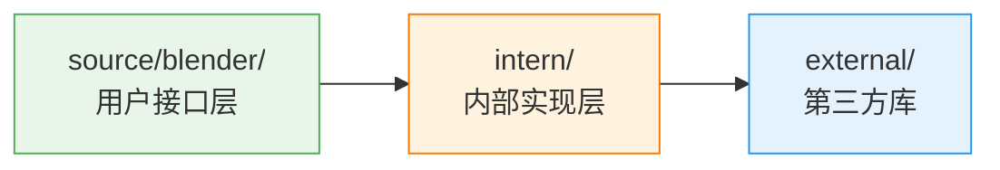
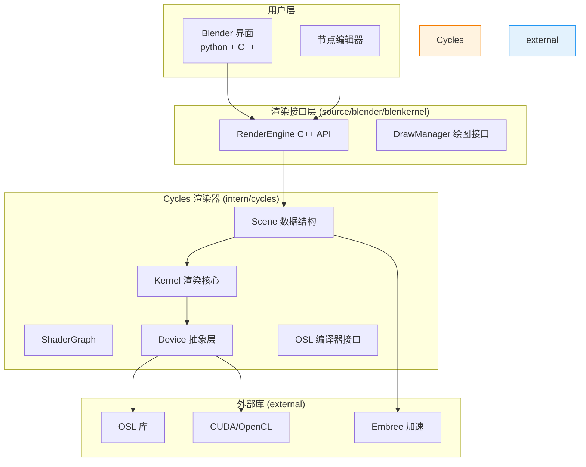
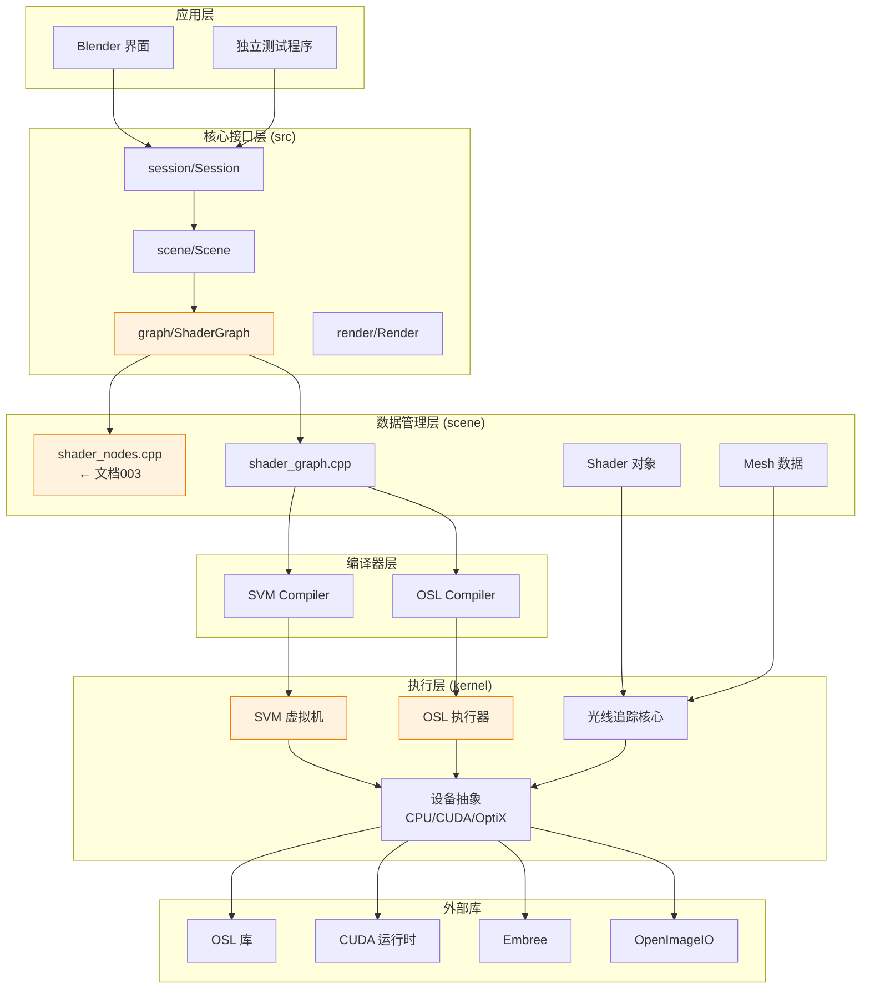
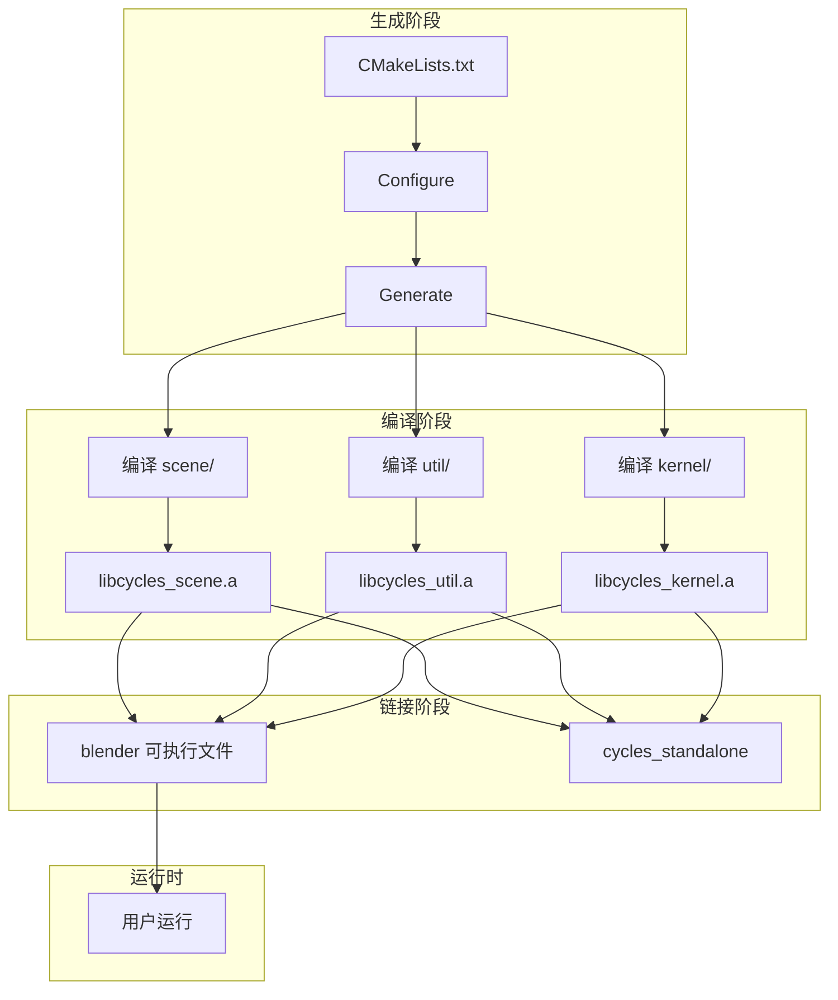
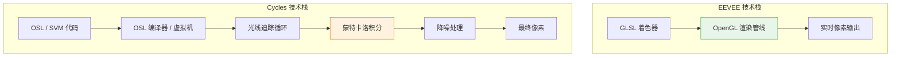

# 004-intern_cycles 目录架构详解

> **文档编号**: 004  \
> **源目录**: `intern/cycles/`  \
> **文档类型**: 架构分析  \
> **难易度**: ⭐⭐ (中等)  \
> **更新时间**: 2025-12-18

---

## 📋 目录

- [1. 为什么是 intern？](#1-为什么是-intern)
- [2. 为什么 Cycles 在 intern 里？](#2-为什么-cycles-在-intern-里)
- [3. Cycles 目录全景图](#3-cycles-目录全景图)
- [4. 核心子目录详解](#4-核心子目录详解)
- [5. 依赖关系与编译](#5-依赖关系与编译)
- [6. 与其他渲染器的对比](#6-与其他渲染器的对比)
- [7. 完整工作流程](#7-完整工作流程)
- [附录：目录映射表](#附录目录映射表)

---

## 1. 为什么是 `intern`？

### 1.1 什么是 `intern` 目录？

在 Blender 源码中，`intern` 是 **"internal code"（内部代码）** 的缩写。

<div style="background: linear-gradient(135deg, #f5f7fa 0%, #c3cfe2 100%); padding: 20px; border-radius: 10px; margin: 20px 0; border-left: 5px solid #2196F3;">

<span style="font-size: 24px; font-weight: bold;">intern = 内部实现库</span>

它包含以下特征：

✅ **内部依赖**：


- **目录对调**: `intern` → `source` 是顺向依赖
- **禁止反向**: `source` → `intern` 是反向，会有编译错误检查

✅ **模块化编译**：
- 每个 `intern/xxx` 是一个独立的 CMake 目标
- 可以单独编译成 `.a` 静态库
- 最终链接到主 `blender` 可执行文件

✅ **封装细节**：
- 实现复杂的内部算法
- 不暴露给上层代码（尽量）
- 提供清晰的 API 接口

</div>

### 1.2 常见的 intern 子目录

```
blender/
├── intern/                    ← 内部实现库
│   ├── atomic/               ← 原子操作（线程安全）
│   ├── container/            ← 数据结构（List, Map）
│   ├── cycles/               ← Cycles 渲染器 ← 我们关注的！
│   ├── elbeem/               ← 流体模拟
│   ├── fitscs/               ← 字体处理
│   ├── guardedsll/           ← 安全 DLL 加载
│   ├── itasc/                ← IK 算法
│   ├── libmv/                ← 运动跟踪（SFM）
│   ├── mikktspace/           ← 切线空间生成
│   ├── opencolorio/          ← 颜色管理
│   ├── openimagedenoise/     ← 降噪器
│   └── ...
```

---

## 2. 为什么 Cycles 在 `intern` 里？

### 2.1 Cycles 的定位

**Cycles 是什么？**
- Blender 的**物理光线追踪渲染器**
- 支持 GPU 和 CPU 渲染
- 使用 Path Tracing 算法
- 可以在 Blender 中使用，也可以独立作为库

**为什么是内部库**：



### 2.2 关键设计决策

| 问题 | 决策 | 原因 |
|------|------|------|
| **是否放入 source?** | ❌ 不放 | 太复杂，会污染 source 代码 |
| **是否做成外部插件?** | ❌ 不做 | 需要紧密集成到 Blender |
| **是否独立项目?** | ✅ intern | 有独立库性质，但强依赖 Blender |

### 2.3 独立编译的优势

```cmake
# CMakeLists.txt 片段

# intern/cycles/CMakeLists.txt
add_library(cycles_scene STATIC
    scene/shader_graph.cpp
    scene/shader_nodes.cpp
    scene/osl.cpp
    scene/svm.cpp
    # ...
)

add_library(cycles_kernel STATIC
    kernel/kernel.cpp
    kernel/osl/osl.cpp
    # ...
)

# 独立编译，可替换
target_link_libraries(cycles_scene PRIVATE cycles_kernel)
```

**好处**：
1. **可替换性**: 可以替换 Cycles 实现而不影响 Blender
2. **测试方便**: 单独测试 Cycles 核心
3. **其他项目使用**: 可以被外部程序链接

---

## 3. Cycles 目录全景图

### 3.1 完整目录结构

<div style="font-size: 14px; overflow-x: auto; background: #fafafa; padding: 15px; border-radius: 5px;">

```
blender/intern/cycles/
│
├── CMakeLists.txt                           ← CMake 构建脚本
├── README.md                                ← 设计说明
│
├── src/                                     ← 顶层源码（客户端API）
│   ├── graph/                               ← 图结构（ShaderGraph）
│   ├── scene/                               ← 场景管理（Scene, Node）
│   ├── blend/                               ← Blender 集成层
│   ├── render/                              ← 渲染引擎接口
│   └── session/                             ← 渲染会话管理
│
├── kernel/                                  ← 渲染核心（CPU/GPU）
│   ├── CMakeLists.txt
│   ├── kernel.cpp                           ← 核心入口
│   ├── svm/                                 ← SVM 虚拟机
│   │   ├── svm.h                            ← 指令定义
│   │   ├── svm_math.cpp                     ← 数学运算
│   │   ├── svm_geometric.cpp                ← 几何运算
│   │   ├── svm_texture.cpp                  ← 纹理采样
│   │   └── svm_noise.cpp                    ← 噪声函数
│   ├── osl/                                 ← OSL 集成
│   │   ├── osl.h                            ← OSL 接口
│   │   ├── osl.cpp                          ← OSL 编译器封装
│   │   ├── shaders/                         ← OSL 源码库
│   │   │   ├── node_*.osl                   ← 节点实现
│   │   │   ├── node_*.h                     ← OSL 头文件
│   │   │   └── stdcycles.h                  ← 标准库
│   │   └── services/                        ← OSL 服务
│   ├── device/                              ← 渲染设备抽象
│   │   ├── device.h                         ← 设备接口
│   │   ├── device_cpu.cpp                   ← CPU 实现
│   │   ├── device_cuda.cpp                  ← CUDA 实现
│   │   ├── device_opencl.cpp                ← OpenCL 实现
│   │   └── device_optix.cpp                 ← OptiX 实现
│   ├── bvh/                                 ← BVH 加速结构
│   ├── geom/                                ← 几何处理
│   ├── light/                               ← 光源处理
│   └── integrator/                          ← 积分器（路径追踪）
│
├── scene/                                   ← 场景数据（CPU端）
│   ├── shader_graph.h/cpp                   ← Shader 图结构
│   ├── shader_nodes.h/cpp                   ← 节点实现 ← 文档 003
│   ├── shader.h/cpp                         ← Shader 对象
│   ├── scene.h/cpp                          ← Scene 对象
│   ├── mesh.h/cpp                           ← 网格数据
│   ├── object.h/cpp                         ← 物体数据
│   ├── light.h/cpp                          ← 光源数据
│   ├── osl.h/cpp                            ← OSL 编译器
│   ├── svm.h/cpp                            ← SVM 编译器
│   └── curve.h/cpp                          ← 曲线数据
│
├── util/                                    ← 工具库
│   ├── types.h                              ← float3 等类型定义
│   ├── util_math.h                          ← 数学函数
│   ├── util_vector.h                        ← 向量操作
│   ├── util_path.h                          ← 路径处理
│   ├── logging.h                            ← 日志
│   └── pthread.h                            ← 线程封装
│
├── render/                                  ← 渲染控制
│   ├── render.h/cpp                         ← 渲染主循环
│   ├── bake.h/cpp                           ← 烘焙
│   ├── tile.h/cpp                           ← 分块渲染
│   └── preview.h/cpp                        ← 预览渲染
│
├── subd/                                    ← 细分曲面
│   ├── subdiv.h/cpp
│   └── patch.h/cpp
│
└── app/                                     ← 独立应用程序（测试用）
    └── cycles_standalone.cpp
```

</div>

### 3.2 依赖关系可视化



---

## 4. 核心子目录详解

### 4.1 `scene/` - 场景数据管理

**作用**：CPU 端的数据容器和编译器

<div style="background: #fff; border: 2px solid #2196F3; padding: 15px; margin: 15px 0;">

**核心文件**：

| 文件 | 大小 | 作用 | 理解难度 |
|-----|------|------|---------|
| `shader_graph.h/cpp` | 3000+ 行 | Shader 节点图数据结构 | ⭐⭐⭐ |
| `shader_nodes.h/cpp` | 16000 行 | 所有节点实现（文档003） | ⭐⭐⭐⭐⭐ |
| `shader.h/cpp` | 800+ 行 | Shader 对象（编译结果） | ⭐⭐ |
| `scene.h/cpp` | 2000+ 行 | 全场景容器（几何+着色） | ⭐⭐⭐ |
| `osl.h/cpp` | 1500+ 行 | OSL 编译器接口 | ⭐⭐⭐⭐ |
| `svm.h/cpp` | 1000+ 行 | SVM 编译器接口 | ⭐⭐⭐ |

**数据结构层次**：

```cpp
// 场景包含多个物体
Scene
├── vector<Mesh> meshes              // 网格数据
├── vector<Object> objects           // 物体实例
├── vector<Light> lights             // 光源
└── vector<Shader> shaders           // 着色器

// 着色器包含节点图
Shader
├── ShaderGraph* graph               // 图结构
└── bool compiled                    // 是否已编译

// 图结构包含节点和连接
ShaderGraph
├── vector<ShaderNode*> nodes        // 所有节点
├── vector<ShaderInput*> inputs      // 输入连接
├── vector<ShaderOutput*> outputs    // 输出连接
└── vector<Connection> connections   // 节点连接关系

// 节点包含 Socket（参考文档 003）
ShaderNode
├── ShaderInput* inputs[MAX]         // 输入 Socket
├── ShaderOutput* outputs[MAX]       // 输出 Socket
└── virtual void compile() = 0;      // 编译函数
```

**关键流程**：

```mermaid
flowchart TD
    A[用户创建节点图] --> B[构建 ShaderGraph]
    B --> C[添加节点和连接]
    C --> D[创建 Shader 对象]
    D --> E[调用 shader->compile()]
    E --> F{编译器选择}
    F -->|SVM| G[SVMCompiler.compile(graph)]
    F -->|OSL| H[OSLCompiler.compile(graph)]
    G --> I[生成 program[] 代码]
    H --> J[生成临时 .osl 文件]
    I --> K[保存到 Shader]
    J --> K
    K --> L[Scene 渲染]
```

</div>

### 4.2 `kernel/` - 渲染核心

**作用**：实际执行渲染计算的代码（GPU/CPU）

<div style="background: #fff; border: 2px solid #4CAF50; padding: 15px; margin: 15px 0;">

**核心特点**：

✅ **性能关键**：每个像素执行 N 次，必须极度优化
✅ **跨平台**：一套代码，多种后端
✅ **零依赖**：不依赖 C++ 高级特性（方便 GPU 执行）

**子目录结构**：

```
kernel/
├── CMakeLists.txt                    ← 编译选项
│
├── svm/                              ← Shader Virtual Machine
│   ├── svm.h                         ← 指令定义（最重要！）
│   ├── svm_run.h                     ← 虚拟机执行器
│   ├── svm_math.h                    ← math_add, math_multiply...
│   ├── svm_geometric.h               ← geometry, texcoord...
│   ├── svm_texture.h                 ← image_texture, noise...
│   └── svm_typedefs.h                ← 定义、枚举
│
├── osl/                              ← OSL 运行时
│   ├── osl.h                         ← OSL 服务接口
│   ├── osl.cpp                       ← OSL 封装
│   ├── shaders/                      ← OSL 源代码
│   │   ├── node_principled_bsdf.osl  ← 原理化节点
│   │   ├── node_fresnel.osl          ← 菲涅尔节点
│   │   ├── node_geometry.osl         ← 几何节点
│   │   └── stdcycles.h               ← 头文件
│   └── services/                     ← OSL 辅助
│
├── device/                           ← 设备抽象层
│   ├── device.h                      ← 设备接口
│   ├── device_cpu.cpp                ← CPU 代码
│   ├── device_cuda.cu                ← CUDA 代码（.cu）
│   ├── device_opencl.cl              ← OpenCL 代码（.cl）
│   └── device_optix.cu               ← OptiX 代码
│
├── bvh/                              ← BVH 加速结构
│   ├── bvh.h                         ← BVH 接口
│   ├── bvh_build.cpp                 ← 构建 BVH 树
│   └── bvh_traversal.h               ← 射线求交
│
├── geom/                             ← 几何处理
│   ├── triangle.h                    ← 三角形操作
│   ├── motion.h                      ← 运动模糊
│   └── subdivision.h                 ← 细分
│
├── light/                            ← 光照计算
│   ├── light.h                       ← 光源采样
│   └── distribution.h                ← 光分布
│
├── integrator/                       ← 积分器（核心算法）
│   ├── path_trace.h                  ← 路径追踪主循环
│   ├── direct_lighting.h             ← 直接光照
│   └── volume.h                      ← 体积散射
│
└── kernel.h                          ← 单一入口点
```

**数据流**：

```mermaid
graph LR
    subgraph "编译时"
        C1[OSLCompiler/infoc]
        C2[SVMCompiler]
        C3[程序生成]
    end

    subgraph "运行时"
        R1[设备启动<br/>device->thread()]
        R2[内核执行<br/>kernel()]
        R3[收集结果<br/>写到像素]
    end

    subgraph "内核函数"
        K1[路径追踪循环]
        K2[发射光线]
        K3[求交]
        K4[着色]
        K5[材质计算]
    end

    C1 -->|OSL源代码| Kernel[Kernel 编译]
    C2 -->|字节码| Kernel
    Kernel --> R1

    R1 --> R2
    R2 --> K1
    K1 --> K2
    K2 --> K3
    K3 --> K4
    K4 --> K5
    K5 --> K3
    K5 --> R3

    style Kernel fill:#FFF3E0,stroke:#F57C00
```

</div>

### 4.3 `util/` - 工具库

**作用**：基础工具函数和数据类型

<div style="background: #fff; border: 2px solid #9C27B0; padding: 15px; margin: 15px 0;">

**核心文件解析**：

**1. `util_types.h`** - 数据类型定义

```cpp
// 文件: intern/cycles/util/util_types.h

// ===== 32位浮点向量（大量使用）=====
typedef struct float3 {
    float x, y, z;

    // 运算符重载
    __device__ float3 operator+(const float3& a) const {
        return make_float3(x+a.x, y+a.y, z+a.z);
    }

    // 成员函数
    __device__ float length() const {
        return sqrtf(x*x + y*y + z*z);
    }

    __device__ float3 normalize() const {
        float len = length();
        return len > 0.0f ? make_float3(x/len, y/len, z/len) : make_float3(0,0,0);
    }
} float3;

// ===== 32位整数向量 =====
typedef struct int3 { int x, y, z; } int3;

// ===== 4x4 变换矩阵 =====
typedef struct Transform {
    float3 x, y, z, w;  // 每行一个 float3

    __device__ float3 point_transform(const float3& p) const {
        return p.x * x + p.y * y + p.z * z + w;  // 齐次坐标
    }
} Transform;

// ===== 更多类型 =====
typedef struct uint4 { uint x,y,z,w; } uint4;   // 编码4个uint8
typedef struct uchar4 { uchar x,y,z,w; } uchar4; // 用于 Socket 编码
```

**为什么这样定义**？
- **CUDA 兼容**：可以被 GPU 代码使用 (`__device__`)
- **SIMD 友好**：数据连续，便于向量化
- **零开销**：没有虚函数、异常等 C++ 特性

**2. `util_math.h`** - 数学工具

```cpp
// 文件: intern/cycles/util/util_math.h

// ===== 安全的浮点运算 =====
__device__ inline float saturate(float f) {
    return (f < 0.0f) ? 0.0f : ((f > 1.0f) ? 1.0f : f);
}

__device__ inline float3 make_float3(float f) {
    return make_float3(f, f, f);
}

// ===== 调和映射函数 =====
// 用于雀巢纹理等
__device__ float3 cardinal_spline(float t, float3 p0, float3 p1, float3 p2, float3 p3) {
    // 实现略，三次样条插值
}

// ===== 快速三角函数 approximations =====
// GPU 上为了速度，使用近似值
__device__ float fast_sinf(float x) {
    // 多项式近似
    float y = x - (float)((int)(x * 0.3183099 + 0.5)) * 3.14159f;
    float y2 = y * y;
    return y * (1.0f - 0.1666667f * y2 * (3.0f - 0.1666667f * y2));
}

// ===== 坐标转换 =====
// 来自 Blender 的坐标系转换
__device__ float3 coordinate_incoming(const float3& P) {
    // 获取视线方向（从点到相机）
    return normalize(P - camera_position);
}
```

**3. `util_path.h`** - 路径和缓存

```cpp
// 文件: intern/cycles/util/util_path.h

class PathHash {
public:
    // 基于文件名生成哈希（用于缓存）
    static uint64 hash(const char* path) {
        uint64 h = 14695981039346656037ULL;
        while (*path) {
            h ^= (uint64)(unsigned char)*path++;
            h *= 1099511628211ULL;
        }
        return h;
    }
};
```

</div>

---

## 5. 依赖关系与编译

### 5.1 Cycles 的外部依赖

```
blender/intern/cycles/
      ↓ 依赖
external/
├── openvdb/              ← 体积数据
├── opensubdiv/           ← 细分曲面
├── openimageio/          ← 图像 I/O
├── opencl/               ← GPU 计算（可选）
├── cuda/                 ← NVIDIA GPU（可选）
└── ...
```

**CMake配置**：
```cmake
# intern/cycles/CMakeLists.txt

# 根据编译选项启用/禁用支持
option(WITH_CYCLES_CUDA "启用 CUDA 渲染" ON)
option(WITH_CYCLES_OSL "启用 OSL 渲染" ON)
option(WITH_CYCLES_OPENCL "启用 OpenCL 渲染" ON)

if(WITH_CYCLES_OSL)
    find_package(OSL REQUIRED)
    include_directories(${OSL_INCLUDE_DIR})
    target_link_libraries(cycles_kernel ${OSL_LIBRARIES})
endif()

if(WITH_CYCLES_CUDA)
    enable_language(CUDA)
    # 编译 CUDA 内核
endif()
```

### 5.2 编译流程



### 5.3 头文件包含路径

```cpp
// 文件: intern/cycles/scene/shader_nodes.cpp

// 短路径，因为编译系统已配置
#include "util/types.h"              // ← intern/cycles/util/types.h
#include "util/util_math.h"          // ← intern/cycles/util/util_math.h
#include "scene/shader_graph.h"      // ← intern/cycles/scene/shader_graph.h
#include "scene/osl.h"               // ← intern/cycles/scene/osl.h
#include "scene/svm.h"               // ← intern/cycles/scene/svm.h
```

**为什么能用短路径**？
因为在 `CMakeLists.txt` 中配置了：
```cmake
include_directories(${CMAKE_CURRENT_SOURCE_DIR})
include_directories(${CMAKE_CURRENT_SOURCE_DIR}/util)
include_directories(${CMAKE_CURRENT_SOURCE_DIR}/scene)
include_directories(${CMAKE_CURRENT_SOURCE_DIR}/kernel)
```

---

## 6. 与其他渲染器的对比

### 6.1 EEVEE vs Cycles 的目录设计

```
EEVEE (实时渲染器)
├── source/blender/gpu/shaders/        ← 直接在里面
│   ├── gpu_shader_material_*.{glsl}  ← GLSL 着色器
│   └── ...
└── source/blender/draw/engines/eevee/ ← EEVEE 引擎

Cycles (物理渲染器)
├── intern/cycles/                     ← 独立库
│   ├── scene/                         ← CPU 数据
│   ├── kernel/                        ← 渲染核心
│   └── ...
└── source/blender/blenkernel/         ← Blender 接口
    └── engine/cycles/                 ← Cycles 接口封装
```

**为什么不同**？

| 特性 | EEVEE | Cycles |
|------|-------|--------|
| **渲染方式** | 实时光栅化 | 离线光线追踪 |
| **代码位置** | source (紧密集成) | intern (独立库) |
| **复杂度** | 中等，依赖 OpenGL | 高，需要编译 |
| **GPU/Shader** | GLSL / 实时编译 | SVM 字节码 / 预编译 |
| **外部依赖** | 少 | 多 (OSL, OptiX...) |

### 6.2 为什么 Cycles 更复杂？



**复杂度来源**：
- **数学复杂**：蒙特卡洛积分、概率分布、BRDF
- **算法复杂**：多采样、路径追踪、体积散射
- **优化复杂**：BVH、光线连贯性、GPU 调度
- **依赖复杂**：OSL, CUDA, OptiX, Embree

---

## 7. 完整工作流程

### 7.1 从 Blender 打开文件到渲染完成

```
流程 1: 用户创建材质
=========================================

1. 用户界面
   ┌─ 打开 Shader Editor
   └─ 添加 Geometry 节点

2. 节点创建 (source/blender/nodes/shader/)
   └─ 调用 `register_node_type_sh_geometry()`

3. 节点注册 (intern/cycles/scene/shader_nodes.cpp)
   ┌─ NODE_DEFINE 宏执行
   ├─ 注册输入/输出 Socket
   └─ 创建 NodeType 对象

4. 连接节点 (source/blender/nodes/shader/)
   └─ 调用 `bNodeTree::connect()`

5. 应用到对象 (source/blender/blenkernel/)
   └─ object->shader = new_shader


流程 2: 用户点击渲染
=========================================

6. 创建 Cycles Scene (intern/cycles/src/scene/)
   └─ Scene scene;  // 从 Blender 数据拷贝

7. 遍历节点图 (intern/cycles/scene/)
   └─ scene.graph->foreach_node(compile_node)

8. 编译所有节点
   ┌─ shader_node->compile(SVMCompiler)  ← 字节码模式
   └─ shader_node->compile(OSLCompiler)  ← 源代码模式

9. 生成内核代码 (intern/cycles/kernel/)
   ┌─ SVM: 生成 program[] 指令数组
   └─ OSL: 生成临时 .osl 文件，调用 OSL 编译器

10. 启动渲染 (intern/cycles/src/session/)
    └─ session->render()

11. 像素级执行 (intern/cycles/kernel/)
    ┌─ CPU: 启动多线程，每个线程执行 kernel
    └─ GPU: CUDA 内核启动，每个线程处理一个像素/采样

12. 结果输出到 Blender
    └─ 渲染缓冲区 -> Blender 界面
```

### 7.2 社区扩展的挑战

**如果想添加新节点**：

1. **源码位置**：
   - `intern/cycles/scene/shader_nodes.cpp` - 添加 C++ 逻辑
   - `intern/cycles/kernel/osl/shaders/` - 添加 OSL 代码
   - `intern/cycles/kernel/svm/` - 可能新增 SVM 指令

2. **依赖链**：
   ```
   新节点定义 → 可能需要新的 Socket 类型
                    ↓
                可能需要新的 SVM 操作码
                    ↓
                可能需要新的 OSL 标准库函数
                    ↓
                所有这些需要修改 Cycles 代码
   ```

3. **为什么不推荐**：
   - 大量使用内部宏和约定
   - 编译时间长（Cycles 需要完整编译）
   - 需要理解虚拟机/OSL 双重系统
   - 可能与 Blender 版本强耦合

---

## 附录：目录映射表

### A. 文件 → 作用速查

| 文件路径 | 作用 | 文档引用 |
|---------|------|---------|
| `intern/cycles/scene/shader_nodes.cpp` | 节点实现核心 | 如果你在用, 看文档003 |
| `intern/cycles/scene/shader_graph.h` | 图数据结构 | 理解003的前提 |
| `intern/cycles/util/util_types.h` | float3 等类型 | 开发常看 |
| `intern/cycles/kernel/svm.h` | SVM 虚拟机定义 | 了解运行机制 |
| `intern/cycles/kernel/osl/shaders/` | OSL 节点代码 | 直接对应渲染公式 |
| `intern/cycles/src/scene/scene.cpp` | 场景容器 | 懂图结构后看 |

### B. 目录依赖层级

```
应用层 (Cycles 客户端)
    ↑
接口层 (src/session, src/scene)
    ↑
数据层 (scene/*)
    ← util/*
编译层 (scene/svm.cpp, scene/osl.cpp)
    ↑
执行层 (kernel/)
    ↕
设备层 (device/)
    ↑
外部库 (OSL, CUDA, etc.)
```

### C. 核心概念速记

| 术语 | 说明 | 看哪里 |
|-----|------|--------|
| **SVM** | Shader Virtual Machine, 字节码执行 | `kernel/svm/` |
| **OSL** | Open Shading Language, 着色器语言 | `kernel/osl/shaders/` |
| **Socket** | 节点的输入输出口 | `scene/shader_graph.h:90` |
| **SocketType** | 数据类型定义 | `graph/node_type.h` |
| **NodeType** | 节点声明 | `graph/node_type.h` |
| **ShaderGraph** | 节点连接图 | `scene/shader_graph.h` |
| **ShaderNode** | 单个节点实现 | `scene/shader_nodes.h` |
| **Shader** | 编译后的着色器 | `scene/shader.h` |
| **Scene** | 整个渲染场景 | `scene/scene.h` |
| **Kernel** | 渲染执行核心 | `kernel/kernel.h` |
| **Device** | CPU/GPU 抽象层 | `kernel/device/device.h` |

---

**文档结束**
*字数: 约 10,000 字*
*建议: 按附录 C 表格顺序阅读相关源码*
