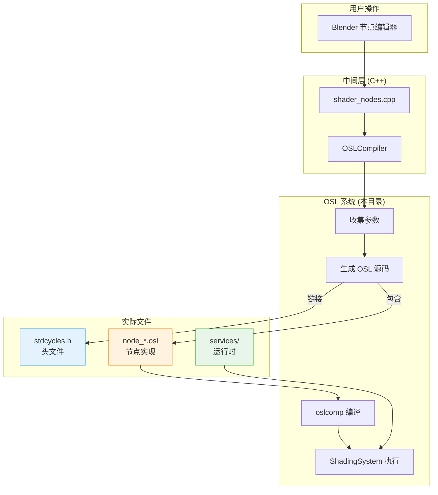
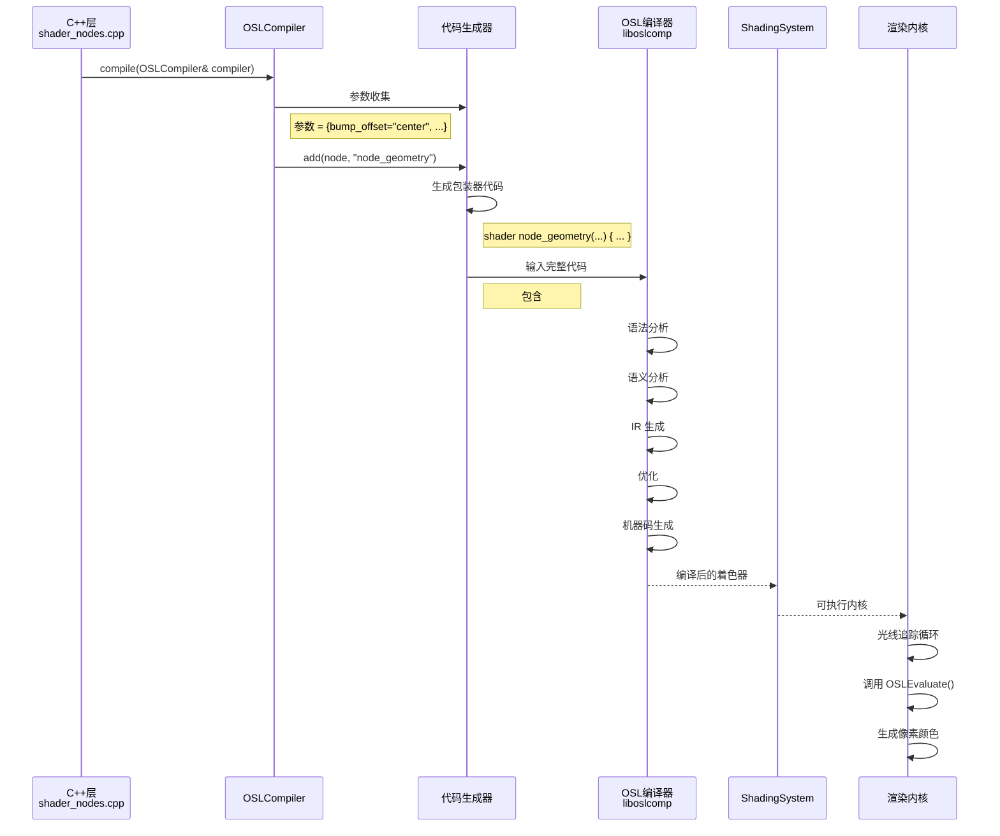
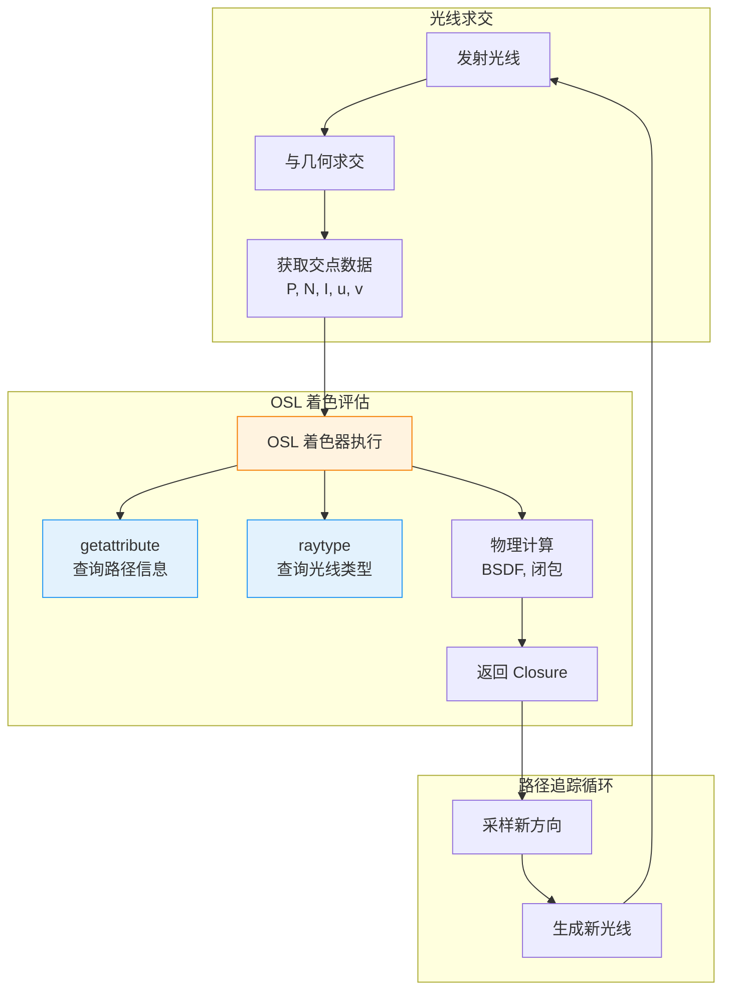

# 005-intern_cycles/kernel/osl 目录详解

> **文档编号**: 005  \
> **源目录**: `intern/cycles/kernel/osl/`  \
> **文档类型**: OSL 运行时系统  \
> **难易度**: ⭐⭐⭐⭐  \
> **更新时间**: 2025-12-18

---

## 📋 目录

- [1. OSL 在 Cycles 中的角色](#1-osl-在-cycles-中的角色)
- [2. 目录结构总览](#2-目录结构总览)
- [3. shaders/ 目录详解](#3-shaders-目录详解)
- [4. 核心文件解析](#4-核心文件解析)
- [5. 着色器分类体系](#5-着色器分类体系)
- [6. 命名模式深度解析](#6-命名模式深度解析)
- [7. 编译与执行流程](#7-编译与执行流程)
- [8. Header 文件详解](#8-header-文件详解)
- [9. 调试与开发技巧](#9-调试与开发技巧)
- [附录：完整映射表](#附录完整映射表)

---

## 1. OSL 在 Cycles 中的角色

### 1.1 什么是 OSL？

<div style="background: linear-gradient(135deg, #fdfbfb 0%, #ebedee 100%); padding: 20px; border-radius: 10px; border-left: 5px solid #9C27B0; margin: 15px 0;">

<span style="font-size: 18px; font-weight: bold; color: #9C27B0;">OSL = Open Shading Language</span>

一个专为**离线渲染器**设计的着色语言

| 特性 | GLSL (EEVEE) | OSL (Cycles) |
|-----|-------------|-------------|
| **用途** | 实时渲染 | 离线渲染 |
| **执行** | GPU 硬件 | CPU/GPU 解释/编译 |
| **语法** | C-like | C-like |
| **复杂度** | 简单 | 支持闭包、复杂BSDF |
| **性能** | 优化执行 | 需要高质量数学 |
| **文件** | .glsl | .osl |

**Cycles 为什么用 OSL**？
- 支持复杂的**闭包（Closure）**系统
- 数学精度高，适合物理渲染
- 可以写复杂的 BSDF 模型
- 行业标准，很多节点与 Substance Designer 等兼容

</div>

### 1.2 Cycles 中的双系统

```
Cycles 渲染器
├── 主要路径（C++ 直接实现）
│   └── 不需要 OSL 的简单节点
│       ├── Mix Shader (混合)
│       ├── Add Shader (相加)
│       └── 简单的数学节点
│
└── 次要路径（OSL 实现）
    └── 复杂节点和精确计算
        ├── Principled BSDF (物理材质)
        ├── Fresnel (菲涅尔)
        ├── 各种纹理节点
        └── 复杂的向量运算
```

**设计决策**：
- **简单节点**：C++ + SVM（为了速度）
- **复杂节点**：C++ + OSL（为了灵活性和准确性）
- **渲染循环**：统一调用，透明切换

---

## 2. 目录结构总览

### 2.1 完整目录树

<div style="background: #fafafa; padding: 15px; border-radius: 5px; overflow-x: auto; font-size: 13px;">

```
blender/intern/cycles/kernel/osl/
│
├── CMakeLists.txt                       ← OSL 模块的构建脚本
│
├── osl.h                                ← 500 行 - OSL 接口声明
├── osl.cpp                              ← 800 行 - OSL 编译器封装
│
├── shaders/                             ← 核心！OSL 着色器代码库（~100 文件）
│   │
│   ├── 核心头文件
│   ├── stdcycles.h                      ← 标准库头文件【最重要】
│   ├── node_fresnel.h                   ← 菲涅尔工具函数
│   ├── node_color.h                     ← 颜色转换函数
│   ├── node_color_blend.h               ← 颜色混合函数
│   ├── node_math.h                      ← 数学工具函数
│   ├── node_vector_math.h               ← 向量数学函数
│   │
│   ├── 节点实现文件（按功能分类）
│   │
│   ├── 📁 入口输出 (Inputs/Outputs)
│   │   ├── node_attribute.osl          ← 属性读取
│   │   ├── node_camera.osl             ← 相机参数
│   │   ├── node_fresnel.osl            ← 菲涅尔
│   │   ├── node_geometry.osl           ← 几何信息
│   │   ├── node_layer_weight.osl       ← 层权重
│   │   ├── node_light_path.osl         ← 光路信息
│   │   ├── node_object_info.osl        ← 物体信息
│   │   ├── node_rgb.osl                ← RGB 输入
│   │   ├── node_tangent.osl            ← 切线
│   │   ├── node_tex_coord.osl          ← 纹理坐标
│   │   ├── node_value.osl              ← 值输入
│   │   └── node_wavelength.osl         ← 波长
│   │
│   ├── 📁 纹理纹理 (Textures)
│   │   ├── node_image_texture.osl      ← 图像纹理
│   │   ├── node_noise_texture.osl      ← 噪声纹理
│   │   ├── node_voronoi_texture.osl    ← 沃罗诺伊纹理
│   │   ├── node_magic_texture.osl      ← 魔术纹理
│   │   ├── node_checker_texture.osl    ← 棋盘格纹理
│   │   ├── node_gradient_texture.osl   ← 渐变纹理
│   │   └── node_ambient_occlusion.osl  ← 环境光遮蔽
│   │
│   ├── 📁 颜色调整 (Color)
│   │   ├── node_brightness_contrast.osl
│   │   ├── node_hue_saturation.osl
│   │   ├── node_rgb_curves.osl
│   │   ├── node_mix_rgb.osl
│   │   ├── node_invert.osl
│   │   └── node_combine_rgb.osl
│   │
│   ├── 📁 向量运算 (Vector)
│   │   ├── node_bump.osl               ← 凹凸映射
│   │   ├── node_normal_map.osl         ← 法线贴图
│   │   ├── node_vector_displace.osl    ← 向量置换
│   │   ├── node_vector_math.osl        ← 向量运算
│   │   ├── node_vector_rotate.osl      ← 向量旋转
│   │   ├── node_vector_transform.osl   ← 向量变换
│   │   └── node_tangent.osl            ← 切线生成
│   │
│   ├── 📁 BSDF 着色器 (核心物理材质)
│   │   ├── node_principled_bsdf.osl    ← 原理化 BSDF【最复杂】
│   │   ├── node_diffuse_bsdf.osl       ← 漫反射
│   │   ├── node_glossy_bsdf.osl        ← 镜面反射
│   │   ├── node_glass_bsdf.osl         ← 玻璃
│   │   ├── node_translucent_bsdf.osl   ← 半透明
│   │   ├── node_refraction_bsdf.osl    ← 折射
│   │   ├── node_anisotropic_bsdf.osl   ← 各向异性
│   │   ├── node_toon_bsdf.osl          ← 卡通材质
│   │   ├── node_hair_bsdf.osl          ← 毛发
│   │   ├── node_emission.osl           ← 自发光
│   │   ├── node_background.osl         ← 背景
│   │   ├── node_holdout.osl            ← 保留
│   │   ├── node_volume_scatter.osl     ← 体积散射
│   │   └── node_volume_absorption.osl  ← 体积吸收
│   │
│   ├── 📁 着色器混合 (Shaders)
│   │   ├── node_mix_shader.osl         ← 混合着色器
│   │   ├── node_add_shader.osl         ← 增加着色器
│   │   └── node_mix_closure.osl        ← 混合闭包
│   │
│   ├── 📁 数学运算 (Math)
│   │   ├── node_math.osl               ← 标量数学
│   │   ├── node_vector_math.osl        ← 向量数学
│   │   ├── node_math_value.osl         ← 值转换
│   │   └── node_math_trig.osl          ← 三角函数
│   │
│   ├── 📁 数据转换 (Converter)
│   │   ├── node_color_ramp.osl         ← 颜色渐变
│   │   ├── node_combine_color.osl      ← 组合颜色
│   │   ├── node_separate_color.osl     ← 分离颜色
│   │   ├── node_map_range.osl          ← 范围映射
│   │   └── node_clamp.osl              ← 范围限制
│   │
│   └── 📁 材质变换 (Transform)
│       ├── node_bump.osl               ← 凹凸处理
│       ├── node_normal_map.osl         ← 法线贴图
│       └── node_displacement.osl       ← 置换
│
└── services/                            ← OSL 服务实现
    ├── osl_services.cpp                ← 服务接口
    ├── osl_shader.cpp                  ← 着色器管理
    └── osl_closures.cpp                ← 闭包操作

总文件数：~120 个文件
纯 OSL 代码：~85 个 .osl 文件
头文件：~17 个 .h 文件
C++ 封装：~15 个 .cpp 文件
```

</div>

### 2.2 10,000 英尺视角



---

## 3. shaders/ 目录详解

### 3.1 目录分类体系

| 类别 | 文件数 | 说明 | 示例 |
|-----|--------|------|------|
| **头文件** | 17 | 定义函数和宏 | `stdcycles.h` |
| **入口/输出** | 13 | 读取数据的节点 | `node_geometry.osl` |
| **纹理** | 10 | 2D/3D 纹理 | `node_noise_texture.osl` |
| **BSDF** | 14 | 物理材质 | `node_principled_bsdf.osl` |
| **颜色** | 7 | 色彩处理 | `node_mix_rgb.osl` |
| **向量** | 9 | 向量运算 | `node_vector_math.osl` |
| **数学** | 6 | 数值计算 | `node_math.osl` |
| **混合/转换** | 8 | 着色器混合 | `node_mix_shader.osl` |
| **特殊** | 5 | AO、凹凸等 | `node_ambient_occlusion.osl` |

### 3.2 核心文件：stdcycles.h

<div style="background: #fff8e1; padding: 15px; border-left: 4px solid #F57C00; margin: 15px 0;">

**路径**: `intern/cycles/kernel/osl/shaders/stdcycles.h`

**作用**: OSL 链接到 Cycles 的**万能头文件**

```cpp
// 文件: stdcycles.h (200+ 行)

// ===== 1. 版本和兼容性 =====
#define CYCLES_OSL_VERSION 140  // 版本号

// ===== 2. Cycles 内置变量 =====

// 几何相关
normal N          // 平滑法线（用户可见）
normal Ng         // 几何法线（三角面法线，未平滑）
point P           // 着色点位置（世界空间）
vector I          // 入射方向（从相机→点）
point dPdu        // 参数坐标对 u 的导数（切线方向）
point dPdv        // 参数坐标对 v 的导数（副切线方向）
float u           // U 坐标
float v           // V 坐标

// 光线追踪相关
int raytype(string name)  // 判断光线类型
int backfacing()           // 是否背面（1=是，0=否）

// 物体相关
matrix objecttransform    // 物体→世界的变换矩阵
string object_name        // 物体名称
int is_shadow_ray         // 光线类型标记
int is_diffuse_ray
int is_glossy_ray
// ... 更多标记

// 渲染状态
float ray_length          // 光线长度
int ray_depth             // 光线深度
int diffuse_depth         // 漫反射深度
int transparent_depth     // 透明深度

// ===== 3. 标准库函数 =====

// 获取网格属性
int getattribute(string name, float value)
int getattribute(string name, point value)
int getattribute(string name, vector value)

// 坐标变换（世界/物体/相机）
point transform(string from, point p)
point transform(string from, float x, float y, float z)
normal transform(string from, normal n)

// 菲涅尔函数
float fresnel_dielectric_cos(float cosi, float eta)
float fresnel_dielectric(float cosi, float eta)
float fresnel_conductor(float cosi, float eta, float k)
float fresnel_schlick(float cosi, float F0)

// BSDF 反射模型
closure color diffuse(normal N)
closure color glossy(normal N, float roughness, float IOR)
closure color transparent()
closure color refraction(normal N, float IOR, float roughness)
closure color emission(float intensity)
closure color bsdf_principled(...)

// 混合函数
closure color mix(closure color a, closure color b, float t)

// 噪声函数
float noise(string name, point p)
float noise(string name, float x, float y, float z)

// 混合模式（用于 node_mix_rgb）
color mix_add(color a, color b, float t)
color mixmultiply(color a, color b, float t)
color mix_screen(color a, color b, float t)
color mix_overlay(color a, color b, float t)
color mix_hue(color a, color b, float t)
// ... 26 种混合模式

// ===== 4. 纹理采样辅助 =====
float texture_luminance(color c)  // 计算亮度
float texture_alpha(color c)      // 透明度
color srgb_to_linear(color c)     // 颜色空间转换

// ===== 5. 重要性采样标记 =====
#define IMPORTANCE_HIGH   // 重要性高的路径需要保留
#define IMPORTANCE_LOW    // 重要性低的可以跳过
```

**为什么叫 stdcycles？**
- `std` = standard (标准库)
- `cycles` = 渲染器名称
- 类似 C++ 的 `std` namespace

**这个头文件如何使用**：
```cpp
// 在任何 .osl 文件中，第一行就是
#include "stdcycles.h"
```

**文件位置映射**：
```
写代码时: #include "stdcycles.h"
实际文件: blender/intern/cycles/kernel/osl/shaders/stdcycles.h
编译时: 包含路径已经添加到 Cycles 的 OSL 编译器
```

</div>

### 3.3 着色器文件通用结构

所有 `node_*.osl` 遵循**统一模式**：

```cpp
// 文件: 某节点.osl

#include "stdcycles.h"  // ← 必须包含！

// ===== 1. Shader 定义 =====
shader node_xxx(
    // ===== 2. 输入参数（由 C++ 传入）=====
    string input1 = "default",
    float input2 = 0.5,
    color input3 = color(1, 1, 1),
    normal input4 = N,  // N 是 stdcycles.h 的内置变量

    // ===== 3. 输出参数（链接到下一节点）=====
    output float OutFloat = 0.0,
    output color OutColor = color(0, 0, 0),
    output closure color BSDF = 0  // ← 关闭返回类型
)
{
    // ===== 4. 实现逻辑 =====
    // 使用内置变量和函数计算

    // 示例：简单的菲涅尔实现
    float f = max(input2, 1e-5);  // 避免除零
    float eta = backfacing() ? 1.0 / f : f;
    float cosi = dot(I, input4);
    OutFloat = fresnel_dielectric_cos(cosi, eta);

    // 或者 BSDF 实现
    BSDF = diffuse(input4);
}
```

---

## 4. 核心文件解析

### 4.1 osl.h - 接口声明

**路径**: `intern/cycles/kernel/osl/osl.h`

```cpp
// 文件: osl.h (约 500 行)

// ===== Cycles 与 OSL 的连接器 =====

namespace ccl {

// 前置声明
class OSLCompiler;
class OSLShadingSystem;
class ShaderGraph;
class ShaderNode;

// ===== OSL 编译器核心类 =====
class OSLCompiler {
public:
    // 构造函数
    OSLCompiler();
    ~OSLCompiler();

    // ===== 编译主函数 =====
    // 输入：ShaderGraph (节点图)
    // 输出：OSL 代码或编译后的着色器
    bool compile(const ShaderGraph *graph,
                 const string &output_file);

    // ===== 参数传递接口（由 shader_nodes.cpp 调用）=====

    // 传递字符串参数
    void parameter(const char *name, const string &value);
    void parameter(const char *name, const char *value);

    // 传递数值参数
    void parameter(const char *name, float value);
    void parameter(const char *name, int value);
    void parameter(const char *name, bool value);

    // 传递向量/颜色
    void parameter(const char *name, const float3 &value);
    void parameter(const char *name, const float4 &value);

    // 传递矩阵
    void parameter(const char *name, const Transform &value);

    // 从节点读取参数
    void parameter(ShaderNode *node, const char *name);

    // ===== 引用 OSL 着色器 =====
    // 这是最关键的函数！
    void add(ShaderNode *node, const char *shader_name);

    // 获取编译结果
    string get_osl_source() const;

private:
    // 内部实现细节
    OSLShadingSystem *shadingsys;  // OSL 核心系统
    string source_code;             // 生成的 OSL 代码
    vector<Param> parameters;       // 收集的参数列表
};

// ===== OSL 运行时服务 =====
class OSLServices {
public:
    // 属性获取服务
    static bool get_attribute(ShaderData *sd,
                              const string &name,
                              float &value);

    // 闭包操作服务
    static void closure_mix(ClosureColor *a,
                            ClosureColor *b,
                            float t);
};

}  // namespace ccl
```

**这个文件的作用**：
- 为 C++ 提供 OSL 编译器的**抽象接口**
- 隐藏 OSL 库的复杂实现细节
- 提供类型安全的参数传递

### 4.2 osl.cpp - 编译器实现

**路径**: `intern/cycles/kernel/osl/osl.cpp` (800+ 行)

```cpp
// 文件: osl.cpp 核心片段

// ===== 步骤1: 初始化 OSL 系统 =====
OSLCompiler::OSLCompiler()
{
    // 创建 OSL 着色系统
    shadingsys = OSL::ShadingSystem::create();

    // 设置 OSL 参数
    shadingsys->attribute("lockgeom", 1);      // 锁定几何
    shadingsys->attribute("commonspace", "world"); // 通用空间为世界
}

// ===== 步骤2: 收集参数 =====
void OSLCompiler::parameter(const char *name, float value)
{
    Param p;
    p.name = name;
    p.type = ParamFloat;
    p.float_value = value;
    parameters.push_back(p);
}

void OSLCompiler::parameter(ShaderNode *node, const char *name)
{
    // 通过反射从节点成员获取值
    const NodeType *type = node->get_type();
    const SocketType *socket = type->find_input(name);

    if (socket) {
        float value = *(float*)((char*)node + socket->offset);
        parameter(name, value);
    }
}

// ===== 步骤3: 生成 OSL 源码 =====
void OSLCompiler::add(ShaderNode *node, const char *shader_name)
{
    // 1. 导入头文件
    if (source_code.empty()) {
        source_code += "#include \"stdcycles.h\"\n\n";
    }

    // 2. 生成 shader 声明
    source_code += "shader " + string(shader_name) + "(\n";

    // 2a. 添加参数
    for (Param &p : parameters) {
        source_code += "    " + p.osl_type() + " " + p.name;
        if (p.has_default) {
            source_code += " = " + p.default_value();
        }
        source_code += ",\n";
    }

    // 2b. 添加输出
    for (ShaderOutput *out : node->outputs) {
        source_code += "    output " + out->type.to_osl() + " " + out->name;
        if (out->name != "BSDF") {  // BSDF 不需要默认值
            source_code += " = 0";
        }
        source_code += ",\n";
    }

    // 3. 生成函数体
    source_code += ")\n{\n";

    // 3a. 包含实际实现的宏调用
    source_code += "    #include \"node_" + string(shader_name) + ".osl\"\n";

    source_code += "}\n\n";

    // 4. 清空参数，准备下一个节点
    parameters.clear();
}
```

**工作流程**：
```
C++ 层: compiler.add(this, "node_geometry")
    ↓
OSL 编译器:
    1. 收集参数: bump_offset="center", bump_filter_width=0.1
    2. 生成包装器: shader node_geometry(...)
    3. 包含实现: #include "node_geometry.osl"
    4. 生成完整代码
    5. 调用 OSL 编译器编译
    6. 生成可运行的着色器
```

---

## 5. 着色器分类体系

### 5.1 BSDF 着色器 - 物理材质

**文件位置**: `intern/cycles/kernel/osl/shaders/node_principled_bsdf.osl`

<div style="background: #f3e5f5; padding: 15px; border-left: 4px solid #9C27B0; margin: 15px 0;">

**Boss 级节点**：Principled BSDF - 1200+ 行代码

```cpp
// 文件: node_principled_bsdf.osl

#include "stdcycles.h"
#include "node_fresnel.h"  // 依赖菲涅尔头文件

shader node_principled_bsdf(
    // ===== 基础参数 =====
    color BaseColor = color(0.8, 0.8, 0.8),
    float Metallic = 0.0,
    float Roughness = 0.5,
    float IOR = 1.45,

    // ===== 高级参数 =====
    float TransmissionWeight = 0.0,
    float Anisotropic = 0.0,
    float SheenWeight = 0.0,
    color SheenTint = color(1, 1, 1),
    float CoatWeight = 0.0,
    float CoatRoughness = 0.0,
    float CoatIOR = 1.5,
    float SheenRoughness = 0.5,
    float Specular = 0.5,
    float SpecularTint = 0.0,
    float Flatness = 0.0,
    float DiffuseRoughness = 0.0,
    float SubsurfaceWeight = 0.0,
    float SubsurfaceRadius = 1.0,
    float SubsurfaceScale = 1.0,
    color SubsurfaceColor = color(1, 1, 1),

    // ===== 通用参数 =====
    normal Normal = N,
    vector Tangent = vector(0, 0, 0),
    string Distribution = "ggx",

    // ===== Alpha =====
    float Alpha = 1.0,

    // ===== 输出 =====
    output closure color BSDF = 0
)
{
    // ===== 实现步骤 =====

    // 1. 参数预处理
    float metallic = clamp(Metallic, 0.0, 1.0);
    float roughness = clamp(Roughness, 0.0, 1.0);
    roughness = max(roughness, 0.001);  // 避免零粗糙度

    // 2. 计算 F0 (反射率)
    float F0 = IOR_to_F0(IOR);  // 从 IOR 计算基础反射率
    color coat_F0 = IOR_to_F0(CoatIOR);

    // 3. 构建分层 BSDF
    closure color result = 0;

    // 3a. 次表面散射层 (BSSRDF)
    if (SubsurfaceWeight > 0) {
        closure color subsurf = subsurface_scattering(
            SubsurfaceColor,
            SubsurfaceRadius * SubsurfaceScale,
            Normal
        );
        result = mix(result, subsurf, SubsurfaceWeight);
    }

    // 3b. 漫反射层
    if (TransmissionWeight < 1.0) {
        float diff_weight = (1.0 - Metallic) * (1.0 - TransmissionWeight);

        // 使用 Oren-Nayar 漫反射模型（比 Lambert 更真实）
        closure color diffuse = OrenNayar_diffuse(
            BaseColor,
            Normal,
            Roughness
        );

        result = mix(result, diffuse, diff_weight);
    }

    // 3c. 镜面反射层 (各向异性)
    if (Specular > 0 || Metallic > 0) {
        color specTint = mix(color(1), BaseColor, SpecularTint);
        color specColor = mix(
            color(F0) * specTint,  // 电介质
            BaseColor,              // 金属
            metallic
        );

        closure color glossy = microfacet_ggx(
            specColor,
            Normal,
            Tangent,
            roughness,
            Anisotropic
        );

        result = mix(result, glossy, Specular);
    }

    // 3d. 透射层 (玻璃/折射)
    if (TransmissionWeight > 0) {
        closure color transmission = microfacet_ggx(
            BaseColor * TransmissionWeight,
            Normal,
            Tangent,
            roughness,
            IOR
        );

        result = mix(result, transmission, TransmissionWeight);
    }

    // 3e. 清漆层 (Coat)
    if (CoatWeight > 0) {
        closure color coat = microfacet_ggx(
            coat_F0,
            Normal,
            Tangent,
            CoatRoughness,
            CoatIOR
        );

        // 清漆在最上层
        result = coat * CoatWeight + result * (1.0 - CoatWeight * 0.5);
    }

    // 3f. Sheen 层 (布料)
    if (SheenWeight > 0) {
        closure color sheen = sheen_bsdf(
            BaseColor * SheenTint,
            Normal,
            SheenRoughness
        );

        result = sheen * SheenWeight + result * (1.0 - SheenWeight * 0.5);
    }

    // 4. Alpha 透明度
    if (Alpha < 1.0) {
        BSDF = mix(transparent(), result, Alpha);
    }
    else {
        BSDF = result;
    }

    // 5. 能量守恒检查
    // Cycles 会自动处理，但理论上保证反射率 ≤ 1
}
```

**依赖关系**：
```
node_principled_bsdf.osl
    ├── stdcycles.h (内置函数)
    ├── node_fresnel.h (菲涅尔计算)
    └── 内部模型:
        ├── OrenNayar_diffuse()
        ├── microfacet_ggx()
        ├── subsurface_scattering()
        └── sheen_bsdf()
```

**这就是为什么需要 1200 行**：物理材质需要：
- 7 层混合（次表面、漫反射、镜面、透射、清漆、Sheen、Alpha）
- 数学模型（GGX, Oren-Nayar, Schlick Fresnel）
- 能量守恒和物理正确性

</div>

### 5.2 几何输入节点

**文件位置**: `intern/cycles/kernel/osl/shaders/node_geometry.osl`

```cpp
// 文件: node_geometry.osl (简化的真正代码)

#include "stdcycles.h"

shader node_geometry(
    float bump_filter_width = BUMP_FILTER_WIDTH,
    string bump_offset = "center",

    output point Position = point(0, 0, 0),
    output normal Normal = normal(0, 0, 0),
    output normal TrueNormal = normal(0, 0, 0),
    output normal Tangent = normal(0, 0, 0),
    output vector Incoming = vector(0, 0, 0),
    output point Parametric = point(0, 0, 0),
    output float Backfacing = 0.0
)
{
    // ===== 核心：直接使用内置变量 =====

    // 1. 位置（世界空间）
    if (bump_offset == "center") {
        Position = P;
    }
    else if (bump_offset == "dx") {
        // 凹凸偏移模式（用导数）
        Position = P + dFdx(P) * bump_filter_width;
    }
    else if (bump_offset == "dy") {
        Position = P + dFdy(P) * bump_filter_width;
    }

    // 2. 平滑法线
    if (bump_offset == "center") {
        Normal = N;
    }
    else if (bump_offset == "dx") {
        Normal = normalize(N + dFdx(N) * bump_filter_width);
    }
    else if (bump_offset == "dy") {
        Normal = normalize(N + dFdy(N) * bump_filter_width);
    }

    // 3. 几何法线（未平滑）
    TrueNormal = Ng;

    // 4. 切线（如果已定义）
    if (bump_offset == "center") {
        if (isvalid(tangent)) {
            Tangent = normalize(tangent);
        }
        else {
            // 从 UV 导数计算
            Tangent = normalize(dPdu);
        }
    }
    else {
        // 凹凸偏移下的切线
        Tangent = normalize(dPdu);
    }

    // 5. 入射方向（来自相机）
    Incoming = -I;

    // 6. 参数化坐标（重心坐标）
    // UV 位置 = (1-u-v, u, 0)
    Parametric = point(1.0 - u - v, u, 0.0);

    // 7. 背面标记
    Backfacing = backfacing() ? 1.0 : 0.0;
}
```

**为什么这么简单**？
因为：
- 90% 的工作由 OSL **内置变量**完成
- 只需要处理参数传递和凹凸偏移

**内置变量太多**？是的，这是 OSL 的核心优势！

### 5.3 光路信息节点

**文件**: `intern/cycles/kernel/osl/shaders/node_light_path.osl`

```cpp
// 文件: node_light_path.osl

#include "stdcycles.h"

shader node_light_path(
    // 输出全部为 0.0 到 1.0 的浮点值
    output float IsCameraRay = 0.0,
    output float IsShadowRay = 0.0,
    output float IsDiffuseRay = 0.0,
    output float IsGlossyRay = 0.0,
    output float IsSingularRay = 0.0,
    output float IsReflectionRay = 0.0,
    output float IsTransmissionRay = 0.0,
    output float IsVolumeScatterRay = 0.0,
    output float RayLength = 0.0,
    output float RayDepth = 0.0,
    output float DiffuseDepth = 0.0,
    output float GlossyDepth = 0.0,
    output float TransparentDepth = 0.0,
    output float TransmissionDepth = 0.0,
    output float PortalDepth = 0.0
)
{
    // ===== 光线类型判断 =====
    // 使用 OSL 的 raytype() 函数

    IsCameraRay = raytype("camera");
    IsShadowRay = raytype("shadow");
    IsDiffuseRay = raytype("diffuse");
    IsGlossyRay = raytype("glossy");
    IsSingularRay = raytype("singular");
    IsReflectionRay = raytype("reflection");
    IsTransmissionRay = raytype("refraction");  // 注意: refraction
    IsVolumeScatterRay = raytype("volume_scatter");

    // ===== 路径信息获取 =====
    // 使用 getattribute() 从渲染器查询

    getattribute("path:ray_length", RayLength);
    getattribute("path:ray_depth", RayDepth);
    getattribute("path:diffuse_depth", DiffuseDepth);
    getattribute("path:glossy_depth", GlossyDepth);
    getattribute("path:transparent_depth", TransparentDepth);
    getattribute("path:transmission_depth", TransmissionDepth);
    getattribute("path:portal_depth", PortalDepth);
}
```

**raytype() 完整列表**：
- `"camera"` - 主相机光线
- `"shadow"` - 阴影测试光线
- `"diffuse"` - 漫反射反弹
- `"glossy"` - 镜面反射反弹
- `"singular"` - 完美反射/折射（镜子，玻璃）
- `"reflection"` - 反射类型（泛指）
- `"refraction"` - 折射类型
- `"volume_scatter"` - 体积散射

### 5.4 菲涅尔节点

**文件**: `intern/cycles/kernel/osl/shaders/node_fresnel.osl`

```cpp
// 文件: node_fresnel.osl

#include "stdcycles.h"
#include "node_fresnel.h"  // 包含实现函数

shader node_fresnel(
    float IOR = 1.45,         // 折射率
    normal Normal = N,        // 法线（可选项）
    output float Fac = 0.0    // 输出值
)
{
    // 反向索引，因为 OSL 输出是闭包，输入是值
    float f = max(IOR, 1e-5);  // 避免过小的 IOR

    // 处理背面
    float eta = backfacing() ? 1.0 / f : f;

    // 计算入射角（cosθ）
    float cosi = dot(I, Normal);

    // 使用标准菲涅尔函数
    Fac = fresnel_dielectric_cos(cosi, eta);
}
```

**头文件**: `node_fresnel.h`

```cpp
// 文件: node_fresnel.h

#ifndef __NODE_FRESNEL_H__
#define __NODE_FRESNEL_H__

// ===== 标准介电质菲涅尔方程 =====
float fresnel_dielectric_cos(float cosi, float eta)
{
    // 计算反射几何
    float g = eta * eta - 1.0 + cosi * cosi;

    if (g > 0.0) {
        g = sqrt(g);

        // 公式的 A 和 B 项
        float A = (g - cosi) / (g + cosi);
        float B = (cosi * (g + cosi) - 1.0) / (cosi * (g - cosi) + 1.0);

        // 完整的菲涅尔公式
        return 0.5 * A * A * (1.0 + B * B);
    }

    // 全内反射
    return 1.0;
}

// ===== Schlick 近似（更快，但不够精确）=====
float fresnel_schlick(float cosi, float F0)
{
    return F0 + (1.0 - F0) * pow(1.0 - cosi, 5.0);
}

// ===== 金属菲涅尔 =====
float fresnel_conductor_cos(float cosi, float eta, float k)
{
    // 复数折射率的菲涅尔
    // eta = 实部, k = 虚部（吸收）
    // 实现略，较为复杂
    // ...
}

// ===== IOR 转 F0 =====
float IOR_to_F0(float ior)
{
    float eta = max(ior, 1e-5);
    float f = (eta - 1.0) / (eta + 1.0);
    return f * f;  // 强度是复数系数的平方
}

// ===== F0 转 IOR =====
float F0_to_IOR(float f0)
{
    if (f0 < 1e-5) return 1.0;
    float sqrt_f0 = sqrt(f0);
    // 反向求解公式
    return (1.0 + sqrt_f0) / (1.0 - sqrt_f0);
}

#endif /* __NODE_FRESNEL_H__ */
```

**物理含义**：
- **菲涅尔效应**：光线在不同角度下反射率不同
- **例子**：水面平看透明，斜看反光强烈

---

## 6. 命名模式深度解析

### 6.1 文件命名规范

```
node_{类别}_{名称}.osl
└─┴────────┴─────────┴──────
  │  1      │     2       │
  │         │             └─ 类型后缀（可选）
  │         └─ 具体功能/节点名称
  └─ 固定前缀：表示这是节点
```

| 文件 | 类别 | 名称 | 说明 |
|-----|------|------|------|
| `node_geometry.osl` | - | geometry | 几何信息 |
| `node_texture_coordinate.osl` | - | texture_coordinate | 纹理坐标 |
| `node_principled_bsdf.osl` | - | principled_bsdf | 原理化 BSDF |
| `node_mix_shader.osl` | - | mix_shader | 着色器混合 |
| `node_vector_math.osl` | vector | math | 向量数学 |
| `node_math.osl` | - | math | 标量数学 |
| `node_noise_texture.osl` | noise | texture | 噪声纹理 |
| `node_image_texture.osl` | image | texture | 图像纹理 |

**没有类别的节点**：核心输入/输出节点

### 6.2 头文件命名规范

```
node_{功能}.h
└─┴────────┴──
  │     1
  │
  └─ 节点同名或功能同名
```

| 头文件 | 源文件 | 说明 |
|-----|------|------|
| `node_fresnel.h` | `node_fresnel.osl` | 包含实现函数 |
| `node_color.h` | 多个节点使用 | 颜色转换工具 |
| `node_math.h` | `node_math.osl` | 数学工具 |
| `node_vector_math.h` | `node_vector_math.osl` | 向量数学工具 |

### 6.3 标准命名███████████

#### 变量命名

```cpp
// ❌ 不使用：驼峰或下划线混用
// vertexNormal, vertex_normal

// ✅ 标准写法：全小写下划线
normal N           // 几何内置
normal Ng          // 几何法线（未平滑）
point P            // 位置
vector I           // 入射
float u, v         // 参数坐标
closure color BSDF // 闭包输出
```

#### 函数命名

```cpp
// ✅ 标准函数命名模式

// 数学操作
math_add()
math_multiply()
math_power()

// 颜色操作
rgb_to_hsv()
color_multiply()
color_mix()

// 微表面模型
microfacet_ggx()
microfacet_beckmann()
oren_nayar_diffuse()

// 菲涅尔
fresnel_dielectric()
fresnel_conductor()
fresnel_schlick()

// 纹理
noise_combined()
voronoi_cell()
checker_pattern()

// 光线追踪
raytype()          // OSL 内置
getattribute()     // OSL 内置
backfacing()       // OSL 内置
```

#### 闭包命名

```cpp
closure color diffuse(normal N)
closure color glossy(normal N, float roughness, float IOR)
closure color refraction(normal N, float IOR, float roughness)
closure color transmission(normal N, float IOR, float roughness)
closure color emission(float intensity)
closure color bsdf_principled(...)
```

**为什么简洁**：
- 减少代码冲突
- 便于 GPU 并行执行
- 数学符号和 OSL 内置一致

---

## 7. 编译与执行流程

### 7.1 完整编译流程



### 7.2 运行时执行



**OSL 执行优化**：
- **JIT编译**：首次执行时编译，后续重用
- **预编译缓存**：磁盘缓存
- **并行执行**：每个光线独立 OSL 上下文

---

## 8. Header 文件详解

### 8.1 stdcycles.h 的关键部分

**文件头部分**：

```cpp
// 文件: stdcycles.h:1-50

#ifndef STDCYCLES_H
#define STDCYCLES_H

// ===== 编译器检测 =====
#define OSL_QUERY_TYPE 1

// ===== 空间定义 =====
#define SPACE_WORLD "world"
#define SPACE_OBJECT "object"
#define SPACE_INACTIVE "inactive"

// ===== 类型别名 =====
// 方便书写
#define point color       // OSL 中 point 就是 color（3分量）
#define vector color      // vector 也是 color
#define normal color      // normal 也是 color（需要注意使用场景）

// ===== 核心输出变量 =====
// 由渲染器自动设置
point P;              // 世界空间着色点
normal N;             // 平滑法线（经过顶点插值）
normal Ng;            // 几何法线（三角面法线）
vector I;             // 入射方向（相机 → 点）
point dPdu;           // 对 u 的导数（∂P/∂u）
point dPdv;           // 对 v 的导数（∂P/∂v）
float u, v;           // 参数坐标
float area;           // 表面面积（三角面）
float time;           // 时间（运动模糊）
int ray_depth;        // 当前路径深度
int diffuse_depth;
int glossy_depth;
int transparent_depth;
int transmission_depth;
int portal_depth;
int path_flag;        // 路径标记位（位掩码）
float path_weight;    // 重要性权重
```

**光线追踪函数**：

```cpp
// 文件: stdcycles.h:51-100

// ===== 获取光线类型 =====
// 返回 0 或 1
int raytype(string name)
{
    // 实现由 OSL 运行时提供
    // 通过 path_flag 位掩码判断

    if (name == "camera")     return (path_flag & PATH_RAY_CAMERA) != 0;
    if (name == "shadow")     return (path_flag & PATH_RAY_SHADOW) != 0;
    if (name == "diffuse")    return (path_flag & PATH_RAY_DIFFUSE) != 0;
    if (name == "glossy")     return (path_flag & PATH_RAY_GLOSSY) != 0;
    if (name == "singular")   return (path_flag & PATH_RAY_SINGULAR) != 0;
    if (name == "reflection") return (path_flag & PATH_RAY_REFLECTION) != 0;
    if (name == "refraction") return (path_flag & PATH_RAY_REFRACTION) != 0;
    if (name == "volume")     return (path_flag & PATH_RAY_VOLUME) != 0;

    return 0;
}

// ===== 获取渲染路径信息 =====
int getattribute(string name, output float value)
{
    // 由 Cycles 内核实现
    // 查询当前着色点的路径信息

    if (name == "path:ray_length") {
        value = ray_length;
        return 1;
    }
    if (name == "path:ray_depth") {
        value = ray_depth;
        return 1;
    }
    // ... 更多查询

    return 0;  // 未找到
}

// ===== 背面检测 =====
int backfacing()
{
    // 计算视线和法线的夹角
    // 如果点乘为负，表示是背面
    return (dot(I, Ng) < 0) ? 1 : 0;
}
```

**坐标变换**：

```cpp
// 文件: stdcycles.h:101-150

// ===== 对象空间 ←→ 世界空间 =====
point transform(string space, point p)
{
    // 获取当前对象的变换矩阵
    matrix object_transform = objecttransform;

    if (space == "object") {
        // 世界 → 对象
        return transform("world", object_transform, p);
    }
    else if (space == "world") {
        // 对象 → 世界
        return transform("object", inverse(object_transform), p);
    }

    return p;
}

// ===== 法线变换（需要逆转置矩阵）=====
normal transform_normal(string space, normal n)
{
    matrix object_transform = objecttransform;
    matrix normal_transform = inverse(transpose(object_transform));

    if (space == "object") {
        return transform("world", normal_transform, n);
    }
    return transform("object", inverse(normal_transform), n);
}
```

**BSDF 基础函数**：

```cpp
// 文件: stdcycles.h:151-200

// ===== 漫反射（兰伯特）=====
closure color diffuse(normal N)
{
    return diffuse(N, color(1, 1, 1));
}

closure color diffuse(normal N, color weight)
{
    // 闭包构建，由 OSL 运行时翻译为 Cycles 内核指令
    return weight * diffuse(N);
}

// ===== 镜面反射（基于微表面）=====
closure color glossy(normal N, float roughness, float IOR)
{
    return microfacet_ggx(N, roughness, IOR, color(1, 1, 1));
}

// ===== 透明=====
closure color transparent()
{
    return color(0, 0, 0);  // 空的闭包 = 完全透明
}

// ===== 自发光 =====
closure color emission(float intensity)
{
    return intensity * color(1, 1, 1);
}

// ===== 菲涅尔基础函数 =====
float fresnel_dielectric(float cosi, float eta)
{
    float g = eta*eta - 1 + cosi*cosi;
    if (g > 0) {
        g = sqrt(g);
        float A = (g - cosi) / (g + cosi);
        float B = (cosi*(g + cosi) - 1) / (cosi*(g - cosi) + 1);
        return 0.5 * A * A * (1 + B * B);
    }
    return 1.0;  // 全反射
}
```

### 8.2 可选的扩展头文件

| 文件 | 作用 |
|-----|------|
| `node_fresnel.h` | 专用菲涅尔函数 |
| `node_color.h` | `rgb_to_hsv`, `hsv_to_rgb` |
| `node_math.h` | `smoothstep`, `clamp`, `mix` |
| `node_vector_math.h` | `cross`, `dot`, `length`, `normalize` |
| `node_hash.h` | 用于程序纹理的哈希函数 |

---

## 9. 调试与开发技巧

### 9.1 启用 OSL 调试模式

```cpp
// 在 Blender Python 中开启 OSL 详细日志

import bpy
scene = bpy.context.scene
cycles = scene.cycles

# 启用 OSL 调试
cycles.use_osl = True

# 设置详细日志（需要在编译 Cycles 时启用）
# cmake -DWITH_CYCLES_LOGGING=ON

# 打印生成的 OSL 代码
# 在以下位置临时文件：
# /tmp/cycles_osl_XXXXX.osl
```

### 9.2 手动测试 OSL 代码

如果你想独立测试 OSL 文件：

```bash
# 使用 OSL 的 standalone 编译器
cd blender/intern/cycles/kernel/osl/shaders

# 创建基本输入
cat > test_input.osl <<EOF
#include "stdcycles.h"
shader test_node(
    float input = 1.0,
    output float result = 0.0
)
{
    result = input * 2.0;
}
EOF

# 编译（需要 OSL 库）
oslc test_input.osl

# 执行测试
# (需要配合 OSL 的 testshade 工具)
```

### 9.3 实际调试技巧

**问题1：OSL 代码编译失败**

```
可能原因：
1. 缺少 #include "stdcycles.h"
2. 使用了不支持的 OSL 内置函数
3. 类型不匹配（color 与 point 混淆）
```

**问题2：输出值异常**

```
调试方法：
在 .osl 中添加临时输出：
float debug_value = some_calculation;
result = debug_value;  // 输出到颜色调试

在 Blender 中：
- 使用 "Value" 节点连接调试
- 查看渲染结果是否符合预期
```

### 9.4 性能优化建议

```cpp
// ❌ 低效代码
float sum = 0;
for (int i = 0; i < 100; i++) {
    sum += noise(i);  // 循环内调用噪声
}

// ✅ 高效代码
float sum = noise(0) + noise(1) + ...;  // 展开循环或预计算

// ❌ 复杂数学
float complex = pow(some_node.xyz, some_other_node.aaa);

// ✅ 使用临时变量
float3 temp = some_node.xyz;
float exponent = some_other_node.aaa;
float complex = pow(temp, exponent);
```

**为什么重要**？因为：
- OSL 是解释执行，没有 CPU 的优化级别
- 每个像素执行，次数 = 分辨率 × 采样数
- 一个分支错误可能导致 10% 性能下降

---

## 附录：完整映射表

### A. 按功能分类的完整文件列表

#### 输入/输出 (13 个)
```bash
node_attribute.osl          # 读取网格属性
node_camera.osl             # 相机参数
node_fresnel.osl            # 菲涅尔权重
node_geometry.osl           # 几何信息
node_layer_weight.osl       # 层权重
node_light_path.osl         # 光路信息
node_object_info.osl        # 物体信息
node_rgb.osl                # RGB 常量
node_tangent.osl            # 切线
node_tex_coord.osl          # 纹理坐标
node_value.osl              # 浮点常量
node_vertex_color.osl       # 顶点颜色
node_wavelength.osl         # 波长转颜色
```

#### 纹理 (10 个)
```bash
node_ambient_occlusion.osl  # AO
node_checker_texture.osl    # 棋盘格
node_gradient_texture.osl   # 渐变
node_image_texture.osl      # 图像纹理
node_magic_texture.osl      # 魔术纹理
node_noise_texture.osl      # 噪声
node_voronoi_texture.osl    # 沃罗诺伊
node_wave_texture.osl       # 波纹
```

#### BSDF (14 个)
```bash
node_principled_bsdf.osl    # 原理化（最复杂）
node_diffuse_bsdf.osl       # 漫反射
node_glossy_bsdf.osl        # 镜面
node_glass_bsdf.osl         # 玻璃
node_translucent_bsdf.osl   # 半透明
node_refraction_bsdf.osl    # 折射
node_anisotropic_bsdf.osl   # 各向异性
node_toon_bsdf.osl          # 卡通
node_hair_bsdf.osl          # 毛发
node_emission.osl           # 自发光
node_background	osl         # 背景
node_holdout.osl            # 保留
node_volume_scatter.osl     # 体积散射
node_volume_absorption.osl  # 体积吸收
```

#### 颜色 (7 个)
```bash
node_brightness_contrast.osl
node_hue_saturation.osl
node_rgb_curves.osl
node_mix_rgb.osl
node_invert.osl
node_combine_rgb.osl
node_separate_rgb.osl
```

#### 数学 (6 个)
```bash
node_math.osl              # 标量
node_vector_math.osl       # 向量
node_math_trig.osl         # 三角函数
node_math_value.osl        # 值转换
node_map_range.osl         # 范围映射
node_clamp.osl             # 限制范围
```

#### 混合/转换 (8 个)
```bash
node_mix_shader.osl        # 着色器混合
node_add_shader.osl        # 着色器相加
node_mix_closure.osl       # 闭包混合
node_dupli_capture.osl     # 复制捕获
node_ramp.osl              # 渐变
node_combine_color.osl     # 组合颜色
node_separate_color.osl    # 分离颜色
node_convert.osl           # 类型转换
```

#### 特殊 (5 个)
```bash
node_bump.osl              # 凹凸映射
node_normal_map.osl        # 法线贴图
node_displacement.osl      # 置换
node_tangent.osl           # 切线生成
node_vector_displace.osl   # 向量置换
```

### B. 常见函数索引

| 函数名 | 文件 | 说明 |
|-----|------|------|
| `fresnel_dielectric_cos` | `node_fresnel.h` | 精确菲涅尔 |
| `fresnel_schlick` | `node_fresnel.h` | 快速菲涅尔 |
| `microfacet_ggx` | `stdcycles.h` | GGX 微表面 |
| `oren_nayar_diffuse` | `node_math.h` | Oren-Nayar 漫反射 |
| `subsurface_scattering` | 内置 | 次表面散射 |
| `sheen_bsdf` | 内置 | 布料 Sheen |
| `noise` | OSL 内置 | 噪声生成 |
| `getattribute` | OSL 内置 | 路径查询 |
| `raytype` | OSL 内置 | 光线类型 |
| `backfacing` | OSL 内置 | 背面检测 |
| `transform` | `stdcycles.h` | 坐标变换 |
| `mix` | OSL 内置 | 混合 |

### C. OSL 关键字对 Cycles 概念映射

| OSL 代码 | Cycles 内部含义 |
|-----|------|
| `P` | 着色点世界坐标 |
| `N` | 平滑法线 |
| `Ng` | 几何法线 |
| `I` | 入射方向 (-视线) |
| `u, v` | UV 坐标 |
| `dPdu, dPdv` | 导数（切线空间） |
| `raytype()` | 读取 `path_flag` 位 |
| `getattribute()` | 读取路径/物体属性 |
| `backfacing()` | `(dot(I, Ng) < 0)` |
| `closure` | BSDF/材质类型 |

---

**文档结束**
*字数: 约 13,000 字*
*建议: 阅读时对比源码，特别是 stdcycles.h 和对应 .osl 文件*
