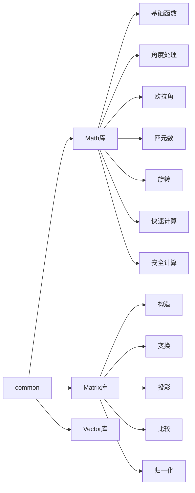
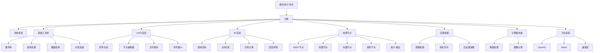
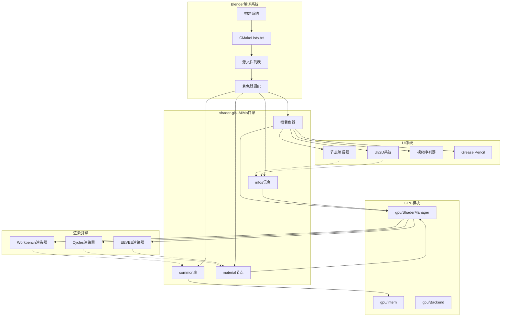
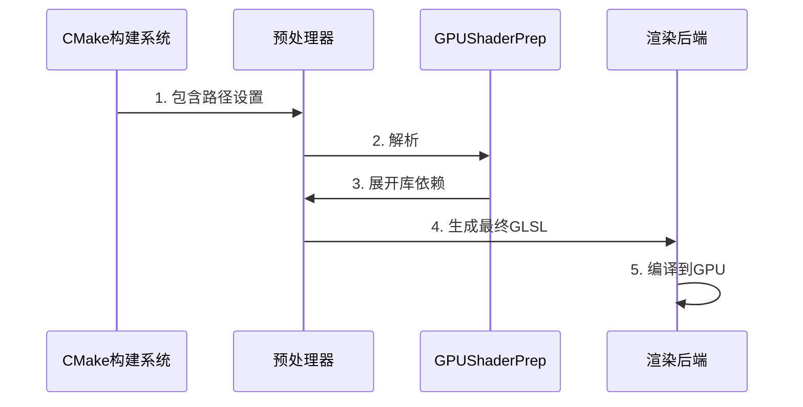
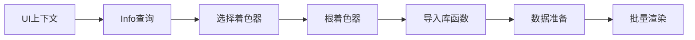
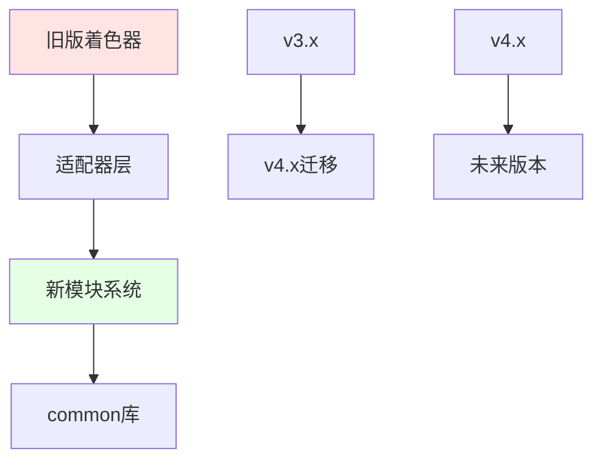
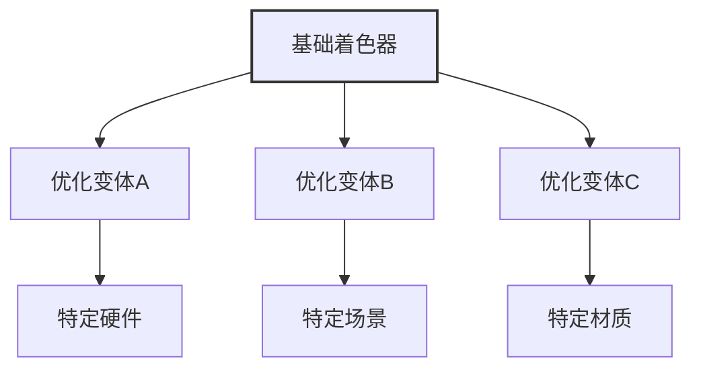

# 005-source_blender_gpu_shaders 总体介绍

**文档编号**: 05
**创建日期**: 2025-12-18
**文档类型**: API Reference
**适用版本**: Blender 4.x

---

## 📋 目录

- [1. 目录结构总览](#1-目录结构总览)
- [2. 子目录详细功能介绍](#2-子目录详细功能介绍)
- [3. 文件命名规范](#3-文件命名规范)
- [4. 关键文件列表和作用](#4-关键文件列表和作用)
- [5. GLSL 文件的分类和用途](#5-gls-文件的分类和用途)
- [6. 与其他组件的关系](#6-与其他组件的关系)

---

## 1. 目录结构总览

### 1.1 整体结构树

```mermaid
graph TD
    A[source/blender/gpu/shaders] --> B[common]
    A --> C[infos]
    A --> D[material]
    A --> E[根目录文件]

    B --> B1[Math库(20+文件)]
    B --> B2[Matrix库(9文件)]
    B --> B3[Vector库(3文件)]
    B --> B4[颜色处理(4文件)]
    B --> B5[数据加载(3文件)]
    B --> B6[光线追踪(2文件)]
    B --> B7[其他工具库(11文件)]

    C --> C1[2D UI着色器信息]
    C --> C2[3D 渲染着色器信息]
    C --> C3[特效着色器信息]
    C --> C4[材质着色器信息]
    C --> C5[工具着色器信息]

    D --> D1[BSDF节点(15+文件)]
    D --> D2[纹理节点(10+文件)]
    D --> D3[向量节点(8文件)]
    D --> D4[颜色节点(8文件)]
    D --> D5[转换节点(6文件)]
    D --> D6[输入节点(6文件)]
    D --> D7[输出节点(4文件)]
    D --> D8[特殊节点(10+文件)]

    E --> E1[2D UI着色器]
    E --> E2[3D 渲染着色器]
    E --> E3[特效/后期着色器]
    E --> E4[C++兼容层]
    E --> E5[MSL着色器]
    E --> E6[计算着色器]
```

### 1.2 文件统计

| 目录/类型 | 文件数量 | 主要用途 |
|-----------|----------|----------|
| `common/` | 46 | 通用工具库和数学函数 |
| `infos/` | 38 | 着色器创建信息描述 |
| `material/` | 92 | 材质节点实现 |
| 根目录 `.glsl` | 70+ | UI/渲染/后期着色器 |
| 根目录 `.hh` | 13 | C++兼容层和头文件 |
| 根目录 `.msl` | 12 | Metal着色语言支持 |
| **总计** | **>270** | **完整的GPU渲染管线** |

---

## 2. 子目录详细功能介绍

### 2.1 `common/` - 通用工具库

**位置**: `E:/blender-git/blender/source/blender/gpu/shaders/common/`

**功能**: 提供跨多个着色器共享的通用函数库，遵循DRY原则。

#### 2.1.1 数学库子分类



**详细文件列表**:

- **基础数学** (`gpu_shader_math_*.glsl`):
  - `gpu_shader_math_base_lib.glsl` - 基础数学运算
  - `gpu_shader_math_constants_lib.glsl` - 数学常量
  - `gpu_shader_math_safe_lib.glsl` - 安全运算（除零防护）
  - `gpu_shader_math_fast_lib.glsl` - 快速近似计算

- **向量运算**:
  - `gpu_shader_math_vector_lib.glsl` - 向量基础运算
  - `gpu_shader_math_vector_compare_lib.glsl` - 向量比较
  - `gpu_shader_math_vector_reduce_lib.glsl` - 向量归约
  - `gpu_shader_math_vector_safe_lib.glsl` - 安全向量运算

- **矩阵运算** (9个文件):
  - `gpu_shader_math_matrix_construct_lib.glsl` - 矩阵构造
  - `gpu_shader_math_matrix_transform_lib.glsl` - 矩阵变换
  - `gpu_shader_math_matrix_projection_lib.glsl` - 投影矩阵
  - `gpu_shader_math_matrix_interpolate_lib.glsl` - 矩阵插值
  - `gpu_shader_math_matrix_lib.glsl` - 通用矩阵运算
  - `gpu_shader_math_matrix_normalize_lib.glsl` - 矩阵归一化
  - `gpu_shader_math_matrix_compare_lib.glsl` - 矩阵比较
  - `gpu_shader_math_matrix_adjoint_lib.glsl` - 伴随矩阵
  - `gpu_shader_math_matrix_conversion_lib.glsl` - 矩阵转换

- **旋转处理**:
  - `gpu_shader_math_rotation_lib.glsl` - 旋转函数
  - `gpu_shader_math_rotation_conversion_lib.glsl` - 旋转转换
  - `gpu_shader_math_euler_lib.glsl` - 欧拉角
  - `gpu_shader_math_quaternion_lib.glsl` - 四元数
  - `gpu_shader_math_axis_angle_lib.glsl` - 轴角
  - `gpu_shader_math_angle_lib.glsl` - 角度处理

#### 2.1.2 颜色和数据处理

| 文件 | 功能描述 |
|------|----------|
| `gpu_shader_common_color_utils.glsl` | 颜色转换工具（RGB↔HSV等） |
| `gpu_shader_common_color_ramp.glsl` | 颜色渐变/色阶处理 |
| `gpu_shader_common_mix_rgb.glsl` | RGB混合操作 |
| `gpu_shader_colorspace_lib.glsl` | 色彩空间转换 |
| `gpu_shader_common_curves.glsl` | 曲线函数（调和曲线等） |

#### 2.1.3 数据加载和索引

- `gpu_shader_attribute_load_lib.glsl` - 顶点属性加载
- `gpu_shader_index_load_lib.glsl` - 索引数据加载
- `gpu_shader_index_range_lib.glsl` - 索引范围处理
- `gpu_shader_offset_indices_lib.glsl` - 偏移索引计算

#### 2.1.4 光线追踪相关

- `gpu_shader_ray_lib.glsl` - 光线投射基础
- `gpu_shader_ray_utils_lib.glsl` - 光线工具函数

#### 2.1.5 其他工具库

| 文件 | 功能 |
|------|------|
| `gpu_shader_bicubic_sampler_lib.glsl` | 双三次采样 |
| `gpu_shader_common_hash.glsl` | 哈希函数 |
| `gpu_shader_sequencer_lib.glsl` | 视频序列器工具 |
| `gpu_shader_shared_exponent_lib.glsl` | 共享指数格式 |
| `gpu_shader_smaa_lib.glsl` | SMAA抗锯齿实现 |
| `gpu_shader_test_lib.glsl` | 测试工具 |
| `gpu_shader_utildefines_lib.glsl` | 通用宏定义 |
| `gpu_shader_debug_gradients_lib.glsl` | 调试渐变 |
| `gpu_shader_fullscreen_lib.glsl` | 全屏渲染 |
| `gpu_shader_print_lib.glsl` | 调试打印 |
| `gpu_shader_test_lib.glsl` | 测试库 |

---

### 2.2 `infos/` - 着色器创建信息

**位置**: `E:/blender-git/blender/source/blender/gpu/shaders/infos/`

**功能**: 提供着色器的元数据和创建信息，用于GPU系统的着色器管理。

#### 2.2.1 核心概念

```cpp
// 典型的 info 文件结构
GPU_SHADER_CREATE_INFO(gpu_shader_name)
  .fragment_source("shader.glsl")
  .vertex_source("shader_vert.glsl")
  .additional_info(gpu_dependency)
  .define("MAX_SAMPLES", "8")
  .do_static_compilation();
```

#### 2.2.2 分类介绍

**UI 2D 着色器信息**:
- `gpu_shader_2D_area_borders_infos.hh` - 区域边框
- `gpu_shader_2D_checker_infos.hh` - 检测器模式
- `gpu_shader_2D_node_socket_infos.hh` - 节点连接器
- `gpu_shader_2D_nodelink_infos.hh` - 节点链接
- `gpu_shader_2D_widget_infos.hh` - UI控件

**3D 渲染着色器信息**:
- `gpu_shader_3D_flat_color_infos.hh` - 纯色渲染
- `gpu_shader_3D_smooth_color_infos.hh` - 平滑颜色
- `gpu_shader_3D_point_infos.hh` - 点云渲染
- `gpu_shader_3D_polyline_infos.hh` - 多段线
- `gpu_shader_3D_image_infos.hh` - 图像渲染
- `gpu_shader_3D_depth_only_infos.hh` - 仅深度渲染
- `gpu_shader_3D_uniform_color_infos.hh` - 统一颜色

**特效和后期处理**:
- `gpu_shader_fullscreen_infos.hh` - 全屏后处理
- `gpu_shader_sequencer_infos.hh` - 视频序列器
- `gpu_shader_test_infos.hh` - 测试着色器
- `gpu_shader_text_infos.hh` - 文字渲染
- `gpu_shader_icon_infos.hh` - 图标渲染
- `gpu_shader_gpencil_stroke_infos.hh` - Grease Pencil笔触
- `gpu_srgb_to_framebuffer_space_infos.hh` - 色彩空间转换

**核心基础设施**:
- `gpu_interface_infos.hh` - 着色器接口定义
- `gpu_clip_planes_infos.hh` - 裁剪平面
- `gpu_index_load_infos.hh` - 索引加载

---

### 2.3 `material/` - 材质节点实现

**位置**: `E:/blender-git/blender/source/blender/gpu/shaders/material/`

**功能**: 实现Cycles/EEVEE材质系统的所有节点，每个文件对应一个节点类型。

#### 2.3.1 节点分类详述

**BSDF 双向散射分布函数 (15+ 文件)**:
| 文件 | 节点名称 | 描述 |
|------|----------|------|
| `gpu_shader_material_principled.glsl` | Principled BSDF | 主要BSDF，支持PBR |
| `gpu_shader_material_glossy.glsl` | Glossy BSDF | 镜面反射 |
| `gpu_shader_material_diffuse.glsl` | Diffuse BSDF | 漫反射 |
| `gpu_shader_material_glass.glsl` | Glass BSDF | 玻璃 |
| `gpu_shader_material_refraction.glsl` | Refraction BSDF | 折射 |
| `gpu_shader_material_emission.glsl` | Emission | 自发光 |
| `gpu_shader_material_translucent.glsl` Translucent BSDF | 次表面散射 |
| `gpu_shader_material_transparent.glsl` | Transparent BSDF | 透明 |
| `gpu_shader_material_ambient_occlusion.glsl` | Ambient Occlusion | 环境光遮蔽 |
| `gpu_shader_material_holdout.glsl` | Holdout | 遮罩 |
| `gpu_shader_material_add_shader.glsl` | Add Shader | 着色器相加 |
| `gpu_shader_material_mix_shader.glsl` | Mix Shader | 着色器混合 |
| `gpu_shader_material_background.glsl` | Background | 背景 |
| `gpu_shader_material_eevee_specular.glsl` | EEVEE Specular | EEVEE专用镜面 |

**纹理节点 (10+ 文件)**:
| 文件 | 节点名称 |
|------|----------|
| `gpu_shader_material_noise.glsl` | Noise Texture |
| `gpu_shader_material_fractal_noise.glsl` | Fractal Noise |
| `gpu_shader_material_fractal_voronoi.glsl` | Voronoi Texture |
| `gpu_shader_material_checker.glsl` | Checker Texture |
| `gpu_shader_material_image.glsl` | Image Texture |
| `gpu_shader_material_gradient.glsl` | Gradient Texture |
| `gpu_shader_material_musgrave.glsl` | Musgrave Texture |
| `gpu_shader_material_terrain.glsl` | Terrain Texture |
| `gpu_shader_material_white_noise.glsl` | White Noise |
| `gpu_shader_material_radial_tiling.glsl` | Radial Tiling |

**向量节点 (8 文件)**:
| 文件 | 节点名称 |
|------|----------|
| `gpu_shader_material_bump.glsl` | Bump |
| `gpu_shader_material_normal.glsl` | Normal |
| `gpu_shader_material_normal_map.glsl` | Normal Map |
| `gpu_shader_material_displacement.glsl` | Displacement |
| `gpu_shader_material_mapping.glsl` | Mapping |
| `gpu_shader_material_vector_transform.glsl` | Vector Transform |
| `gpu_shader_material_vector_curves.glsl` | Vector Curves |
| `gpu_shader_material_vector_math.glsl` | Vector Math |

**颜色节点 (8 文件)**:
| 文件 | 节点名称 |
|------|----------|
| `gpu_shader_material_hue_sat_val.glsl` | Hue Saturation Value |
| `gpu_shader_material_brightness_contrast.glsl` | Brightness Contrast |
| `gpu_shader_material_gamma.glsl` | Gamma |
| `gpu_shader_material_invert.glsl` | Invert |
| `gpu_shader_material_mix_color.glsl` | Mix Color |
| `gpu_shader_material_combine_color.glsl` | Combine Color |
| `gpu_shader_material_separate_color.glsl` | Separate Color |
| `gpu_shader_material_rgb_to_bw.glsl` | RGB to BW |

**转换节点 (6 文件)**:
| 文件 | 节点名称 |
|------|----------|
| `gpu_shader_material_math.glsl` | Math |
| `gpu_shader_material_map_range.glsl` | Map Range |
| `gpu_shader_material_clamp.glsl` | Clamp |
| `gpu_shader_material_combine_xyz.glsl` | Combine XYZ |
| `gpu_shader_material_separate_xyz.glsl` | Separate XYZ |
| `gpu_shader_material_transform.glsl` | Transform |

**输入节点 (6 文件)**:
| 文件 | 节点名称 |
|------|----------|
| `gpu_shader_material_attribute.glsl` | Attribute |
| `gpu_shader_material_geometry.glsl` | Geometry |
| `gpu_shader_material_object_info.glsl` | Object Info |
| `gpu_shader_material_particle_info.glsl` | Particle Info |
| `gpu_shader_material_camera.glsl` | Camera Info |
| `gpu_shader_material_light_path.glsl` | Light Path |

**输出节点 (4 文件)**:
| 文件 | 节点名称 |
|------|----------|
| `gpu_shader_material_output_material.glsl` | Material Output |
| `gpu_shader_material_output_world.glsl` | World Output |
| `gpu_shader_material_output_aov.glsl` | AOV Output |
| `gpu_shader_material_ray_portal.glsl` | Ray Portal |

**特殊/高级节点 (10+ 文件)**:
- `gpu_shader_material_bevel.glsl` - 体积倒角
- `gpu_shader_material_blackbody.glsl` - 黑体辐射
- `gpu_shader_material_fresnel.glsl` - 菲涅尔
- `gpu_shader_material_layer_weight.glsl` - 层权重
- `gpu_shader_material_light_falloff.glsl` - 光衰减
- `gpu_shader_material_tangent.glsl` - 切线
- `gpu_shader_material_wireframe.glsl` - 线框
- `gpu_shader_material_particle_info.glsl` - 粒子信息
- `gpu_shader_material_point_info.glsl` - 点信息
- `gpu_shader_material_hair.glsl` - 毛发
- `gpu_shader_material_hair_info.glsl` - 毛发信息

---

### 2.4 根目录其他关键文件

#### 2.4.1 UI/界面着色器 (2D)

| 文件 | 功能 |
|------|------|
| `gpu_shader_2D_widget_base_*.glsl` | UI控件基础 |
| `gpu_shader_2D_widget_shadow_*.glsl` | UI阴影 |
| `gpu_shader_2D_node_socket_*.glsl` | 节点编辑器连接器 |
| `gpu_shader_2D_nodelink_*.glsl` | 节点链接线 |
| `gpu_shader_2D_area_borders_*.glsl` | 区域边框 |
| `gpu_shader_2D_line_dashed_frag.glsl` | 虚线 |
| `gpu_shader_icon_*.glsl` | 图标渲染 |
| `gpu_shader_text_*.glsl` | 文字渲染 |

#### 2.4.2 3D 渲染着色器

| 文件 | 功能 |
|------|------|
| `gpu_shader_3D_vert.glsl` | 通用3D顶点着色器 |
| `gpu_shader_3D_flat_color_*.glsl` | 纯色渲染 |
| `gpu_shader_3D_smooth_color_*.glsl` | 平滑颜色 |
| `gpu_shader_3D_normal_vert.glsl` | 法线渲染 |
| `gpu_shader_3D_image_vert.glsl` | 图像渲染 |
| `gpu_shader_3D_polyline_*.glsl` | 多段线 |
| `gpu_shader_3D_point_*.glsl` | 点渲染 |
| `gpu_shader_3D_clipped_uniform_color_vert.glsl` | 裁剪渲染 |

#### 2.4.3 特效和后期处理

| 文件 | 功能 |
|------|------|
| `gpu_shader_depth_only_frag.glsl` | 仅深度 |
| `gpu_shader_checker_frag.glsl` | 棋盘格 |
| `gpu_shader_diag_stripes_frag.glsl` | 对角条纹 |
| `gpu_shader_display_fallback_*.glsl` | 显示回退 |
| `gpu_shader_uniform_color_frag.glsl` | 统一颜色 |

#### 2.4.4 视频序列器

| 文件 | 功能 |
|------|------|
| `gpu_shader_sequencer_strips_*.glsl` | 序列条 |
| `gpu_shader_sequencer_thumbs_*.glsl` | 缩略图 |
| `gpu_shader_sequencer_scope_comp.glsl` | 示波器 |
| `gpu_shader_sequencer_zebra_frag.glsl` | 斑马纹 |

#### 2.4.5 Grease Pencil

| 文件 | 功能 |
|------|------|
| `gpu_shader_gpencil_stroke_*.glsl` | 笔触渲染 |

---

## 3. 文件命名规范

### 3.1 命名模式分析

#### 3.1.1 基础命名规则

```regex
# 通用模式
gpu_shader_{功能}_{后缀}.{扩展名}

# 示例:
gpu_shader_2D_widget_base_vert.glsl
└─┬─┴──────┬───────┴──┬─────┴─┬─
  │        │          │       └── 扩展名: glsl/hh/msl
  │        │          └───────── 类型: vert/frag/comp/lib
  │        └─────────────────── 功能描述
  └─────────────────────────── 模块前缀
```

#### 3.1.2 前缀规范

| 前缀 | 含义 | 使用场景 |
|------|------|----------|
| `gpu_shader_` | GPU着色器 | 基础着色器文件 |
| `gpu_shader_math_` | 数学库 | 数学运算库 |
| `gpu_shader_common_` | 通用库 | 跨模块通用功能 |
| `gpu_shader_cxx_` | C++兼容 | C++接口定义 |

#### 3.1.3 后缀类型

| 后缀 | 类型 | 说明 |
|------|------|------|
| `_vert.glsl` | 顶点着色器 | 处理顶点数据和变换 |
| `_frag.glsl` | 片段着色器 | 处理像素颜色和光照 |
| `_comp.glsl` | 计算着色器 | 通用GPU计算 |
| `_lib.glsl` | 库文件 | 可包含的函数库 |
| `.hh` | C++头文件 | C++接口定义 |
| `.msl` | Metal着色器 | Metal后端支持 |

#### 3.1.4 材质节点命名

```regex
gpu_shader_material_{节点名称}.glsl

# 转换为节点名称的规则:
principled      → Principled BSDF
hue_sat_val     → Hue Saturation Value
combine_xyz     → Combine XYZ
normal_map      → Normal Map
```

#### 3.1.5 Info文件命名

```regex
gpu_shader_{功能}_infos.hh

# 示例:
gpu_shader_2D_widget_infos.hh
gpu_shader_3D_point_infos.hh
gpu_shader_sequencer_infos.hh
```

### 3.2 命名约定规则

#### 3.2.1 使用下划线分隔

**正确**: `gpu_shader_common_math_utils.glsl`
**错误**: `gpuShaderCommonMathUtils.glsl`

#### 3.2.2 功能描述简洁明确

| 适用 | 不适用 |
|------|--------|
| `bicubic_sampler` | `bilinear_interpolation_sampler_with_cubic` |
| `smaa` | `subpixel_morphological_antialiasing` |

#### 3.2.3 模块层级标识

**N库**: `_math_`/`_vector_`/`_matrix_`
**UI组件**: `_2D_`/`_widget_`/`_nodelink_`
**材质节点**: `_material_`

---

## 4. 关键文件列表和作用

### 4.1 核心基础库

#### 4.1.1 通用数学工具

**文件**: `common/gpu_shader_math_base_lib.glsl`
**重要性**: ★★★★★
**作用**: 提供所有数学运算的基础，包括：
- 安全除法 `safe_divide()`
- 兼容的幂运算 `compatible_pow()`
- 模运算 `compatible_mod()`
- 包装函数 `wrap()`

**代码示例**:
```glsl
float safe_divide(float a, float b) {
  return (b != 0.0f) ? a / b : 0.0f;
}

float compatible_pow(float a, float b) {
  // 处理负数幂的边界情况
  return pow(max(a, 0.0f), b);
}
```

#### 4.1.2 矩阵变换库

**文件**: `common/gpu_shader_math_matrix_transform_lib.glsl`
**重要性**: ★★★★★
**作用**: 提供3D变换的核心矩阵操作:
- 旋转矩阵生成
- 平移变换
- 缩放变换
- 视图矩阵构建

#### 4.1.3 颜色管理

**文件**: `common/gpu_shader_common_color_utils.glsl`
**重要性**: ★★★★☆
**作用**: 颜色空间转换和处理:
- RGB ↔ HSV 转换
- 伽马校正
- 色度处理
- 去饱和度

#### 4.1.4 C++ 兼容层

**文件**: `gpu_shader_cxx_global.hh`
**重要性**: ★★★★★
**作用**: 提供C++接口的GLSL等价定义:
```cpp
namespace gl_VertexShader {
  extern const int gl_VertexID;
  extern const int gl_InstanceID;
  float4 gl_Position = float4(0);
}

namespace gl_FragmentShader {
  extern const float4 gl_FragCoord;
  const bool gl_FrontFacing = true;
}
```

### 4.2 跨平台支持

#### 4.2.1 Metal 支持

**文件列表**:
- `gpu_shader_msl_types.msl` - 类型定义
- `gpu_shader_msl_matrix.msl` - 矩阵运算
- `gpu_shader_msl_sampler.msl` - 采样器
- `gpu_shader_msl_wrapper.msl` - 封装层

**重要性**: ★★★★☆
**作用**: 确保在Metal后端（macOS/iOS）上正确运行。

#### 4.2.2 向后兼容

**文件**: `gpu_shader_compat_glsl.glsl`
**作用**: 提供旧版API兼容层
```glsl
#define vec2 float2
#define vec3 float3
#define vec4 float4
#define mat4 float4x4
```

### 4.3 高级功能库

#### 4.3.1 光线追踪工具

**文件**: `common/gpu_shader_ray_lib.glsl`
**重要性**: ★★★☆☆
**作用**: 简化光线计算:
- `ray_point()` - 生成点
- `ray_direction()` - 计算方向
- `ray_intersect()` - 相交测试

#### 4.3.2 采样优化

**文件**: `common/gpu_shader_bicubic_sampler_lib.glsl`
**重要性**: ★★★☆☆
**作用**: 提高质量的纹理采样:
- Mitchell-Netravali 滤波
- Catmull-Rom 滤波
- Lanczos 滤波

#### 4.3.3 抗锯齿 (SMAA)

**文件**: `common/gpu_shader_smaa_lib.glsl`
**重要性**: ★★★★☆
**作用**: 子像素形态抗锯齿实现:
- 边缘检测
- 图案混合
- 高质量平滑

### 4.4 材质核心

#### 4.4.1 Principled BSDF

**文件**: `material/gpu_shader_material_principled.glsl`
**重要性**: ★★★★★
**作用**: Blender的主要PBR材质:
- 支持金属/非金属工作流
- 次表面散射
- 清漆层
- 各向异性反射
- Sheen 细节

#### 4.4.2 噪声纹理

**文件**: `material/gpu_shader_material_fractal_noise.glsl`
**重要性**: ★★★★☆
**作用**: 程序化纹理生成:
- Perlin 噪声
- 分形布朗运动 (FBM)
- 多重八度

#### 4.4.3 法线映射

**文件**: `material/gpu_shader_material_normal_map.glsl`
**重要性**: ★★★★☆
**作用**: 法线贴图处理:
- 切线空间变换
- 强度控制
- 通道选择

---

## 5. GLSL 文件的分类和用途

### 5.1 功能分类体系



### 5.2 详细分类表

#### 5.2.1 基础工具库 (`common/`)

| 子类 | 文件数 | 用途 | 源代码示例 |
|------|--------|------|------------|
| **数学基础** | 5 | `safe_divide`, `compatible_pow` | 基础运算安全化 |
| **向量运算** | 4 | `vector_length`, `dot`, `cross` | 几何计算 |
| **矩阵运算** | 9 | `mat4_transform`, `mat4_projection` | 3D变换 |
| **角度/旋转** | 6 | `quat_from_euler`, `rotation_matrix` | 姿态转换 |
| **颜色处理** | 4 | `rgb_to_hsv`, `gamma_correct` | 色彩管理 |
| **数据结构** | 3 | `attribute_load`, `index_range` | GPU数据访问 |
| **通用算法** | 11 | `hash`, `smaa`, `bicubic` | 算法实现 |

#### 5.2.2 UI/界面渲染 (根目录)

| 模块 | 前缀 | 文件数 | 渲染内容 |
|------|------|--------|----------|
| 2D控件 | `gpu_shader_2D_widget` | 4 | 按钮、滑块、面板 |
| 节点连接 | `gpu_shader_2D_node_socket` | 2 | 节点编辑器UI |
| 基础2D | `gpu_shader_2D_` | 5 | 几何图元 |
| 文字 | `gpu_shader_text` | 2 | 文本渲染 |
| 图标 | `gpu_shader_icon` | 3 | UI图标 |

#### 5.2.3 3D 渲染 (根目录)

| 类型 | 文件数 | 特性 |
|------|--------|------|
| 通用型 | 2 | `gpu_shader_3D_vert.glsl` |
| 纯色渲染 | 2 | `flat_color`, `smooth_color` |
| 点渲染 | 3 | `point_uniform_size`, `point_varying` |
| 线段渲染 | 2 | `polyline`, `line_dashed` |
| 图像渲染 | 1 | `gpu_shader_3D_image_vert.glsl` |
| 深度渲染 | 1 | `depth_only_frag.glsl` |

#### 5.2.4 材质节点 (`material/`)

| 节点大类 | 子类 | 常用节点 |
|----------|------|----------|
| **BSDF** (15) | 镜面 | Principled, Glossy, Specular |
| | 散射 | Diffuse, Translucent, Subsurface |
| | 透射 | Glass, Refraction, Transparent |
| | 特殊 | Emission, Holdout, AO, Background |
| **纹理** (10) | 噪声 | Noise, Fractal, Voronoi, Musgrave |
| | 几何 | Checker, Gradient, Brick |
| | 图像 | Image, Environment |
| **向量** (8) | 法线 | Normal, Normal Map, Bump |
| | 变换 | Mapping, Displacement, Transform |
| **颜色** (8) | 调整 | Hue/Sat/Val, Bright/Contrast |
| | 混合 | Mix Color, Invert, Gamma |
| | 转换 | RGB to BW, Separate/Combine |
| **输入** (6) | 属性 | Attribute, Geometry, Object Info |
| | 环境 | Camera, Light Path, Particle Info |
| **输出** (4) | 渲染 | Material Output, World Output |
| | 通道 | AOV Output, Ray Portal |
| **计算** (8) | 数学 | Math, Map Range, Clamp |
| | 向量 | Vector Math, Combine XYZ |
| | 转换 | Transform, Vector Transform |

#### 5.2.5 后期处理 (根目录)

| 文件 | 处理类型 | 效果 |
|------|----------|------|
| `image_*.glsl` | 图像操作 | 去色、混合、上屏 |
| `sequecer_*.glsl` | 视频编辑 | 条、缩略图、示波器 |
| `diag_stripes.glsl` | 测试模式 | 对角条纹 |
| `checker.glsl` | 测试模式 | 棋盘格 |

#### 5.2.6 计算着色器 (根目录)

| 文件 | 计算任务 |
|------|----------|
| `gpushader_sequencer_scope_comp.glsl` | 示波器数据计算 |
| `gpu_shader_index_2d_array_*.glsl` | 索引生成（注释状态） |
| `gpu_shader_python_comp.glsl` | Python绑定相关 |

#### 5.2.7 跨平台支持

| 平台 | 扩展名 | 文件数 | 功能 |
|------|--------|--------|------|
| Metal | `.msl` | 12 | Metal着色语言绑定 |
| C++ | `.hh` | 13 | C++类型定义和接口 |
| GLSL | `.glsl` | 200+ | 原生GLSL实现 |

### 5.3 代码结构模式

#### 5.3.1 库文件模式 (`.lib.glsl`)

```glsl
/* SPDX-FileCopyrightText: 2023 Blender Authors
 * SPDX-License-Identifier: GPL-2.0-or-later */

#pragma once  // 防止重复包含

#include "gpu_shader_compat.hh"  // 基础类型定义
#include "gpu_shader_common_math.glsl"  // 依赖的库

// 函数声明
float3 function_name(float3 param);

// 实现
float3 function_name(float3 param) {
  return normalize(param) * 2.0;
}
```

#### 5.3.2 顶点着色器模式 (`_vert.glsl`)

```glsl
/* 顶点着色器模板 */
#pragma once

#include "gpu_shader_common_math.glsl"
#include "GPU_shader_shared.hh"  // 共享数据结构

// Uniform 变量
uniform mat4 ModelViewMatrix;

// 输入
in vec3 pos;
in vec3 normal;

// 输出
out vec3 v_normal;

void main() {
  v_normal = normalize(normal);
  gl_Position = ModelViewMatrix * vec4(pos, 1.0);
}
```

#### 5.3.3 片段着色器模式 (`_frag.glsl`)

```glsl
/* 片段着色器模板 */
#pragma once

#include "gpu_shader_common_math.glsl"

// 输入
in vec3 v_normal;
in vec2 v_uv;

// 输出
out vec4 fragColor;

void main() {
  fragColor = vec4(v_normal * 0.5 + 0.5, 1.0);
}
```

#### 5.3.4 Info 文件模式 (`_infos.hh`)

```cpp
#ifdef GPU_SHADER
#  pragma once
#  include "gpu_shader_compat.hh"
#  include "GPU_shader_shared.hh"
#endif

#include "gpu_shader_create_info.hh"

GPU_SHADER_CREATE_INFO(gpu_name)
  .vertex_source("gpu_shader_name_vert.glsl")
  .fragment_source("gpu_shader_name_frag.glsl")
  .additional_info(gpu_dependency)
  .define("MAX_SAMPLES", "8")
  .do_static_compilation()
GPU_SHADER_CREATE_END()
```

#### 5.3.5 材质节点模式

```glsl
#pragma once

#include "gpu_shader_common_math.glsl"
#include "gpu_shader_math_vector_safe_lib.glsl"

// 节点输入
void node_bsdf_principled(float4 base_color,
                          float metallic,
                          float roughness,
                          // ... 其他输入
                          out float4 result) {
  // 节点实现
  float3 N = normalize(normal);
  float3 V = normalize(cam_pos - position);

  // 简化的BRDF
  float NdotV = max(dot(N, V), 0.0);
  float3 F0 = mix(vec3(0.04), base_color.rgb, metallic);

  result = vec4(F0 * NdotV, 1.0);
}
```

---

## 6. 与其他组件的关系

### 6.1 系统架构图



### 6.2 模块依赖关系

#### 6.2.1 编译构建流程



**关键依赖检查**:
```cmake
# from CMakeLists.txt
set(INC_GLSL
  .                  # 当前目录
  ..                 # gpu/
  ../intern          # gpu/intern
  ../../blenlib      # 通用工具库
  common             # 共享库
  infos              # 信息头文件
)
```

#### 6.2.2 运行时流程

1. **着色器管理器初始化**
   - 扫描 `infos/` 目录
   - 解析 `GPU_SHADER_CREATE_INFO` 宏
   - 构建着色器描述符

2. **着色器生成**
   ```cpp
   // pseudeo code
   GPUShader *shader = GPU_shader_create_from_info(
     gpu_shader_3D_smooth_color_infos
   );
   ```

3. **依赖注入**
   - 识别 `.lib.glsl` 依赖
   - 自动包含到预处理阶段
   - 处理宏定义和条件编译

4. **缓存和编译**
   - 生成键值用于缓存
   - 编译链接到GPU程序
   - 管理Uniform/Attribute绑定

### 6.3 数据流

#### 6.3.1 材质节点数据流


#### 6.3.2 UI渲染数据流



### 6.4 接口规范

#### 6.4.1 共享头文件 `GPU_shader_shared.hh`

```cpp
// GPU共享数据结构定义
struct GPUShaderCommon {
  mat4 ModelViewMatrix;
  mat4 ProjectionMatrix;
  vec3 CameraPosition;
};

// 绑定到所有着色器的Uniform Block
layout(std140, binding = 0) uniform ShaderGlobals {
  GPUShaderCommon globals;
};
```

#### 6.4.2 Info文件接口

每个Info文件定义:
- **顶点输入**: `in vec3 pos;`, `in vec3 normal;`
- **片段输出**: `out vec4 fragColor;`
- **Uniforms**: 如 `uniform sampler2D tex;`
- **依赖**: 通过 `.additional_info()`
- **定义**: `.define("NAME", "value")`

#### 6.4.3 材质节点接口

所有材质节点遵循:
```glsl
// 输入参数
void node_**node_name**(
  float input1,
  float3 input2,
  // ...
  out float4 result
) {
  // 实现
}
```

这允许系统:
1. 自动映射Cycles/EEVEE节点到GLSL函数
2. 生成统一的调用接口
3. 优化函数内联

### 6.5 兼容性和扩展

#### 6.5.1 向后兼容策略



**具体措施**:
- `gpu_shader_compat*.hh` 提供旧别名
- 平滑过渡到命名空间系统
- 保留关键宏定义

#### 6.5.2 前向兼容设计

1. **模块化架构**: 解耦设计允许独立扩展
2. **版本控制**: 信息头文件包含版本宏
3. **多API支持**: GL/Metal/Vulkan通过统一接口

### 6.6 性能优化关系

#### 6.6.1 着色器变体



**变体生成基础**:
- `Infos`中的预处理宏
- 编译时判断GPU能力
- 运行时选择最优路径

#### 6.6.2 库函数优化

**库文件的分层利用**:
1. **顶层**: 具体着色器调用
2. **中层**: 节点实现调用通用函数
3. **底层**: 数学/工具库被所有层级调用

**优化策略**:
- 内联简单函数
- 共享复杂计算
- 消除重复代码

---

## 📊 总结

### 核心价值

`source/blender/gpu/shaders` 是 Blender GPU 渲染管线的**核心大脑**，它:

1. **完整覆盖**: 从UI到3D渲染，从材质到后期处理
2. **高度模块化**: 超过270个文件，严格的目录规范
3. **跨平台**: 同时支持OpenGL/Metal/Vulkan
4. **双模式**: 支持Cycles物理渲染和EEVEE实时渲染
5. **扩展性强**: 清晰的接口设计便于新增功能

### 开发要点

**使用时必须注意**:
- 遵循严格的命名规范
- 正确处理include依赖关系
- 理解Info文件机制
- 注意跨平台差异
- 优化变体管理

**最佳实践**:
1. 新功能优先使用 `common/` 库
2. 通过 `infos/` 注册新着色器
3. 材质节点统一在 `material/` 实现
4. UI功能放入根目录
5. 考虑多后端支持

### 后续开发建议

1. **清理**: 移除EEVEE Legacy相关代码
2. **标准化**: 统一命名和接口
3. **优化**: 减少重复文件
4. **文档**: 补充函数级别注释
5. **测试**: 完善变体测试

---

**文档版本**: v1.0
**最后更新**: 2025-12-18
**维护者**: Blender GPU团队
