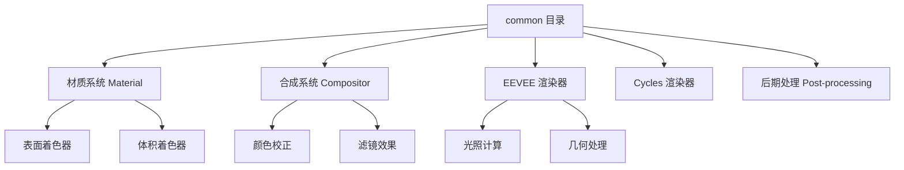
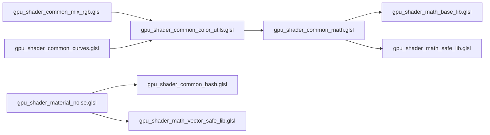

# 007-source_blender_gpu_shaders_common 总体介绍

**文档编号**: 007
**文件路径**: `.vscode/shader-glsl-MiMo/007-source_blender_gpu_shaders_common总体介绍.md`
**最后更新**: 2025-12-18

---

## 目录
- [1. 概述](#1-概述)
- [2. 目录结构与文件分类](#2-目录结构与文件分类)
- [3. 核心数学库文件分析](#3-核心数学库文件分析)
- [4. 核心颜色处理库文件分析](#4-核心颜色处理库文件分析)
- [5. 辅助功能库文件分析](#5-辅助功能库文件分析)
- [6. 使用示例与集成方法](#6-使用示例与集成方法)
- [7. 典型应用场景](#7-典型应用场景)

---

## 1. 概述

`source/blender/gpu/shaders/common/` 目录是 Blender GPU 着色器系统的核心公共库，提供了可重用的 GLSL 函数和工具。这些库文件为 Blender 的渲染、合成、材质和后期处理系统提供基础数学、颜色处理、几何运算和噪声生成等核心功能。

### 1.1 核心特性

- **模块化设计**: 每个库文件专注于特定功能领域
- **高性能优化**: 针对 GPU 硬件进行优化的数学运算
- **跨平台兼容**: 适配不同 GPU 后端（CUDA, HIP, Metal, OpenGL）
- **类型安全**: 使用 GLSL 函数重载和模板机制
- **错误处理**: 包含边界检查和安全运算函数

### 1.2 主要应用模块



---

## 2. 目录结构与文件分类

### 2.1 文件分类概览

```
source/blender/gpu/shaders/common/
├── 数学运算类
│   ├── gpu_shader_common_math.glsl          # 数学运算主库
│   ├── gpu_shader_common_math_utils.glsl    # 数学工具函数
│   ├── gpu_shader_math_base_lib.glsl        # 基础数学函数
│   ├── gpu_shader_math_safe_lib.glsl        # 安全数学运算
│   ├── gpu_shader_math_vector_lib.glsl      # 向量运算
│   ├── gpu_shader_math_matrix_lib.glsl      # 矩阵运算
│   └── gpu_shader_math_rotation_lib.glsl    # 旋转相关
│
├── 颜色处理类
│   ├── gpu_shader_common_color_utils.glsl   # 颜色转换与处理
│   ├── gpu_shader_common_mix_rgb.glsl       # 颜色混合模式
│   ├── gpu_shader_common_color_ramp.glsl    # 颜色渐变处理
│   └── gpu_shader_common_curves.glsl        # 曲线映射
│
├── 数据结构类
│   ├── gpu_shader_common_hash.glsl          # 哈希函数
│   ├── gpu_shader_index_load_lib.glsl       # 索引加载
│   └── gpu_shader_attribute_load_lib.glsl   # 属性加载
│
├── 采样与插值类
│   ├── gpu_shader_bicubic_sampler_lib.glsl  # 双三次采样
│   └── gpu_shader_fullscreen_lib.glsl       # 全屏处理
│
└── 工具类
    ├── gpu_shader_utildefines_lib.glsl      # 宏定义
    ├── gpu_shader_print_lib.glsl            # 调试输出
    └── gpu_shader_test_lib.glsl             # 测试工具
```

### 2.2 依赖关系图



---

## 3. 核心数学库文件分析

### 3.1 gpu_shader_common_math.glsl

**文件路径**: `source/blender/gpu/shaders/common/gpu_shader_common_math.glsl`

**主要功能**: 提供 Blender 节点系统的数学运算函数，与 Blender 的数学节点完全对应。

#### 3.1.1 函数结构与设计模式

所有数学函数遵循统一的设计模式：
```glsl
void math_<operation>(float a, float b, float c, out float result)
```

**参数说明**:
- `a`, `b`, `c`: 输入参数（根据运算类型使用不同数量）
- `result`: 输出结果
- 三参数设计兼容 Blender 节点系统

#### 3.1.2 核心函数分类

**基本运算**:
```glsl
void math_add(float a, float b, float c, out float result)        // result = a + b
void math_subtract(float a, float b, float c, out float result)   // result = a - b
void math_multiply(float a, float b, float c, out float result)   // result = a * b
void math_divide(float a, float b, float c, out float result)     // result = safe_divide(a, b)
```

**指数与对数**:
```glsl
void math_power(float a, float b, float c, out float result)      // 处理负数底数
void math_logarithm(float a, float b, float c, out float result)  // log2(a) / log2(b)
void math_sqrt(float a, float b, float c, out float result)       // 安全平方根
void math_inversesqrt(float a, float b, float c, out float result)
```

**三角函数**:
```glsl
void math_sine(float a, float b, float c, out float result)       // sin(a)
void math_cosine(float a, float b, float c, out float result)     // cos(a)
void math_tangent(float a, float b, float c, out float result)    // tan(a)
void math_arctan2(float a, float b, float c, out float result)    // 处理 atan(0,0)
```

**高级数学**:
```glsl
// 平滑最小/最大 (SDF 运算)
void math_smoothmin(float a, float b, float c, out float result)  // 连续最小值
void math_smoothmax(float a, float b, float c, out float result)  // 连续最大值

// 包装与折叠
void math_wrap(float a, float b, float c, out float result)       // 包围区间
void math_pingpong(float a, float b, float c, out float result)   // 往返运动
void math_snap(float a, float b, float c, out float result)       // 对齐到网格

// 比较运算
void math_compare(float a, float b, float c, out float result)    // 带容差比较
```

#### 3.1.3 示例：使用数学函数

```glsl
// 在自定义着色器中使用
#version 450
#include "gpu_shader_common_math.glsl"

void main() {
    float a = 2.0;
    float b = 3.0;
    float result;

    // 调用数学函数
    math_power(a, b, 0.0, result);  // result = 8.0

    // 平滑混合
    float mix_val;
    math_smoothmin(a, b, 1.0, mix_val);
}
```

---

### 3.2 gpu_shader_common_math_utils.glsl

**文件路径**: `source/blender/gpu/shaders/common/gpu_shader_common_math_utils.glsl`

**主要功能**: 提供几何运算和向量处理的工具函数。

#### 3.2.1 核心函数

```glsl
// 坐标系反转 (Z轴)
void invert_z(float3 v, out float3 outv)
{
    v.z = -v.z;
    outv = v;
}

// 安全向量归一化 (处理零向量)
void vector_normalize(float3 normal, out float3 outnormal)
{
    float length_sqr = dot(normal, normal);
    outnormal = (length_sqr > 1e-35f) ? normal * inversesqrt(length_sqr) : float3(0.0f);
}

// 向量复制
void vector_copy(float3 normal, out float3 outnormal)
{
    outnormal = normal;
}
```

#### 3.2.2 使用场景

- **坐标空间转换**: 在不同空间之间转换坐标
- **法线处理**: 安全处理可能为零的法线向量
- **几何计算**: 辅助几何着色器中的向量运算

---

### 3.3 gpu_shader_math_base_lib.glsl

**文件路径**: `source/blender/gpu/shaders/common/gpu_shader_math_base_lib.glsl`

**主要功能**: 高性能幂运算优化和基础数学增强。

#### 3.3.1 快速幂函数库

替代标准 `pow()`，针对整数幂优化：

```glsl
float pow2f(float x)  { return x * x; }                    // x^2
float pow3f(float x)  { return x * x * x; }                // x^3
float pow4f(float x)  { return pow2f(pow2f(x)); }          // x^4
float pow5f(float x)  { return pow4f(x) * x; }             // x^5
float pow6f(float x)  { return pow2f(pow3f(x)); }          // x^6
float pow7f(float x)  { return pow6f(x) * x; }             // x^7
float pow8f(float x)  { return pow2f(pow4f(x)); }          // x^8
```

**性能对比**:
- GPU 中 `pow()` 函数通常需要多个时钟周期
- 直接乘法比幂运算快 2-3 倍
- 整数幂优化是高频运算的关键性能提升

#### 3.3.2 其他实用函数

```glsl
// 平方 (通用重载)
float square(float v)   { return v * v; }
float2 square(float2 v) { return v * v; }
float3 square(float3 v) { return v * v; }
float4 square(float4 v) { return v * v; }

// 毕达哥拉斯定理
float hypot(float x, float y) { return sqrt(x * x + y * y); }

// 三角函数转换
float sin_from_cos(float c) { return sqrt(max(0.0f, 1.0f - square(c))); }
float cos_from_sin(float s) { return sqrt(max(0.0f, 1.0f - square(s))); }
```

---

### 3.4 gpu_shader_math_safe_lib.glsl

**文件路径**: `source/blender/gpu/shaders/common/gpu_shader_math_safe_lib.glsl`

**主要功能**: 除零保护、边界检查等安全运算函数。

#### 3.4.1 安全函数库

```glsl
// 安全取模 (防止除零)
float safe_mod(float a, float b) {
    return (b != 0.0f) ? mod(a, b) : 0.0f;
}

// 安全除法 (防止除零，返回0)
float safe_divide(float a, float b) {
    return (b != 0.0f) ? (a / b) : 0.0f;
}

// 安全倒数
float safe_rcp(float a) {
    return (a != 0.0f) ? (1.0f / a) : 0.0f;
}

// 安全平方根 (处理负数)
float safe_sqrt(float a) {
    return sqrt(max(0.0f, a));
}

// 安全反余弦 (处理越界)
float safe_acos(float a) {
    if (a <= -1.0f) return M_PI;
    if (a >= 1.0f) return 0.0f;
    return acos(a);
}
```

#### 3.4.2 兼容性函数

```glsl
// 兼容 C++ std::pow 的幂函数
float compatible_pow(float x, float y) {
    if (y == 0.0f) return 1.0f;           // x^0 = 1
    if (x < 0.0f) {                       // 负底数处理
        return (mod(-y, 2.0f) == 0.0f) ? pow(-x, y) : -pow(-x, y);
    }
    if (x == 0.0f) return 0.0f;
    return pow(x, y);
}

// 类似 std::modf 的取模
float compatible_mod(float a, float b) {
    if (b != 0.0f) {
        int N = int(a / b);
        return a - N * b;
    }
    return 0.0f;
}

// 包围区间
float wrap(float a, float b, float c) {
    float range = b - c;
    float s = (a != b) ? floor((a - c) / range) : 1.0f;
    return (range != 0.0f) ? a - range * s : c;
}
```

---

## 4. 核心颜色处理库文件分析

### 4.1 gpu_shader_common_color_utils.glsl

**文件路径**: `source/blender/gpu/shaders/common/gpu_shader_common_color_utils.glsl`

**主要功能**: 颜色空间转换、色彩模型转换和 Alpha 处理。

#### 4.1.1 色彩模型转换

**RGB ↔ HSV**:
```glsl
void rgb_to_hsv(float4 rgb, out float4 outcol)
// 输入: RGB [0,1], 输出: HSV (H[0,1], S[0,1], V[0,1])

void hsv_to_rgb(float4 hsv, out float4 outcol)
// 逆转换，支持色相循环
```

**RGB ↔ HSL**:
```glsl
void rgb_to_hsl(float4 rgb, out float4 outcol)
void hsl_to_rgb(float4 hsl, out float4 outcol)
```

#### 4.1.2 视频颜色空间转换

**YCCA (YUV 类)**:
```glsl
void ycca_to_rgba_itu_601(float4 ycca, out float4 color)   // 标清电视
void ycca_to_rgba_itu_709(float4 ycca, out float4 color)   // 高清电视
void ycca_to_rgba_jpeg(float4 ycca, out float4 color)      // JPEG 标准

void rgba_to_ycca_itu_601(float4 rgba, out float4 ycca)
void rgba_to_ycca_itu_709(float4 rgba, out float4 ycca)
void rgba_to_ycca_jpeg(float4 rgba, out float4 ycca)
```

**YUVA**:
```glsl
void yuva_to_rgba_itu_709(float4 yuva, out float4 color)
void rgba_to_yuva_itu_709(float4 rgba, out float4 yuva)
```

#### 4.1.3 Alpha 通道处理

```glsl
// 清除 Alpha (设为 1.0)
void color_alpha_clear(float4 color, out float4 result)

// 预乘 Alpha
void color_alpha_premultiply(float4 color, out float4 result)
// result = float4(color.rgb * color.a, color.a)

// 解除预乘
void color_alpha_unpremultiply(float4 color, out float4 result)
// result = float4(color.rgb / color.a, color.a)
```

#### 4.1.4 线性/SDR 伽马转换

```glsl
// Linear RGB to sRGB
float linear_rgb_to_srgb(float color) {
    return (color < 0.0031308f)
        ? color * 12.92f
        : 1.055f * pow(color, 1.0f / 2.4f) - 0.055f;
}

// sRGB to Linear RGB
float srgb_to_linear_rgb(float color) {
    return (color < 0.04045f)
        ? color * (1.0f / 12.92f)
        : pow((color + 0.055f) * (1.0f / 1.055f), 2.4f);
}
```

#### 4.1.5 亮度计算

```glsl
float get_luminance(float3 color, float3 luminance_coefficients)
// 使用 BT.709 系数: [0.2126, 0.7152, 0.0722]
```

---

### 4.2 gpu_shader_common_mix_rgb.glsl

**文件路径**: `source/blender/gpu/shaders/common/gpu_shader_common_mix_rgb.glsl`

**主要功能**: 实现 Photoshop 风格的 26 种颜色混合模式。

#### 4.2.1 混合模式分类

**基础混合**:
```glsl
void mix_blend(float fac, float4 col1, float4 col2, out float4 outcol)
    // outcol = mix(col1, col2, fac)

void mix_add(float fac, float4 col1, float4 col2, out float4 outcol)
    // outcol = mix(col1, col1 + col2, fac)

void mix_mult(float fac, float4 col1, float4 col2, out float4 outcol)
    // outcol = mix(col1, col1 * col2, fac)
```

**对比度增强**:
```glsl
void mix_screen(float fac, float4 col1, float4 col2, out float4 outcol)
    // 屏幕混合: 1 - (1 - col1) * (1 - col2)

void mix_overlay(float fac, float4 col1, float4 col2, out float4 outcol)
    // 叠加: 根据底层亮度选择正片叠底或滤色

void mix_soft_light(float fac, float4 col1, float4 col2, out float4 outcol)
    // 柔光: 模糊高对比度
```

**色调操作**:
```glsl
void mix_hue(float fac, float4 col1, float4 col2, out float4 outcol)
    // 保留底层明度和饱和度，应用新色相

void mix_sat(float fac, float4 col1, float4 col2, out float4 outcol)
    // 调整饱和度

void mix_color(float fac, float4 col1, float4 col2, out float4 outcol)
    // 同时应用色相和饱和度

void mix_val(float fac, float4 col1, float4 col2, out float4 outcol)
    // 调整明度 (HSV)
```

**数学变换**:
```glsl
void mix_diff(float fac, float4 col1, float4 col2, out float4 outcol)
    // 差值: |col1 - col2|

void mix_exclusion(float fac, float4 col1, float4 col2, out float4 outcol)
    // 排除: col1 + col2 - 2 * col1 * col2

void mix_dodge(float fac, float4 col1, float4 col2, out float4 outcol)
    // 加亮: col1 / (1 - col2)

void mix_burn(float fac, float4 col1, float4 col2, out float4 outcol)
    // 变暗: 1 - (1 - col1) / col2
```

#### 4.2.2 混合模式示例

```glsl
// 在合成器中使用
#version 450
#include "gpu_shader_common_mix_rgb.glsl"

void main() {
    float4 base_color = float4(0.8, 0.2, 0.3, 1.0);
    float4 blend_color = float4(0.2, 0.6, 0.8, 1.0);
    float4 result;

    // 正片叠底
    mix_mult(1.0, base_color, blend_color, result);

    // 屏幕混合
    mix_screen(1.0, base_color, blend_color, result);

    // 色调混合
    mix_color(0.5, base_color, blend_color, result);
}
```

---

### 4.3 gpu_shader_common_curves.glsl

**文件路径**: `source/blender/gpu/shaders/common/gpu_shader_common_curves.glsl`

**主要功能**: 曲线映射、影片风格曲线和白平衡处理。

#### 4.3.1 白平衡与范围调整

```glsl
// 白平衡校正
float4 white_balance(float4 color, float4 black_level, float4 white_level)
{
    float4 range = max(white_level - black_level, float4(1e-5f));
    return (color - black_level) / range;
}

// 曲线映射坐标计算 (针对 257 像素纹理)
float compute_curve_map_coordinates(float parameter)
{
    float sampler_offset = 0.5f / 257.0f;
    float sampler_scale = 1.0f - (1.0f / 257.0f);
    return parameter * sampler_scale + sampler_offset;
}
```

#### 4.3.2 曲线映射函数

**组合 RGB 曲线**:
```glsl
void curves_combined_rgb(
    float factor,
    float4 color,
    float4 black_level,
    float4 white_level,
    sampler1DArray curve_map,
    const float layer,
    float4 range_minimums,
    float4 range_dividers,
    float4 start_slopes,
    float4 end_slopes,
    out float4 result
)
// 三次映射: 先用 Combined 曲线，然后分别对 R/G/B 应用曲线
```

**影片风格曲线 (Film-like)**:
```glsl
void curves_film_like(
    float factor,
    float4 color,
    float4 black_level,
    float4 white_level,
    sampler1DArray curve_map,
    const float layer,
    float range_minimum,
    float range_divider,
    float start_slope,
    float end_slope,
    out float4 result
)
// 保持色相不变的 Tone Curve
// 原理: 根据最小/最大值的缩放比例调整中间值
```

**矢量曲线**:
```glsl
void curves_vector(float3 vector, ...)
// 对 XYZ 分别应用曲线

void curves_float(float value, ...)
// 对单通道应用曲线
```

#### 4.3.3 影片风格曲线原理

影片风格曲线避免颜色偏移的问题：

```
问题: 非线性曲线改变颜色比例
例如: (0.5, 0.0, 1.0) 应用 x^4 后变为 (0.0625, 0.0, 1.0)

解决方案: 保持色相比例
1. 找出 min, max, median
2. 计算缩放比例: ratio = (new_max - new_min) / (max - min)
3. new_median = new_min + (median - min) * ratio
4. 恢复原通道
```

---

### 4.4 gpu_shader_common_color_ramp.glsl

**文件路径**: `source/blender/gpu/shaders/common/gpu_shader_common_color_ramp.glsl`

**主要功能**: 颜色渐变处理，采样器优化。

#### 4.4.1 核心函数

```glsl
// 优化常数渐变
void valtorgb_opti_constant(
    float fac, float edge, float4 color1, float4 color2,
    out float4 outcol, out float outalpha
)

// 线性渐变
void valtorgb_opti_linear(
    float fac, float2 mulbias, float4 color1, float4 color2,
    out float4 outcol, out float outalpha
)
// fac = clamp(fac * mulbias.x + mulbias.y, 0.0, 1.0)

// 平滑渐变 (Ease)
void valtorgb_opti_ease(
    float fac, float2 mulbias, float4 color1, float4 color2,
    out float4 outcol, out float outalpha
)
// fac = fac * fac * (3.0 - 2.0 * fac)  // 三次插值

// 纹理采样
void valtorgb(
    float fac, sampler1DArray colormap, float layer,
    out float4 outcol, out float outalpha
)
// 使用 257 宽度纹理，中心采样
```

---

## 5. 辅助功能库文件分析

### 5.1 gpu_shader_common_hash.glsl

**文件路径**: `source/blender/gpu/shaders/common/gpu_shader_common_hash.glsl`

**主要功能**: 高质量哈希函数，用于噪声和随机化。

#### 5.1.1 Jenkins Lookup3 哈希

```glsl
// 单/双/三/四整数哈希
uint hash_uint(uint kx)
uint hash_uint2(uint kx, uint ky)
uint hash_uint3(uint kx, uint ky, uint kz)
uint hash_uint4(uint kx, uint ky, uint kz, uint kw)

// 哈希转浮点 [0, 1]
float hash_uint_to_float(uint kx)
float hash_uint2_to_float(uint kx, uint ky)
// ...
```

#### 5.1.2 PCG 哈希 (2D/3D/4D)

基于 "Hash Functions for GPU Rendering" (JCGT 2020):

```glsl
// 2D PCG 哈希
int2 hash_pcg2d_i(int2 v) {
    v = v * 1664525 + 1013904223;
    v.x += v.y * 1664525;
    v.y += v.x * 1664525;
    v = v ^ (v >> 16);
    // ... 混合步骤
    return v;
}

// 3D/4D 类似
```

#### 5.1.3 浮点数哈希

```glsl
// float -> float
float hash_float_to_float(float k)
float hash_vec2_to_float(float2 k)
float hash_vec3_to_float(float3 k)

// float -> vec3
float3 hash_float_to_vec3(float k)
float3 hash_vec2_to_vec3(float2 k)

// vec -> vec (散列输出)
float2 hash_vec2_to_vec2(float2 k)
float3 hash_vec3_to_vec3(float3 k)
```

#### 5.1.4 其他噪声函数

```glsl
// 整数噪声
float integer_noise(int n)

// Wang Hash
float wang_hash_noise(uint s)
```

---

### 5.2 gpu_shader_material_noise.glsl

**文件路径**: `source/blender/gpu/shaders/material/gpu_shader_material_noise.glsl`

**主要功能**: Perlin 噪声实现，用于材质程序纹理。

#### 5.2.1 Perlin 噪声算法

**插值函数**:
```glsl
// 2D 双线性插值
float bi_mix(float v0, float v1, float v2, float v3, float x, float y)

// 3D 三线性插值
float tri_mix(float v0, ..., float v7, float x, float y, float z)

// 平滑曲线 (五次多项式)
float fade(float t) {
    return t * t * t * (t * (t * 6.0f - 15.0f) + 10.0f);
}
```

**梯度函数**:
```glsl
// 生成随机梯度向量
float noise_grad(uint hash, float x)
float noise_grad(uint hash, float x, float y)
float noise_grad(uint hash, float x, float y, float z)
```

**Perlin 核心**:
```glsl
float noise_perlin(float2 vec) {
    int X, Y;
    float fx, fy;
    FLOORFRAC(vec.x, X, fx);  // 分离整数和小数部分
    FLOORFRAC(vec.y, Y, fy);

    float u = fade(fx);
    float v = fade(fy);

    // 四个角点插值
    return bi_mix(
        noise_grad(hash_int2(X, Y), fx, fy),
        noise_grad(hash_int2(X + 1, Y), fx - 1, fy),
        noise_grad(hash_int2(X, Y + 1), fx, fy - 1),
        noise_grad(hash_int2(X + 1, Y + 1), fx - 1, fy - 1),
        u, v
    );
}
```

#### 5.2.2 缩放函数

```glsl
// 将输出范围归一化到 [-1, 1]
float noise_scale1(float result) { return 0.2500f * result; }
float noise_scale2(float result) { return 0.6616f * result; }
float noise_scale3(float result) { return 0.9820f * result; }
float noise_scale4(float result) { return 0.8344f * result; }

// 安全噪声 (带域限制，防止浮点溢出)
float snoise(float p) {
    // 每 100,000 单位重复，避免精度问题
    p = compatible_mod(p, 100000.0f);
    return noise_scale1(noise_perlin(p));
}

float noise(float p) {
    return 0.5f * snoise(p) + 0.5f;  // 映射到 [0, 1]
}
```

#### 5.2.3 使用示例

```glsl
#include "gpu_shader_material_noise.glsl"

void main() {
    float3 pos = g_data.P;  // 物体空间位置

    // 2D Perlin 噪声
    float n1 = noise(pos.xy);

    // 3D Perlin 噪声 (带缩放)
    float n2 = snoise(pos * 0.1);

    // 多倍频 (FBM)
    float total = 0.0;
    float amplitude = 1.0;
    for (int i = 0; i < 4; i++) {
        total += snoise(pos * pow(2.0, i)) * amplitude;
        amplitude *= 0.5;
    }
}
```

---

### 5.3 其他实用库

#### 5.3.1 gpu_shader_utildefines_lib.glsl

常用宏定义:
```glsl
#define PI 3.14159265359
#define EPSILON 0.0001
#define saturate(x) clamp(x, 0.0, 1.0)
```

#### 5.3.2 gpu_shader_print_lib.glsl

调试输出:
```glsl
// 在着色器中输出调试信息（某些平台支持）
void debug_print(float value)
void debug_print(float3 vector)
```

---

## 6. 使用示例与集成方法

### 6.1 标准包含模式

```glsl
#version 450

/* 1. 基础包含 */
#include "gpu_shader_compat.hh"  // 必需：类型定义和兼容性

/* 2. 按需包含库 */
#include "gpu_shader_common_math.glsl"
#include "gpu_shader_common_color_utils.glsl"
#include "gpu_shader_common_hash.glsl"
#include "gpu_shader_material_noise.glsl"

/* 3. 使用库函数 */
void main() {
    // 数学运算
    float result;
    math_smoothmin(1.0, 2.0, 0.5, result);

    // 颜色转换
    float4 rgb = float4(1.0, 0.5, 0.2, 1.0);
    float4 hsv;
    rgb_to_hsv(rgb, hsv);

    // 噪声生成
    float n = noise(g_data.P);
}
```

### 6.2 节点系统集成

在 Blender 节点系统中使用:

```glsl
// 自定义节点着色器
#version 450
#include "gpu_shader_compat.hh"
#include "gpu_shader_common_math.glsl"
#include "gpu_shader_common_color_utils.glsl"

uniform float param_a;
uniform float param_b;
uniform float4 color_input;

out float4 fragColor;

void main() {
    // 节点参数
    float factor = param_a;

    // 数学运算
    float strength;
    math_multiply(param_a, param_b, 0.0, strength);

    // 颜色处理
    float4 adjusted;
    adjusted.rgb = color_input.rgb * strength;
    adjusted.a = color_input.a;

    // 输出
    fragColor = adjusted;
}
```

### 6.3 访问全局数据

通用着色器访问 Blender 全局数据:

```glsl
// 材质系统
struct ShaderData {
    vec3 P;           // 位置
    vec3 N;           // 法线
    vec3 Ng;          // 几何法线
    vec3 T;           // 切线
    vec3 I;           // 入射向量
    // ... 更多字段
};

extern ShaderData g_data;

// 合成器访问
uniform sampler2D input_texture;
uniform vec2 image_size;
```

---

## 7. 典型应用场景

### 7.1 EEVEE 实时渲染

**用途**: 材质节点、光照计算、阴影处理

```glsl
// Eevee 材质节点示例
#include "gpu_shader_common_math.glsl"
#include "gpu_shader_common_color_utils.glsl"

void principled_bsdf(
    float3 N, float3 V, float3 L,
    float metallic, float roughness,
    out float3 result
) {
    // 计算微面元分布 (GGX)
    float NdotV = max(dot(N, V), 0.0);
    float NdotL = max(dot(N, L), 0.0);

    // 使用库函数优化
    float denominator = square(NdotV) * (1.0 - roughness) + roughness;
    float D = roughness / denominator;

    result = float3(D * NdotL);
}
```

### 7.2 Cycles 离线渲染

**用途**: 节点着色器、纹理程序化、体积散射

```glsl
// 程序化纹理
#include "gpu_shader_material_noise.glsl"
#include "gpu_shader_common_math.glsl"

void procedural_wood(float3 pos, out float4 color) {
    float rings = noise(pos * 0.5);
    float grain = noise(pos * 10.0);

    // 使用数学库进行复杂的噪声叠加
    float pattern;
    math_multiply(rings, grain, 0.0, pattern);

    // 颜色映射
    color.rgb = mix(float3(0.2, 0.1, 0.05), float3(0.8, 0.5, 0.3), pattern);
    color.a = 1.0;
}
```

### 7.3 视频序列编辑器

**用途**: 颜色校正、滤镜效果、转场

```glsl
// VSE 颜色修正
#include "gpu_shader_common_color_utils.glsl"
#include "gpu_shader_common_mix_rgb.glsl"
#include "gpu_shader_common_curves.glsl"

void color_correction(float4 color, out float4 result) {
    // 1. 白平衡
    float4 balanced = white_balance(color, float4(0.0), float4(1.0));

    // 2. 曲线调整
    float4 curved;
    curves_film_like(1.0, balanced, float4(0.0), float4(1.0),
                     curve_sampler, 0.0, 0.0, 1.0, 0.0, 0.0, curved);

    // 3. 色调混合
    float4 tonemap = float4(0.9, 0.85, 0.8, 1.0);
    mix_screen(0.3, curved, tonemap, result);
}
```

### 7.4 合成器

**用途**: 滤镜、混合、颜色空间转换

```glsl
// 高级合成滤镜
#include "gpu_shader_common_color_utils.glsl"
#include "gpu_shader_common_math.glsl"

void bloom_effect(
    sampler2D source,
    vec2 uv,
    float threshold,
    out float4 result
) {
    float4 color = texture(source, uv);
    float lum = get_luminance(color.rgb, vec3(0.2126, 0.7152, 0.0722));

    // 阈值处理
    float mask;
    math_compare(lum, threshold, 0.0, mask);

    // 提取亮部
    result = color * mask;

    // 需要额外的高斯模糊传递
}
```

---

## 总结

`source/blender/gpu/shaders/common/` 目录是 Blender GPU 渲染系统的基石，提供了：

1. **标准化数学运算** - 与 Blender 节点系统完全兼容
2. **高质量颜色处理** - 支持各种色彩空间和混合模式
3. **高效算法实现** - 针对 GPU 优化的数学运算
4. **可靠的错误处理** - 边界检查和安全运算
5. **模块化架构** - 按需包含，降低编译开销

这些库文件确保了 Blender 在不同 GPU 后端上的行为一致性，并为开发者提供了强大而可靠的着色器编程工具集。

---

**相关文档**:
- [001-GPU 着色器系统架构.md](./001-GPU_着色器系统架构.md)
- [002-材质节点着色器详解.md](./002-材质节点着色器详解.md)
- [003-合成器着色器指南.md](./003-合成器着色器指南.md)

**参考链接**:
- [Blender GPU Module 官方文档](https://wiki.blender.org/wiki/Source/Architecture/GPU_Module)
- [GLSL 规范 Khronos](https://www.khronos.org/registry/OpenGL/specs/gl/)
