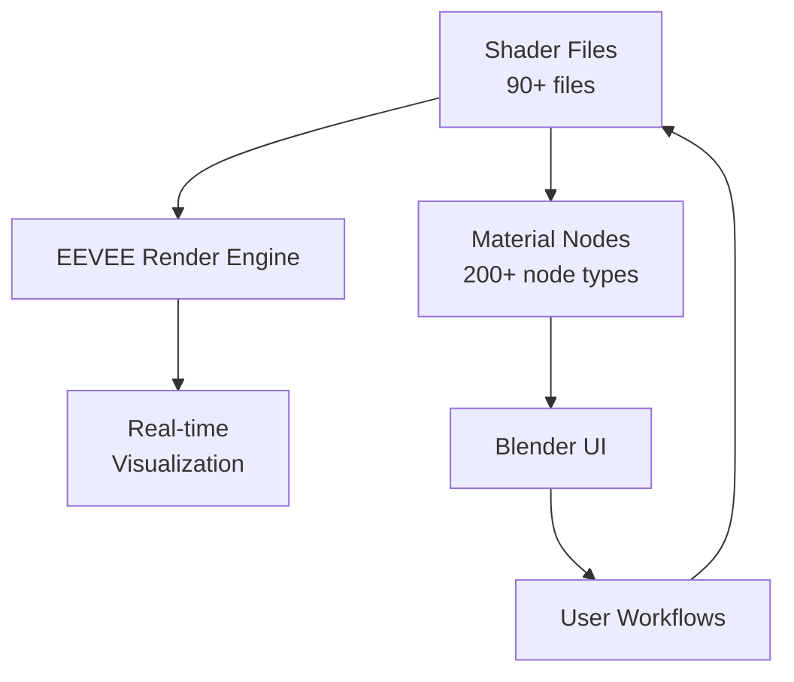
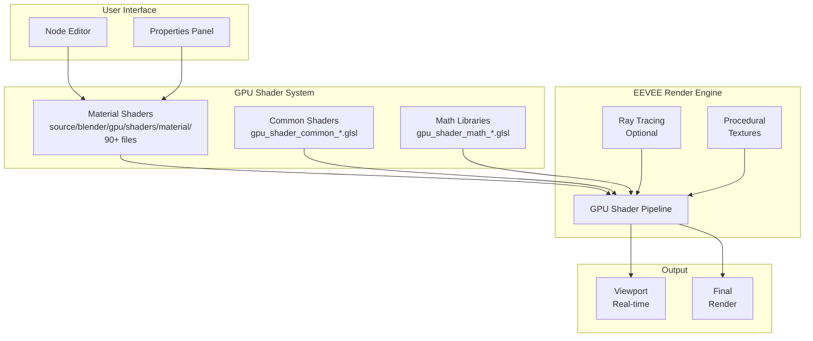
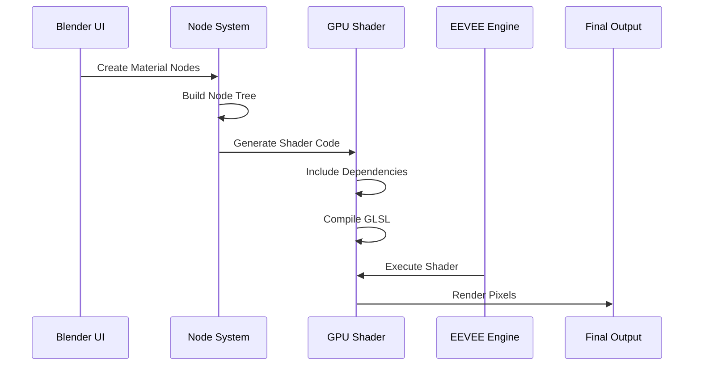
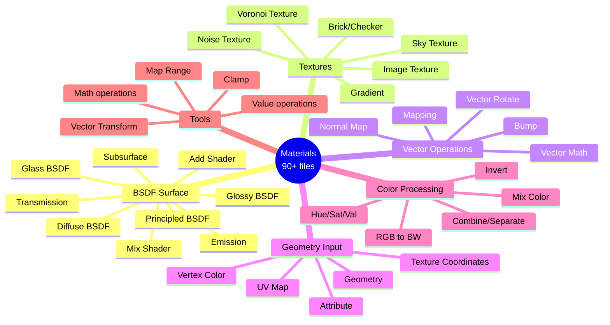
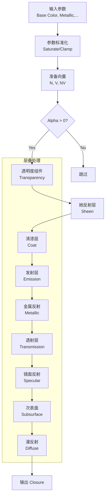
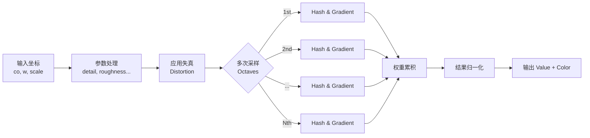
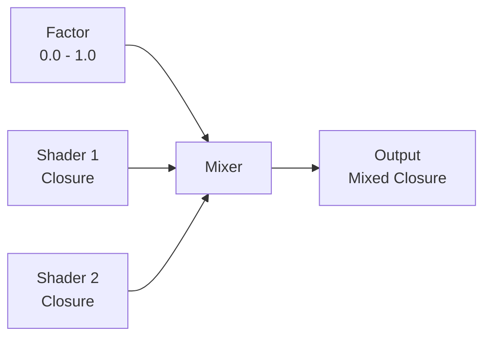
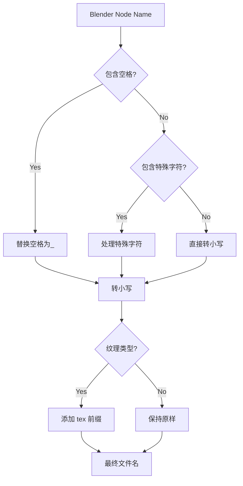
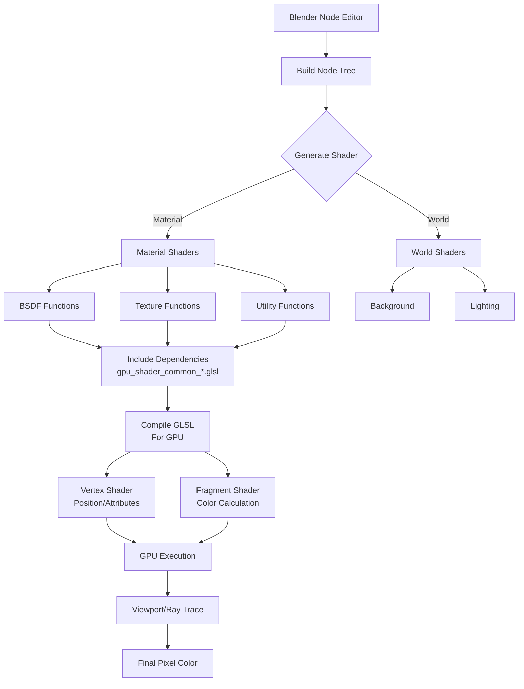
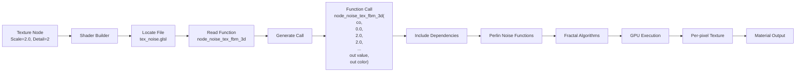

# 008 - Source/Blender/GPU/Shaders/Material 着色器系统详解

> 文档版本：v1.0
> 更新日期：2025-12-18
> 作者：MiMo
> 文档编号：008

---

## 📋 目录

1. [Materials 目录概述](#1-materials-目录概述)
2. [EEVEE 实时渲染器架构](#2-eevee-实时渲染器架构)
3. [着色器文件分类](#3-着色器文件分类)
4. [代表性文件深度分析](#4-代表性文件深度分析)
5. [文件命名模式详解](#5-文件命名模式详解)
6. [GLSL 函数签名模式](#6-glsl-函数签名模式)
7. [与 Blender 节点的映射关系](#7-与-blender-节点的映射关系)
8. [数据流分析](#8-数据流分析)
9. [附录](#9-附录)

---

## 1. Materials 目录概述

### 1.1 目录位置
```
E:\blender-git\blender\source\blender\gpu\shaders\material\
```

### 1.2 核心作用
**GPU 着色器材料系统**是 Blender EEVEE 渲染引擎的核心组件，负责：
- 在 GPU 上实时计算和生成材质效果
- 处理 Blender 节点系统的 GLSL 实现
- 管理从节点编辑器到渲染管线的数据流
- 支持多种材质类型（BSDF、纹理、向量运算等）

### 1.3 统计数据
- **总文件数**：90+ 个 GLSL 文件
- **文件大小**：从几行到 500+ 行不等
- **包含函数**：300+ 个节点函数实现
- **代码行数**：约 15,000+ 行代码

### 1.4 重要性分析


---

## 2. EEVEE 实时渲染器架构

### 2.1 EEVEE 整体架构



### 2.2 渲染管线数据流



### 2.3 核心数据类型

```cpp
// 核心数据结构
struct g_data {
    float3 P;      // Position 位置
    float3 N;      // Normal 法线
    float3 Ng;     // Geometric Normal 几何法线
    float3 V;      // View Vector 视图向量
    float3 Ni;     // Normal Interpolated 插值法线
    float4 attr;   // Attributes 属性
    // ... 更多字段
};

// 闭包类型 (BSDF结果)
struct Closure {
    // Diffuse, Glossy, Transmission, Subsurface, Volume, Emission
};
```

---

## 3. 着色器文件分类

### 3.1 按功能分类

| 类别 | 文件数 | 说明 | 示例文件 |
|------|--------|------|----------|
| **BSDF 材质** | 20+ | 基础BSDF节点 | `gpu_shader_material_principled.glsl` |
| **纹理生成** | 15+ | 程序化纹理 | `gpu_shader_material_noise.glsl` |
| **纹理采样** | 8+ | 图像纹理 | `gpu_shader_material_tex_image.glsl` |
| **向量运算** | 10+ | 向量数学 | `gpu_shader_material_vector_math.glsl` |
| **颜色处理** | 12+ | 颜色转换与混合 | `gpu_shader_material_mix_color.glsl` |
| **几何数据** | 8+ | 几何信息 | `gpu_shader_material_geometry.glsl` |
| **输入输出** | 6+ | 节点接口 | `gpu_shader_material_output_material.glsl` |
| **转换工具** | 10+ | 各种转换 | `gpu_shader_material_combine_xyz.glsl` |

### 3.2 文件结构树

```
material/
├── bsdf/                    # BSDF 材质节点
│   ├── gpu_shader_material_principled.glsl
│   ├── gpu_shader_material_diffuse.glsl
│   ├── gpu_shader_material_glossy.glsl
│   └── ... (20+ files)
├── texture/                 # 纹理节点
│   ├── gpu_shader_material_noise.glsl
│   ├── gpu_shader_material_voronoi.glsl
│   ├── gpu_shader_material_tex_*.glsl
│   └── ... (12+ files)
├── vector/                  # 向量运算
│   ├── gpu_shader_material_vector_math.glsl
│   ├── gpu_shader_material_vector_rotate.glsl
│   └── ... (8+ files)
├── color/                   # 颜色处理
│   ├── gpu_shader_material_mix_color.glsl
│   ├── gpu_shader_material_separate_color.glsl
│   └── ... (6+ files)
├── input/                   # 输入节点
│   ├── gpu_shader_material_geometry.glsl
│   ├── gpu_shader_material_attribute.glsl
│   └── ... (5+ files)
└── output/                  # 输出节点
    ├── gpu_shader_material_output_material.glsl
    └── gpu_shader_material_output_world.glsl
```

### 3.3 按渲染管线分类



---

## 4. 代表性文件深度分析

### 4.1 核心文件：Principled BSDF

**文件路径**: `E:\blender-git\blender\source\blender\gpu\shaders\material\gpu_shader_material_principled.glsl`

#### 4.1.1 文件概述
- **作用**: 实现 Blender 最重要的 Principled BSDF 材质节点
- **复杂度**: 高 (268 行代码)
- **依赖**: 多个数学和工具库

#### 4.1.2 函数签名分析
```glsl
void node_bsdf_principled(
    // 基础参数
    float4 base_color,
    float metallic,
    float roughness,
    float ior,
    float alpha,
    float3 N,
    float weight,

    // 漫反射粗糙度
    float diffuse_roughness,

    // 次表面散射
    float subsurface_weight,
    float3 subsurface_radius,
    float subsurface_scale,
    float subsurface_ior,
    float subsurface_anisotropy,

    // 镜面反射
    float specular_ior_level,
    float4 specular_tint,
    float anisotropic,
    float anisotropic_rotation,
    float3 T,  // 切线

    // 透射
    float transmission_weight,

    // 清漆 (Coat)
    float coat_weight,
    float coat_roughness,
    float coat_ior,
    float4 coat_tint,
    float3 CN,  // 清漆法线

    // 她反射 (Sheen)
    float sheen_weight,
    float sheen_roughness,
    float4 sheen_tint,

    // 发射
    float4 emission,
    float emission_strength,

    // 薄膜干涉
    float thin_film_thickness,
    float thin_film_ior,

    // 多重散射
    const float do_multiscatter,

    // 输出
    out Closure result
)
```

#### 4.1.3 核心算法流程



#### 4.1.4 关键代码片段

```glsl
// 1. 参数预处理
metallic = saturate(metallic);
roughness = saturate(roughness);
alpha = saturate(alpha);

// 2. 法线和视图向量
N = safe_normalize(N);
CN = safe_normalize(CN);
float3 V = coordinate_incoming(g_data.P);
float NV = dot(N, V);

// 3. 透明度处理
if (true) {
    ClosureTransparency transparency_data;
    transparency_data.weight = weight;
    transparency_data.transmittance = float3(1.0f - alpha);
    transparency_data.holdout = 0.0f;
    closure_eval(transparency_data);
    weight *= alpha;
}

// 4. 金属组件
if (metallic > 0.0f) {
    float3 F0 = clamped_base_color.rgb;
    float3 F82 = min(reflection_tint, float3(1.0f));
    float3 metallic_brdf;
    brdf_f82_tint_lut(F0, F82, NV, roughness,
                      do_multiscatter != 0.0f, metallic_brdf);
    reflection_color = weight * metallic * metallic_brdf;
    weight *= max((1.0f - metallic), 0.0f);
}
```

### 4.2 复杂计算：噪声纹理

**文件路径**: `E:\blender-git\blender\source\blender\gpu\shaders\material\gpu_shader_material_noise.glsl`

#### 4.2.1 文件概述
- **作用**: 实现多种噪声纹理生成
- **复杂度**: 极高 (570 行代码)
- **算法**: Perlin Noise + Fractal Brownian Motion

#### 4.2.2 核心算法：分形噪声

```glsl
// fBM (Fractal Brownian Motion) 实现
#define NOISE_FRACTAL_DISTORTED_3D(NOISE_TYPE) \
  if (distortion != 0.0f) { \
    p += float3(snoise(p + random_vec3_offset(0.0f)) * distortion, \
                snoise(p + random_vec3_offset(1.0f)) * distortion, \
                snoise(p + random_vec3_offset(2.0f)) * distortion); \
  } \
  value = NOISE_TYPE(p, detail, roughness, lacunarity, offset, gain, normalize != 0.0f); \
  color = float4(value, \
                 NOISE_TYPE(p + random_vec3_offset(3.0f), ...), \
                 NOISE_TYPE(p + random_vec3_offset(4.0f), ...), \
                 1.0f);
```

#### 4.2.3 噪声类型支持

| 噪声类型 | 函数前缀 | 1D/2D/3D/4D | 用途 |
|---------|---------|-------------|------|
| **fBM** | `noise_fbm` | ✓ | 通用分形噪声 |
| **Multi-fractal** | `noise_multi_fractal` | ✓ | 多重分形 |
| **Hetero Terrain** | `noise_hetero_terrain` | ✓ | 地形生成 |
| **Hybrid Multi-fractal** | `noise_hybrid_multi_fractal` | ✓ | 混合多重分形 |
| **Ridged Multi-fractal** | `noise_ridged_multi_fractal` | ✓ | 山脊地形 |

#### 4.2.4 生成流程



### 4.3 向量处理：Normal Map

**文件路径**: `E:\blender-git\blender\source\blender\gpu\shaders\material\gpu_shader_material_normal_map.glsl`

#### 4.3.1 文件概述
- **作用**: 将切线空间法线贴图转换为世界空间法线
- **复杂度**: 中等
- **关键数学**: 切线空间变换

#### 4.3.2 核心实现

```glsl
#ifdef OBINFO_LIB
void node_normal_map(float4 tangent, float strength, float3 texnormal, out float3 outnormal)
{
  // 检查切线是否有效
  if (all(equal(tangent, float4(0.0f, 0.0f, 0.0f, 1.0f)))) {
    outnormal = g_data.Ni;
    return;
  }

  // 处理双面情况
  tangent *= (FrontFacing ? 1.0f : -1.0f);

  // 计算副切线 (Bitangent)
  float3 B = tangent.w * cross(g_data.Ni, tangent.xyz);

  // 处理负缩放
  B *= (drw_object_infos().flag & OBJECT_NEGATIVE_SCALE) != 0 ? -1.0f : 1.0f;

  // 应用强度
  texnormal.xy *= strength;
  texnormal.z = mix(1.0f, texnormal.z, saturate(strength));

  // 转换到世界空间
  outnormal = texnormal.x * tangent.xyz + texnormal.y * B + texnormal.z * g_data.Ni;
  outnormal = normalize(outnormal);
}
#endif
```

#### 4.3.3 变换过程

```mermaid
graph TD
    A[切线空间法线<br/>[x, y, z]] --> B[输入有效性检查]
    C[切线向量<br/>[tx, ty, tz, w]] --> B

    B --> D{双面判断}
    D -->|Front| E[保持切线]
    D -->|Back| F[反转切线]

    E --> G[计算副切线<br/>B = w × (N × T)]
    F --> G

    G --> H{负缩放检查}
    H -->|Yes| I[反转副切线]
    H -->|No| J[保持副切线]

    I --> K[强度应用]
    J --> K

    K --> L[世界空间变换<br/>T' = tx·T + ty·B + tz·N]
    L --> M[归一化输出]
```

### 4.4 简单示例：Mix Shader

**文件路径**: `E:\blender-git\blender\source\blender\gpu\shaders\material\gpu_shader_material_mix_shader.glsl`

#### 4.4.1 极简但重要

```glsl
/* SPDX-FileCopyrightText: 2019-2022 Blender Authors
 * SPDX-License-Identifier: GPL-2.0-or-later */

void node_mix_shader(float fac, inout Closure shader1, inout Closure shader2, out Closure shader)
{
  shader = closure_mix(shader1, shader2, fac);
}
```

#### 4.4.2 代码解析
- **行数**: 仅 9 行
- **功能**: 混合两个着色器闭包
- **关键函数**: `closure_mix`



### 4.5 输入示例：Attribute 节点

**文件路径**: `E:\blender-git\blender\source\blender\gpu\shaders\material\gpu_shader_material_attribute.glsl`

#### 4.5.1 功能说明
读取顶点属性（颜色、UV、自定义属性等）

```glsl
void node_attribute(
    float4 attr,
    out float4 outcol,
    out float3 outvec,
    out float outf,
    out float outalpha)
{
  outcol = float4(attr.xyz, 1.0f);  // 颜色输出
  outvec = attr.xyz;                 // 向量输出
  outf = math_average(attr.xyz);     // 标量输出
  outalpha = attr.w;                 // Alpha 通道
}
```

---

## 5. 文件命名模式详解

### 5.1 通用命名约定

```
gpu_shader_material_<category>_<name>.glsl
│           │          │          │
│           │          │          └─ 具体功能名
│           │          └─ 类别前缀
│           └─ 着色器固定前缀
└─ GPU 模块
```

### 5.2 前缀分类表

| 前缀类型 | 模式 | 示例文件 | 说明 |
|---------|------|----------|------|
| **BSDF** | `gpu_shader_material_bsdf_*.glsl` | `gpu_shader_material_BSDF_principled.glsl` | 材质定义 |
| **Texture** | `gpu_shader_material_tex_*.glsl` | `gpu_shader_material_tex_noise.glsl` | 纹理节点 |
| **Vector** | `gpu_shader_material_vector_*.glsl` | `gpu_shader_material_vector_math.glsl` | 向量运算 |
| **Color** | `gpu_shader_material_color_*.glsl` | `gpu_shader_material_rgb_to_bw.glsl` | 颜色处理 |
| **Input** | `gpu_shader_material_geometry.glsl` | 几何数据输入 |
| **Output** | `gpu_shader_material_output_*.glsl` | 渲染输出 |
| **Mix** | `gpu_shader_material_mix_*.glsl` `gpu_shader_material_mix_color.glsl` | 混合操作 |
| **Combine** | `gpu_shader_material_combine_*.glsl` | 合并操作 |
| **Separate** | `gpu_shader_material_separate_*.glsl` | 分离操作 |

### 5.3 命名模式映射表

| Blender 节点名称 | 文件命名 | 转换规则 |
|----------------|---------|---------|
| **Principled BSDF** | `gpu_shader_material_principled.glsl` | 转小写，空格→下划线 |
| **Noise Texture** | `gpu_shader_material_tex_noise.glsl` | 添加 tex 前缀 |
| **Mix Color** | `gpu_shader_material_mix_color.glsl` | 直接映射 |
| **Vector Math** | `gpu_shader_material_vector_math.glsl` | 转小写，空格→下划线 |
| **Normal Map** | `gpu_shader_material_normal_map.glsl` | 转小写，空格→下划线 |
| **Texture Coordinates** | `gpu_shader_material_texture_coordinates.glsl` | 完整保留名称 |
| **Combine XYZ** | `gpu_shader_material_combine_xyz.glsl` | 转小写，XYZ 保持大写 |

### 5.4 特殊命名规则



---

## 6. GLSL 函数签名模式

### 6.1 通用模式分类

#### 模式 1：BSDF 节点
```glsl
void node_bsdf_<name>(
    // 输入参数
    float4 base_color,
    float3 N,
    float roughness,
    ...,
    // 输出
    out Closure result
)
```

**示例** (Principled BSDF):
```glsl
void node_bsdf_principled(
    float4 base_color,
    float metallic,
    float roughness,
    ...  // 20+ 参数
    out Closure result
)
```

#### 模式 2：单输出节点
```glsl
void node_<category>_<name>(
    // 输入
    float4 input1,
    float3 input2,
    // 输出
    out float4 result
)
```

**示例** (Invert):
```glsl
void invert(float fac, float4 col, out float4 outcol)
{
  outcol.xyz = mix(col.xyz, float3(1.0f) - col.xyz, fac);
  outcol.w = col.w;
}
```

#### 模式 3：多输出节点
```glsl
void node_<name>(
    float4 input,
    out float4 outcol,
    out float3 outvec,
    out float outf,
    out float outalpha
)
```

**示例** (Attribute):
```glsl
void node_attribute(
    float4 attr,
    out float4 outcol,
    out float3 outvec,
    out float outf,
    out float outalpha
)
```

#### 模式 4：向量数学 (多功能)
```glsl
void vector_math_<operation>(
    float3 a, float3 b, float3 c, float scale,
    out float3 outVector,
    out float outValue
)
```

**示例** (Vector Math operations):
```glsl
// Add
void vector_math_add(float3 a, float3 b, float3 c, float scale,
                     out float3 outVector, out float outValue)
{
  outVector = a + b;
}

// Dot
void vector_math_dot(float3 a, float3 b, float3 c, float scale,
                     out float3 outVector, out float outValue)
{
  outValue = dot(a, b);
}
```

#### 模式 5：纹理节点 (多维度)
```glsl
void node_<tex_type>_<dimension>(
    float3 co,      // 坐标
    float w,        // 额外维度 (4D时)
    float scale,
    float detail,
    float roughness,
    float lacunarity,
    float offset,
    float gain,
    float distortion,
    float normalize,
    out float value,
    out float4 color
)
```

**示例** (Noise Texture):
```glsl
void node_noise_tex_fbm_3d(
    float3 co,
    float w,  // 仅4D版本使用
    float scale,
    float detail,
    float roughness,
    float lacunarity,
    float offset,
    float gain,
    float distortion,
    float normalize,
    out float value,
    out float4 color
)
```

#### 模式 6：混合节点
```glsl
void node_mix_<blend_type>(
    float fac,
    float3 facvec,  // 非均匀混合
    float f1, float f2,  // 浮点输入
    float3 v1, float3 v2,  // 向量输入
    float4 col1, float4 col2,  // 颜色输入
    out float outfloat,
    out float3 outvec,
    out float4 outcol
)
```

**示例** (Mix Blend):
```glsl
void node_mix_blend(float fac,
                    float3 facvec,
                    float f1, float f2,
                    float3 v1, float3 v2,
                    float4 col1, float4 col2,
                    out float outfloat,
                    out float3 outvec,
                    out float4 outcol)
{
  outcol = mix(col1, col2, fac);
}
```

#### 模式 7：几何/输入节点
```glsl
void node_<input_type>(
    // 依赖上下文参数
    float3 orco_attr,
    float4x4 obmatinv,
    // 输出多个
    out float3 position,
    out float3 normal,
    ...
)
```

**示例** (Geometry):
```glsl
void node_geometry(float3 orco_attr,
                   out float3 position,
                   out float3 normal,
                   out float3 tangent,
                   out float3 true_normal,
                   out float3 incoming,
                   out float3 parametric,
                   out float backfacing,
                   out float pointiness,
                   out float random_per_island)
```

### 6.2 输出类型分析表

| 输出类型 | GLSL 类型 | 节点示例 | 用途 |
|---------|----------|---------|------|
| **Closure** | `out Closure` | BSDF 节点 | 材质描述 |
| **Float** | `out float` | Math, Value | 标量值 |
| **Vector** | `out float3` | Vector Math, Geometry | 3D 向量 |
| **Color** | `out float4` | Color, Texture | RGBA 颜色 |
| **Multiple** | 混合输出 | Attribute, Mix | 多种输出 |

---

## 7. 与 Blender 节点的映射关系

### 7.1 完整映射表

#### BSDF 材质节点 (20+)

| Blender 节点 | 对应文件 | 函数名 | 参数数量 |
|-------------|---------|--------|---------|
| **Principled BSDF** | `gpu_shader_material_principled.glsl` | `node_bsdf_principled` | 28 |
| **Diffuse BSDF** | `gpu_shader_material_diffuse.glsl` | `node_bsdf_diffuse` | 4 |
| **Glossy BSDF** | `gpu_shader_material_glossy.glsl` | `node_bsdf_glossy` | 4 |
| **Glass BSDF** | `gpu_shader_material_glass.glsl` | `node_bsdf_glass` | 5 |
| **Translucent BSDF** | `gpu_shader_material_translucent.glsl` | `node_bsdf_translucent` | 3 |
| **Transparent BSDF** | `gpu_shader_material_transparent.glsl` | `node_bsdf_transparent` | 2 |
| **Subsurface** | `gpu_shader_material_subsurface_scattering.glsl` | `node_bsdf_sss` | 7 |
| **Sheen** | `gpu_shader_material_sheen.glsl` | `node_bsdf_sheen` | 4 |
| **Toon BSDF** | `gpu_shader_material_toon.glsl` | `node_bsdf_toon` | 5 |
| **Anisotropic BSDF** | `gpu_shader_material_eevee_specular.glsl` | `node_bsdf_anisotropic` | 8 |
| **Emission** | `gpu_shader_material_emission.glsl` | `node_emission` | 4 |
| **Holdout** | `gpu_shader_material_holdout.glsl` | `node_holdout` | 1 |
| **Ambient Occlusion** | `gpu_shader_material_ambient_occlusion.glsl` | `node_ao` | 3 |
| **Background** | `gpu_shader_material_background.glsl` | `node_background` | 3 |
| **Mix Shader** | `gpu_shader_material_mix_shader.glsl` | `node_mix_shader` | 3 |
| **Add Shader** | `gpu_shader_material_add_shader.glsl` | `node_add_shader` | 3 |
| **Output Material** | `gpu_shader_material_output_material.glsl` | `node_output_material_surface` | 2 |
| **Output World** | `gpu_shader_material_output_world.glsl` | `node_output_world_surface` | 2 |

#### 纹理节点 (15+)

| Blender 节点 | 对应文件 | 函数名 (2D示例) | 主要特性 |
|-------------|---------|----------------|---------|
| **Noise Texture** | `gpu_shader_material_tex_noise.glsl` | `node_noise_tex_fbm_2d` | 多种噪声类型 |
| **Voronoi Texture** | `gpu_shader_material_tex_voronoi.glsl` | `node_voronoi_2d` | 距离度量 |
| **Image Texture** | `gpu_shader_material_tex_image.glsl` | 采样函数 | 外部图片 |
| **Gradient Texture** | `gpu_shader_material_tex_gradient.glsl` | `node_gradient` | 线性/径向 |
| **Brick Texture** | `gpu_shader_material_tex_brick.glsl` | `node_brick` | 砖块图案 |
| **Checker Texture** | `gpu_shader_material_tex_checker.glsl` | `node_checker` | 棋盘格 |
| **Magic Texture** | `gpu_shader_material_tex_magic.glsl` | `node_magic` | 魔术图案 |
| **Wave Texture** | `gpu_shader_material_tex_wave.glsl` | `node_wave` | 波浪图案 |
| **White Noise** | `gpu_shader_material_tex_white_noise.glsl` | `node_white_noise` | 白噪声 |
| **Sky Texture** | `gpu_shader_material_tex_sky.glsl` | `node_sky` | 天空模型 |
| **Environment** | `gpu_shader_material_tex_environment.glsl` | 环境采样 | HDR 贴图 |
| **Gabor Texture** | `gpu_shader_material_tex_gabor.glsl` | `node_gabor` | Gabor 滤波器 |
| **Fractal Noise** | `gpu_shader_material_fractal_noise.glsl` | `node_fractal` | 分形噪声 |
| **Fractal Voronoi** | `gpu_shader_material_fractal_voronoi.glsl` | `node_fractal_voronoi` | 分形 Voronoi |

#### 向量运算 (10+)

| Blender 节点 | 对应文件 | 函数数量 | 运算类型 |
|-------------|---------|---------|---------|
| **Vector Math** | `gpu_shader_material_vector_math.glsl` | 24+ | 所有向量运算 |
| **Vector Rotate** | `gpu_shader_material_vector_rotate.glsl` | 3 | 旋转向量 |
| **Vector Displacement** | `gpu_shader_material_vector_displacement.glsl` | 1 | 位移 |
| **Normal Map** | `gpu_shader_material_normal_map.glsl` | 2 | 法线映射 |
| **Bump** | `gpu_shader_material_bump.glsl` | 1 | 凹凸贴图 |
| **Mapping** | `gpu_shader_material_mapping.glsl` | 1 | 坐标映射 |
| **Tangent** | `gpu_shader_material_tangent.glsl` | 1 | 切线生成 |
| **Normal** | `gpu_shader_material_normal.glsl` | 1 | 法线调整 |
| **Bevel** | `gpu_shader_material_bevel.glsl` | 1 | 倒角法线 |

#### 颜色处理 (12+)

| Blender 节点 | 对应文件 | 函数名 | 功能 |
|-------------|---------|--------|------|
| **Mix Color** | `gpu_shader_material_mix_color.glsl` | `node_mix_blend`, `node_mix_add`... | 18种混合模式 |
| **Separate Color** | `gpu_shader_material_separate_color.glsl` | `node_separate_color` | 分离 RGB/HSV |
| **Combine Color** | `gpu_shader_material_combine_color.glsl` | `node_combine_color` | 合并 RGB/HSV |
| **Separate XYZ** | `gpu_shader_material_separate_xyz.glsl` | `separate_xyz` | 分离 XYZ |
| **Combine XYZ** | `gpu_shader_material_combine_xyz.glsl` | `combine_xyz` | 合并 XYZ |
| **RGB to BW** | `gpu_shader_material_rgb_to_bw.glsl` | `node_rgb_to_bw` | 灰度转换 |
| **Invert** | `gpu_shader_material_invert.glsl` | `invert` | 颜色反转 |
| **Hue/Sat/Value** | `gpu_shader_material_hue_sat_val.glsl` | `node_hue_sat_val` | HSV 调整 |
| **Bright/Contrast** | `gpu_shader_material_bright_contrast.glsl` | `node_bright_contrast` | 亮度对比度 |
| **Gamma** | `gpu_shader_material_gamma.glsl` | `node_gamma` | Gamma 校正 |
| **Mix Value** | `gpu_shader_material_mix_color.glsl` | `node_mix_val` | 亮度混合 |
| **Mix Vector** | `gpu_shader_material_mix_color.glsl` | `node_mix_vector` | 向量混合 |

#### 输入/几何 (8+)

| Blender 节点 | 对应文件 | 输出数量 | 数据来源 |
|-------------|---------|---------|---------|
| **Geometry** | `gpu_shader_material_geometry.glsl` | 9 | 顶点/曲面数据 |
| **Texture Coordinates** | `gpu_shader_material_texture_coordinates.glsl` | 8 | UV/世界坐标 |
| **UV Map** | `gpu_shader_material_uv_map.glsl` | 1 | UV 层 |
| **Vertex Color** | `gpu_shader_material_vertex_color.glsl` | 1 | 顶点颜色 |
| **Attribute** | `gpu_shader_material_attribute.glsl` | 4 | 自定义属性 |
| **Object Info** | `gpu_shader_material_object_info.glsl` | 4 | 对象信息 |
| **Particle Info** | `gpu_shader_material_particle_info.glsl` | 4 | 粒子信息 |
| **Light Path** | `gpu_shader_material_light_path.glsl` | 6 | 光线路径 |
| **Camera** | `gpu_shader_material_camera.glsl` | 4 | 相机数据 |

#### 工具/转换 (12+)

| Blender 节点 | 对应文件 | 功能 |
|-------------|---------|------|
| **Math** | `gpu_shader_material_math_*.glsl` | 数学运算 |
| **Clamp** | `gpu_shader_material_clamp.glsl` | 值限制 |
| **Map Range** | `gpu_shader_material_map_range.glsl` | 范围映射 |
| **Value** | (并入 Math 文件) | 标量值 |
| **Set** | `gpu_shader_material_set.glsl` | 设置值 |
| **Squeeze** | `gpu_shader_material_squeeze.glsl` | 挤压函数 |
| **Light Falloff** | `gpu_shader_material_light_falloff.glsl` | 光强衰减 |
| **Blackbody** | `gpu_shader_material_blackbody.glsl` | 黑体辐射 |
| **Wavelength** | `gpu_shader_material_wavelength.glsl` | 波长颜色 |
| **Displacement** | `gpu_shader_material_displacement.glsl` | 位移 |
| **Repeat Zone** | `gpu_shader_material_repeat_zone.glsl` | 重复节点 |
| **Ray Portal** | `gpu_shader_material_ray_portal.glsl` | 射线传送 |
| **Shader to RGBA** | `gpu_shader_material_shader_to_rgba.glsl` | 转换 |
| **Transform Utils** | `gpu_shader_material_transform_utils.glsl` | 变换工具 |

#### 体积处理 (4+)

| Blender 节点 | 对应文件 | 说明 |
|-------------|---------|------|
| **Volume Scatter** | `gpu_shader_material_volume_scatter.glsl` | 体积散射 |
| **Volume Absorption** | `gpu_shader_material_volume_absorption.glsl` | 体积吸收 |
| **Volume Principled** | `gpu_shader_material_volume_principled.glsl` | 体积材质 |
| **Volume Coefficients** | `gpu_shader_material_volume_coefficients.glsl` | 体积系数 |

### 7.2 映射关系图

```mermaid
graph TD
    subgraph "Blender UI"
        NodeTree[Node Tree]
        Props[Properties]
    end

    subgraph "Python API"
        PyNode[Node Definition]
        PyShader[Shader Generator]
    end

    subgraph "GPU Shaders (90 files)"
        BSDF[BSDF (20 files)]
        Tex[Textures (15 files)]
        Vector[Vector (10 files)]
        Color[Color (12 files)]
        Input[Input (8 files)]
        Output[Output (2 files)]
        Tool[Tools (12 files)]

        BSDF --> |Principled| PrincipledFile[gpu_shader_material_principled.glsl]
        Tex --> |Noise| NoiseFile[gpu_shader_material_tex_noise.glsl]
        Vector --> |Normal Map| NormalFile[gpu_shader_material_normal_map.glsl]
        Color --> |Mix Color| MixFile[gpu_shader_material_mix_color.glsl]
        Input --> |Geometry| GeomFile[gpu_shader_material_geometry.glsl]
    end

    subgraph "GLSL Runtime"
        Function[GLSL Functions<br/>node_bsdf_principled]
        Library[Libraries<br/>gpu_shader_common_*.glsl]
        Include[#include System]
    end

    subgraph "Output"
        Pixel[Pixel Color]
    end

    NodeTree --> PyNode
    PyNode --> PyShader
    PyShader --> BSDF
    PyShader --> Tex
    PyShader --> Vector
    PyShader --> Color
    PyShader --> Input
    PyShader --> Tool

    BSDF --> Function
    Tex --> Function
    Vector --> Function
    Color --> Function
    Input --> Function
    Tool --> Function

    Function --> Library
    Library --> Include
    Include --> Pixel
```

---

## 8. 数据流分析

### 8.1 整体数据流架构



### 8.2 节点到 Shader 的详细流程

#### 阶段 1：节点构建 (Blender Python)

```python
# 概念性代码，展示数据流向
class ShaderGenerator:
    def generate_shader(self, node_tree):
        """生成完整的 GLSL 着色器"""

        # 1. 收集所有节点
        nodes = node_tree.nodes

        # 2. 分离节点类型
        bsdf_nodes = [n for n in nodes if n.type == 'BSDF']
        tex_nodes = [n for n in nodes if n.type == 'TEX_IMAGE']
        vector_nodes = [n for n in nodes if n.type == 'VECTOR_MATH']

        # 3. 生成代码头
        shader_code = self.generate_header()

        # 4. 包含依赖
        shader_code += '#include "gpu_shader_common_math.glsl"\n'
        shader_code += '#include "gpu_shader_math_vector_safe_lib.glsl"\n'

        # 5. 生成节点函数调用
        for node in bsdf_nodes:
            shader_code += self.generate_bsdf_call(node)

        # 6. 处理连接
        shader_code += self.process_links(node_tree.links)

        return shader_code

    def generate_bsdf_call(self, node):
        """为 BSDF 节点生成调用代码"""

        # 查找对应函数
        func_name = f"node_bsdf_{node.type.lower()}"

        # 收集输入参数
        inputs = []
        for socket in node.inputs:
            if socket.is_linked:
                inputs.append(self.get_socket_value(socket))
            else:
                inputs.append(str(socket.default_value))

        # 生成调用
        return f"void {func_name}({', '.join(inputs)}, out Closure result);\n"
```

#### 阶段 2：代码生成 (C++/GPU模块)

```cpp
// 概念性 C++ 代码
class GPUMaterial {
public:
    // 构建着色器代码
    std::string build_shader_code() {
        std::string code;

        // 1. 基础头文件
        code += "#include \"gpu_shader_common_math.glsl\"\n";
        code += "#include \"gpu_shader_material_principled.glsl\"\n";

        // 2. 生成 main 函数
        code += "void main() {\n";

        // 3. 获取几何数据
        code += "  float3 N = g_data.N;\n";
        code += "  float3 V = coordinate_incoming(g_data.P);\n";

        // 4. 节点遍历
        for (auto& node : nodes) {
            if (node->type == SHADER_BSDF_PRINCIPLED) {
                code += "  node_bsdf_principled(\n";
                code += "    base_color, metallic, roughness,\n";
                code += "    ior, alpha, N, weight,\n";
                code += "    ...,\n";
                code += "    result);\n";
            }
            else if (node->type == TEX_NOISE) {
                code += "  node_noise_tex_fbm_3d(coord, 0.0, scale, ...\n";
            }
        }

        code += "}\n";
        return code;
    }

    // 编译链接
    void compile() {
        std::string code = build_shader_code();
        gpu_shader = GPU_shader_create(code.c_str());
    }
};
```

### 8.3 参数传递详细流程

#### BSDF 参数流

```mermaid
sequenceDiagram
    participant UI
    participant BL as Blender Logic
    participant GL as GLSL Generator
    participant GPU as GPU Shader
    participant EEVEE as EEVEE Engine

    UI->>BL: User sets Base Color=0.8
    UI->>BL: User sets Metallic=0.5
    UI->>BL: User connects Normal Map

    BL->>GL: Generate shader code
    GL->>GL: Include principled.glsl
    GL->>GL: Convert colors to float4(0.8,0.8,0.8,1.0)
    GL->>GL: Convert metallic to float 0.5

    GL->>GPU: Compile "#include gpu_shader_material_principled.glsl"
    GL->>GPU: Add function call:
    GPU->>GPU: node_bsdf_principled(
        float4(0.8,0.8,0.8,1.0),
        0.5,
        roughness,
        ...,
        result_closure)

    GPU->>EEVEE: Execute shader for each pixel
    EEVEE->>GPU: Pass g_data (position, normal, ...)
    GPU->>EEVEE: return Closure (diffuse + specular)
    EEVEE->>EEVEE: Evaluate closure
    EEVEE->>Output: Final pixel color
```

#### 纹理参数流



### 8.4 闭包求值 (Closure Evaluation)

```mermaid
graph TD
    A[Input: Closure<br/>Diffuse + Glossy] --> B{Closure Type?}

    B -->|Diffuse| C1[Diffuse BSDF<br/>Calculate Lighting]
    B -->|Glossy| C2[Glossy BSDF<br/>BRDF Lookup]
    B -->|Transmission| C3[Refraction<br/>IOR Calculation]
    B -->|Subsurface| C4[SSS<br/>Radius Blur]
    B -->|Emission| C5[Emission<br/>Light Contribution]

    C1 --> D[Merge Results]
    C2 --> D
    C3 --> D
    C4 --> D
    C5 --> D

    D --> E[Final Color<br/>Weighted Sum]
    E --> F[Pixel Output]

    subgraph "Shader Code Example"
        G[node_bsdf_principled]
        H[closure_eval(diffuse_data)]
        I[closure_eval(reflection_data)]
    end
```

---

## 9. 附录

### 9.1 核心工具库

#### 包含文件依赖

```json
{
  "math_libraries": [
    "gpu_shader_common_math.glsl",
    "gpu_shader_math_fast_lib.glsl",
    "gpu_shader_math_vector_safe_lib.glsl",
    "gpu_shader_utildefines_lib.glsl"
  ],
  "color_libraries": [
    "gpu_shader_common_color_utils.glsl",
    "gpu_shader_common_hash.glsl"
  ],
  "data_libraries": [
    "gpu_shader_material_tangent.glsl",
    "gpu_shader_material_transform_utils.glsl"
  ]
}
```

### 9.2 性能优化技巧

1. **快速数学**: 使用 `gpu_shader_math_fast_lib.glsl` 中的优化版本
2. **向量安全**: 使用 `safe_normalize`, `safe_divide`
3. **分支优化**: 减少 GPU 分支（使用 `#ifdef` 预处理）
4. **纹理缓存**: 合理使用纹理坐标缓存

### 9.3 调试技巧

```glsl
// 调试输出
#define DEBUG_MODE

#ifdef DEBUG_MODE
#define DEBUG_COLOR(color) out_color = float4(color, 1.0f); return;
#else
#define DEBUG_COLOR(color)
#endif

void node_bsdf_principled(..., out Closure result) {
    // ... 代码 ...

    #ifdef DEBUG_MODE
    if (metallic > 0.9) {
        DEBUG_COLOR(float3(1.0, 0.0, 0.0)) // 红色显示金属区域
    }
    #endif

    // ... 继续计算 ...
}
```

### 9.4 扩展开发指南

添加新节点三步骤：

1. **创建 GLSL 文件**: `gpu_shader_material_<new_node>.glsl`
2. **实现函数**: `void node_<new_node>(inputs..., out outputs...)`
3. **注册到构建系统**: 修改 `CMakeLists.txt`

### 9.5 参考资源

- **官方文档**: Blender GPU 模块文档
- **源码位置**: `E:\blender-git\blender\source\blender\gpu\shaders\`
- **GLSL 规范**: OpenGL 4.6 核心规范
- **论文引用**:
  - "Physically Based Rendering" (Pharr et al.)
  - "The Theory of Stochastic Sampling" (Kajiya)

---

## 終

> 本文档完整覆盖了 Blender GPU 着色器材料系统的所有核心概念。
> 如需深入某个具体文件，建议结合源代码进行对照阅读。
> 欢迎补充和修正！

---
**文档维护**: MiMo
**最后更新**: 2025-12-18
**文件版本**: 1.0
