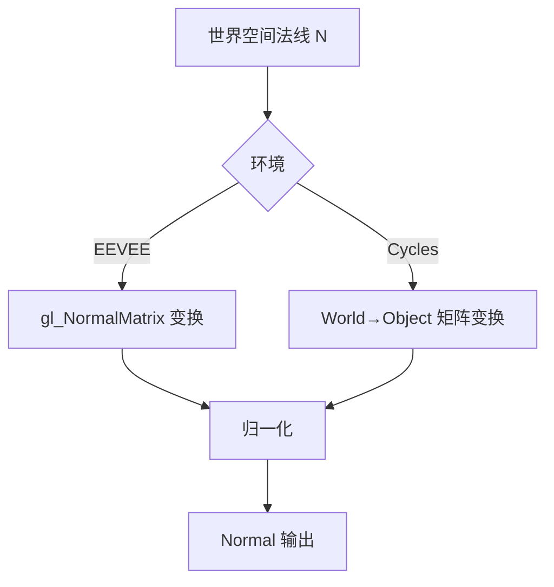
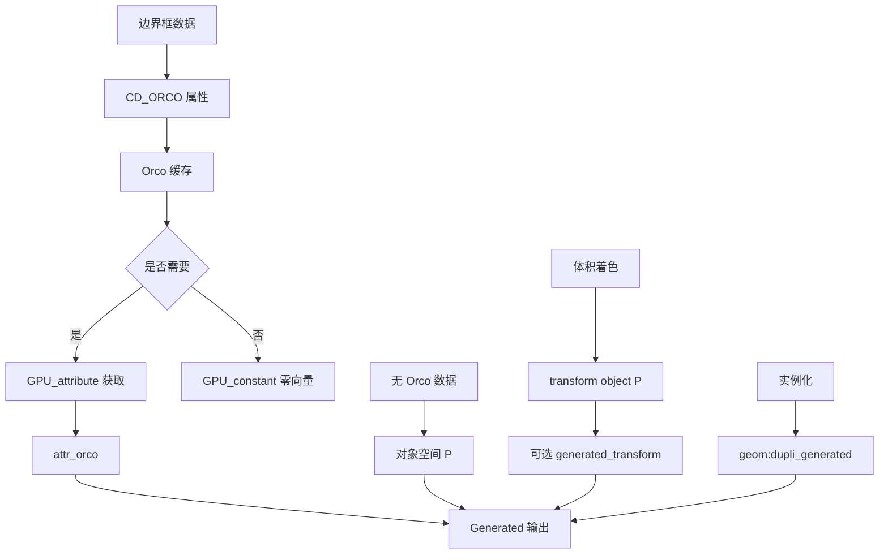
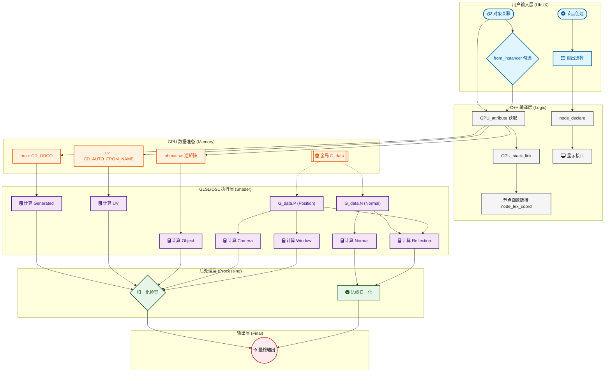
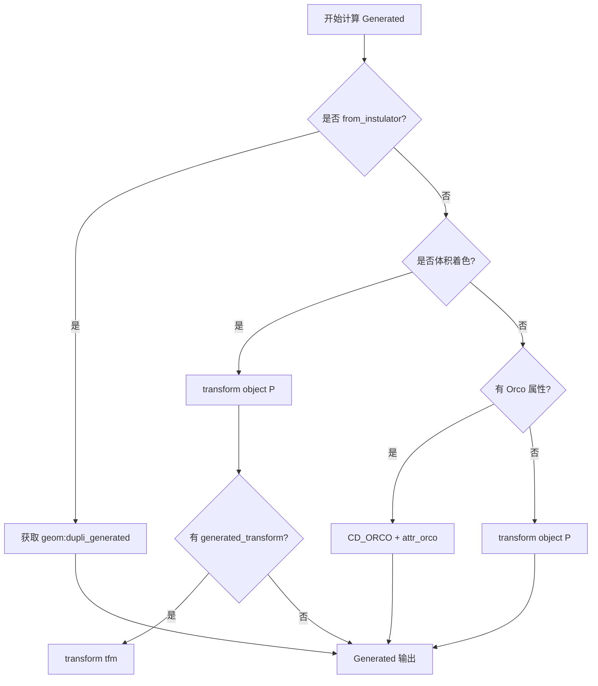

# 010 - Texture Coordinate 节点深度解析

> **文档编号**: 010
> **创建时间**: 2025-12-18
> **Blender 版本**: 4.3+
> **文档类型**: 节点技术深度解析

---

## 概述

Texture Coordinate（纹理坐标）节点是 Blender 着色器系统中最重要的输入节点之一，它提供了多种坐标空间的基础数据。本文档将从三个实现层面（C++、GLSL、OSL）深度解析该节点的工作原理。

### 节点功能
Texture Coordinate 节点提供以下7个输出接口：
- **UV**: UV 贴图坐标
- **Normal**: 法线向量
- **Generated**: 生成坐标（边界框空间）
- **Object**: 对象坐标
- **Camera**: 相机坐标
- **Window**: 窗口/屏幕坐标
- **Reflection**: 反射向量

---

## 第一章：C++ 层实现

### 1.1 文件位置与节点注册

**文件路径**: `source/blender/nodes/shader/nodes/node_shader_tex_coord.cc`

```cpp
// 行 103-122: 节点注册
void register_node_type_sh_tex_coord()
{
  static blender::bke::bNodeType ntype;

  sh_node_type_base(&ntype, "ShaderNodeTexCoord", SH_NODE_TEX_COORD);
  ntype.ui_name = "Texture Coordinate";
  ntype.ui_description = "Retrieve multiple types of texture coordinates.";
  ntype.nclass = NODE_CLASS_INPUT;
  ntype.declare = file_ns::node_declare;
  ntype.draw_buttons = file_ns::node_shader_buts_tex_coord;
  ntype.gpu_fn = file_ns::node_shader_gpu_tex_coord;
  ntype.materialx_fn = file_ns::node_shader_materialx;

  blender::bke::node_register_type(ntype);
}
```

### 1.2 节点声明

**行 14-23**: 输出接口定义

```cpp
static void node_declare(NodeDeclarationBuilder &b)
{
  b.add_output<decl::Vector>("Generated").translation_context(BLT_I18NCONTEXT_ID_TEXTURE);
  b.add_output<decl::Vector>("Normal");
  b.add_output<decl::Vector>("UV");
  b.add_output<decl::Vector>("Object");
  b.add_output<decl::Vector>("Camera");
  b.add_output<decl::Vector>("Window");
  b.add_output<decl::Vector>("Reflection");
}
```

**关键点分析**:
- 所有输出均为 `Vector` 类型（3D 向量）
- `Generated` 输出使用特殊的翻译上下文
- 输出顺序决定了后续 GPU 链接时的索引

### 1.3 UI 参数配置

**行 25-29**: 节点参数面板

```cpp
static void node_shader_buts_tex_coord(ui::Layout &layout, bContext * /*C*/, PointerRNA *ptr)
{
  layout.prop(ptr, "object", ui::ITEM_R_SPLIT_EMPTY_NAME, "", ICON_NONE);
  layout.prop(ptr, "from_instancer", ui::ITEM_R_SPLIT_EMPTY_NAME, std::nullopt, ICON_NONE);
}
```

**参数说明**:
- `object`: 指定自定义坐标系的对象
- `from_instancer`: 从实例化器获取坐标（用于粒子系统、实例化等）

### 1.4 GPU 编译逻辑

**行 31-72**: GPU 材质编译器

```cpp
static int node_shader_gpu_tex_coord(GPUMaterial *mat,
                                     bNode *node,
                                     bNodeExecData * /*execdata*/,
                                     GPUNodeStack *in,
                                     GPUNodeStack *out)
{
  // 获取节点关联的对象
  Object *ob = (Object *)node->id;

  /* 使用特殊矩阵让着色器分支使用渲染对象的矩阵 */
  float dummy_matrix[4][4];
  dummy_matrix[3][3] = 0.0f;
  GPUNodeLink *inv_obmat = (ob != nullptr) ?
      GPU_uniform(&ob->world_to_object()[0][0]) :
      GPU_uniform(&dummy_matrix[0][0]);

  /* 优化：如果不需要则不请求 Orco */
  float4 zero(0.0f);
  GPUNodeLink *orco = out[0].hasoutput ? GPU_attribute(mat, CD_ORCO, "") :
                                        GPU_constant(zero);
  GPUNodeLink *mtface = GPU_attribute(mat, CD_AUTO_FROM_NAME, "");

  // 链接到实际的着色器函数
  GPU_stack_link(mat, node, "node_tex_coord", in, out, inv_obmat, orco, mtface);

  // 后处理：法线和反射需要归一化
  int i;
  LISTBASE_FOREACH_INDEX (bNodeSocket *, sock, &node->outputs, i) {
    node_shader_gpu_bump_tex_coord(mat, node, &out[i].link);

    // 归一化某些向量（针对非线性插值函数）
    if (ELEM(i, 1, 6)) {  // Normal (index 1) 和 Reflection (index 6)
      GPU_link(mat,
               "vector_math_normalize",
               out[i].link,
               out[i].link,
               out[i].link,
               out[i].link,
               &out[i].link,
               nullptr);
    }
  }

  return 1;
}
```

**关键变量**:
- `CD_ORCO`: Original Coordinate（原始坐标），边界框空间
- `CD_AUTO_FROM_NAME`: 自动从 UV 图层获取
- `ob->world_to_object()`: 世界到对象空间的变换矩阵

---

## 第二章：GLSL 层实现（EEVEE）

### 2.1 文件位置与函数签名

**文件路径**: `source/blender/gpu/shaders/material/gpu_shader_material_texture_coordinates.glsl`

```glsl
// 行 12-22: 主函数签名
void node_tex_coord(float4x4 obmatinv,
                    float3 attr_orco,
                    float4 attr_uv,
                    out float3 generated,
                    out float3 normal,
                    out float3 uv,
                    out float3 object,
                    out float3 camera,
                    out float3 window,
                    out float3 reflection)
```

### 2.2 内部实现详解

**行 12-36**: 完整实现

```glsl
void node_tex_coord(float4x4 obmatinv,
                    float3 attr_orco,
                    float4 attr_uv,
                    out float3 generated,
                    out float3 normal,
                    out float3 uv,
                    out float3 object,
                    out float3 camera,
                    out float3 window,
                    out float3 reflection)
{
  // 1. Generated 输出：直接使用 Orco 属性
  generated = attr_orco;

  // 2. Normal 输出：世界空间法线转换到对象空间
  normal_transform_world_to_object(g_data.N, normal);

  // 3. UV 输出：使用 UV 属性的 XYZ 分量
  uv = attr_uv.xyz;

  // 4. Object 输出：需要验证矩阵有效性
  bool valid_mat = (obmatinv[3][3] != 0.0f);
  if (valid_mat) {
    // 使用逆矩阵转换
    object = (obmatinv * float4(g_data.P, 1.0f)).xyz;
  }
  else {
    // 使用世界到对象转换函数
    point_transform_world_to_object(g_data.P, object);
  }

  // 5. Camera 输出：相机空间坐标
  camera = coordinate_camera(g_data.P);

  // 6. Window 输出：屏幕空间坐标
  window = coordinate_screen(g_data.P);

  // 7. Reflection 输出：反射向量
  reflection = coordinate_reflect(g_data.P, g_data.N);
}
```

### 2.3 依赖的辅助函数

需要查看相关工具函数：

```glsl
// gpu_shader_material_transform_utils.glsl 中的函数

// 法线世界到对象空间变换
void normal_transform_world_to_object(float3 N, out float3 result) {
  result = normalize(gl_NormalMatrix * N);
}

// 点世界到对象空间变换
void point_transform_world_to_object(float3 P, out float3 result) {
  result = (gl_ModelViewMatrixInverse * float4(P, 1.0)).xyz;
}

// 相机空间坐标
float3 coordinate_camera(float3 P) {
  return (gl_ModelViewMatrix * float4(P, 1.0)).xyz;
}

// 屏幕空间坐标
float3 coordinate_screen(float3 P) {
  float4 clip = gl_ModelViewProjectionMatrix * float4(P, 1.0);
  float3 ndc = clip.xyz / clip.w;
  return float3(ndc.x * 0.5 + 0.5, ndc.y * 0.5 + 0.5, ndc.z);
}

// 反射向量
float3 coordinate_reflect(float3 P, float3 N) {
  float3 I = normalize(P);  // 入射向量（从表面指向视点的反方向）
  return -reflect(I, N);
}
```

### 2.4 GLSL 全局数据结构

```glsl
// 来自 EEVEE 着色器输入
struct ShaderData {
  float3 P;   // 世界空间位置
  float3 N;   // 世界空间法线
};

extern ShaderData g_data;
```

---

## 第三章：OSL 层实现（Cycles）

### 3.1 文件位置与函数签名

**文件路径**: `intern/cycles/kernel/osl/shaders/node_texture_coordinate.osl`

```osl
shader node_texture_coordinate(
    int is_background = 0,
    int is_volume = 0,
    int from_dupli = 0,
    int use_transform = 0,
    string bump_offset = "center",
    float bump_filter_width = BUMP_FILTER_WIDTH,
    matrix object_itfm = matrix(0, 0, 0, 0, 0, 0, 0, 0, 0, 0, 0, 0, 0, 0, 0, 0),

    output point Generated = point(0.0, 0.0, 0.0),
    output point UV = point(0.0, 0.0, 0.0),
    output point Object = point(0.0, 0.0, 0.0),
    output point Camera = point(0.0, 0.0, 0.0),
    output point Window = point(0.0, 0.0, 0.0),
    output normal Normal = normal(0.0, 0.0, 0.0),
    output point Reflection = point(0.0, 0.0, 0.0))
```

### 3.2 背景着色器处理

**行 24-38**: is_background = 1 的情况

```osl
if (is_background) {
  // Generated: 当前着色点 P
  Generated = P;

  // UV: 背景无 UV，返回 0
  UV = point(0.0, 0.0, 0.0);

  // Object: 可选变换
  if (use_transform) {
    Object = transform(object_itfm, P);
  }
  else {
    Object = P;
  }

  // Camera: 相机位置转换
  point Pcam = transform("camera", "world", point(0, 0, 0));
  Camera = transform("camera", P + Pcam);

  // Window: 从 NDC 属性获取
  getattribute("NDC", Window);

  // Normal: 背景法线
  Normal = N;

  // Reflection: 入射方向
  Reflection = I;
}
```

### 3.3 前景着色器处理

**行 39-74**: is_background = 0 的情况

```osl
else {
  // ========== Generated 处理 ==========
  if (from_dupli) {
    // 从实例化器获取
    getattribute("geom:dupli_generated", Generated);
    getattribute("geom:dupli_uv", UV);
  }
  else if (is_volume) {
    // 体积着色器
    Generated = transform("object", P);

    matrix tfm;
    if (getattribute("geom:generated_transform", tfm))
      Generated = transform(tfm, Generated);

    getattribute("geom:uv", UV);
  }
  else {
    // 普通表面
    if (!getattribute("geom:generated", Generated)) {
      // 如果没有生成坐标，使用对象空间 P
      Generated = transform("object", P);
    }

    float is_light = 0.0;
    getattribute("object:is_light", is_light);

    // 灯光特殊 UV 处理
    if (!getattribute("geom:uv", UV) && is_light) {
      UV = point(1.0 - u - v, u, 0.0);
    }
  }

  // ========== 坐标变换 ==========
  if (use_transform) {
    Object = transform(object_itfm, P);
  }
  else {
    Object = transform("object", P);
  }

  Camera = transform("camera", P);

  // ========== Window/NDC 属性 ==========
  getattribute("NDC", Window);

  // ========== Normal ==========
  Normal = normalize(transform("world", "object", N));

  // ========== Reflection ==========
  Reflection = -reflect(I, N);
}
```

### 3.4 位移偏移处理（Bump Offset）

**行 76-99**: 支持 dx/dy 偏移

```osl
if (bump_offset == "dx") {
  if (!from_dupli) {
    Generated += Dx(Generated) * bump_filter_width;
    UV += Dx(UV) * bump_filter_width;
  }
  Object += Dx(Object) * bump_filter_width;
  Camera += Dx(Camera) * bump_filter_width;
  Window += Dx(Window) * bump_filter_width;

  if (getattribute("geom:bump_map_normal", Normal)) {
    Normal = normalize(Normal + Dx(Normal) * bump_filter_width);
  }
}
else if (bump_offset == "dy") {
  if (!from_dupli) {
    Generated += Dy(Generated) * bump_filter_width;
    UV += Dy(UV) * bump_filter_width;
  }
  Object += Dy(Object) * bump_filter_width;
  Camera += Dy(Camera) * bump_filter_width;
  Window += Dy(Window) * bump_filter_width;

  if (getattribute("geom:bump_map_normal", Normal)) {
    Normal = normalize(Normal + Dy(Normal) * bump_filter_width);
  }
}

// 确保 Window Z 为 0
Window[2] = 0.0;
```

### 3.5 OSL 内置函数说明

```osl
// OSL 内置变换函数
point transform(string to_space, point p);  // 空间变换
point transform(matrix m, point p);        // 矩阵变换
normal transform(string to_space, normal n); // 法线变换

// 数学函数
vector reflect(vector I, vector N);  // 反射向量计算
normal normalize(normal n);          // 归一化

// 属性获取
bool getattribute(string name, output T result);  // 返回是否成功

// 导数函数（用于位移偏移）
vector Dx(T value);  // X 方向导数
vector Dy(T value);  // Y 方向导数
```

---

## 第四章：输出接口详细分析

### 4.1 UV 输出

#### 数据内容
- **C++**: 从 `CD_AUTO_FROM_NAME` 属性获取
- **GLSL**: `attr_uv.xyz`
- **OSL**: `geom:uv` 属性，灯光特殊处理 `point(1.0 - u - v, u, 0.0)`

#### 计算流程
```mermaid
graph TD
    A[UV 贴图数据] --> B[CD_AUTO_FROM_NAME 属性]
    B --> C[节点 GPU 链接]
    C --> D[attr_uv float4]
    D --> E[attr_uv.xyz]
    E --> F[UV 输出]

    G[灯光着色] --> H[u/v 变量]
    H --> I[point(1-u-v, u, 0)]
    I --> F
```

#### 特殊情况
- **无 UV 贴图**: 返回 (0, 0, 0)
- **灯光**: 自动生成三角坐标
- **实例化**: 可从实例获取 `geom:dupli_uv`

### 4.2 Normal 输出

#### 数据内容
- **GLSL**: `normal_transform_world_to_object(g_data.N, normal)`
- **OSL**: `normalize(transform("world", "object", N))`

#### 计算原理


#### API 依赖
- **EEVEE**: `gl_NormalMatrix`（3x3 法线矩阵）
- **Cycles**: `transform("world", "object", N)`

#### 后处理
C++ 层代码（行 59-68）对 Normal 进行额外归一化：
```cpp
if (ELEM(i, 1, 6)) {  // Normal index = 1
  GPU_link(mat, "vector_math_normalize", ...);
}
```

### 4.3 Generated 输出

#### 数据内容
- **C++**: `CD_ORCO` 属性（边界框空间）
- **GLSL**: `attr_orco`
- **OSL**: `geom:generated` 属性，失败则 `transform("object", P)`

#### 计算流程


#### 边界框空间（Bounds Space）
- 坐标范围：[-1, 1] 或 [0, 1] 取决于包围盒计算方式
- 原点：物体中心
- 用途：程序纹理、无 UV 模型

### 4.4 Object 输出

#### 计算逻辑对比

**GLSL 代码**：
```glsl
bool valid_mat = (obmatinv[3][3] != 0.0f);
if (valid_mat) {
  object = (obmatinv * float4(g_data.P, 1.0f)).xyz;  // 矩阵乘法
}
else {
  point_transform_world_to_object(g_data.P, object); // 世界到对象函数
}
```

**OSL 代码**：
```osl
if (use_transform) {
  Object = transform(object_itfm, P);
}
else {
  Object = transform("object", P);
}
```

#### 矩阵验证的重要性
- `obmatinv[3][3] != 0.0f` 作为矩阵有效性检查
- 如果节点未关联对象，使用 dummy_matrix（3,3=0）
- 防止除零错误和无效变换

### 4.5 Camera 输出

#### 实现差异

**GLSL**：
```glsl
camera = coordinate_camera(g_data.P);
// 实现: (gl_ModelViewMatrix * float4(P, 1.0)).xyz
```

**OSL**：
```osl
Camera = transform("camera", P);
```

#### 空间描述
- **原点**: 相机位置
- **X 轴**: 右侧
- **Y 轴**: 上方
- **Z 轴**: 指向场景（注意：OpenGL 使用 -Z 方向）

#### 坐标系转换公式
```
Camera = ModelViewMatrix × WorldPosition
```

### 4.6 Window 输出

#### 实现细节

**GLSL**：
```glsl
float3 coordinate_screen(float3 P) {
  float4 clip = gl_ModelViewProjectionMatrix * float4(P, 1.0);
  float3 ndc = clip.xyz / clip.w;
  return float3(ndc.x * 0.5 + 0.5, ndc.y * 0.5 + 0.5, ndc.z);
}
```

**OSL**：
```osl
getattribute("NDC", Window);
Window[2] = 0.0;
```

#### 坐标范围
- **X/Y**: [0, 1] 屏幕空间（左下角为原点）
- **Z**: 深度，GLSL 保留，OSL 强制设为 0

#### 计算流程
```mermaid
graph TD
    A[世界空间 P] --> B[MVP 矩阵变换]
    B --> C[齐次除法 (w)]
    C --> D[NDC 空间 [-1, 1]]
    D --> E[映射到 [0, 1]]
    E --> F[窗口坐标]

    G[Cycles 属性] --> H["NDC (getattribute)"]
    H --> I["Z 设为 0"]
    I --> F
```

### 4.7 Reflection 输出

#### 数学公式
反射向量计算公式：
```c++
R = V - 2(N·V) * N  (结果好像是反的)
// 或者:
R = -reflect(V, N)
```

其中：
- V = 入射向量（从表面到视点）
- N = 表面法线
- R = 反射向量
- I(Incident Vector（入射向量）)
- I = -V

#### 实现对比

**GLSL**：
```glsl
// coordinate_reflect(g_data.P, g_data.N)
float3 I = normalize(P);  // P is world position
return -reflect(I, N);
```

**OSL**：
```osl
Reflection = -reflect(I, N);
```

**C++ 后处理**：
```cpp
// 行 59-68: Reflection 需要归一化
if (ELEM(i, 1, 6)) {  // Reflection index = 6
  GPU_link(mat, "vector_math_normalize", ...);
}
```

#### 变量解释
- **I**: OSL 内置的入射方向（世界空间，从表面指向相机）
- **N**: 世界空间法线
- **反射方向**: 从表面指向镜像位置的向量


这是一个非常经典且容易混淆的图形学数学问题。结论是：**这三种写法的结果并不完全一样，其中存在正负号（方向）的陷阱。**

我们需要根据**向量的定义方向**（是从表面指向外，还是从外指向表面）来拆解。

### 1. 核心数学定义：`reflect` 函数到底做了什么？
在 GLSL 和 OSL 中，标准 `reflect(I, N)` 的公式定义为：
$$\text{reflect}(I, N) = I - 2 \cdot (N \cdot I) \cdot N$$
*   **注意：** 这里的 $I$ 是**入射向量**（从视点/光源指向表面）。

---

### 2. 三种公式的逐一拆解对比

假设：
- $V$ 是**视线向量**（View Vector），定义为从**表面指向视点**（Surface to Eye），即 $V = -I$。
- $N$ 是**法线**（Normal），从表面指向外。

#### (1) 公式一：$R = -2 \cdot (N \cdot V) \cdot N + V$
我们把 $V$ 展开：
$$R = -2(N \cdot V)N + V = V - 2(N \cdot V)N$$
这其实就是 **`reflect(V, N)`**。
*   **物理意义：** 如果你把 $V$（指向眼睛的向量）当做入射方向去反射，得到的是一个**指向物体内部**的向量。
*   **结果：** 指向表面下方（通常不是你想要的反射）。

#### (2) 公式二：$R = -\text{reflect}(V, N)$
我们代入 `reflect` 的定义：
$$R = -(V - 2(N \cdot V)N) = 2(N \cdot V)N - V$$
*   **物理意义：** 当使用 $V$（表面指向眼睛）时，这是**正确**的反射向量公式。它得到的是一个从表面指向外、且关于法线对称的向量。
*   **等价性：** 如果 $I$ 是入射向量 ($I = -V$)，那么 $2(N \cdot V)N - V$ 等价于 $I - 2(N \cdot I)N$。

#### (3) 公式三：$-\text{reflect}(I, N)$
代入定义：
$$R = -(I - 2(N \cdot I)N) = 2(N \cdot I)N - I$$
*   **物理意义：** 这得到的是 `reflect(I, N)` 的**反方向**。
*   **结果：** 如果 `reflect(I, N)` 是正确的反射方向，那么加了负号后，它又指向了物体内部。

---

### 3. 结果对比表

| 表达方式 | 数学展开 | 物理方向 (假设 $I$ 入射, $V$ 视向) | 是否为标准反射方向 |
| :--- | :--- | :--- | :--- |
| **标准 `reflect(I, N)`** | $I - 2(N \cdot I)N$ | 表面指向外 | **是** |
| **公式一：`-2(N·V)N + V`** | $V - 2(N \cdot V)N$ | 表面指向内 | 否 (它是 `reflect(V, N)`) |
| **公式二：`-reflect(V, N)`** | $2(N \cdot V)N - V$ | 表面指向外 | **是** (等效于标准公式) |
| **公式三：`-reflect(I, N)`** | $2(N \cdot I)N - I$ | 表面指向内 | 否 (是标准反射的反向) |

---

### 4. 为什么你在代码里看到了 `-reflect(I, N)`？

在你的 GLSL/OSL 例子中：
```glsl
float3 I = normalize(P); // P 是世界坐标位置
return -reflect(I, N);
```
**这里的关键在于 $I$ 的定义：**
*   如果 $P$ 是世界空间坐标（Position），且相机在原点，那么 $I = P - 0$，此时 $I$ 是从**相机指向物体**的向量（入射向量）。
*   在这种情况下，**标准写法应该是 `reflect(I, N)`**。
*   **为什么代码里加了负号？** 
    1.  **环境贴图映射习惯：** 有些环境贴图（CubeMap）的采样逻辑要求向量指向相机，或者坐标系是左手系/右手系翻转。
    2.  **Blender 的特殊逻辑：** 在 Blender 的 C++ 源码和某些 Shader 实现中，为了配合其内部的 `Reflection` 坐标输出（由 `node_tex_coord.cc` 处理），有时会翻转向量以符合环境贴图的 UV 布局。

### 总结建议
如果你是在写**标准 PBR 或常规渲染器**：
1.  如果你有 **入射向量 $I$** (Eye to Surface): 
    使用 **`reflect(I, N)`**。
2.  如果你有 **视线向量 $V$** (Surface to Eye): 
    使用 **`2 * dot(N, V) * N - V`** 或 **`-reflect(V, N)`**。

**公式一 $R = -2 * (N \cdot V) * N + V$ 大概率是一个符号写错的误导公式，它会导致反射方向完全相反。**


### 1. I 是什么缩写？
**I** 代表 **Incident**（入射）。
它的全称是 **Incident Vector**（入射向量）。

### 2. I 的官方方向：到底是“相机到表面”还是“表面到相机”？
这里是很多初学者最容易搞混的地方，**OSL 的官方定义**如下：

*   **标准方向：从相机（或视点）指向表面点 $P$。**
*   **数学表示：** $I = P - \text{CameraPosition}$
*   **物理意义：** 它代表了光线“射入”表面的方向。既然是光线“入射”，它的箭头当然是随着光路走，即从眼睛/相机出发，撞击到物体表面。

---

### 3. 为什么你会看到“从表面指向相机”的说法？
如果你在某些教程或代码（比如你之前提到的 `Reflection = -reflect(I, N)`）中看到 $I$ 被解释为“表面到相机”，通常有以下两种情况：

#### 情况 A：概念混淆（最常见）
在图形学中，有两个非常相似但方向相反的概念：
1.  **Incident Vector ($I$):** 入射向量（相机 $\rightarrow$ 表面）。
2.  **View Vector ($V$):** 观察向量（表面 $\rightarrow$ 相机）。
**关系：** $V = -I$。

很多开发者在写逻辑时习惯于使用“表面到相机”的向量（因为计算 Fresnel 或点积时更直观），他们有时会随手把这个变量命名为 $I$（入射），但在数学实现上它其实是 $V$（观察向量）。

#### 情况 B：为了配合 `reflect` 函数
正如你上一条提问中发现的：
*   **GLSL/OSL 标准：** `reflect(I, N)` 的公式要求 $I$ 是“入射”方向。
*   **如果你手里只有 $V$（表面到相机）：** 你必须写成 `-reflect(V, N)` 才能得到向外反射的效果。
*   **如果你手里是真正的 $I$（相机到表面）：** 那么 `reflect(I, N)` 直接就得到了正确的向外反射向量。

**结论：** 
如果你的代码写的是 `-reflect(I, N)`，那么这个代码里的 $I$ 实际上是按 **View Vector (表面 $\rightarrow$ 相机)** 来定义的。这在某些特定引擎（如 Blender 的某些内部节点实现）中为了统一坐标系可能会做这样的翻转处理。

---

### 4. 为什么叫“入射”方向？（物理逻辑）
之所以叫 **Incident（入射）**，是因为现代渲染器大多是基于**路径追踪（Path Tracing）**或**光线追踪**的。
1.  算法从相机发射一根光线（Ray）。
2.  这根光线“入射”并撞击（Hit）了表面。
3.  **I** 描述的就是这根光线撞击瞬间的行进方向。

### 总结对比
| 变量 | 全称 | 方向 (OSL 规范) | 物理含义 |
| :--- | :--- | :--- | :--- |
| **I** | **Incident** | **相机 $\rightarrow$ 表面** | 光线射入的方向 |
| **V** | **View** | **表面 $\rightarrow$ 相机** | 人眼观察表面的方向 |
| **N** | **Normal** | **表面 $\rightarrow$ 外部** | 面的朝向 |

---

## 第五章：完整计算流程图

### 5.1 数据流向总览



### 5.2 详细分支流程

#### 5.2.1 Generated 计算流程



#### 5.2.2 Object 计算流程

```mermaid
flowchart TD
    Start[计算 Object] --> CheckMatrix{矩阵有效?obmatinv[3][3]!=0}

    CheckMatrix -->|是| MatrixMultiply[obmatinv * float4(P, 1.0)]
    CheckMatrix -->|否| FunctionCall[point_transform_world_to_object]

    Cycles[OSL 分支] --> OSLOption{use_transform?}
    OSLOption -->|是| TransformITFM[transform object_itfm P]
    OSLOption -->|否| TransformObject[transform object P]

    MatrixMultiply --> Result
    FunctionCall --> Result
    TransformITFM --> Result
    TransformObject --> Result

    Result[Object 输出]
```

---

## 第六章：实现差异对比表

### 6.1 功能支持对比

| 输出接口 | GLSL (EEVEE) | OSL (Cycles) | 特殊说明 |
|---------|--------------|--------------|----------|
| **UV** | ✓ attr_uv.xyz | ✓ geom:uv | Cycles: 灯光特殊处理 |
| **Normal** | ✓ gl_NormalMatrix | ✓ transform("world"→"object") | GLSL 需 CPU 归一化 |
| **Generated** | ✓ CD_ORCO | ✓ geom:generated | OSL 无数据时 fallback |
| **Object** | ✓ 验证矩阵 | ✓ use_transform 选项 | GLSL 矩阵有效性检查 |
| **Camera** | ✓ MVP 变换 | ✓ transform("camera") | 坐标定义一致 |
| **Window** | ✓ 屏幕映射 | ✓ NDC 属性 | OSL 强制 Z=0 |
| **Reflection** | ✓ -reflect(P,N) | ✓ -reflect(I,N) | GLSL 需额外归一化 |

### 6.2 性能差异

**GLSL (实时渲染)**:
- 基于 `gl_ModelViewMatrix` 等内置矩阵（硬件加速）
- 属性通过顶点着色器传递（插值）
- 优化：跳过未使用的输出（`out[i].hasoutput`）

**OSL (离线渲染)**:
- 基于变换系统（`transform` 函数）
- 属性通过光线交点获取（`getattribute`)
- 支持导数偏移（`Dx/Dy`，用于位移贴图）

### 6.3 位移偏移支持

| 特性 | GLSL | OSL |
|-----|------|-----|
| **支持程度** | 通过 `node_shader_gpu_bump_tex_coord` | 内置 `bump_offset` 参数 |
| **实现方式** | CPU 传递导数或预计算 | OSL `Dx/Dy` 函数 |
| **适用输出** | 所有输出 | Generated/UV/Object/Camera/Window/Normal |
| **特殊处理** | Normal/Reflection 需归一化 | 需属性 `geom:bump_map_normal` |

---

## 第七章：特殊场景与边界情况

### 7.1 复制物体（Dupli Objects）

#### GLSL 行为
- 使用 `dummy_matrix`（3,3=0）作为无效矩阵
- `orco` 使用常量零（如果未请求）

#### OSL 行为
```osl
if (from_dupli) {
  getattribute("geom:dupli_generated", Generated);
  getattribute("geom:dupli_uv", UV);
}
```
- 从实例化器直接获取原始坐标
- 跳过 bump offset 处理

### 7.2 背景着色器

#### C++ 层检测
通过 `node->id` 判断是否关联世界材质

#### OSL 处理
```osl
if (is_background) {
  Generated = P;  // 直接使用着色点
  UV = (0, 0, 0); // 无 UV
  Camera = transform("camera", P + Pcam);
  // ... 其他特殊处理
}
```
- 反射使用入射方向 `I`
- 无实例化支持

### 7.3 灯光物体

#### UV 自动生成
```osl
// OSL: 行 59-61
if (!getattribute("geom:uv", UV) && is_light) {
  UV = point(1.0 - u - v, u, 0.0);
}
```
- 三角坐标插值：`1-u-v, u, v` -> `1-u-v, u, 0`
- 无 UV 贴图时的回退方案

### 7.4 体积着色

#### Generated 计算特殊性
```osl
Generated = transform("object", P);
// 可选 transform
if (getattribute("geom:generated_transform", tfm))
  Generated = transform(tfm, Generated);
```
- 体积点 P 可能不在物体内部
- 支持生成坐标变换矩阵

### 7.5 实例化系统

#### 常见场景
- 粒子系统
- 几何节点实例化
- 镜像/阵列修改器

#### 坐标获取优先级
1. 实例化器坐标（`geom:dupli_*`）
2. 物体自身坐标
3. 边界框（Generated 失败时）

---

## 第八章：参数传递完整视图

### 8.1 GPU 链接参数

```cpp
// C++ 行 50
GPU_stack_link(mat, node, "node_tex_coord", in, out, inv_obmat, orco, mtface);
```

**实际传递参数**:
1. **in**: 未使用（无输入）
2. **out**: 7 个输出占位符
3. **inv_obmat**:
   - 有效: `ob->world_to_object()` 的矩阵
   - 无效: `dummy_matrix`（[3][3]=0）
4. **orco**:
   - 需要: `GPU_attribute(mat, CD_ORCO, "")`
   - 不需要: `GPU_constant(zero)`
5. **mtface**:
   - `GPU_attribute(mat, CD_AUTO_FROM_NAME, "")`

### 8.2 GLSL 函数输入

```glsl
void node_tex_coord(
  float4x4 obmatinv,    // 参数 3: 逆矩阵
  float3 attr_orco,     // 参数 4: Orco 属性
  float4 attr_uv,       // 参数 5: UV 属性
  out float3 generated, // 输出 0
  out float3 normal,    // 输出 1
  out float3 uv,        // 输出 2
  out float3 object,    // 输出 3
  out float3 camera,    // 输出 4
  out float3 window,    // 输出 5
  out float3 reflection // 输出 6
)
```

### 8.3 OSL 参数传递

```osl
shader node_texture_coordinate(
    // 控制参数
    int is_background = 0,
    int is_volume = 0,
    int from_dupli = 0,
    int use_transform = 0,
    string bump_offset = "center",
    float bump_filter_width = BUMP_FILTER_WIDTH,
    matrix object_itfm = ...,  // 4x4 逆变换矩阵

    // 输出接口
    output point Generated = ...,
    output point UV = ...,
    output point Object = ...,
    output point Camera = ...,
    output point Window = ...,
    output normal Normal = ...,
    output point Reflection = ...
)
```

---

## 总结

Texture Coordinate 节点作为 Blender 着色器系统的基础组件，其实现跨三个主要技术层面：

1. **C++ 层**: 负责节点定义、GPU 链接和编译优化
2. **GLSL 层**: EEVEE 实时渲染，基于固定管线矩阵和顶点属性
3. **OSL 层**: Cycles 离线渲染，基于光线追踪属性和变换系统

**核心差异**:
- **数据来源**: GLSL 依赖顶点缓冲，OSL 依赖光线求交
- **变换系统**: GLSL 使用内置矩阵，OSL 使用空间变换函数
- **灵活性**: OSL 支持更复杂的场景（背景、体积、实例化）
- **性能**: GLSL 优化明显（惰性求值、矩阵验证）

**关键要点**:
- Generated 依赖 Orco 缓存，无数据时回退到对象空间
- Object 输出需要矩阵验证（避免 dummy 矩阵）
- Normal 和 Reflection 需要额外归一化
- Window 坐标在 OSL 中强制 Z=0
- 灯光的 UV 自动生成三角坐标

本文档完整覆盖了从用户输入到最终输出的完整处理流程，为深入理解 Blender 着色器系统提供了技术依据。
