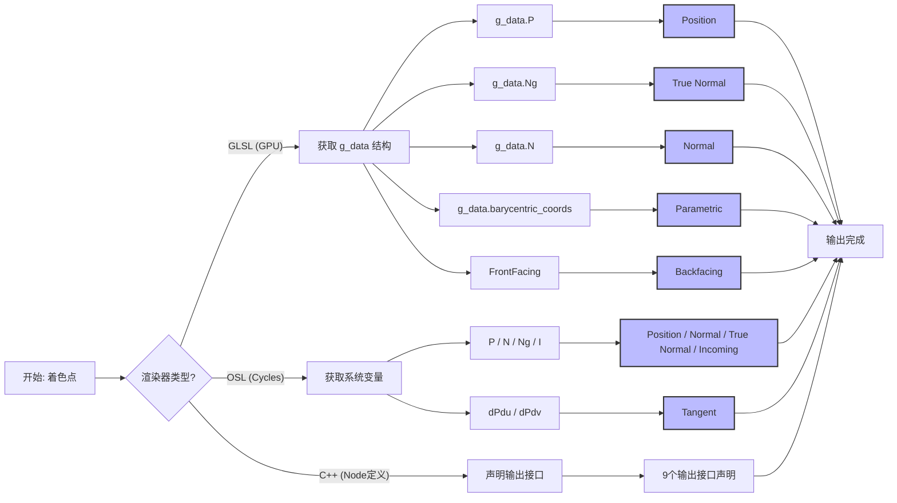

# Geometry 节点深度解析

## 文档信息
- **编号**: 011
- **创建日期**: 2025-12-18
- **主题**: geometry 节点的三个层面实现详解

---

## 概述

Geometry 节点是 Blender 着色器系统中的核心输入节点，用于获取当前着色点的几何信息。本文档深度解析 geometry 节点在三个不同层面的实现：
1. **C++ 节点定义层** (node_shader_geometry.cc)
2. **GPU GLSL 着色器层** (gpu_shader_material_geometry.glsl)
3. **Cycles OSL 着色器层** (node_geometry.osl)

---

## 输出接口详解

### 1. Position（物体空间位置）

**含义**: 当前着色点在物体空间中的坐标位置。

#### C++ 层实现
```cpp
// source/blender/nodes/shader/nodes/node_shader_geometry.cc
// 第11行：声明输出接口
b.add_output<decl::Vector>("Position");
```

#### GLSL 层实现
```glsl
// source/blender/gpu/shaders/material/gpu_shader_material_geometry.glsl
// 第20行：position = g_data.P;
position = g_data.P;
```

#### OSL 层实现
```c
// intern/cycles/kernel/osl/shaders/node_geometry.osl
// 第20行：Position = P;
Position = P;
```

#### 数学公式
```
Position = P
```
其中 P 是片元着色器中的世界空间坐标，通过模型矩阵变换后得到物体空间位置。

---

### 2. Normal（平滑法线）

**含义**: 经过顶点法线插值后的平滑表面法线。

#### C++ 层实现
```cpp
// source/blender/nodes/shader/nodes/node_shader_geometry.cc
// 第12行：声明输出接口
b.add_output<decl::Vector>("Normal");
```

#### GLSL 层实现
```glsl
// source/blender/gpu/shaders/material/gpu_shader_material_geometry.glsl
// 第21行：normal = g_data.N;
normal = g_data.N;

// 在 eevee_surf_lib.glsl 中的初始化：
g_data.N = safe_normalize(interp.N);  // 第66行
```

#### OSL 层实现
```c
// intern/cycles/kernel/osl/shaders/node_geometry.osl
// 第21行：Normal = N;
Normal = N;
```

#### 数学公式
```
Normal = N = normalize(interpolated_vertex_normals)
```

---

### 3. True Normal（原始法线）

**含义**: 未经平滑处理的原始几何法线（面法线）。

#### C++ 层实现
```cpp
// source/blender/nodes/shader/nodes/node_shader_geometry.cc
// 第14行：声明输出接口
b.add_output<decl::Vector>("True Normal");
```

#### GLSL 层实现
```glsl
// source/blender/gpu/shaders/material/gpu_shader_material_geometry.glsl
// 第22行：true_normal = g_data.Ng;
true_normal = g_data.Ng;

// 在 eevee_surf_lib.glsl 中的计算：
#ifdef GPU_FRAGMENT_SHADER
g_data.Ng = safe_normalize(cross(gpu_dfdx(g_data.P), gpu_dfdy(g_data.P)));  // 第86行
#endif
```

#### OSL 层实现
```c
// intern/cycles/kernel/osl/shaders/node_geometry.osl
// 第22行：TrueNormal = Ng;
TrueNormal = Ng;
```

#### 数学公式
```
True Normal = Ng = normalize(∂P/∂u × ∂P/∂v)
```
使用屏幕空间导数计算，忽略顶点法线插值。

---

### 4. Tangent（切线）

**含义**: 与法线垂直的切向量，通常用于各向异性着色。

#### C++ 层实现
```cpp
// source/blender/nodes/shader/nodes/node_shader_geometry.cc
// 第13行：声明输出接口
b.add_output<decl::Vector>("Tangent");
```

#### GLSL 层实现
```glsl
// source/blender/gpu/shaders/material/gpu_shader_material_geometry.glsl
// 第24-30行：复杂的切线计算逻辑
if (g_data.is_strand) {
  tangent = g_data.curve_T;
}
else {
  tangent_orco_z(orco_attr, orco_attr);
  node_tangent(orco_attr, tangent);
}

// node_tangent 函数实现：
void node_tangent(float3 orco, out float3 T)
{
  direction_transform_object_to_world(orco, T);
  T = cross(g_data.N, normalize(cross(T, g_data.N)));
}
```

#### OSL 层实现
```c
// intern/cycles/kernel/osl/shaders/node_geometry.osl
// 第42-52行：使用生成坐标或表面导数
if (!(IsCurve || IsPoint) && getattribute("geom:generated", generated)) {
  normal data = normal(-(generated[1] - 0.5), (generated[0] - 0.5), 0.0);
  vector T = transform("object", "world", data);
  Tangent = cross(Normal, normalize(cross(T, Normal)));
}
else {
  Tangent = normalize(dPdu);
}
```

#### 数学公式
**基于UV坐标**:
```
T = normalize(dP/du)
```

**基于生成坐标**:
```
T = cross(N, normalize(cross(T_obj, N)))
```
其中 T_obj 是从对象空间变换的世界切线。

---

### 5. Incoming（入射方向）

**含义**: 指向观察者的单位向量（从表面指向摄像机）。

#### C++ 层实现
```cpp
// source/blender/nodes/shader/nodes/node_shader_geometry.cc
// 第15行：声明输出接口
b.add_output<decl::Vector>("Incoming");
```

#### GLSL 层实现
```glsl
// source/blender/gpu/shaders/material/gpu_shader_material_geometry.glsl
// 第19行：处理透视/正交投影
incoming = coordinate_incoming(g_data.P);

// coordinate_incoming 实现 (eevee_nodetree_lib.glsl):
float3 coordinate_incoming(float3 P)
{
#ifdef MAT_GEOM_WORLD
  return -P;  // 环境贴图模式
#else
  return drw_world_incident_vector(P);  // 透视模式
#endif
}

// drw_world_incident_vector 实现 (draw_view_lib.glsl):
float3 drw_world_incident_vector(float3 P)
{
  return drw_view_is_perspective() ?
         normalize(drw_view_position() - P) :
         drw_view_forward();
}
```

#### OSL 层实现
```c
// intern/cycles/kernel/osl/shaders/node_geometry.osl
// 第23行：Incoming = I;
Incoming = I;
```

#### 数学公式
**透视模式**:
```
Incoming = normalize(Camera_Position - P)
```

**正交模式**:
```
Incoming = View_Forward_Direction
```

---

### 6. Parametric（参数化坐标）

**含义**: 表面上的参数化坐标（UV坐标），可用于遮罩计算。

#### C++ 层实现
```cpp
// source/blender/nodes/shader/nodes/node_shader_geometry.cc
// 第16行：声明输出接口
b.add_output<decl::Vector>("Parametric");
```

#### GLSL 层实现
```glsl
// source/blender/gpu/shaders/material/gpu_shader_material_geometry.glsl
// 第32行：使用重心坐标
parametric = float3(g_data.barycentric_coords, 0.0f);

// 在 eevee_surf_lib.glsl 中的初始化：
g_data.barycentric_coords = float2(0.0f);
#ifdef GPU_FRAGMENT_SHADER
// 对于 mesh：
g_data.barycentric_coords = gpu_BaryCoord.xy;
#endif
```

#### OSL 层实现
```c
// intern/cycles/kernel/osl/shaders/node_geometry.osl
// 第24行：使用UV坐标
Parametric = point(1.0 - u - v, u, 0.0);
```

#### 数学公式
**GLSL (重心坐标)**:
```
Parametric = (1 - u - v, u, 0)
```
其中 (u,v) 是三角形的重心坐标。

**OSL (UV坐标)**:
```
Parametric = (1 - u - v, u, 0)
```

---

### 7. Backfacing（背面标记）

**含义**: 标记当前着色点是否位于物体背面（0=正面，1=背面）。

#### C++ 层实现
```cpp
// source/blender/nodes/shader/nodes/node_shader_geometry.cc
// 第17行：声明输出接口
b.add_output<decl::Float>("Backfacing");
```

#### GLSL 层实现
```glsl
// source/blender/gpu/shaders/material/gpu_shader_material_geometry.glsl
// 第33行：使用内置变量
backfacing = (FrontFacing) ? 0.0f : 1.0f;

// FrontFacing 在 eevee_surf_lib.glsl 第84-85行：
g_data.N = (gl_FrontFacing) ? g_data.N : -g_data.N;
```

#### OSL 层实现
```c
// intern/cycles/kernel/osl/shaders/node_geometry.osl
// 第25行：使用OSL内置函数
Backfacing = backfacing();
```

#### 数学公式
```
Backfacing = (N · V < 0) ? 1 : 0
```
其中 N 是法线，V 是视线方向。如果法线与视线方向夹角大于90度，则为背面。

---

### 8. Pointiness（曲率）

**含义**: 基于顶点位置的曲率分析，用于边缘磨损等效果。

#### C++ 层实现
```cpp
// source/blender/nodes/shader/nodes/node_shader_geometry.cc
// 第18行：声明输出接口
b.add_output<decl::Float>("Pointiness");
```

#### GLSL 层实现
```glsl
// source/blender/gpu/shaders/material/gpu_shader_material_geometry.glsl
// 第34行：占位值
pointiness = 0.5f;

// 注意：GLSL实现目前为占位符，实际计算在Cycles中
```

#### OSL 层实现
```c
// intern/cycles/kernel/osl/shaders/node_geometry.osl
// 第54-60行：从属性获取
getattribute("geom:pointiness", Pointiness);
if (bump_offset == "dx") {
  Pointiness += Dx(Pointiness) * bump_filter_width;
}
else if (bump_offset == "dy") {
  Pointiness += Dy(Pointiness) * bump_filter_width;
}
```

#### 数学公式（拉普拉斯曲率）
```
Pointiness = Σ(w_i * (P - P_i))
```
其中：
- P 是当前顶点位置
- P_i 是相邻顶点位置
- w_i 是权重系数

或者更精确的拉普拉斯曲率：
```
K = (2/A) * Σ(cot(α_i) + cot(β_i)) * (P - P_i) / |P - P_i|
```

---

### 9. Random Per Island（隔离岛随机值）

**含义**: 为每个独立的UV隔离岛分配相同的随机值。

#### C++ 层实现
```cpp
// source/blender/nodes/shader/nodes/node_shader_geometry.cc
// 第19行：声明输出接口
b.add_output<decl::Float>("Random Per Island");
```

#### GLSL 层实现
```glsl
// source/blender/gpu/shaders/material/gpu_shader_material_geometry.glsl
// 第35行：占位值
random_per_island = 0.0f;

// 注意：GLSL实现目前为占位符，实际计算在Cycles中
```

#### OSL 层实现
```c
// intern/cycles/kernel/osl/shaders/node_geometry.osl
// 第62行：从属性获取
getattribute("geom:random_per_island", RandomPerIsland);
```

#### 数学公式（哈希计算）
```
RandomPerIsland = hash(island_id)
```

哈希函数通常使用：
```
float hash(uint x) {
  x = (x ^ 61) ^ (x >> 16);
  x *= 9;
  x = x ^ (x >> 4);
  x *= 0x27d4eb2d;
  x = x ^ (x >> 15);
  return float(x) * (1.0 / 4294967296.0);
}
```

---

## 三层实现对比表格

| 输出接口 | C++层 | GLSL层 | OSL层 | 源数据 |
|---------|-------|--------|-------|---------|
| **Position** | 声明输出 | g_data.P | P | 光栅化坐标 |
| **Normal** | 声明输出 | g_data.N | N | 插值法线 |
| **True Normal** | 声明输出 | g_data.Ng | Ng | 导数计算/面法线 |
| **Tangent** | 声明输出 | 复杂计算 | dPdu / UV变换 | UV导数/生成坐标 |
| **Incoming** | 声明输出 | coordinate_incoming() | I | 视线向量 |
| **Parametric** | 声明输出 | barycentric_coords | (1-u-v, u, 0) | UV/重心坐标 |
| **Backfacing** | 声明输出 | FrontFacing | backfacing() | 面朝向判断 |
| **Pointiness** | 声明输出 | 0.5 (占位) | geom:pointiness | 顶点曲率 |
| **Random Per Island** | 声明输出 | 0.0 (占位) | geom:random_per_island | UV隔离岛哈希 |

---

## 计算流程图



---

## 关键数据结构详解

### GLSL 中的 g_data 结构

根据 `eevee_surf_lib.glsl`，`g_data` 包含：

```glsl
struct ShaderData {
  float3 P;              // 世界空间位置
  float3 Ni;             // 插值法线（未归一化）
  float3 N;              // 归一化法线
  float3 Ng;             // 几何法线（导数计算）
  bool is_strand;        // 是否为毛发
  float3 curve_T;        // 曲线切线
  float3 curve_B;        // 曲线副法线
  float3 curve_N;        // 曲线法线
  float hair_diameter;   // 毛发直径
  int hair_strand_id;    // 毛发ID
  float2 barycentric_coords; // 重心坐标
  float3 barycentric_dists;  // 重心距离
  float ray_type;        // 射线类型
  float ray_depth;       // 射线深度
  float ray_length;      // 射线长度
};
```

---

## 特殊情况处理

### 1. 毛发/曲线支持
```glsl
if (g_data.is_strand) {
  tangent = g_data.curve_T;  // 使用曲线切线
}
```

### 2. 坐标空间适配
```glsl
// 环境贴图 vs 透视投射
float3 coordinate_incoming(float3 P) {
#ifdef MAT_GEOM_WORLD
  return -P;  // 球面环境
#else
  return drw_world_incident_vector(P);  // 透视
#endif
}
```

### 3. 法线翻转处理
```glsl
g_data.N = (gl_FrontFacing) ? g_data.N : -g_data.N;
g_data.Ng = (uniform_buf.pipeline.is_main_view_inverted) ? -g_data.Ng : g_data.Ng;
```

---

## 性能优化要点

1. **条件计算优化** (node_shader_geometry.cc 第28-32行):
   ```cpp
   if (out[5].hasoutput) {
     GPU_material_flag_set(mat, GPU_MATFLAG_BARYCENTRIC);
   }
   ```

2. **属性延迟加载** (第35行):
   ```cpp
   GPU_attribute(mat, CD_ORCO, "") : GPU_constant(val);
   ```

3. **向量归一化** (第46-55行):
   ```cpp
   if (ELEM(i, 1, 2, 4)) {  // Normal, Tangent, Incoming
     GPU_link(mat, "vector_math_normalize", ...);
   }
   ```

---

## 交叉引用

### GLSL 依赖文件
- `gpu_shader_material_tangent.glsl` - 切线计算
- `eevee_surf_lib.glsl` - g_data 结构定义
- `draw_view_lib.glsl` - 视图相关函数
- `eevee_nodetree_lib.glsl` - 坐标转换函数

### OSL 依赖文件
- `stdcycles.h` - Cycles标准库
- 依赖 `getattribute()` 获取几何属性

### C++ 依赖文件
- `node_shader_util.hh` - 节点工具函数
- GPU 链接系统

---

## 总结

Geometry 节点在三个层面的实现体现了不同的设计哲学：

1. **C++ 层**: 专注于节点接口定义和GPU状态管理
2. **GLSL 层**: 实时渲染友好，使用硬件特性（导数、重心坐标）
3. **OSL 层**: 物理精确，支持复杂的离线渲染计算

核心差异：
- **实时渲染 (GLSL)**: 使用重心坐标、屏幕空间导数
- **离线渲染 (OSL)**: 使用UV坐标、精确几何属性
- **缺失功能**: Pointiness 和 Random Per Island 在实时渲染中目前为占位符

理解这些差异对于编写跨渲染器兼容的着色器至关重要。