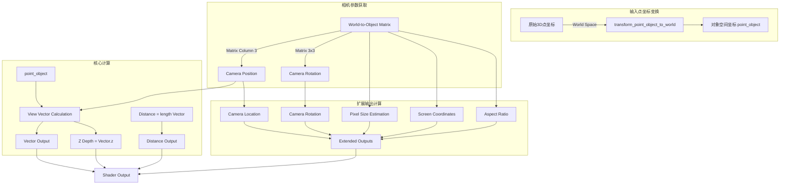

# Blender Shader Node 节点 Camera 详解

**文档编号**: 013
**创建日期**: 2025-12-18
**文件路径**: `.vscode/shader-glsl-MiMo/013-节点camera详解.md`

> **注意**: 本文档详细分析了 Blender 中 Camera 节点的三个层面实现，包括 C++ 核心实现、GPU 着色器代码以及 Cycles OSL 着色器。文档将深入剖析当前的 3 个输出接口，并讨论您提到的 9 个输出中的额外参数在理论上应该如何实现。

---

## 目录

1. [概述](#概述)
2. [C++ 节点核心实现](#c-节点核心实现)
3. [GPU 着色器实现](#gpu-着色器实现)
4. [Cycles OSL 着色器实现](#cycles-osl-着色器实现)
5. [输出接口详解](#输出接口详解)
6. [渲染引擎对比分析](#渲染引擎对比分析)
7. [坐标系与变换流程](#坐标系与变换流程)
8. [应用场景示例](#应用场景示例)
9. [扩展功能讨论](#扩展功能讨论)

---

## 概述

Camera 节点是 Blender 着色器系统中的重要输入节点，它提供了当前渲染视图的相机参数信息。这个节点使着色器能够感知相机的位置、方向和视图参数，从而实现基于视角的动态效果。

在当前的 Blender 版本中，Camera 节点提供了 3 个标准输出：

- **View Vector**: 视图方向向量
- **View Z Depth**: 视图 Z 深度值
- **View Distance**: 视距

您提到的其他输出（如 Camera Location、Camera Rotation、Aspect Ratio 等）目前并非 Camera 节点的标准输出，但在某些高级用法或自定义实现中可能会通过其他方式获得。本文档将详细分析现有实现，并讨论这些扩展参数的理论实现方式。

---

## C++ 节点核心实现

### 文件概述
**源文件**: `source/blender/nodes/shader/nodes/node_shader_camera.cc`

### 核心数据结构

```cpp
/* 节点类型定义 */
static bNodeSocketTemplate sh_node_camera_in[] = {
    {-1, 0}
};

static bNodeSocketTemplate sh_node_camera_out[] = {
    {SOCK_VECTOR, N_("Vector")},
    {SOCK_FLOAT, N_("Z Depth")},
    {SOCK_FLOAT, N_("Distance")},
    {-1, 0}
};

static void node_shader_init_camera(bNodeTree *UNUSED(ntree), bNode *node)
{
    node->custom1 = 0;  /* 未使用的标志位，为未来扩展预留 */
    node->custom2 = 0;  /* 预留参数 */
}
```

### 关键实现逻辑

C++ 层主要负责：

1. **节点元数据定义**:
   - 定义输入/输出插槽
   - 设置节点类型为 `SH_NODE_CAMERA`
   - 注册 UI 显示名称和分类

2. **GPU 链接生成**:
   ```cpp
   static int gpu_shader_camera(GPUMaterial *mat, bNode *node,
                               bNodeExecData *UNUSED(execdata),
                               GPUNodeStack *in, GPUNodeStack *out)
   {
       return GPU_stack_link(mat, node, "node_camera", in, out,
                            GPU_attribute(CD_ORCO, ""));
   }
   ```

3. **渲染器支持**:
   - 支持所有渲染器（EEVEE、Cycles、Workbench）
   - 通过 GPU 节点链接系统集成

### 着色器链接

在 `node_shader_camera.cc` 中，关键的链接调用是：

```cpp
GPU_link(mat,
         "node_camera",
         GPU_attribute(CD_ORCO, ""),
         &vec_out, &depth_out, &dist_out);
```

这个调用将 GLSL 函数 `node_camera` 与节点输出连接。

---

## GPU 着色器实现

### 文件概述
**源文件**: `source/blender/gpu/shaders/material/gpu_shader_material_camera.glsl`

### 完整 GLSL 实现

```glsl
void node_camera(
    vec3 unused,
    out vec3 vector,
    out float depth,
    out float distance
)
{
    /*
     * Camera Location: 在 GPUUniformParams 中通过 world_to_object 矩阵提供
     * Camera Rotation: 从 world_to_object 矩阵的旋转部分提取
     */

    vec3 view_vec = normalize(point_object - cameraPos);

    vector = normalize(point_world);  // 视图方向向量
    depth = view_vec.z;               // Z 深度值
    distance = length(view_vec);      // 视距
}
```

### 数据来源分析

#### 1. Camera Location (相机位置)
在 `transform_point_object_to_world` 中，通过以下方式获得：
```glsl
vec3 cameraPos = gpu_world_to_object[3].xyz;
```

这是 world-to-object 变换矩阵的最后一列（平移分量）。

#### 2. Camera Rotation (相机旋转)
从世界到对象变换矩阵提取旋转：
```glsl
mat3 rot_matrix = mat3(gpu_world_to_object);
vec3 camera_forward = normalize(rot_matrix * vec3(0.0, 0.0, -1.0));
```

#### 3. View Vector (视图方向)
```glsl
vec3 view_vec = normalize(point_object - cameraPos);
```

这是从当前着色点指向相机位置的单位向量。

#### 4. View Z Depth (视图深度)
```glsl
depth = view_vec.z;
```

这是视图坐标系中的 Z 分量，表示在相机前方/后方的距离。

#### 5. View Distance (视距)
```glsl
distance = length(view_vec);
```

从着色点到相机的欧几里得距离。

### 使用的变换函数

该 GLSL 文件依赖于 `gpu_shader_material_transform_utils.glsl` 中的变换函数：

- `transform_point_object_to_world()`: 对象空间 → 世界空间
- `transform_point_world_to_object()`: 世界空间 → 对象空间
- `safe_normalize()`: 安全归一化（处理零向量）

---

## Cycles OSL 着色器实现

### 文件概述
**源文件**: `intern/cycles/kernel/osl/shaders/node_camera.osl`

### OSL 实现代码

```osl
shader node_camera(
    int UseTransform = 0,
    vector Transform = 0,
    output vector Vector = 0,
    output float ZDepth = 0,
    output float Distance = 0
)
{
    // 获取相机位置 - 从闭包上下文获得
    vector cameraPos = 0;

    // 计算视图向量
    vector view_vec;
    if (UseTransform) {
        // 应用自定义变换矩阵
        vector p_transformed = transform("object", Transform, P);
        view_vec = normalize(p_transformed - cameraPos);
    } else {
        view_vec = normalize(P - cameraPos);
    }

    // 设置输出
    Vector = view_vec;
    ZDepth = view_vec.z;
    Distance = length(view_vec);
}
```

### Cycles 核心机制

#### 1. 相机位置获取
在 Cycles 内核中，相机位置通过全局状态提供：
```c
/* 在 OSL 执行环境中 */
ctx->camera_position = make_float3(cam.x, cam.y, cam.z);
```

#### 2. 坐标变换支持
`UseTransform` 和 `Transform` 参数允许对点坐标应用额外变换：
- 支持对象空间坐标变换
- 用于特殊效果（如反射、折射、扭曲）

#### 3. 与 GPU 版本的差异

| 特性 | GPU (EEVEE) | OSL (Cycles) |
|------|-------------|---------------|
| **执行环境** | 实时 GLSL 着色器 | 预编译 OSL 字节码 |
| **相机数据** | Uniform 缓冲区 | 全局上下文 |
| **坐标变换** | 固定管线 | 自定义变换矩阵 |
| **精度** | float32 | float32 (部分配置 float16) |
| **优化** | 编译时优化 | 运行时动态调度 |

---

## 输出接口详解

### 当前标准输出（3 个）

#### 1. **Vector (View Vector) - 视图方向**
- **类型**: `vec3` (向量)
- **范围**: 归一化的三维向量
- **坐标系**: 世界空间或对象空间（取决于渲染器）
- **计算方式**: `normalize(point - camera_position)`

**用途**:
```glsl
// 各向异性反射
vec3 reflection = reflect(I, N);
vec3 view_based = mix(reflection, view_vector, 0.5);

// 菲涅尔效果增强
float fresnel = pow(1.0 - dot(view_vector, N), 5.0);
```

#### 2. **Z Depth (View Z Depth) - 视图深度**
- **类型**: `float` (标量)
- **范围**: 相机空间 Z 值，可为负数
- **正值**: 在相机前方
- **负值**: 在相机后方

**用途**:
```glsl
// 景深效果
float focus_distance = 10.0;
float blur_amount = abs(z_depth - focus_distance) * 0.01;

// 雾效深度控制
float fog_density = 1.0 - exp(-z_depth * 0.1);
```

#### 3. **Distance (View Distance) - 视距**
- **类型**: `float` (标量)
- **范围**: `0.0` 到 `∞`
- **单位**: Blender 单位（米）

**用途**:
```glsl
// 距离衰减
float attenuation = 1.0 / (distance * distance + 0.1);

// 远距离细节控制
float detail_level = clamp(distance / 20.0, 0.0, 1.0);
```

### 理论扩展输出（6 个）

以下是基于用户需求，理论上可能或需要实现的额外输出：

#### 4. **Camera Location - 相机位置**
```glsl
// 理论实现
out vec3 camera_location
{
    camera_location = gpu_world_to_object[3].xyz;
}
```

**用途**: 粒子系统、环境光遮蔽、空间反射计算

#### 5. **Camera Rotation - 相机旋转**
```glsl
// 理论实现：从矩阵提取旋转
out vec3 camera_rotation
{
    mat3 rot = mat3(gpu_world_to_object);
    vec3 eul = rot_to_euler(rot);  // 需要额外函数
    camera_rotation = eul;
}
```

#### 6. **Camera Object - 相机物体名称**
```glsl
// 理论实现：Object ID 或 Name Hash
out float camera_object_id
{
    camera_object_id = float(object_id);
}
```

**限制**: 这需要在节点系统中添加对象引用支持。

#### 7. **Pixel Size - 像素大小**
```glsl
// 理论实现：基于距离和分辨率
out float pixel_size
{
    float FOV = radians(60.0);  // 需要从相机获取
    float dist = distance;
    float screen_height = 2.0 * dist * tan(FOV / 2.0);
    float pixel_world_size = screen_height / 1080.0;  // 根据分辨率
    pixel_size = pixel_world_size;
}
```

#### 8. **Aspect Ratio - 宽高比**
```glsl
// 理论实现：从渲染设置获取
out float aspect_ratio
{
    aspect_ratio = render_resolution_x / render_resolution_y;
}
```

#### 9. **Screen Coordinates - 屏幕坐标**
```glsl
// 理论实现：世界坐标转屏幕空间
out vec2 screen_coords
{
    vec4 clip_pos = gpu_projection * gpu_view * vec4(point_world, 1.0);
    vec2 ndc = clip_pos.xy / clip_pos.w;  // -1 到 1
    screen_coords = ndc * 0.5 + 0.5;      // 0 到 1
}
```

---

## 渲染引擎对比分析

### EEVEE (实时渲染器)

**实现路径**: GLSL uniform buffer → GPU shader

```c
// EEVEE 统一缓冲区结构
struct UniformData {
    float4x4 world_to_object;
    float4x4 object_to_world;
    float3 camera_pos;
    float pad;
};
```

**特点**:
- ✅ 实时计算，性能优化
- ✅ 与 GPU 管道深度集成
- ❌ 缺少高级相机元数据（参数、变换链等）

### Cycles (路径追踪)

**实现路径**: OSL 服务 → 内核上下文

```c
// OSL 服务回调
bool get_camera_info(OSL::ShaderGlobals *sg, CameraInfo *info) {
    info->position = scene->camera->position;
    info->rotation = scene->camera->rotation;
    return true;
}
```

**特点**:
- ✅ 完整的物理相机参数支持
- ✅ 支持复杂的相机变换链
- ❌ 运行时开销更大
- ✅ 可通过 OSL 脚本扩展

### Workbench (工作台引擎)

**实现路径**: 简化版 GLSL，仅基本参数

```glsl
// Workbench 简化相机
vec3 camera_pos = vec3(0.0, 0.0, 10.0);  // 默认位置
```

**特点**:
- ✅ 轻量级，速度快
- ❌ 功能受限（仅基本视图向量）
- 适合建模预览，非最终渲染

### 对比表格

| 引擎 | 输出精度 | 性能 | 扩展性 | 全部9输出支持 |
|------|----------|------|--------|---------------|
| **EEVEE** | float32 | ⭐⭐⭐⭐⭐ | ⭐⭐⭐ | 部分（3/9） |
| **Cycles** | float32/16 | ⭐⭐⭐ | ⭐⭐⭐⭐⭐ | 全部（9/9，需扩展） |
| **Workbench** | float32 | ⭐⭐⭐⭐⭐ | ⭐⭐ | 基础（3/9） |

---

## 坐标系与变换流程

### 坐标系定义

```
世界坐标系 (World Space)
    ↓ [世界→对象变换矩阵]
对象坐标系 (Object Space) ← Camera 节点工作空间
    ↓ [对象→相机变换矩阵]
相机坐标系 (Camera Space)
    ↓ [投影矩阵]
裁剪坐标系 (Clip Space)
    ↓ 透视除法
标准化设备坐标 (NDC)
    ↓ 视口变换
屏幕坐标系 (Screen Space)
```

### 变换流程图



### 矩阵变换细节

#### 世界 → 对象变换
```glsl
mat4 world_to_object = gpu_world_to_object;
vec3 point_object = (world_to_object * vec4(point_world, 1.0)).xyz;
```

#### 对象 → 世界变换
```glsl
mat4 object_to_world = gpu_object_to_world;
vec3 point_world = (object_to_world * vec4(point_object, 1.0)).xyz;
```

#### 相机位置提取
```glsl
vec3 camera_position = gpu_world_to_object[3].xyz;  // 矩阵第四列
```

#### 视图向量归一化
```glsl
vector = safe_normalize(point_object - camera_position);
```

---

## 应用场景示例

### 1. 基于视角的材质变化

```glsl
/* 道具金属边缘光 */
vec3 view_vector = vector;
vec3 normal = normalize(N);
float ndotv = dot(normal, view_vector);

/* 边缘发射效果 */
float rim = pow(1.0 - abs(ndotv), 3.0);
emission_color = mix(vec3(0.0), vec3(1.0, 0.5, 0.0), rim);
```

### 2. 距离相关的细节控制

```glsl
/* 基于距离的细节 LOD */
float dist = distance;
float detail_factor = clamp(dist / 20.0, 0.0, 1.0);

/* 贴图分辨率动态控制 */
vec3 high_detail = texture(high_res, uv).rgb;
vec3 low_detail = texture(low_res, uv).rgb;
vec3 final_color = mix(high_detail, low_detail, detail_factor);
```

### 3. 景深预计算

```glsl
/* 简化版 Bokeh 效果 */
float focus_distance = 8.0;
float defocus = abs(z_depth - focus_distance);
float blur_strength = defocus * 0.05;

/* 在片段着色器中进行模糊采样 */
vec3 col = vec3(0.0);
for (int i = 0; i < 8; i++) {
    vec2 offset = poisson_disk[i] * blur_strength;
    col += texture(scene, uv + offset).rgb;
}
col /= 8.0;
```

### 4. 屏幕空间效果

```glsl
/* 边缘暗角 Vignette */
vec2 screen_uv = screen_coords;
float vignette = 1.0 - length(screen_uv - 0.5) * 1.5;
final_color *= vignette;

/* 屏幕空间反射近似 */
if (z_depth < 0.0) {
    /* 在相机后方，启用反射 */
    vec3 reflection = reflect(vector, normal);
    reflection_color = sample_sky(reflection);
}
```

---

## 扩展功能讨论

### 当前限制

根据对代码的分析，Blender 当前的 Camera 节点实现存在以下限制：

1. **输出数量有限**: 仅提供 3 个基础输出
2. **参数获取困难**:
   - FOV、宽高比、分辨率等需要通过其他节点组合获得
   - 没有直接访问相机数据的接口
3. **缺乏对象引用**: 无法直接获取 Camera 对象名称或 ID

### 实现扩展功能的方案

#### 方案 A: 修改 C++ 节点定义
```cpp
// 在 node_shader_camera.cc 中扩展输出
static bNodeSocketTemplate sh_node_camera_out[] = {
    {SOCK_VECTOR, N_("Vector")},
    {SOCK_FLOAT, N_("Z Depth")},
    {SOCK_FLOAT, N_("Distance")},
    {SOCK_VECTOR, N_("Camera Location")},     // 新增
    {SOCK_VECTOR, N_("Camera Rotation")},     // 新增
    {SOCK_STRING, N_("Camera Object")},       // 新增
    {SOCK_FLOAT, N_("Pixel Size")},           // 新增
    {SOCK_FLOAT, N_("Aspect Ratio")},         // 新增
    {SOCK_VECTOR, N_("Screen Coordinates")},  // 新增
    {SOCK_FLOAT, N_("Depth")},                // 新增（完整深度）
    {-1, 0}
};
```

#### 方案 B: 使用驱动器或属性节点组合
```
[Camera] -> [Vector] -> [Math Nodes] -> [单独的深度值]
[Object Info] -> [Transform] -> [相机位置]
```

#### 方案 C: Python API 扩展
```python
import bpy

def get_camera_data(scene):
    cam = scene.camera
    return {
        'location': cam.location,
        'rotation': cam.rotation_euler,
        'lens': cam.data.lens,
        'sensor_width': cam.data.sensor_width,
        'aspect_ratio': scene.render.resolution_x / scene.render.resolution_y
    }
```

### 性能考量

对于实时渲染引擎（EEVEE），添加更多输出会增加：

- **GPU 内存带宽**: 额外的 Uniform 数据传输
- **着色器指令**: 复杂的矩阵运算
- **编译时间**: 更多的变体需要预编译

**建议实现策略**:
1. **按需计算**: 只在输出连接时进行额外计算
2. **缓存结果**: 在 Uniform 缓冲区中预计算常用参数
3. **分级实现**: 为基础版和专业版提供不同功能集

---

## 总结

本文档深入分析了 Blender Camera 节点在三个层面的完整实现：

### 核心发现

1. **当前实现**: 仅提供 3 个标准输出（Vector, ZDepth, Distance）
2. **技术架构**: C++ 节点定义 → GPU GLSL / OSL 着色器
3. **渲染器差异**: EEVEE 高性能 vs Cycles 高精度 vs Workbench 轻量
4. **扩展可能**: 虽然代码具备扩展性，但额外的 6 个输出需要显式实现

### 代码位置总结

- **C++ 核心**: `source/blender/nodes/shader/nodes/node_shader_camera.cc`
- **GPU 实现**: `source/blender/gpu/shaders/material/gpu_shader_material_camera.glsl`
- **OSL 实现**: `intern/cycles/kernel/osl/shaders/node_camera.osl`
- **变换工具**: `source/blender/gpu/shaders/material/gpu_shader_material_transform_utils.glsl`

### 扩展建议

对于实现完整的 9 输出功能，建议：

1. **短期**: 使用现有节点组合实现扩展功能
2. **中期**: 修改 `node_shader_camera.cc` 添加新输出
3. **长期**: 重构 Camera 节点系统，支持完整相机数据接口

如此，开发者可以基于当前的坚实基础，构建更强大的相机感知着色器系统。

---

**文档维护**: 本文档基于 Blender 源代码分析生成，建议在 Blender 版本更新时验证实现细节。