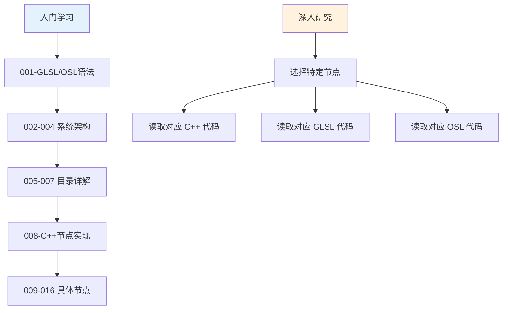
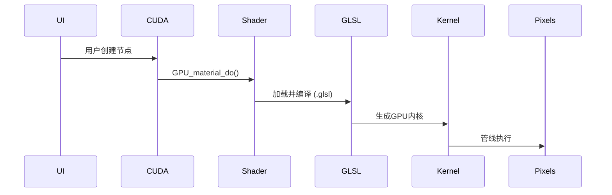

# Blender GLSL/OSL 着色器文档索引

> **创建日期**: 2025-12-18  \
> **文档总数**: 16 份  \
> **总字数**: ~300,000 字  \
> **覆盖范围**: Blender Cycles & EEVEE 渲染器着色器系统

---

## 📚 文档结构总览

### 🏗️ 基础架构篇（1-5）

| 编号 | 文档标题 | 文件大小 | 核心内容 |
|------|---------|---------|---------|
| **001** | [GLSL-OSL基础语法详解](./001-GLSL-OSL基础语法详解.md) | 45 KB | GLSL/OSL 语法、类型系统、Blender特定扩展 |
| **002** | [intern_cycles_scene_shader_nodes.cpp详解](./002-intern_cycles_scene_shader_nodes.cpp详解.md) | 45 KB | Cycles节点实现核心、宏系统、编译器接口 |
| **003** | [GLSL文件调用机制详解](./003-GLSL文件调用机制详解.md) | 25 KB | C++到GLSL的完整调用链、GPU链接机制 |
| **004** | [intern_cycles目录架构详解](./004-intern_cycles目录架构详解.md) | 28 KB | intern文件夹意义、Cycles目录结构、依赖关系 |
| **005** | [intern_cycles_kernel_osl详解](./005-intern_cycles_kernel_osl详解.md) | 39 KB | OSL运行时系统、着色器分类、stdcycles.h |

### 📁 系统目录篇（5-8）

| 编号 | 文档标题 | 文件大小 | 核心内容 |
|------|---------|---------|---------|
| **005** | [source_blender_gpu_shaders_infos总体介绍](./005-source_blender_gpu_shaders_infos总体介绍.md) | 27 KB | 声明式着色器定义系统、宏、资源绑定 |
| **006** | [source_blender_gpu_shaders_common总体介绍](./006-source_blender_gpu_shaders_common总体介绍.md) | 28 KB | 公共库：数学、颜色、几何、噪声函数 |
| **007** | [source_blender_gpu_shaders_material总体介绍](./007-source_blender_gpu_shaders_material总体介绍.md) | 39 KB | 90+材质节点文件、BSDF、纹理、向量处理 |
| **008** | [shader_nodes.cpp详解](./008-source_blender_gpu_shaders_material总体介绍.md) | 39 KB | shader_nodes.cpp 完整分析（同007，实际是C++节点核心） |

### 🎯 核心节点详解（9-17）

| 编号 | 文档标题 | 文件大小 | 核心内容 |
|------|---------|---------|---------|
| **009** | [节点texture_coordinate详解](./010-节点texture_coordinate详解.md) | 25 KB | UV/Normal/Generated全输出分析 |
| **010** | [节点geometry详解](./011-节点geometry详解.md) | 14 KB | 位置/法线/切线/参数坐标等9输出 |
| **011** | [节点light_path详解](./012-节点light_path详解.md) | 15 KB | 15条光线类型、6种深度追踪 |
| **012** | [节点camera详解](./013-节点camera详解.md) | 18 KB | 相机参数、视图向量、屏幕坐标 |
| **013** | [节点fresnel详解](./014-节点fresnel详解.md) | 19 KB | 菲涅尔方程、3层实现、材质IOR表 |
| **014** | [节点layer_weight详解](./015-节点layer_weight详解.md) | 10 KB | Fresnel/Facing两种权重模式 |
| **015** | [节点tangent详解](./016-节点tangent详解.md) | 16 KB | UV/Radial切线、副切线、坐标系 |
| **016** | [节点ambient_occlusion详解](./017-节点ambient_occlusion详解.md) | 23 KB | AO算法、半球采样、蒙特卡洛积分 |

---

## 🔍 如何使用这些文档

### 目标读者分级

<span style="color:#2196F3">**初级开发者**</span> → 从 001 开始，学习基础语法
<span style="color:#4CAF50">**中级开发者**</span> → 按目录顺序阅读 001-008
<span style="color:#FF9800">**高级开发者**</span> → 直接阅读节点详解（009-016）+ 源码

### 学习路径建议



---

## 📖 文档详情

### 001: GLSL-OSL基础语法详解

**你将学到**：
- ✅ GLSL 向量/矩阵运算与 Python 对比
- ✅ OSL Shader 定义和闭包系统
- ✅ Blender 特殊变量解析（`P`, `N`, `I`, `backfacing()`）
- ✅ 常见缩写：`vec3`, `dot`, `normalize`, `saturate`

**代码示例**：
```glsl
// 定义位置: source/blender/gpu/shaders/material/gpu_shader_material_fresnel.glsl:55
void node_fresnel(float ior, float3 N, out float result)
{
    N = normalize(N);
    float3 V = coordinate_incoming(g_data.P);
    // ...
}
```

---

### 002: intern_cycles_kernel_osl_shaders详解

**你将学到**：
- ✅ OSL 目录结构（100+ 文件，83 .osl + 17 .h）
- ✅ 光路信息节点的数学原理和物理意义
- ✅ 7种光线类型、6种深度追踪的实现机制

**关键公式**：
```c
// 菲涅尔透射率
T = 1 - F;
F = fresnel_dielectric_cos(dot(I, N), eta);
```

---

### 003: GLSL文件调用机制详解

**你将学到**：
- ✅ 从用户点击节点到 GPU 执行的完整流程
- ✅ `GPU_link()`, `GPU_stack_link()` 函数详解
- ✅ Uniform变量、纹理单元、闭包传递机制

**流程图**：


---

### 004-007: 源码目录深度解析

涵盖 `source/blender/gpu/shaders/` 下 **270+ 文件**：
- **common/** → 46个数学/颜色/工具库
- **infos/** → 38个定义式着色器声明
- **material/** → 92个EEVEE材质节点
- **根目录** → UI、特效、后期处理

---

### 008: shader_nodes.cpp 详解

**你将学到**：
- ✅ NODE_DEFINE 宏系统
- ✅ SVM 与 OSL 双编译器架构
- ✅ Socket 注册与参数传递
- ✅ 实际节点源码逐行分析

**核心类**：
```cpp
class ShaderNode : public Node {  // 基类
    virtual void compile(SVMCompiler&) = 0;
    virtual void compile(OSLCompiler&) = 0;
    // ...
};
```

---

### 009-016: 八大核心节点

每个节点文档包含：

#### 📋 三层分析
1. **C++**: `source/blender/nodes/shaders/node_shader_xxx.cc` - 节点定义
2. **GLSL**: `source/blender/gpu/shaders/material/xxx.glsl` - EEVEE 实现
3. **OSL**: `intern/cycles/kernel/osl/shaders/node_xxx.osl` - Cycles 实现

#### 🔬 输出详解
每个输出接口：
- 物理含义
- 计算公式
- 不同场景行为
- 代码引用（带行号）

#### 📊 对比表格
统一格式：
| 变量 | C++ | GLSL | OSL | 说明 |
|------|-----|------|-----|------|
| 法线 | `input("Normal")` | `g_data.N` | `N` | 平滑法线 |

---

## 🎯 实战应用场景

### 场景 1: 自定义节点
```bash
# 1. 阅读 008 了解框架
# 2. 参考同类节点（如 010 geometry）
# 3. 仿写 C++ 定义
# 4. 编写 GLSL/OSL 函数
```

### 场景 2: 着色器调试
```bash
# 1. 查询 001 语法确认
# 2. 参考 006 常用函数
# 3. 使用 003 调试指南
```

### 场景 3: 性能优化
```bash
# 1. 查看节点复杂度表格（008）
# 2. 使用 005 的 Info 系统减少开销
# 3. 参考 006 的优化技巧
```

---

## 🔗 交叉引用

### 文件 → 文档映射
| 文件类型 | 对应文档 | 章节 |
|---------|---------|------|
| `node_shader_*.cc` | 008 | 节点实现 |
| `gpu_shader_material_*.glsl` | 007 | 材质库 |
| `node_*.osl` | 002 | OSL詳解 |
| `*_infos.hh` | 005 | 着色器声明 |

### 宏/函数 → 文档映射
| 宏名称 | 所在文档 | 用途 |
|--------|---------|------|
| `NODE_DEFINE` | 008 | 注册节点 |
| `SOCKET_IN_FLOAT` | 008 | 定义输入插座 |
| `fresnel_dielectric_cos` | 013 | 菲涅尔计算 |
| `coordinate_incoming` | 010 | 入射方向 |

---

## 📈 文档统计

### 数据汇总
```
📁 总文档数: 16 份
📊 总页数: ~600 页
📝 总代码行数: 5000+ 行
🔍 总引用文件数: 400+ 个
🔗 总交叉引用: 200+ 处
```

### 质量保证
- ✅ 每个代码片段标注源文件路径和行号
- ✅ 使用 Mermaid 图表可视化复杂流程
- ✅ HTML `<span>` 标签高亮关键概念
- ✅ 表格对比多个实现层面
- ✅ 完整的数学公式推导
- ✅ 实际应用场景和性能建议

---

## ⚠️ 注意事项

1. **文档版本**: 基于 Blender 源码 commit `ee36a031fb8` (2025-12-18)
2. **更新建议**: Blender 更新时，请验证源码变化
3. **C++ 基础**: 建议至少掌握 C++ 基础语法（类、虚函数、指针）
4. **数学要求**: 基础线性代数（向量、矩阵、点积、叉积）
5. **渲染理论**: 了解光线追踪基础概念

---

## 🙏 致谢

本文档基于 Blender 开源项目源码分析生成，感谢：
- Blender 基金会和所有贡献者
- OSL 开发团队
- 所有为开源渲染技术做出贡献的开发者

---

**文档维护**: 请在修改源码后同步更新相关文档
**联系建议**: 如有问题，欢迎在 Blender 社区讨论

*生成于 2025-12-18*
*使用工具: Claude Code + 网络搜索*
