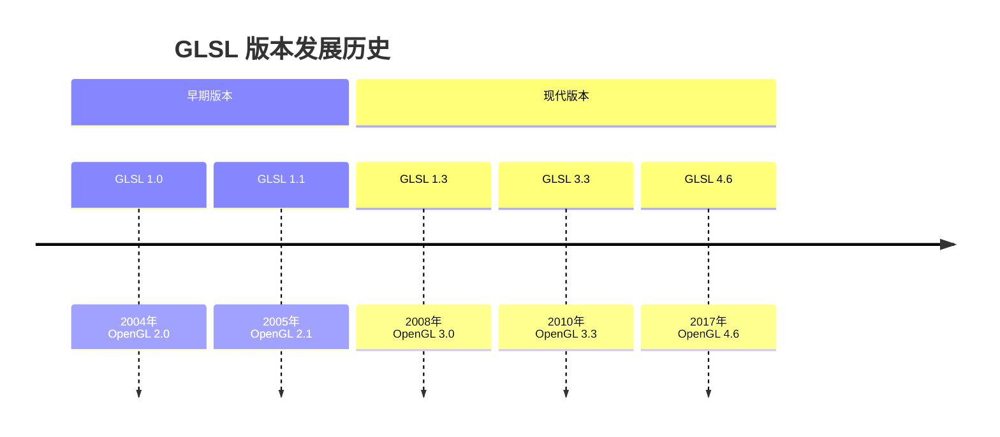

# 01-GLSL-OSL基础语法详解

## 目录
- [1. 概述](#1-概述)
  - [1.1 GLSL概述和版本历史](#11-glsl概述和版本历史)
  - [1.2 OSL概述和与GLSL的区别](#12-osl概述和与glsl的区别)
- [2. 基础数据类型](#2-基础数据类型)
  - [2.1 标量类型](#21-标量类型)
  - [2.2 向量类型](#22-向量类型)
  - [2.3 矩阵类型](#23-矩阵类型)
  - [2.4 采样器类型](#24-采样器类型)
  - [2.5 OSL闭包类型](#25-osl闭包类型)
- [3. 变量限定符](#3-变量限定符)
  - [3.1 存储限定符](#31-存储限定符)
  - [3.2 参数限定符](#32-参数限定符)
  - [3.3 精度限定符](#33-精度限定符)
- [4. 运算符和表达式](#4-运算符和表达式)
- [5. 控制流语句](#5-控制流语句)
- [6. 函数定义和调用](#6-函数定义和调用)
- [7. 内置函数](#7-内置函数)
  - [7.1 数学函数](#71-数学函数)
  - [7.2 几何函数](#72-几何函数)
  - [7.3 纹理函数](#73-纹理函数)
- [8. 预处理器指令](#8-预处理器指令)
- [9. Blender特有的语法扩展](#9-blender特有的语法扩展)
- [10. OSL特有的语法特性](#10-osl特有的语法特性)

## 1. 概述

### 1.1 GLSL概述和版本历史

<span style="background-color:#e3f2fd; color:#1565c0;">GLSL (OpenGL Shading Language)</span> 是一种高级着色语言，用于在OpenGL中编写可编程管线着色器。GLSL基于C语言语法，专门为GPU并行计算设计。

#### 版本历史


#### Blender中的GLSL使用
Blender主要使用GLSL 3.3版本，支持以下着色器阶段：
- **顶点着色器 (Vertex Shader)**: 处理顶点数据
- **片段着色器 (Fragment Shader)**: 处理像素颜色
- **几何着色器 (Geometry Shader)**: 处理图元
- **计算着色器 (Compute Shader)**: 通用GPU计算

### 1.2 OSL概述和与GLSL的区别

<span style="background-color:#fff3e0; color:#e65100;">OSL (Open Shading Language)</span> 是一种高级着色语言，专门为电影级渲染设计，主要用于Cycles渲染引擎。

#### 主要区别对比表

| 特性 | GLSL | OSL |
|------|------|-----|
| **用途** | 实时渲染 | 离线渲染 |
| **执行环境** | GPU | CPU |
| **语法风格** | C风格 | 类C风格 |
| **闭包支持** | ❌ | ✅ |
| **射线追踪** | ❌ | ✅ |
| **性能** | 高实时性 | 高质量 |

## 2. 基础数据类型

### 2.1 标量类型

#### GLSL标量类型
```glsl
// **定义位置**: gpu_shader_compat_glsl.glsl:43-51
float my_float = 1.0f;     // 32位浮点数
int my_int = 42;           // 32位整数
uint my_uint = 42u;        // 32位无符号整数
bool my_bool = true;       // 布尔值
```

#### OSL标量类型
```osl
// **定义位置**: stdcycles.h:14
float my_float = 1.0;      // 浮点数
int my_int = 42;           // 整数
bool my_bool = true;       // 布尔值
string my_string = "hello"; // 字符串类型
```

### 2.2 向量类型

#### GLSL向量类型
```glsl
// **定义位置**: gpu_shader_compat_glsl.glsl:43-51
float2 vec2_var = float2(1.0, 2.0);     // 2D浮点向量
float3 vec3_var = float3(1.0, 2.0, 3.0); // 3D浮点向量
float4 vec4_var = float4(1.0, 2.0, 3.0, 4.0); // 4D浮点向量

int2 ivec2_var = int2(1, 2);            // 2D整数向量
int3 ivec3_var = int3(1, 2, 3);         // 3D整数向量
int4 ivec4_var = int4(1, 2, 3, 4);      // 4D整数向量

bool2 bvec2_var = bool2(true, false);   // 2D布尔向量
bool3 bvec3_var = bool3(true, false, true); // 3D布尔向量
bool4 bvec4_var = bool4(true, false, true, false); // 4D布尔向量
```

#### OSL向量类型
```osl
vector my_vector = vector(1.0, 2.0, 3.0);  // 3D向量
color my_color = color(1.0, 0.0, 0.0);     // 颜色向量
point my_point = point(0.0, 0.0, 0.0);     // 点向量
normal my_normal = normal(0.0, 1.0, 0.0);  // 法线向量
```

### 2.3 矩阵类型

#### GLSL矩阵类型
```glsl
// **定义位置**: gpu_shader_compat_glsl.glsl:63-71
float2x2 mat2x2_var;  // 2x2矩阵
float3x3 mat3x3_var;  // 3x3矩阵
float4x4 mat4x4_var;  // 4x4矩阵

// 矩阵构造示例
float4x4 transform_matrix = float4x4(
    1.0, 0.0, 0.0, 0.0,
    0.0, 1.0, 0.0, 0.0,
    0.0, 0.0, 1.0, 0.0,
    0.0, 0.0, 0.0, 1.0
);
```

### 2.4 采样器类型

#### GLSL采样器类型
```glsl
// **定义位置**: gpu_shader_compat_glsl.glsl:105-108
sampler2D tex2d;           // 2D纹理采样器
sampler3D tex3d;           // 3D纹理采样器
samplerCube tex_cube;      // 立方体纹理采样器
sampler2DArray tex_array;  // 2D纹理数组采样器

// 深度采样器
sampler2DDepth depth_tex;  // 2D深度纹理
```

### 2.5 OSL闭包类型

#### OSL闭包类型
```osl
// **定义位置**: stdcycles.h:24-31
closure color diffuse_ramp(normal N, color colors[8]);
closure color phong_ramp(normal N, float exponent, color colors[8]);
closure color diffuse_toon(normal N, float size, float smooth);
closure color glossy_toon(normal N, float size, float smooth);
closure color ashikhmin_velvet(normal N, float sigma);
closure color sheen(normal N, float roughness);
closure color ambient_occlusion();

// 微表面闭包
closure color microfacet_f82_tint(
    string distribution, 
    vector N, vector T, 
    float ax, float ay, 
    color f0, color f82
);
```

## 3. 变量限定符

### 3.1 存储限定符

#### GLSL存储限定符
```glsl
// Uniform变量 - 从CPU传递到GPU的全局变量
uniform float time;                    // 时间变量
uniform mat4 view_matrix;              // 视图矩阵
uniform sampler2D main_texture;        // 主纹理

// Attribute变量 - 顶点属性数据
attribute vec3 vertex_position;        // 顶点位置
attribute vec3 vertex_normal;          // 顶点法线
attribute vec2 vertex_texcoord;        // 顶点纹理坐标

// Varying变量 - 顶点着色器传递到片段着色器
varying vec3 fragment_position;        // 片段位置
varying vec3 fragment_normal;          // 片段法线
varying vec2 fragment_texcoord;        // 片段纹理坐标
```

#### 现代GLSL的in/out限定符
```glsl
// 顶点着色器输出
layout(location = 0) out vec3 out_position;
layout(location = 1) out vec3 out_normal;

// 片段着色器输入
layout(location = 0) in vec3 in_position;
layout(location = 1) in vec3 in_normal;

// 片段着色器输出
layout(location = 0) out vec4 frag_color;
```

### 3.2 参数限定符

#### GLSL参数限定符
```glsl
// **定义位置**: gpu_shader_common_math.glsl:12-15
void math_add(float a, float b, float c, out float result)
{
    result = a + b;  // out参数用于返回值
}

// inout参数 - 既可输入也可输出
void swap_values(inout float a, inout float b)
{
    float temp = a;
    a = b;
    b = temp;
}
```

### 3.3 精度限定符

#### GLSL精度限定符
```glsl
// 高精度
precision highp float;
precision highp int;

// 中精度
precision mediump float;

// 低精度
precision lowp float;

// 变量级别精度
highp vec3 position;      // 高精度位置
mediump vec3 normal;      // 中精度法线
lowp vec4 color;          // 低精度颜色
```

## 4. 运算符和表达式

### 4.1 算术运算符

```glsl
// **定义位置**: gpu_shader_common_math.glsl:17-30
float a = 1.0, b = 2.0, c = 3.0;

// 基本算术运算
float add_result = a + b;        // 加法
float sub_result = a - b;        // 减法
float mul_result = a * b;        // 乘法
float div_result = a / b;        // 除法

// 向量运算
vec3 v1 = vec3(1.0, 2.0, 3.0);
vec3 v2 = vec3(4.0, 5.0, 6.0);
vec3 v_add = v1 + v2;            // 向量加法
vec3 v_mul = v1 * v2;            // 逐分量乘法

// 矩阵运算
mat4 m1 = mat4(1.0);
vec4 transformed = m1 * vec4(1.0, 0.0, 0.0, 1.0);
```

### 4.2 比较运算符

```glsl
// **定义位置**: gpu_shader_common_math.glsl:88-96
float x = 1.0, y = 2.0;

// 比较运算
bool less = x < y;               // 小于
bool greater = x > y;            // 大于
bool equal = x == y;             // 等于
bool not_equal = x != y;         // 不等于
bool less_equal = x <= y;        // 小于等于
bool greater_equal = x >= y;     // 大于等于

// 向量比较
bvec3 vec_comp = greaterThan(v1, v2);
```

### 4.3 逻辑运算符

```glsl
bool a = true, b = false;

// 逻辑运算
bool and_result = a && b;        // 逻辑与
bool or_result = a || b;         // 逻辑或
bool not_result = !a;            // 逻辑非
```

## 5. 控制流语句

### 5.1 条件语句

```glsl
// **定义位置**: gpu_shader_common_math.glsl:34-45
float value = -1.0;
float result;

// if-else语句
if (value >= 0.0f) {
    result = compatible_pow(value, 2.0f);
} else {
    float fraction = mod(abs(2.0f), 1.0f);
    if (fraction > 0.999f || fraction < 0.001f) {
        result = compatible_pow(value, floor(2.0f + 0.5f));
    } else {
        result = 0.0f;
    }
}

// 三元运算符
result = (value > 0.0f) ? sqrt(value) : 0.0f;
```

### 5.2 循环语句

```glsl
// for循环
for (int i = 0; i < 10; i++) {
    // 循环体
    float value = float(i) * 0.1f;
}

// while循环
int count = 0;
while (count < 5) {
    count++;
}

// 数组遍历
float values[5] = float[5](1.0, 2.0, 3.0, 4.0, 5.0);
for (int i = 0; i < values.length(); i++) {
    float v = values[i];
}
```

### 5.3 Switch语句

```glsl
int mode = 2;
float result;

switch (mode) {
    case 0:
        result = sin(value);
        break;
    case 1:
        result = cos(value);
        break;
    case 2:
        result = tan(value);
        break;
    default:
        result = 0.0f;
        break;
}
```

## 6. 函数定义和调用

### 6.1 函数定义

```glsl
// **定义位置**: gpu_shader_common_math.glsl:12-15
// 基本函数定义
float calculate_distance(vec3 p1, vec3 p2)
{
    return length(p2 - p1);
}

// 带默认参数的函数
void math_multiply_add(float a, float b, float c, out float result)
{
    result = a * b + c;
}

// 重载函数
float max_value(float a, float b) {
    return max(a, b);
}

float max_value(vec3 v) {
    return max(v.x, max(v.y, v.z));
}
```

### 6.2 内置函数调用

```glsl
// **定义位置**: gpu_shader_math_base_lib.glsl:11-38
// 数学函数
float power = pow2f(2.0f);        // x^2
float cube = pow3f(2.0f);          // x^3
float fourth = pow4f(2.0f);        // x^4

// 几何函数
float dist = distance(p1, p2);     // 距离
float len = length(vector);        // 长度
vec3 norm = normalize(vector);    // 归一化

// 三角函数
float sine = sin(angle);
float cosine = cos(angle);
float tangent = tan(angle);
```

## 7. 内置函数

### 7.1 数学函数

#### 基础数学函数
```glsl
// **定义位置**: gpu_shader_common_math.glsl:149-177
// 三角函数
void math_sine(float a, float b, float c, out float result)
{
    result = sin(a);
}

void math_cosine(float a, float b, float c, out float result)
{
    result = cos(a);
}

void math_tangent(float a, float b, float c, out float result)
{
    result = tan(a);
}

// 反三角函数
void math_arcsine(float a, float b, float c, out float result)
{
    result = (a <= 1.0f && a >= -1.0f) ? asin(a) : 0.0f;
}

void math_arccosine(float a, float b, float c, out float result)
{
    result = (a <= 1.0f && a >= -1.0f) ? acos(a) : 0.0f;
}

// 指数和对数函数
void math_exponent(float a, float b, float c, out float result)
{
    result = exp(a);
}

void math_logarithm(float a, float b, float c, out float result)
{
    result = (a > 0.0f && b > 0.0f) ? log2(a) / log2(b) : 0.0f;
}
```

#### 快速幂函数
```glsl
// **定义位置**: gpu_shader_math_base_lib.glsl:11-38
// 优化的整数幂函数
float pow2f(float x) { return x * x; }
float pow3f(float x) { return x * x * x; }
float pow4f(float x) { return pow2f(pow2f(x)); }
float pow5f(float x) { return pow4f(x) * x; }
float pow6f(float x) { return pow2f(pow3f(x)); }
float pow7f(float x) { return pow6f(x) * x; }
float pow8f(float x) { return pow2f(pow4f(x)); }
```

### 7.2 几何函数

```glsl
// 向量操作
vec3 cross_product = cross(v1, v2);     // 叉积
float dot_product = dot(v1, v2);        // 点积
float vec_length = length(v1);          // 向量长度
vec3 normalized = normalize(v1);        // 归一化
float distance_val = distance(p1, p2);  // 点间距离

// 反射和折射
vec3 reflected = reflect(I, N);         // 反射向量
vec3 refracted = refract(I, N, eta);    // 折射向量

// 面积计算
float face_forward = faceforward(N, I, N); // 正面朝向
```

### 7.3 纹理函数

```glsl
// **定义位置**: gpu_shader_compat_glsl.glsl:210-214
// 纹理采样
vec4 color = texture(sampler2D, uv);           // 2D纹理采样
vec4 color_array = texture(sampler2DArray, uv3); // 2D数组纹理采样
vec4 color_cube = texture(samplerCube, dir);    // 立方体纹理采样

// 纹理获取（texel fetch）
vec4 texel = texelFetch(sampler2D, ivec2, lod);  // 获取指定纹理素
vec4 texel_extend = texelFetchExtend(sampler2D, ivec2, lod); // 扩展获取

// 纹理大小
ivec2 size = textureSize(sampler2D, lod);       // 纹理尺寸
ivec3 size_array = textureSize(sampler2DArray, lod); // 数组纹理尺寸
```

## 8. 预处理器指令

### 8.1 基本预处理器

```glsl
// **定义位置**: gpu_shader_common_math.glsl:5
#pragma once

// 包含文件
#include "gpu_shader_compat.hh"
#include "gpu_shader_math_base_lib.glsl"

// 条件编译
#ifdef GPU_FRAGMENT_SHADER
    #define gpu_discard_fragment() discard
    #define gpu_dfdx(x) dFdx(x)
    #define gpu_dfdy(x) dFdy(x)
#else
    #define gpu_discard_fragment()
    #define gpu_dfdx(x) x
    #define gpu_dfdy(x) x
#endif

// 宏定义
#define FLT_MAX 3.402823466e+38f
#define PI 3.14159265359f
```

### 8.2 Blender特有宏

```glsl
// **定义位置**: gpu_shader_compat_glsl.glsl:35
// 类型别名宏
#define constexpr const

// 资源访问宏
#define specialization_constant_get(create_info, _res) _res
#define shared_variable_get(create_info, _res) _res
#define push_constant_get(create_info, _res) _res
#define interface_get(create_info, _res) _res
#define attribute_get(create_info, _res) _res
#define buffer_get(create_info, _res) _res
#define sampler_get(create_info, _res) _res
#define image_get(create_info, _res) _res
```

## 9. Blender特有的语法扩展

### 9.1 类型别名系统

```glsl
// **定义位置**: gpu_shader_compat_glsl.glsl:43-94
// Blender使用大量宏定义来统一不同图形API的类型系统
#define float2 vec2
#define float3 vec3
#define float4 vec4
#define int2 ivec2
#define int3 ivec3
#define int4 ivec4
#define uint2 uvec2
#define uint3 uvec3
#define uint4 uvec4

// 矩阵类型别名
#define float2x2 mat2x2
#define float3x3 mat3x3
#define float4x4 mat4x4

// 小类型提升
#define char int
#define short int
#define uchar uint
#define ushort uint
#define half float
```

### 9.2 自定义函数和工具

```glsl
// **定义位置**: gpu_shader_common_math.glsl:222-231
// 平滑最小值函数
void math_smoothmin(float a, float b, float c, out float result)
{
    if (c != 0.0f) {
        float h = max(c - abs(a - b), 0.0f) / c;
        result = min(a, b) - h * h * h * c * (1.0f / 6.0f);
    } else {
        result = min(a, b);
    }
}

// 安全除法函数
float safe_divide(float a, float b)
{
    return (b != 0.0f) ? a / b : 0.0f;
}

// 兼容性幂函数
float compatible_pow(float x, float y)
{
    // 处理负数底数的特殊情况
    return (x >= 0.0f) ? pow(x, y) : 0.0f;
}
```

### 9.3 着色器库系统

```glsl
// **定义位置**: gpu_shader_common_math.glsl:9-10
// Blender使用模块化的着色器库系统
#include "gpu_shader_math_base_lib.glsl"
#include "gpu_shader_math_safe_lib.glsl"

// 着色器库创建信息宏
#define SHADER_LIBRARY_CREATE_INFO(a)
#define VERTEX_SHADER_CREATE_INFO(a)
#define FRAGMENT_SHADER_CREATE_INFO(a)
#define COMPUTE_SHADER_CREATE_INFO(a)
```

## 10. OSL特有的语法特性

### 10.1 着色器结构

```osl
// **定义位置**: node_brightness.osl:7-10
// OSL着色器基本结构
shader node_brightness(
    color ColorIn = 0.8,           // 输入参数，带默认值
    float Bright = 0.0,
    float Contrast = 0.0,
    output color ColorOut = 0.8    // 输出参数
) {
    // 着色器主体
}
```

### 10.2 闭包系统

```osl
// **定义位置**: stdcycles.h:24-31
// OSL的闭包类型定义
closure color diffuse_ramp(normal N, color colors[8]) BUILTIN;
closure color phong_ramp(normal N, float exponent, color colors[8]) BUILTIN;
closure color diffuse_toon(normal N, float size, float smooth) BUILTIN;
closure color glossy_toon(normal N, float size, float smooth) BUILTIN;

// 闭包使用示例
closure color diffuse_closure = diffuse(N);
closure color glossy_closure = glossy(N, 0.1);
```

### 10.3 内置函数和变量

```osl
// OSL内置函数
color getattribute(string name);           // 获取属性
void setattribute(string name, color val);  // 设置属性
point transform(string to, point p);        // 坐标变换
color trace(point P, vector R);            // 光线追踪

// OSL内置变量
point P;           // 当前着色点位置
vector I;          // 入射光线方向
normal N;          // 着色法线
float u, v;        // 纹理坐标
vector dPdu, dPdv; // 表面切线
```

### 10.4 数组和结构

```osl
// OSL数组
float float_array[10];
color color_array[5] = {color(1,0,0), color(0,1,0), color(0,0,1)};

// OSL结构
struct MaterialInfo {
    color base_color;
    float roughness;
    float metallic;
};

MaterialInfo mat;
mat.base_color = color(0.8, 0.8, 0.8);
mat.roughness = 0.5;
mat.metallic = 0.0;
```

---

## 总结

本文档详细介绍了GLSL和OSL的基础语法，包括：

1. **数据类型系统**: 从基础标量到复杂的闭包类型
2. **变量限定符**: 存储和参数传递的各种限定符
3. **控制流**: 条件、循环和分支语句
4. **函数系统**: 定义、调用和内置函数
5. **Blender特有扩展**: 类型别名、工具函数和库系统
6. **OSL特有特性**: 闭包系统、着色器结构和光线追踪

<span style="background-color:#f3e5f5; color:#7b1fa2;">关键要点</span>:
- GLSL专注于实时GPU渲染，OSL专注于高质量CPU渲染
- Blender通过兼容层统一了不同图形API的语法差异
- OSL的闭包系统是实现复杂材质渲染的核心
- 两种语言都基于C语法，但各有专门的扩展和优化

通过理解这些基础语法，开发者可以更好地编写和调试Blender中的着色器代码，实现各种视觉效果。