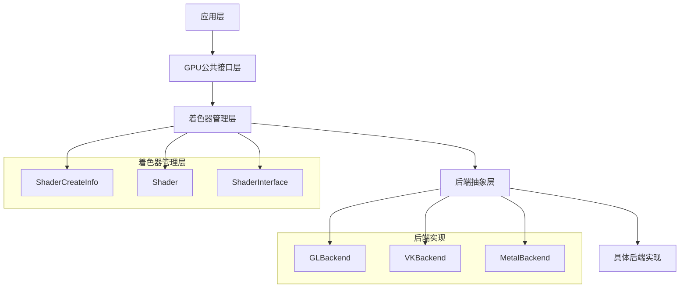
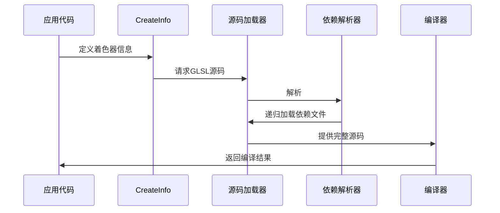
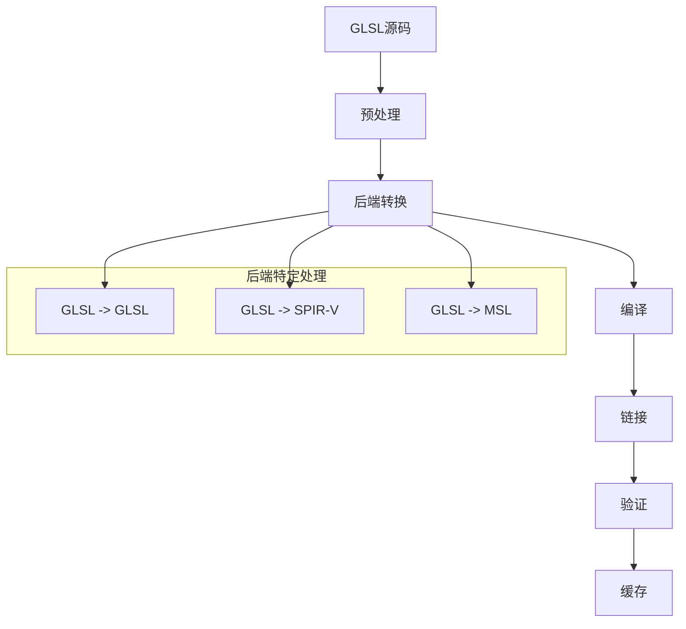
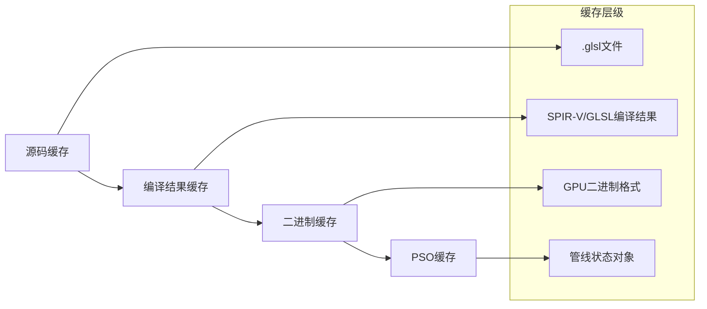

# 03-GLSL-C++调用机制详解

## 目录

- [03-GLSL-C++调用机制详解](#03-glsl-c调用机制详解)
  - [目录](#目录)
  - [1. 概述](#1-概述)
  - [2. Blender GPU着色器架构](#2-blender-gpu着色器架构)
    - [2.1 GPU模块结构](#21-gpu模块结构)
    - [2.2 着色器管理层次](#22-着色器管理层次)
  - [3. CreateInfo系统详解](#3-createinfo系统详解)
    - [3.1 ShaderCreateInfo类结构](#31-shadercreateinfo类结构)
    - [3.2 CreateInfo宏系统](#32-createinfo宏系统)
    - [3.3 资源描述机制](#33-资源描述机制)
  - [4. GLSL文件加载与编译流程](#4-glsl文件加载与编译流程)
    - [4.1 着色器源码加载](#41-着色器源码加载)
    - [4.2 预处理与依赖解析](#42-预处理与依赖解析)
    - [4.3 编译与链接](#43-编译与链接)
  - [5. 着色器管线创建](#5-着色器管线创建)
    - [5.1 管线状态管理](#51-管线状态管理)
    - [5.2 PSO预编译机制](#52-pso预编译机制)
  - [6. C++与GLSL集成方式](#6-c与glsl集成方式)
    - [6.1 统一变量绑定](#61-统一变量绑定)
    - [6.2 顶点属性接口](#62-顶点属性接口)
    - [6.3 片段输出管理](#63-片段输出管理)
  - [7. 后端实现差异](#7-后端实现差异)
    - [7.1 OpenGL后端](#71-opengl后端)
    - [7.2 Vulkan后端](#72-vulkan后端)
    - [7.3 Metal后端](#73-metal后端)
  - [8. 性能优化策略](#8-性能优化策略)
    - [8.1 着色器缓存](#81-着色器缓存)
    - [8.2 异步编译](#82-异步编译)
    - [8.3 专用化常量](#83-专用化常量)
  - [9. 调试与诊断](#9-调试与诊断)
    - [9.1 着色器调试](#91-着色器调试)
    - [9.2 性能分析](#92-性能分析)
  - [10. 实际案例分析](#10-实际案例分析)
    - [10.1 材质着色器案例](#101-材质着色器案例)
    - [10.2 全屏着色器案例](#102-全屏着色器案例)
  - [11. 最佳实践](#11-最佳实践)
    - [11.1 着色器组织](#111-着色器组织)
    - [11.2 性能考虑](#112-性能考虑)
    - [11.3 调试技巧](#113-调试技巧)
  - [12. 总结](#12-总结)

## 1. 概述

Blender的GPU着色器系统是一个高度抽象的多后端渲染架构，通过统一的C++接口管理GLSL着色器的整个生命周期。该系统的核心设计目标是：

- <span style="color: #2196F3;">**跨平台兼容性**</span>：支持OpenGL、Vulkan、Metal等多个图形API
- <span style="color: #4CAF50;">**高性能渲染**</span>：通过PSO预编译和异步编译优化渲染性能
- <span style="color: #FF9800;">**开发效率**</span>：提供声明式的着色器描述系统，简化着色器管理

本文档深入分析Blender中GLSL文件如何被C++代码调用、编译和管理的完整机制。

## 2. Blender GPU着色器架构

### 2.1 GPU模块结构

Blender的GPU模块采用分层架构设计，主要组件包括：



### 2.2 着色器管理层次

着色器管理分为三个主要层次：

1. **描述层**：使用`ShaderCreateInfo`声明着色器结构和资源
2. **编译层**：将GLSL源码编译为特定后端的着色器程序
3. **运行层**：管理着色器的运行时状态和资源绑定

## 3. CreateInfo系统详解

### 3.1 ShaderCreateInfo类结构

`ShaderCreateInfo`是着色器描述系统的核心类，位于`source/blender/gpu/intern/gpu_shader_create_info.hh:99`：

```cpp
class ShaderCreateInfo {
public:
  std::string name_;                                    // 着色器名称
  Vector<StageInterfaceInfo*> vertex_out_interfaces_;   // 顶点输出接口
  Vector<StageInterfaceInfo*> geometry_out_interfaces_; // 几何输出接口
  Vector<resource::Sampler> samplers_;                 // 采样器资源
  Vector<resource::Image> images_;                      // 图像资源
  Vector<resource::UniformBuf> uniform_buffers_;        // 统一缓冲区
  Vector<resource::StorageBuf> storage_buffers_;        // 存储缓冲区
  Vector<std::array<std::string, 2>> defines_;          // 预定义宏
  // ... 更多成员
};
```

### 3.2 CreateInfo宏系统

Blender提供了一套宏系统来简化着色器描述：

```cpp
// 定义着色器信息
GPU_SHADER_CREATE_INFO(my_shader)
    .vertex_in(0, Type::VEC3, "pos")
    .vertex_in(1, Type::VEC3, "nor") 
    .vertex_out(0, Type::VEC3, "world_pos")
    .fragment_out(0, Type::VEC4, "frag_color")
    .sampler(0, ImageType::FLOAT_2D, "color_texture")
    .push_constant(Type::MAT4, "model_matrix")
    .additional_info("gpu_shader_common_math")
GPU_SHADER_CREATE_END()
```

这些宏在`source/blender/gpu/intern/gpu_shader_create_info.hh:65-115`中定义，通过条件编译支持不同的使用场景：

- **GLSL_CPP_STUBS**：用于GLSL代码生成
- **GPU_SHADER_CREATE_INFO**：用于C++代码中的着色器描述
- **默认模式**：用于IDE自动补全

### 3.3 资源描述机制

#### 3.3.1 顶点属性描述

```cpp
.vertex_in(slot, Type::type, "name")
```

- `slot`：顶点属性位置（0-15）
- `Type::type`：数据类型（VEC2, VEC3, VEC4, FLOAT, INT等）
- `"name"`：GLSL中的变量名

#### 3.3.2 采样器资源描述

```cpp
.sampler(slot, ImageType::image_type, "name")
```

支持的图像类型包括：
- `FLOAT_1D`、`FLOAT_2D`、`FLOAT_3D`
- `FLOAT_1D_ARRAY`、`FLOAT_2D_ARRAY`
- `INT_2D`、`UINT_2D`
- `DEPTH_2D`等

#### 3.3.3 统一缓冲区描述

```cpp
.uniform_buf(slot, "name", "struct_name")
```

用于描述UBO（Uniform Buffer Object），支持结构化数据传递。

## 4. GLSL文件加载与编译流程

### 4.1 着色器源码加载

GLSL文件的加载过程如下：



源码加载的核心实现在`source/blender/gpu/intern/gpu_shader_dependency_private.cc`中：

```cpp
std::string shader_load_source(StringRefNull filename)
{
  // 检查缓存
  if (g_shader_sources.contains(filename)) {
    return g_shader_sources.lookup(filename);
  }
  
  // 从文件系统加载
  std::string source = load_from_filesystem(filename);
  
  // 缓存源码
  g_shader_sources.add(filename, source);
  
  return source;
}
```

### 4.2 预处理与依赖解析

GLSL文件支持通过`#include`指令包含其他GLSL文件，类似C++的头包含机制：

```glsl
// 在gpu_shader_common_math.glsl中
#include "gpu_shader_math_base_lib.glsl"
#include "gpu_shader_math_safe_lib.glsl"

void math_add(float a, float b, float c, out float result)
{
  result = a + b;
}
```

依赖解析器会：
1. 扫描GLSL源码中的`#include`指令
2. 递归加载被包含的文件
3. 构建依赖图避免循环包含
4. 生成最终的完整源码

### 4.3 编译与链接

编译流程因后端而异，但总体步骤相似：



## 5. 着色器管线创建

### 5.1 管线状态管理

`PipelineState`结构在`source/blender/gpu/intern/gpu_shader_create_info_pipeline.hh:21`中定义：

```cpp
struct PipelineState {
  Vector<SpecializationConstant::Value> specialization_constants_;
  GPUPrimType primitive_;
  GPUState state_ = {{GPU_WRITE_COLOR}};
  uint32_t viewport_count_;
  TextureTargetFormat depth_format_;
  TextureTargetFormat stencil_format_;
  Vector<TextureTargetFormat> color_formats_;
};
```

管线状态包括：
- **图元类型**：点、线、三角形等
- **渲染状态**：混合模式、深度测试、模板测试等
- **视口配置**：视口数量和配置
- **附件格式**：颜色、深度、模板缓冲区格式

### 5.2 PSO预编译机制

PSO（Pipeline State Object）预编译是Blender的重要性能优化特性：

```cpp
// 在Shader类中定义预编译接口
virtual void prewarm_pso_cache(const PipelineState &pipeline_state, 
                               int limit = -1) = 0;
```

预编译过程：
1. 分析着色器可能的管线状态组合
2. 提前编译PSO变体
3. 缓存编译结果
4. 运行时快速切换

## 6. C++与GLSL集成方式

### 6.1 统一变量绑定

统一变量（Uniform）的绑定通过`ShaderInterface`管理：

```cpp
class ShaderInterface {
public:
  struct Input {
    int location;      // 变量位置
    std::string name;  // 变量名称
    Type type;         // 数据类型
  };
  
  Vector<Input> uniforms_;     // 统一变量列表
  Vector<Input> attributes_;   // 顶点属性列表
  Vector<Input> ssbos_;        // SSBO列表
};
```

C++代码中设置统一变量：

```cpp
// 设置矩阵
GPU_shader_uniform_mat4(shader, "model_matrix", model_matrix);

// 设置向量
GPU_shader_uniform_4fv(shader, "color", color_data);

// 设置标量
GPU_shader_uniform_1f(shader, "alpha", alpha_value);
```

### 6.2 顶点属性接口

顶点属性在CreateInfo中声明后，C++代码需要提供对应的数据：

```cpp
// CreateInfo中的声明
.vertex_in(0, Type::VEC3, "pos")
.vertex_in(1, Type::VEC3, "nor")
.vertex_in(2, Type::VEC2, "uv")

// C++中的顶点格式定义
struct Vertex {
  float pos[3];
  float nor[3]; 
  float uv[2];
};

// 创建顶点缓冲区
GPUVertFormat format;
GPU_vertformat_attr_add(&format, "pos", GPU_COMP_F32, 3, GPU_FETCH_FLOAT);
GPU_vertformat_attr_add(&format, "nor", GPU_COMP_F32, 3, GPU_FETCH_FLOAT);
GPU_vertformat_attr_add(&format, "uv", GPU_COMP_F32, 2, GPU_FETCH_FLOAT);
```

### 6.3 片段输出管理

片段着色器的输出通过`fragment_output_bits`字段管理：

```cpp
// CreateInfo中声明输出
.fragment_out(0, Type::VEC4, "frag_color")
.fragment_out(1, Type::VEC4, "frag_normal")

// Shader类中记录输出位掩码
uint16_t fragment_output_bits = 0b00000011; // 前两个输出槽位被使用
```

## 7. 后端实现差异

### 7.1 OpenGL后端

OpenGL后端直接使用GLSL源码编译：

```cpp
// source/blender/gpu/opengl/gl_shader.cc
void GLShader::vertex_shader_from_glsl(
    const shader::ShaderCreateInfo &info,
    MutableSpan<StringRefNull> sources)
{
  // 直接使用GLSL源码
  sources[0] = vertex_source_;
  
  // 添加版本声明
  if (GPU_type_matches(GPU_DEVICE_ATI, GPU_OS_ANY, GPU_DRIVER_ANY)) {
    sources[0] = "#version 430 compatibility\n" + sources[0];
  }
}
```

### 7.2 Vulkan后端

Vulkan后端需要将GLSL转换为SPIR-V：

```cpp
// source/blender/gpu/vulkan/vk_shader.cc
void VKShader::vertex_shader_from_glsl(
    const shader::ShaderCreateInfo &info,
    MutableSpan<StringRefNull> sources)
{
  // 使用glslang编译为SPIR-V
  std::string spirv = compile_to_spirv(vertex_source_, 
                                       ShaderStage::VERTEX);
  
  // 验证SPIR-V
  validate_spirv(spirv);
  
  // 创建着色器模块
  VkShaderModule module = create_shader_module(spirv);
}
```

### 7.3 Metal后端

Metal后端需要将GLSL转换为MSL（Metal Shading Language）：

```cpp
// source/blender/gpu/metal/mtl_shader.cc  
void MTLShader::vertex_shader_from_glsl(
    const shader::ShaderCreateInfo &info,
    MutableSpan<StringRefNull> sources)
{
  // 使用HLSLCrossCompiler转换为MSL
  std::string msl = glsl_to_msl(vertex_source_, 
                                ShaderStage::VERTEX);
  
  // 编译MSL
  compile_msl(msl);
}
```

## 8. 性能优化策略

### 8.1 着色器缓存

Blender实现了多层着色器缓存机制：



### 8.2 异步编译

着色器编译支持异步执行，避免阻塞主线程：

```cpp
// 在GPU_worker中异步编译
void GPU_shader_async_compile(GPUShader *shader, 
                             const char *vertex_source,
                             const char *fragment_source)
{
  // 提交编译任务到工作线程
  GPU_task_push(shader_compile_task, shader, vertex_source, fragment_source);
}
```

### 8.3 专用化常量

专用化常量（Specialization Constants）允许在运行时优化着色器：

```cpp
// CreateInfo中声明专用化常量
.specialization_constant(Type::INT, "MAX_LIGHTS", 8)
.specialization_constant(Type::BOOL, "ENABLE_SHADOWS", true)

// 运行时设置常量值
GPU_shader_specialization_constant_set(shader, "MAX_LIGHTS", 4);
```

## 9. 调试与诊断

### 9.1 着色器调试

Blender提供了丰富的着色器调试功能：

```cpp
// 在source/blender/gpu/intern/gpu_shader.cc:41中定义
void Shader::dump_source_to_disk(StringRef shader_name,
                                 StringRef shader_name_with_stage_name,
                                 StringRef extension,
                                 StringRef source)
{
  // 根据调试模式过滤着色器
  StringRefNull pattern = G.gpu_debug_shader_source_name;
  if (!matches_debug_pattern(shader_name, pattern)) {
    return;
  }
  
  // 写入磁盘
  fs::path file_path = shader_dir / (shader_name_with_stage_name + extension);
  std::ofstream output_source_file(file_path);
  output_source_file << source;
}
```

### 9.2 性能分析

着色器性能分析通过GPU性能计数器实现：

```cpp
// 着色器性能统计
struct ShaderProfile {
  uint64_t compilation_time_us;
  uint64_t execution_time_us;
  uint32_t instruction_count;
  uint32_t register_count;
  float occupancy_rate;
};
```

## 10. 实际案例分析

### 10.1 材质着色器案例

以材质着色器为例，展示完整的GLSL-C++集成流程：

#### 10.1.1 GLSL源码

```glsl
// source/blender/gpu/shaders/material/gpu_shader_material_bright_contrast.glsl
#pragma once

#include "gpu_shader_common_color_utils.glsl"

void node_bright_contrast(
    vec4 color, float bright, float contrast, out vec4 result)
{
  result = color;
  
  // 应用亮度调整
  if (bright != 0.0) {
    result.rgb += bright;
  }
  
  // 应用对比度调整
  if (contrast != 1.0) {
    result.rgb = (result.rgb - 0.5) * contrast + 0.5;
  }
  
  // 确保颜色值在有效范围内
  result = clamp(result, vec4(0.0), vec4(1.0));
}
```

#### 10.1.2 CreateInfo定义

```cpp
// source/blender/gpu/shaders/material/gpu_shader_material_info.hh
GPU_SHADER_CREATE_INFO(gpu_shader_material_bright_contrast)
    .push_constant(Type::VEC4, "color")
    .push_constant(Type::FLOAT, "bright")
    .push_constant(Type::FLOAT, "contrast")
    .push_constant(Type::VEC4, "result")
    .additional_info("gpu_shader_common_color_utils")
GPU_SHADER_CREATE_END()
```

#### 10.1.3 C++调用代码

```cpp
// 在材质节点中调用
class BrightContrastNode : public MaterialNode {
public:
  void compile(GPUMaterial *material) override {
    // 获取着色器
    GPUShader *shader = GPU_shader_get_from_material(
        material, "gpu_shader_material_bright_contrast");
    
    // 设置输入参数
    GPU_shader_uniform_4fv(shader, "color", input_color_);
    GPU_shader_uniform_1f(shader, "bright", bright_value_);
    GPU_shader_uniform_1f(shader, "contrast", contrast_value_);
    
    // 绑定输出
    GPU_shader_uniform_4fv(shader, "result", output_color_);
    
    // 执行着色器
    GPU_shader_bind(shader);
    GPU_draw_primitive(GPU_PRIM_POINTS, 1);
  }
};
```

### 10.2 全屏着色器案例

全屏着色器用于后处理效果：

#### 10.2.1 顶点着色器

```glsl
// source/blender/gpu/shaders/common/gpu_shader_fullscreen_vert.glsl
#pragma once

#include "gpu_shader_common_math.glsl"

void main()
{
  // 计算全屏四边形位置
  vec2 pos = vec2(gl_VertexID % 2, gl_VertexID / 2) * 2.0 - 1.0;
  gl_Position = vec4(pos.xy, 0.0, 1.0);
  
  // 传递纹理坐标
  uv = pos * 0.5 + 0.5;
}
```

#### 10.2.2 片段着色器

```glsl
// source/blender/gpu/shaders/common/gpu_shader_fullscreen_lib.glsl
#pragma once

#include "gpu_shader_fullscreen_vert.glsl"

void main()
{
  // 采样源纹理
  vec4 color = texture(source_texture, uv);
  
  // 应用后处理效果
  color = apply_postprocess(color, uv);
  
  // 输出结果
  frag_color = color;
}
```

#### 10.2.3 C++管理代码

```cpp
// source/blender/gpu/intern/gpu_fullscreen.cc
class FullscreenShader {
private:
  GPUShader *shader_;
  GPUVertBuf *vbo_;
  
public:
  void init() {
    // 创建着色器
    shader_ = GPU_shader_create(
        fullscreen_vert_glsl,
        fullscreen_frag_glsl,
        nullptr, "Fullscreen Shader");
    
    // 创建顶点缓冲区（3个顶点组成三角形）
    vbo_ = GPU_vertbuf_create_with_format(&format);
    GPU_vertbuf_data_alloc(vbo_, 3);
  }
  
  void draw(GPUTexture *source_texture) {
    // 绑定着色器
    GPU_shader_bind(shader_);
    
    // 设置源纹理
    GPU_shader_uniform_texture(shader_, "source_texture", source_texture);
    
    // 绘制全屏三角形
    GPU_draw_primitive(GPU_PRIM_TRIS, 3);
  }
};
```

## 11. 最佳实践

### 11.1 着色器组织

#### 11.1.1 文件结构规范

```
source/blender/gpu/shaders/
├── common/              # 通用着色器库
│   ├── gpu_shader_common_math.glsl
│   ├── gpu_shader_common_color_utils.glsl
│   └── gpu_shader_fullscreen_lib.glsl
├── material/           # 材质着色器
│   ├── gpu_shader_material_*.glsl
│   └── gpu_shader_material_info.hh
├── compute/            # 计算着色器
│   └── gpu_shader_compute_*.glsl
└── info/              # 着色器信息定义
    └── gpu_shader_info_*.hh
```

#### 11.1.2 命名规范

- **GLSL文件**：`gpu_shader_<module>_<function>.glsl`
- **CreateInfo**：`gpu_shader_<module>_<function>`
- **C++类**：`<Module><Function>Shader`

### 11.2 性能考虑

#### 11.2.1 着色器复用

```cpp
// 好的做法：复用通用着色器
GPU_SHADER_CREATE_INFO(my_material)
    .additional_info("gpu_shader_common_math")
    .additional_info("gpu_shader_common_color_utils")
GPU_SHADER_CREATE_END()

// 避免：重复实现相同功能
```

#### 11.2.2 条件编译优化

```cpp
// 使用专用化常量而非运行时分支
.specialization_constant(Type::BOOL, "ENABLE_FEATURE_X", false)

// 在GLSL中
#ifdef ENABLE_FEATURE_X
  // 功能X的实现
#endif
```

### 11.3 调试技巧

#### 11.3.1 源码导出

```cpp
// 启用着色器源码调试
G.gpu_debug_shader_source_name = "*";  // 导出所有着色器
G.gpu_debug_shader_source_name = "my_*"; // 导出特定着色器
```

#### 11.3.2 编译错误诊断

```cpp
// 检查编译状态
if (!GPU_shader_is_valid(shader)) {
  const char *error_log = GPU_shader_get_error_log(shader);
  printf("Shader compilation failed:\n%s\n", error_log);
}
```

## 12. 总结

Blender的GLSL-C++调用机制是一个设计精良的多后端着色器管理系统，具有以下特点：

### 12.1 核心优势

1. **<span style="color: #4CAF50;">高度抽象</span>**：通过CreateInfo系统实现声明式着色器描述
2. **<span style="color: #2196F3;">跨平台兼容</span>**：统一接口支持多个图形API后端
3. **<span style="color: #FF9800;">性能优化</span>**：PSO预编译、异步编译、多层缓存
4. **<span style="color: #9C27B0;">开发友好</span>**：丰富的调试工具和错误诊断

### 12.2 技术创新

- **统一资源描述**：通过CreateInfo宏系统简化着色器定义
- **依赖管理**：自动解析GLSL文件间的#include依赖关系
- **专用化优化**：运行时优化着色器常量，提升执行效率
- **异步编译**：避免着色器编译阻塞渲染线程

### 12.3 应用价值

该系统不仅服务于Blender的内部渲染需求，也为其他3D应用提供了优秀的着色器管理架构参考。其设计理念和实现方式对现代图形引擎开发具有重要的借鉴意义。

通过深入理解这套机制，开发者可以：
- 高效地编写和管理复杂的GLSL着色器
- 优化着色器编译和执行性能
- 构建可扩展的多后端渲染系统
- 实现高级的渲染效果和材质系统

---

*本文档基于Blender源码分析编写，涵盖了GLSL-C++集成的核心机制和最佳实践。*