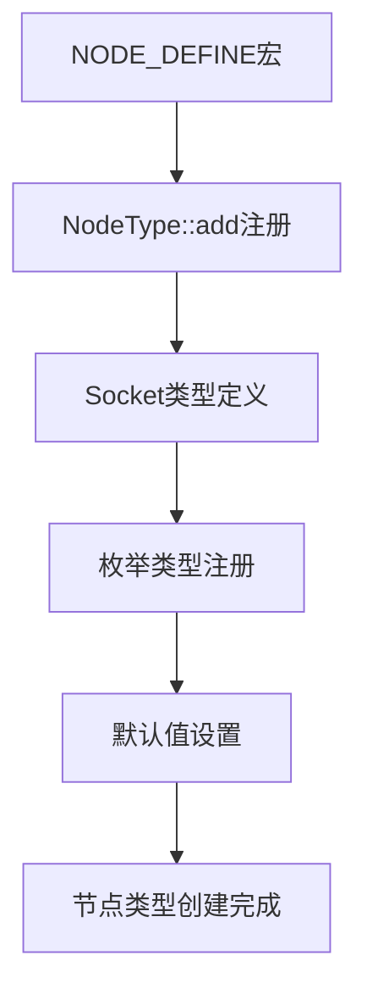
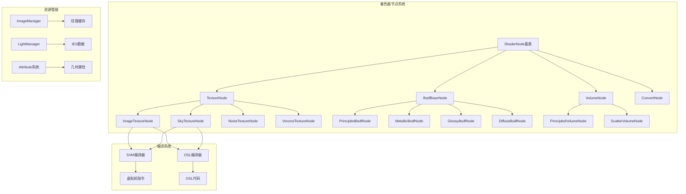
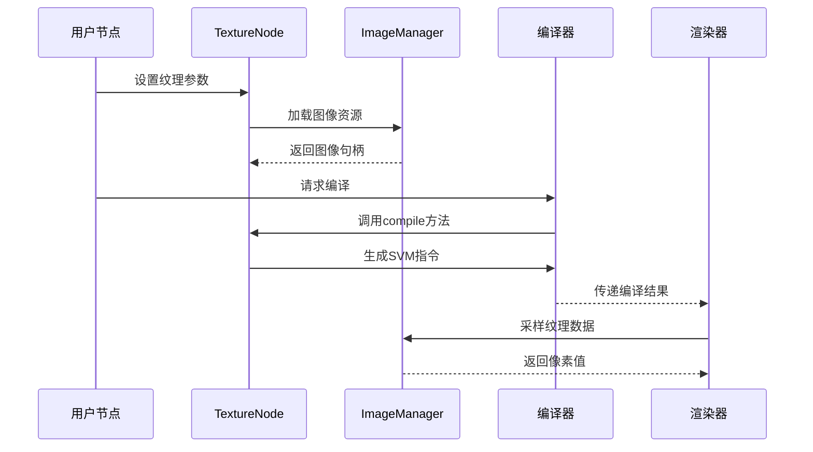
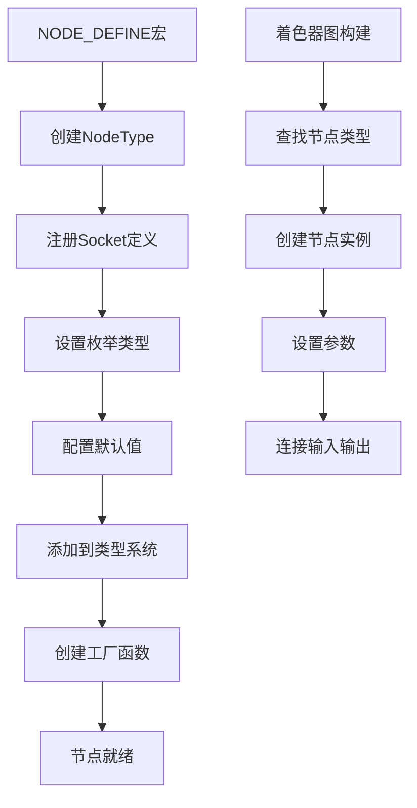

# 04. Cycles shader_nodes.cpp 详解

## 目录

- [1. 文件概述](#1-文件概述)
- [2. Cycles着色器节点系统架构](#2-cycles着色器节点系统架构)
- [3. 节点类型定义和注册机制](#3-节点类型定义和注册机制)
- [4. 核心纹理节点实现](#4-核心纹理节点实现)
- [5. BSDF材质节点系统](#5-bsdf材质节点系统)
- [6. 几何和属性节点](#6-几何和属性节点)
- [7. 编译系统详解](#7-编译系统详解)
- [8. 架构流程图](#8-架构流程图)

---

## 1. 文件概述

`intern/cycles/scene/shader_nodes.cpp` 是Cycles渲染引擎着色器系统的核心实现文件，负责定义和管理所有着色器节点的具体实现。该文件包含了纹理节点、BSDF节点、几何节点等各类着色器节点的完整实现。

### 1.1 主要功能

- **节点类型定义**: 实现所有Cycles着色器节点的具体逻辑
- **纹理坐标映射**: 处理纹理坐标变换和投影
- **编译支持**: 提供SVM和OSL两种编译后端支持
- **材质属性**: 实现复杂的材质计算和光线交互

### 1.2 文件结构

```cpp
// 位置: intern/cycles/scene/shader_nodes.cpp:1-10
#include "scene/shader_nodes.h"
#include "kernel/svm/types.h"
#include "kernel/types.h"
// ... 更多包含头文件

CCL_NAMESPACE_BEGIN
```

---

## 2. Cycles着色器节点系统架构

### 2.1 核心架构设计

Cycles采用基于节点的着色器架构，每个节点代表一个特定的计算单元，节点之间通过输入输出端口连接形成着色器网络。

### 2.2 节点基类层次

```cpp
// 基础节点类层次结构
ShaderNode (基础节点)
├── TextureNode (纹理节点基类)
├── BsdfBaseNode (BSDF节点基类)
├── VolumeNode (体积节点基类)
└── ConvertNode (类型转换节点)
```

### 2.3 纹理映射系统

TextureMapping类提供了统一的纹理坐标变换功能：

```cpp
// 位置: intern/cycles/scene/shader_nodes.cpp:39-69
#define TEXTURE_MAPPING_DEFINE(TextureNode) \
  SOCKET_POINT(tex_mapping.translation, "Translation", zero_float3()); \
  SOCKET_VECTOR(tex_mapping.rotation, "Rotation", zero_float3()); \
  SOCKET_VECTOR(tex_mapping.scale, "Scale", one_float3()); \
  // ... 更多映射参数
```

**核心变换计算**:
```cpp
// 位置: intern/cycles/scene/shader_nodes.cpp:73-134
Transform TextureMapping::compute_transform()
{
  Transform mmat = transform_scale(zero_float3());
  
  // 设置映射矩阵
  if (x_mapping != NONE) {
    mmat[0][x_mapping - 1] = 1.0f;
  }
  // ... 更多映射逻辑
  
  return mat;
}
```

---

## 3. 节点类型定义和注册机制

### 3.1 NODE_DEFINE宏系统

Cycles使用宏系统来简化节点类型的注册：

```cpp
// 位置: intern/cycles/scene/shader_nodes.cpp:216-265
NODE_DEFINE(ImageTextureNode)
{
  NodeType *type = NodeType::add("image_texture", create, NodeType::SHADER);
  
  TEXTURE_MAPPING_DEFINE(ImageTextureNode);
  
  SOCKET_STRING(filename, "Filename", ustring());
  SOCKET_STRING(colorspace, "Colorspace", u_colorspace_auto);
  
  static NodeEnum alpha_type_enum;
  alpha_type_enum.insert("auto", IMAGE_ALPHA_AUTO);
  alpha_type_enum.insert("unassociated", IMAGE_ALPHA_UNASSOCIATED);
  // ... 更多枚举类型
  
  return type;
}
```

### 3.2 Socket定义系统

每个节点通过SOCKET_*宏定义输入输出端口：

```cpp
// 输入端口定义
SOCKET_IN_POINT(vector, "Vector", zero_float3(), SocketType::LINK_TEXTURE_UV);
SOCKET_IN_FLOAT(scale, "Scale", 1.0f);

// 输出端口定义  
SOCKET_OUT_COLOR(color, "Color");
SOCKET_OUT_FLOAT(alpha, "Alpha");
```

### 3.3 节点注册流程



---

## 4. 核心纹理节点实现

### 4.1 图像纹理节点

ImageTextureNode是最复杂的纹理节点之一：

```cpp
// 位置: intern/cycles/scene/shader_nodes.cpp:370-449
void ImageTextureNode::compile(SVMCompiler &compiler)
{
  ShaderInput *vector_in = input("Vector");
  ShaderOutput *color_out = output("Color");
  ShaderOutput *alpha_out = output("Alpha");

  if (handle.empty()) {
    cull_tiles(compiler.scene, compiler.current_graph);
    ImageManager *image_manager = compiler.scene->image_manager.get();
    handle = image_manager->add_image(filename.string(), image_params(), tiles);
  }

  const ImageMetaData metadata = handle.metadata();
  const bool compress_as_srgb = metadata.compress_as_srgb;

  const int vector_offset = tex_mapping.compile_begin(compiler, vector_in);
  uint flags = 0;

  if (compress_as_srgb) {
    flags |= NODE_IMAGE_COMPRESS_AS_SRGB;
  }
  
  // 编译SVM节点
  compiler.add_node(NODE_TEX_IMAGE, num_nodes,
                    compiler.encode_uchar4(vector_offset,
                                           compiler.stack_assign_if_linked(color_out),
                                           compiler.stack_assign_if_linked(alpha_out),
                                           flags),
                    projection);
  
  tex_mapping.compile_end(compiler, vector_in, vector_offset);
}
```

**瓦片裁剪优化**:
```cpp
// 位置: intern/cycles/scene/shader_nodes.cpp:291-353
void ImageTextureNode::cull_tiles(Scene *scene, ShaderGraph *graph)
{
  // Box投影优化
  if (projection == NODE_IMAGE_PROJ_BOX) {
    if (tiles.size()) {
      tiles.clear();
      tiles.push_back_slow(1001);
    }
    return;
  }

  // 交互式渲染时的处理
  if (!scene->params.background) {
    return;
  }

  // UV瓦片分析
  unordered_set<int> used_tiles;
  for (Geometry *geom : scene->geometry) {
    for (Node *node : geom->get_used_shaders()) {
      Shader *shader = static_cast<Shader *>(node);
      if (shader->graph.get() == graph) {
        geom->get_uv_tiles(attribute, used_tiles);
      }
    }
  }
  
  // 更新瓦片列表
  array<int> new_tiles;
  for (const int tile : tiles) {
    if (used_tiles.count(tile)) {
      new_tiles.push_back_slow(tile);
    }
  }
  tiles.steal_data(new_tiles);
}
```

### 4.2 天空纹理节点

SkyTextureNode实现了多种大气散射模型：

```cpp
// 位置: intern/cycles/scene/shader_nodes.cpp:867-897
NODE_DEFINE(SkyTextureNode)
{
  NodeType *type = NodeType::add("sky_texture", create, NodeType::SHADER);
  TEXTURE_MAPPING_DEFINE(SkyTextureNode);
  
  static NodeEnum type_enum;
  type_enum.insert("preetham", NODE_SKY_PREETHAM);
  type_enum.insert("hosek_wilkie", NODE_SKY_HOSEK);
  type_enum.insert("single_scattering", NODE_SKY_SINGLE_SCATTERING);
  type_enum.insert("multiple_scattering", NODE_SKY_MULTIPLE_SCATTERING);
  SOCKET_ENUM(sky_type, "Type", type_enum, NODE_SKY_MULTIPLE_SCATTERING);
  
  // Nishita参数
  SOCKET_BOOLEAN(sun_disc, "Sun Disc", true);
  SOCKET_FLOAT(sun_size, "Sun Size", 0.009512f);
  SOCKET_FLOAT(sun_elevation, "Sun Elevation", 15.0f * M_PI_F / 180.0f);
  // ... 更多参数
  
  return type;
}
```

**大气模型预计算**:
```cpp
// 位置: intern/cycles/scene/shader_nodes.cpp:764-809
static void sky_texture_precompute_nishita(SunSky *sunsky,
                                           bool multiple_scattering,
                                           bool sun_disc,
                                           const float sun_size,
                                           const float sun_intensity,
                                           const float sun_elevation,
                                           const float sun_rotation,
                                           const float altitude,
                                           const float air_density,
                                           const float aerosol_density,
                                           const float ozone_density)
{
  float pixel_bottom[3];
  float pixel_top[3];

  if (multiple_scattering) {
    SKY_multiple_scattering_precompute_sun(sun_elevation,
                                           sun_size,
                                           altitude,
                                           air_density,
                                           aerosol_density,
                                           ozone_density,
                                           pixel_bottom,
                                           pixel_top);
  } else {
    SKY_single_scattering_precompute_sun(
        sun_elevation, sun_size, altitude, air_density, aerosol_density, pixel_bottom, pixel_top);
  }

  // 存储预计算数据
  sunsky->nishita_data[0] = pixel_bottom[0];
  sunsky->nishita_data[1] = pixel_bottom[1];
  // ... 更多数据存储
}
```

### 4.3 程序化纹理节点

**噪波纹理节点**:
```cpp
// 位置: intern/cycles/scene/shader_nodes.cpp:142-179
NODE_DEFINE(NoiseTextureNode)
{
  NodeType *type = NodeType::add("noise_texture", create, NodeType::SHADER);
  
  static NodeEnum dimensions_enum;
  dimensions_enum.insert("1D", 1);
  dimensions_enum.insert("2D", 2);
  dimensions_enum.insert("3D", 3);
  dimensions_enum.insert("4D", 4);
  SOCKET_ENUM(dimensions, "Dimensions", dimensions_enum, 3);
  
  static NodeEnum type_enum;
  type_enum.insert("multifractal", NODE_NOISE_MULTIFRACTAL);
  type_enum.insert("fBM", NODE_NOISE_FBM);
  // ... 更多噪波类型
  
  return type;
}
```

---

## 5. BSDF材质节点系统

### 5.1 BSDF基类架构

BsdfBaseNode提供了所有BRDF/BTDF节点的通用功能：

```cpp
// 位置: intern/cycles/scene/shader_nodes.cpp:2448-2659
class BsdfBaseNode : public ShaderNode {
public:
  BsdfBaseNode(const NodeType *node_type) : ShaderNode(node_type)
  {
    special_type = SHADER_SPECIAL_TYPE_CLOSURE;
  }
  
  bool has_bump()
  {
    ShaderInput *normal_in = input("Normal");
    return (normal_in && normal_in->link &&
            normal_in->link->parent->special_type != SHADER_SPECIAL_TYPE_GEOMETRY);
  }
  
protected:
  ClosureType closure;
};
```

### 5.2 Principled BSDF节点

这是Cycles中最复杂的材质节点，整合了Disney Principled BRDF：

```cpp
// 位置: intern/cycles/scene/shader_nodes.cpp:2714-3002
NODE_DEFINE(PrincipledBsdfNode)
{
  NodeType *type = NodeType::add("principled_bsdf", create, NodeType::SHADER);
  
  // 分布函数枚举
  static NodeEnum distribution_enum;
  distribution_enum.insert("ggx", CLOSURE_BSDF_MICROFACET_GGX_GLASS_ID);
  distribution_enum.insert("multi_ggx", CLOSURE_BSDF_MICROFACET_MULTI_GGX_GLASS_ID);
  
  // 次表面散射方法
  static NodeEnum subsurface_method_enum;
  subsurface_method_enum.insert("burley", CLOSURE_BSSRDF_BURLEY_ID);
  subsurface_method_enum.insert("random_walk", CLOSURE_BSSRDF_RANDOM_WALK_ID);
  subsurface_method_enum.insert("random_walk_skin", CLOSURE_BSSRDF_RANDOM_WALK_SKIN_ID);
  
  // 基础参数
  SOCKET_IN_COLOR(base_color, "Base Color", make_float3(0.8f, 0.8f, 0.8f))
  SOCKET_IN_FLOAT(metallic, "Metallic", 0.0f);
  SOCKET_IN_FLOAT(roughness, "Roughness", 0.5f);
  SOCKET_IN_FLOAT(ior, "IOR", 1.5f);
  
  // 次表面散射参数
  SOCKET_IN_FLOAT(subsurface_weight, "Subsurface Weight", 0.0f);
  SOCKET_IN_FLOAT(subsurface_scale, "Subsurface Scale", 0.1f);
  SOCKET_IN_VECTOR(subsurface_radius, "Subsurface Radius", make_float3(0.1f, 0.1f, 0.1f));
  
  // 涂层参数
  SOCKET_IN_FLOAT(coat_weight, "Coat Weight", 0.0f);
  SOCKET_IN_FLOAT(coat_roughness, "Coat Roughness", 0.03f);
  SOCKET_IN_FLOAT(coat_ior, "Coat IOR", 1.5f);
  
  // 发射参数
  SOCKET_IN_COLOR(emission_color, "Emission Color", one_float3());
  SOCKET_IN_FLOAT(emission_strength, "Emission Strength", 0.0f);
  
  return type;
}
```

**智能简化设置**:
```cpp
// 位置: intern/cycles/scene/shader_nodes.cpp:2785-2824
void PrincipledBsdfNode::simplify_settings(Scene * /* scene */)
{
  if (!has_surface_emission()) {
    disconnect_unused_input("Emission Color");
    disconnect_unused_input("Emission Strength");
  }

  if (!has_surface_bssrdf()) {
    disconnect_unused_input("Subsurface Weight");
    disconnect_unused_input("Subsurface Radius");
    disconnect_unused_input("Subsurface Scale");
    // ... 更多简化逻辑
  }

  if (!has_nonzero_weight("Coat Weight")) {
    disconnect_unused_input("Coat Weight");
    disconnect_unused_input("Coat IOR");
    disconnect_unused_input("Coat Roughness");
    disconnect_unused_input("Coat Tint");
  }
}
```

### 5.3 金属BSDF节点

```cpp
// 位置: intern/cycles/scene/shader_nodes.cpp:2312-2422
NODE_DEFINE(MetallicBsdfNode)
{
  NodeType *type = NodeType::add("metallic_bsdf", create, NodeType::SHADER);
  
  // 分布函数
  static NodeEnum distribution_enum;
  distribution_enum.insert("beckmann", CLOSURE_BSDF_MICROFACET_BECKMANN_ID);
  distribution_enum.insert("ggx", CLOSURE_BSDF_MICROFACET_GGX_ID);
  distribution_enum.insert("multi_ggx", CLOSURE_BSDF_MICROFACET_MULTI_GGX_ID);
  
  // Fresnel类型
  static NodeEnum fresnel_type_enum;
  fresnel_type_enum.insert("f82", CLOSURE_BSDF_F82_CONDUCTOR);
  fresnel_type_enum.insert("physical_conductor", CLOSURE_BSDF_PHYSICAL_CONDUCTOR);
  
  // 物理参数
  SOCKET_IN_COLOR(edge_tint, "Edge Tint", make_float3(0.695f, 0.726f, 0.770f));
  SOCKET_IN_VECTOR(ior, "IOR", make_float3(2.757f, 2.513f, 2.231f));
  SOCKET_IN_VECTOR(k, "Extinction", make_float3(3.867f, 3.404f, 3.009f));
  
  // 各向异性参数
  SOCKET_IN_FLOAT(anisotropy, "Anisotropy", 0.0f);
  SOCKET_IN_FLOAT(rotation, "Rotation", 0.0f);
  SOCKET_IN_VECTOR(tangent, "Tangent", zero_float3(), SocketType::LINK_TANGENT);
  
  // 薄膜干涉
  SOCKET_IN_FLOAT(thin_film_thickness, "Thin Film Thickness", 0.0f);
  SOCKET_IN_FLOAT(thin_film_ior, "Thin Film IOR", 1.33f);
  
  return type;
}
```

---

## 6. 几何和属性节点

### 6.1 几何节点

GeometryNode提供对渲染几何体基本属性的访问：

```cpp
// 位置: intern/cycles/scene/shader_nodes.cpp:3955-4092
NODE_DEFINE(GeometryNode)
{
  NodeType *type = NodeType::add("geometry", create, NodeType::SHADER);
  
  SOCKET_OUT_POINT(position, "Position");
  SOCKET_OUT_NORMAL(normal, "Normal");
  SOCKET_OUT_NORMAL(tangent, "Tangent");
  SOCKET_OUT_NORMAL(true_normal, "True Normal");
  SOCKET_OUT_VECTOR(incoming, "Incoming");
  SOCKET_OUT_POINT(parametric, "Parametric");
  SOCKET_OUT_FLOAT(backfacing, "Backfacing");
  SOCKET_OUT_FLOAT(pointiness, "Pointiness");
  SOCKET_OUT_FLOAT(random_per_island, "Random Per Island");
  
  return type;
}

// 编译实现
void GeometryNode::compile(SVMCompiler &compiler)
{
  ShaderOutput *out;
  ShaderNodeType geom_node = NODE_GEOMETRY;
  ShaderNodeType attr_node = NODE_ATTR;

  // 处理凹凸贴图偏移
  if (bump == SHADER_BUMP_DX) {
    geom_node = NODE_GEOMETRY_BUMP_DX;
    attr_node = NODE_ATTR_BUMP_DX;
  }
  else if (bump == SHADER_BUMP_DY) {
    geom_node = NODE_GEOMETRY_BUMP_DY;
    attr_node = NODE_ATTR_BUMP_DY;
  }

  // 编译位置输出
  out = output("Position");
  if (!out->links.empty()) {
    compiler.add_node(
        geom_node, NODE_GEOM_P, compiler.stack_assign(out), __float_as_uint(bump_filter_width));
  }
  
  // 编译其他几何属性...
}
```

### 6.2 纹理坐标节点

```cpp
// 位置: intern/cycles/scene/shader_nodes.cpp:4095-4285
NODE_DEFINE(TextureCoordinateNode)
{
  NodeType *type = NodeType::add("texture_coordinate", create, NodeType::SHADER);
  
  SOCKET_BOOLEAN(from_dupli, "From Dupli", false);
  SOCKET_BOOLEAN(use_transform, "Use Transform", false);
  SOCKET_TRANSFORM(ob_tfm, "Object Transform", transform_identity());
  
  SOCKET_OUT_POINT(generated, "Generated");
  SOCKET_OUT_NORMAL(normal, "Normal");
  SOCKET_OUT_POINT(UV, "UV");
  SOCKET_OUT_POINT(object, "Object");
  SOCKET_OUT_POINT(camera, "Camera");
  SOCKET_OUT_POINT(window, "Window");
  SOCKET_OUT_NORMAL(reflection, "Reflection");
  
  return type;
}
```

### 6.3 光线路径节点

LightPathNode提供对光线跟踪状态的访问：

```cpp
// 位置: intern/cycles/scene/shader_nodes.cpp:4381-4492
NODE_DEFINE(LightPathNode)
{
  NodeType *type = NodeType::add("light_path", create, NodeType::SHADER);
  
  SOCKET_OUT_FLOAT(is_camera_ray, "Is Camera Ray");
  SOCKET_OUT_FLOAT(is_shadow_ray, "Is Shadow Ray");
  SOCKET_OUT_FLOAT(is_diffuse_ray, "Is Diffuse Ray");
  SOCKET_OUT_FLOAT(is_glossy_ray, "Is Glossy Ray");
  SOCKET_OUT_FLOAT(is_singular_ray, "Is Singular Ray");
  SOCKET_OUT_FLOAT(is_reflection_ray, "Is Reflection Ray");
  SOCKET_OUT_FLOAT(is_transmission_ray, "Is Transmission Ray");
  SOCKET_OUT_FLOAT(is_volume_scatter_ray, "Is Volume Scatter Ray");
  SOCKET_OUT_FLOAT(ray_length, "Ray Length");
  SOCKET_OUT_FLOAT(ray_depth, "Ray Depth");
  SOCKET_OUT_FLOAT(diffuse_depth, "Diffuse Depth");
  SOCKET_OUT_FLOAT(glossy_depth, "Glossy Depth");
  SOCKET_OUT_FLOAT(transparent_depth, "Transparent Depth");
  SOCKET_OUT_FLOAT(transmission_depth, "Transmission Depth");
  SOCKET_OUT_FLOAT(portal_depth, "Portal Depth");
  
  return type;
}
```

---

## 7. 编译系统详解

### 7.1 双编译器架构

Cycles支持两种编译后端：

1. **SVM (Shader Virtual Machine)**: Cycles自研的虚拟机
2. **OSL (Open Shading Language)**: 业界标准的着色语言

### 7.2 SVM编译流程

每个节点都实现`compile(SVMCompiler &compiler)`方法：

```cpp
// 示例: RGB转灰度节点
void RGBToBWNode::compile(SVMCompiler &compiler)
{
  compiler.add_node(NODE_CONVERT,
                    NODE_CONVERT_CF,  // Color to Float转换
                    compiler.stack_assign(inputs[0]),
                    compiler.stack_assign(outputs[0]));
}
```

### 7.3 OSL编译流程

对应的OSL编译方法：

```cpp
void RGBToBWNode::compile(OSLCompiler &compiler)
{
  compiler.add(this, "node_rgb_to_bw");
}
```

### 7.4 栈管理系统

SVM使用虚拟栈来传递数据：

```cpp
// 栈分配示例
const int vector_offset = compiler.stack_assign_if_linked(vector_in);
const int color_offset = compiler.stack_assign_if_linked(color_out);
const int alpha_offset = compiler.stack_assign_if_linked(alpha_out);

// 编码栈偏移到节点指令中
compiler.add_node(NODE_TEX_IMAGE,
                  compiler.encode_uchar4(vector_offset, color_offset, alpha_offset, flags),
                  projection);
```

### 7.5 常量折叠优化

```cpp
// 位置: intern/cycles/scene/shader_nodes.cpp:2087-2093
void RGBToBWNode::constant_fold(const ConstantFolder &folder)
{
  if (folder.all_inputs_constant()) {
    const float val = folder.scene->shader_manager->linear_rgb_to_gray(color);
    folder.make_constant(val);
  }
}
```

---

## 8. 架构流程图

### 8.1 节点系统整体架构



### 8.2 纹理处理流程



### 8.3 节点注册流程



---

## 总结

`shader_nodes.cpp`是Cycles渲染引擎的核心文件，实现了完整的节点化着色器系统。主要特点包括：

1. **模块化设计**: 通过继承层次实现不同类型节点的功能复用
2. **双编译器支持**: 同时支持SVM和OSL两种编译后端
3. **性能优化**: 实现了常量折叠、瓦片裁剪等多种优化策略
4. **丰富功能**: 涵盖纹理、材质、几何、体积等各个方面的着色器需求
5. **扩展性强**: 通过NODE_DEFINE宏系统便于添加新的节点类型

该文件的设计体现了现代渲染引擎着色器系统的最佳实践，为Blender提供了强大的程序化材质创建能力。