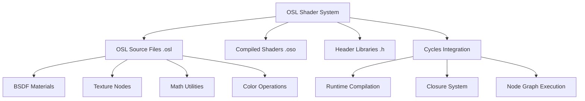
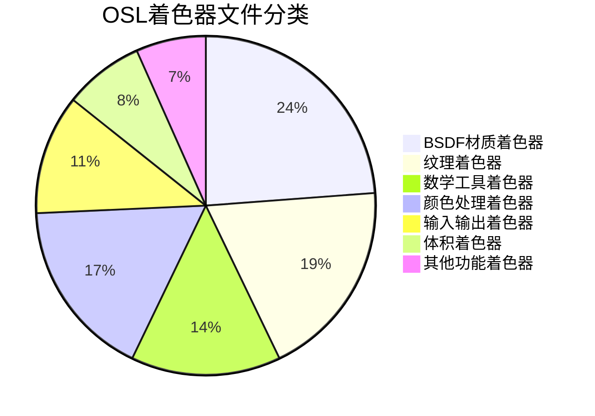
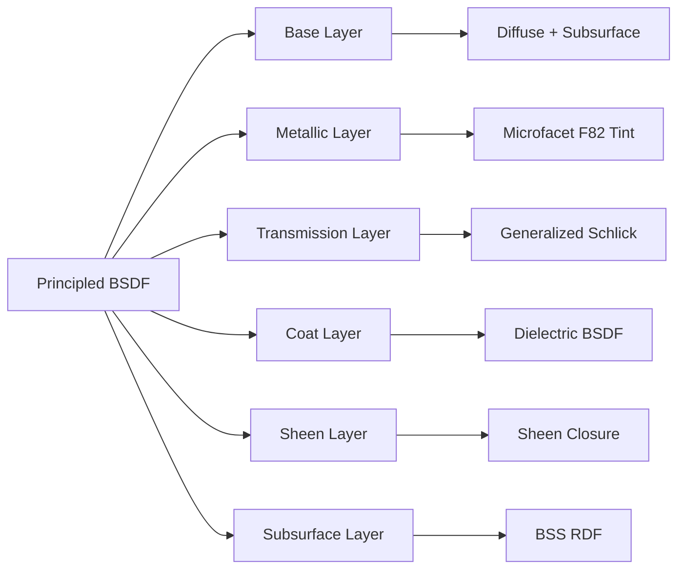
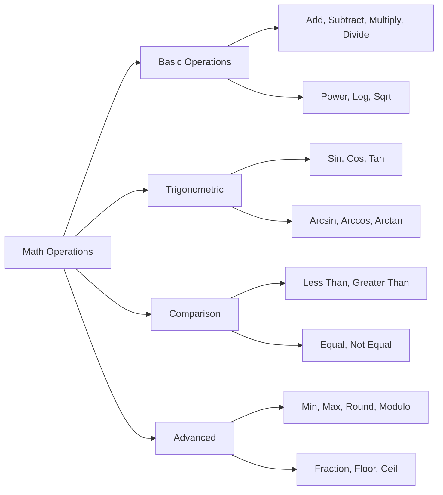
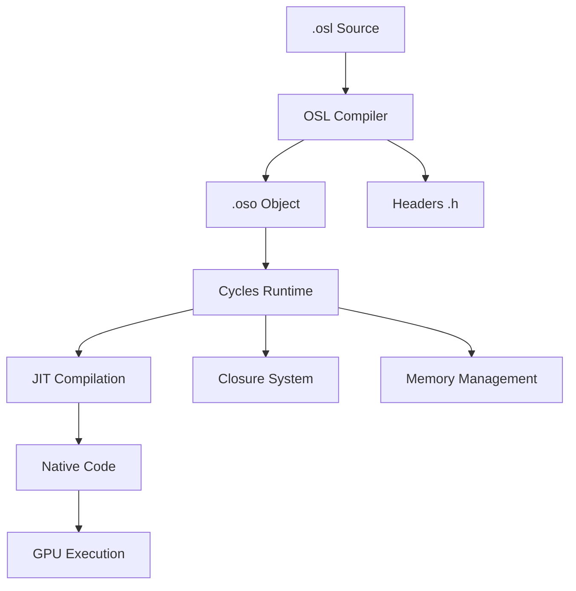

# 05-OSL-shaders目录详解

## 目录

- [5.1 OSL着色器系统概述](#51-osl着色器系统概述)
- [5.2 文件结构与分类](#52-文件结构与分类)
- [5.3 BSDF材质着色器](#53-bsdf材质着色器)
- [5.4 纹理着色器](#54-纹理着色器)
- [5.5 数学与工具着色器](#55-数学与工具着色器)
- [5.6 颜色处理着色器](#56-颜色处理着色器)
- [5.7 输入输出着色器](#57-输入输出着色器)
- [5.8 体积着色器](#58-体积着色器)
- [5.9 头文件库](#59-头文件库)
- [5.10 OSL与Cycles集成机制](#510-osl与cycles集成机制)

---

## 5.1 OSL着色器系统概述

<span style="background:#e1f5fe;color:#01579b">**Open Shading Language (OSL)**</span> 是一种高级着色语言，专为计算机图形渲染设计。Cycles渲染引擎通过OSL实现灵活的程序化材质系统。

### 5.1.1 核心概念



### 5.1.2 技术术语

- **<span style="color:#d32f2f">OSL</span>**: Open Shading Language，着色语言标准
- **<span style="color:#7b1fa2">BSDF</span>**: Bidirectional Scattering Distribution Function，双向散射分布函数
- **<span style="color:#1976d2">Closure</span>**: OSL中封装渲染方程的特殊类型
- **<span style="color:#388e3c">CMake</span>**: 构建系统，负责OSL到OSO的编译

---

## 5.2 文件结构与分类

### 5.2.1 目录结构分析

`intern/cycles/kernel/osl/shaders/` 目录包含：

- **<span style="color:#f57c00">105个OSL源文件</span>** (.osl扩展名)
- **<span style="color:#0288d1">14个头文件库</span>** (.h扩展名) 
- **<span style="color:#7cb342">1个构建配置</span>** (CMakeLists.txt)

### 5.2.2 文件分类体系



### 5.2.3 命名规则

所有着色器遵循严格的命名约定：

- **前缀**: `node_` 表示这是Cycles节点着色器
- **功能**: 核心功能描述 (如 `diffuse_bsdf`)
- **类型**: 着色器类型 (如 `texture`, `bsdf`, `math`)
- **示例**: `node_principled_bsdf.osl` → 原理化BSDF节点

---

## 5.3 BSDF材质着色器

### 5.3.1 基础BSDF着色器

#### 5.3.1.1 Diffuse BSDF

定义位置：`node_diffuse_bsdf.osl:7-16`

```c++
shader node_diffuse_bsdf(color Color = 0.8,
                         float Roughness = 0.0,
                         normal Normal = N,
                         output closure color BSDF = 0)
{
  if (Roughness < 1e-5)
    BSDF = Color * diffuse(Normal);
  else
    BSDF = oren_nayar_diffuse_bsdf(Normal, clamp(Color, 0.0, 1.0), Roughness);
}
```

**功能分析**：
- 根据$\text{Roughness} < 10^{-5}$选择Lambert或Oren-Nayar模型
- 使用`diffuse()`closure实现理想漫反射
- 使用`oren_nayar_diffuse_bsdf()`closure实现粗糙表面漫反射

#### 5.3.1.2 Glossy BSDF

定义位置：`node_glossy_bsdf.osl`

实现基于微表面理论的高光反射，支持GGX和Beckmann分布。

### 5.3.2 高级BSDF着色器

#### 5.3.2.1 Principled BSDF

定义位置：`node_principled_bsdf.osl:8-199`

这是最复杂的着色器，包含200行代码，实现了：

- <span style="background:#fff3e0;color:#e65100">**多层材质系统**</span>
- <span style="background:#f3e5f5;color:#4a148c">**基于物理的参数**</span>
- <span style="background:#e8f5e8;color:#1b5e20">**能量守恒**</span>



**核心参数处理**：

```osl
float metallic = clamp(Metallic, 0.0, 1.0);
float transmission = clamp(TransmissionWeight, 0.0, 1.0);
float subsurface_weight = clamp(SubsurfaceWeight, 0.0, 1.0);
color specular_tint = max(SpecularTint, color(0.0));
```

### 5.3.3 特殊效果BSDF

| 着色器名称 | 功能描述 | 主要特性 |
|-----------|----------|----------|
| `node_toon_bsdf.osl` | 卡通渲染 | 可调节大小和平滑度 |
| `node_sheen_bsdf.osl` | 绒毛效果 | Ashikhmin-Velvet模型 |
| `node_subsurface_scattering.osl` | 次表面散射 | BSSRDF实现 |
| `node_hair_bsdf.osl` | 头发渲染 | Chiang和Huang模型 |

---

## 5.4 纹理着色器

### 5.4.1 程序化纹理

#### 5.4.1.1 Noise Texture

定义位置：`node_noise_texture.osl:238-300`

支持1D到4D多种噪声类型：

```osl
#define NOISE_SELECT(T) \
  float noise_select(T p, float detail, float roughness, float lacunarity, \
                     float offset, float gain, string type, int use_normalize)
```

**噪声类型**：
- `multifractal`: 多重分形
- `fBM`: 分形布朗运动
- `hybrid_multifractal`: 混合多重分形
- `ridged_multifractal`: 脊状多重分形
- `hetero_terrain`: 异质地形

#### 5.4.1.2 Voronoi Texture

定义位置：`node_voronoi_texture.osl:12-50`

使用`VoronoiParams`结构体配置：

```osl
struct VoronoiParams {
  float scale;        // 缩放系数
  float detail;       // 细节层次
  float roughness;    // 粗糙度
  float lacunarity;   // 间隙度
  float smoothness;   // 平滑度
  float exponent;     // 距离指数
  float randomness;   // 随机性
  string feature;     // 特征类型
  string metric;      // 距离度量
};
```

### 5.4.2 图像纹理

#### 5.4.2.1 Image Texture

定义位置：`node_image_texture.osl`

实现：
- 支持多种图像格式
- 插值方式选择 (最近邻、双线性、双三次)
- Alpha通道处理
- 自动纹理坐标生成

### 5.4.3 环境纹理

#### 5.4.3.1 Environment Texture

定义位置：`node_environment_texture.osl`

特点：
- 球谐函数预计算
- 重要性采样
- 方向编码优化

---

## 5.5 数学与工具着色器

### 5.5.1 数学运算着色器

#### 5.5.1.1 Math Node

定义位置：`node_math.osl` 和 `node_math.h`

支持36种数学运算：



#### 5.5.1.2 Vector Math

定义位置：`node_vector_math.osl`

向量运算包括：
- 点积、叉积
- 归一化、长度
- 反射、折射
- 投影、投影到平面

### 5.5.2 实用工具着色器

#### 5.5.2.1 Mix Node

定义位置：`node_mix.osl:8-50`

混合模式实现：

```osl
color node_mix_blend(float t, color col1, color col2)
{
  return mix(col1, col2, t);
}

color node_mix_screen(float t, color col1, color col2)
{
  float tm = 1.0 - t;
  return color(1.0) - (color(tm) + t * (color(1.0) - col2)) * (color(1.0) - col1);
}
```

**混合模式列表**：
- `mix`: 线性插值
- `add`: 加法混合
- `multiply`: 乘法混合
- `screen`: 屏幕混合
- `overlay`: 叠加混合
- `difference`: 差值混合

---

## 5.6 颜色处理着色器

### 5.6.1 颜色空间转换

#### 5.6.1.1 Color Conversion Functions

定义位置：`node_color.h:7-39`

```osl
float color_srgb_to_scene_linear(float c)
{
  if (c < 0.04045) {
    return (c < 0.0) ? 0.0 : c * (1.0 / 12.92);
  }
  else {
    return pow((c + 0.055) * (1.0 / 1.055), 2.4);
  }
}
```

**转换流程**：
$$\text{sRGB} \rightarrow \text{Linear} \rightarrow \text{XYZ} \rightarrow \text{HSV/HSL}$$

#### 5.6.1.2 HSV/HSL转换

定义位置：`node_color.h:80-221`

```osl
color rgb_to_hsv(color rgb)
{
  float cmax = max(rgb[0], max(rgb[1], rgb[2]));
  float cmin = min(rgb[0], min(rgb[1], rgb[2]));
  float cdelta = cmax - cmin;
  // ... HSV计算逻辑
}
```

### 5.6.2 颜色混合与调整

#### 5.6.2.1 RGB Curves

定义位置：`node_rgb_curves.osl`

实现基于贝塞尔曲线的颜色调整。

#### 5.6.2.2 Color Ramp

定义位置：`node_rgb_ramp.osl`

使用`node_ramp_util.h`中的工具函数实现颜色渐变。

---

## 5.7 输入输出着色器

### 5.7.1 几何信息着色器

#### 5.7.1.1 Geometry Node

定义位置：`node_geometry.osl`

提供几何体信息：
- `P`: 世界坐标位置
- `N`: 着色法线
- `I`: 入射光线方向
- `Ng`: 几何法线
- `u`, `v`: UV坐标

```osl
shader node_geometry(output point Position = P,
                     output normal Normal = N,
                     output normal TrueNormal = Ng,
                     output normal Incoming = I,
                     output float Parametric = 0.0)
```

#### 5.7.1.2 Texture Coordinate

定义位置：`node_texture_coordinate.osl`

纹理坐标生成：
- Generated: 基于包围盒的坐标
- Object: 物体空间坐标  
- Camera: 相机空间坐标
- Window: 屏幕空间坐标
- Reflection: 反射向量

### 5.7.2 输出着色器

#### 5.7.2.1 Surface Output

定义位置：`node_output_surface.osl:7-10`

```osl
surface node_output_surface(closure color Surface = 0)
{
  Ci = Surface;
}
```

这是最关键的输出节点，将OSL的closure输出连接到Cycles渲染管线。

#### 5.7.2.2 Volume Output

定义位置：`node_output_volume.osl`

```osl
volume node_output_volume(closure color Volume = 0)
{
  Ci = Volume;
}
```

#### 5.7.2.3 Displacement Output

定义位置：`node_output_displacement.osl`

```osl
displacement node_output_displacement(float Displacement = 0, normal Normal = N)
{
  P = P + Displacement * Normal;
}
```

---

## 5.8 体积着色器

### 5.8.1 体积材质

#### 5.8.1.1 Principled Volume

定义位置：`node_principled_volume.osl`

体积渲染参数：
- 密度控制
- 相位函数选择 (Henyey-Greenstein, Draine, Rayleigh)
- 黑体发射
- 吸收系数

### 5.8.2 体积噪声

#### 5.8.2.1 Volume Noise

使用3D/4D噪声生成体积纹理：
- 支持湍流效果
- 可调节细节层次
- 适合云、雾、烟效果

---

## 5.9 头文件库

### 5.9.1 核心头文件

#### 5.9.1.1 stdcycles.h

定义位置：`stdcycles.h:8-85`

这是最重要的头文件，包含：

- <span style="background:#e8eaf6;color:#3f51b5">**Closure定义**</span>
- <span style="background:#f3e5f5;color:#9c27b0">**内置函数声明**</span>
- <span style="background:#e0f2f1;color:#009688">**常量定义**</span>

```osl
#define BUILTIN [[int builtin = 1]]
#define BUILTIN_DERIV [[ int builtin = 1, int deriv = 1 ]]

closure color diffuse_ramp(normal N, color colors[8]) BUILTIN;
closure color phong_ramp(normal N, float exponent, color colors[8]) BUILTIN;
```

#### 5.9.1.2 数学库头文件

**node_math.h**: 安全数学函数
```osl
float safe_divide(float a, float b)
{
  return (b != 0.0) ? a / b : 0.0;
}
```

**node_color.h**: 颜色转换函数
**node_hash.h**: 哈希函数集合
**node_noise.h**: 噪声生成函数

#### 5.9.1.3 向量类型扩展

**int_vector_types.h**: 整数向量类型

定义位置：`int_vector_types.h:8-160`

```osl
struct int2 {
  int x;
  int y;
};

int2 __operator__add__(int2 a, int2 b)
{
  return int2(a.x + b.x, a.y + b.y);
}
```

### 5.9.2 专用算法头文件

#### 5.9.2.1 Voronoi算法

**node_voronoi.h**: 完整的Voronoi算法实现

#### 5.9.2.2 噪声算法

**node_noise.h**: Perlin噪声、Simplex噪声实现
**node_fractal_voronoi.h**: 分形Voronoi噪声

#### 5.9.2.3 纹理工具

**node_ramp_util.h**: 渐变工具函数
**node_radial_tiling_shared.h**: 径向平铺算法
**node_fresnel.h**: Fresnel方程实现

---

## 5.10 OSL与Cycles集成机制

### 5.10.1 编译流程



### 5.10.2 构建系统分析

**CMakeLists.txt** 定义位置：`CMakeLists.txt:134-156`

```cmake
foreach(_file ${SRC_OSL})
  set(_OSL_FILE ${CMAKE_CURRENT_SOURCE_DIR}/${_file})
  string(REPLACE ".osl" ".oso" _OSO_FILE ${_OSL_FILE})
  add_custom_command(
    OUTPUT ${_OSO_FILE}
    COMMAND ${OSL_COMPILER} -q -O2
      -I"${CMAKE_CURRENT_SOURCE_DIR}"
      -I"${OSL_SHADER_DIR}"
      -o ${_OSO_FILE}
      ${_OSL_FILE}
    DEPENDS ${_OSL_FILE} ${SRC_OSL_HEADERS} ${OSL_COMPILER}
  )
endforeach()
```

### 5.10.3 性能优化策略

#### 5.10.3.1 编译器优化

- **O2优化级别**: 平衡编译时间和执行性能
- **头文件包含**: 减少重复代码
- **函数内联**: 避免函数调用开销

#### 5.10.3.2 内存管理

- **Guardedalloc**: 使用Blender的内存管理系统
- **MEM_*函数**: 内存分配和释放
- **Reference Counting**: 对象生命周期管理

### 5.10.4 扩展机制

#### 5.10.4.1 自定义Closure

通过`BUILTIN`宏定义新的渲染模型：

```osl
closure color custom_bsdf(normal N, float param) BUILTIN;
```

#### 5.10.4.2 插件架构

OSL着色器支持动态加载和热更新，便于：

- 实时材质编辑
- 程序化纹理生成
- 自定义渲染效果

### 5.10.5 调试与错误处理

#### 5.10.5.1 错误报告

```osl
if (unknown_type) {
  error("Unknown Type!");
  return 0.0;
}
```

#### 5.10.5.2 性能分析

- <span style="color:#ff6f00">**编译时间统计**</span>
- <span style="color:#2e7d32">**执行性能监控**</span>
- <span style="color:#1565c0">**内存使用分析**</span>

---

## 总结

<span style="background:#4caf50;color:white;font-size:1.1em;font-weight:bold">**OSL着色器系统**</span> 是Cycles渲染引擎的核心组件，提供了：

1. **<span style="color:#1976d2">完整的材质节点库</span>** - 105个着色器覆盖所有渲染需求
2. **<span style="color:#7b1fa2">程序化纹理生成</span>** - 高效的算法实现
3. **<span style="color:#388e3c">基于物理的渲染</span>** - 准确的光照模型
4. **<span style="color:#f57c00">灵活的扩展机制</span>** - 支持自定义着色器
5. **<span style="color:#d32f2f">高性能优化</span>** - JIT编译和GPU加速

这些着色器文件共同构成了一个强大而灵活的材质系统，为艺术家和开发者提供了无限的创作可能性。