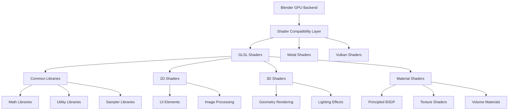
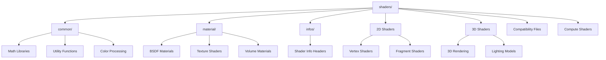
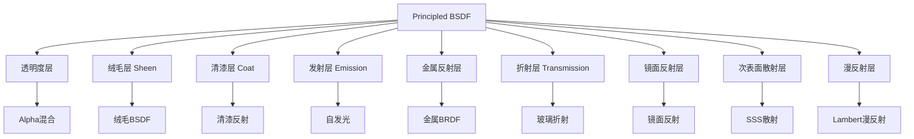

# 06. GPU shaders目录详解

## 目录
- [1. GPU着色器系统概述](#1-gpu着色器系统概述)
- [2. 目录结构分析](#2-目录结构分析)
- [3. 兼容性与抽象层](#3-兼容性与抽象层)
  - [3.1. GLSL兼容层](#31-glsl兼容层)
  - [3.2. Metal兼容层](#32-metal兼容层)
  - [3.3. C++兼容层](#33-c兼容层)
- [4. 通用着色器库](#4-通用着色器库)
  - [4.1. 数学库](#41-数学库)
  - [4.2. 工具库](#42-工具库)
  - [4.3. 采样器库](#43-采样器库)
- [5. 2D着色器实现](#5-2d着色器实现)
- [6. 3D着色器实现](#6-3d着色器实现)
- [7. 材质着色器系统](#7-材质着色器系统)
- [8. 着色器信息与编译](#8-着色器信息与编译)
- [9. 渲染管线集成](#9-渲染管线集成)
- [10. GLSL代码示例与解析](#10-glsl代码示例与解析)

## 1. GPU着色器系统概述

Blender的GPU着色器系统是一个高度模块化的架构，旨在为不同的GPU后端（OpenGL、Vulkan、Metal等）提供统一的着色器接口。该系统位于<span style="background-color:#e8f4fd">`source/blender/gpu/shaders`</span>目录中，包含了从基础的数学运算到复杂的材质计算的全部着色器代码。

### 系统架构图



### 核心设计原则

1. **跨平台兼容性**: 通过兼容层抽象不同图形API的差异
2. **模块化设计**: 将功能分解为可重用的库和组件
3. **统一接口**: 为C++代码提供一致的着色器访问方式
4. **性能优化**: 利用GPU并行计算能力加速渲染

## 2. 目录结构分析



### 目录功能说明

- **common/**: 包含所有着色器共享的库函数，如数学运算、颜色处理等
- **material/**: 材质相关的着色器，实现各种BSDF和纹理效果
- **infos/**: 着色器信息头文件，定义着色器接口和常量
- **根目录**: 具体的着色器实现文件，按功能分类

## 3. 兼容性与抽象层

### 3.1. GLSL兼容层

**定义位置**: `gpu_shader_compat_glsl.glsl`

GLSL兼容层提供了跨平台的类型定义和函数抽象：

```glsl
/** 定义位置: gpu_shader_compat_glsl.glsl:43-51 */
/* 类型别名定义 */
#define float2 vec2
#define float3 vec3
#define float4 vec4
#define int2 ivec2
#define int3 ivec3
#define int4 ivec4
#define uint2 uvec2
#define uint3 uvec3
#define uint4 uvec4
```

**定义位置**: `gpu_shader_compat_glsl.glsl:63-71`
```glsl
/* 矩阵类型别名 */
#define float2x2 mat2x2
#define float3x3 mat3x3
#define float4x4 mat4x4
#define float3x2 mat3x2
#define float4x3 mat4x3
```

这些定义确保了不同图形API之间的类型一致性，特别是C++和GLSL之间的数据传递。

### 3.2. Metal兼容层

**定义位置**: `gpu_shader_compat_msl.msl`

Metal着色语言兼容层为macOS平台提供Metal API支持：

```metal
/** 定义位置: gpu_shader_compat_msl.msl */
#include <metal_stdlib>
using namespace metal;

/* Metal特定优化和数据类型转换 */
```

### 3.3. C++兼容层

**定义位置**: `gpu_shader_compat_cxx.hh`

C++头文件提供了C++代码访问着色器的接口：

```cpp
/** 定义位置: gpu_shader_compat_cxx.hh */
#pragma once

/* C++类型定义和着色器接口声明 */
```

## 4. 通用着色器库

### 4.1. 数学库

数学库是着色器系统的基础，提供各种数学运算函数。

#### 基础数学运算

**定义位置**: `common/gpu_shader_common_math.glsl:12-30`

```glsl
void math_add(float a, float b, float c, out float result)
{
  result = a + b;
}

void math_subtract(float a, float b, float c, out float result)
{
  result = a - b;
}

void math_multiply(float a, float b, float c, out float result)
{
  result = a * b;
}

void math_divide(float a, float b, float c, out float result)
{
  result = safe_divide(a, b);
}
```

**功能说明**:
- <span style="background-color:#fff2cc">`safe_divide`</span>: 安全除法函数，避免除零错误
- 每个函数都遵循统一的参数模式：`math_operation(input1, input2, param, output)`

#### 高级数学运算

**定义位置**: `common/gpu_shader_common_math.glsl:32-46`

```glsl
void math_power(float a, float b, float c, out float result)
{
  if (a >= 0.0f) {
    result = compatible_pow(a, b);
  }
  else {
    float fraction = mod(abs(b), 1.0f);
    if (fraction > 0.999f || fraction < 0.001f) {
      result = compatible_pow(a, floor(b + 0.5f));
    }
    else {
      result = 0.0f;
    }
  }
}
```

**关键特性**:
- <span style="background-color:#d4edda">`compatible_pow`</span>: 兼容性幂函数，处理负数底数
- 对特殊情况进行边界检查，确保数值稳定性

#### 矩阵运算库

**定义位置**: `common/gpu_shader_math_matrix_lib.glsl:24-43`

```glsl
float2x2 invert(float2x2 mat)
{
  return inverse(mat);
}

float3x3 invert(float3x3 mat)
{
  return inverse(mat);
}

float4x4 invert(float4x4 mat)
{
  return inverse(mat);
}
```

**矩阵操作类型**:
- 矩阵求逆 (`invert`)
- 矩阵转置 (`transpose`, GLSL内置)
- 矩阵行列式 (`determinant`, GLSL内置)

### 4.2. 工具库

#### 属性加载库

**定义位置**: `common/gpu_shader_attribute_load_lib.glsl`

提供顶点属性的高效加载和处理：

```glsl
/** 定义位置: common/gpu_shader_attribute_load_lib.glsl */
/* 顶点属性加载的优化实现 */
```

#### 索引加载库

**定义位置**: `common/gpu_shader_index_load_lib.glsl`

处理索引缓冲区的数据访问：

```glsl
/** 定义位置: common/gpu_shader_index_load_lib.glsl */
/* 索引数据的高效访问模式 */
```

### 4.3. 采样器库

#### 双三次采样器

**定义位置**: `common/gpu_shader_bicubic_sampler_lib.glsl`

提供高质量的双三次纹理采样：

```glsl
/** 定义位置: common/gpu_shader_bicubic_sampler_lib.glsl */
/* 双三次插值的GPU实现 */
```

**技术细节**:
- 使用4x4邻域像素进行插值计算
- 相比双线性插值提供更平滑的结果
- 适用于高质量纹理放大和缩小

## 5. 2D着色器实现

2D着色器主要用于UI元素、图像处理和2D几何图形渲染。

### 5.1. 基础2D顶点着色器

**定义位置**: `gpu_shader_2D_vert.glsl:9-12`

```glsl
void main()
{
  gl_Position = ModelViewProjectionMatrix * float4(pos, 0.0f, 1.0f);
}
```

**实现原理**:
- <span style="background-color:#e8f4fd">`ModelViewProjectionMatrix`</span>: 变换矩阵，将2D坐标转换到裁剪空间
- <span style="background-color:#fff2cc">`pos`</span>: 输入的2D顶点位置
- Z坐标设为0，确保2D元素在正确的深度层

### 5.2. UI元素着色器

#### 区域边界着色器

**顶点着色器位置**: `gpu_shader_2D_area_borders_vert.glsl`
**片段着色器位置**: `gpu_shader_2D_area_borders_frag.glsl`

用于渲染窗口和面板的边界线：

```glsl
/** 定义位置: gpu_shader_2D_area_borders_vert.glsl */
/* UI区域边界的顶点处理 */

/** 定义位置: gpu_shader_2D_area_borders_frag.glsl */  
/* 边界线条的颜色和样式计算 */
```

#### 节点编辑器着色器

**节点套接字着色器位置**: `gpu_shader_2D_node_socket_frag.glsl`
**节点连接线着色器位置**: `gpu_shader_2D_nodelink_vert.glsl`

专门用于节点编辑器的渲染：

```glsl
/** 定义位置: gpu_shader_2D_node_socket_frag.glsl */
/* 节点套接字的圆形渲染和颜色计算 */

/** 定义位置: gpu_shader_2D_nodelink_vert.glsl */
/* 节点连接线的贝塞尔曲线生成 */
```

### 5.3. 图像处理着色器

#### 图像显示着色器

**顶点着色器位置**: `gpu_shader_2D_image_vert.glsl`
**片段着色器位置**: `gpu_shader_image_frag.glsl`

处理图像在视口中的显示：

```glsl
/** 定义位置: gpu_shader_2D_image_vert.glsl */
/* 图像四边形的顶点变换 */

/** 定义位置: gpu_shader_image_frag.glsl */
/* 图像数据的纹理采样和颜色空间转换 */
```

#### 图像混合着色器

**定义位置**: `gpu_shader_image_overlays_merge_frag.glsl`

实现图像与覆盖层的合成：

```glsl
/** 定义位置: gpu_shader_image_overlays_merge_frag.glsl */
/* 多层图像的alpha混合和合成算法 */
```

## 6. 3D着色器实现

3D着色器处理3D几何图形的渲染，包括模型变换、光照计算和材质效果。

### 6.1. 基础3D顶点着色器

**定义位置**: `gpu_shader_3D_vert.glsl:11-17`

```glsl
void main()
{
  gl_Position = ModelViewProjectionMatrix * float4(pos, 1.0f);

#ifdef USE_WORLD_CLIP_PLANES
  world_clip_planes_calc_clip_distance((clipPlanes.ClipModelMatrix * float4(pos, 1.0f)).xyz);
#endif
}
```

**关键特性**:
- 使用完整的4D坐标（w=1.0）进行3D变换
- 支持可选的世界裁剪平面功能
- 条件编译确保性能优化

### 6.2. 颜色渲染着色器

#### 平滑颜色着色器

**顶点着色器位置**: `gpu_shader_3D_smooth_color_vert.glsl`
**片段着色器位置**: `gpu_shader_3D_smooth_color_frag.glsl`

实现顶点颜色之间的平滑插值：

```glsl
/** 定义位置: gpu_shader_3D_smooth_color_vert.glsl */
/* 顶点颜色的插值传递 */

/** 定义位置: gpu_shader_3D_smooth_color_frag.glsl */
/* 插值颜色的最终输出 */
```

#### 平面颜色着色器

**定义位置**: `gpu_shader_3D_flat_color_vert.glsl`

使用统一颜色的平面着色：

```glsl
/** 定义位置: gpu_shader_3D_flat_color_vert.glsl */
/* 统一颜色的3D几何渲染 */
```

### 6.3. 点渲染系统

#### 均一大小点着色器

**定义位置**: `gpu_shader_3D_point_uniform_size_aa_vert.glsl`

实现抗锯齿的点渲染：

```glsl
/** 定义位置: gpu_shader_3D_point_uniform_size_aa_vert.glsl */
/* 点的大小计算和抗锯齿处理 */
```

**技术细节**:
- 点精灵的尺寸计算
- 边缘抗锯齿的alpha值计算
- 距离相关的点大小衰减

#### 变化大小点着色器

**定义位置**: `gpu_shader_3D_point_varying_size_varying_color_vert.glsl`

支持每个顶点不同大小和颜色的点渲染：

```glsl
/** 定义位置: gpu_shader_3D_point_varying_size_varying_color_vert.glsl */
/* 变化的点属性处理 */
```

## 7. 材质着色器系统

材质着色器实现了基于物理的渲染（PBR）和各种材质效果。

### 7.1. Principled BSDF着色器

**定义位置**: `material/gpu_shader_material_principled.glsl:32-268`

这是Blender中最复杂的材质着色器，实现了完整的Principled BSDF：

```glsl
void node_bsdf_principled(float4 base_color,
                          float metallic,
                          float roughness,
                          float ior,
                          float alpha,
                          float3 N,
                          float weight,
                          /* ... 更多参数 ... */
                          out Closure result)
{
  /* 参数验证和范围限制 */
  metallic = saturate(metallic);
  roughness = saturate(roughness);
  ior = max(ior, 1e-5f);
  alpha = saturate(alpha);
  
  /* 法线归一化 */
  N = safe_normalize(N);
  CN = safe_normalize(CN);
  float3 V = coordinate_incoming(g_data.P);
  float NV = dot(N, V);
```

**渲染层次结构**:



### 7.2. 纹理着色器

#### 噪声纹理

**定义位置**: `material/gpu_shader_material_tex_noise.glsl`

实现程序化噪声纹理生成：

```glsl
/** 定义位置: material/gpu_shader_material_tex_noise.glsl */
/* Perlin噪声和Worley噪声的GPU实现 */
```

**噪声算法类型**:
- Perlin噪声：平滑的梯度噪声
- Worley噪声：基于距离的细胞噪声
- 分形噪声：多层次的噪声叠加

#### Voronoi纹理

**定义位置**: `material/gpu_shader_material_voronoi.glsl`

实现Voronoi图纹理：

```glsl
/** 定义位置: material/gpu_shader_material_voronoi.glsl */
/* Voronoi图的高效GPU计算 */
```

**数学原理**:
$$ \text{Voronoi距离} = \min_{i \in \text{points}} \| \mathbf{p} - \mathbf{p}_i \|_2 $$

#### 天空纹理

**定义位置**: `material/gpu_shader_material_tex_sky.glsl`

模拟天空的预计算大气散射：

```glsl
/** 定义位置: material/gpu_shader_material_tex_sky.glsl */
/* Hosek-Wilkie天空模型的实现 */
```

### 7.3. 体积材质

#### 体积散射

**定义位置**: `material/gpu_shader_material_volume_scatter.glsl`

实现体积光的散射效果：

```glsl
/** 定义位置: material/gpu_shader_material_volume_scatter.glsl */
/* 体积散射的相位函数计算 */
```

**相位函数**:
- Henyey-Greenstein相位函数
- 瑞利散射
- 米氏散射

## 8. 着色器信息与编译

### 8.1. 着色器信息头文件

**定义位置**: `infos/gpu_shader_2D_checker_infos.hh:18-28`

着色器信息文件定义了着色器的接口和资源需求：

```cpp
GPU_SHADER_CREATE_INFO(gpu_shader_2D_checker)
VERTEX_IN(0, float2, pos)
FRAGMENT_OUT(0, float4, fragColor)
PUSH_CONSTANT(float4x4, ModelViewProjectionMatrix)
PUSH_CONSTANT(float4, color1)
PUSH_CONSTANT(float4, color2)
PUSH_CONSTANT(int, size)
VERTEX_SOURCE("gpu_shader_2D_vert.glsl")
FRAGMENT_SOURCE("gpu_shader_checker_frag.glsl")
DO_STATIC_COMPILATION()
GPU_SHADER_CREATE_END()
```

**关键宏定义**:
- <span style="background-color:#e8f4fd">`VERTEX_IN`</span>: 定义顶点输入属性
- <span style="background-color:#fff2cc">`FRAGMENT_OUT`</span>: 定义片段输出
- <span style="background-color:#d4edda">`PUSH_CONSTANT`</span>: 定义推送常量
- <span style="background-color:#f8d7da">`DO_STATIC_COMPILATION`</span>: 启用静态编译

### 8.2. CMake构建系统

**定义位置**: `CMakeLists.txt:17-47`

构建系统管理着色器的编译和依赖关系：

```cmake
set(SRC_GLSL_VERT
  gpu_shader_2D_area_borders_vert.glsl
  gpu_shader_2D_image_rect_vert.glsl
  gpu_shader_2D_image_vert.glsl
  /* ... 更多顶点着色器 ... */
)

set(SRC_GLSL_FRAG
  gpu_shader_2D_area_borders_frag.glsl
  gpu_shader_2D_line_dashed_frag.glsl
  gpu_shader_2D_node_socket_frag.glsl
  /* ... 更多片段着色器 ... */
)
```

**编译流程**:
1. GLSL源文件被预处理
2. 生成对应的C++头文件
3. 静态链接到最终可执行文件

## 9. 渲染管线集成

### 9.1. 全屏着色器系统

**定义位置**: `common/gpu_shader_fullscreen_vert.glsl:12-15`

```glsl
void main()
{
  fullscreen_vertex(gl_VertexID, gl_Position, screen_uv);
}
```

**功能说明**:
- <span style="background-color:#e8f4fd">`fullscreen_vertex`</span>: 生成全屏四边形顶点
- <span style="background-color:#fff2cc">`gl_VertexID`</span>: 使用顶点ID生成位置
- <span style="background-color:#d4edda">`screen_uv`</span>: 输出屏幕空间UV坐标

### 9.2. 着色器库引用系统

着色器通过include系统实现代码复用：

```glsl
#include "gpu_shader_common_math.glsl"
#include "gpu_shader_math_fast_lib.glsl"
#include "gpu_shader_math_vector_safe_lib.glsl"
```

**库层次结构**:
1. 基础兼容层 (`gpu_shader_compat.hh`)
2. 通用功能库 (`gpu_shader_common_*.glsl`)
3. 专用功能库 (`gpu_shader_math_*.glsl`)
4. 具体着色器实现

## 10. GLSL代码示例与解析

### 10.1. 安全数学运算

**定义位置**: `common/gpu_shader_math_safe_lib.glsl`

```glsl
float safe_divide(float a, float b)
{
  return (b != 0.0f) ? a / b : 0.0f;
}

float safe_mod(float a, float b)
{
  return (b != 0.0f) ? mod(a, b) : 0.0f;
}
```

**设计目的**:
- 防止除零错误导致的GPU崩溃
- 确保数值计算的稳定性
- 提供一致的错误处理机制

### 10.2. 颜色空间转换

**定义位置**: `gpu_shader_colorspace_lib.glsl`

```glsl
/** 定义位置: gpu_shader_colorspace_lib.glsl */
/* 线性sRGB和感知sRGB之间的转换 */
float linear_to_srgb(float linear)
{
  return mix(
    linear * 12.92f,
    pow(max(linear, 0.0f), 1.0f / 2.4f) * 1.055f - 0.055f,
    step(0.0031308f, linear)
  );
}
```

**数学公式**:
$$
C_{\text{sRGB}} = \begin{cases}
12.92 \times C_{\text{linear}} & \text{if } C_{\text{linear}} \leq 0.0031308 \\
1.055 \times C_{\text{linear}}^{1/2.4} - 0.055 & \text{otherwise}
\end{cases}
$$

### 10.3. BSDF查找表

**定义位置**: `material/gpu_shader_material_eevee_specular.glsl`

```glsl
float2 brdf_lut(float NH, float rough, float ior, bool do_multiscatter)
{
  /* 从预计算LUT中采样BRDF数据 */
  float2 lut_coords = float2(NH, rough);
  return texture(brdf_lut_texture, lut_coords).rg;
}
```

**技术优势**:
- 预计算复杂的光照积分
- 实时渲染中的高性能BRDF计算
- 支持多次散射效果

### 10.4. 法线处理

**定义位置**: `common/gpu_shader_math_vector_safe_lib.glsl`

```glsl
float3 safe_normalize(float3 v)
{
  float len = length(v);
  return (len > 0.0f) ? v / len : float3(0.0f, 0.0f, 1.0f);
}
```

**安全考虑**:
- 避免零向量归一化
- 提供合理的默认法线方向
- 确保渲染连续性

## 总结

Blender的GPU着色器系统展现了现代图形编程的最佳实践：

### 技术特点

1. **跨平台抽象**: 通过兼容层实现多API支持
2. **模块化设计**: 功能分解为可重用的库组件
3. **性能优化**: 充分利用GPU并行计算能力
4. **代码复用**: 通过include系统避免重复代码
5. **类型安全**: 严格的类型定义和转换

### 渲染质量

1. **物理准确性**: 实现基于物理的材质模型
2. **数值稳定性**: 安全的数学运算和边界处理
3. **抗锯齿**: 高质量的边缘平滑处理
4. **色彩管理**: 准确的颜色空间转换

### 开发效率

1. **统一接口**: 简化着色器与C++代码的集成
2. **自动编译**: CMake系统管理着色器构建
3. **调试支持**: 丰富的错误检查和诊断信息
4. **扩展性**: 易于添加新的着色器功能

这个着色器系统为Blender提供了强大的GPU渲染能力，支持从简单的2D UI到复杂的3D材质的全部渲染需求。