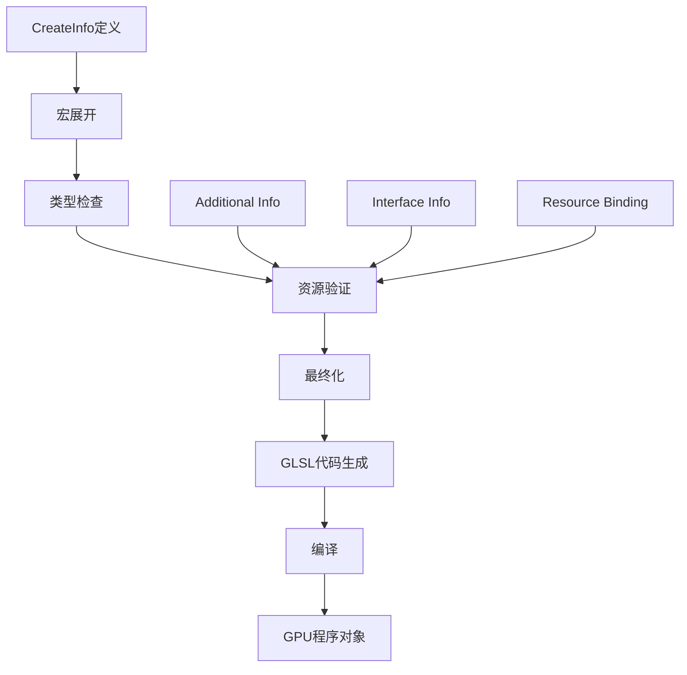
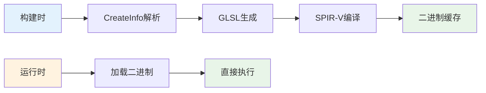

# 07. GPU infos目录详解

## 目录

1. [概述](#1-概述)
2. [CreateInfo系统架构](#2-createinfo系统架构)
3. [接口信息系统](#3-接口信息系统)
4. [着色器资源管理](#4-着色器资源管理)
5. [编译系统](#5-编译系统)
6. [Infos文件分类详解](#6-infos文件分类详解)
7. [使用模式](#7-使用模式)
8. [性能优化](#8-性能优化)

## 1. 概述

<span style="background-color: #e3f2fd;">GPU infos目录</span>是Blender GPU着色器系统的核心组件，位于`source/blender/gpu/shaders/infos/`。该目录包含了所有着色器的<span style="color: #1976d2;">CreateInfo描述文件</span>，用于定义着色器的接口、资源和编译属性。

### 1.1 CreateInfo系统

CreateInfo系统是Blender GPU后端的关键创新，提供了：

- <span style="color: #388e3c;">声明式着色器配置</span>
- <span style="color: #388e3c;">跨API兼容性</span>  
- <span style="color: #388e3c;">自动资源管理</span>
- <span style="color: #388e3c;">编译时优化</span>

### 1.2 目录结构

```
source/blender/gpu/shaders/infos/
├── gpu_interface_infos.hh              # 通用接口定义
├── gpu_shader_*_infos.hh                # 各类着色器信息
├── gpu_clip_planes_infos.hh            # 裁剪平面支持
├── gpu_srgb_to_framebuffer_space_infos.hh # 颜色空间转换
└── ...
```

## 2. CreateInfo系统架构

### 2.1 核心类结构

CreateInfo系统的核心是`ShaderCreateInfo`类，定义在`source/blender/gpu/intern/gpu_shader_create_info.hh:750`：

```cpp
struct ShaderCreateInfo {
  /** 着色器名称，用于调试 */
  std::string name_;
  /** 是否为静态编译着色器 */
  bool do_static_compilation_ = false;
  /** 是否为运行时生成的着色器 */
  bool is_generated_ = true;
  /** 是否已最终化 */
  bool finalized_ = false;
  /** 是否自动分配资源位置 */
  bool auto_resource_location_ = false;
  /** 内置变量位掩码 */
  BuiltinBits builtins_ = BuiltinBits::NONE;
  // ... 其他成员
};
```

### 2.2 CreateInfo工作流程



### 2.3 宏系统

CreateInfo使用大量宏来简化声明：

```cpp
// 定义位置: source/blender/gpu/intern/gpu_shader_create_info.hh:65
#define GPU_SHADER_CREATE_INFO(_info) \
  static inline void autocomplete_helper_info_##_info() \
  { \
    ShaderCreateInfo _info(#_info); \
    _info

#define GPU_SHADER_CREATE_END() \
    ; \
    }
```

## 3. 接口信息系统

### 3.1 StageInterfaceInfo

定义在`source/blender/gpu/intern/gpu_shader_create_info.hh:691`，用于着色器阶段间数据传递：

```cpp
struct StageInterfaceInfo {
  StringRefNull name;
  StringRefNull instance_name;
  Vector<InOut> inouts;

  struct InOut {
    Interpolation interp;  // 插值类型: SMOOTH, FLAT, NO_PERSPECTIVE
    Type type;            // 数据类型
    ResourceString name;  // 变量名
  };
};
```

### 3.2 插值修饰符

```cpp
// 位置: source/blender/gpu/intern/gpu_shader_create_info.hh:120
#define SMOOTH(type, name) .smooth(Type::type##_t, #name)
#define FLAT(type, name) .flat(Type::type##_t, #name)
#define NO_PERSPECTIVE(type, name) .no_perspective(Type::type##_t, #name)
```

### 3.3 接口使用示例

```cpp
// 位置: source/blender/gpu/shaders/infos/gpu_interface_infos.hh:13
GPU_SHADER_INTERFACE_INFO(flat_color_iface)
FLAT(float4, finalColor)
GPU_SHADER_INTERFACE_END()

// 位置: source/blender/gpu/shaders/infos/gpu_interface_infos.hh:21
GPU_SHADER_INTERFACE_INFO(smooth_color_iface)
SMOOTH(float4, finalColor)
GPU_SHADER_INTERFACE_END()
```

## 4. 着色器资源管理

### 4.1 资源类型系统

CreateInfo支持多种资源类型，定义在`source/blender/gpu/intern/gpu_shader_create_info.hh:954`：

```cpp
struct Resource {
  enum BindType {
    UNIFORM_BUFFER = 0,
    STORAGE_BUFFER,
    SAMPLER,
    IMAGE,
  };
  
  BindType bind_type;
  int slot;
  Conditions conditions;
  union {
    Sampler sampler;
    Image image;
    UniformBuf uniformbuf;
    StorageBuf storagebuf;
  };
};
```

### 4.2 频率管理

资源按更新频率分组，优化性能：

```cpp
// 位置: source/blender/gpu/intern/gpu_shader_create_info.hh:614
enum class Frequency {
  BATCH = 0,   // 每绘制调用更新
  PASS,        // 每渲染通道更新  
  GEOMETRY,    // 从几何体获取
};

Vector<Resource, 0> pass_resources_;     // 通道级资源
Vector<Resource, 0> batch_resources_;    // 批次级资源
Vector<Resource, 0> geometry_resources_; // 几何体级资源
```

### 4.3 资源绑定宏

```cpp
// 位置: source/blender/gpu/intern/gpu_shader_create_info.hh:162
#define UNIFORM_BUF(slot, type_name, name) .uniform_buf(slot, #type_name, #name)

#define STORAGE_BUF(slot, qualifiers, type_name, name) \
  .storage_buf(slot, Qualifier::qualifiers, STRINGIFY(type_name), #name)

#define SAMPLER(slot, type, name) .sampler(slot, ImageType::type, #name)

#define IMAGE(slot, format, qualifiers, type, name) \
  .image(slot, blender::gpu::TextureFormat::format, \
         Qualifier::qualifiers, ImageReadWriteType::type, #name)
```

## 5. 编译系统

### 5.1 静态编译标记

```cpp
// 位置: source/blender/gpu/intern/gpu_shader_create_info.hh:205
#define DO_STATIC_COMPILATION() .do_static_compilation(true)
```

静态编译的着色器在构建时预编译，减少运行时延迟。

### 5.2 附加信息系统

CreateInfo支持通过`ADDITIONAL_INFO`组合现有配置：

```cpp
// 位置: source/blender/gpu/intern/gpu_shader_create_info.hh:211
#define ADDITIONAL_INFO(info_name) .additional_info(#info_name)
```

### 5.3 条件编译

```cpp
struct Conditions : Vector<ConditionFn, 0> {
  bool evaluate(Span<CompilationConstant> constants) const {
    if (is_empty()) return true;
    for (const auto &cond : *this) {
      if (cond(constants)) return true;
    }
    return false;
  }
};
```

## 6. Infos文件分类详解

### 6.1 接口定义文件

#### gpu_interface_infos.hh
位置：`source/blender/gpu/shaders/infos/gpu_interface_infos.hh:13`

定义常用的着色器接口：

```cpp
GPU_SHADER_INTERFACE_INFO(flat_color_iface)
FLAT(float4, finalColor)
GPU_SHADER_INTERFACE_END()

GPU_SHADER_INTERFACE_INFO(smooth_tex_coord_interp_iface)
SMOOTH(float2, texCoord_interp)
GPU_SHADER_INTERFACE_END()
```

### 6.2 功能支持文件

#### gpu_clip_planes_infos.hh
位置：`source/blender/gpu/shaders/infos/gpu_clip_planes_infos.hh`

提供裁剪平面支持：
```cpp
GPU_SHADER_CREATE_INFO(gpu_clip_planes)
BUILTINS(BuiltinBits::CLIP_DISTANCES)
PUSH_CONSTANT(float4x4, ModelMatrix)
PUSH_CONSTANT_ARRAY(float4, ClipPlanes, 6)
GPU_SHADER_CREATE_END()
```

#### gpu_srgb_to_framebuffer_space_infos.hh
位置：`source/blender/gpu/shaders/infos/gpu_srgb_to_framebuffer_space_infos.hh`

处理颜色空间转换：
```cpp
GPU_SHADER_CREATE_INFO(gpu_srgb_to_framebuffer_space)
DEFINE("GPU_SRGB_TO_FRAMEBUFFER_SPACE")
GPU_SHADER_CREATE_END()
```

### 6.3 2D着色器信息文件

#### gpu_shader_2D_image_infos.hh
位置：`source/blender/gpu/shaders/infos/gpu_shader_2D_image_infos.hh:21`

定义2D图像渲染的基础配置：

```cpp
GPU_SHADER_CREATE_INFO(gpu_shader_2D_image_common)
VERTEX_IN(0, float2, pos)
VERTEX_IN(1, float2, texCoord)
VERTEX_OUT(smooth_tex_coord_interp_iface)
FRAGMENT_OUT(0, float4, fragColor)
PUSH_CONSTANT(float4x4, ModelViewProjectionMatrix)
SAMPLER(0, sampler2D, image)
VERTEX_SOURCE("gpu_shader_2D_image_vert.glsl")
ADDITIONAL_INFO(gpu_srgb_to_framebuffer_space)
GPU_SHADER_CREATE_END()
```

#### gpu_shader_2D_widget_infos.hh
位置：`source/blender/gpu/shaders/infos/gpu_shader_2D_widget_infos.hh:40`

复杂的UI部件着色器配置：

```cpp
GPU_SHADER_CREATE_INFO(gpu_shader_2D_widget_shared)
DEFINE_VALUE("MAX_PARAM", STRINGIFY(MAX_PARAM))
PUSH_CONSTANT(float4x4, ModelViewProjectionMatrix)
PUSH_CONSTANT(float3, checkerColorAndSize)
VERTEX_OUT(gpu_widget_iface)
FRAGMENT_OUT(0, float4, fragColor)
VERTEX_SOURCE("gpu_shader_2D_widget_base_vert.glsl")
FRAGMENT_SOURCE("gpu_shader_2D_widget_base_frag.glsl")
ADDITIONAL_INFO(gpu_srgb_to_framebuffer_space)
GPU_SHADER_CREATE_END()
```

### 6.4 3D着色器信息文件

#### gpu_shader_3D_uniform_color_infos.hh
位置：`source/blender/gpu/shaders/infos/gpu_shader_3D_uniform_color_infos.hh:20`

3D统一颜色着色器：

```cpp
GPU_SHADER_CREATE_INFO(gpu_shader_3D_uniform_color)
VERTEX_IN(0, float3, pos)
FRAGMENT_OUT(0, float4, fragColor)
PUSH_CONSTANT(float4x4, ModelViewProjectionMatrix)
PUSH_CONSTANT(float4, color)
VERTEX_SOURCE("gpu_shader_3D_vert.glsl")
FRAGMENT_SOURCE("gpu_shader_uniform_color_frag.glsl")
ADDITIONAL_INFO(gpu_srgb_to_framebuffer_space)
DO_STATIC_COMPILATION()
GPU_SHADER_CREATE_END()
```

### 6.5 全屏着色器信息

#### gpu_shader_fullscreen_infos.hh
位置：`source/blender/gpu/shaders/infos/gpu_shader_fullscreen_infos.hh:12`

全屏四边形渲染基础：

```cpp
GPU_SHADER_INTERFACE_INFO(gpu_fullscreen_iface)
SMOOTH(float2, screen_uv)
GPU_SHADER_INTERFACE_END()

GPU_SHADER_CREATE_INFO(gpu_fullscreen)
VERTEX_OUT(gpu_fullscreen_iface)
VERTEX_SOURCE("gpu_shader_fullscreen_vert.glsl")
GPU_SHADER_CREATE_END()
```

### 6.6 测试着色器信息

#### gpu_shader_test_infos.hh
位置：`source/blender/gpu/shaders/infos/gpu_shader_test_infos.hh:20`

包含各种测试用例：

```cpp
GPU_SHADER_CREATE_INFO(gpu_compute_1d_test)
LOCAL_GROUP_SIZE(1)
IMAGE(1, SFLOAT_32_32_32_32, write, image1D, img_output)
COMPUTE_SOURCE("gpu_compute_1d_test.glsl")
DO_STATIC_COMPILATION()
GPU_SHADER_CREATE_END()

GPU_SHADER_CREATE_INFO(gpu_push_constants_test)
ADDITIONAL_INFO(gpu_push_constants_base_test)
PUSH_CONSTANT(float, float_in)
PUSH_CONSTANT(float2, vec2_in)
PUSH_CONSTANT(float3, vec3_in)
PUSH_CONSTANT(float4, vec4_in)
DO_STATIC_COMPILATION()
GPU_SHADER_CREATE_END()
```

## 7. 使用模式

### 7.1 基础使用模式

```cpp
// 定义简单的2D图像着色器
GPU_SHADER_CREATE_INFO(my_2d_image_shader)
VERTEX_IN(0, float2, pos)
VERTEX_IN(1, float2, texCoord)
FRAGMENT_OUT(0, float4, fragColor)
PUSH_CONSTANT(float4x4, ModelViewProjectionMatrix)
SAMPLER(0, sampler2D, image)
VERTEX_SOURCE("my_2d_image_vert.glsl")
FRAGMENT_SOURCE("my_2d_image_frag.glsl")
DO_STATIC_COMPILATION()
GPU_SHADER_CREATE_END()
```

### 7.2 组合使用模式

```cpp
// 使用现有接口和附加信息
GPU_SHADER_CREATE_INFO(my_composite_shader)
VERTEX_IN(0, float2, pos)
VERTEX_OUT(smooth_tex_coord_interp_iface)
FRAGMENT_OUT(0, float4, fragColor)
PUSH_CONSTANT(float4x4, ModelViewProjectionMatrix)
SAMPLER(0, sampler2D, colorTexture)
SAMPLER(1, sampler2D, depthTexture)
VERTEX_SOURCE("my_composite_vert.glsl")
FRAGMENT_SOURCE("my_composite_frag.glsl")
ADDITIONAL_INFO(gpu_fullscreen)
ADDITIONAL_INFO(gpu_srgb_to_framebuffer_space)
DO_STATIC_COMPILATION()
GPU_SHADER_CREATE_END()
```

### 7.3 条件资源模式

```cpp
GPU_SHADER_CREATE_INFO(my_conditional_shader)
VERTEX_IN(0, float3, pos)
FRAGMENT_OUT(0, float4, fragColor)
PUSH_CONSTANT(float4x4, ModelViewProjectionMatrix)

// 条件性绑定纹理
.image(0, RGBA8, read_write, image2D, outputTexture, 
       Frequency::PASS, [](auto constants) { return constants[0].value.i > 0; })

VERTEX_SOURCE("my_conditional_vert.glsl")
FRAGMENT_SOURCE("my_conditional_frag.glsl")
GPU_SHADER_CREATE_END()
```

## 8. 性能优化

### 8.1 静态编译优化



静态编译着色器通过`DO_STATIC_COMPILATION()`标记，在构建时预编译为SPIR-V二进制，避免运行时编译延迟。

### 8.2 资源频率优化

通过频率分组减少状态切换：
- <span style="background-color: #e8f5e8;">PASS资源</span>：整个渲染通道不变
- <span style="background-color: #fff3e0;">BATCH资源</span>：每批次更新
- <span style="background-color: #e3f2fd;">GEOMETRY资源</span>：每次绘制更新

### 8.3 特化常量优化

特化常量允许运行时配置但不重新编译完整着色器：

```cpp
// 位置: source/blender/gpu/intern/gpu_shader_create_info.hh:266
#define SPECIALIZATION_CONSTANT(type, name, default_value) \
  .specialization_constant(Type::type##_t, #name, default_value)

// 使用示例
GPU_SHADER_CREATE_INFO(my_specialized_shader)
SPECIALIZATION_CONSTANT(int, quality_level, 2)
SPECIALIZATION_CONSTANT(bool, enable_shadows, true)
// ...
GPU_SHADER_CREATE_END()

// 运行时设置
GPU_shader_constant_int(shader, "quality_level", 4);
GPU_shader_constant_bool(shader, "enable_shadows", false);
```

### 8.4 内存布局优化

CreateInfo自动优化内存布局：

- 按对齐要求排序uniform变量
- 合并相似资源描述
- 最小化push constant大小（限制128字节）

```cpp
// 位置: source/blender/gpu/intern/gpu_shader_create_info.hh:430
Self &push_constant(Type type, StringRefNull name, int array_size = 0) {
  BLI_assert(type != Type::uint_t);  // 不支持uint push constant
  BLI_assert_msg(name.find("[") == -1, "数组语法禁止，使用array_size参数");
  // ...
}
```

## 总结

GPU infos目录的CreateInfo系统是Blender GPU架构的核心创新，提供了：

1. **声明式配置**：通过清晰的数据结构描述着色器
2. **跨API兼容**：自动适配不同GPU后端
3. **性能优化**：静态编译、资源频率管理、特化常量
4. **模块化设计**：通过ADDITIONAL_INFO重用配置
5. **类型安全**：编译时检查资源绑定和类型匹配

该系统显著简化了着色器开发流程，提高了代码可维护性和运行时性能。