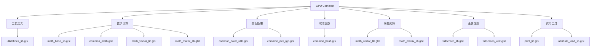
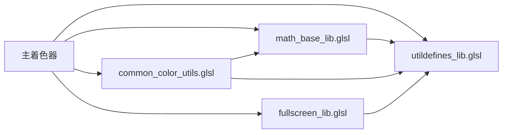

# 08 GPU Common目录详解

## 目录

1. [概述](#1-概述)
2. [通用库架构设计](#2-通用库架构设计)
3. [工具定义库](#3-工具定义库)
4. [数学计算库](#4-数学计算库)
5. [颜色处理库](#5-颜色处理库)
6. [哈希函数库](#6-哈希函数库)
7. [向量矩阵运算库](#7-向量矩阵运算库)
8. [全屏渲染库](#8-全屏渲染库)
9. [实用工具库](#9-实用工具库)
10. [使用示例](#10-使用示例)

---

## 1. 概述

GPU通用着色器库位于 `source/blender/gpu/shaders/common/` 目录，提供了<span style="color:#FF6B6B;background:#FFF0F0">可重用的GLSL函数和宏定义</span>，用于支持各种GPU渲染任务。这些库函数被其他着色器通过 `#include` 指令引用，构成了Blender GPU渲染系统的基础组件。

### 1.1 目录结构图



## 2. 通用库架构设计

通用库采用<span style="background:#E8F5E8;color:#2E7D32">模块化设计</span>，每个库专注于特定功能领域，通过 `#pragma once` 和 `#include` 指令管理依赖关系。

### 2.1 设计原则

- **模块化**: 每个库文件专注于特定功能领域
- **可重用性**: 函数设计为通用接口，支持多种数据类型
- **性能优化**: 提供GPU友好的高效算法实现
- **类型安全**: 使用模板和函数重载确保类型正确性
- **跨平台兼容**: 确保在不同GPU架构上的一致行为

### 2.2 命名规则

| 类型 | 规则 | 示例 |
|------|------|------|
| 库文件 | `gpu_shader_[category]_[subcategory]_lib.glsl` | `gpu_shader_math_base_lib.glsl` |
| 函数 | `[domain]_[action]_[object]` | `math_multiply_add`, `rgb_to_hsv` |
| 宏定义 | `[CATEGORY]_[NAME]` | `FLT_MAX`, `UNPACK3` |
| 模板函数 | 使用泛型描述 | `normalize_and_get_length` |

## 3. 工具定义库

### 3.1 核心常量和宏定义

文件位置: `source/blender/gpu/shaders/common/gpu_shader_utildefines_lib.glsl`

该库定义了<span style="background:#FFF3E0;color:#E65100">基础常量、宏和实用函数</span>，为整个着色器系统提供统一的工具支持。

#### 3.1.1 浮点常量定义

```glsl
// 定义位置: gpu_shader_utildefines_lib.glsl:9-23
#ifndef FLT_MAX
#  define FLT_MAX uintBitsToFloat(0x7F7FFFFFu)
#  define FLT_MIN uintBitsToFloat(0x00800000u)
#  define FLT_EPSILON 1.192092896e-07F
#endif
#ifndef SHRT_MAX
#  define SHRT_MAX 0x00007FFF
#  define INT_MAX 0x7FFFFFFF
#  define USHRT_MAX 0x0000FFFFu
#  define UINT_MAX 0xFFFFFFFFu
#endif
#define NAN_FLT uintBitsToFloat(0x7FC00000u)
#define FLT_11_MAX uintBitsToFloat(0x477E0000)
#define FLT_10_MAX uintBitsToFloat(0x477C0000)
```

这些常量使用 `uintBitsToFloat()` 函数直接构造IEEE 754浮点数表示，确保跨平台的精度一致性。

#### 3.1.2 数组解包宏

```glsl
// 定义位置: gpu_shader_utildefines_lib.glsl:25-27
#define UNPACK2(a) (a)[0], (a)[1]
#define UNPACK3(a) (a)[0], (a)[1], (a)[2]
#define UNPACK4(a) (a)[0], (a)[1], (a)[2], (a)[3]
```

这些宏用于将向量组件解包为函数参数，简化多参数函数的调用。

#### 3.1.3 范围检查宏

```glsl
// 定义位置: gpu_shader_utildefines_lib.glsl:37-40
#define in_range_inclusive(val, min_v, max_v) (all(greaterThanEqual(val, min_v)) && all(lessThanEqual(val, max_v)))
#define in_range_exclusive(val, min_v, max_v) (all(greaterThan(val, min_v)) && all(lessThan(val, max_v)))
#define in_texture_range(texel, tex) (all(greaterThanEqual(texel, int2(0))) && all(lessThan(texel, textureSize(tex, 0).xy)))
#define in_image_range(texel, tex) (all(greaterThanEqual(texel, int2(0))) && all(lessThan(texel, imageSize(tex).xy)))
```

这些宏提供了高效的边界检查功能，用于纹理访问和图像操作的安全验证。

#### 3.1.4 位操作函数

```glsl
// 定义位置: gpu_shader_utildefines_lib.glsl:46-89
bool flag_test(uint flag, uint val)
{
  return (flag & val) != 0u;
}

void set_flag_from_test(inout uint value, bool test, uint flag)
{
  if (test) {
    value |= flag;
  }
  else {
    value &= ~flag;
  }
}

uint packUvec2x16(uint2 a)
{
  a = (a & 0xFFFFu) << uint2(0u, 16u);
  return a.x | a.y;
}

uint2 unpackUvec2x16(uint a)
{
  return (uint2(a) >> uint2(0u, 16u)) & uint2(0xFFFFu);
}
```

这些函数用于高效的位标志操作和数据打包，常见于状态管理和数据压缩场景。

### 3.2 数值排序函数

```glsl
// 定义位置: gpu_shader_utildefines_lib.glsl:121-134
int floatBitsToOrderedInt(float value)
{
  int int_value = floatBitsToInt(value);
  return (int_value < 0) ? (int_value ^ 0x7FFFFFFF) : int_value;
}

float orderedIntBitsToFloat(int int_value)
{
  return intBitsToFloat((int_value < 0) ? (int_value ^ 0x7FFFFFFF) : int_value);
}
```

这些函数实现了浮点数的<span style="background:#F3E5F5;color:#7B1FA2">有序整数映射</span>，使得浮点数可以直接作为原子操作的键值使用。

## 4. 数学计算库

数学计算库提供了<span style="background:#E3F2FD;color:#1565C0">完整的数学运算支持</span>，从基础运算到高级数学函数，覆盖了GPU渲染中常见的数学需求。

### 4.1 基础数学库

文件位置: `source/blender/gpu/shaders/common/gpu_shader_math_base_lib.glsl`

#### 4.1.1 快速幂函数

```glsl
// 定义位置: gpu_shader_math_base_lib.glsl:11-38
float pow2f(float x) { return x * x; }
float pow3f(float x) { return x * x * x; }
float pow4f(float x) { return pow2f(pow2f(x)); }
float pow5f(float x) { return pow4f(x) * x; }
float pow6f(float x) { return pow2f(pow3f(x)); }
float pow7f(float x) { return pow6f(x) * x; }
float pow8f(float x) { return pow2f(pow4f(x)); }
```

这些函数避免了 `powf()` 函数的<span style="color:#D32F2F">性能开销</span>，适用于整数幂的快速计算。

#### 4.1.2 几何计算

```glsl
// 定义位置: gpu_shader_math_base_lib.glsl:40-60
float square(float v) { return v * v; }
float2 square(float2 v) { return v * v; }
float3 square(float3 v) { return v * v; }
float4 square(float4 v) { return v * v; }

float hypot(float x, float y)
{
  return sqrt(x * x + y * y);
}
```

#### 4.1.3 整数运算

```glsl
// 定义位置: gpu_shader_math_base_lib.glsl:76-96
int ceil_to_multiple(int a, int b)
{
  return ((a + b - 1) / b) * b;
}

uint divide_ceil(uint a, uint b)
{
  return (a + b - 1u) / b;
}
```

这些函数实现了<span style="background:#FFF8E1;color:#F57C00">向上取整除法</span>，常用于计算数组大小和内存分配。

### 4.2 通用数学函数库

文件位置: `source/blender/gpu/shaders/common/gpu_shader_common_math.glsl`

#### 4.2.1 基础算术运算

```glsl
// 定义位置: gpu_shader_common_math.glsl:12-30
void math_add(float a, float b, float c, out float result)
{
  result = a + b;
}

void math_multiply(float a, float b, float c, out float result)
{
  result = a * b;
}

void math_divide(float a, float b, float c, out float result)
{
  result = safe_divide(a, b);
}

void math_power(float a, float b, float c, out float result)
{
  if (a >= 0.0f) {
    result = compatible_pow(a, b);
  }
  else {
    float fraction = mod(abs(b), 1.0f);
    if (fraction > 0.999f || fraction < 0.001f) {
      result = compatible_pow(a, floor(b + 0.5f));
    }
    else {
      result = 0.0f;
    }
  }
}
```

这些函数采用了<span style="background:#FFEBEE;color:#C62828">安全除法</span>和<span style="background:#FFEBEE;color:#C62828">兼容幂运算</span>，避免了数值计算中的边界情况。

#### 4.2.2 三角函数

```glsl
// 定义位置: gpu_shader_common_math.glsl:149-199
void math_sine(float a, float b, float c, out float result)
{
  result = sin(a);
}

void math_arctan2(float a, float b, float c, out float result)
{
  result = ((a == 0.0f && b == 0.0f) ? 0.0f : atan(a, b));
}
```

特别注意 `math_arctan2` 函数对 $(0, 0)$ 输入的特殊处理，确保跨平台的一致性。

#### 4.2.3 平滑最小/最大函数

```glsl
// 定义位置: gpu_shader_common_math.glsl:222-237
void math_smoothmin(float a, float b, float c, out float result)
{
  if (c != 0.0f) {
    float h = max(c - abs(a - b), 0.0f) / c;
    result = min(a, b) - h * h * h * c * (1.0f / 6.0f);
  }
  else {
    result = min(a, b);
  }
}

void math_smoothmax(float a, float b, float c, out float result)
{
  math_smoothmin(-a, -b, c, result);
  result = -result;
}
```

这些函数实现了基于<span style="background:#E1F5FE;color:#0277BD">多项式插值</span>的平滑过渡，广泛应用于程序化建模和动画。

## 5. 颜色处理库

### 5.1 颜色空间转换

文件位置: `source/blender/gpu/shaders/common/gpu_shader_common_color_utils.glsl`

#### 5.1.1 RGB与HSV转换

```glsl
// 定义位置: gpu_shader_common_color_utils.glsl:9-51
void rgb_to_hsv(float4 rgb, out float4 outcol)
{
  float cmax, cmin, h, s, v, cdelta;
  float3 c;

  cmax = max(rgb[0], max(rgb[1], rgb[2]));
  cmin = min(rgb[0], min(rgb[1], rgb[2]));
  cdelta = cmax - cmin;

  v = cmax;
  if (cmax != 0.0f) {
    s = cdelta / cmax;
  }
  else {
    s = 0.0f;
    h = 0.0f;
  }

  if (s == 0.0f) {
    h = 0.0f;
  }
  else {
    c = (float3(cmax) - rgb.xyz) / cdelta;

    if (rgb.x == cmax) {
      h = c[2] - c[1];
    }
    else if (rgb.y == cmax) {
      h = 2.0f + c[0] - c[2];
    }
    else {
      h = 4.0f + c[1] - c[0];
    }

    h /= 6.0f;

    if (h < 0.0f) {
      h += 1.0f;
    }
  }

  outcol = float4(h, s, v, rgb.w);
}
```

该算法基于<span style="background:#F1F8E9;color:#558B2F">色彩六面体模型</span>，实现了精确的RGB到HSV转换，保持了色调的连续性。

#### 5.1.2 线性与sRGB转换

```glsl
// 定义位置: gpu_shader_common_color_utils.glsl:259-287
float linear_rgb_to_srgb(float color)
{
  if (color < 0.0031308f) {
    return (color < 0.0f) ? 0.0f : color * 12.92f;
  }

  return 1.055f * pow(color, 1.0f / 2.4f) - 0.055f;
}

float srgb_to_linear_rgb(float color)
{
  if (color < 0.04045f) {
    return (color < 0.0f) ? 0.0f : color * (1.0f / 12.92f);
  }

  return pow((color + 0.055f) * (1.0f / 1.055f), 2.4f);
}
```

实现了IEC 61966-2-1标准定义的<span style="color:#7B1FA2">伽马校正曲线</span>：
$$
C_{\text{linear}} = \begin{cases}
\frac{C_{\text{srgb}}}{12.92} & \text{if } C_{\text{srgb}} \leq 0.04045 \\
\left(\frac{C_{\text{srgb}} + 0.055}{1.055}\right)^{2.4} & \text{if } C_{\text{srgb}} > 0.04045
\end{cases}
$$

#### 5.1.3 YUV颜色空间转换

```glsl
// 定义位置: gpu_shader_common_color_utils.glsl:154-234
void ycca_to_rgba_itu_709(float4 ycca, out float4 color)
{
  ycca.xyz *= 255.0f;
  ycca.xyz -= float3(16.0f, 128.0f, 128.0f);
  color.rgb = float3x3(1.164f, 1.164f, 1.164f, 0.0f, -0.213f, 2.115f, 1.793f, -0.534f, 0.0f) *
              ycca.xyz;
  color.rgb /= 255.0f;
  color.a = ycca.a;
}
```

实现了ITU-R BT.709标准的YUV到RGB转换，常用于视频处理和广播应用。

### 5.2 透明度处理

```glsl
// 定义位置: gpu_shader_common_color_utils.glsl:239-257
void color_alpha_premultiply(float4 color, out float4 result)
{
  result = float4(color.rgb * color.a, color.a);
}

void color_alpha_unpremultiply(float4 color, out float4 result)
{
  if (color.a == 0.0f || color.a == 1.0f) {
    result = color;
  }
  else {
    result = float4(color.rgb / color.a, color.a);
  }
}
```

这些函数支持<span style="background:#E8EAF6;color:#3949AB">预乘透明度</span>和<span style="background:#E8EAF6;color:#3949AB">非预乘透明度</span>之间的转换，确保正确的混合计算。

## 6. 哈希函数库

文件位置: `source/blender/gpu/shaders/common/gpu_shader_common_hash.glsl`

该库实现了多种<span style="background:#FBE9E7;color:#D84315">高性能哈希算法</span>，用于程序化生成、噪声函数和数据分布。

### 6.1 Jenkins哈希函数

```glsl
// 定义位置: gpu_shader_common_hash.glsl:13-53
#define rot(x, k) (((x) << (k)) | ((x) >> (32 - (k))))

#define mix(a, b, c) \
  { \
    a -= c; \
    a ^= rot(c, 4); \
    c += b; \
    b -= a; \
    b ^= rot(a, 6); \
    a += c; \
    c -= b; \
    c ^= rot(b, 8); \
    b += a; \
    a -= c; \
    a ^= rot(c, 16); \
    c += b; \
    b -= a; \
    b ^= rot(a, 19); \
    a += c; \
    c -= b; \
    c ^= rot(b, 4); \
    b += a; \
  }

#define final(a, b, c) \
  { \
    c ^= b; \
    c -= rot(b, 14); \
    a ^= c; \
    a -= rot(c, 11); \
    b ^= a; \
    b -= rot(a, 25); \
    c ^= b; \
    c -= rot(b, 16); \
    a ^= c; \
    a -= rot(c, 4); \
    b ^= a; \
    b -= rot(a, 14); \
    c ^= b; \
    c -= rot(b, 24); \
  }
```

Jenkins哈希算法具有<span style="background:#E0F2F1;color:#00695C">良好的雪崩效应</span>和<span style="background:#E0F2F1;color:#00695C">均匀分布</span>特性，适用于程序化内容生成。

### 6.2 PCG哈希函数

```glsl
// 定义位置: gpu_shader_common_hash.glsl:138-175
int2 hash_pcg2d_i(int2 v)
{
  v = v * 1664525 + 1013904223;
  v.x += v.y * 1664525;
  v.y += v.x * 1664525;
  v = v ^ (v >> 16);
  v.x += v.y * 1664525;
  v.y += v.x * 1664525;
  return v;
}
```

PCG（Permuted Congruential Generator）提供了<span style="color:#00838F">快速且高质量</span>的伪随机数生成，特别适合GPU并行计算。

### 6.3 浮点哈希函数

```glsl
// 定义位置: gpu_shader_common_hash.glsl:178-220
float hash_uint_to_float(uint kx)
{
  return float(hash_uint(kx)) / float(0xFFFFFFFFu);
}

float hash_vec3_to_vec3(float3 k)
{
  return float3(hash_vec3_to_float(k),
                hash_vec4_to_float(float4(k, 1.0f)),
                hash_vec4_to_float(float4(k, 2.0f)));
}
```

这些函数将整数哈希映射到[0,1]浮点范围，便于在着色器中直接使用。

## 7. 向量矩阵运算库

### 7.1 向量运算库

文件位置: `source/blender/gpu/shaders/common/gpu_shader_math_vector_lib.glsl`

#### 7.1.1 模板化向量运算

```glsl
// 定义位置: gpu_shader_math_vector_lib.glsl:14-23
template<typename VecT> VecT ceil_to_multiple(VecT a, VecT b)
{
  return ((a + b - VecT(1)) / b) * b;
}
template int2 ceil_to_multiple<int2>(int2, int2);
template int3 ceil_to_multiple<int3>(int3, int3);
template int4 ceil_to_multiple<int4>(int4, int4);
```

使用C++模板语法实现了<span style="background:#E3F2FD;color:#1565C0">类型泛型</span>的向量运算，支持不同的数据类型和维度。

#### 7.1.2 距离计算

```glsl
// 定义位置: gpu_shader_math_vector_lib.glsl:56-95
template<typename VecT> float length_manhattan(VecT a)
{
  return dot(abs(a), VecT(1));
}

template<typename VecT> float distance_squared(VecT a, VecT b)
{
  return length_squared(a - b);
}
```

提供了曼哈顿距离和欧几里得距离平方的计算，后者避免了开方运算的开销。

#### 7.1.3 向量插值

```glsl
// 定义位置: gpu_shader_math_vector_lib.glsl:119-136
template<typename VecT> VecT interpolate(VecT a, VecT b, float t)
{
  return mix(a, b, t);
}

template<typename VecT> VecT midpoint(VecT a, VecT b)
{
  return (a + b) * 0.5f;
}
```

实现了线性插值和中点计算，广泛应用于动画和几何处理。

### 7.2 矩阵运算库

文件位置: `source/blender/gpu/shaders/common/gpu_shader_math_matrix_lib.glsl`

#### 7.2.1 矩阵求逆

```glsl
// 定义位置: gpu_shader_math_matrix_lib.glsl:49-71
float4x4 invert(float4x4 mat, out bool r_success)
{
  r_success = determinant(mat) != 0.0f;
  return r_success ? inverse(mat) : float4x4(0.0f);
}
```

提供了安全的矩阵求逆操作，包含成功状态检测，避免数值不稳定性。

#### 7.2.2 变换矩阵优化

```glsl
// 定义位置: gpu_shader_math_matrix_lib.glsl:76-91
float4x4 translate(float4x4 mat, float3 translation)
{
  mat[3].xyz += translation[0] * mat[0].xyz;
  mat[3].xyz += translation[1] * mat[1].xyz;
  mat[3].xyz += translation[2] * mat[2].xyz;
  return mat;
}
```

优化的变换操作避免了完整矩阵乘法的开销，直接修改平移分量。

## 8. 全屏渲染库

文件位置: `source/blender/gpu/shaders/common/gpu_shader_fullscreen_lib.glsl`

全屏渲染库提供了<span style="background:#FFECB3;color:#F57F17">高效的全屏四边形</span>顶点生成，用于后处理效果和屏幕空间渲染。

### 8.1 全屏顶点生成

```glsl
// 定义位置: gpu_shader_fullscreen_lib.glsl:10-22
void fullscreen_vertex(int vertex_id, float4 &out_position)
{
  int v = vertex_id % 3;
  float x = -1.0f + float((v & 1) << 2);
  float y = -1.0f + float((v & 2) << 1);
  out_position = float4(x, y, 1.0f, 1.0f);
}

void fullscreen_vertex(int vertex_id, float4 &out_position, float2 &out_uv)
{
  fullscreen_vertex(vertex_id, out_position);
  out_uv = (out_position.xy + 1.0f) * 0.5f;
}
```

使用单个三角形覆盖整个视口，避免了索引缓冲区的使用，简化了渲染管线的设置。

顶点坐标计算逻辑：
- $x = -1.0 + ((v \& 1) \ll 2) \in \{-1.0, 1.0, -1.0\}$
- $y = -1.0 + ((v \& 2) \ll 1) \in \{-1.0, -1.0, 3.0\}$

## 9. 实用工具库

### 9.1 调试打印库

文件位置: `source/blender/gpu/shaders/common/gpu_shader_print_lib.glsl`

提供了<span style="background:#FFF3E0;color:#E65100">着色器调试</span>支持，允许在GPU代码中输出调试信息。

### 9.2 属性加载库

文件位置: `source/blender/gpu/shaders/common/gpu_shader_attribute_load_lib.glsl`

优化了顶点属性加载过程，支持不同的数据格式和布局。

### 9.3 其他工具库

- **索引加载库** (`gpu_shader_index_load_lib.glsl`): 优化索引缓冲区访问
- **光线追踪库** (`gpu_shader_ray_lib.glsl`): 基础光线计算函数
- **SMAA库** (`gpu_shader_smaa_lib.glsl`): 抗锯齿算法实现

## 10. 使用示例

### 10.1 典型着色器依赖结构



### 10.2 完整示例：基础后处理着色器

```glsl
// 主着色器文件示例
#pragma once

#include "gpu_shader_compat.hh"
#include "gpu_shader_fullscreen_lib.glsl"
#include "gpu_shader_common_color_utils.glsl"
#include "gpu_shader_math_base_lib.glsl"

in vec2 vTexCoord;
out vec4 FragColor;

uniform sampler2D uImage;
uniform float uExposure;

void main()
{
    // 加载源图像
    vec4 color = texture(uImage, vTexCoord);
    
    // 曝光调整
    color.rgb *= uExposure;
    
    // 线性到sRGB转换
    color.rgb = linear_rgb_to_srgb(color.rgb);
    
    FragColor = color;
}
```

### 10.3 性能优化建议

1. **避免重复包含**: 使用 `#pragma once` 防止多重包含
2. **选择合适的精度**: 根据需求选择 `float`, `vec2`, `vec3`, `vec4`
3. **利用模板函数**: 使用泛型函数减少代码重复
4. **预计算常量**: 在编译时计算不变的值
5. **分支优化**: 尽量减少GPU上的条件分支

### 10.4 调试技巧

```glsl
// 使用颜色编码调试值
vec3 debugColor = hash_vec3_to_vec3(vec3(debugValue, 0.0, 0.0));
FragColor = vec4(debugColor, 1.0);

// 使用渐变可视化
float debugValue = someCalculation();
FragColor = vec4(vec3(debugValue), 1.0);
```

---

## 结语

GPU通用着色器库构成了Blender渲染系统的<span style="background:#E8F5E8;color:#2E7D32">核心基础设施</span>，通过模块化设计和GPU友好的算法实现，为各种渲染效果提供了可靠的数学和工具支持。理解这些库的功能和使用方法对于开发和优化GPU着色器至关重要。

这些通用库不仅提高了代码的可重用性和维护性，还确保了跨不同GPU架构的一致性能表现，是现代GPU编程最佳实践的典型体现。