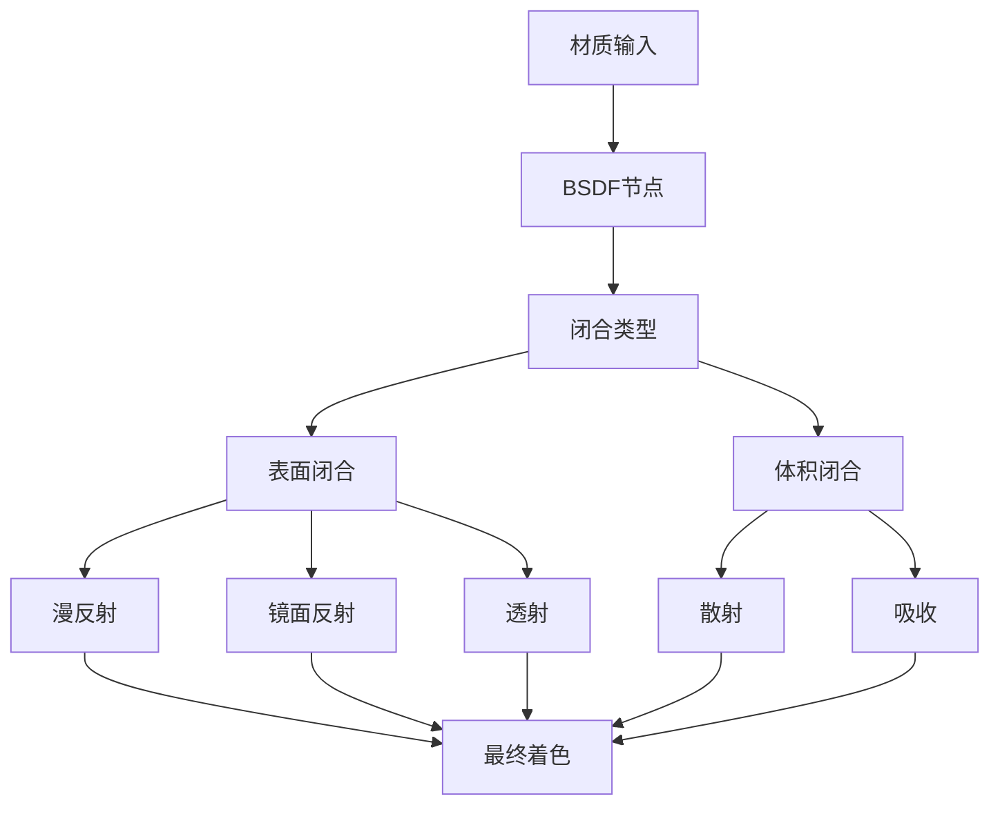
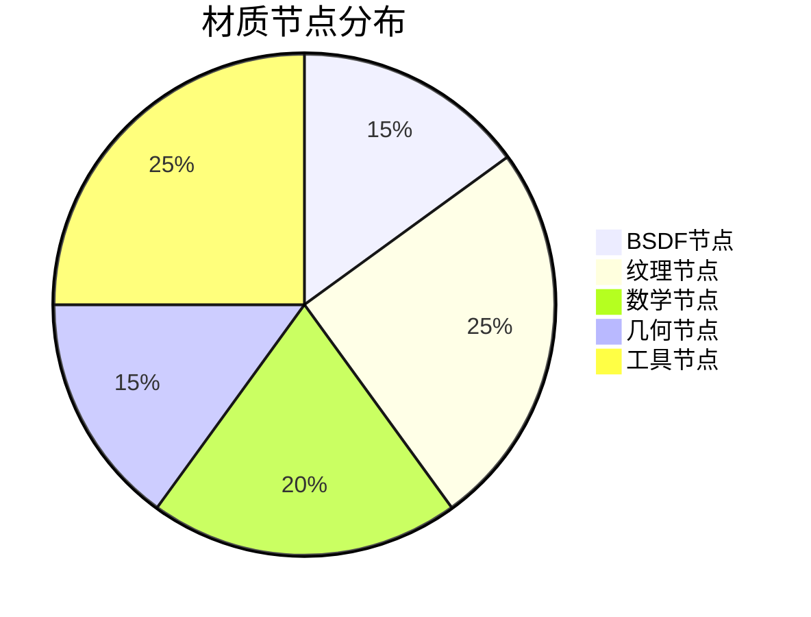
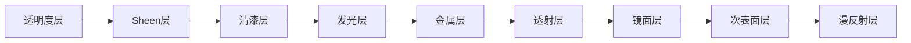

# 09-GPU Material目录详解

## 目录
- [1. GPU材质系统概述](#1-gpu材质系统概述)
- [2. 材质着色器架构设计](#2-材质着色器架构设计)
  - [2.1. 闭合系统架构](#21-闭合系统架构)
  - [2.2. 材质节点分类](#22-材质节点分类)
- [3. 核心材质节点](#3-核心材质节点)
  - [3.1. 原理化着色器](#31-原理化着色器)
  - [3.2. 基础BSDF节点](#32-基础bsdf节点)
  - [3.3. 输出节点](#33-输出节点)
- [4. 纹理着色器](#4-纹理着色器)
  - [4.1. 图像纹理](#41-图像纹理)
  - [4.2. 程序化纹理](#42-程序化纹理)
- [5. 数学工具着色器](#5-数学工具着色器)
  - [5.1. 向量数学](#51-向量数学)
  - [5.2. 噪声函数](#52-噪声函数)
- [6. 几何和坐标着色器](#6-几何和坐标着色器)
  - [6.1. 坐标变换](#61-坐标变换)
  - [6.2. 几何信息](#62-几何信息)
- [7. 物理光学着色器](#7-物理光学着色器)
  - [7.1. 菲涅尔效应](#71-菲涅尔效应)
  - [7.2. 体积散射](#72-体积散射)
- [8. 实用工具着色器](#8-实用工具着色器)

## 1. GPU材质系统概述

Blender的GPU材质系统是一个基于<span style="background-color: #e1f5fe;">GLSL</span>的高级着色器框架，专门用于实时渲染材质节点。该系统将Cycles的材质节点系统转换为高效的GPU代码，实现了物理基础的渲染效果。

### 1.1. 系统特点

- **基于节点**: 每个材质节点对应一个GLSL函数
- **物理基础**: 实现了基于物理的渲染(PBR)模型
- **实时渲染**: 针对GPU优化，支持实时预览
- **模块化设计**: 各个节点独立，便于组合使用

### 1.2. 文件命名规则

材质着色器文件遵循统一的命名规范：
```
gpu_shader_material_[节点名称].glsl
```

例如：
- `gpu_shader_material_principled.glsl` - 原理化材质节点
- `gpu_shader_material_diffuse.glsl` - 漫反射节点
- `gpu_shader_material_glossy.glsl` - 镜面反射节点

## 2. 材质着色器架构设计

### 2.1. 闭合系统架构

Blender GPU材质系统采用<span style="color: #d32f2f; font-weight: bold;">闭合系统(Closure System)</span>架构，这是一种现代的着色器设计模式。



闭合系统将材质输出定义为不同类型的"闭合"，每个闭合包含特定的光照计算：
- <span style="background-color: #fff3e0;">`ClosureDiffuse`</span> - 漫反射闭合
- <span style="background-color: #e8f5e8;">`ClosureReflection`</span> - 镜面反射闭合  
- <span style="background-color: #fce4ec;">`ClosureRefraction`</span> - 折射闭合
- <span style="background-color: #f3e5f5;">`ClosureEmission`</span> - 发光闭合

### 2.2. 材质节点分类

根据功能，材质着色器可分为以下几大类：



## 3. 核心材质节点

### 3.1. 原理化着色器

**定义位置**: `gpu_shader_material_principled.glsl:32-268`

<span style="background-color: #ffeb3b; color: #000;">Principled BSDF</span>是Blender中最核心的材质节点，它整合了多种物理材质属性。

```glsl
void node_bsdf_principled(float4 base_color,
                          float metallic,
                          float roughness,
                          float ior,
                          float alpha,
                          float3 N,
                          float weight,
                          float diffuse_roughness,
                          float subsurface_weight,
                          float3 subsurface_radius,
                          // ... 更多参数
                          out Closure result)
```

#### 3.1.1. 分层渲染架构

原理化着色器采用多层渲染架构，按照物理正确顺序计算各个材质层：



每一层都会衰减下层的光线贡献，这通过能量守恒原则实现：

```glsl
/* 衰减下层权重 */
weight *= max((1.0f - metallic), 0.0f);
```

#### 3.1.2. 物理参数处理

```glsl
/* 参数范围限制 */
metallic = saturate(metallic);
roughness = saturate(roughness);
ior = max(ior, 1e-5f);
alpha = saturate(alpha);
```

- `saturate(x)` = `clamp(x, 0.0, 1.0)` - 将值限制在[0,1]范围内
- `ior` (Index of Refraction) - 折射率，最小值设为1e-5防止除零错误

#### 3.1.3. Sheen效应计算

Sheen是布料表面的特殊光学效应：

```glsl
float principled_sheen(float NV, float rough)
{
  /* 经验拟合公式（手动曲线拟合）sheen_weight反照率 */
  float den = 35.6694f * rough * rough - 24.4269f * rough * NV - 0.1405f * NV * NV +
              6.1211f * rough + 0.28105f * NV - 0.1405f;
  float num = 58.5299f * rough * rough - 85.0941f * rough * NV + 9.8955f * NV * NV +
              1.9250f * rough + 74.2268f * NV - 0.2246f;
  return saturate(den / num);
}
```

其中：
- `NV` = `dot(N, V)` - 法线与视向的余弦值
- `rough` - 表面粗糙度
- 这些系数通过实验数据拟合得到

### 3.2. 基础BSDF节点

#### 3.2.1. 漫反射节点

**定义位置**: `gpu_shader_material_diffuse.glsl:7-15`

```glsl
void node_bsdf_diffuse(float4 color, float roughness, float3 N, float weight, out Closure result)
{
  ClosureDiffuse diffuse_data;
  diffuse_data.weight = weight;
  diffuse_data.color = color.rgb;
  diffuse_data.N = safe_normalize(N);

  result = closure_eval(diffuse_data);
}
```

漫反射节点实现Lambertian反射模型：
- `safe_normalize(N)` - 安全归一化，防止零向量导致的问题
- `closure_eval()` - 闭合评估函数，将闭合数据传递给渲染器

#### 3.2.2. 镜面反射节点

**定义位置**: `gpu_shader_material_glossy.glsl:8-37`

```glsl
void node_bsdf_glossy(float4 color,
                      float roughness,
                      float anisotropy,
                      float rotation,
                      float3 N,
                      float3 T,
                      float weight,
                      const float do_multiscatter,
                      out Closure result)
```

镜面反射支持各向异性：

```glsl
float2 split_sum = brdf_lut(NV, roughness);

ClosureReflection reflection_data;
reflection_data.weight = weight;
reflection_data.color = (do_multiscatter != 0.0f) ?
                            F_brdf_multi_scatter(color.rgb, color.rgb, split_sum) :
                            F_brdf_single_scatter(color.rgb, color.rgb, split_sum);
```

- `brdf_lut()` - 查找预计算的BRDF LUT (Look-Up Table)
- `do_multiscatter` - 是否启用多次散射
- `split_sum` - 分离求和优化方法

### 3.3. 输出节点

**定义位置**: `gpu_shader_material_output_material.glsl:7-34`

输出节点是材质树的最终节点，负责将各种闭合传递给渲染器：

```glsl
void node_output_material_surface(Closure surface, out Closure out_surface)
{
  out_surface = surface;
}

void node_output_material_volume(Closure volume, out Closure out_volume)
{
  out_volume = volume;
}

void node_output_material_displacement(float3 displacement, out float3 out_displacement)
{
  out_displacement = displacement;
}
```

厚度计算考虑对象缩放：

```glsl
void node_output_material_thickness(float thickness, out float out_thickness)
{
  float3 ob_scale;
  ob_scale.x = length(drw_modelmat()[0].xyz);
  ob_scale.y = length(drw_modelmat()[1].xyz);
  ob_scale.z = length(drw_modelmat()[2].xyz);

  float3 thickness_vec = abs(max(thickness, 0.0f) * ob_scale);
  /* 选择最小轴作为厚度输出 */
  out_thickness = min(min(thickness_vec.x, thickness_vec.y), thickness_vec.z);
}
```

## 4. 纹理着色器

### 4.1. 图像纹理

**定义位置**: `gpu_shader_material_tex_image.glsl:54-246`

图像纹理节点支持多种采样方式和投影方式：

#### 4.1.1. 采样方式

```glsl
/* 线性采样 */
void node_tex_image_linear(float3 co, sampler2D ima, out float4 color, out float alpha)
{
#ifdef GPU_FRAGMENT_SHADER
  float2 dx = gpu_dfdx(co.xy) * texture_lod_bias_get();
  float2 dy = gpu_dfdy(co.xy) * texture_lod_bias_get();

  color = textureGrad(ima, co.xy, dx, dy);
#else
  color = texture(ima, co.xy);
#endif

  alpha = color.a;
}
```

- `textureGrad()` - 使用显式梯度进行纹理采样，避免mipmap失真
- `gpu_dfdx/dy` - 计算屏幕空间导数

#### 4.1.2. 立方体投影

**定义位置**: `gpu_shader_material_tex_image.glsl:74-170`

立方体纹理投影允许在3D对象表面贴图：

```glsl
void tex_box_blend(float3 N,
                   float4 color1,
                   float4 color2,
                   float4 color3,
                   float blend,
                   out float4 color,
                   out float alpha)
{
  /* 从方向向量投影到重心坐标 */
  N = abs(N);
  N /= dot(N, float3(1.0f));

  float limit = 0.5f + 0.5f * blend;
  
  /* 计算混合权重 */
  float3 weight;
  weight = N.xyz / (N.xyx + N.yzz);
  weight = clamp((weight - 0.5f * (1.0f - blend)) / max(1e-8f, blend), 0.0f, 1.0f);

  /* 基于重心坐标的混合 */
  color = weight.x * color1 + weight.y * color2 + weight.z * color3;
  alpha = color.a;
}
```

#### 4.1.3. 平铺纹理

**定义位置**: `gpu_shader_material_tex_image.glsl:178-246`

```glsl
bool node_tex_tile_lookup(inout float3 co, sampler2DArray ima, sampler1DArray map)
{
  float2 tile_pos = floor(co.xy);

  if (tile_pos.x < 0 || tile_pos.y < 0 || tile_pos.x >= 10) {
    return false;
  }
  float tile = 10 * tile_pos.y + tile_pos.x;
  if (tile >= textureSize(map, 0).x) {
    return false;
  }
  /* 获取平铺信息 */
  float tile_layer = texelFetch(map, int2(tile, 0), 0).x;
  if (tile_layer < 0) {
    return false;
  }
  float4 tile_info = texelFetch(map, int2(tile, 1), 0);

  co = float3(((co.xy - tile_pos) * tile_info.zw) + tile_info.xy, tile_layer);
  return true;
}
```

### 4.2. 程序化纹理

#### 4.2.1. Perlin噪声

**定义位置**: `gpu_shader_material_noise.glsl:134-330`

Perlin噪声是实现自然纹理的基础算法：

```glsl
float noise_perlin(float3 vec)
{
  int X, Y, Z;
  float fx, fy, fz;

  FLOORFRAC(vec.x, X, fx);
  FLOORFRAC(vec.y, Y, fy);
  FLOORFRAC(vec.z, Z, fz);

  float u = fade(fx);
  float v = fade(fy);
  float w = fade(fz);

  float r = tri_mix(noise_grad(hash_int3(X, Y, Z), fx, fy, fz),
                    noise_grad(hash_int3(X + 1, Y, Z), fx - 1, fy, fz),
                    noise_grad(hash_int3(X, Y + 1, Z), fx, fy - 1, fz),
                    noise_grad(hash_int3(X + 1, Y + 1, Z), fx - 1, fy - 1, fz),
                    noise_grad(hash_int3(X, Y, Z + 1), fx, fy, fz - 1),
                    noise_grad(hash_int3(X + 1, Y, Z + 1), fx - 1, fy, fz - 1),
                    noise_grad(hash_int3(X, Y + 1, Z + 1), fx, fy - 1, fz - 1),
                    noise_grad(hash_int3(X + 1, Y + 1, Z + 1), fx - 1, fy - 1, fz - 1),
                    u, v, w);

  return r;
}
```

核心函数说明：
- `FLOORFRAC(x, x_int, x_fract)` - 同时获取整数和小数部分
- `fade(t)` - 平滑插值函数：$t^3(t(t \cdot 6 - 15) + 10)$
- `tri_mix()` - 三线性插值
- `noise_grad()` - 噪声梯度计算

#### 4.2.2. Voronoi纹理

**定义位置**: `gpu_shader_material_voronoi.glsl:34-100`

Voronoi图案基于距离场计算：

```glsl
struct VoronoiParams {
  float scale;
  float detail;
  float roughness;
  float lacunarity;
  float smoothness;
  float exponent;
  float randomness;
  float max_distance;
  bool normalize;
  int feature;
  int metric;
};
```

支持多种距离度量：

```glsl
float voronoi_distance(float2 a, float2 b, VoronoiParams params)
{
  if (params.metric == SHD_VORONOI_EUCLIDEAN) {
    return distance(a, b);
  }
  else if (params.metric == SHD_VORONOI_MANHATTAN) {
    return abs(a.x - b.x) + abs(a.y - b.y);
  }
  else if (params.metric == SHD_VORONOI_CHEBYCHEV) {
    return max(abs(a.x - b.x), abs(a.y - b.y));
  }
  else if (params.metric == SHD_VORONOI_MINKOWSKI) {
    return pow(pow(abs(a.x - b.x), params.exponent) + pow(abs(a.y - b.y), params.exponent),
               1.0f / params.exponent);
  }
  else {
    return 0.0f;
  }
}
```

距离类型：
- <span style="background-color: #e3f2fd;">欧几里得距离</span>: $\sqrt{(x_2-x_1)^2 + (y_2-y_1)^2}$
- <span style="background-color: #fff3e0;">曼哈顿距离</span>: $|x_2-x_1| + |y_2-y_1|$
- <span style="background-color: #f3e5f5;">切比雪夫距离</span>: $\max(|x_2-x_1|, |y_2-y_1|)$
- <span style="background-color: #e8f5e8;">闵可夫斯基距离</span>: $\left(\sum |x_i-y_i|^p\right)^{1/p}$

## 5. 数学工具着色器

### 5.1. 向量数学

**定义位置**: `gpu_shader_material_vector_math.glsl:14-193`

向量数学节点提供全面的向量运算：

#### 5.1.1. 基础运算

```glsl
void vector_math_add(
    float3 a, float3 b, float3 c, float scale, out float3 outVector, out float outValue)
{
  outVector = a + b;
}

void vector_math_cross(
    float3 a, float3 b, float3 c, float scale, out float3 outVector, out float outValue)
{
  outVector = cross(a, b);
}

void vector_math_dot(
    float3 a, float3 b, float3 c, float scale, out float3 outVector, out float outValue)
{
  outValue = dot(a, b);
}
```

#### 5.1.2. 高级运算

```glsl
void vector_math_refract(
    float3 a, float3 b, float3 c, float scale, out float3 outVector, out float outValue)
{
  outVector = refract(a, vector_math_safe_normalize(b), scale);
}

void vector_math_multiply_add(
    float3 a, float3 b, float3 c, float scale, out float3 outVector, out float outValue)
{
  outVector = a * b + c;
}
```

安全归一化函数：

```glsl
float3 vector_math_safe_normalize(float3 a)
{
  float length_sqr = dot(a, a);
  return (length_sqr > 1e-35f) ? a * inversesqrt(length_sqr) : float3(0.0f);
}
```

### 5.2. 噪声函数

#### 5.2.1. 噪声缩放

**定义位置**: `gpu_shader_material_noise.glsl:241-259`

为了保持噪声输出的稳定范围，需要进行缩放：

```glsl
float noise_scale1(float result)
{
  return 0.2500f * result;
}

float noise_scale2(float result)
{
  return 0.6616f * result;
}

float noise_scale3(float result)
{
  return 0.9820f * result;
}

float noise_scale4(float result)
{
  return 0.8344f * result;
}
```

这些缩放因子通过实验确定，确保不同维度的噪声输出在[-1, 1]范围内。

#### 5.2.2. 安全噪声函数

**定义位置**: `gpu_shader_material_noise.glsl:263-330`

```glsl
float snoise(float p)
{
  float precision_correction = 0.5f * float(abs(p) >= 1000000.0f);
  /* 每100000.0重复一次，防止浮点精度问题 */
  p = compatible_mod(p, 100000.0f) + precision_correction;

  return noise_scale1(noise_perlin(p));
}

float noise(float p)
{
  return 0.5f * snoise(p) + 0.5f;
}
```

- `snoise()` - 有符号噪声，范围[-1, 1]
- `noise()` - 无符号噪声，范围[0, 1]

## 6. 几何和坐标着色器

### 6.1. 坐标变换

**定义位置**: `gpu_shader_material_transform_utils.glsl:7-80`

坐标变换是材质系统的基础，提供各种空间转换：

#### 6.1.1. 法线变换

```glsl
void normal_transform_object_to_world(float3 vin, out float3 vout)
{
  /* 法线矩阵展开 */
  vout = vin * to_float3x3(drw_modelinv());
}

void normal_transform_world_to_object(float3 vin, out float3 vout)
{
  /* 逆法线矩阵展开 */
  vout = vin * to_float3x3(drw_modelmat());
}
```

#### 6.1.2. 方向变换

```glsl
void direction_transform_object_to_world(float3 vin, out float3 vout)
{
  vout = to_float3x3(drw_modelmat()) * vin;
}

void direction_transform_object_to_view(float3 vin, out float3 vout)
{
  vout = to_float3x3(drw_modelmat()) * vin;
  vout = to_float3x3(drw_view().viewmat) * vout;
}
```

#### 6.1.3. 点变换

```glsl
void point_transform_object_to_world(float3 vin, out float3 vout)
{
  vout = (drw_modelmat() * float4(vin, 1.0f)).xyz;
}

void point_transform_object_to_view(float3 vin, out float3 vout)
{
  vout = (drw_view().viewmat * (drw_modelmat() * float4(vin, 1.0f))).xyz;
}
```

变换类型区别：
- <span style="color: #2196f3;">法线变换</span> - 使用逆转置矩阵，保持法线垂直性
- <span style="color: #4caf50;">方向变换</span> - 只旋转，不平移
- <span style="color: #ff9800;">点变换</span> - 完整的模型-视图变换

### 6.2. 几何信息

#### 6.2.1. 几何节点

几何节点提供顶点、多边形等几何信息：

```glsl
void node_geometry(out float3 position, 
                  out float3 normal, 
                  out float3 tangent, 
                  out float3 true_normal, 
                  out float3 incoming, 
                  out float parametric, 
                  out float backfacing, 
                  out float pointiness, 
                  out float3 object_location, 
                  out float3 object_index, 
                  out float material_index, 
                  out float random)
```

这些参数通过GPU数据结构`g_data`获取，包含顶点位置、法线、切线等信息。

#### 6.2.2. 纹理坐标

纹理坐标节点提供多种UV映射方式：

```glsl
void node_texture_coordinates(out float3 generated, 
                              out float3 normal, 
                              out float3 uv, 
                              out float3 object, 
                              out float3 camera, 
                              out float3 window, 
                              out float3 reflection)
```

坐标类型说明：
- `generated` - 程序生成的坐标
- `uv` - UV纹理坐标
- `object` - 对象空间坐标
- `camera` - 相机空间坐标
- `window` - 屏幕空间坐标
- `reflection` - 反射向量

## 7. 物理光学着色器

### 7.1. 菲涅尔效应

**定义位置**: `gpu_shader_material_fresnel.glsl:5-41`

菲涅尔效应描述了光线在不同角度下的反射率变化：

#### 7.1.1. 菲涅尔公式

```glsl
float fresnel_dielectric_cos(float cosi, float eta)
{
  /* 不显式计算折射方向的菲涅尔反射率 */
  float c = abs(cosi);
  float g = eta * eta - 1.0f + c * c;
  float result;

  if (g > 0.0f) {
    g = sqrt(g);
    float A = (g - c) / (g + c);
    float B = (c * (g + c) - 1.0f) / (c * (g - c) + 1.0f);
    result = 0.5f * A * A * (1.0f + B * B);
  }
  else {
    result = 1.0f; /* 全内反射 */
  }

  return result;
}
```

这是Schlick近似公式的精确实现，避免计算折射方向。

#### 7.1.2. 菲涅尔节点

```glsl
void node_fresnel(float ior, float3 N, out float result)
{
  N = normalize(N);
  float3 V = coordinate_incoming(g_data.P);

  float eta = max(ior, 0.00001f);
  result = fresnel_dielectric(V, N, (FrontFacing) ? eta : 1.0f / eta);
}
```

- `ior` - 折射率 (Index of Refraction)
- `FrontFacing` - 判断是否为正面，决定使用正向还是反向折射率

### 7.2. 体积散射

#### 7.2.1. 次表面散射

**定义位置**: `gpu_shader_material_subsurface_scattering.glsl`

次表面散射模拟光线在材质内部的传播：

```glsl
void node_subsurface_scattering(float4 color, 
                                float scale, 
                                float radius, 
                                float sharpness, 
                                float3 N, 
                                float strength, 
                                out Closure result)
{
  ClosureSubsurface sss_data;
  sss_data.N = safe_normalize(N);
  sss_data.sss_radius = max(radius * scale, float3(0.0f));
  sss_data.color = strength * color.rgb;
  sss_data.weight = strength;
  
  result = closure_eval(sss_data);
}
```

#### 7.2.2. 体积材质

**定义位置**: `gpu_shader_material_volume_principled.glsl:1-...`

体积材质模拟参与介质：

```glsl
void node_volume_principled(float4 color, 
                           float density, 
                           float anisotropy, 
                           float absorption_color, 
                           float emission_strength, 
                           out Closure result)
{
  /* 体积散射 */
  if (density > 1e-5f) {
    ClosureVolumeScatter scatter_data;
    scatter_data.scattering = color.rgb * density;
    scatter_data.anisotropy = anisotropy;
    scatter_data.weight = 1.0f;
    closure_eval(scatter_data);
  }
  
  /* 体积吸收 */
  if (density > 1e-5f && absorption_color > 1e-5f) {
    ClosureVolumeAbsorption absorb_data;
    absorb_data.absorption = absorption_color * density;
    absorb_data.weight = 1.0f;
    closure_eval(absorb_data);
  }
}
```

## 8. 实用工具着色器

### 8.1. 凹凸贴图

**定义位置**: `gpu_shader_material_bump.glsl:18-51`

凹凸贴图通过高度贴图模拟表面细节：

```glsl
void node_bump(float strength,
               float dist,
               float filter_width,
               float height,
               float3 N,
               float2 height_xy,
               float invert,
               out float3 result)
{
  N = normalize(N);
  dist *= FrontFacing ? invert : -invert;

#ifdef GPU_FRAGMENT_SHADER
  float3 dPdx = gpu_dfdx(g_data.P) * derivative_scale_get();
  float3 dPdy = gpu_dfdy(g_data.P) * derivative_scale_get();

  /* 从法线获取表面切线 */
  float3 Rx = cross(dPdy, N);
  float3 Ry = cross(N, dPdx);

  /* 计算表面梯度和行列式 */
  float det = dot(dPdx, Rx);

  float2 dHd = height_xy - float2(height);
  float3 surfgrad = dHd.x * Rx + dHd.y * Ry;

  strength = max(strength, 0.0f);

  result = normalize(filter_width * abs(det) * N - dist * sign(det) * surfgrad);
  result = normalize(mix(N, result, strength));
#else
  result = N;
#endif
}
```

### 8.2. 法线贴图

**定义位置**: `gpu_shader_material_normal_map.glsl`

法线贴图提供更精确的表面细节：

```glsl
void node_normal_map(float4 color, 
                    float strength, 
                    bool tangent_space, 
                    float3 N, 
                    float3 T, 
                    out float3 result)
{
  float3 normal_in = normalize(color.xyz * 2.0f - 1.0f);
  
  if (tangent_space) {
    /* 切线空间转换 */
    float3 B = cross(T, N);
    result = normalize(normal_in.x * T + normal_in.y * B + normal_in.z * N);
  }
  else {
    /* 对象空间 */
    result = normal_transform_object_to_world(normal_in);
  }
  
  result = normalize(mix(N, result, strength));
}
```

### 8.3. 混合节点

**定义位置**: `gpu_shader_material_mix_color.glsl`

混合节点实现多种颜色混合模式：

```glsl
void node_mix_color(float fac, float4 color1, float4 color2, int blend_type, out float4 result)
{
  fac = saturate(fac);
  
  switch(blend_type) {
    case MA_BLEND_MIX:
      result = mix(color1, color2, fac);
      break;
    case MA_BLEND_ADD:
      result = color1 + color2 * fac;
      break;
    case MA_BLEND_MULTIPLY:
      result = color1 * mix(float4(1.0f), color2, fac);
      break;
    case MA_BLEND_SCREEN:
      result = color1 + (float4(1.0f) - color1) * color2 * fac;
      break;
    case MA_BLEND_OVERLAY:
      result = mix(color1, 
                   color1 * color2 * 2.0f, 
                   step(0.5f, color1) * fac);
      break;
    // ... 更多混合模式
  }
}
```

混合模式包括：
- <span style="background-color: #e1f5fe;">MIX</span> - 线性混合
- <span style="background-color: #fff3e0;">ADD</span> - 叠加
- <span style="background-color: #e8f5e8;">MULTIPLY</span> - 正片叠底
- <span style="background-color: #fce4ec;">SCREEN</span> - 滤色
- <span style="background-color: #f3e5f5;">OVERLAY</span> - 叠加

### 8.4. 映射范围

**定义位置**: `gpu_shader_material_map_range.glsl`

映射范围节点实现值域的灵活转换：

```glsl
void node_map_range(float value,
                    float from_min, float from_max,
                    float to_min, float to_max,
                    float steps,
                    bool use_steps,
                    out float result)
{
  float factor = saturate((value - from_min) / (from_max - from_min));
  
  if (use_steps) {
    /* 阶梯化映射 */
    factor = floor(factor * steps + 0.5f) / steps;
  }
  
  result = mix(to_min, to_max, factor);
}
```

## 总结

Blender的GPU材质着色器系统是一个完整而强大的实时渲染解决方案，具有以下特点：

1. **模块化设计** - 每个材质节点独立实现，便于维护和扩展
2. **物理基础** - 遵循物理光学原理，实现逼真的渲染效果  
3. **性能优化** - 针对GPU架构优化，支持实时渲染
4. **功能全面** - 涵盖从基础材质到高级特效的各种需求

通过这些着色器的组合使用，用户可以创建出各种复杂的材质效果，从简单的塑料到复杂的皮肤和布料材质。整个系统的设计既保证了渲染质量，又维持了良好的性能表现。