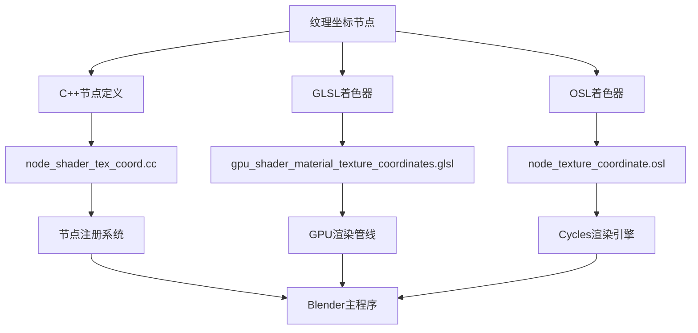
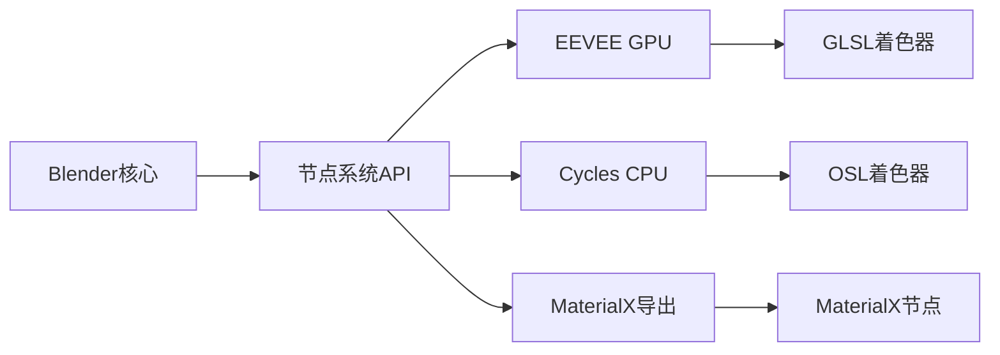
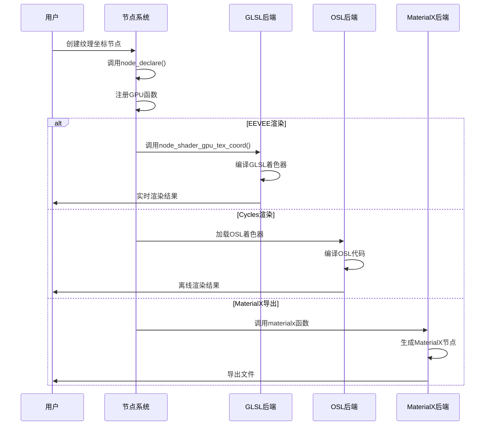
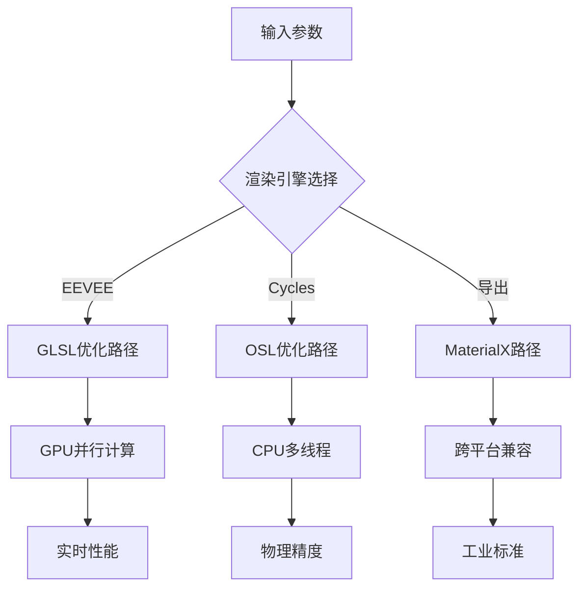
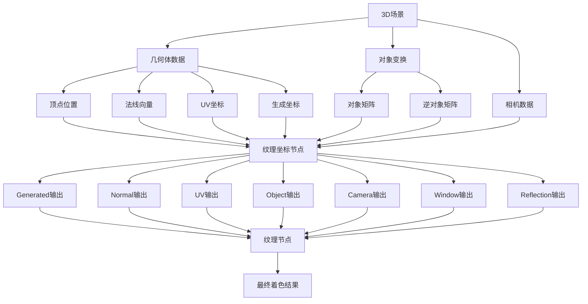
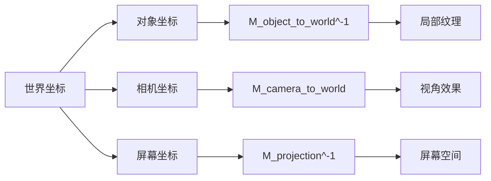
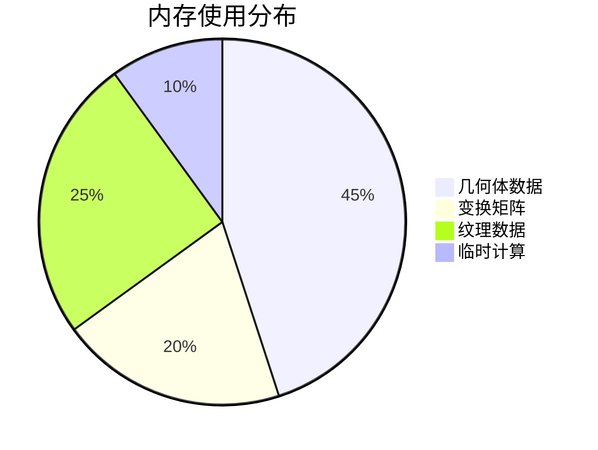

# 10. 纹理坐标节点详解

## 目录

- [10.1 概述](#101-概述)
- [10.2 核心功能分析](#102-核心功能分析)
- [10.3 文件架构解析](#103-文件架构解析)
- [10.4 C++实现详解](#104-c实现详解)
- [10.5 GLSL着色器实现](#105-glsl着色器实现)
- [10.6 OSL着色器实现](#106-osl着色器实现)
- [10.7 坐标类型详解](#107-坐标类型详解)
- [10.8 三系统协同机制](#108-三系统协同机制)
- [10.9 数据流程图](#109-数据流程图)
- [10.10 性能优化策略](#1010-性能优化策略)
- [10.11 实际应用案例](#1011-实际应用案例)

## 10.1 概述

<span style="background-color:#e1f5fe;">纹理坐标节点</span>是Blender着色器系统中的核心输入节点，提供多种类型的坐标系统用于纹理映射。该节点是连接3D空间与纹理空间的桥梁，允许用户在不同坐标参考系之间进行转换和应用纹理。

### 10.1.1 节点基本信息

- **节点类型**: `SH_NODE_TEX_COORD`
- **节点名称**: Texture Coordinate
- **功能类别**: `NODE_CLASS_INPUT`
- **主要用途**: 为纹理节点提供多种坐标输入

### 10.1.2 坐标系统类型

纹理坐标节点提供<span style="color:#d32f2f;">七种</span>不同的坐标输出：

1. **Generated** - 生成坐标
2. **Normal** - 法线坐标
3. **UV** - UV纹理坐标
4. **Object** - 对象坐标
5. **Camera** - 相机坐标
6. **Window** - 窗口坐标
7. **Reflection** - 反射坐标

## 10.2 核心功能分析

### 10.2.1 节点架构设计



### 10.2.2 输出接口定义

在`node_shader_tex_coord.cc:14-23`中定义了节点的输出接口：

```cpp
static void node_declare(NodeDeclarationBuilder &b)
{
  b.add_output<decl::Vector>("Generated").translation_context(BLT_I18NCONTEXT_ID_TEXTURE);
  b.add_output<decl::Vector>("Normal");
  b.add_output<decl::Vector>("UV");
  b.add_output<decl::Vector>("Object");
  b.add_output<decl::Vector>("Camera");
  b.add_output<decl::Vector>("Window");
  b.add_output<decl::Vector>("Reflection");
}
```

每个输出都是<span style="background-color:#fff3e0;">三维向量类型</span>，用于表示三维空间中的坐标或方向。

## 10.3 文件架构解析

### 10.3.1 三个核心文件的作用

Blender将纹理坐标节点的实现分散在三个文件中，每个文件负责不同的渲染后端：

| 文件 | 负责系统 | 主要作用 | 实现语言 |
|------|----------|----------|----------|
| `node_shader_tex_coord.cc` | 主节点系统 | 节点定义、注册、GPU接口 | C++ |
| `gpu_shader_material_texture_coordinates.glsl` | EEVEE渲染器 | 实时渲染着色器实现 | GLSL |
| `node_texture_coordinate.osl` | Cycles渲染器 | 离线渲染着色器实现 | OSL |

### 10.3.2 为什么分成三个文件？

<span style="color:#1976d2;">架构分离原则</span>：

1. **渲染后端分离**: 不同渲染引擎有不同的着色器语言
2. **维护性**: 独立的实现便于各自优化和维护
3. **性能考虑**: 每个系统可以针对特定硬件优化
4. **功能差异**: 不同渲染器支持的特性有所不同



## 10.4 C++实现详解

### 10.4.1 节点注册机制

在`node_shader_tex_coord.cc:103-122`中实现了节点的注册：

```cpp
void register_node_type_sh_tex_coord()
{
  namespace file_ns = blender::nodes::node_shader_tex_coord_cc;

  static blender::bke::bNodeType ntype;

  sh_node_type_base(&ntype, "ShaderNodeTexCoord", SH_NODE_TEX_COORD);
  ntype.ui_name = "Texture Coordinate";
  ntype.ui_description =
      "Retrieve multiple types of texture coordinates.\nTypically used as inputs for texture "
      "nodes";
  ntype.enum_name_legacy = "TEX_COORD";
  ntype.nclass = NODE_CLASS_INPUT;
  ntype.declare = file_ns::node_declare;
  ntype.draw_buttons = file_ns::node_shader_buts_tex_coord;
  ntype.gpu_fn = file_ns::node_shader_gpu_tex_coord;
  ntype.materialx_fn = file_ns::node_shader_materialx;

  blender::bke::node_register_type(ntype);
}
```

### 10.4.2 GPU着色器接口实现

在`node_shader_tex_coord.cc:31-72`中实现了与GPU着色器的连接：

```cpp
static int node_shader_gpu_tex_coord(GPUMaterial *mat,
                                     bNode *node,
                                     bNodeExecData * /*execdata*/,
                                     GPUNodeStack *in,
                                     GPUNodeStack *out)
{
  Object *ob = (Object *)node->id;

  /* 使用特殊矩阵让着色器分支到使用渲染对象的矩阵 */
  float dummy_matrix[4][4];
  dummy_matrix[3][3] = 0.0f;
  GPUNodeLink *inv_obmat = (ob != nullptr) ? GPU_uniform(&ob->world_to_object()[0][0]) :
                                             GPU_uniform(&dummy_matrix[0][0]);

  /* 优化：如果不需要则不请求orco */
  float4 zero(0.0f);
  GPUNodeLink *orco = out[0].hasoutput ? GPU_attribute(mat, CD_ORCO, "") : GPU_constant(zero);
  GPUNodeLink *mtface = GPU_attribute(mat, CD_AUTO_FROM_NAME, "");

  GPU_stack_link(mat, node, "node_tex_coord", in, out, inv_obmat, orco, mtface);

  int i;
  LISTBASE_FOREACH_INDEX (bNodeSocket *, sock, &node->outputs, i) {
    node_shader_gpu_bump_tex_coord(mat, node, &out[i].link);
    /* 在dFdx/dFdy偏移后归一化某些向量。
     * 这是插值的非线性函数的情况。
     * 结果向量可能仍然有点错误，但不会那么多。
     * (参见 #70644) */
    if (ELEM(i, 1, 6)) {  // Normal和Reflection输出
      GPU_link(mat,
               "vector_math_normalize",
               out[i].link,
               out[i].link,
               out[i].link,
               out[i].link,
               &out[i].link,
               nullptr);
    }
  }

  return 1;
}
```

### 10.4.3 关键技术点

1. **对象矩阵处理**: 使用`world_to_object()`矩阵进行坐标变换
2. **性能优化**: 只有在需要时才请求ORCO数据
3. **凹凸贴图支持**: 为凹凸贴图调整坐标计算
4. **向量归一化**: 对法线和反射向量进行归一化处理

### 10.4.4 MaterialX支持

在`node_shader_tex_coord.cc:74-98`中提供了MaterialX导出支持：

```cpp
NODE_SHADER_MATERIALX_BEGIN
#ifdef WITH_MATERIALX
{
  /* 注意：某些输出不被MaterialX支持 */
  NodeItem res = empty();
  std::string name = socket_out_->identifier;

  if (ELEM(name, "Generated", "UV")) {
    res = texcoord_node();
  }
  else if (name == "Normal") {
    res = create_node("normal", NodeItem::Type::Vector3, {{"space", val(std::string("world"))}});
  }
  else if (name == "Object") {
    res = create_node(
        "position", NodeItem::Type::Vector3, {{"space", val(std::string("object"))}});
  }
  else {
    res = get_output_default(name, NodeItem::Type::Any);
  }

  return res;
}
#endif
NODE_SHADER_MATERIALX_END
```

## 10.5 GLSL着色器实现

### 10.5.1 核心着色器函数

在`gpu_shader_material_texture_coordinates.glsl:12-36`中定义了主要的坐标计算函数：

```glsl
void node_tex_coord(float4x4 obmatinv,
                    float3 attr_orco,
                    float4 attr_uv,
                    out float3 generated,
                    out float3 normal,
                    out float3 uv,
                    out float3 object,
                    out float3 camera,
                    out float3 window,
                    out float3 reflection)
{
  generated = attr_orco;
  normal_transform_world_to_object(g_data.N, normal);
  uv = attr_uv.xyz;
  bool valid_mat = (obmatinv[3][3] != 0.0f);
  if (valid_mat) {
    object = (obmatinv * float4(g_data.P, 1.0f)).xyz;
  }
  else {
    point_transform_world_to_object(g_data.P, object);
  }
  camera = coordinate_camera(g_data.P);
  window = coordinate_screen(g_data.P);
  reflection = coordinate_reflect(g_data.P, g_data.N);
}
```

### 10.5.2 位置坐标函数

在`gpu_shader_material_texture_coordinates.glsl:7-10`中：

```glsl
void node_tex_coord_position(out float3 out_pos)
{
  out_pos = g_data.P;
}
```

### 10.5.3 变换工具函数

GLSL实现依赖于`gpu_shader_material_transform_utils.glsl`中的变换函数：

```glsl
// 法线变换：世界空间到对象空间
void normal_transform_world_to_object(float3 vin, out float3 vout)
{
  /* NormalMatrix的扩展 */
  vout = vin * to_float3x3(drw_modelmat());
}

// 点变换：世界空间到对象空间  
void point_transform_world_to_object(float3 vin, out float3 vout)
{
  vout = (drw_modelinv() * float4(vin, 1.0f)).xyz;
}
```

### 10.5.4 GLSL实现特点

1. **实时渲染优化**: 专为GPU实时渲染设计
2. **矩阵变换**: 使用高效的矩阵运算
3. **属性访问**: 直接访问网格属性数据
4. **内置变量**: 使用`g_data.P`和`g_data.N`等内置变量

## 10.6 OSL着色器实现

### 10.6.1 OSL节点接口

在`node_texture_coordinate.osl:7-22`中定义了OSL着色器的接口：

```osl
shader node_texture_coordinate(
    int is_background = 0,
    int is_volume = 0,
    int from_dupli = 0,
    int use_transform = 0,
    string bump_offset = "center",
    float bump_filter_width = BUMP_FILTER_WIDTH,
    matrix object_itfm = matrix(0, 0, 0, 0, 0, 0, 0, 0, 0, 0, 0, 0, 0, 0, 0, 0),

    output point Generated = point(0.0, 0.0, 0.0),
    output point UV = point(0.0, 0.0, 0.0),
    output point Object = point(0.0, 0.0, 0.0),
    output point Camera = point(0.0, 0.0, 0.0),
    output point Window = point(0.0, 0.0, 0.0),
    output normal Normal = normal(0.0, 0.0, 0.0),
    output point Reflection = point(0.0, 0.0, 0.0))
```

### 10.6.2 背景着色器处理

在`node_texture_coordinate.osl:24-38`中：

```osl
if (is_background) {
  Generated = P;
  UV = point(0.0, 0.0, 0.0);
  if (use_transform) {
    Object = transform(object_itfm, P);
  }
  else {
    Object = P;
  }
  point Pcam = transform("camera", "world", point(0, 0, 0));
  Camera = transform("camera", P + Pcam);
  getattribute("NDC", Window);
  Normal = N;
  Reflection = I;
}
```

### 10.6.3 对象着色器处理

在`node_texture_coordinate.osl:39-74`中处理非背景情况：

```osl
else {
  if (from_dupli) {
    getattribute("geom:dupli_generated", Generated);
    getattribute("geom:dupli_uv", UV);
  }
  else if (is_volume) {
    Generated = transform("object", P);

    matrix tfm;
    if (getattribute("geom:generated_transform", tfm))
      Generated = transform(tfm, Generated);

    getattribute("geom:uv", UV);
  }
  else {
    if (!getattribute("geom:generated", Generated)) {
      Generated = transform("object", P);
    }
    float is_light;
    getattribute("object:is_light", is_light);
    if (!getattribute("geom:uv", UV) && is_light) {
      UV = point(1.0 - u - v, u, 0.0);
    }
  }

  if (use_transform) {
    Object = transform(object_itfm, P);
  }
  else {
    Object = transform("object", P);
  }
  Camera = transform("camera", P);
  getattribute("NDC", Window);
  Normal = normalize(transform("world", "object", N));
  Reflection = -reflect(I, N);
}
```

### 10.6.4 凹凸贴图偏移处理

在`node_texture_coordinate.osl:76-102`中实现了凹凸贴图的偏移：

```osl
if (bump_offset == "dx") {
  if (!from_dupli) {
    Generated += Dx(Generated) * bump_filter_width;
    UV += Dx(UV) * bump_filter_width;
  }
  Object += Dx(Object) * bump_filter_width;
  Camera += Dx(Camera) * bump_filter_width;
  Window += Dx(Window) * bump_filter_width;
  if (getattribute("geom:bump_map_normal", Normal)) {
    Normal = normalize(Normal + Dx(Normal) * bump_filter_width);
  }
}
else if (bump_offset == "dy") {
  if (!from_dupli) {
    Generated += Dy(Generated) * bump_filter_width;
    UV += Dy(UV) * bump_filter_width;
  }
  Object += Dy(Object) * bump_filter_width;
  Camera += Dy(Camera) * bump_filter_width;
  Window += Dy(Window) * bump_filter_width;
  if (getattribute("geom:bump_map_normal", Normal)) {
    Normal = normalize(Normal + Dy(Normal) * bump_filter_width);
  }
}

Window[2] = 0.0;
```

### 10.6.5 OSL实现特点

1. **属性系统**: 使用`getattribute()`获取几何体属性
2. **变换函数**: 使用内置的`transform()`函数进行坐标变换
3. **微分运算**: 使用`Dx()`和`Dy()`进行凹凸贴图计算
4. **特殊情况处理**: 支持背景、体积、重复体等特殊情况

## 10.7 坐标类型详解

### 10.7.1 Generated（生成坐标）

<span style="background-color:#e8f5e8;">定义</span>: 基于对象原始生成的坐标系统

**计算方法**:
- GLSL: `generated = attr_orco;`
- OSL: `Generated = transform("object", P);` 或从属性获取

**用途**:
- 程序化纹理贴图
- 三维噪声纹理
- 对象空间的纹理映射

### 10.7.2 Normal（法线坐标）

<span style="background-color:#fff8e1;">定义</span>: 当前点的法线向量

**计算方法**:
- GLSL: `normal_transform_world_to_object(g_data.N, normal);`
- OSL: `Normal = normalize(transform("world", "object", N));`

**数学表达**:
$$\mathbf{n}_{object} = \mathbf{M}_{world \rightarrow object} \cdot \mathbf{n}_{world}$$

**用途**:
- 法线贴图混合
- 各向异性反射
- 边缘检测效果

### 10.7.3 UV（纹理坐标）

<span style="background-color:#fce4ec;">定义</span>: 标准的UV纹理坐标

**计算方法**:
- GLSL: `uv = attr_uv.xyz;`
- OSL: `getattribute("geom:uv", UV);`

**用途**:
- 传统纹理贴图
- 图像映射
- UV展开模型

### 10.7.4 Object（对象坐标）

<span style="background-color:#f3e5f5;">定义</span>: 相对于对象原点的坐标

**计算方法**:
- GLSL: `object = (obmatinv * float4(g_data.P, 1.0f)).xyz;`
- OSL: `Object = transform("object", P);`

**数学表达**:
$$\mathbf{P}_{object} = \mathbf{M}^{-1}_{object \rightarrow world} \cdot \mathbf{P}_{world}$$

**用途**:
- 对象空间程序化纹理
- 局部坐标效果
- 实例化材质

### 10.7.5 Camera（相机坐标）

<span style="background-color:#e0f2f1;">定义</span>: 相对于相机位置的坐标

**计算方法**:
- GLSL: `camera = coordinate_camera(g_data.P);`
- OSL: `Camera = transform("camera", P);`

**用途**:
- 相机空间效果
- 视角相关纹理
- 深度相关着色

### 10.7.6 Window（窗口坐标）

<span style="background-color:#fff3e0;">定义</span>: 屏幕空间的规范化设备坐标

**计算方法**:
- GLSL: `window = coordinate_screen(g_data.P);`
- OSL: `getattribute("NDC", Window);`

**坐标范围**: $(x, y, z) \in [-1, 1] \times [-1, 1] \times [0, 1]$

**用途**:
- 屏幕空间效果
- 后处理效果
- UI相关纹理

### 10.7.7 Reflection（反射坐标）

<span style="background-color:#e1f5fe;">定义</span>: 基于视角和法线的反射向量

**计算方法**:
- GLSL: `reflection = coordinate_reflect(g_data.P, g_data.N);`
- OSL: `Reflection = -reflect(I, N);`

**数学表达**:
$$\mathbf{R} = \mathbf{I} - 2(\mathbf{I} \cdot \mathbf{N})\mathbf{N}$$

**用途**:
- 环境映射
- 反射效果
- 镜面高光

## 10.8 三系统协同机制

### 10.8.1 统一接口设计



### 10.8.2 数据流一致性

虽然三个系统使用不同的着色器语言，但它们必须保证：

1. **输出一致性**: 相同输入应产生相同输出
2. **精度一致性**: 浮点数精度保持一致
3. **边界一致性**: 边界条件处理一致
4. **性能平衡**: 各系统性能特征可接受

### 10.8.3 跨系统优化策略



## 10.9 数据流程图

### 10.9.1 完整数据流程



### 10.9.2 坐标变换矩阵



## 10.10 性能优化策略

### 10.10.1 GPU端优化

1. **按需计算**: 只计算被连接的输出
   ```cpp
   GPUNodeLink *orco = out[0].hasoutput ? GPU_attribute(mat, CD_ORCO, "") : GPU_constant(zero);
   ```

2. **矩阵缓存**: 缓存变换矩阵避免重复计算
3. **向量化运算**: 使用SIMD指令加速向量运算
4. **早期剔除**: 在着色器早期进行条件判断

### 10.10.2 CPU端优化

1. **属性缓存**: 缓存几何体属性访问
2. **微分预计算**: 预计算凹凸贴图微分
3. **分支优化**: 减少动态分支
4. **内存局部性**: 优化数据访问模式

### 10.10.3 内存优化



## 10.11 实际应用案例

### 10.11.1 程序化木材纹理

使用Generated坐标创建木材纹理：

```
纹理坐标节点.Generated -> 分离XYZ节点
分离XYZ.Y -> 波浪纹理节点
波浪纹理 -> 颜色渐变节点 -> 最终材质
```

### 10.11.2 屏幕空间效果

使用Window坐标创建边缘发光：

```
纹理坐标节点.Window -> 向量数学运算(长度)
向量数学 -> 颜色渐变(反转) -> 自发光
```

### 10.11.3 反射环境映射

使用Reflection坐标进行环境反射：

```
纹理坐标节点.Reflection -> 环境纹理节点
环境纹理 -> 混合着色器 -> 最终材质
```

### 10.11.4 UV故障效果

组合UV和Generated坐标：

```
纹理坐标节点.UV -> 向量数学(加法)
纹理坐标节点.Generated -> 向量数学
向量数学 -> 图像纹理 -> 最终材质
```

---

## 总结

纹理坐标节点是Blender着色器系统的<span style="color:#ff6b35;">核心组件</span>，通过三个不同的实现文件支持多种渲染后端。其设计体现了现代3D软件架构的<span style="background-color:#f1f8e9;">模块化原则</span>和<span style="background-color:#e8f4fd;">跨平台兼容性</span>。

理解纹理坐标节点的工作原理有助于：
1. 高效使用各种纹理坐标类型
2. 创建复杂的程序化材质
3. 优化渲染性能
4. 开发自定义着色器节点

该节点的实现展示了Blender在<span style="color:#4caf50;">软件架构设计</span>上的深思熟虑，为用户提供了强大而灵活的纹理映射工具。