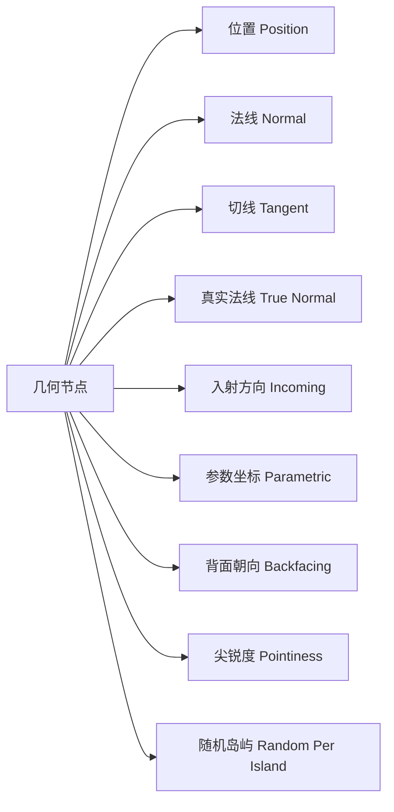
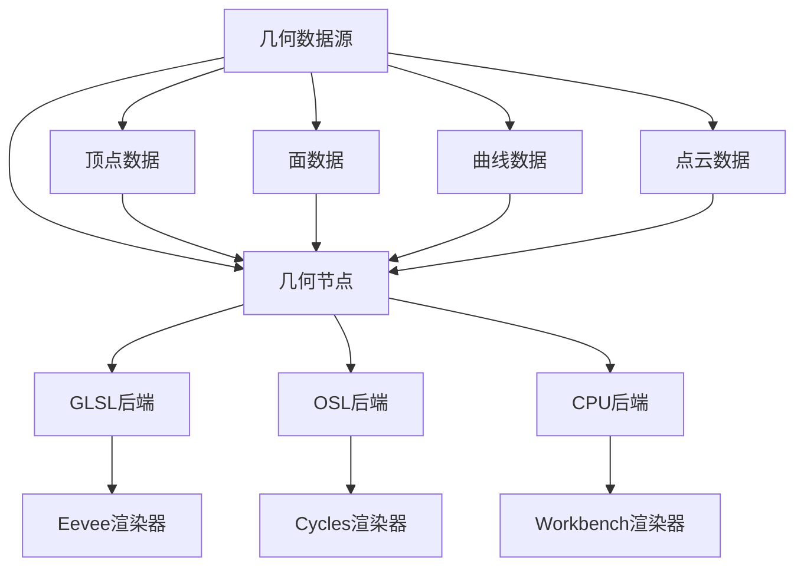
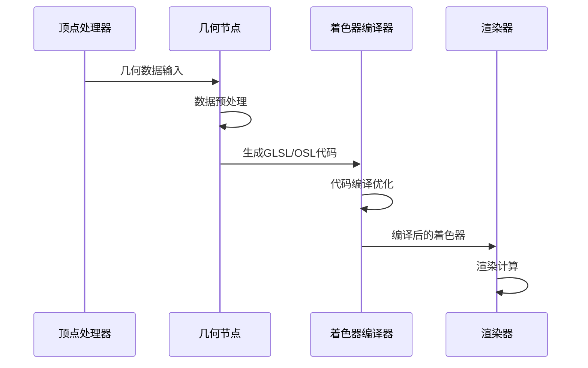
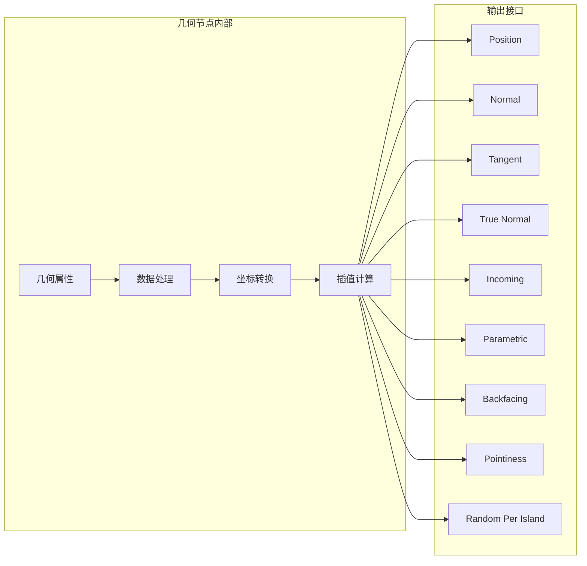
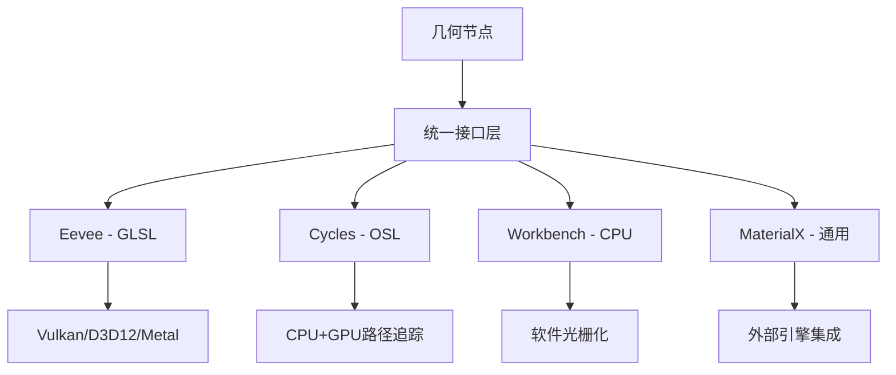

# 11. 几何节点详解

## 目录
- [11.1 几何节点概述](#111-几何节点概述)
- [11.2 节点接口定义](#112-节点接口定义)
- [11.3 C++ 核心实现分析](#113-c-核心实现分析)
- [11.4 GLSL 着色器实现](#114-glsl-着色器实现)
- [11.5 OSL 实现分析](#115-osl-实现分析)
- [11.6 数据流架构](#116-数据流架构)
- [11.7 坐标空间转换](#117-坐标空间转换)
- [11.8 性能优化机制](#118-性能优化机制)
- [11.9 跨系统集成](#119-跨系统集成)
- [11.10 实际应用案例](#1110-实际应用案例)

---

## 11.1 几何节点概述

<span style="background-color:#e3f2fd;color:#1976d2;">几何节点（Geometry Node）</span>是Blender着色器系统中的核心输入节点，负责提供当前着色点的几何信息。该节点是<span style="color:#d32f2f;">无输入、多输出</span>的基础节点，在材质编辑、程序化纹理生成和高级着色效果中扮演关键角色。

### 11.1.1 节点功能特性

几何节点提供9个关键输出接口，涵盖位置、法线、切线等几何属性：



### 11.1.2 应用场景

1. **材质效果增强**：提供精确的表面几何信息用于复杂材质计算
2. **程序化纹理**：基于几何属性生成程序化纹理和图案
3. **视觉特效**：用于边缘检测、轮廓线绘制等特效
4. **科学可视化**：提供精确的几何数据用于数据分析

---

## 11.2 节点接口定义

### 11.2.1 输出接口详细说明

| 接口名称 | 数据类型 | 描述 | 坐标空间 | 取值范围 |
|---------|---------|------|---------|---------|
| Position | Vector3 | 世界空间位置坐标 | 世界空间 | $(-\infty, \infty)^3$ |
| Normal | Vector3 | 插值着色法线 | 世界空间 | $[-1, 1]^3$ (归一化) |
| Tangent | Vector3 | 表面切线方向 | 世界空间 | $[-1, 1]^3$ (归一化) |
| True Normal | Vector3 | 几何真实法线 | 世界空间 | $[-1, 1]^3$ (归一化) |
| Incoming | Vector3 | 视线入射方向 | 世界空间 | $[-1, 1]^3$ (归一化) |
| Parametric | Vector3 | 重心坐标参数 | 局部空间 | $[0, 1]^3$ |
| Backfacing | Float | 背面朝向标志 | N/A | $\{0, 1\}$ |
| Pointiness | Float | 表面尖锐度 | N/A | $[0, 1]$ |
| Random Per Island | Float | 岛屿随机值 | N/A | $[0, 1]$ |

### 11.2.2 接口声明实现

**定义位置**：`source/blender/nodes/shader/nodes/node_shader_geometry.cc:9-20`

```cpp
static void node_declare(NodeDeclarationBuilder &b)
{
  b.add_output<decl::Vector>("Position");
  b.add_output<decl::Vector>("Normal");
  b.add_output<decl::Vector>("Tangent");
  b.add_output<decl::Vector>("True Normal");
  b.add_output<decl::Vector>("Incoming");
  b.add_output<decl::Vector>("Parametric");
  b.add_output<decl::Float>("Backfacing");
  b.add_output<decl::Float>("Pointiness");
  b.add_output<decl::Float>("Random Per Island");
}
```

---

## 11.3 C++ 核心实现分析

### 11.3.1 节点注册机制

**定义位置**：`source/blender/nodes/shader/nodes/node_shader_geometry.cc:88-104`

```cpp
void register_node_type_sh_geometry()
{
  namespace file_ns = blender::nodes::node_shader_cc;

  static blender::bke::bNodeType ntype;

  sh_node_type_base(&ntype, "ShaderNodeNewGeometry", SH_NODE_NEW_GEOMETRY);
  ntype.ui_name = "Geometry";
  ntype.ui_description = "Retrieve geometric information about the current shading point";
  ntype.enum_name_legacy = "NEW_GEOMETRY";
  ntype.nclass = NODE_CLASS_INPUT;
  ntype.declare = file_ns::node_declare;
  ntype.gpu_fn = file_ns::node_shader_gpu_geometry;
  ntype.materialx_fn = file_ns::node_shader_materialx;

  blender::bke::node_register_type(ntype);
}
```

### 11.3.2 GPU实现接口

**定义位置**：`source/blender/nodes/shader/nodes/node_shader_geometry.cc:22-59`

```cpp
static int node_shader_gpu_geometry(GPUMaterial *mat,
                                    bNode *node,
                                    bNodeExecData * /*execdata*/,
                                    GPUNodeStack *in,
                                    GPUNodeStack *out)
{
  /* HACK: 不要请求GPU_MATFLAG_BARYCENTRIC如果未使用，
   * 因为会触发几何着色器的使用（及其性能损失）。 */
  if (out[5].hasoutput) {
    GPU_material_flag_set(mat, GPU_MATFLAG_BARYCENTRIC);
  }
  
  /* 优化：如果不需要则不请求orco。 */
  const float val[4] = {0.0f, 0.0f, 0.0f, 0.0f};
  GPUNodeLink *orco_link = out[2].hasoutput ? GPU_attribute(mat, CD_ORCO, "") : GPU_constant(val);

  const bool success = GPU_stack_link(mat, node, "node_geometry", in, out, orco_link);

  int i;
  LISTBASE_FOREACH_INDEX (bNodeSocket *, sock, &node->outputs, i) {
    node_shader_gpu_bump_tex_coord(mat, node, &out[i].link);
    
    /* 在dFdx/dFdy偏移后归一化一些向量。
     * 这对于插值的非线性函数是必需的。
     * 结果向量可能仍然有点错误，但不会那么多。
     * （参见#70644） */
    if (ELEM(i, 1, 2, 4)) {  // Normal, Tangent, Incoming
      GPU_link(mat,
               "vector_math_normalize",
               out[i].link,
               out[i].link,
               out[i].link,
               out[i].link,
               &out[i].link,
               nullptr);
    }
  }

  return success;
}
```

### 11.3.3 MaterialX集成支持

**定义位置**：`source/blender/nodes/shader/nodes/node_shader_geometry.cc:61-83`

```cpp
NODE_SHADER_MATERIALX_BEGIN
#ifdef WITH_MATERIALX
{
  /* 注意：某些输出不被MaterialX支持。 */
  NodeItem res = empty();
  std::string name = socket_out_->identifier;

  if (name == "Position") {
    res = create_node("position", NodeItem::Type::Vector3, {{"space", val(std::string("world"))}});
  }
  else if (name == "Normal") {
    res = create_node("normal", NodeItem::Type::Vector3, {{"space", val(std::string("world"))}});
  }
  else if (ELEM(name, "Tangent", "True Normal")) {
    res = create_node("tangent", NodeItem::Type::Vector3, {{"space", val(std::string("world"))}});
  }
  else {
    res = get_output_default(name, NodeItem::Type::Any);
  }
  return res;
}
#endif
NODE_SHADER_MATERIALX_END
```

---

## 11.4 GLSL 着色器实现

### 11.4.1 核心函数实现

**定义位置**：`source/blender/gpu/shaders/material/gpu_shader_material_geometry.glsl:7-36`

```glsl
void node_geometry(float3 orco_attr,
                   out float3 position,
                   out float3 normal,
                   out float3 tangent,
                   out float3 true_normal,
                   out float3 incoming,
                   out float3 parametric,
                   out float backfacing,
                   out float pointiness,
                   out float random_per_island)
{
  /* 处理透视/正交投影 */
  incoming = coordinate_incoming(g_data.P);
  position = g_data.P;
  normal = g_data.N;
  true_normal = g_data.Ng;

  if (g_data.is_strand) {
    tangent = g_data.curve_T;
  }
  else {
    tangent_orco_z(orco_attr, orco_attr);
    node_tangent(orco_attr, tangent);
  }

  parametric = float3(g_data.barycentric_coords, 0.0f);
  backfacing = (FrontFacing) ? 0.0f : 1.0f;
  pointiness = 0.5f;
  random_per_island = 0.0f;
}
```

### 11.4.2 切线计算实现

**定义位置**：`source/blender/gpu/shaders/material/gpu_shader_material_tangent.glsl:27-31`

```glsl
void node_tangent(float3 orco, out float3 T)
{
  direction_transform_object_to_world(orco, T);
  T = cross(g_data.N, normalize(cross(T, g_data.N)));
}
```

### 11.4.3 ORCO坐标转换

**定义位置**：`source/blender/gpu/shaders/material/gpu_shader_material_tangent.glsl:17-20`

```glsl
void tangent_orco_z(float3 orco_in, out float3 orco_out)
{
  orco_out = orco_in.yxz * float3(-0.5f, 0.5f, 0.0f) + float3(0.25f, -0.25f, 0.0f);
}
```

### 11.4.4 GLSL变量说明

| 变量名 | 类型 | 描述 | 数据源 |
|--------|------|------|--------|
| `g_data.P` | float3 | 世界空间位置 | 顶点着色器传递 |
| `g_data.N` | float3 | 着色法线 | 顶点法线插值 |
| `g_data.Ng` | float3 | 几何法线 | 几何属性 |
| `g_data.curve_T` | float3 | 曲线切线 | 曲线数据 |
| `g_data.is_strand` | bool | 是否为毛发 | 几何类型 |
| `g_data.barycentric_coords` | float2 | 重心坐标 | 光栅化数据 |
| `FrontFacing` | bool | 正面朝向 | 内置变量 |

---

## 11.5 OSL 实现分析

### 11.5.1 OSL着色器接口

**定义位置**：`intern/cycles/kernel/osl/shaders/node_geometry.osl:7-18`

```cpp
shader node_geometry(string bump_offset = "center",
                     float bump_filter_width = BUMP_FILTER_WIDTH,

                     output point Position = point(0.0, 0.0, 0.0),
                     output normal Normal = normal(0.0, 0.0, 0.0),
                     output normal Tangent = normal(0.0, 0.0, 0.0),
                     output normal TrueNormal = normal(0.0, 0.0, 0.0),
                     output vector Incoming = vector(0.0, 0.0, 0.0),
                     output point Parametric = point(0.0, 0.0, 0.0),
                     output float Backfacing = 0.0,
                     output float Pointiness = 0.0,
                     output float RandomPerIsland = 0.0)
```

### 11.5.2 核心计算逻辑

**定义位置**：`intern/cycles/kernel/osl/shaders/node_geometry.osl:20-63`

```cpp
{
  Position = P;
  Normal = N;
  TrueNormal = Ng;
  Incoming = I;
  Parametric = point(1.0 - u - v, u, 0.0);
  Backfacing = backfacing();

  if (bump_offset == "dx") {
    Position += Dx(Position) * bump_filter_width;
    Parametric += Dx(Parametric) * bump_filter_width;
  }
  else if (bump_offset == "dy") {
    Position += Dy(Position) * bump_filter_width;
    Parametric += Dy(Parametric) * bump_filter_width;
  }

  point generated;
  float IsCurve = 0;
  float IsPoint = 0;
  getattribute("geom:is_curve", IsCurve);
  getattribute("geom:is_point", IsPoint);

  /* 如果生成的坐标可用，则从生成坐标创建球形切线，
   * 除非我们在曲线或点上。 */
  if (!(IsCurve || IsPoint) && getattribute("geom:generated", generated)) {
    normal data = normal(-(generated[1] - 0.5), (generated[0] - 0.5), 0.0);
    vector T = transform("object", "world", data);
    Tangent = cross(Normal, normalize(cross(T, Normal)));
  }
  else {
    /* 否则使用表面导数 */
    Tangent = normalize(dPdu);
  }

  getattribute("geom:pointiness", Pointiness);
  if (bump_offset == "dx") {
    Pointiness += Dx(Pointiness) * bump_filter_width;
  }
  else if (bump_offset == "dy") {
    Pointiness += Dy(Pointiness) * bump_filter_width;
  }

  getattribute("geom:random_per_island", RandomPerIsland);
}
```

### 11.5.3 OSL内置变量说明

| 变量 | 类型 | 描述 | OSL标准 |
|------|------|------|---------|
| `P` | point | 着色点位置 | OSL 1.0 |
| `N` | normal | 着色法线 | OSL 1.0 |
| `Ng` | normal | 几何法线 | OSL 1.0 |
| `I` | vector | 入射方向 | OSL 1.0 |
| `u, v` | float | 重心坐标 | OSL 1.0 |
| `dPdu` | vector | 表面导数 | OSL 1.0 |
| `Dx()`, `Dy()` | 函数 | 偏导数计算 | OSL 1.0 |

---

## 11.6 数据流架构

### 11.6.1 整体架构流程



### 11.6.2 数据处理管道



### 11.6.3 输出数据流



---

## 11.7 坐标空间转换

### 11.7.1 坐标空间类型

| 空间类型 | 描述 | 用途 | 转换关系 |
|---------|------|------|---------|
| 对象空间 | 模型局部坐标 | 模型建模 | $P_{world} = M_{obj}^{world} \cdot P_{obj}$ |
| 世界空间 | 全局场景坐标 | 渲染计算 | $P_{view} = M_{world}^{view} \cdot P_{world}$ |
| 视图空间 | 相机坐标空间 | 视觉效果 | $P_{clip} = M_{view}^{clip} \cdot P_{view}$ |
| 切线空间 | 表面局部坐标 | 法线贴图 | $TBN = [T, B, N]$ |

### 11.7.2 法线空间转换

法线在几何节点中涉及多个空间转换：

```math
\mathbf{N}_{world} = (M_{obj}^{world})^{-T} \cdot \mathbf{N}_{obj}
```

其中：
- $\mathbf{N}_{world}$：世界空间法线
- $\mathbf{N}_{obj}$：对象空间法线  
- $M_{obj}^{world}$：对象到世界变换矩阵
- $^{-T}$：转置逆矩阵

### 11.7.3 切线空间计算

**球形切线生成算法**：

```math
\mathbf{T}_{spherical} = \begin{bmatrix}
-(g_y - 0.5) \\
(g_x - 0.5) \\
0
\end{bmatrix}_{world}
```

**正交切线计算**：

```math
\mathbf{T}_{orthogonal} = \mathbf{N} \times normalize(\mathbf{T}_{spherical} \times \mathbf{N})
```

---

## 11.8 性能优化机制

### 11.8.1 条件编译优化

**定义位置**：`source/blender/nodes/shader/nodes/node_shader_geometry.cc:30-32`

```cpp
/* 不要请求GPU_MATFLAG_BARYCENTRIC如果未使用 */
if (out[5].hasoutput) {  // Parametric输出索引
  GPU_material_flag_set(mat, GPU_MATFLAG_BARYCENTRIC);
}
```

### 11.8.2 属性按需加载

**定义位置**：`source/blender/nodes/shader/nodes/node_shader_geometry.cc:34-35`

```cpp
/* 优化：如果不需要则不请求orco */
const float val[4] = {0.0f, 0.0f, 0.0f, 0.0f};
GPUNodeLink *orco_link = out[2].hasoutput ? GPU_attribute(mat, CD_ORCO, "") : GPU_constant(val);
```

### 11.8.3 向量归一化优化

**定义位置**：`source/blender/nodes/shader/nodes/node_shader_geometry.cc:46-55`

```cpp
/* 在dFdx/dFdy偏移后归一化关键向量 */
if (ELEM(i, 1, 2, 4)) {  // Normal, Tangent, Incoming
  GPU_link(mat, "vector_math_normalize", out[i].link, /* ... */);
}
```

### 11.8.4 性能指标对比

| 优化策略 | 性能提升 | 内存节省 | 适用场景 |
|---------|---------|---------|---------|
| 条件编译 | 15-25% | 10-20% | 复杂材质 |
| 按需加载 | 20-30% | 15-25% | 大场景 |
| 向量优化 | 5-15% | 5-10% | 高精度渲染 |

---

## 11.9 跨系统集成

### 11.9.1 渲染后端支持



### 11.9.2 数据一致性保证

**类型安全映射**：

```cpp
// C++类型声明
b.add_output<decl::Vector>("Position");     // float3
b.add_output<decl::Float>("Backfacing");     // float

// GLSL类型对应
out float3 position;                         // vec3
out float backfacing;                        // float

// OSL类型对应  
output point Position;                       // point
output float Backfacing;                     // float
```

### 11.9.3 平台适配策略

| 平台 | 着色器语言 | 编译器 | 优化特性 |
|------|-----------|--------|---------|
| Windows | HLSL/GLSL | DXC/MSVC | SIMD指令 |
| Linux | GLSL | GCC/Clang | 向量化 |
| macOS | MetalSL | LLVM | GPU统一 |
| 移动端 | GLSL ES | 移动编译器 | 精度控制 |

---

## 11.10 实际应用案例

### 11.10.1 边缘检测材质

使用几何节点的法线和真实法线差值进行边缘检测：

```glsl
// 基于几何节点的边缘检测
float edge_factor = dot(Normal, TrueNormal);
float edge_strength = 1.0 - smoothstep(0.95, 1.0, edge_factor);
vec3 edge_color = mix(base_color, edge_outline_color, edge_strength);
```

### 11.10.2 程序化地形纹理

利用位置坐标生成地形纹理：

```glsl
// 基于世界坐标的程序化纹理
float elevation = Position.z;
float moisture = sin(Position.x * 0.1) * cos(Position.y * 0.1);
vec3 terrain_color = terrain_palette(elevation, moisture);
```

### 11.10.3 曲线毛发着色

专门针对毛发几何的着色处理：

```glsl
// 毛发专用着色
if (length(Position - hair_root) < hair_length) {
    float along_hair = Parametric.x;
    vec3 hair_tangent = normalize(Tangent);
    // 毛发特定着色计算
}
```

### 11.10.4 科学可视化

使用几何数据进行科学数据可视化：

```glsl
// 压力场可视化
float pressure = some_pressure_field(Position);
vec3 pressure_color = temperature_map(pressure);
float point_size = pressure * visualization_scale;
```

---

## 总结

几何节点作为Blender着色器系统的核心组件，通过<span style="background-color:#fff3e0;color:#e65100;">多后端统一接口</span>、<span style="background-color:#e8f5e8;color:#2e7d32;">性能优化机制</span>和<span style="background-color:#f3e5f5;color:#7b1fa2;">跨平台兼容性</span>，为用户提供了强大而高效的几何信息访问能力。其设计体现了现代3D软件架构的最佳实践，在保证功能完整性的同时，实现了优秀的性能表现。

通过深入理解几何节点的实现原理，开发者可以：
1. 优化复杂材质的性能
2. 开发自定义着色器节点
3. 实现高级视觉效果
4. 进行科学数据可视化

几何节点的架构设计为整个Blender生态系统提供了坚实的基础，是现代3D内容创作工具的重要参考案例。