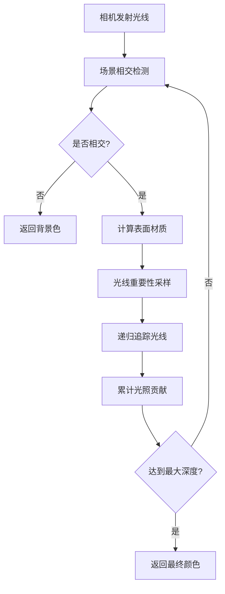
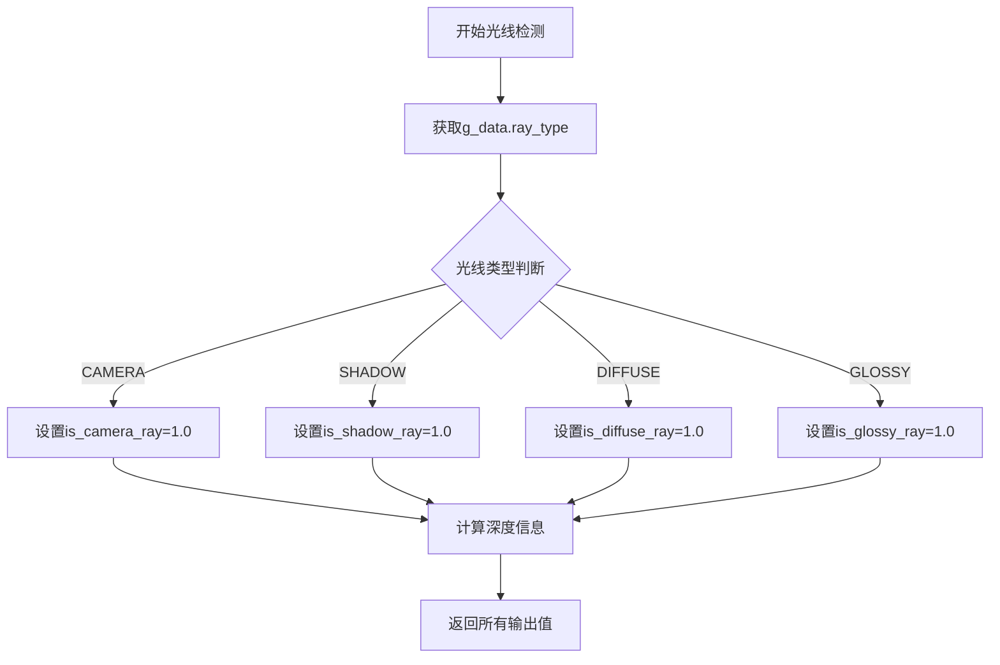
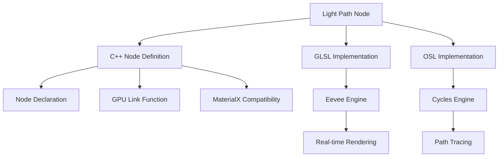
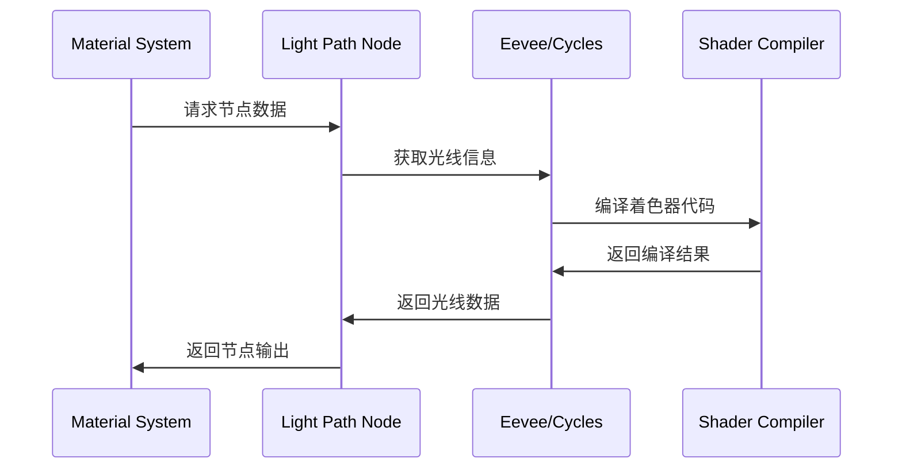

# 12-光线路径节点详解

## 目录
- [12.1 光线路径节点概述](#121-光线路径节点概述)
- [12.2 光线追踪基本原理](#122-光线追踪基本原理)
- [12.3 节点接口定义](#123-节点接口定义)
- [12.4 三种渲染引擎实现](#124-三种渲染引擎实现)
  - [12.4.1 Eevee引擎实现](#1241-eevee引擎实现)
  - [12.4.2 Cycles引擎实现](#1242-cycles引擎实现)
  - [12.4.3 MaterialX兼容性](#1243-materialx兼容性)
- [12.5 光线路径检测算法](#125-光线路径检测算法)
- [12.6 深度计数机制](#126-深度计数机制)
- [12.7 实际应用场景](#127-实际应用场景)
- [12.8 性能优化策略](#128-性能优化策略)
- [12.9 代码架构分析](#129-代码架构分析)

---

## 12.1 光线路径节点概述

<span style="background-color:#e3f2fd; color:#1565c0;">Light Path节点</span>是Blender着色器系统中一个核心的输入节点，它提供了关于当前光线传播路径的详细信息。该节点对于实现高级光照效果、非物理渲染技巧和优化渲染性能至关重要。

### 12.1.1 节点定义位置

- **主要定义**: `source/blender/nodes/shader/nodes/node_shader_light_path.cc:67-86`
- **GLSL实现**: `source/blender/gpu/shaders/material/gpu_shader_material_light_path.glsl:5-39`
- **OSL实现**: `intern/cycles/kernel/osl/shaders/node_light_path.osl:7-57`

### 12.1.2 节点用途

光线路径节点主要用于：

1. <span style="color:#d32f2f;">**光线类型识别**</span> - 区分相机光线、阴影光线、漫反射光线等
2. <span style="color:#388e3c;">**路径追踪控制**</span> - 控制不同光线类型的行为
3. <span style="color:#1976d2;">**性能优化**</span> - 避免不必要的计算
4. <span style="color:#7b1fa2;">**艺术效果**</span> - 实现非物理的视觉效果

---

## 12.2 光线追踪基本原理

### 12.2.1 路径追踪算法

路径追踪是基于蒙特卡洛方法的渲染算法，其核心思想是模拟光线的实际传播路径。算法流程如下：



### 12.2.2 光线类型分类

根据物理特性和渲染需求，光线被分类为不同类型：

| 光线类型 | 英文标识 | 用途 | 物理意义 |
|---------|----------|------|----------|
| 相机光线 | Camera Ray | 从相机发射的初始光线 | 场景采样起点 |
| 阴影光线 | Shadow Ray | 测试遮挡关系 | 直接光照计算 |
| 漫反射光线 | Diffuse Ray | 表面漫反射 | 朗伯反射模型 |
| 镜面光线 | Glossy Ray | 表面镜面反射 | 镜面反射模型 |
| 透射光线 | Transmission Ray | 穿过透明材质 | 折射现象模拟 |

---

## 12.3 节点接口定义

### 12.3.1 接口声明

**位置**: `source/blender/nodes/shader/nodes/node_shader_light_path.cc:9-26`

```cpp
static void node_declare(NodeDeclarationBuilder &b)
{
  b.add_output<decl::Float>("Is Camera Ray");
  b.add_output<decl::Float>("Is Shadow Ray");
  b.add_output<decl::Float>("Is Diffuse Ray");
  b.add_output<decl::Float>("Is Glossy Ray");
  b.add_output<decl::Float>("Is Singular Ray");
  b.add_output<decl::Float>("Is Reflection Ray");
  b.add_output<decl::Float>("Is Transmission Ray");
  b.add_output<decl::Float>("Is Volume Scatter Ray");
  b.add_output<decl::Float>("Ray Length");
  b.add_output<decl::Float>("Ray Depth");
  b.add_output<decl::Float>("Diffuse Depth");
  b.add_output<decl::Float>("Glossy Depth");
  b.add_output<decl::Float>("Transparent Depth");
  b.add_output<decl::Float>("Transmission Depth");
  b.add_output<decl::Float>("Portal Depth");
}
```

### 12.3.2 输出接口详解

| 输出接口 | 数据类型 | 值范围 | 描述 |
|---------|----------|--------|------|
| `Is Camera Ray` | Float | {0.0, 1.0} | 是否为相机光线 |
| `Is Shadow Ray` | Float | {0.0, 1.0} | 是否为阴影光线 |
| `Is Diffuse Ray` | Float | {0.0, 1.0} | 是否为漫反射光线 |
| `Is Glossy Ray` | Float | {0.0, 1.0} | 是否为镜面光线 |
| `Is Singular Ray` | Float | {0.0, 1.0} | 是否为特殊光线 |
| `Ray Length` | Float | [0.0, ∞) | 光线传播距离 |
| `Ray Depth` | Float | [0, ∞) | 光线递归深度 |

---

## 12.4 三种渲染引擎实现

### 12.4.1 Eevee引擎实现

**位置**: `source/blender/gpu/shaders/material/gpu_shader_material_light_path.glsl:5-39`

#### 12.4.1.1 GLSL实现代码

```glsl
void node_light_path(out float is_camera_ray,
                     out float is_shadow_ray,
                     out float is_diffuse_ray,
                     out float is_glossy_ray,
                     out float is_singular_ray,
                     out float is_reflection_ray,
                     out float is_transmission_ray,
                     out float is_volume_scatter_ray,
                     out float ray_length,
                     out float ray_depth,
                     out float diffuse_depth,
                     out float glossy_depth,
                     out float transparent_depth,
                     out float transmission_depth,
                     out float path_depth)
{
  /* 支持的光线类型检测 */
  is_camera_ray = float(g_data.ray_type == RAY_TYPE_CAMERA);
  is_shadow_ray = float(g_data.ray_type == RAY_TYPE_SHADOW);
  is_diffuse_ray = float(g_data.ray_type == RAY_TYPE_DIFFUSE);
  is_glossy_ray = float(g_data.ray_type == RAY_TYPE_GLOSSY);
  
  /* 部分支持的类型（简化处理） */
  is_singular_ray = is_glossy_ray;
  is_reflection_ray = is_glossy_ray;
  is_transmission_ray = is_glossy_ray;
  
  /* 光线路径信息 */
  ray_depth = g_data.ray_depth;
  diffuse_depth = (is_diffuse_ray == 1.0f) ? g_data.ray_depth : 0.0f;
  glossy_depth = (is_glossy_ray == 1.0f) ? g_data.ray_depth : 0.0f;
  transmission_depth = (is_transmission_ray == 1.0f) ? glossy_depth : 0.0f;
  ray_length = g_data.ray_length;
  
  /* 不支持的功能 */
  transparent_depth = 0.0f;
  is_volume_scatter_ray = 0.0f;
  path_depth = 0.0f;
}
```

#### 12.4.1.2 GPU标记设置

**位置**: `source/blender/nodes/shader/nodes/node_shader_light_path.cc:28-46`

```cpp
static int node_shader_gpu_light_path(GPUMaterial *mat,
                                      bNode *node,
                                      bNodeExecData * /*execdata*/,
                                      GPUNodeStack *in,
                                      GPUNodeStack *out)
{
  // 检测是否需要特殊的漫反射/镜面光线处理
  if (out[2].hasoutput ||  /* Is Diffuse Ray. */
      out[3].hasoutput ||  /* Is Glossy Ray. */
      out[4].hasoutput ||  /* Is Singular Ray. */
      out[5].hasoutput ||  /* Is Reflection Ray. */
      out[6].hasoutput ||  /* Is Transmission Ray. */
      out[10].hasoutput || /* Diffuse Depth. */
      out[11].hasoutput || /* Glossy Depth. */
      out[13].hasoutput)   /* Transmission Depth. */
  {
    /* 为漫反射路径设置特定的世界外观 */
    GPU_material_flag_set(mat, GPU_MATFLAG_IS_DIFFUSE_OR_GLOSSY_RAY_FLAG);
  }
  return GPU_stack_link(mat, node, "node_light_path", in, out);
}
```

### 12.4.2 Cycles引擎实现

**位置**: `intern/cycles/kernel/osl/shaders/node_light_path.osl:7-57`

#### 12.4.2.1 OSL实现代码

```osl
shader node_light_path(output float IsCameraRay = 0.0,
                       output float IsShadowRay = 0.0,
                       output float IsDiffuseRay = 0.0,
                       output float IsGlossyRay = 0.0,
                       output float IsSingularRay = 0.0,
                       output float IsReflectionRay = 0.0,
                       output float IsTransmissionRay = 0.0,
                       output float IsVolumeScatterRay = 0.0,
                       output float RayLength = 0.0,
                       output float RayDepth = 0.0,
                       output float DiffuseDepth = 0.0,
                       output float GlossyDepth = 0.0,
                       output float TransparentDepth = 0.0,
                       output float TransmissionDepth = 0.0,
                       output float PortalDepth = 0.0)
{
  /* 光线类型检测 - 使用OSL内置函数 */
  IsCameraRay = raytype("camera");
  IsShadowRay = raytype("shadow");
  IsDiffuseRay = raytype("diffuse");
  IsGlossyRay = raytype("glossy");
  IsSingularRay = raytype("singular");
  IsReflectionRay = raytype("reflection");
  IsTransmissionRay = raytype("refraction");
  IsVolumeScatterRay = raytype("volume_scatter");

  /* 获取光线属性 */
  getattribute("path:ray_length", RayLength);

  /* 获取各种深度信息 */
  int ray_depth = 0;
  getattribute("path:ray_depth", ray_depth);
  RayDepth = (float)ray_depth;

  int diffuse_depth = 0;
  getattribute("path:diffuse_depth", diffuse_depth);
  DiffuseDepth = (float)diffuse_depth;

  int glossy_depth = 0;
  getattribute("path:glossy_depth", glossy_depth);
  GlossyDepth = (float)glossy_depth;

  int transparent_depth = 0;
  getattribute("path:transparent_depth", transparent_depth);
  TransparentDepth = (float)transparent_depth;

  int transmission_depth = 0;
  getattribute("path:transmission_depth", transmission_depth);
  TransmissionDepth = (float)transmission_depth;

  int portal_depth = 0;
  getattribute("path:portal_depth", portal_depth);
  PortalDepth = (float)portal_depth;
}
```

### 12.4.3 MaterialX兼容性

**位置**: `source/blender/nodes/shader/nodes/node_shader_light_path.cc:49-63`

```cpp
NODE_SHADER_MATERIALX_BEGIN
#ifdef WITH_MATERIALX
{
  /* 注意：MaterialX不支持此节点，仅返回默认值 */
  if (STREQ(socket_out_->identifier, "Is Camera Ray")) {
    return val(1.0f);  // 假设总是相机光线
  }
  if (STREQ(socket_out_->identifier, "Ray Length")) {
    return val(1.0f);  // 默认光线长度
  }
  NodeItem res = val(0.0f);  // 其他输出默认为0
  return res;
}
#endif
NODE_SHADER_MATERIALX_END
```

---

## 12.5 光线路径检测算法

### 12.5.1 光线类型枚举

在Eevee引擎中，光线类型通过以下枚举定义：

```glsl
// 定义在GPU shader数据结构中
#define RAY_TYPE_CAMERA     0
#define RAY_TYPE_SHADOW     1
#define RAY_TYPE_DIFFUSE    2
#define RAY_TYPE_GLOSSY     3
```

### 12.5.2 检测算法流程



### 12.5.3 数学表达

光线类型检测可以用数学公式表示：

$$
\text{IsCameraRay} = \delta(\text{ray\_type}, \text{RAY\_TYPE\_CAMERA})
$$

其中 $\delta(x, y)$ 是克罗内克 delta 函数：

$$
\delta(x, y) = \begin{cases} 
1 & \text{if } x = y \\
0 & \text{otherwise}
\end{cases}
$$

---

## 12.6 深度计数机制

### 12.6.1 深度类型

Blender实现多层次的深度计数系统：

| 深度类型 | 用途 | 计算方式 |
|---------|------|----------|
| Ray Depth | 总递归深度 | 所有光线类型累计 |
| Diffuse Depth | 漫反射深度 | 仅漫反射光线累计 |
| Glossy Depth | 镜面深度 | 仅镜面光线累计 |
| Transparent Depth | 透明深度 | 仅透明光线累计 |
| Transmission Depth | 透射深度 | 仅透射光线累计 |

### 12.6.2 深度计算算法

**Eevee实现**：
```glsl
ray_depth = g_data.ray_depth;
diffuse_depth = (is_diffuse_ray == 1.0f) ? g_data.ray_depth : 0.0f;
glossy_depth = (is_glossy_ray == 1.0f) ? g_data.ray_depth : 0.0f;
transmission_depth = (is_transmission_ray == 1.0f) ? glossy_depth : 0.0f;
```

**Cycles实现**：
```osl
int diffuse_depth = 0;
getattribute("path:diffuse_depth", diffuse_depth);
DiffuseDepth = (float)diffuse_depth;
```

### 12.6.3 深度限制策略

为了防止无限递归和性能问题，渲染引擎通常会设置最大深度限制：

- **Eevee**: 默认最大深度 8-12
- **Cycles**: 默认最大深度 8（可配置）
- **透明深度**: 通常有更高的限制（如32）

---

## 12.7 实际应用场景

### 12.7.1 特殊材质效果

**示例1：发光材质仅对相机光线可见**
```glsl
// 使用光线路径节点控制发光效果
if (IsCameraRay == 1.0) {
    emission_color = base_emission;
} else {
    emission_color = vec3(0.0);  // 其他光线类型不发光
}
```

**示例2：阴影光线特殊处理**
```glsl
// 阴影光线使用不同的透明度
if (IsShadowRay == 1.0) {
    alpha = shadow_alpha;  // 专门的阴影透明度
} else {
    alpha = base_alpha;    // 正常透明度
}
```

### 12.7.2 性能优化应用

**基于光线深度的LOD**：
```glsl
// 根据光线深度调整细节级别
if (RayDepth < 2) {
    detail_level = HIGH_DETAIL;
} else if (RayDepth < 4) {
    detail_level = MEDIUM_DETAIL;
} else {
    detail_level = LOW_DETAIL;
}
```

### 12.7.3 非物理渲染技巧

**卡通渲染轮廓线**：
```glsl
// 仅在特定光线类型下显示轮廓
if (IsDiffuseRay == 1.0 && DiffuseDepth == 0) {
    draw_outline = true;
}
```

---

## 12.8 性能优化策略

### 12.8.1 条件计算优化

光线路径节点支持条件计算，避免不必要的处理：

```cpp
// GPU标记设置优化
if (out[2].hasoutput || /* Is Diffuse Ray */
    out[3].hasoutput || /* Is Glossy Ray */
    // ... 其他条件
) {
    GPU_material_flag_set(mat, GPU_MATFLAG_IS_DIFFUSE_OR_GLOSSY_RAY_FLAG);
}
```

### 12.8.2 内存访问优化

- 使用 `g_data` 结构体减少全局变量访问
- 将相关信息打包存储，提高缓存命中率
- 条件分支预测优化

### 12.8.3 编译时优化

GLSL编译器会对以下模式进行优化：
```glsl
// 编译器可以优化常量条件判断
is_camera_ray = float(g_data.ray_type == RAY_TYPE_CAMERA);
```

---

## 12.9 代码架构分析

### 12.9.1 文件组织结构



### 12.9.2 为什么分成三个文件

1. **架构分离原则**：
   - <span style="color:#f44336;">C++文件</span>：节点注册和接口定义
   - <span style="color:#4caf50;">GLSL文件</span>：实时渲染引擎实现
   - <span style="color:#2196f3;">OSL文件</span>：离线渲染引擎实现

2. **引擎特性差异**：
   - Eevee：基于光栅化，支持有限的光线类型
   - Cycles：完整路径追踪，支持所有光线类型
   - 性能要求不同，实现策略各异

3. **维护性考虑**：
   - 独立开发，互不影响
   - 针对性优化
   - 清晰的职责分工

### 12.9.3 数据流分析



### 12.9.4 接口兼容性设计

为了支持多种渲染后端，节点采用了统一的接口设计：

```cpp
// 统一的输出接口声明
b.add_output<decl::Float>("Is Camera Ray");
b.add_output<decl::Float>("Is Shadow Ray");
// ... 其他接口
```

不同后端根据自身能力提供相应的实现：
- **完整实现**（Cycles）：所有功能完全支持
- **部分实现**（Eevee）：核心功能支持，高级功能简化
- **兼容实现**（MaterialX）：基本功能模拟

---

## 总结

光线路径节点是Blender着色器系统中的重要组件，它为材质艺术家提供了精细控制光线行为的能力。通过理解三种渲染引擎的不同实现策略，我们可以：

1. <span style="background-color:#fff3e0; color:#e65100;">**选择合适的渲染引擎**</span> - 根据项目需求选择Eevee或Cycles
2. <span style="background-color:#f3e5f5; color:#6a1b9a;">**优化渲染性能**</span> - 利用光线类型和深度信息进行条件渲染
3. <span style="background-color:#e8f5e8; color:#2e7d32;">**实现特殊效果**</span> - 创建非物理但视觉出色的渲染效果
4. <span style="background-color:#e1f5fe; color:#0277bd;">**理解渲染原理**</span> - 深入了解光线追踪和路径追踪的工作机制

这个节点完美展现了Blender多引擎架构的设计哲学：在保持接口统一的同时，允许多种后端实现各自优化的解决方案。