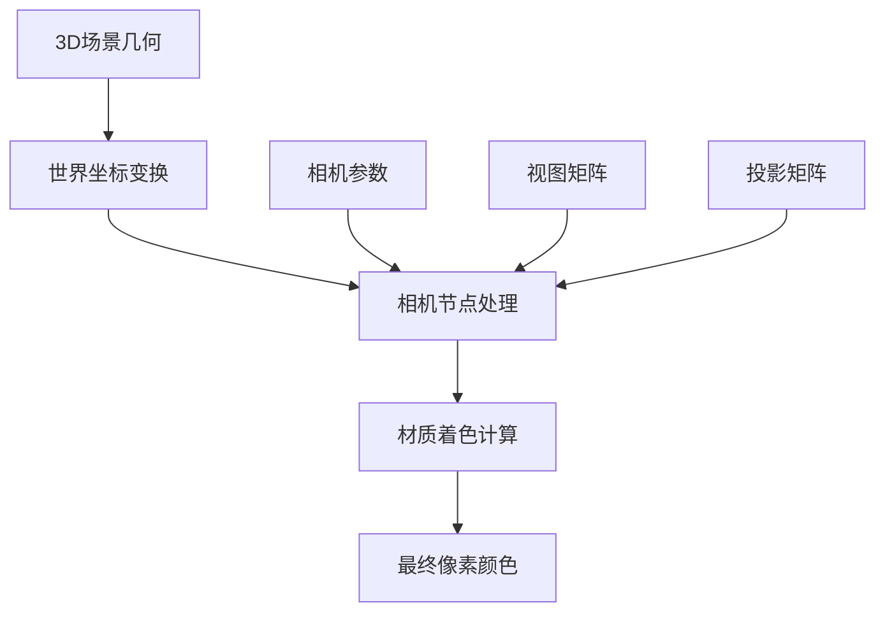
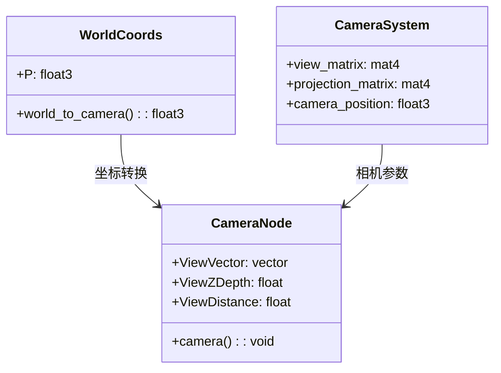
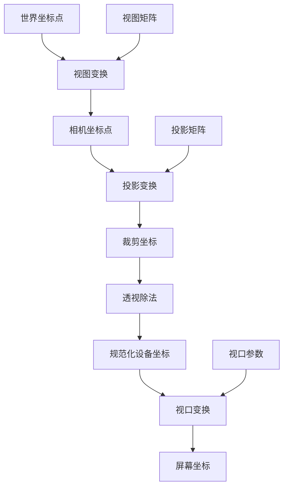

# 13. 相机节点详解

## 目录
- [13.1 概述](#131-概述)
- [13.2 节点接口与输出](#132-节点接口与输出)
- [13.3 计算机图形学基础](#133-计算机图形学基础)
- [13.4 核心源码分析](#134-核心源码分析)
- [13.5 渲染引擎实现差异](#135-渲染引擎实现差异)
- [13.6 相机投影数学原理](#136-相机投影数学原理)
- [13.7 实际应用示例](#137-实际应用示例)
- [13.8 性能优化与注意事项](#138-性能优化与注意事项)

---

## 13.1 概述

<span style="background-color:#e3f2fd; color:#1565c0;">相机节点（Camera Data Node）</span>是Blender材质系统中的一个重要输入节点，用于获取当前着色点相对于相机的位置信息。该节点提供了从3D世界坐标系到相机坐标系的转换数据，是实现各种视觉效果的基础组件。

### 13.1.1 节点功能概述

相机节点主要负责：
- 将<span style="color:#d32f2f;">世界坐标系</span>中的点位置转换到<span style="color:#388e3c;">相机坐标系</span>
- 计算点到相机的深度距离和欧几里得距离
- 生成从着色点指向相机的方向向量

### 13.1.2 在渲染管线中的位置



---

## 13.2 节点接口与输出

### 13.2.1 输出接口详解

相机节点提供三个输出接口，每个都有特定的数学含义和用途：

#### 13.2.1.1 View Vector（视图向量）

```cpp
// 位置：source/blender/nodes/shader/nodes/node_shader_camera.cc:15
b.add_output<decl::Vector>("View Vector");
```

**数学定义**：
$$\vec{v}_{view} = \frac{\vec{P}_{camera}}{|\vec{P}_{camera}|}$$

其中 $\vec{P}_{camera}$ 是点在相机坐标系中的位置。

**用途**：
- 计算视角相关的光照效果
- 实现基于视角的材质变化
- 用于菲涅尔效应计算

#### 13.2.1.2 View Z Depth（视图Z深度）

```cpp
// 位置：source/blender/nodes/shader/nodes/node_shader_camera.cc:16
b.add_output<decl::Float>("View Z Depth");
```

**数学定义**：
$$d_{z} = |P_{camera,z}|$$

**用途**：
- 深度缓冲相关效果
- 雾效和大气透视
- Z通道相关渲染

#### 13.2.1.3 View Distance（视图距离）

```cpp
// 位置：source/blender/nodes/shader/nodes/node_shader_camera.cc:17
b.add_output<decl::Float>("View Distance");
```

**数学定义**：
$$d_{euclidean} = \sqrt{P_{camera,x}^2 + P_{camera,y}^2 + P_{camera,z}^2}$$

**用途**：
- 距离雾效果
- 基于距离的LOD（细节层次）
- 物理光照计算

### 13.2.2 节点架构图



---

## 13.3 计算机图形学基础

### 13.3.1 坐标系变换

#### 13.3.1.1 世界坐标系到相机坐标系

相机坐标系是右手坐标系，其中：
- <span style="color:#f44336;">Z轴</span>：指向相机后方（与视线方向相反）
- <span style="color:#4caf50;">Y轴</span>：向上
- <span style="color:#2196f3;">X轴</span>：向右

**变换矩阵**：
$$\vec{P}_{camera} = M_{view} \cdot \vec{P}_{world}$$

其中 $M_{view}$ 是视图矩阵：

$$M_{view} = \begin{bmatrix}
r_x & r_y & r_z & -\vec{r} \cdot \vec{c} \\
u_x & u_y & u_z & -\vec{u} \cdot \vec{c} \\
f_x & f_y & f_z & -\vec{f} \cdot \vec{c} \\
0 & 0 & 0 & 1
\end{bmatrix}$$

这里：
- $\vec{r}$：右向量（Right）
- $\vec{u}$：上向量（Up）
- $\vec{f}$：前向量（Forward）
- $\vec{c}$：相机位置

### 13.3.2 透视投影原理

#### 13.3.2.1 透视投影矩阵

对于透视相机，投影矩阵为：

$$M_{perspective} = \begin{bmatrix}
\frac{1}{aspect \cdot tan(\frac{fov}{2})} & 0 & 0 & 0 \\
0 & \frac{1}{tan(\frac{fov}{2})} & 0 & 0 \\
0 & 0 & -\frac{f+n}{f-n} & -\frac{2fn}{f-n} \\
0 & 0 & -1 & 0
\end{bmatrix}$$

其中：
- $fov$：视场角（Field of View）
- $aspect$：宽高比
- $n$：近平面距离
- $f$：远平面距离

#### 13.3.2.2 景深计算

景深效果基于以下参数：
- **光圈（Aperture）**：控制模糊程度
- **焦距（Focal Distance）**：清晰平面距离
- **F值（F-stop）**：光圈大小

**弥散圆计算**：
$$CoC = \frac{|d_{object} - d_{focus}|}{d_{object}} \cdot \frac{f^2}{N \cdot (d_{focus} - f)}$$

其中：
- $d_{object}$：物体到相机的距离
- $d_{focus}$：焦距
- $f$：镜头焦距
- $N$：F值

---

## 13.4 核心源码分析

### 13.4.1 C++节点定义

#### 13.4.1.1 节点声明与注册

```cpp
// 位置：source/blender/nodes/shader/nodes/node_shader_camera.cc

namespace blender::nodes::node_shader_camera_cc {

// 节点输出声明
static void node_declare(NodeDeclarationBuilder &b)
{
  b.add_output<decl::Vector>("View Vector");    // 视图向量输出
  b.add_output<decl::Float>("View Z Depth");     // Z深度输出  
  b.add_output<decl::Float>("View Distance");    // 距离输出
}

// GPU着色器链接函数
static int gpu_shader_camera(GPUMaterial *mat,
                             bNode *node,
                             bNodeExecData * /*execdata*/,
                             GPUNodeStack *in,
                             GPUNodeStack *out)
{
  // 链接到GLSL中的"camera"函数
  return GPU_stack_link(mat, node, "camera", in, out);
}

// MaterialX支持（当前为默认实现）
NODE_SHADER_MATERIALX_BEGIN
#ifdef WITH_MATERIALX
{
  /* NOTE: This node doesn't have an implementation in MaterialX. */
  return get_output_default(socket_out_->identifier, NodeItem::Type::Any);
}
#endif
NODE_SHADER_MATERIALX_END

}  // namespace blender::nodes::node_shader_camera_cc

// 节点类型注册
void register_node_type_sh_camera()
{
  namespace file_ns = blender::nodes::node_shader_camera_cc;

  static blender::bke::bNodeType ntype;

  // 基础节点信息设置
  sh_node_type_base(&ntype, "ShaderNodeCameraData", SH_NODE_CAMERA);
  ntype.ui_name = "Camera Data";
  ntype.ui_description =
      "Retrieve information about the camera and how it relates to the current shading point's "
      "position";
  ntype.enum_name_legacy = "CAMERA";
  ntype.nclass = NODE_CLASS_INPUT;
  
  // 函数指针绑定
  ntype.declare = file_ns::node_declare;
  ntype.gpu_fn = file_ns::gpu_shader_camera;
  ntype.materialx_fn = file_ns::node_shader_materialx;

  blender::bke::node_register_type(ntype);
}
```

### 13.4.2 GLSL实现分析

#### 13.4.2.1 主相机函数

```glsl
// 位置：source/blender/gpu/shaders/material/gpu_shader_material_camera.glsl

#include "gpu_shader_material_transform_utils.glsl"

/**
 * 相机数据计算函数
 * @param outview 输出：视图向量（归一化的相机空间位置）
 * @param outdepth 输出：Z深度（相机空间Z坐标的绝对值）
 * @param outdist 输出：欧几里得距离（相机空间位置向量的长度）
 */
void camera(out float3 outview, out float outdepth, out float outdist)
{
  float3 vP;  // 相机空间位置向量
  
  // 将世界坐标点转换到相机坐标系
  point_transform_world_to_view(g_data.P, vP);
  
  // 相机空间中Z轴指向后方，取正值
  vP.z = -vP.z;
  
  // 计算Z深度（距离近平面的距离）
  outdepth = abs(vP.z);
  
  // 计算到相机的欧几里得距离
  outdist = length(vP);
  
  // 计算归一化的视图向量
  outview = normalize(vP);
}
```

#### 13.4.2.2 坐标变换工具函数

```glsl
// 位置：source/blender/gpu/shaders/material/gpu_shader_material_transform_utils.glsl

/**
 * 世界坐标到相机坐标的点变换
 * @param vin 输入：世界坐标系中的点位置
 * @param vout 输出：相机坐标系中的点位置
 */
void point_transform_world_to_view(float3 vin, out float3 vout)
{
  // 应用视图矩阵进行坐标变换
  // drw_view().viewmat 是当前相机的视图矩阵
  vout = (drw_view().viewmat * float4(vin, 1.0f)).xyz;
}

/**
 * 相机坐标到世界坐标的点变换
 * @param vin 输入：相机坐标系中的点位置  
 * @param vout 输出：世界坐标系中的点位置
 */
void point_transform_view_to_world(float3 vin, out float3 vout)
{
  // 应用视图逆矩阵进行坐标变换
  vout = (drw_view().viewinv * float4(vin, 1.0f)).xyz;
}
```

### 13.4.3 OSL实现分析

#### 13.4.3.1 Cycles相机节点

```osl
// 位置：intern/cycles/kernel/osl/shaders/node_camera.osl

#include "stdcycles.h"

/**
 * OSL相机数据着色器
 * 在Cycles渲染引擎中计算相机相关信息
 */
shader node_camera(output vector ViewVector = vector(0.0, 0.0, 0.0),
                   output float ViewZDepth = 0.0,
                   output float ViewDistance = 0.0)
{
  // 使用OSL内置的transform函数进行坐标系转换
  // "world" -> "camera" 表示从世界坐标系转换到相机坐标系
  // P是当前着色点的世界坐标位置
  ViewVector = (vector)transform("world", "camera", P);

  // 提取Z深度（相机坐标系中的Z分量）
  ViewZDepth = ViewVector[2];
  
  // 计算到相机的欧几里得距离
  ViewDistance = length(ViewVector);
  
  // 归一化视图向量
  ViewVector = normalize(ViewVector);
}
```

#### 13.4.3.2 OSL与GLSL的差异对比

| 特性 | OSL实现 | GLSL实现 |
|------|---------|----------|
| 坐标变换 | `transform("world", "camera", P)` | `drw_view().viewmat * float4(P, 1.0f)` |
| Z处理 | 直接使用Z分量 | `vP.z = -vP.z` 取正值 |
| 变量命名 | 驼峰命名 | 下划线命名 |
| 性能优化 | 编译时优化 | 手动优化 |

---

## 13.5 渲染引擎实现差异

### 13.5.1 三大引擎架构对比


### 13.5.2 性能特征分析

| 引擎 | 实现方式 | 计算精度 | 性能特点 | 适用场景 |
|------|----------|----------|----------|----------|
| <span style="color:#4caf50;">Eevee</span> | GLSL | 32位浮点 | 实时渲染，GPU并行 | 游戏开发，预览 |
| <span style="color:#2196f3;">Cycles</span> | OSL/C++ | 32/64位浮点 | 物理精确，路径追踪 | 电影级渲染 |
| <span style="color:#ff9800;">Workbench</span> | 简化GLSL | 32位浮点 | 最快速度，基础功能 | 建模，快速预览 |

### 13.5.3 精度与误差分析

#### 13.5.3.1 数值精度问题

**浮点数精度限制**：
- 单精度浮点数：约7位十进制有效数字
- 深度缓冲精度：非均匀分布，近景精度高，远景精度低

**深度精度公式**：
$$\Delta z = \frac{z^2}{far \cdot near} \cdot \frac{1}{2^{n}-1}$$

其中 $n$ 是深度缓冲的位数。

#### 13.5.3.2 坐标系误差累积

```cpp
// 误差累积示例
struct ErrorAnalysis {
    float world_pos[3];      // 世界坐标位置
    float camera_pos[3];     // 相机坐标位置
    float accumulated_error; // 累积误差
    
    // 计算变换误差
    void computeTransformError() {
        // 多次变换可能导致误差累积
        float3 temp1 = transform_world_to_view(world_pos);
        float3 temp2 = transform_view_to_world(temp1);
        
        // 比较原始位置和往返变换后的位置
        accumulated_error = length(world_pos - temp2);
    }
};
```

---

## 13.6 相机投影数学原理

### 13.6.1 视锥体裁剪

#### 13.6.1.1 视锥体定义

相机视锥体由6个平面定义：
- <span style="color:#f44336;">近平面</span>：$z = near$
- <span style="color:#4caf50;">远平面</span>：$z = far$
- <span style="color:#2196f3;">左平面</span>：$x = -z \cdot tan(fov_x/2)$
- <span style="color:#ff9800;">右平面</span>：$x = z \cdot tan(fov_x/2)$
- <span style="color:#9c27b0;">上平面</span>：$y = z \cdot tan(fov_y/2)$
- <span style="color:#607d8b;">下平面</span>：$y = -z \cdot tan(fov_y/2)$

#### 13.6.1.2 视锥体裁剪算法

```cpp
// 位置：概念性代码，展示裁剪原理
struct FrustumPlanes {
    float4 planes[6]; // 6个裁剪平面
    
    // 点在视锥体内测试
    bool pointInFrustum(const float3& point) {
        for (int i = 0; i < 6; i++) {
            // 平面方程：ax + by + cz + d = 0
            if (dot(planes[i].xyz, point) + planes[i].w < 0) {
                return false; // 点在平面外侧
            }
        }
        return true;
    }
};
```

### 13.6.2 投影变换流程



### 13.6.3 深度缓冲与Z-Fighting

#### 13.6.3.1 深度缓冲原理

深度缓冲存储每个像素的深度值，用于解决可见性问题。

**深度值计算**：
$$z_{normalized} = \frac{1}{z} \cdot \frac{far \cdot near}{far - near} - \frac{near}{far - near}$$

#### 13.6.3.2 Z-Fighting问题及解决方案

**Z-Fighting**：当两个表面距离过近时，由于深度精度限制导致的闪烁现象。

**解决方案**：
1. <span style="color:#4caf50;">多边形偏移</span>：`glPolygonOffset()`
2. <span style="color:#2196f3;">调整近平面</span>：增大near值
3. <span style="color:#ff9800;">更高精度深度缓冲</span>：24位或32位

```glsl
// 多边形偏移示例
layout(polygon_offset_fill) in; // 启用多边形偏移

// 在几何着色器中应用偏移
void applyPolygonOffset() {
    gl_Position.z += 0.001; // 手动偏移深度值
}
```

---

## 13.7 实际应用示例

### 13.7.1 菲涅尔效应实现

```glsl
// 使用相机节点实现菲涅尔效应
shader fresnel_effect() {
    // 获取视图向量
    vector ViewVector;
    float ViewZDepth, ViewDistance;
    node_camera(ViewVector, ViewZDepth, ViewDistance);
    
    // 获取表面法线
    vector Normal = getNormal();
    
    // 计算菲涅尔系数
    float fresnel = pow(1.0 - dot(-ViewVector, Normal), 5.0);
    
    // 应用到材质
    vector base_color = vector(0.2, 0.4, 0.8);
    vector edge_color = vector(1.0, 1.0, 1.0);
    
    vector final_color = mix(base_color, edge_color, fresnel);
    outputColor(final_color);
}
```

### 13.7.2 距离雾效果

```glsl
// 基于相机距离的雾效
shader distance_fog() {
    // 获取相机距离
    vector ViewVector;
    float ViewZDepth, ViewDistance;
    node_camera(ViewVector, ViewZDepth, ViewDistance);
    
    // 雾效参数
    float fog_start = 10.0;
    float fog_end = 50.0;
    vector fog_color = vector(0.7, 0.8, 0.9);
    
    // 计算雾效因子
    float fog_factor = smoothstep(fog_start, fog_end, ViewDistance);
    
    // 应用雾效
    vector object_color = getObjectColor();
    vector final_color = mix(object_color, fog_color, fog_factor);
    
    outputColor(final_color);
}
```

### 13.7.3 视角相关贴图

```glsl
// 根据视角改变贴图显示
shader view_dependent_texture() {
    // 获取视图向量
    vector ViewVector;
    float ViewZDepth, ViewDistance;
    node_camera(ViewVector, ViewZDepth, ViewDistance);
    
    // 获取UV坐标和法线
    vector2 uv = getUV();
    vector Normal = getNormal();
    
    // 计算视角
    float view_angle = dot(-ViewVector, Normal);
    
    // 根据视角混合不同贴图
    vector front_texture = texture2D(front_map, uv);
    vector side_texture = texture2D(side_map, uv);
    
    // 使用view_angle作为混合因子
    vector final_texture = mix(side_texture, front_texture, view_angle);
    
    outputColor(final_texture);
}
```

---

## 13.8 性能优化与注意事项

### 13.8.1 性能优化策略

#### 13.8.1.1 计算缓存

```cpp
// 缓存相机变换结果
class CameraDataCache {
private:
    float3 cached_view_vector;
    float cached_view_depth;
    float cached_view_distance;
    float3 last_world_position;
    
public:
    void updateCache(const float3& world_pos) {
        // 只有位置改变时才重新计算
        if (length(world_pos - last_world_position) > 1e-6) {
            computeCameraData(world_pos);
            last_world_position = world_pos;
        }
    }
    
    const float3& getViewVector() const { return cached_view_vector; }
    float getViewDepth() const { return cached_view_depth; }
    float getViewDistance() const { return cached_view_distance; }
};
```

#### 13.8.1.2 GPU并行优化

```glsl
// 使用GPU并行计算优化
#version 450
layout(local_size_x = 64) in; // 工作组大小

shared float3 shared_view_vectors[64]; // 共享内存

void main() {
    uint local_id = gl_LocalInvocationID.x;
    
    // 并行计算相机数据
    float3 world_pos = world_positions[gl_GlobalInvocationID.x];
    float3 view_pos = transformWorldToView(world_pos);
    
    // 存储到共享内存
    shared_view_vectors[local_id] = normalize(view_pos);
    
    // 确保所有线程完成计算
    barrier();
    
    // 后续处理...
}
```

### 13.8.2 常见问题与解决方案

#### 13.8.2.1 深度精度问题

**问题**：远处物体出现Z-Fighting
**解决方案**：
```cpp
// 调整深度缓冲精度
void setupCameraDepth() {
    // 使用对数深度缓冲
    if (use_logarithmic_depth) {
        glEnable(GL_DEPTH_TEST);
        // 设置对数深度常量
        float log_depth_const = 2.0 / log(far / near + 1.0);
        glUniform1f(log_depth_location, log_depth_const);
    }
}
```

#### 13.8.2.2 坐标系混淆

**问题**：不同渲染引擎的坐标系差异
**解决方案**：
```cpp
// 统一的坐标变换接口
class CoordinateTransformer {
public:
    enum class CoordinateSystem {
        WORLD,
        CAMERA, 
        VIEW,
        SCREEN
    };
    
    float3 transform(const float3& point, 
                    CoordinateSystem from,
                    CoordinateSystem to) {
        if (from == to) return point;
        
        // 统一的变换逻辑
        switch (from) {
            case CoordinateSystem::WORLD:
                return transformFromWorld(point, to);
            // ... 其他情况
        }
    }
};
```

### 13.8.3 调试与可视化工具

#### 13.8.3.1 相机数据可视化

```glsl
// 调试着色器：可视化相机数据
shader debug_camera_data() {
    vector ViewVector;
    float ViewZDepth, ViewDistance;
    node_camera(ViewVector, ViewZDepth, ViewDistance);
    
    // 用不同颜色表示不同数据
    if (debug_mode == 0) {
        // 显示ViewVector的X分量（红色）
        outputColor(vector(ViewVector.x, 0, 0));
    } else if (debug_mode == 1) {
        // 显示ViewVector的Y分量（绿色）
        outputColor(vector(0, ViewVector.y, 0));
    } else if (debug_mode == 2) {
        // 显示ViewVector的Z分量（蓝色）
        outputColor(vector(0, 0, ViewVector.z));
    } else if (debug_mode == 3) {
        // 显示深度（灰度）
        float depth_normalized = ViewZDepth / max_depth;
        outputColor(vector(depth_normalized));
    }
}
```

#### 13.8.3.2 性能分析工具

```cpp
// 性能分析器
class CameraNodeProfiler {
private:
    std::chrono::high_resolution_clock::time_point start_time;
    double total_time = 0.0;
    uint64_t call_count = 0;
    
public:
    void startProfiling() {
        start_time = std::chrono::high_resolution_clock::now();
    }
    
    void endProfiling() {
        auto end_time = std::chrono::high_resolution_clock::now();
        auto duration = std::chrono::duration_cast<std::chrono::microseconds>(
            end_time - start_time);
        
        total_time += duration.count() / 1000.0; // 转换为毫秒
        call_count++;
    }
    
    void printStats() {
        std::cout << "Camera Node Stats:\n";
        std::cout << "  Total calls: " << call_count << "\n";
        std::cout << "  Total time: " << total_time << " ms\n";
        std::cout << "  Average time: " << total_time / call_count << " ms\n";
    }
};
```

---

## 总结

相机节点是Blender材质系统中的基础组件，它连接了3D场景几何与相机观察，为各种视觉效果提供了重要的空间信息。通过深入理解其实现原理和数学基础，可以更好地应用相机节点实现复杂的视觉效果。

<span style="background-color:#e8f5e8; color:#2e7d32;">核心要点</span>：
1. 掌握<span style="color:#1976d2;">坐标系变换</span>的数学原理
2. 理解<span style="color:#d32f2f;">深度缓冲</span>的工作机制  
3. 熟悉<span style="color:#388e3c;">不同渲染引擎</span>的实现差异
4. 注意<span style="color:#f57c00;">数值精度</span>对渲染质量的影响

通过合理使用相机节点，可以实现菲涅尔效应、距离雾、视角相关材质等多种高级视觉效果。