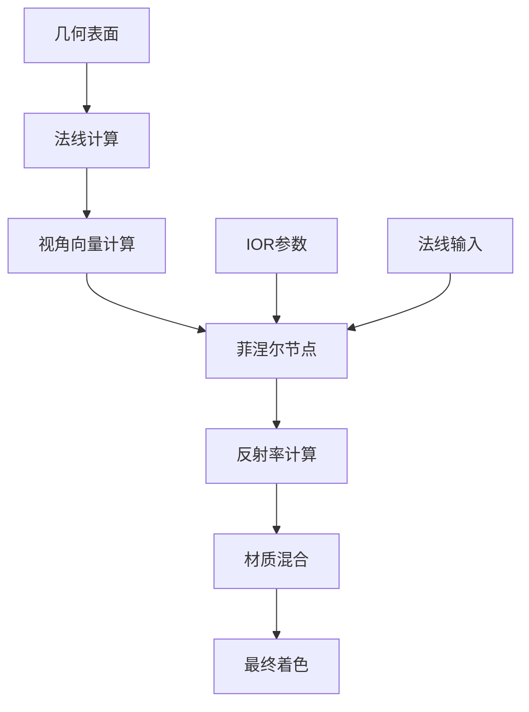
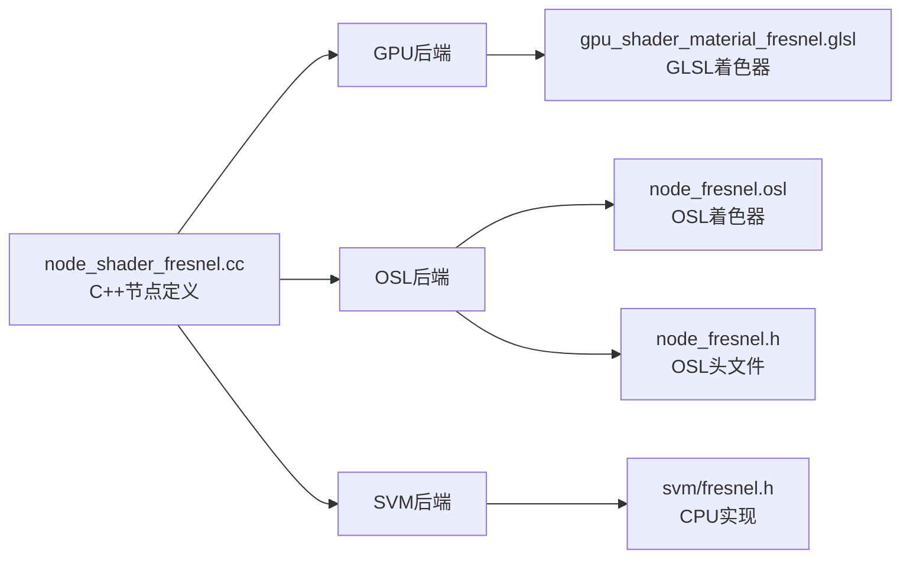
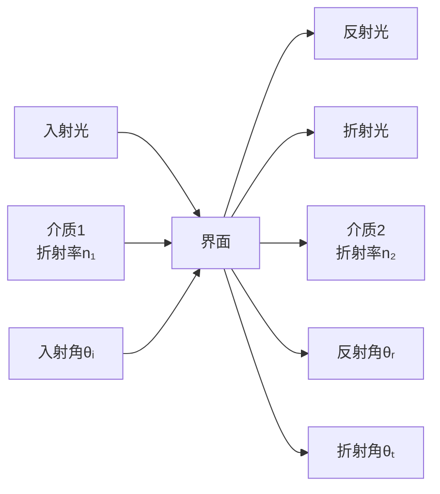
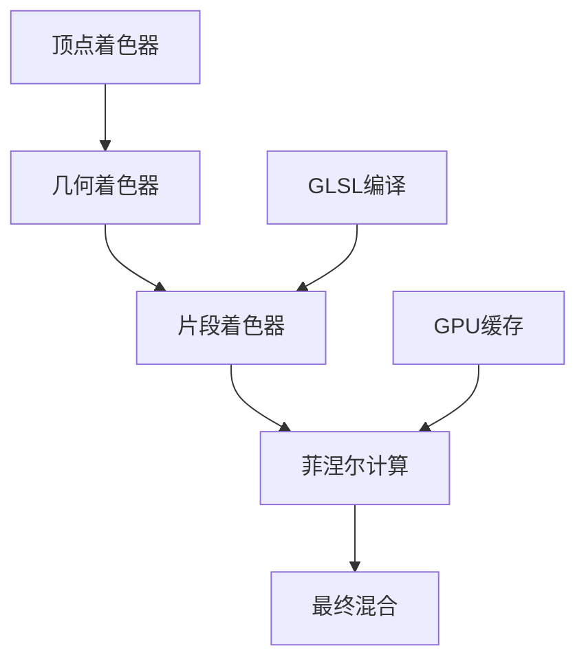
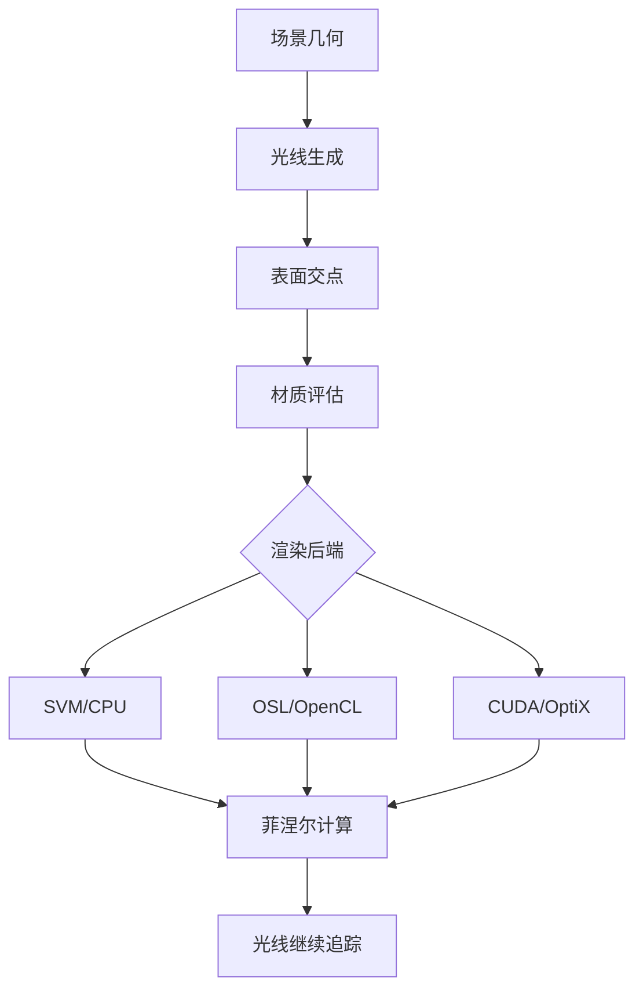
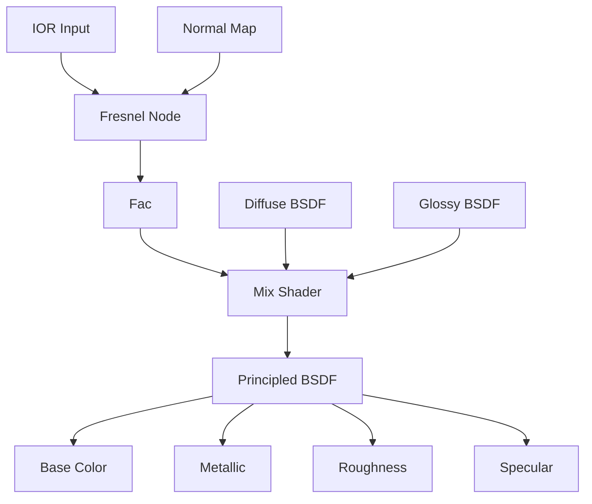

# 14. 菲涅尔节点详解

## 目录
- [14.1 概述](#141-概述)
- [14.2 节点接口与输出](#142-节点接口与输出)
- [14.3 菲涅尔效应的物理原理](#143-菲涅尔效应的物理原理)
- [14.4 数学公式与实现](#144-数学公式与实现)
- [14.5 核心源码分析](#145-核心源码分析)
- [14.6 多渲染引擎实现对比](#146-多渲染引擎实现对比)
- [14.7 光线追踪中的应用](#147-光线追踪中的应用)
- [14.8 性能优化与注意事项](#148-性能优化与注意事项)

---

## 14.1 概述

<span style="background-color:#e3f2fd; color:#1565c0;">菲涅尔节点（Fresnel Node）</span>是Blender材质系统中实现真实光学效果的关键组件。它基于菲涅尔方程，计算光线在不同材质界面上的反射和折射比例，模拟现实世界中物体表面的光学特性。

### 14.1.1 节点功能概述

菲涅尔节点主要负责：
- 根据<span style="color:#d32f2f;">入射角</span>和<span style="color:#388e3c;">折射率(IOR)</span>计算反射率
- 模拟<span style="color:#f57c00;">掠射角增强反射</span>的物理现象
- 为材质提供<span style="color:#7b1fa2;">基于视角的混合因子</span>

### 14.1.2 在渲染管线中的位置



### 14.1.3 文件架构分析

菲涅尔节点的实现分为四个关键文件，每个文件负责不同的渲染后端：



---

## 14.2 节点接口与输出

### 14.2.1 输入接口详解

#### 14.2.1.1 IOR（折射率）

**定义位置**: `source/blender/nodes/shader/nodes/node_shader_fresnel.cc:11`

```cpp
b.add_input<decl::Float>("IOR").default_value(1.5f).min(0.0f).max(1000.0f);
```

- **物理含义**: 材质的折射率，定义光在不同介质间传播时的速度比
- **常见材质值**:
  - 空气: 1.0
  - 水: 1.33
  - 玻璃: 1.5
  - 钻石: 2.42
- **数值范围**: 0.0 - 1000.0，实际使用时通常在1.0-3.0之间

#### 14.2.1.2 Normal（法线）

**定义位置**: `source/blender/nodes/shader/nodes/node_shader_fresnel.cc:12`

```cpp
b.add_input<decl::Vector>("Normal").hide_value();
```

- **作用**: 指定表面法线方向，用于计算入射角
- **默认值**: 自动使用几何体的原始法线
- **高级用法**: 可以连接法线贴图或凹凸贴图来影响菲涅尔效果

### 14.2.2 输出接口详解

#### 14.2.2.1 Factor（混合因子）

**定义位置**: `source/blender/nodes/shader/nodes/node_shader_fresnel.cc:13`

```cpp
b.add_output<decl::Float>("Factor", "Fac");
```

- **输出范围**: 0.0 - 1.0
- **物理意义**: 反射率比例
  - 0.0: 完全透射（无反射）
  - 1.0: 完全反射（全内反射）
- **典型应用**: 
  - 混合漫反射和高光反射
  - 创建边缘发光效果
  - 模拟水面反射

---

## 14.3 菲涅尔效应的物理原理

### 14.3.1 历史背景

菲涅尔效应以法国物理学家<span style="color:#1976d2;">奥古斯丁-让·菲涅尔</span>（Augustin-Jean Fresnel, 1788-1827）命名。他在19世纪初研究了光在界面上的行为，建立了描述光波传播和干涉的完整理论。

### 14.3.2 光学基础

#### 14.3.2.1 电磁波理论

光本质上是电磁波，当遇到不同介质的界面时，会产生：



#### 14.3.2.2 斯涅尔定律

光线折射遵循斯涅尔定律：
$$ n_1 \sin\theta_1 = n_2 \sin\theta_2 $$

其中：
- $n_1, n_2$ 分别为两种介质的折射率
- $\theta_1, \theta_2$ 分别为入射角和折射角

### 14.3.3 菲涅尔方程

菲涅尔方程精确描述了电磁波在界面上的反射和折射行为：

#### 14.3.3.1 S偏振分量

$$ r_s = \frac{n_1\cos\theta_i - n_2\cos\theta_t}{n_1\cos\theta_i + n_2\cos\theta_t} $$

#### 14.3.3.2 P偏振分量

$$ r_p = \frac{n_2\cos\theta_i - n_1\cos\theta_t}{n_2\cos\theta_i + n_1\cos\theta_t} $$

#### 14.3.3.3 反射率

对于非偏振光，总反射率为：
$$ R = \frac{1}{2}(r_s^2 + r_p^2) $$

---

## 14.4 数学公式与实现

### 14.4.1 精确计算公式

Blender使用了避免显式计算折射方向的优化算法：

**定义位置**: `source/blender/gpu/shaders/material/gpu_shader_material_fresnel.glsl:5-24`

```glsl
float fresnel_dielectric_cos(float cosi, float eta)
{
  /* compute fresnel reflectance without explicitly computing
   * the refracted direction */
  float c = abs(cosi);
  float g = eta * eta - 1.0f + c * c;
  float result;

  if (g > 0.0f) {
    g = sqrt(g);
    float A = (g - c) / (g + c);
    float B = (c * (g + c) - 1.0f) / (c * (g - c) + 1.0f);
    result = 0.5f * A * A * (1.0f + B * B);
  }
  else {
    result = 1.0f; /* TIR (no refracted component) */
  }

  return result;
}
```

这个算法基于以下数学推导：

1. 定义辅助变量：
   - $c = |\cos\theta_i|$ - 入射角余弦的绝对值
   - $g = \sqrt{\eta^2 - 1 + c^2}$ - 中间计算变量

2. 计算反射系数：
   - $A = \frac{g - c}{g + c}$
   - $B = \frac{c(g + c) - 1}{c(g - c) + 1}$

3. 最终反射率：
   - $R = \frac{1}{2}A^2(1 + B^2)$

### 14.4.2 Schlick近似

虽然Blender主要使用精确计算，但Schlick近似在实时渲染中广泛使用：

$$ R(\theta) \approx R_0 + (1 - R_0)(1 - \cos\theta)^5 $$

其中：
- $R_0 = \left(\frac{n_1 - n_2}{n_1 + n_2}\right)^2$ - 法线入射时的反射率

### 14.4.3 全内反射

当光线从高折射率介质射向低折射率介质时，如果入射角大于临界角，会发生全内反射：

临界角公式：
$$ \theta_c = \arcsin\left(\frac{n_2}{n_1}\right) $$

**实现位置**: `intern/cycles/kernel/closure/bsdf_util.h:116-124`

```cpp
float g = eta * eta - 1 + c * c;
if (g > 0) {
  // 正常菲涅尔计算
  g = sqrtf(g);
  const float A = (g - c) / (g + c);
  const float B = (c * (g + c) - 1) / (c * (g - c) + 1);
  return 0.5f * A * A * (1 + B * B);
}
return 1.0f;  // TIR (total internal reflection)
```

---

## 14.5 核心源码分析

### 14.5.1 C++节点定义

**文件**: `source/blender/nodes/shader/nodes/node_shader_fresnel.cc`

#### 14.5.1.1 节点声明

```cpp
static void node_declare(NodeDeclarationBuilder &b)
{
  b.add_input<decl::Float>("IOR").default_value(1.5f).min(0.0f).max(1000.0f);
  b.add_input<decl::Vector>("Normal").hide_value();
  b.add_output<decl::Float>("Factor", "Fac");
}
```

**代码分析**：
- `NodeDeclarationBuilder` 用于构建节点的输入输出接口
- `decl::Float` 和 `decl::Vector` 定义数据类型
- `hide_value()` 隐藏法线输入的可视化显示
- `default_value(1.5f)` 设置默认IOR值（典型玻璃值）

#### 14.5.1.2 GPU链接函数

```cpp
static int node_shader_gpu_fresnel(GPUMaterial *mat,
                                   bNode *node,
                                   bNodeExecData * /*execdata*/,
                                   GPUNodeStack *in,
                                   GPUNodeStack *out)
{
  if (!in[1].link) {
    GPU_link(mat, "world_normals_get", &in[1].link);
  }

  return GPU_stack_link(mat, node, "node_fresnel", in, out);
}
```

**功能解析**：
- 检查法线输入是否连接，未连接时使用世界法线
- `GPU_stack_link` 将节点与GPU着色器程序连接
- `node_fresnel` 是GLSL中对应的函数名

#### 14.5.1.3 节点注册

```cpp
void register_node_type_sh_fresnel()
{
  namespace file_ns = blender::nodes::node_shader_fresnel_cc;

  static blender::bke::bNodeType ntype;

  sh_node_type_base(&ntype, "ShaderNodeFresnel", SH_NODE_FRESNEL);
  ntype.ui_name = "Fresnel";
  ntype.ui_description =
      "Produce a blending factor depending on the angle between the surface normal and the view "
      "direction using Fresnel equations.\nTypically used for mixing reflections at grazing "
      "angles";
  ntype.enum_name_legacy = "FRESNEL";
  ntype.nclass = NODE_CLASS_INPUT;
  ntype.declare = file_ns::node_declare;
  ntype.gpu_fn = file_ns::node_shader_gpu_fresnel;
  ntype.materialx_fn = file_ns::node_shader_materialx;

  blender::bke::node_register_type(ntype);
}
```

**注册过程**：
1. 创建节点类型结构体
2. 设置基础信息（名称、描述、类型等）
3. 关联函数指针（声明、GPU、MaterialX等）
4. 注册到Blender的节点系统

### 14.5.2 GLSL着色器实现

**文件**: `source/blender/gpu/shaders/material/gpu_shader_material_fresnel.glsl`

#### 14.5.2.1 主函数实现

```glsl
void node_fresnel(float ior, float3 N, out float result)
{
  N = normalize(N);
  float3 V = coordinate_incoming(g_data.P);

  float eta = max(ior, 0.00001f);
  result = fresnel_dielectric(V, N, (FrontFacing) ? eta : 1.0f / eta);
}
```

**逐行解析**：

1. **法线归一化**：`N = normalize(N);`
   - 确保法线向量长度为1，避免计算错误

2. **视角向量获取**：`float3 V = coordinate_incoming(g_data.P);`
   - `coordinate_incoming` 函数获取从着色点指向相机的向量
   - `g_data.P` 是当前着色点的世界坐标位置

3. **折射率处理**：
   ```glsl
   float eta = max(ior, 0.00001f);
   result = fresnel_dielectric(V, N, (FrontFacing) ? eta : 1.0f / eta);
   ```
   - 防止除零错误，设置最小值
   - `FrontFacing` 判断光线是否从正面入射
   - 背面入射时使用折射率的倒数

#### 14.5.2.2 物理模型解释

当光线从介质1射向介质2时：
- 正面入射：$\eta = \frac{n_2}{n_1}$
- 背面入射：$\eta = \frac{n_1}{n_2} = \frac{1}{\eta_{正面}}$

这种处理确保了物理正确性，无论光线从哪一侧入射。

### 14.5.3 OSL着色器实现

**文件**: `intern/cycles/kernel/osl/shaders/node_fresnel.osl`

#### 14.5.3.1 OSL主函数

```osl
shader node_fresnel(float IOR = 1.45, normal Normal = N, output float Fac = 0.0)
{
  float f = max(IOR, 1e-5);
  float eta = backfacing() ? 1.0 / f : f;
  float cosi = dot(I, Normal);
  Fac = fresnel_dielectric_cos(cosi, eta);
}
```

**关键差异**：

1. **默认IOR值**：1.45（比C++的1.5更精确）
2. **背向判断**：使用 `backfacing()` 函数
3. **入射向量**：直接使用全局变量 `I`
4. **最小值**：`1e-5`（比GLSL更严格）

#### 14.5.3.2 OSL头文件

**文件**: `intern/cycles/kernel/osl/shaders/node_fresnel.h`

该文件定义了OSL使用的核心菲涅尔函数，与GPU版本保持一致的算法。

### 14.5.4 SVM CPU实现

**文件**: `intern/cycles/kernel/svm/fresnel.h`

#### 14.5.4.1 SVM节点处理

```cpp
ccl_device_noinline void svm_node_fresnel(ccl_private ShaderData *sd,
                                          ccl_private float *stack,
                                          const uint ior_offset,
                                          const uint ior_value,
                                          const uint node)
{
  uint normal_offset;
  uint out_offset;
  svm_unpack_node_uchar2(node, &normal_offset, &out_offset);
  float eta = (stack_valid(ior_offset)) ? stack_load_float(stack, ior_offset) :
                                          __uint_as_float(ior_value);
  const float3 normal_in = stack_valid(normal_offset) ? stack_load_float3(stack, normal_offset) :
                                                        sd->N;

  eta = fmaxf(eta, 1e-5f);
  eta = (sd->flag & SD_BACKFACING) ? 1.0f / eta : eta;

  const float f = fresnel_dielectric_cos(dot(sd->wi, normal_in), eta);

  stack_store_float(stack, out_offset, f);
}
```

**实现特点**：

1. **栈操作**：使用虚拟栈进行参数传递
2. **条件加载**：支持常量和变量参数
3. **背向标志**：使用 `SD_BACKFACING` 位标志
4. **入射向量**：`sd->wi` 是预计算的入射光线方向

---

## 14.6 多渲染引擎实现对比

### 14.6.1 Eevee引擎实现

<span style="background-color:#e8f5e8; color:#2e7d32;">Eevee（GPU实时渲染）</span>使用GLSL实现：



**特点**：
- 优化的实时性能
- 简化的物理计算
- GPU并行处理

### 14.6.2 Cycles引擎实现

<span style="background-color:#fff3e0; color:#e65100;">Cycles（光线追踪）</span>使用多后端：



**特点**：
- 精确的物理模拟
- 多种计算后端
- 高质量渲染结果

### 14.6.3 实现差异对比

| 特性 | Eevee (GLSL) | Cycles (SVM) | Cycles (OSL) |
|------|--------------|--------------|--------------|
| **精度** | float32 | float32 | float32 |
| **最小IOR** | 0.00001 | 0.00001 | 0.00001 |
| **默认IOR** | 1.5 | 1.5 | 1.45 |
| **背向判断** | FrontFacing | SD_BACKFACING | backfacing() |
| **入射向量** | coordinate_incoming | sd->wi | I |
| **性能** | ⭐⭐⭐⭐⭐ | ⭐⭐⭐ | ⭐⭐⭐ |

---

## 14.7 光线追踪中的应用

### 14.7.1 材质系统集成

菲涅尔节点在材质网络中的典型应用：



### 14.7.2 实际效果展示

#### 14.7.2.1 水面效果

- **IOR**: 1.33
- **法线**: 连接波浪法线贴图
- **应用**: 混合反射和折射

#### 14.7.2.2 玻璃效果

- **IOR**: 1.5
- **法线**: 几何法线或法线贴图
- **应用**: 控制边缘反射强度

#### 14.7.2.3 皮肤效果

- **IOR**: 1.4 (次表面散射)
- **法线**: 皮肤法线贴图
- **应用**: 创建自然的边缘高光

### 14.7.3 高级应用技巧

#### 14.7.3.1 视角相关混合

```glsl
// 使用菲涅尔控制不同材质的混合
float fresnel_factor = node_fresnel(ior, normal);
color final_color = mix(
    diffuse_color,      // 漫反射
    glossy_color,       // 高光反射
    fresnel_factor      // 混合因子
);
```

#### 14.7.3.2 分层材质

```glsl
// 多层材质的菲涅尔控制
float fresnel_layer1 = node_fresnel(ior1, normal);
float fresnel_layer2 = node_fresnel(ior2, normal);

color layer1 = mix(base1, specular1, fresnel_layer1);
color layer2 = mix(base2, specular2, fresnel_layer2);
```

---

## 14.8 性能优化与注意事项

### 14.8.1 数值稳定性

#### 14.8.1.1 除零保护

所有实现都包含最小值保护：

```cpp
float eta = max(ior, 0.00001f);  // GLSL版本
float f = max(IOR, 1e-5);         // OSL版本
eta = fmaxf(eta, 1e-5f);          // SVM版本
```

#### 14.8.1.2 法线归一化

```cpp
N = normalize(N);  // 确保法线长度为1
```

### 14.8.2 计算优化

#### 14.8.2.1 避免平方根计算

Blender的实现避免了显式计算折射方向，减少了计算开销：

```cpp
// 传统方法需要计算折射方向
float3 refracted_dir = refract(incident, normal, eta);

// 优化方法直接使用余弦值
float result = fresnel_dielectric_cos(dot(incident, normal), eta);
```

#### 14.8.2.2 分支优化

```cpp
if (g > 0.0f) {
  // 正常菲涅尔计算
} else {
  result = 1.0f;  // 全内反射，直接返回
}
```

### 14.8.3 内存与带宽优化

#### 14.8.3.1 栈管理

SVM实现使用高效的栈操作：

```cpp
// 条件加载，避免不必要的内存访问
float eta = (stack_valid(ior_offset)) ? 
    stack_load_float(stack, ior_offset) : 
    __uint_as_float(ior_value);
```

#### 14.8.3.2 缓存友好性

- 相关数据结构紧凑排列
- 减少内存跳跃访问
- 利用GPU缓存局部性

### 14.8.4 使用建议

#### 14.8.4.1 参数设置指南

| 材质类型 | 推荐IOR值 | 说明 |
|----------|-----------|------|
| 空气 | 1.0 | 参考介质 |
| 水 | 1.33 | 透明液体 |
| 冰 | 1.31 | 固态水 |
| 玻璃 | 1.5-1.9 | 根据玻璃类型 |
| 钻石 | 2.42 | 高折射率宝石 |
| 塑料 | 1.46-1.55 | 不同塑料材质 |

#### 14.8.4.2 常见错误避免

1. **过高的IOR值**：
   - 问题：IOR > 10 会导致不自然的视觉效果
   - 解决：保持在合理范围内（1.0-3.0）

2. **错误的法线输入**：
   - 问题：未连接法线导致使用默认值
   - 解决：明确连接法线贴图或几何法线

3. **混合比例不当**：
   - 问题：菲涅尔输出直接作为颜色使用
   - 解决：作为混合因子控制材质过渡

---

## 总结

菲涅尔节点是Blender材质系统中实现真实光学效果的核心组件。通过精确的物理模拟和优化的数学实现，它能够：

✅ **物理准确性**：基于菲涅尔方程的精确计算  
✅ **多平台支持**：GPU、CPU、OSL多种实现  
✅ **性能优化**：避免不必要计算，保证实时性能  
✅ **灵活应用**：广泛的材质效果支持  

理解菲涅尔节点的实现原理和优化技巧，有助于创建更加逼真和高效的材质效果。无论是水面反射、玻璃透明度还是皮肤次表面散射，菲涅尔节点都提供了关键的物理基础。