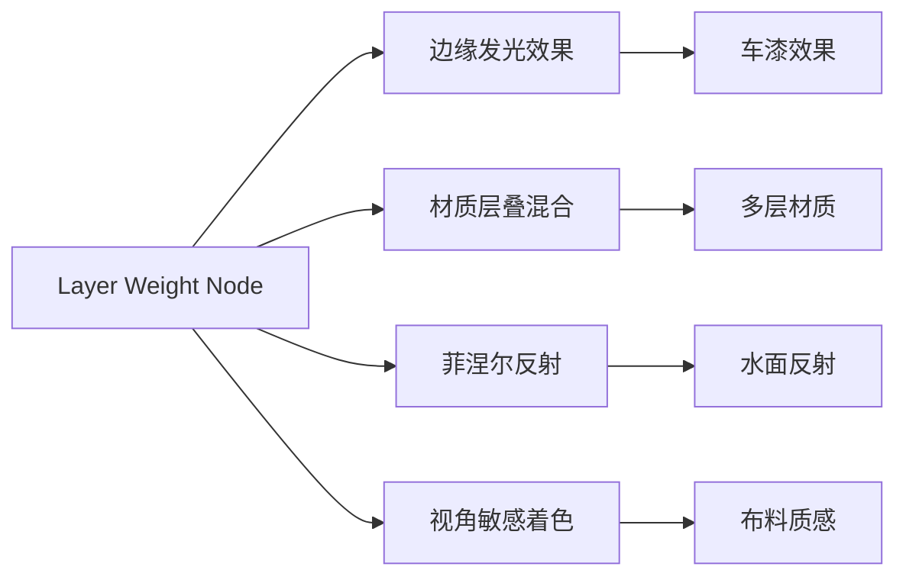
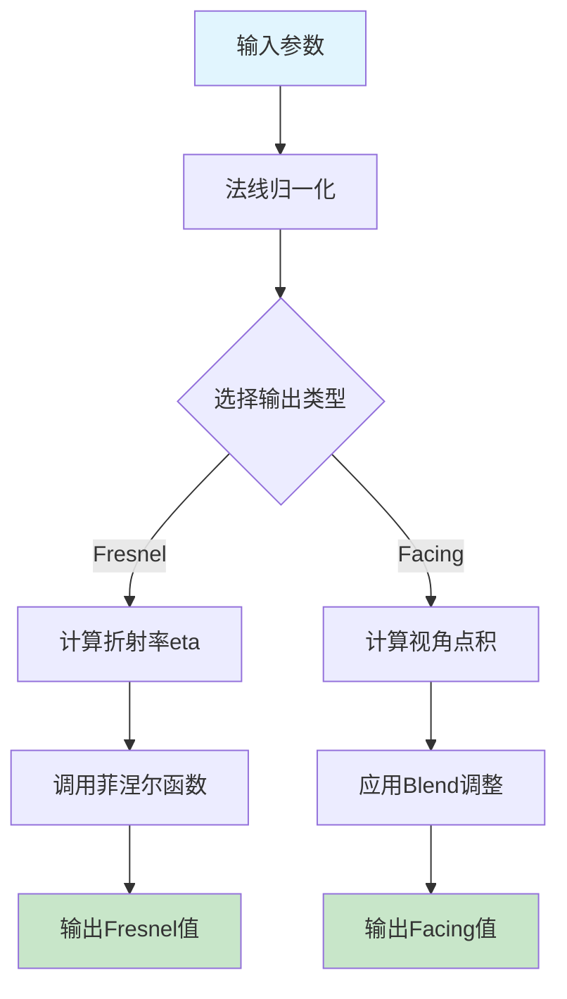
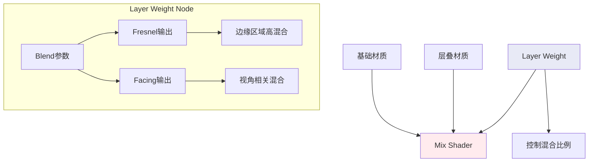
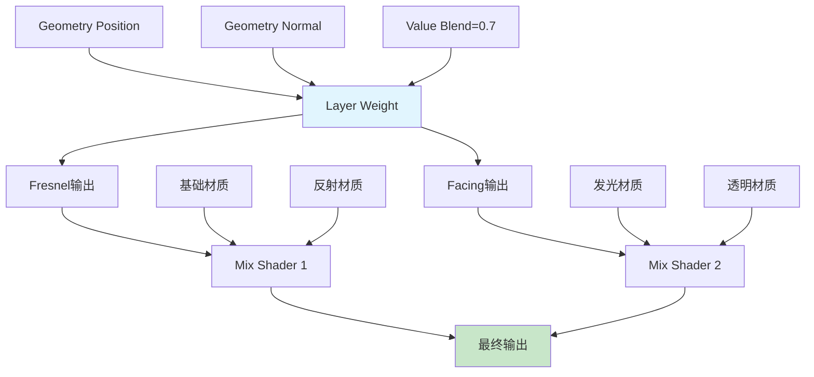

# 15. 图层权重节点详解

## 目录

- [15.1 节点概述](#151-节点概述)
- [15.2 接口定义与参数说明](#152-接口定义与参数说明)
- [15.3 核心算法原理](#153-核心算法原理)
- [15.4 Fresnel 输出详解](#154-fresnel-输出详解)
- [15.5 Facing 输出详解](#155-facing-输出详解)
- [15.6 材质混合应用原理](#156-材质混合应用原理)
- [15.7 代码实现分析](#157-代码实现分析)
- [15.8 性能优化与注意事项](#158-性能优化与注意事项)
- [15.9 实际应用案例](#159-实际应用案例)

---

## 15.1 节点概述

<span style="background-color: #e3f2fd; color: #1976d2; padding: 2px 6px; border-radius: 3px;">图层权重节点</span>（Layer Weight Node）是Blender着色器系统中的一个核心节点，主要用于根据表面法线与视线方向的夹角来生成混合因子。该节点在材质层叠和混合效果中扮演着关键角色，特别适用于创建边缘发光、菲涅尔反射等视觉效果。

### 15.1.1 主要功能

图层权重节点提供两种主要的输出：
- **Fresnel**: 基于菲涅尔效应的反射系数
- **Facing**: 基于视角的面朝向系数

### 15.1.2 应用场景



---

## 15.2 接口定义与参数说明

### 15.2.1 输入接口

| 接口名称 | 数据类型 | 默认值 | 取值范围 | 描述 |
|---------|---------|--------|----------|------|
| Blend | Float | 0.5 | [0.0, 1.0] | 混合因子，控制Fresnel和Facing的强度 |
| Normal | Vector | - | - | 表面法向量，默认使用几何法线 |

### 15.2.2 输出接口

| 接口名称 | 数据类型 | 取值范围 | 描述 |
|---------|---------|----------|------|
| Fresnel | Float | [0.0, 1.0] | 菲涅尔反射系数 |
| Facing | Float | [0.0, 1.0] | 面朝向系数 |

### 15.2.3 接口声明代码

```cpp
// 位置: source/blender/nodes/shader/nodes/node_shader_layer_weight.cc:9-15
static void node_declare(NodeDeclarationBuilder &b)
{
  b.add_input<decl::Float>("Blend").default_value(0.5f).min(0.0f).max(1.0f);
  b.add_input<decl::Vector>("Normal").hide_value();
  b.add_output<decl::Float>("Fresnel");
  b.add_output<decl::Float>("Facing");
}
```

---

## 15.3 核心算法原理

### 15.3.1 菲涅尔效应基础

菲涅尔效应描述了光波在不同介质界面上的反射和透射行为。当光线以不同角度入射到表面时，反射率会发生变化：

$$R = \frac{1}{2} \left( \frac{\cos^2(\theta_i - \theta_t)}{\cos^2(\theta_i + \theta_t)} + \frac{\sin^2(\theta_i + \theta_t)}{\sin^2(\theta_i - \theta_t)} \right)$$

其中 $\theta_i$ 是入射角，$\theta_t$ 是折射角。

### 15.3.2 折射率计算

图层权重节点通过Blend参数来控制有效折射率：

```glsl
// 位置: source/blender/gpu/shaders/material/gpu_shader_material_layer_weight.glsl:12
float eta = max(1.0f - blend, 0.00001f);
```

这个设计使得：
- Blend = 0.0 时，eta = 1.0（无菲涅尔效应）
- Blend = 1.0 时，eta = 0.00001（强菲涅尔效应）

### 15.3.3 节点处理流程



---

## 15.4 Fresnel 输出详解

### 15.4.1 Fresnel计算流程

Fresnel输出基于介电质菲涅尔反射公式，其计算过程如下：

```glsl
// 位置: source/blender/gpu/shaders/material/gpu_shader_material_layer_weight.glsl:11-15
/* fresnel */
float eta = max(1.0f - blend, 0.00001f);
float3 V = coordinate_incoming(g_data.P);

fresnel = fresnel_dielectric(V, N, (FrontFacing) ? 1.0f / eta : eta);
```

### 15.4.2 折射率处理逻辑

<span style="color: #d32f2f; font-weight: bold;">关键点</span>：节点根据表面朝向（FrontFacing）动态调整折射率：

- **正面朝向**：使用 $1/\eta$ 作为折射率
- **背面朝向**：直接使用 $\eta$ 作为折射率

这种处理确保了在几何体内外都能得到正确的菲涅尔效应。

### 15.4.3 Fresnel Dielectric实现

```glsl
// 位置: source/blender/gpu/shaders/material/gpu_shader_material_fresnel.glsl:5-24
float fresnel_dielectric_cos(float cosi, float eta)
{
  /* compute fresnel reflectance without explicitly computing
   * the refracted direction */
  float c = abs(cosi);
  float g = eta * eta - 1.0f + c * c;
  float result;

  if (g > 0.0f) {
    g = sqrt(g);
    float A = (g - c) / (g + c);
    float B = (c * (g + c) - 1.0f) / (c * (g - c) + 1.0f);
    result = 0.5f * A * A * (1.0f + B * B);
  }
  else {
    result = 1.0f; /* TIR (no refracted component) */
  }

  return result;
}
```

### 15.4.4 数值特性分析

| Blend值 | eta值 | Fresnel特性 |
|---------|-------|-------------|
| 0.0 | 1.0 | 无菲涅尔效应，输出恒为0 |
| 0.5 | 0.5 | 中等菲涅尔效应 |
| 1.0 | 0.00001 | 极强菲涅尔效应，边缘接近1 |

---

## 15.5 Facing 输出详解

### 15.5.1 Facing计算基础

Facing输出基于视线与表面法线的夹角余弦值：

```glsl
// 位置: source/blender/gpu/shaders/material/gpu_shader_material_layer_weight.glsl:18
facing = abs(dot(V, N));
```

### 15.5.2 Blend参数的复杂映射

Facing输出使用了非线性的Blend参数映射：

```glsl
// 位置: source/blender/gpu/shaders/material/gpu_shader_material_layer_weight.glsl:19-23
if (blend != 0.5f) {
  blend = clamp(blend, 0.0f, 0.99999f);
  blend = (blend < 0.5f) ? 2.0f * blend : 0.5f / (1.0f - blend);
  facing = pow(facing, blend);
}
facing = 1.0f - facing;
```

### 15.5.3 Blend映射函数分析

映射函数分为两个区间：

**区间1 (0 ≤ blend < 0.5)：**
$$f(blend) = 2 \times blend$$

**区间2 (0.5 ≤ blend ≤ 1.0)：**
$$f(blend) = \frac{0.5}{1 - blend}$$

### 15.5.4 映射效果可视化

```mermaid
graph LR
    A[Blend输入] --> B{blend < 0.5?}
    B -->|是| C[blend = 2 * blend]
    B -->|否| D[blend = 0.5 / (1 - blend)]
    C --> E[facing = pow(dot(V,N), blend)]
    D --> E
    E --> F[facing = 1 - facing]
    
    style A fill:#fff3e0
    style F fill:#e8f5e8
```

### 15.5.5 数值特性表

| Blend值 | 映射后值 | Facing特性 |
|---------|----------|------------|
| 0.0 | 0.0 | 恒为0，无视角变化 |
| 0.25 | 0.5 | 平滑过渡 |
| 0.5 | 1.0 | 线性cos关系 |
| 0.75 | 2.0 | 边缘增强 |
| 0.9 | 5.0 | 强边缘对比 |

---

## 15.6 材质混合应用原理

### 15.6.1 层叠材质架构

图层权重节点通常与Mix Shader节点配合使用，实现多层材质的智能混合：



### 15.6.2 典型应用模式

#### 模式1：边缘发光效果
<span style="background-color: #fce4ec; color: #c2185b;">使用Fresnel输出</span>控制边缘发光强度

#### 模式2：视角敏感着色
<span style="background-color: #f3e5f5; color: #7b1fa2;">使用Facing输出</span>实现类似绒布的视角变化效果

#### 模式3：复合混合
<span style="background-color: #e8f5e8; color: #388e3c;">组合使用</span>两种输出创造复杂的材质层次

### 15.6.3 混合因子计算

最终的混合因子可以通过多种方式计算：

```glsl
// 基础混合
float mix_factor = fresnel;

// 加权混合
float mix_factor = alpha * fresnel + (1.0 - alpha) * facing;

// 非线性混合
float mix_factor = pow(fresnel, gamma) * facing;
```

---

## 15.7 代码实现分析

### 15.7.1 C++接口实现

#### 节点注册代码
```cpp
// 位置: source/blender/nodes/shader/nodes/node_shader_layer_weight.cc:43-61
void register_node_type_sh_layer_weight()
{
  namespace file_ns = blender::nodes::node_shader_layer_weight_cc;

  static blender::bke::bNodeType ntype;

  sh_node_type_base(&ntype, "ShaderNodeLayerWeight", SH_NODE_LAYER_WEIGHT);
  ntype.ui_name = "Layer Weight";
  ntype.ui_description =
      "Produce a blending factor depending on the angle between the surface normal and the view "
      "direction.\nTypically used for layering shaders with the Mix Shader node";
  ntype.enum_name_legacy = "LAYER_WEIGHT";
  ntype.nclass = NODE_CLASS_INPUT;
  ntype.declare = file_ns::node_declare;
  ntype.gpu_fn = file_ns::node_shader_gpu_layer_weight;
  ntype.materialx_fn = file_ns::node_shader_materialx;

  blender::bke::node_register_type(ntype);
}
```

#### GPU处理函数
```cpp
// 位置: source/blender/nodes/shader/nodes/node_shader_layer_weight.cc:17-28
static int node_shader_gpu_layer_weight(GPUMaterial *mat,
                                        bNode *node,
                                        bNodeExecData * /*execdata*/,
                                        GPUNodeStack *in,
                                        GPUNodeStack *out)
{
  if (!in[1].link) {
    GPU_link(mat, "world_normals_get", &in[1].link);
  }

  return GPU_stack_link(mat, node, "node_layer_weight", in, out);
}
```

### 15.7.2 GLSL着色器实现

#### 主函数实现
```glsl
// 位置: source/blender/gpu/shaders/material/gpu_shader_material_layer_weight.glsl:7-25
void node_layer_weight(float blend, float3 N, out float fresnel, out float facing)
{
  N = normalize(N);

  /* fresnel */
  float eta = max(1.0f - blend, 0.00001f);
  float3 V = coordinate_incoming(g_data.P);

  fresnel = fresnel_dielectric(V, N, (FrontFacing) ? 1.0f / eta : eta);

  /* facing */
  facing = abs(dot(V, N));
  if (blend != 0.5f) {
    blend = clamp(blend, 0.0f, 0.99999f);
    blend = (blend < 0.5f) ? 2.0f * blend : 0.5f / (1.0f - blend);
    facing = pow(facing, blend);
  }
  facing = 1.0f - facing;
}
```

### 15.7.3 OSL着色器实现

```osl
// 位置: intern/cycles/kernel/osl/shaders/node_layer_weight.osl:8-32
shader node_layer_weight(float Blend = 0.5,
                         normal Normal = N,
                         output float Fresnel = 0.0,
                         output float Facing = 0.0)
{
  float blend = Blend;
  float cosi = dot(I, Normal);

  /* Fresnel */
  float eta = max(1.0 - Blend, 1e-5);
  eta = backfacing() ? eta : 1.0 / eta;
  Fresnel = fresnel_dielectric_cos(cosi, eta);

  /* Facing */
  Facing = fabs(cosi);

  if (blend != 0.5) {
    blend = clamp(blend, 0.0, 1.0 - 1e-5);
    blend = (blend < 0.5) ? 2.0 * blend : 0.5 / (1.0 - blend);

    Facing = pow(Facing, blend);
  }

  Facing = 1.0 - Facing;
}
```

### 15.7.4 实现差异分析

| 实现方式 | 视线获取 | 法线处理 | 特殊处理 |
|---------|----------|----------|----------|
| GLSL | `coordinate_incoming(g_data.P)` | `normalize(N)` | FrontFacing检查 |
| OSL | `I`（内置入射向量） | 直接使用 | backfacing()函数 |

---

## 15.8 性能优化与注意事项

### 15.8.1 计算复杂度分析

| 操作 | 时间复杂度 | 优化建议 |
|------|------------|----------|
| 法线归一化 | O(1) | 预计算法线 |
| 菲涅尔计算 | O(1) | 使用查找表 |
| 幂运算 | O(1) | 考虑近似算法 |

### 15.8.2 数值稳定性

```glsl
// 防止除零错误的保护措施
float eta = max(1.0f - blend, 0.00001f);
blend = clamp(blend, 0.0f, 0.99999f);
```

### 15.8.3 最佳实践

1. **Blend参数调优**：从0.5开始，根据效果微调
2. **法线输入**：确保法线向量已正确归一化
3. **混合策略**：根据材质特性选择合适的输出
4. **性能考虑**：在复杂材质中谨慎使用

---

## 15.9 实际应用案例

### 15.9.1 汽车漆材质

```glsl
// 模拟汽车漆的边缘高光
float edge_fresnel = fresnel_output;
float base_color = car_base_color.rgb;
float metallic_flake = edge_fresnel * metallic_intensity;

final_color = mix(base_color, base_color + metallic_flake, edge_fresnel);
```

### 15.9.2 绒布材质

```glsl
// 绒布的视角敏感着色
float fabric_factor = facing_output;
float base_fabric = fabric_base.rgb;
float shear_highlight = fabric_factor * shear_color.rgb;

result = mix(base_fabric, shear_highlight, fabric_factor * 0.3);
```

### 15.9.3 水面材质

```glsl
// 水面的菲涅尔反射
float water_fresnel = fresnel_output;
float3 reflection = scene_reflection.rgb;
float3 refraction = underwater_color.rgb;

result = mix(refraction, reflection, water_fresnel);
```

### 15.9.4 完整材质节点图示例



---

## 总结

图层权重节点是Blender材质系统中实现视角相关效果的重要工具。通过精确控制Blend参数，艺术家可以创造出从微妙的视角变化到强烈的边缘高光等各种效果。理解其背后的物理原理和数学实现，有助于更好地运用这个节点来提升材质的真实感和艺术表现力。

<span style="background-color: #f0f4c3; color: #827717;">关键要点</span>：
1. Fresnel输出基于真实的菲涅尔物理原理
2. Facing输出使用非线性Blend映射实现灵活控制
3. 两种输出可以独立或组合使用
4. 适用于边缘发光、视角着色、材质层叠等多种场景