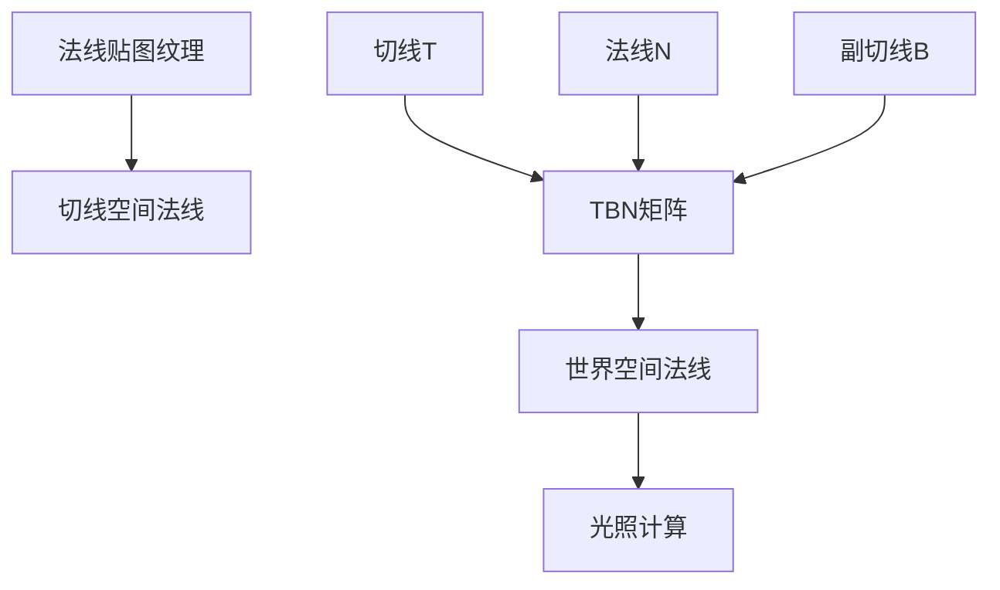
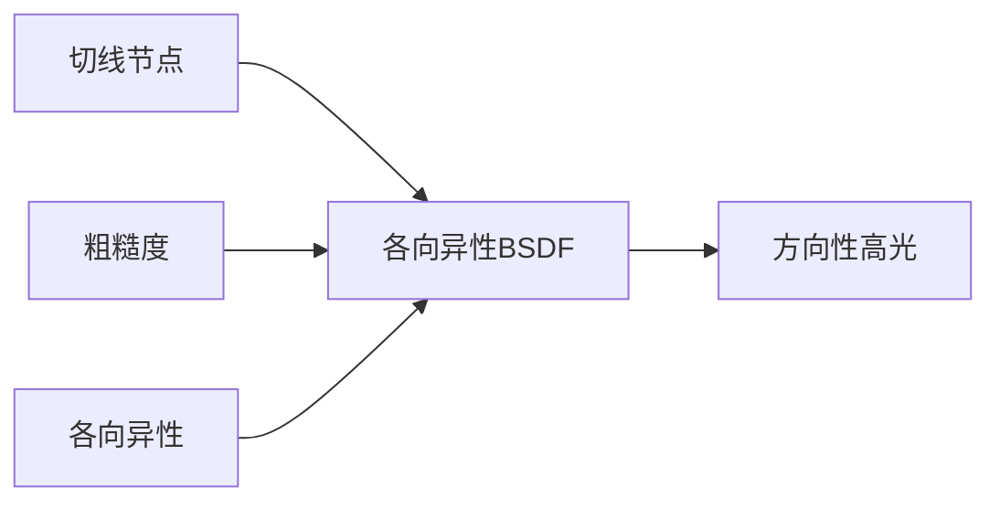
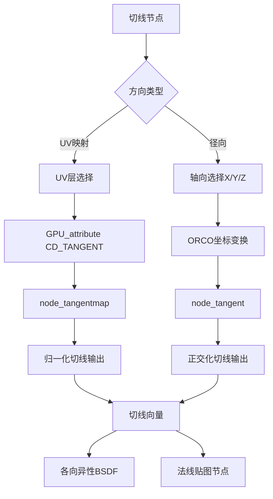

# 16. 切线节点详解

## 目录
- [1. 概述](#1-概述)
- [2. 核心组件分析](#2-核心组件分析)
  - [2.1. NodeShaderTangent结构体](#21-nodeshadershader结构体)
  - [2.2. 切线节点类型定义](#22-切线节点类型定义)
  - [2.3. 方向类型枚举](#23-方向类型枚举)
- [3. 核心函数解析](#3-核心函数解析)
  - [3.1. node_declare函数](#31-node_declare函数)
  - [3.2. node_shader_buts_tangent函数](#32-node_shader_buts_tangent函数)
  - [3.3. node_shader_init_tangent函数](#33-node_shader_init_tangent函数)
  - [3.4. node_shader_gpu_tangent函数](#34-node_shader_gpu_tangent函数)
- [4. GLSL着色器实现](#4-glsl着色器实现)
  - [4.1. ORCO坐标系变换函数](#41-orco坐标系变换函数)
  - [4.2. UV映射切线函数](#42-uv映射切线函数)
  - [4.3. 主切线计算函数](#43-主切线计算函数)
- [5. OSL着色器实现](#5-osl着色器实现)
  - [5.1. OSL主函数分析](#51-osl主函数分析)
  - [5.2. 方向类型处理](#52-方向类型处理)
- [6. 切线空间数学原理](#6-切线空间数学原理)
  - [6.1. 切线空间定义](#61-切线空间定义)
  - [6.2. TBN矩阵构建](#62-tbn矩阵构建)
  - [6.3. 坐标系变换](#63-坐标系变换)
- [7. 应用场景](#7-应用场景)
  - [7.1. 法线贴图](#71-法线贴图)
  - [7.2. 各向异性材质](#72-各向异性材质)
- [8. 节点架构流程图](#8-节点架构流程图)

## 1. 概述

<span style="background-color: #e8f4fd;">切线节点（Tangent Node）</span>是Blender着色器系统中的核心输入节点，用于生成表面切线方向向量。切线在计算机图形学中至关重要，特别是在<span style="color: #2196F3;">**法线贴图**</span>和<span style="color: #FF9800;">**各向异性材质**</span>中。

切线节点的主要功能包括：
- 生成基于UV映射的切线方向
- 计算基于对象空间坐标系的径向切线
- 为各向异性BSDF提供方向信息
- 支持X、Y、Z三个轴向的径向切线生成

## 2. 核心组件分析

### 2.1. NodeShaderTangent结构体

**定义位置**: `source/blender/makesdna/DNA_node_types.h:1047-1051`

```cpp
typedef struct NodeShaderTangent {
  int direction_type;    // 方向类型：径向或UV映射
  int axis;             // 径向轴向：X、Y或Z
  char uv_map[64];      // UV映射层名称
} NodeShaderTangent;
```

**字段说明**:
- `direction_type`: 使用枚举值`SHD_TANGENT_RADIAL(0)`或`SHD_TANGENT_UVMAP(1)`
- `axis`: 径向模式下的轴向选择`SHD_TANGENT_AXIS_X/Y/Z`
- `uv_map`: UV层的名称，最大64字符

### 2.2. 切线节点类型定义

**定义位置**: `source/blender/nodes/shader/nodes/node_shader_tangent.cc:98-119`

```cpp
void register_node_type_sh_tangent()
{
  namespace file_ns = blender::nodes::node_shader_tangent_cc;
  static blender::bke::bNodeType ntype;
  
  sh_node_type_base(&ntype, "ShaderNodeTangent", SH_NODE_TANGENT);
  ntype.ui_name = "Tangent";
  ntype.ui_description = "Generate a tangent direction for the Anisotropic BSDF";
  ntype.enum_name_legacy = "TANGENT";
  ntype.nclass = NODE_CLASS_INPUT;
  // ... 函数指针赋值
}
```

### 2.3. 方向类型枚举

**定义位置**: `source/blender/makesdna/DNA_node_types.h:1042-1046`

```cpp
// 方向类型枚举
SHD_TANGENT_RADIAL = 0,  // 径向切线
SHD_TANGENT_UVMAP = 1,   // UV映射切线

// 轴向枚举
SHD_TANGENT_AXIS_X = 0,
SHD_TANGENT_AXIS_Y = 1,
SHD_TANGENT_AXIS_Z = 2,
```

## 3. 核心函数解析

### 3.1. node_declare函数

**定义位置**: `source/blender/nodes/shader/nodes/node_shader_tangent.cc:19-22`

```cpp
static void node_declare(NodeDeclarationBuilder &b)
{
  b.add_output<decl::Vector>("Tangent");
}
```

**功能**: 声明切线节点的输出接口，返回一个三维向量类型。

### 3.2. node_shader_buts_tangent函数

**定义位置**: `source/blender/nodes/shader/nodes/node_shader_tangent.cc:24-49`

```cpp
static void node_shader_buts_tangent(ui::Layout &layout, bContext *C, PointerRNA *ptr)
{
  // 显示方向类型选择器
  layout.prop(ptr, "direction_type", ui::ITEM_R_SPLIT_EMPTY_NAME, "", ICON_NONE);
  
  // 如果选择UV映射模式，显示UV层选择器
  if (RNA_enum_get(ptr, "direction_type") == SHD_TANGENT_UVMAP) {
    PointerRNA obptr = CTX_data_pointer_get(C, "active_object");
    Object *object = static_cast<Object *>(obptr.data);
    
    if (object && object->type == OB_MESH) {
      Depsgraph *depsgraph = CTX_data_depsgraph_pointer(C);
      if (depsgraph) {
        Object *object_eval = DEG_get_evaluated(depsgraph, object);
        PointerRNA dataptr = RNA_id_pointer_create(static_cast<ID *>(object_eval->data));
        layout.prop_search(ptr, "uv_map", &dataptr, "uv_layers", "", ICON_GROUP_UVS);
        return;
      }
    }
    layout.prop(ptr, "uv_map", ui::ITEM_R_SPLIT_EMPTY_NAME, "", ICON_GROUP_UVS);
  }
  else {
    // 径向模式显示轴向选择
    layout.prop(ptr, "axis", ui::ITEM_R_SPLIT_EMPTY_NAME | ui::ITEM_R_EXPAND, std::nullopt, ICON_NONE);
  }
}
```

**功能**: 根据选择的方向类型动态显示UI控件：
- **UV映射模式**: 显示UV层选择器
- **径向模式**: 显示轴向选择器(X/Y/Z)

### 3.3. node_shader_init_tangent函数

**定义位置**: `source/blender/nodes/shader/nodes/node_shader_tangent.cc:51-56`

```cpp
static void node_shader_init_tangent(bNodeTree * /*ntree*/, bNode *node)
{
  NodeShaderTangent *attr = MEM_callocN<NodeShaderTangent>("NodeShaderTangent");
  attr->axis = SHD_TANGENT_AXIS_Z;  // 默认Z轴
  node->storage = attr;
}
```

**功能**: 初始化切线节点的默认参数，默认使用Z轴径向切线。

### 3.4. node_shader_gpu_tangent函数

**定义位置**: `source/blender/nodes/shader/nodes/node_shader_tangent.cc:58-84`

```cpp
static int node_shader_gpu_tangent(GPUMaterial *mat,
                                   bNode *node,
                                   bNodeExecData * /*execdata*/,
                                   GPUNodeStack *in,
                                   GPUNodeStack *out)
{
  NodeShaderTangent *attr = static_cast<NodeShaderTangent *>(node->storage);
  
  // UV映射模式：使用预计算的切线属性
  if (attr->direction_type == SHD_TANGENT_UVMAP) {
    return GPU_stack_link(
        mat, node, "node_tangentmap", in, out, 
        GPU_attribute(mat, CD_TANGENT, attr->uv_map));
  }
  
  // 径向模式：使用ORCO坐标计算
  GPUNodeLink *orco = GPU_attribute(mat, CD_ORCO, "");
  
  // 根据轴向选择相应的变换函数
  if (attr->axis == SHD_TANGENT_AXIS_X) {
    GPU_link(mat, "tangent_orco_x", orco, &orco);
  }
  else if (attr->axis == SHD_TANGENT_AXIS_Y) {
    GPU_link(mat, "tangent_orco_y", orco, &orco);
  }
  else {
    GPU_link(mat, "tangent_orco_z", orco, &orco);
  }
  
  return GPU_stack_link(mat, node, "node_tangent", in, out, orco);
}
```

**功能**: GPU着色器代码生成函数，根据节点参数生成相应的GPU着色器链接。

## 4. GLSL着色器实现

### 4.1. ORCO坐标系变换函数

**定义位置**: `source/blender/gpu/shaders/material/gpu_shader_material_tangent.glsl:7-20`

```glsl
// X轴径向切线变换
void tangent_orco_x(float3 orco_in, out float3 orco_out)
{
  orco_out = orco_in.xzy * float3(0.0f, -0.5f, 0.5f) + float3(0.0f, 0.25f, -0.25f);
}

// Y轴径向切线变换
void tangent_orco_y(float3 orco_in, out float3 orco_out)
{
  orco_out = orco_in.zyx * float3(-0.5f, 0.0f, 0.5f) + float3(0.25f, 0.0f, -0.25f);
}

// Z轴径向切线变换
void tangent_orco_z(float3 orco_in, out float3 orco_out)
{
  orco_out = orco_in.yxz * float3(-0.5f, 0.5f, 0.0f) + float3(0.25f, -0.25f, 0.0f);
}
```

**数学原理**: 这些函数实现ORCO(Original Coordinates)坐标到径向切线的变换：

对于Z轴切线：
$$ T_z = orco \cdot M_z + offset_z $$

其中 $M_z = \begin{pmatrix} 0 & -0.5 & 0.5 \\ -0.5 & 0.5 & 0 \\ 0.25 & -0.25 & 0 \end{pmatrix}$

### 4.2. UV映射切线函数

**定义位置**: `source/blender/gpu/shaders/material/gpu_shader_material_tangent.glsl:22-25`

```glsl
void node_tangentmap(float4 attr_tangent, out float3 tangent)
{
  tangent = normalize(attr_tangent.xyz);
}
```

**功能**: 从预计算的切线属性中提取切线向量并归一化。`attr_tangent.w`通常用于存储切线的符号信息。

### 4.3. 主切线计算函数

**定义位置**: `source/blender/gpu/shaders/material/gpu_shader_material_tangent.glsl:27-31`

```glsl
void node_tangent(float3 orco, out float3 T)
{
  direction_transform_object_to_world(orco, T);  // 变换到世界坐标
  T = cross(g_data.N, normalize(cross(T, g_data.N)));  // 正交化
}
```

**功能**: 
1. 将ORCO坐标从对象空间变换到世界空间
2. 使用Gram-Schmidt正交化确保切线与法线垂直

**数学公式**: 
$$ T_{final} = N \times normalize(T \times N) $$

## 5. OSL着色器实现

### 5.1. OSL主函数分析

**定义位置**: `intern/cycles/kernel/osl/shaders/node_tangent.osl:7-33`

```osl
shader node_tangent(string attr_name = "geom:tangent",
                    string direction_type = "radial",
                    string axis = "z",
                    output normal Tangent = normalize(dPdu))
{
  vector T = vector(0.0, 0.0, 0.0);
  
  if (direction_type == "uv_map") {
    getattribute(attr_name, T);
  }
  else if (direction_type == "radial") {
    point generated;
    if (!getattribute("geom:generated", generated))
      generated = P;
    
    if (axis == "x")
      T = vector(0.0, -(generated[2] - 0.5), (generated[1] - 0.5));
    else if (axis == "y")
      T = vector(-(generated[2] - 0.5), 0.0, (generated[0] - 0.5));
    else
      T = vector(-(generated[1] - 0.5), (generated[0] - 0.5), 0.0);
  }
  
  T = transform("object", "world", T);
  Tangent = cross(N, normalize(cross(T, N)));
}
```

### 5.2. 方向类型处理

**UV映射模式**:
```osl
getattribute(attr_name, T);  // 直接从几何属性获取切线
```

**径向模式**:
```osl
// 使用generated坐标(原始模型坐标)
if (!getattribute("geom:generated", generated))
  generated = P;

// Z轴径向切线计算
T = vector(-(generated[1] - 0.5), (generated[0] - 0.5), 0.0);
```

## 6. 切线空间数学原理

### 6.1. 切线空间定义

<span style="background-color: #fff3e0;">切线空间（Tangent Space）</span>是一个局部坐标系，由三个正交基向量组成：

- **T (Tangent)**: 切线向量，沿纹理U方向
- **B (Bitangent)**: 副切线向量，沿纹理V方向  
- **N (Normal)**: 法线向量，垂直于表面

$$ TBN = \begin{pmatrix} T_x & B_x & N_x \\ T_y & B_y & N_y \\ T_z & B_z & N_z \end{pmatrix} $$

### 6.2. TBN矩阵构建

**定义位置**: `source/blender/gpu/shaders/material/gpu_shader_material_tangent.glsl:30`

```glsl
T = cross(g_data.N, normalize(cross(T, g_data.N)));
```

这个操作实现了Gram-Schmidt正交化：

1. 首先计算 $T' = T \times N$
2. 归一化: $T'' = normalize(T')$  
3. 最终切线: $T_{final} = N \times T''$

**LaTeX公式**:
$$ T_{final} = N \times normalize(T \times N) $$

### 6.3. 坐标系变换

**定义位置**: `source/blender/gpu/shaders/material/gpu_shader_material_transform_utils.glsl:19-22`

```glsl
void direction_transform_object_to_world(float3 vin, out float3 vout)
{
  vout = to_float3x3(drw_modelmat()) * vin;
}
```

变换矩阵:
$$ v_{world} = M_{model}^{3x3} \cdot v_{object} $$

## 7. 应用场景

### 7.1. 法线贴图

切线在法线贴图中的应用流程：



**关键公式**:
$$ Normal_{world} = TBN \times Normal_{tangent} $$

### 7.2. 各向异性材质

各向异性材质需要切线方向来定义高光拉伸方向：



**应用示例**:
- 金属拉丝效果
- 头发高光
- 布料纹理

## 8. 节点架构流程图



**数据流分析**:

1. **输入阶段**: 根据用户选择确定计算路径
2. **计算阶段**: 
   - UV映射: 直接使用预计算切线
   - 径向: 通过ORCO坐标计算
3. **输出阶段**: 统一输出标准化的切线向量

**内存布局**:
- `NodeShaderTangent`: 72字节 (4 + 4 + 64)
- GPU输入: `float4`切线属性或`float3`ORCO坐标
- GPU输出: `float3`切线向量

**性能优化**:
- UV映射模式使用预计算数据，性能最优
- 径向模式需要实时计算，但有GPU加速
- 归一化和正交化确保数值稳定性

这个切线节点是Blender着色器系统中实现高级材质效果的关键组件，理解其工作原理对于创建逼真的材质至关重要。