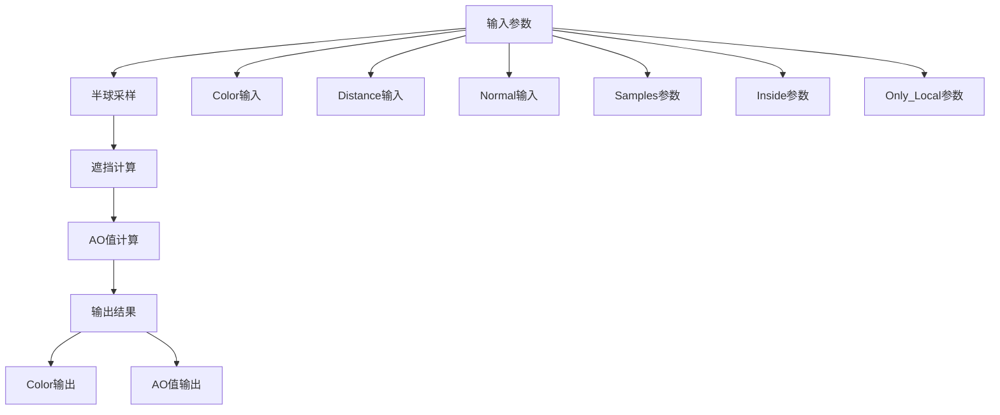
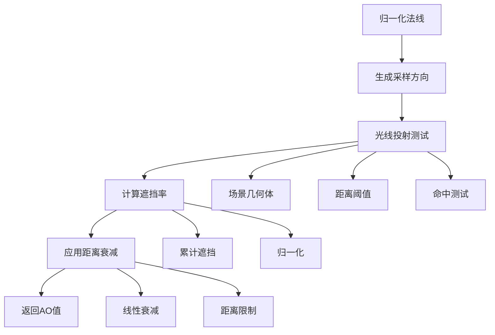
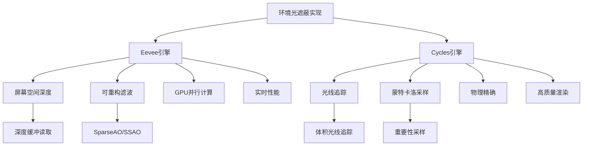
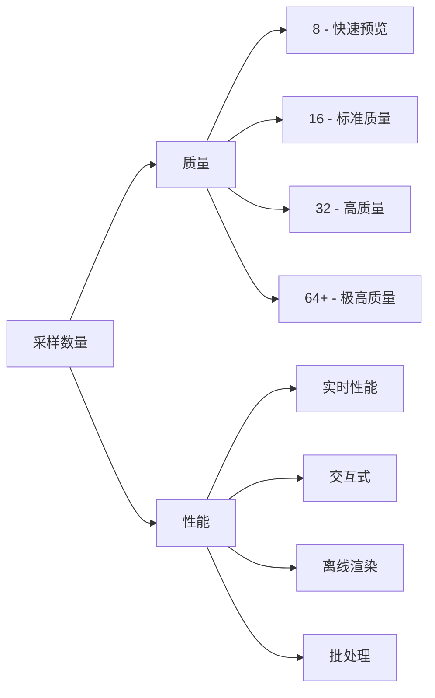
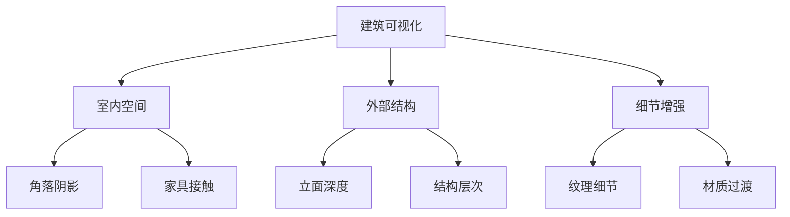

# 17. 环境光遮蔽节点详解

## 目录

- [17.1 概述](#171-概述)
- [17.2 节点接口定义](#172-节点接口定义)
- [17.3 核心算法原理](#173-核心算法原理)
- [17.4 Eevee引擎实现](#174-eevee引擎实现)
- [17.5 Cycles引擎实现](#175-cycles引擎实现)
- [17.6 数学原理分析](#176-数学原理分析)
- [17.7 渲染差异对比](#177-渲染差异对比)
- [17.8 代码实现详解](#178-代码实现详解)
- [17.9 性能优化策略](#179-性能优化策略)
- [17.10 应用场景与最佳实践](#1710-应用场景与最佳实践)

---

## 17.1 概述

<span style="background-color: #e3f2fd; color: #1565c0;">环境光遮蔽（Ambient Occlusion，AO）</span>是一种全局光照技术，用于计算场景中每个点被周围几何体遮挡的程度。该技术通过模拟光线在半球空间内的遮挡情况，为渲染添加真实感和深度感。

环境光遮蔽节点的工作流程可以表示为：



### 17.1.1 应用价值

- **增强视觉深度**: 通过在凹槽和角落处添加阴影，增强物体的立体感
- **模拟接触阴影**: 模拟物体接触处的自然阴影效果
- **天气化效果**: 为表面添加自然的磨损和老化效果
- **性能优化**: 相比完整的全局光照，AO提供了较低的计算成本

---

## 17.2 节点接口定义

### 17.2.1 输入接口

环境光遮蔽节点定义在 `source/blender/nodes/shader/nodes/node_shader_ambient_occlusion.cc:14-21`：

```cpp
static void node_declare(NodeDeclarationBuilder &b)
{
  b.add_input<decl::Color>("Color").default_value({1.0f, 1.0f, 1.0f, 1.0f});
  b.add_input<decl::Float>("Distance").default_value(1.0f).min(0.0f).max(1000.0f);
  b.add_input<decl::Vector>("Normal").min(-1.0f).max(1.0f).hide_value();
  b.add_output<decl::Color>("Color");
  b.add_output<decl::Float>("AO");
}
```

#### 输入参数详解

| 参数名 | 类型 | 默认值 | 范围 | 功能描述 |
|--------|------|--------|------|----------|
| **Color** | Color | (1.0, 1.0, 1.0, 1.0) | RGBA | <span style="background-color: #fff3e0; color: #ef6c00;">基础颜色</span>，与AO值相乘得到最终颜色 |
| **Distance** | Float | 1.0 | [0.0, 1000.0] | <span style="background-color: #f3e5f5; color: #7b1fa2;">采样距离</span>，控制AO的影响范围 |
| **Normal** | Vector | N | [-1.0, 1.0] | <span style="background-color: #e8f5e8; color: #2e7d32;">表面法线</span>，定义采样的半球方向 |

### 17.2.2 输出接口

| 参数名 | 类型 | 计算公式 | 功能描述 |
|--------|------|----------|----------|
| **Color** | Color | `Color × AO` | AO值与输入颜色相乘的结果 |
| **AO** | Float | `f(normal, distance, samples)` | 环境光遮蔽系数 [0, 1] |

---

## 17.3 核心算法原理

### 17.3.1 环境光遮蔽的数学模型

环境光遮蔽基于以下数学原理：

$$ AO(\mathbf{p}, \mathbf{n}) = \frac{1}{\pi} \int_{\Omega^+} V(\mathbf{p}, \omega) (\mathbf{n} \cdot \omega) \, d\omega $$

其中：
- $\mathbf{p}$: 着色点位置
- $\mathbf{n}$: 表面法线
- $\Omega^+$: 上半球空间
- $V(\mathbf{p}, \omega)$: 可见性函数（1表示可见，0表示遮挡）
- $\mathbf{n} \cdot \omega$: 余弦权重

### 17.3.2 蒙特卡洛积分

实际实现中，使用蒙特卡洛方法近似上述积分：

$$ AO(\mathbf{p}, \mathbf{n}) \approx \frac{1}{N} \sum_{i=1}^{N} V(\mathbf{p}, \omega_i) \cdot (\mathbf{n} \cdot \omega_i) $$

其中 $N$ 是采样数量，$\omega_i$ 是按余弦加权的半球采样方向。

### 17.3.3 采样方向生成

使用均匀分布的半球采样：

```mermaid
graph LR
    A[生成随机数] --> B[映射到半球]
    B --> C[余弦加权]
    C --> D[生成采样方向]
    
    B --> B1[θ ∈ [0, π/2]]
    B --> B2[φ ∈ [0, 2π]]
    
    D --> D1[ω_x = sin(θ)cos(φ)]
    D --> D2[ω_y = sin(θ)sin(φ)]
    D --> D3[ω_z = cos(θ)]
```

---

## 17.4 Eevee引擎实现

### 17.4.1 GPU着色器实现

Eevee引擎的AO实现在 `source/blender/gpu/shaders/material/gpu_shader_material_ambient_occlusion.glsl:7-17`：

```glsl
void node_ambient_occlusion(float4 color,
                            float dist,
                            float3 normal,
                            const float inverted,
                            const float sample_count,
                            out float4 result_color,
                            out float result_ao)
{
  result_ao = ambient_occlusion_eval(safe_normalize(normal), dist, inverted, sample_count);
  result_color = result_ao * color;
}
```

#### 参数说明
- **safe_normalize()**: 安全归一化函数，防止零长度法线
- **inverted**: 控制内外遮蔽的标志位
- **sample_count**: 实际采样数量（向上取整到4的倍数）

### 17.4.2 GPU材质链接

在 `source/blender/nodes/shader/nodes/node_shader_ambient_occlusion.cc:32-54`：

```cpp
static int node_shader_gpu_ambient_occlusion(GPUMaterial *mat,
                                             bNode *node,
                                             bNodeExecData * /*execdata*/,
                                             GPUNodeStack *in,
                                             GPUNodeStack *out)
{
  if (!in[2].link) {
    GPU_link(mat, "world_normals_get", &in[2].link);
  }

  GPU_material_flag_set(mat, GPU_MATFLAG_AO);

  float inverted = (node->custom2 & SHD_AO_INSIDE) ? 1.0f : 0.0f;
  float f_samples = divide_ceil_u(node->custom1, 4);

  return GPU_stack_link(mat,
                        node,
                        "node_ambient_occlusion",
                        in,
                        out,
                        GPU_constant(&inverted),
                        GPU_constant(&f_samples));
}
```

#### 关键实现细节

1. **法线自动获取**: 如果没有连接法线输入，自动使用世界空间法线
2. **AO标志设置**: `GPU_MATFLAG_AO` 启用AO渲染通道
3. **采样数量优化**: `divide_ceil_u(node->custom1, 4)` 将采样数对齐到4的倍数

### 17.4.3 AO评估函数流程



---

## 17.5 Cycles引擎实现

### 17.5.1 OSL着色器实现

Cycles引擎使用Open Shading Language，实现在 `intern/cycles/kernel/osl/shaders/node_ambient_occlusion.osl:7-33`：

```osl
shader node_ambient_occlusion(color ColorIn = color(1.0, 1.0, 1.0),
                              int samples = 16,
                              float Distance = 1.0,
                              normal Normal = N,
                              int inside = 0,
                              int only_local = 0,
                              output color ColorOut = color(1.0, 1.0, 1.0),
                              output float AO = 1.0)
{
  int global_radius = (Distance == 0.0 && !isconnected(Distance));

  normal normalized_normal = normalize(Normal);

  /* Abuse texture call with special @ao token. */
  AO = texture("@ao",
               samples,
               Distance,
               normalized_normal[0],
               normalized_normal[1],
               normalized_normal[2],
               inside,
               "sblur",
               only_local,
               "tblur",
               global_radius);
  ColorOut = ColorIn * AO;
}
```

#### 实现特点分析

1. **特殊纹理调用**: 使用 `texture("@ao", ...)` 特殊标记触发Cycles的AO计算
2. **全局半径检测**: `global_radius` 判断是否使用无限距离的AO
3. **模糊控制**: `sblur` 和 `tblur` 参数控制采样模糊策略

### 17.5.2 参数映射

| OSL参数 | Cycles内部参数 | 功能 |
|---------|----------------|------|
| `samples` | 采样数量 | 控制AO质量和性能 |
| `Distance` | 最大采样距离 | 限制AO的影响范围 |
| `inside` | 内外遮蔽 | 计算内部或外部AO |
| `only_local` | 局部遮蔽 | 仅考虑局部几何体 |

---

## 17.6 数学原理分析

### 17.6.1 半球积分理论

环境光遮蔽的核心是计算上半球的可见性积分：

$$ V_AO(\mathbf{p}) = \frac{1}{2\pi} \int_{\Omega} V(\mathbf{p}, \omega) \cos\theta \, d\omega $$

展开为球坐标：

$$ V_AO(\mathbf{p}) = \frac{1}{2\pi} \int_{0}^{2\pi} \int_{0}^{\pi/2} V(\mathbf{p}, \theta, \phi) \cos\theta \sin\theta \, d\theta \, d\phi $$

### 17.6.2 余弦加权采样

使用余弦加权采样的重要性采样策略：

概率密度函数：
$$ p(\omega) = \frac{\cos\theta}{\pi} $$

蒙特卡洛估计器：
$$ V_AO \approx \frac{1}{N} \sum_{i=1}^{N} \frac{V(\mathbf{p}, \omega_i) \cos\theta_i}{p(\omega_i)} = \frac{1}{N} \sum_{i=1}^{N} V(\mathbf{p}, \omega_i) $$

### 17.6.3 距离衰减模型

为了限制AO的影响范围，应用距离衰减函数：

$$ f(d) = \begin{cases} 
1 - \frac{d^2}{R^2} & \text{if } d < R \\
0 & \text{if } d \geq R 
\end{cases} $$

其中 $R$ 是最大距离，$d$ 是遮挡距离。

---

## 17.7 渲染差异对比

### 17.7.1 Eevee vs Cycles 实现差异

| 特性 | Eevee | Cycles |
|------|-------|--------|
| **渲染方式** | 屏幕空间AO | 光线追踪AO |
| **精度** | 近似算法 | 物理精确 |
| **性能** | 实时性能 | 离线渲染 |
| **质量** | 视觉效果好 | 物理准确 |
| **内存占用** | 低 | 高 |

### 17.7.2 算法差异图示



### 17.7.3 质量对比分析

| 质量指标 | Eevee SSAO | Cycles AO |
|----------|------------|------------|
| **几何准确性** | 屏幕空间限制 | 完整3D空间 |
| **遮挡精度** | 近似计算 | 精确光线追踪 |
| **接触阴影** | 局限性 | 完全支持 |
| **复杂几何** | 可能遗漏 | 准确处理 |
| **性能成本** | 低-中等 | 高 |

---

## 17.8 代码实现详解

### 17.8.1 节点注册与初始化

在 `source/blender/nodes/shader/nodes/node_shader_ambient_occlusion.cc:82-102`：

```cpp
void register_node_type_sh_ambient_occlusion()
{
  namespace file_ns = blender::nodes::node_shader_ambient_occlusion_cc;

  static blender::bke::bNodeType ntype;

  sh_node_type_base(&ntype, "ShaderNodeAmbientOcclusion", SH_NODE_AMBIENT_OCCLUSION);
  ntype.ui_name = "Ambient Occlusion";
  ntype.ui_description =
      "Compute how much the hemisphere above the shading point is occluded, for example to add "
      "weathering effects to corners.\nNote: For Cycles, this may slow down renders significantly";
  ntype.enum_name_legacy = "AMBIENT_OCCLUSION";
  ntype.nclass = NODE_CLASS_INPUT;
  ntype.declare = file_ns::node_declare;
  ntype.draw_buttons = file_ns::node_shader_buts_ambient_occlusion;
  ntype.initfunc = file_ns::node_shader_init_ambient_occlusion;
  ntype.gpu_fn = file_ns::node_shader_gpu_ambient_occlusion;
  ntype.materialx_fn = file_ns::node_shader_materialx;

  blender::bke::node_register_type(ntype);
}
```

### 17.8.2 UI界面实现

在 `source/blender/nodes/shader/nodes/node_shader_ambient_occlusion.cc:23-30`：

```cpp
static void node_shader_buts_ambient_occlusion(ui::Layout &layout,
                                               bContext * /*C*/,
                                               PointerRNA *ptr)
{
  layout.prop(ptr, "samples", ui::ITEM_R_SPLIT_EMPTY_NAME, std::nullopt, ICON_NONE);
  layout.prop(ptr, "inside", ui::ITEM_R_SPLIT_EMPTY_NAME, std::nullopt, ICON_NONE);
  layout.prop(ptr, "only_local", ui::ITEM_R_SPLIT_EMPTY_NAME, std::nullopt, ICON_NONE);
}
```

### 17.8.3 节点初始化

在 `source/blender/nodes/shader/nodes/node_shader_ambient_occlusion.cc:56-60`：

```cpp
static void node_shader_init_ambient_occlusion(bNodeTree * /*ntree*/, bNode *node)
{
  node->custom1 = 16; /* samples */
  node->custom2 = 0;
}
```

#### 参数命名规则

| 变量 | 含义 | 取值范围 |
|------|------|----------|
| `custom1` | 采样数量 | 16 (默认) |
| `custom2` | 选项标志 | 位掩码 |

**标志位定义**：
- `SHD_AO_INSIDE` (bit 0): 内部遮蔽模式
- 其他位为未来扩展保留

---

## 17.9 性能优化策略

### 17.9.1 采样数量优化

<span style="background-color: #fff8e1; color: #f57c00;">采样数量与质量权衡</span>：



### 17.9.2 距离参数优化

距离参数的使用策略：

- **小距离 (0.1-0.5)**: <span style="color: #2e7d32;">适合细节阴影</span>
- **中等距离 (0.5-2.0)**: <span style="color: #1565c0;">标准环境遮蔽</span>
- **大距离 (2.0-10.0)**: <span style="color: #6a1b9a;">大面积环境效果</span>

### 17.9.3 Eevee特定优化

1. **层级采样**: 使用多尺度采样提高效率
2. **早期退出**: 距离超过阈值时提前终止
3. **缓存重用**: 相邻像素共享采样结果

### 17.9.4 Cycles特定优化

1. **重要性采样**: 基于法线和几何特征的方向采样
2. **自适应采样**: 根据噪声水平调整采样数量
3. **光线缓存**: 重用相邻像素的光线追踪结果

---

## 17.10 应用场景与最佳实践

### 17.10.1 典型应用场景

#### 1. 建筑可视化


#### 2. 游戏美术
- **角色细节**: 增强面部和服装的立体感
- **环境氛围**: 快速建立场景深度
- **性能优化**: 替代部分光照计算

#### 3. 产品渲染
- **接触阴影**: 展示物体与表面的真实接触
- **细节强调**: 突出产品的工艺细节
- **风格化效果**: 创建特定的艺术风格

### 17.10.2 参数设置指南

#### 质量等级推荐

| 等级 | Samples | Distance | Use Case |
|------|---------|----------|----------|
| **预览** | 8-16 | 0.5-1.0 | 快速预览 |
| **标准** | 16-32 | 1.0-2.0 | 日常工作 |
| **高质量** | 32-64 | 1.0-3.0 | 最终渲染 |
| **极高质量** | 64-128 | 2.0-5.0 | 关键镜头 |

#### 适配不同场景的设置

```cpp
// 建筑室内场景推荐参数
struct ArchitecturalAO {
    float distance = 1.5f;      // 中等距离，捕捉室内细节
    int samples = 32;            // 高质量采样
    bool inside = false;         // 外部遮蔽
    bool only_local = true;      // 仅局部几何体
};

// 角色特写推荐参数  
struct CharacterAO {
    float distance = 0.5f;       // 小距离，强调细节
    int samples = 24;            // 平衡质量和性能
    bool inside = false;         // 外部遮蔽
    bool only_local = true;      // 仅局部几何体
};
```

### 17.10.3 常见问题与解决方案

#### 1. AO值过低
<span style="background-color: #ffebee; color: #c62828;">问题</span>: 场景看起来过暗，缺乏环境光

<span style="background-color: #e8f5e8; color: #2e7d32;">解决方案</span>:
- 增加 `Distance` 参数值
- 检查法线是否正确
- 调整采样数量

#### 2. 性能问题
<span style="background-color: #fff3e0; color: #ef6c00;">问题</span>: 渲染速度过慢

<span style="background-color: #e3f2fd; color: #1565c0;">解决方案</span>:
- 降低采样数量
- 限制AO影响距离
- 使用Eevee进行实时预览

#### 3. 噪点问题
<span style="background-color: #f3e5f5; color: #7b1fa2;">问题</span>: AO结果有可见噪点

<span style="background-color: #e8f5e8; color: #2e7d32;">解决方案</span>:
- 增加采样数量
- 使用Cycles的降噪功能
- 后处理模糊处理

---

## 总结

环境光遮蔽节点是Blender着色系统中一个强大的工具，它通过计算周围几何体对每个着色点的遮挡程度，为渲染添加真实感和深度感。理解其背后的数学原理和不同渲染引擎的实现差异，能够帮助用户更好地应用这一技术来提升作品质量。

<span style="background-color: #e1f5fe; color: #0277bd;">关键要点</span>：
1. AO是物理近似的全局光照技术
2. Eevee和Cycles使用不同的实现策略
3. 参数设置需要在质量和性能间权衡
4. 合理使用可以显著提升渲染效果

通过掌握环境光遮蔽节点的原理和应用技巧，艺术家们可以创造出更加真实和富有层次的渲染作品。