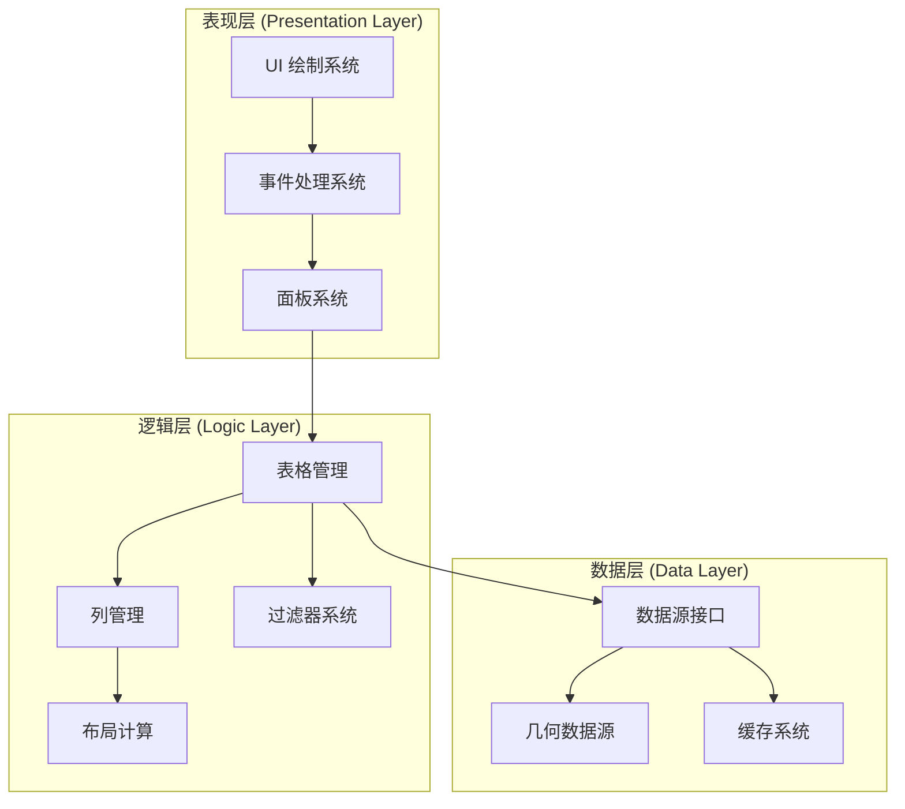
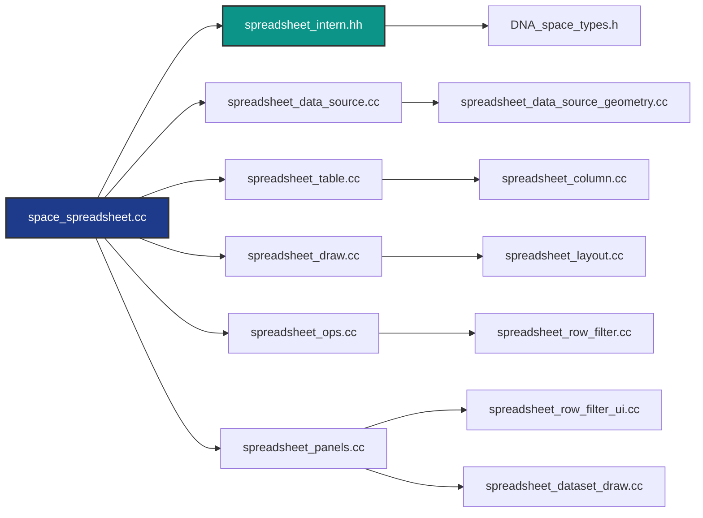
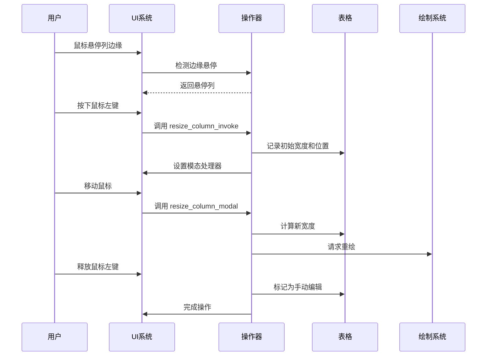
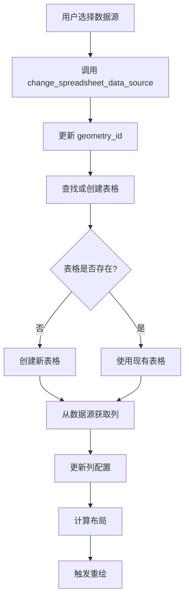
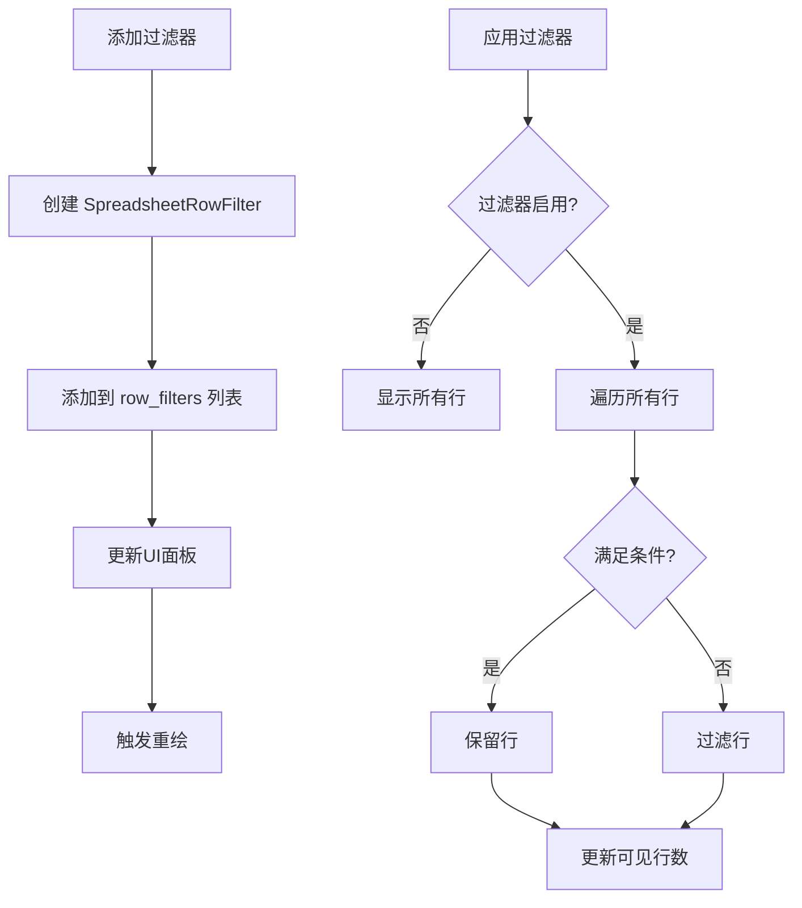

# Blender 电子表格系统 - 概述与架构

## 目录
- [1. 系统概述](#1-系统概述)
- [2. 核心架构设计](#2-核心架构设计)
  - [2.1. 三层架构模型](#21-三层架构模型)
  - [2.2. 数据流向](#22-数据流向)
- [3. 关键数据结构](#3-关键数据结构)
  - [3.1. SpaceSpreadsheet 结构体](#31-spacespreadsheet-结构体)
  - [3.2. SpreadsheetTable 结构体](#32-spreadsheettable-结构体)
  - [3.3. SpreadsheetColumn 结构体](#33-spreadsheetcolumn-结构体)
- [4. 文件组织结构](#4-文件组织结构)
  - [4.1. 核心文件分析](#41-核心文件分析)
  - [4.2. 文件依赖关系](#42-文件依赖关系)
- [5. 运行时架构](#5-运行时架构)
  - [5.1. 运行时数据管理](#51-运行时数据管理)
  - [5.2. 垃圾回收机制](#52-垃圾回收机制)
- [6. 枚举与常量](#6-枚举与常量)
  - [6.1. 数据类型枚举](#61-数据类型枚举)
  - [6.2. 过滤器操作枚举](#62-过滤器操作枚举)
- [7. 核心算法与数学基础](#7-核心算法与数学基础)
  - [7.1. 布局计算算法](#71-布局计算算法)
  - [7.2. 列宽计算公式](#72-列宽计算公式)
- [8. 交互流程图](#8-交互流程图)

---

## 1. 系统概述

<span style="background-color: #1e3a8a; color: white; padding: 2px 8px; border-radius: 4px;">Blender 电子表格系统</span> 是 Blender 3.0+ 引入的一个强大功能，用于可视化和分析几何数据。它允许用户查看几何体的各种属性，如顶点坐标、UV坐标、颜色、实例信息等。

### 1.1. 核心功能

电子表格系统提供以下核心功能：

1. **数据可视化**：以表格形式显示几何数据的各种属性
2. **多数据源支持**：支持网格、曲线、点云、体积、实例等多种几何类型
3. **列管理**：动态列添加、删除、排序、调整宽度
4. **行过滤**：基于条件的行过滤功能
5. **实例导航**：支持嵌套实例的层级浏览
6. **查看器节点集成**：与几何节点系统的深度集成

### 1.2. 设计哲学

电子表格系统的设计遵循以下原则：

- **模块化**：各功能模块高度解耦，便于维护和扩展
- **性能优先**：使用缓存机制和懒加载策略优化大数据集处理
- **类型安全**：强类型系统确保数据一致性
- **用户友好**：直观的UI交互和实时反馈

---

## 2. 核心架构设计

### 2.1. 三层架构模型



<span style="background-color: #0d9488; color: white; padding: 2px 8px; border-radius: 4px;">★ Insight</span>
三层架构的设计使得电子表格系统能够：
- **表现层**专注于UI渲染和用户交互
- **逻辑层**处理业务规则和数据转换
- **数据层**负责数据获取和存储

这种分离使得各层可以独立演进，提高了代码的可维护性。

### 2.2. 数据流向

电子表格系统的数据流向如下：

```
用户操作 → 事件处理器 → 数据源更新 → 表格缓存 → 布局计算 → 渲染绘制
     ↓           ↓           ↓           ↓           ↓           ↓
   鼠标点击   操作器执行   获取几何数据  查找/创建表  计算行列尺寸  GPU绘制
```

具体流程：

1. **用户交互**：用户在UI上进行操作（如选择数据源、调整列宽、添加过滤器）
2. **事件处理**：事件处理器捕获操作并调用相应的操作器（Operator）
3. **数据源更新**：根据操作更新数据源配置（几何组件类型、属性域等）
4. **表格缓存**：查找或创建对应的表格，管理列和行数据
5. **布局计算**：计算列宽、行高、滚动位置等布局信息
6. **渲染绘制**：使用UI系统绘制表格内容

---

## 3. 关键数据结构

### 3.1. SpaceSpreadsheet 结构体

**定义位置**: `source/blender/makesdna/DNA_space_types.h:1218-1254`

```cpp
typedef struct SpaceSpreadsheet {
  SpaceLink *next, *prev;           // 链表指针，用于空间管理
  ListBase regionbase;              // 区域基础列表
  char spacetype;                   // 空间类型 (SPACE_SPREADSHEET)
  char link_flag;                   // 链接标志
  char _pad0[6];                    // 内存对齐填充

  // 表格管理
  SpreadsheetTable **tables;        // 表格数组指针
  int num_tables;                   // 表格数量
  char _pad1[3];                    // 填充

  // 过滤器
  uint8_t filter_flag;              // 过滤器标志 (#eSpaceSpreadsheet_FilterFlag)
  ListBase row_filters;             // 行过滤器列表

  // 数据源标识
  SpreadsheetTableIDGeometry geometry_id;  // 当前几何数据ID

  // 状态管理
  uint32_t flag;                    // 空间标志 (#eSpaceSpreadsheet_Flag)
  uint32_t table_use_clock;         // 表格使用时钟（用于GC）

  // 查看器路径
  int active_viewer_path_index;     // 活动查看器路径索引
  char _pad2[4];                    // 填充

  // 运行时数据
  SpaceSpreadsheet_Runtime *runtime;  // 运行时数据指针
} SpaceSpreadsheet;
```

#### 关键字段解析：

- **`tables`**: 动态数组，存储所有表格对象。每个表格对应一个特定的数据源配置
- **`table_use_clock`**: 时钟计数器，用于实现LRU（最近最少使用）垃圾回收策略
- **`geometry_id`**: 复合结构体，包含：
  - `viewer_path`: 查看器路径（用于几何节点）
  - `geometry_component_type`: 几何组件类型（网格、曲线等）
  - `attribute_domain`: 属性域（点、边、面等）
  - `instance_ids`: 实例ID路径（用于嵌套实例）

### 3.2. SpreadsheetTable 结构体

**定义位置**: `source/blender/makesdna/DNA_space_types.h:1198-1216`

```cpp
typedef struct SpreadsheetTable {
  SpreadsheetTableID *id;           // 表格唯一标识符
  SpreadsheetColumn **columns;      // 列数组（指针的指针）
  int num_columns;                  // 列数量
  uint32_t flag;                    // 表格标志 (#eSpreadsheetTableFlag)
  uint32_t last_used;               // 最后使用时间（用于GC）
  uint32_t column_use_clock;        // 列使用时钟（用于GC）
} SpreadsheetTable;
```

### 3.3. SpreadsheetColumn 结构体

**定义位置**: `source/blender/makesdna/DNA_space_types.h:1091-1130`

```cpp
typedef struct SpreadsheetColumn {
  SpreadsheetColumnID *id;          // 列标识符（包含名称）
  uint8_t data_type;                // 数据类型 (#eSpreadsheetColumnValueType)
  char _pad0[3];                    // 填充
  uint32_t flag;                    // 列标志 (#eSpreadsheetColumnFlag)
  float width;                      // 宽度（单位：SPREADSHEET_WIDTH_UNIT）
  uint32_t last_used;               // 最后使用时间
  char *display_name;               // 显示名称
  SpreadsheetColumnRuntime *runtime; // 运行时数据
} SpreadsheetColumn;
```

#### 列标识符：

```cpp
typedef struct SpreadsheetColumnID {
  char *name;  // 列名称（属性名）
} SpreadsheetColumnID;
```

### 3.4. SpreadsheetRowFilter 结构体

**定义位置**: `source/blender/makesdna/DNA_space_types.h:1256-1278`

```cpp
typedef struct SpreadsheetRowFilter {
  struct SpreadsheetRowFilter *next, *prev;  // 链表结构
  char column_name[64];                      // 列名
  uint8_t operation;                         // 操作 (#eSpreadsheetFilterOperation)
  uint8_t flag;                              // 过滤器标志
  char _pad0[6];                             // 填充

  // 各种类型的值存储
  int value_int;                             // 整数值
  int value_int2[2];                         // 2D整数值
  int value_int3[3];                         // 3D整数值
  char *value_string;                        // 字符串值
  float value_float;                         // 浮点值
  float threshold;                           // 阈值（用于浮点比较）
  float value_float2[2];                     // 2D浮点值
  float value_float3[3];                     // 3D浮点值
  float value_color[4];                      // 颜色值（RGBA）
  char _pad1[4];                             // 填充
} SpreadsheetRowFilter;
```

---

## 4. 文件组织结构

### 4.1. 核心文件分析

电子表格系统的源代码位于 `source/blender/editors/space_spreadsheet/` 目录下：

```
space_spreadsheet/
├── spreadsheet_intern.hh              # 内部头文件，声明运行时结构和函数
├── space_spreadsheet.cc               # 主入口，空间类型注册和区域管理
├── spreadsheet_data_source.cc         # 数据源抽象接口实现
├── spreadsheet_data_source_geometry.cc # 几何数据源具体实现
├── spreadsheet_column.cc              # 列管理功能
├── spreadsheet_column_values.hh       # 列值类型定义
├── spreadsheet_table.cc               # 表格管理
├── spreadsheet_layout.cc              # 布局计算
├── spreadsheet_draw.cc                # 绘制和渲染
├── spreadsheet_row_filter.cc          # 行过滤逻辑
├── spreadsheet_row_filter_ui.cc       # 过滤器UI面板
├── spreadsheet_ops.cc                 # 操作器（列调整、重排序等）
├── spreadsheet_panels.cc              # 面板注册
└── spreadsheet_dataset_draw.cc        # 数据集树视图绘制
```

### 4.2. 文件依赖关系



#### 文件功能详解：

1. **`space_spreadsheet.cc`** - 空间类型主入口
   - 注册电子表格空间类型
   - 管理区域（Region）的创建和更新
   - 处理空间级别的初始化和清理

2. **`spreadsheet_intern.hh`** - 内部头文件
   - 声明 `SpaceSpreadsheet_Runtime` 运行时结构
   - 声明内部辅助函数
   - 定义常量和宏

3. **`spreadsheet_data_source.cc/hh`** - 数据源抽象
   - 定义 `DataSource` 抽象基类
   - 提供数据源获取接口
   - 管理数据源生命周期

4. **`spreadsheet_data_source_geometry.cc/hh`** - 几何数据源
   - 实现几何数据的具体获取逻辑
   - 支持多种几何组件类型
   - 处理属性域转换

5. **`spreadsheet_column.cc/hh`** - 列管理
   - 列的创建、复制、销毁
   - 列宽计算
   - 列标识符管理

6. **`spreadsheet_column_values.hh`** - 列值类型
   - 定义 `ColumnValues` 类
   - 封装不同类型的数据存储
   - 提供类型转换和格式化

7. **`spreadsheet_table.cc/hh`** - 表格管理
   - 表格的创建和查找
   - 表格缓存管理
   - 垃圾回收机制

8. **`spreadsheet_layout.cc/hh`** - 布局计算
   - 计算列宽和行高
   - 处理滚动和视口
   - 管理单元格坐标

9. **`spreadsheet_draw.cc/hh`** - 绘制系统
   - 使用UI系统绘制表格
   - 格式化单元格内容
   - 处理不同类型的数据渲染

10. **`spreadsheet_row_filter.cc/hh`** - 过滤逻辑
    - 过滤器应用算法
    - 条件匹配
    - 结果集生成

11. **`spreadsheet_row_filter_ui.cc/hh`** - 过滤器UI
    - 过滤器面板绘制
    - 用户交互处理
    - 过滤器配置管理

12. **`spreadsheet_ops.cc`** - 操作器
    - 列调整操作
    - 列重排序操作
    - 列宽自适应操作

13. **`spreadsheet_panels.cc`** - 面板注册
    - 注册UI面板
    - 面板内容绘制
    - 面板交互处理

14. **`spreadsheet_dataset_draw.cc`** - 数据集树视图
    - 几何数据结构可视化
    - 实例层级导航
    - 查看器路径管理

---

## 5. 运行时架构

### 5.1. 运行时数据管理

**定义位置**: `source/blender/editors/space_spreadsheet/spreadsheet_intern.hh`

```cpp
struct SpaceSpreadsheet_Runtime {
  int visible_rows = 0;              // 可见行数
  int tot_rows = 0;                  // 总行数
  int tot_columns = 0;               // 总列数
  int top_row_height = 0;            // 顶部行高度（列标题）
  int left_column_width = 0;         // 左侧列宽度（行索引）

  std::optional<ReorderColumnVisualizationData> reorder_column_visualization_data;
};
```

```cpp
struct SpreadsheetColumnRuntime {
  int left_x = 0;   // 列左边缘坐标（视图空间）
  int right_x = 0;  // 列右边缘坐标（视图空间）
};
```

运行时数据的特点：
- **临时性**：仅在运行时存在，不保存到.blend文件
- **动态计算**：根据当前视口和缩放动态更新
- **性能优化**：缓存计算结果，避免重复计算

### 5.2. 垃圾回收机制

电子表格系统使用基于时钟的LRU（最近最少使用）垃圾回收策略：

```cpp
// 时钟递增
spreadsheet->table_use_clock++;

// 表格使用时更新
table->last_used = spreadsheet->table_use_clock;

// 列使用时更新
column->last_used = table->column_use_clock;
```

**回收策略**：
1. 当表格数量超过阈值时，移除最久未使用的表格
2. 当列数量超过阈值时，移除最久未使用的列
3. 保留手动编辑过的表格（`SPREADSHEET_TABLE_FLAG_MANUALLY_EDITED`）

---

## 6. 枚举与常量

### 6.1. 数据类型枚举

**定义位置**: `source/blender/makesdna/DNA_space_enums.h`

```cpp
typedef enum eSpreadsheetColumnValueType {
  SPREADSHEET_VALUE_TYPE_UNKNOWN = -1,
  SPREADSHEET_VALUE_TYPE_BOOL = 0,
  SPREADSHEET_VALUE_TYPE_INT32 = 1,
  SPREADSHEET_VALUE_TYPE_FLOAT = 2,
  SPREADSHEET_VALUE_TYPE_FLOAT2 = 3,
  SPREADSHEET_VALUE_TYPE_FLOAT3 = 4,
  SPREADSHEET_VALUE_TYPE_COLOR = 5,
  SPREADSHEET_VALUE_TYPE_INSTANCES = 6,
  SPREADSHEET_VALUE_TYPE_STRING = 7,
  SPREADSHEET_VALUE_TYPE_BYTE_COLOR = 8,
  SPREADSHEET_VALUE_TYPE_INT8 = 9,
  SPREADSHEET_VALUE_TYPE_INT32_2D = 10,
  SPREADSHEET_VALUE_TYPE_QUATERNION = 11,
  SPREADSHEET_VALUE_TYPE_FLOAT4X4 = 12,
  SPREADSHEET_VALUE_TYPE_BUNDLE_ITEM = 13,
  SPREADSHEET_VALUE_TYPE_INT64 = 14,
  SPREADSHEET_VALUE_TYPE_INT32_3D = 15,
} eSpreadsheetColumnValueType;
```

**缩写解释**：
- `SPREADSHEET_`：Blender中常见的前缀模式，表示"电子表格"
- `VALUE_TYPE_`：表示值的类型
- `INT32_2D`：2维整数向量（`int2`）
- `INT32_3D`：3维整数向量（`int3`）
- `BYTE_COLOR`：字节颜色（`ColorGeometry4b`，0-255范围）

### 6.2. 过滤器操作枚举

```cpp
typedef enum eSpreadsheetFilterOperation {
  SPREADSHEET_ROW_FILTER_EQUAL = 0,     // 等于 (=)
  SPREADSHEET_ROW_FILTER_GREATER = 1,   // 大于 (>)
  SPREADSHEET_ROW_FILTER_LESS = 2,      // 小于 (<)
} eSpreadsheetFilterOperation;
```

### 6.3. 对象评估状态

```cpp
typedef enum eSpreadsheet_ObjectEvalState {
  SPREADSHEET_OBJECT_EVAL_STATE_EVALUATED = 0,    // 评估后对象
  SPREADSHEET_OBJECT_EVAL_STATE_ORIGINAL = 1,     // 原始对象
  SPREADSHEET_OBJECT_EVAL_STATE_VIEWER_NODE = 2,  // 查看器节点
} eSpreadsheet_ObjectEvalState;
```

### 6.4. 常量定义

```cpp
#define SPREADSHEET_WIDTH_UNIT 10.0f  // 列宽单位（像素）
#define SPREADSHEET_EDGE_ACTION_ZONE 5.0f  // 边缘操作区域（像素）
```

---

## 7. 核心算法与数学基础

### 7.1. 布局计算算法

电子表格的布局计算涉及以下核心公式：

#### 7.1.1. 可见行数计算

$$
\text{visible\_rows} = \left\lfloor \frac{\text{region\_height} - \text{top\_row\_height}}{\text{row\_height}} \right\rfloor
$$

其中：
- `region_height`: 区域高度（像素）
- `top_row_height`: 列标题高度（像素）
- `row_height`: 单行高度（通常为字体大小 + padding）

#### 7.1.2. 滚动位置映射

视图坐标到数据索引的映射：

$$
\text{data\_index} = \left\lfloor \frac{\text{view\_y} - \text{top\_row\_height}}{\text{row\_height}} \right\rfloor + \text{scroll\_offset}
$$

### 7.2. 列宽计算公式

**定义位置**: `source/blender/editors/space_spreadsheet/spreadsheet_column_values.hh:761-775`

列宽计算函数 `ColumnValues::fit_column_width_px()` 使用以下公式：

$$
\text{width} = \max(\text{min\_width}, \text{padding} + \max(\text{data\_width}, \text{name\_width}))
$$

其中：
- $\text{min\_width} = \text{SPREADSHEET\_WIDTH\_UNIT} = 10.0$
- $\text{padding} = 0.5 \times \text{SPREADSHEET\_WIDTH\_UNIT} = 5.0$
- $\text{data\_width}$: 根据数据类型估算的宽度
- $\text{name\_width}$: 列名文本宽度

#### 7.2.1. 数据宽度估算

对于数值类型，使用采样估算：

$$
\text{data\_width} = \max_{i \in \text{sample}}(\text{text\_width}(\text{format}(\text{value}_i)))
$$

采样大小由 `max_sample_size` 参数控制，默认为所有数据。

### 7.3. 字符串格式化

#### 7.3.1. 整数格式化

```cpp
// 使用分组格式（如 1,234,567）
BLI_str_format_int64_grouped(dst, value);
```

#### 7.3.2. 浮点数格式化

```cpp
// 固定精度，3位小数
std::stringstream ss;
ss << std::fixed << std::setprecision(3) << value;
```

#### 7.3.3. 矩阵格式化

```cpp
// 4x4矩阵格式化为网格
float4x4 t_matrix = math::transpose(matrix);
// 输出为 4x4 的浮点数网格
```

---

## 8. 交互流程图

### 8.1. 列调整流程



### 8.2. 数据源切换流程



### 8.3. 行过滤流程



---

## 9. 命名约定与缩写解释

### 9.1. 常见缩写

| 缩写 | 全称 | 解释 |
|------|------|------|
| `sspreadsheet` | SpaceSpreadsheet | 空间电子表格的缩写 |
| `tot` | total | 总数 |
| `num` | number | 数量 |
| `r_` | return | 返回值前缀 |
| `src`/`dst` | source/destination | 源/目标 |
| `px` | pixels | 像素 |
| `v2d` | View2D | 2D视图 |
| `op` | operator | 操作器 |
| `prop` | property | 属性 |
| `ptr` | pointer | 指针 |

### 9.2. 命名约定

1. **宏定义**：`SPREADSHEET_` 前缀
   - `SPREADSHEET_WIDTH_UNIT`
   - `SPREADSHEET_VALUE_TYPE_INT32`

2. **函数**：`spreadsheet_` 前缀
   - `spreadsheet_column_new()`
   - `spreadsheet_table_find()`

3. **结构体**：`Spreadsheet` 前缀
   - `SpreadsheetTable`
   - `SpreadsheetColumn`

4. **枚举**：`eSpreadsheet` 前缀
   - `eSpreadsheetColumnValueType`
   - `eSpreadsheetFilterOperation`

5. **标志位**：`SPREADSHEET_` + 结构名 + `FLAG_`
   - `SPREADSHEET_TABLE_FLAG_MANUALLY_EDITED`
   - `SPREADSHEET_COLUMN_FLAG_UNAVAILABLE`

### 9.3. C++命名空间

```cpp
namespace blender::ed::spreadsheet {
  // 所有电子表格相关代码都在此命名空间
}
```

这种命名约定确保了代码的一致性和可读性，同时避免了命名冲突。

---

## 10. 性能优化策略

### 10.1. 懒加载

- **数据获取**：仅在需要显示时才从数据源获取
- **列宽计算**：使用采样而非全量计算
- **布局计算**：仅在必要时重新计算

### 10.2. 缓存机制

- **表格缓存**：保留最近使用的表格
- **列缓存**：避免重复创建列对象
- **运行时数据**：分离持久化数据和临时数据

### 10.3. 增量更新

- **局部重绘**：仅重绘变化的区域
- **差异检测**：比较新旧数据，避免完全重建

---

## 总结

Blender电子表格系统是一个设计精良、功能强大的数据可视化工具。其核心优势在于：

1. **清晰的架构**：三层架构确保了代码的可维护性
2. **灵活的数据源**：支持多种几何类型和属性域
3. **高效的性能**：通过缓存和懒加载优化大数据处理
4. **丰富的交互**：完整的列管理和过滤功能
5. **深度集成**：与几何节点系统的无缝集成

理解这些基础概念对于深入学习后续的高级主题至关重要。

---

**文档版本**: 1.0
**最后更新**: 2025-12-19
**适用版本**: Blender 4.3+
