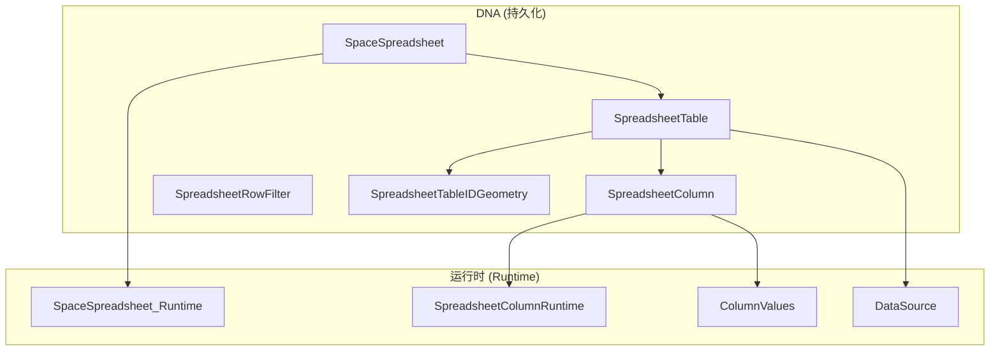

# Blender 电子表格系统 - 核心数据结构与内存管理

## 目录
- [1. 数据结构概览](#1-数据结构概览)
- [2. DNA 数据结构详解](#2-dna-数据结构详解)
  - [2.1. SpaceSpreadsheet](#21-spacespreadsheet)
  - [2.2. SpreadsheetTable](#22-spreadsheettable)
  - [2.3. SpreadsheetColumn](#23-spreadsheetcolumn)
  - [2.4. SpreadsheetRowFilter](#24-spreadsheetrowfilter)
  - [2.5. SpreadsheetTableIDGeometry](#25-spreadsheettableidgeometry)
- [3. 运行时数据结构](#3-运行时数据结构)
  - [3.1. SpaceSpreadsheet_Runtime](#31-spacespreadsheet_runtime)
  - [3.2. SpreadsheetColumnRuntime](#32-spreadsheetcolumnruntime)
  - [3.3. ColumnValues](#33-columnvalues)
- [4. 内存管理策略](#4-内存管理策略)
  - [4.1. 分配与释放](#41-分配与释放)
  - [4.2. 拷贝与克隆](#42-拷贝与克隆)
  - [4.3. 垃圾回收机制](#43-垃圾回收机制)
- [5. Blend 文件读写](#5-blend-文件读写)
  - [5.1. 序列化流程](#51-序列化流程)
  - [5.2. 反序列化流程](#52-反序列化流程)
- [6. 类型转换系统](#6-类型转换系统)
  - [6.1. C++类型到列类型](#61-c类型到列类型)
  - [6.2. 列类型到显示格式](#62-列类型到显示格式)
- [7. 并发与线程安全](#7-并发与线程安全)
  - [7.1. 互斥锁使用](#71-互斥锁使用)
  - [7.2. 数据竞争防护](#72-数据竞争防护)
- [8. 性能优化技术](#8-性能优化技术)
  - [8.1. 内存池](#81-内存池)
  - [8.2. 延迟初始化](#82-延迟初始化)
  - [8.3. 对象复用](#83-对象复用)
- [9. 调试与诊断](#9-调试与诊断)
  - [9.1. 内存泄漏检测](#91-内存泄漏检测)
  - [9.2. 性能分析](#92-性能分析)

---

## 1. 数据结构概览

电子表格系统的核心数据结构分为两类：

1. **DNA 结构体**：持久化存储在 `.blend` 文件中的数据结构
2. **运行时结构体**：仅在程序运行时存在，不保存到文件



---

## 2. DNA 数据结构详解

### 2.1. SpaceSpreadsheet

**定义位置**: `source/blender/makesdna/DNA_space_types.h:1218-1254`

```cpp
typedef struct SpaceSpreadsheet {
  /* SpaceLink 基础结构 (16 bytes) */
  SpaceLink *next, *prev;
  ListBase regionbase;
  char spacetype;      // SPACE_SPREADSHEET = 21
  char link_flag;
  char _pad0[6];

  /* 表格管理 (16 bytes) */
  SpreadsheetTable **tables;  // 指针数组
  int num_tables;
  char _pad1[3];

  /* 过滤器 (8 bytes) */
  uint8_t filter_flag;        // #eSpaceSpreadsheet_FilterFlag
  ListBase row_filters;       // 链表结构

  /* 数据源标识 (48 bytes) */
  SpreadsheetTableIDGeometry geometry_id;

  /* 状态管理 (8 bytes) */
  uint32_t flag;              // #eSpaceSpreadsheet_Flag
  uint32_t table_use_clock;   // LRU时钟

  /* 查看器路径 (8 bytes) */
  int active_viewer_path_index;
  char _pad2[4];

  /* 运行时 (8 bytes) */
  SpaceSpreadsheet_Runtime *runtime;
} SpaceSpreadsheet;  // 总计: 120 bytes (64位系统)
```

#### 内存布局分析 (64位系统):

| 偏移量 | 字段 | 大小 | 说明 |
|--------|------|------|------|
| 0-15 | 链表指针 | 16B | next, prev, regionbase |
| 16-23 | 空间类型 | 8B | spacetype, link_flag, padding |
| 24-39 | 表格数组 | 16B | tables, num_tables |
| 40-47 | 过滤器 | 8B | filter_flag, row_filters |
| 48-95 | 几何ID | 48B | geometry_id (复合结构) |
| 96-103 | 状态标志 | 8B | flag, table_use_clock |
| 104-111 | 查看器索引 | 8B | active_viewer_path_index, padding |
| 112-119 | 运行时指针 | 8B | runtime |

#### 关键标志位:

```cpp
// eSpaceSpreadsheet_Flag
#define SPREADSHEET_FLAG_PINNED (1 << 0)           // 固定当前数据源
#define SPREADSHEET_FLAG_SHOW_INTERNAL_ATTRIBUTES (1 << 1)  // 显示内部属性

// eSpaceSpreadsheet_FilterFlag
#define SPREADSHEET_FILTER_ENABLE (1 << 0)         // 启用行过滤
```

### 2.2. SpreadsheetTable

**定义位置**: `source/blender/makesdna/DNA_space_types.h:1198-1216`

```cpp
typedef struct SpreadsheetTable {
  SpreadsheetTableID *id;      // 8 bytes
  SpreadsheetColumn **columns; // 8 bytes
  int num_columns;             // 4 bytes
  uint32_t flag;               // 4 bytes
  uint32_t last_used;          // 4 bytes
  uint32_t column_use_clock;   // 4 bytes
  // 总计: 32 bytes
} SpreadsheetTable;
```

#### 表格标志位:

```cpp
// eSpreadsheetTableFlag
#define SPREADSHEET_TABLE_FLAG_MANUALLY_EDITED (1 << 0)
// 表示用户手动编辑过列宽或顺序，GC时不应删除
```

#### 表格ID类型:

```cpp
// eSpreadsheetTableIDType
#define SPREADSHEET_TABLE_ID_TYPE_GEOMETRY 0
```

### 2.3. SpreadsheetColumn

**定义位置**: `source/blender/makesdna/DNA_space_types.h:1091-1130`

```cpp
typedef struct SpreadsheetColumn {
  SpreadsheetColumnID *id;     // 8 bytes - 列标识符
  uint8_t data_type;           // 1 byte  - 数据类型
  char _pad0[3];               // 3 bytes - 填充
  uint32_t flag;               // 4 bytes - 标志
  float width;                 // 4 bytes - 宽度 (单位: 10.0f)
  uint32_t last_used;          // 4 bytes - 最后使用时间
  char *display_name;          // 8 bytes - 显示名称
  SpreadsheetColumnRuntime *runtime; // 8 bytes - 运行时数据
  // 总计: 40 bytes
} SpreadsheetColumn;
```

#### 列标识符:

```cpp
typedef struct SpreadsheetColumnID {
  char *name;  // 8 bytes - 属性名称 (堆分配)
} SpreadsheetColumnID;
```

#### 列标志位:

```cpp
// eSpreadsheetColumnFlag
#define SPREADSHEET_COLUMN_FLAG_UNAVAILABLE (1 << 0)
// 列当前不可用（数据源中不存在）
```

### 2.4. SpreadsheetRowFilter

**定义位置**: `source/blender/makesdna/DNA_space_types.h:1256-1278`

```cpp
typedef struct SpreadsheetRowFilter {
  SpreadsheetRowFilter *next, *prev;  // 16 bytes - 链表
  char column_name[64];               // 64 bytes - 列名
  uint8_t operation;                  // 1 byte   - 操作
  uint8_t flag;                       // 1 byte   - 标志
  char _pad0[6];                      // 6 bytes  - 填充

  // 值存储 (48 bytes)
  int value_int;                      // 4 bytes
  int value_int2[2];                  // 8 bytes
  int value_int3[3];                  // 12 bytes
  char *value_string;                 // 8 bytes
  float value_float;                  // 4 bytes
  float threshold;                    // 4 bytes
  float value_float2[2];              // 8 bytes
  float value_float3[3];              // 12 bytes
  float value_color[4];               // 16 bytes

  char _pad1[4];                      // 4 bytes
  // 总计: 144 bytes
} SpreadsheetRowFilter;
```

#### 过滤器标志:

```cpp
// eSpreadsheetRowFilterFlag
#define SPREADSHEET_ROW_FILTER_ENABLED (1 << 0)
#define SPREADSHEET_ROW_FILTER_BOOL_VALUE (1 << 1)  // 布尔值：True/False
#define SPREADSHEET_ROW_FILTER_UI_EXPAND (1 << 2)   // UI是否展开
```

### 2.5. SpreadsheetTableIDGeometry

**定义位置**: `source/blender/makesdna/DNA_space_types.h:1161-1196`

```cpp
typedef struct SpreadsheetTableIDGeometry {
  SpreadsheetTableID base;     // 4 bytes - 基础类型
  char _pad0[4];               // 4 bytes - 填充

  // 几何上下文 (48 bytes)
  ViewerPath viewer_path;      // 24 bytes - 查看器路径
  int viewer_item_identifier;  // 4 bytes  - 查看器项标识符
  int bundle_path_num;         // 4 bytes  - Bundle路径数量
  SpreadsheetBundlePathElem *bundle_path; // 8 bytes - Bundle路径数组
  int8_t closure_input_output; // 1 byte   - 闭包输入/输出
  char _pad3[7];               // 7 bytes  - 填充

  // 几何标识 (16 bytes)
  SpreadsheetInstanceID *instance_ids;    // 8 bytes - 实例ID数组
  int instance_ids_num;                   // 4 bytes - 实例ID数量
  uint8_t geometry_component_type;        // 1 byte  - 几何组件类型
  uint8_t attribute_domain;               // 1 byte  - 属性域
  uint8_t object_eval_state;              // 1 byte  - 对象评估状态
  char _pad1[5];                          // 5 bytes - 填充
  int layer_index;                        // 4 bytes - Grease Pencil层索引
  // 总计: 96 bytes
} SpreadsheetTableIDGeometry;
```

#### Bundle路径元素:

```cpp
typedef struct SpreadsheetBundlePathElem {
  char *identifier;  // 8 bytes - Bundle键名
} SpreadsheetBundlePathElem;
```

#### 实例ID:

```cpp
typedef struct SpreadsheetInstanceID {
  int reference_index;  // 4 bytes - 实例引用索引
} SpreadsheetInstanceID;
```

---

## 3. 运行时数据结构

### 3.1. SpaceSpreadsheet_Runtime

**定义位置**: `source/blender/editors/space_spreadsheet/spreadsheet_intern.hh`

```cpp
struct SpaceSpreadsheet_Runtime {
  int visible_rows = 0;              // 可见行数
  int tot_rows = 0;                  // 总行数
  int tot_columns = 0;               // 总列数
  int top_row_height = 0;            // 顶部行高度（列标题）
  int left_column_width = 0;         // 左侧列宽度（行索引）

  std::optional<ReorderColumnVisualizationData> reorder_column_visualization_data;
};
```

#### 重排序可视化数据:

```cpp
struct ReorderColumnVisualizationData {
  int old_index;              // 原始列索引
  int new_index;              // 新列索引
  int current_offset_x_px;    // 当前X偏移（像素）
};
```

### 3.2. SpreadsheetColumnRuntime

**定义位置**: `source/blender/editors/space_spreadsheet/spreadsheet_intern.hh`

```cpp
struct SpreadsheetColumnRuntime {
  int left_x = 0;   // 列左边缘坐标（视图空间）
  int right_x = 0;  // 列右边缘坐标（视图空间）
};
```

### 3.3. ColumnValues

**定义位置**: `source/blender/editors/space_spreadsheet/spreadsheet_column_values.hh`

```cpp
class ColumnValues final {
 protected:
  std::string name_;              // 列名称
  GVArray data_;                  // 通用虚拟数组
  ColumnValueDisplayHint display_hint_;  // 显示提示

 public:
  // 构造函数
  ColumnValues(std::string name,
               GVArray data,
               const ColumnValueDisplayHint display_hint = ColumnValueDisplayHint::None);

  // 获取列类型
  eSpreadsheetColumnValueType type() const;

  // 获取名称
  StringRefNull name() const;

  // 获取大小
  int size() const;

  // 获取数据
  const GVArray &data() const;

  // 计算列宽
  float fit_column_width_px(const std::optional<int64_t> &max_sample_size = std::nullopt) const;
};
```

#### 显示提示:

```cpp
enum class ColumnValueDisplayHint {
  None,    // 无特殊提示
  Bytes,   // 字节单位显示
};
```

---

## 4. 内存管理策略

### 4.1. 分配与释放

#### 4.1.1. 基础分配函数

```cpp
// spreadsheet_column.cc

SpreadsheetColumnID *spreadsheet_column_id_new()
{
  SpreadsheetColumnID *column_id = MEM_callocN<SpreadsheetColumnID>(__func__);
  return column_id;
}

void spreadsheet_column_id_free(SpreadsheetColumnID *column_id)
{
  if (column_id->name != nullptr) {
    MEM_freeN(column_id->name);
  }
  MEM_freeN(column_id);
}
```

#### 4.1.2. 列的完整生命周期

```cpp
// 创建
SpreadsheetColumn *spreadsheet_column_new(SpreadsheetColumnID *column_id)
{
  SpreadsheetColumn *column = MEM_callocN<SpreadsheetColumn>(__func__);
  column->id = column_id;
  column->runtime = MEM_new<SpreadsheetColumnRuntime>(__func__);
  return column;
}

// 销毁
void spreadsheet_column_free(SpreadsheetColumn *column)
{
  spreadsheet_column_id_free(column->id);
  MEM_SAFE_FREE(column->display_name);
  MEM_delete(column->runtime);
  MEM_freeN(column);
}
```

#### 4.1.3. 内存分配模式

<span style="background-color: #dc2626; color: white; padding: 2px 8px; border-radius: 4px;">⚠️ 重要</span>

Blender使用自定义内存分配器：

- `MEM_callocN<T>(name)`: 分配并清零，带标签
- `MEM_freeN(ptr)`: 释放内存
- `MEM_safe_free(ptr)`: 安全释放（检查nullptr）
- `MEM_new<T>(name)`: C++构造函数调用
- `MEM_delete(ptr)`: C++析构函数调用

### 4.2. 拷贝与克隆

#### 4.2.1. 深拷贝实现

```cpp
SpreadsheetColumn *spreadsheet_column_copy(const SpreadsheetColumn *src_column)
{
  // 深拷贝列ID
  SpreadsheetColumnID *new_column_id = spreadsheet_column_id_copy(src_column->id);

  // 创建新列
  SpreadsheetColumn *new_column = spreadsheet_column_new(new_column_id);

  // 拷贝显示名称
  if (src_column->display_name != nullptr) {
    new_column->display_name = BLI_strdup(src_column->display_name);
  }

  // 拷贝宽度
  new_column->width = src_column->width;

  return new_column;
}
```

#### 4.2.2. 字符串拷贝

```cpp
SpreadsheetColumnID *spreadsheet_column_id_copy(const SpreadsheetColumnID *src_column_id)
{
  SpreadsheetColumnID *new_column_id = spreadsheet_column_id_new();
  new_column_id->name = BLI_strdup(src_column_id->name);  // 深拷贝字符串
  return new_column_id;
}
```

#### 4.2.3. 复杂结构拷贝

```cpp
void spreadsheet_table_id_copy_content_geometry(SpreadsheetTableIDGeometry &dst,
                                                const SpreadsheetTableIDGeometry &src)
{
  // 拷贝查看器路径
  BKE_viewer_path_copy(&dst.viewer_path, &src.viewer_path);

  // 拷贝基本字段
  dst.geometry_component_type = src.geometry_component_type;
  dst.attribute_domain = src.attribute_domain;
  dst.object_eval_state = src.object_eval_state;
  dst.layer_index = src.layer_index;

  // 拷贝实例ID数组
  dst.instance_ids = static_cast<SpreadsheetInstanceID *>(
      MEM_dupallocN(src.instance_ids));
  dst.instance_ids_num = src.instance_ids_num;

  // 拷贝Bundle路径数组
  dst.bundle_path = MEM_calloc_arrayN<SpreadsheetBundlePathElem>(
      src.bundle_path_num, __func__);
  for (const int i : IndexRange(src.bundle_path_num)) {
    dst.bundle_path[i].identifier = BLI_strdup_null(src.bundle_path[i].identifier);
  }
  dst.bundle_path_num = src.bundle_path_num;
}
```

### 4.3. 垃圾回收机制

#### 4.3.1. LRU算法原理

电子表格系统使用基于时钟的LRU（最近最少使用）策略：

```cpp
// 时钟递增
spreadsheet->table_use_clock++;

// 表格使用时更新
table->last_used = spreadsheet->table_use_clock;

// 列使用时更新
column->last_used = table->column_use_clock;
```

#### 4.3.2. 表格垃圾回收

**定义位置**: `source/blender/editors/space_spreadsheet/spreadsheet_table.cc:256-304`

```cpp
void spreadsheet_table_remove_unused(SpaceSpreadsheet &sspreadsheet)
{
  const int max_tables = 50;  // 最大表格数量

  if (sspreadsheet.num_tables > max_tables) {
    // 1. 收集所有表格的最后使用时间
    Vector<uint32_t> last_used_times;
    for (const SpreadsheetTable *table : Span(sspreadsheet.tables, sspreadsheet.num_tables)) {
      last_used_times.append(table->last_used);
    }

    // 2. 排序找到阈值
    std::sort(last_used_times.begin(), last_used_times.end());
    uint32_t min_last_used = last_used_times[sspreadsheet.num_tables - max_tables];

    // 3. 移除旧表格
    dna::array::remove_if<SpreadsheetTable *>(
        &sspreadsheet.tables,
        &sspreadsheet.num_tables,
        [&](const SpreadsheetTable *table) {
          // 不移除手动编辑过的表格
          if (table->flag & SPREADSHEET_TABLE_FLAG_MANUALLY_EDITED) {
            return false;
          }
          // 移除超过阈值的表格
          if (table->last_used < min_last_used) {
            return true;
          }
          // 移除引用无效ID的表格
          return !table_has_valid_references(table);
        },
        [](SpreadsheetTable **table) { spreadsheet_table_free(*table); });
  }
}
```

#### 4.3.3. 列垃圾回收

**定义位置**: `source/blender/editors/space_spreadsheet/spreadsheet_table.cc:306-346`

```cpp
void spreadsheet_table_remove_unused_columns(SpreadsheetTable &table)
{
  const int max_unavailable_columns_target = 50;

  // 1. 统计不可用列数量
  int num_unavailable_columns = 0;
  for (SpreadsheetColumn *column : Span(table.columns, table.num_columns)) {
    if (!column->is_available()) {
      num_unavailable_columns++;
    }
  }

  if (num_unavailable_columns <= max_unavailable_columns_target) {
    return;  // 不需要清理
  }

  // 2. 找到不可用列的移除阈值
  Vector<uint32_t> last_used_times;
  for (SpreadsheetColumn *column : Span(table.columns, table.num_columns)) {
    if (!column->is_available()) {
      last_used_times.append(column->last_used);
    }
  }
  std::sort(last_used_times.begin(), last_used_times.end());
  const int min_last_used = last_used_times[max_unavailable_columns_target];

  // 3. 移除旧的不可用列
  dna::array::remove_if<SpreadsheetColumn *>(
      &table.columns,
      &table.num_columns,
      [&](const SpreadsheetColumn *column) {
        if (column->is_available()) {
          return false;  // 从不移除可用列
        }
        if (column->last_used > min_last_used) {
          return false;  // 最近使用的不移除
        }
        return true;
      },
      [](SpreadsheetColumn **column) { spreadsheet_column_free(*column); });
}
```

---

## 5. Blend 文件读写

### 5.1. 序列化流程

#### 5.1.1. 写入函数调用链

```cpp
// 从高层到低层的写入流程
spreadsheet_table_blend_write(writer, table)
  ↓
spreadsheet_table_id_blend_write(writer, table->id)
  ↓
BKE_viewer_path_blend_write(writer, &table_id->viewer_path)
  ↓
spreadsheet_column_blend_write(writer, column)
  ↓
spreadsheet_column_id_blend_write(writer, column->id)
```

#### 5.1.2. 具体实现

```cpp
void spreadsheet_table_blend_write(BlendWriter *writer, const SpreadsheetTable *table)
{
  // 1. 写入表格结构
  BLO_write_struct(writer, SpreadsheetTable, table);

  // 2. 写入表格ID
  spreadsheet_table_id_blend_write(writer, table->id);

  // 3. 写入列指针数组
  BLO_write_pointer_array(writer, table->num_columns, table->columns);

  // 4. 写入每个列
  for (const int i : IndexRange(table->num_columns)) {
    spreadsheet_column_blend_write(writer, table->columns[i]);
  }
}

void spreadsheet_column_blend_write(BlendWriter *writer, const SpreadsheetColumn *column)
{
  // 1. 写入列结构
  BLO_write_struct(writer, SpreadsheetColumn, column);

  // 2. 写入列ID
  spreadsheet_column_id_blend_write(writer, column->id);

  // 3. 写入显示名称字符串
  BLO_write_string(writer, column->display_name);

  // 注意：runtime数据不写入文件
}
```

### 5.2. 反序列化流程

#### 5.2.1. 读取函数调用链

```cpp
spreadsheet_table_blend_read(reader, table)
  ↓
spreadsheet_table_id_blend_read(reader, table->id)
  ↓
BKE_viewer_path_blend_read_data(reader, &table_id->viewer_path)
  ↓
spreadsheet_column_blend_read(reader, column)
  ↓
spreadsheet_column_id_blend_read(reader, column->id)
```

#### 5.2.2. 具体实现

```cpp
void spreadsheet_table_blend_read(BlendDataReader *reader, SpreadsheetTable *table)
{
  // 1. 读取表格ID
  BLO_read_struct(reader, SpreadsheetTableID, &table->id);
  spreadsheet_table_id_blend_read(reader, table->id);

  // 2. 读取列指针数组
  BLO_read_pointer_array(reader, table->num_columns,
                        reinterpret_cast<void **>(&table->columns));

  // 3. 读取每个列
  for (const int i : IndexRange(table->num_columns)) {
    BLO_read_struct(reader, SpreadsheetColumn, &table->columns[i]);
    spreadsheet_column_blend_read(reader, table->columns[i]);
  }
}

void spreadsheet_column_blend_read(BlendDataReader *reader, SpreadsheetColumn *column)
{
  // 1. 重建运行时数据
  column->runtime = MEM_new<SpreadsheetColumnRuntime>(__func__);

  // 2. 读取列ID
  BLO_read_struct(reader, SpreadsheetColumnID, &column->id);
  spreadsheet_column_id_blend_read(reader, column->id);

  // 3. 读取显示名称
  BLO_read_string(reader, &column->display_name);
}
```

### 5.3. ID重映射

当.blend文件中的对象被重命名或重新链接时，需要更新引用：

```cpp
void spreadsheet_table_remap_id(SpreadsheetTable &table,
                                const bke::id::IDRemapper &mappings)
{
  spreadsheet_table_id_remap_id(*table.id, mappings);
}

void spreadsheet_table_id_remap_id(SpreadsheetTableID &table_id,
                                   const bke::id::IDRemapper &mappings)
{
  switch (eSpreadsheetTableIDType(table_id.type)) {
    case SPREADSHEET_TABLE_ID_TYPE_GEOMETRY: {
      auto *table_id_ = reinterpret_cast<SpreadsheetTableIDGeometry *>(&table_id);
      BKE_viewer_path_id_remap(&table_id_->viewer_path, mappings);
      break;
    }
  }
}
```

---

## 6. 类型转换系统

### 6.1. C++类型到列类型

**定义位置**: `source/blender/editors/space_spreadsheet/spreadsheet_column.cc:29-81`

```cpp
eSpreadsheetColumnValueType cpp_type_to_column_type(const CPPType &type)
{
  if (type.is<bool>()) {
    return SPREADSHEET_VALUE_TYPE_BOOL;
  }
  if (type.is<int8_t>()) {
    return SPREADSHEET_VALUE_TYPE_INT8;
  }
  if (type.is<int>()) {
    return SPREADSHEET_VALUE_TYPE_INT32;
  }
  if (type.is<int64_t>()) {
    return SPREADSHEET_VALUE_TYPE_INT64;
  }
  if (type.is_any<short2, int2>()) {
    return SPREADSHEET_VALUE_TYPE_INT32_2D;
  }
  if (type.is_any<int3>()) {
    return SPREADSHEET_VALUE_TYPE_INT32_3D;
  }
  if (type.is<float>()) {
    return SPREADSHEET_VALUE_TYPE_FLOAT;
  }
  if (type.is<float2>()) {
    return SPREADSHEET_VALUE_TYPE_FLOAT2;
  }
  if (type.is<float3>()) {
    return SPREADSHEET_VALUE_TYPE_FLOAT3;
  }
  if (type.is<ColorGeometry4f>()) {
    return SPREADSHEET_VALUE_TYPE_COLOR;
  }
  if (type.is<std::string>() || type.is<MStringProperty>()) {
    return SPREADSHEET_VALUE_TYPE_STRING;
  }
  if (type.is<bke::InstanceReference>()) {
    return SPREADSHEET_VALUE_TYPE_INSTANCES;
  }
  if (type.is<ColorGeometry4b>()) {
    return SPREADSHEET_VALUE_TYPE_BYTE_COLOR;
  }
  if (type.is<math::Quaternion>()) {
    return SPREADSHEET_VALUE_TYPE_QUATERNION;
  }
  if (type.is<float4x4>()) {
    return SPREADSHEET_VALUE_TYPE_FLOAT4X4;
  }
  if (type.is<nodes::BundleItemValue>()) {
    return SPREADSHEET_VALUE_TYPE_BUNDLE_ITEM;
  }

  return SPREADSHEET_VALUE_TYPE_UNKNOWN;
}
```

### 6.2. 类型映射表

| C++ 类型 | 列类型 | 说明 |
|----------|--------|------|
| `bool` | `SPREADSHEET_VALUE_TYPE_BOOL` | 布尔值 |
| `int8_t` | `SPREADSHEET_VALUE_TYPE_INT8` | 8位整数 |
| `int` | `SPREADSHEET_VALUE_TYPE_INT32` | 32位整数 |
| `int64_t` | `SPREADSHEET_VALUE_TYPE_INT64` | 64位整数 |
| `short2`, `int2` | `SPREADSHEET_VALUE_TYPE_INT32_2D` | 2D整数向量 |
| `int3` | `SPREADSHEET_VALUE_TYPE_INT32_3D` | 3D整数向量 |
| `float` | `SPREADSHEET_VALUE_TYPE_FLOAT` | 浮点数 |
| `float2` | `SPREADSHEET_VALUE_TYPE_FLOAT2` | 2D浮点向量 |
| `float3` | `SPREADSHEET_VALUE_TYPE_FLOAT3` | 3D浮点向量 |
| `ColorGeometry4f` | `SPREADSHEET_VALUE_TYPE_COLOR` | RGBA浮点颜色 |
| `ColorGeometry4b` | `SPREADSHEET_VALUE_TYPE_BYTE_COLOR` | RGBA字节颜色 |
| `math::Quaternion` | `SPREADSHEET_VALUE_TYPE_QUATERNION` | 四元数 |
| `float4x4` | `SPREADSHEET_VALUE_TYPE_FLOAT4X4` | 4x4矩阵 |
| `std::string` | `SPREADSHEET_VALUE_TYPE_STRING` | 字符串 |
| `MStringProperty` | `SPREADSHEET_VALUE_TYPE_STRING` | MString属性 |
| `bke::InstanceReference` | `SPREADSHEET_VALUE_TYPE_INSTANCES` | 实例引用 |
| `nodes::BundleItemValue` | `SPREADSHEET_VALUE_TYPE_BUNDLE_ITEM` | Bundle项 |

---

## 7. 并发与线程安全

### 7.1. 互斥锁使用

**定义位置**: `source/blender/editors/space_spreadsheet/spreadsheet_data_source_geometry.cc`

```cpp
class GeometryDataSource : public DataSource {
 private:
  mutable std::mutex mutex_;  // 互斥锁

 public:
  std::unique_ptr<ColumnValues> get_column_values(
      const SpreadsheetColumnID &column_id) const override
  {
    // 获取属性访问器
    std::optional<const bke::AttributeAccessor> attributes = this->get_component_attributes();
    if (!attributes.has_value()) {
      return {};
    }

    // 加锁保护数据访问
    std::lock_guard lock{mutex_};

    // ... 数据处理逻辑

    return std::make_unique<ColumnValues>(column_display_name, std::move(varray));
  }

  IndexMask apply_selection_filter(IndexMaskMemory &memory) const
  {
    std::lock_guard lock{mutex_};
    // ... 过滤器应用逻辑
  }
};
```

### 7.2. 数据竞争防护

#### 7.2.1. 读写分离

- **读操作**：使用 `const` 引用，配合互斥锁
- **写操作**：仅在UI线程执行，避免并发写

#### 7.2.2. 线程安全函数

```cpp
// 线程安全的属性访问
std::optional<const bke::AttributeAccessor> GeometryDataSource::get_component_attributes() const
{
  if (component_->type() != bke::GeometryComponent::Type::GreasePencil) {
    return component_->attributes();  // 直接返回，线程安全
  }

  // Grease Pencil需要特殊处理
  const GreasePencil *grease_pencil = geometry_set_.get_grease_pencil();
  if (!grease_pencil) {
    return {};
  }

  if (domain_ == bke::AttrDomain::Layer) {
    return grease_pencil->attributes();
  }

  if (layer_index_ >= 0 && layer_index_ < grease_pencil->layers().size()) {
    const bke::greasepencil::Drawing *drawing = grease_pencil->get_eval_drawing(
        grease_pencil->layer(layer_index_));
    if (drawing) {
      return drawing->strokes().attributes();
    }
  }
  return {};
}
```

---

## 8. 性能优化技术

### 8.1. 内存池

Blender使用 `BLI_mempool` 作为内存池管理器，虽然电子表格系统主要使用 `MEM_` 系列函数，但了解内存池有助于优化：

```cpp
// 示例：使用内存池管理大量小对象
struct BLI_mempool *pool = BLI_mempool_create(
    sizeof(SpreadsheetRowFilter),  // 单个对象大小
    64,                            // 每块对象数
    BLI_MEMPOOL_SORT,              // 排序标志
    BLI_MEMPOOL_ALLOW_GROW         // 允许增长
);

// 分配
SpreadsheetRowFilter *filter = BLI_mempool_alloc(pool);

// 释放
BLI_mempool_free(pool, filter);
```

### 8.2. 延迟初始化

#### 8.2.1. 运行时数据

```cpp
SpreadsheetColumn *spreadsheet_column_new(SpreadsheetColumnID *column_id)
{
  SpreadsheetColumn *column = MEM_callocN<SpreadsheetColumn>(__func__);
  column->id = column_id;
  // runtime在需要时才创建
  column->runtime = nullptr;  // 延迟初始化
  return column;
}

SpreadsheetColumnRuntime *get_or_create_runtime(SpreadsheetColumn *column)
{
  if (!column->runtime) {
    column->runtime = MEM_new<SpreadsheetColumnRuntime>(__func__);
  }
  return column->runtime;
}
```

#### 8.2.2. 列值计算

```cpp
float ColumnValues::fit_column_width_px(const std::optional<int64_t> &max_sample_size) const
{
  // 仅在需要时计算宽度
  if (cached_width.has_value() && !needs_recalculation) {
    return cached_width.value();
  }

  // 计算并缓存
  float width = calculate_width(max_sample_size);
  cached_width = width;
  return width;
}
```

### 8.3. 对象复用

#### 8.3.1. 表格缓存

```cpp
const SpreadsheetTable *spreadsheet_table_find(const SpaceSpreadsheet &sspreadsheet,
                                               const SpreadsheetTableID &table_id)
{
  // 遍历缓存的表格
  for (const SpreadsheetTable *table : Span{sspreadsheet.tables, sspreadsheet.num_tables}) {
    if (spreadsheet_table_id_match(table_id, *table->id)) {
      // 找到匹配的表格，更新使用时间
      const_cast<SpreadsheetTable *>(table)->last_used = sspreadsheet.table_use_clock;
      return table;
    }
  }
  return nullptr;  // 未找到，需要创建新表格
}
```

#### 8.3.2. 列复用

```cpp
// 当数据源改变时，尝试复用现有列
void update_columns(SpreadsheetTable &table, const DataSource &data_source)
{
  Vector<SpreadsheetColumnID> new_column_ids;
  data_source.foreach_default_column_ids([&](const SpreadsheetColumnID &id, bool) {
    new_column_ids.append(id);
  });

  // 标记所有列为不可用
  for (SpreadsheetColumn *column : Span(table.columns, table.num_columns)) {
    column->flag |= SPREADSHEET_COLUMN_FLAG_UNAVAILABLE;
  }

  // 复用或创建新列
  for (const auto &new_id : new_column_ids) {
    SpreadsheetColumn *column = find_column_by_id(table, new_id);
    if (column) {
      // 复用现有列
      column->flag &= ~SPREADSHEET_COLUMN_FLAG_UNAVAILABLE;
      column->last_used = table.column_use_clock;
    } else {
      // 创建新列
      column = create_column_from_id(new_id);
      table_add_column(table, column);
    }
  }
}
```

---

## 9. 调试与诊断

### 9.1. 内存泄漏检测

#### 9.1.1. Blender内存调试

```cpp
// 启用内存调试（编译时）
#define MEM_DEBUG

// 运行时检查
void check_memory_leaks()
{
  // 打印所有未释放的内存块
  MEM_printmemlist();

  // 统计内存使用
  MEM_printmemlist_stats();
}
```

#### 9.1.2. 自定义检查

```cpp
void validate_spreadsheet(const SpaceSpreadsheet &sspreadsheet)
{
  // 检查表格数组
  BLI_assert(sspreadsheet.num_tables >= 0);
  if (sspreadsheet.num_tables > 0) {
    BLI_assert(sspreadsheet.tables != nullptr);
  }

  // 检查每个表格
  for (int i = 0; i < sspreadsheet.num_tables; i++) {
    const SpreadsheetTable *table = sspreadsheet.tables[i];
    BLI_assert(table != nullptr);
    BLI_assert(table->id != nullptr);
    BLI_assert(table->num_columns >= 0);

    // 检查列数组
    if (table->num_columns > 0) {
      BLI_assert(table->columns != nullptr);
    }

    // 检查每个列
    for (int j = 0; j < table->num_columns; j++) {
      const SpreadsheetColumn *column = table->columns[j];
      BLI_assert(column != nullptr);
      BLI_assert(column->id != nullptr);
      BLI_assert(column->runtime != nullptr);
    }
  }

  // 检查运行时数据
  BLI_assert(sspreadsheet.runtime != nullptr);
}
```

### 9.2. 性能分析

#### 9.2.1. 时间测量

```cpp
#include "BLI_time.h"

void profile_data_source_operation()
{
  double start_time = BLI_time_now_seconds();

  // 执行操作
  data_source->get_column_values(column_id);

  double end_time = BLI_time_now_seconds();
  double duration = end_time - start_time;

  printf("Data source operation took: %.3f ms\n", duration * 1000.0);
}
```

#### 9.2.2. 内存使用统计

```cpp
void print_memory_stats()
{
  printf("Spreadsheet Memory Statistics:\n");
  printf("  SpaceSpreadsheet: %zu bytes\n", sizeof(SpaceSpreadsheet));
  printf("  SpreadsheetTable: %zu bytes\n", sizeof(SpreadsheetTable));
  printf("  SpreadsheetColumn: %zu bytes\n", sizeof(SpreadsheetColumn));
  printf("  SpreadsheetRowFilter: %zu bytes\n", sizeof(SpreadsheetRowFilter));
  printf("  SpreadsheetTableIDGeometry: %zu bytes\n", sizeof(SpreadsheetTableIDGeometry));
  printf("  SpaceSpreadsheet_Runtime: %zu bytes\n", sizeof(SpaceSpreadsheet_Runtime));
  printf("  SpreadsheetColumnRuntime: %zu bytes\n", sizeof(SpreadsheetColumnRuntime));
}
```

---

## 总结

电子表格系统的内存管理设计体现了以下核心原则：

1. **明确的生命周期**：DNA结构持久化，运行时结构临时
2. **安全的拷贝语义**：深拷贝确保数据独立性
3. **高效的缓存策略**：LRU算法平衡内存和性能
4. **严格的类型系统**：C++类型到列类型的精确映射
5. **线程安全设计**：互斥锁保护共享数据
6. **调试友好**：丰富的诊断工具和验证函数

理解这些机制对于深入定制和优化电子表格系统至关重要。

---

**文档版本**: 1.0
**最后更新**: 2025-12-19
**适用版本**: Blender 4.3+
