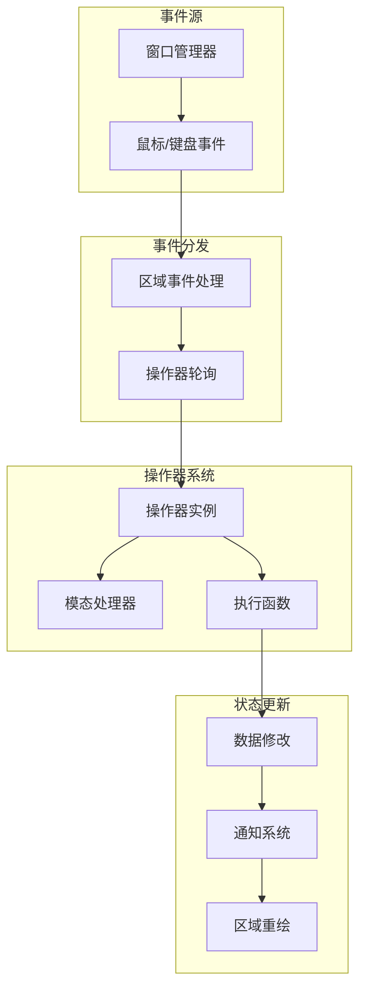
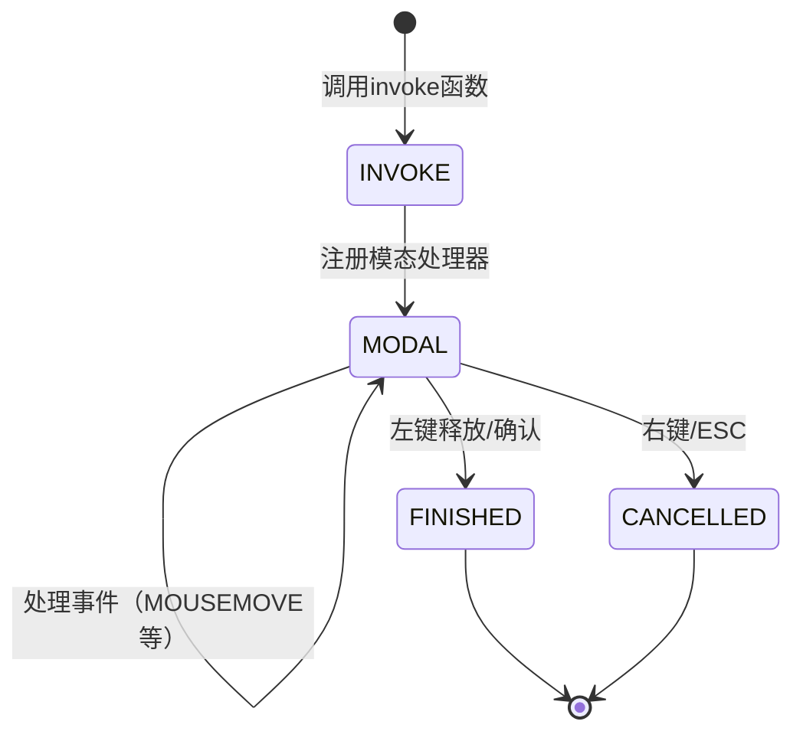
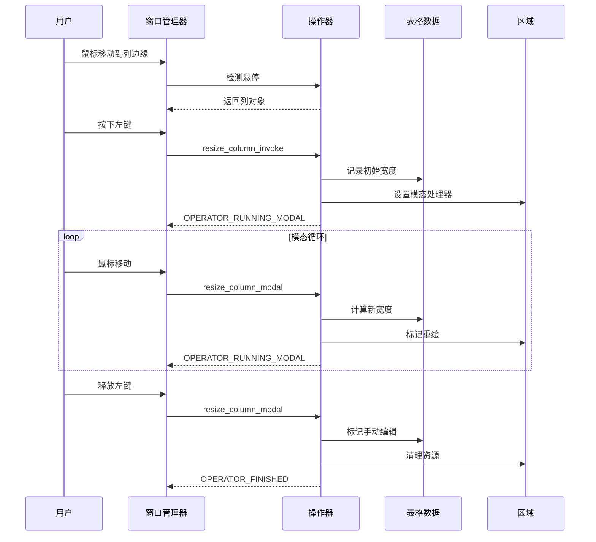
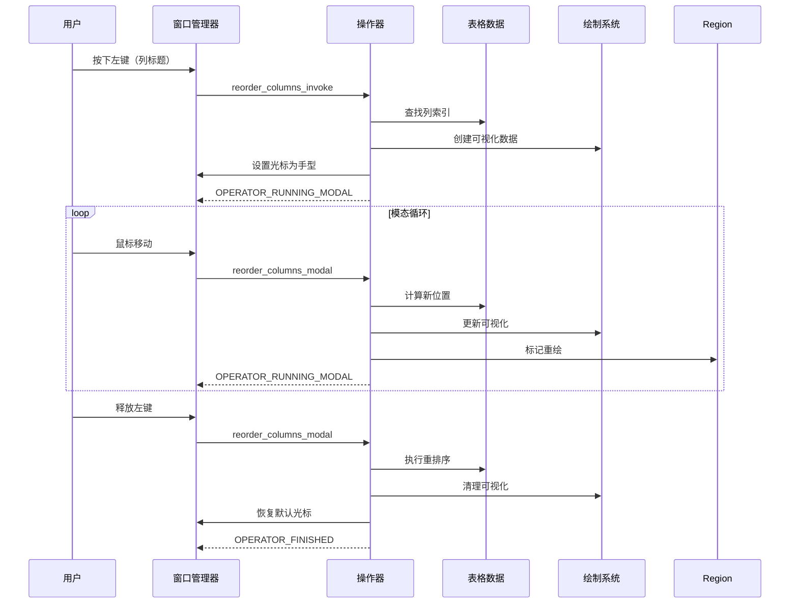

# Blender 电子表格系统 - UI事件处理与用户交互

## 目录
- [1. 事件处理架构概述](#1-事件处理架构概述)
- [2. 操作器系统](#2-操作器系统)
  - [2.1. 操作器类型](#21-操作器类型)
  - [2.2. 操作器生命周期](#22-操作器生命周期)
- [3. 核心交互操作](#3-核心交互操作)
  - [3.1. 列调整操作](#31-列调整操作)
  - [3.2. 列重排序操作](#32-列重排序操作)
  - [3.3. 列宽自适应操作](#33-列宽自适应操作)
  - [3.4. 行过滤器操作](#34-行过滤器操作)
  - [3.5. 数据源切换操作](#35-数据源切换操作)
- [4. 鼠标事件处理](#4-鼠标事件处理)
  - [4.1. 悬停检测](#41-悬停检测)
  - [4.2. 边缘检测算法](#42-边缘检测算法)
  - [4.3. 滚动处理](#43-滚动处理)
- [5. 键盘事件处理](#5-键盘事件处理)
- [6. 模态操作器](#6-模态操作器)
  - [6.1. 模态状态机](#61-模态状态机)
  - [6.2. 事件分发](#62-事件分发)
- [7. 通知系统](#7-通知系统)
  - [7.1. 通知类型](#71-通知类型)
  - [7.2. 通知传递](#72-通知传递)
- [8. UI面板系统](#8-ui面板系统)
  - [8.1. 面板类型](#81-面板类型)
  - [8.2. 实例化面板](#82-实例化面板)
  - [8.3. 面板交互](#83-面板交互)
- [9. 视图2D系统集成](#9-视图2d系统集成)
  - [9.1. View2D结构](#91-view2d结构)
  - [9.2. 坐标转换](#92-坐标转换)
  - [9.3. 滚动管理](#93-滚动管理)
- [10. 交互流程图](#10-交互流程图)
  - [10.1. 列调整流程](#101-列调整流程)
  - [10.2. 重排序流程](#102-重排序流程)
  - [10.3. 过滤器编辑流程](#103-过滤器编辑流程)

---

## 1. 事件处理架构概述

电子表格系统的UI事件处理基于Blender的窗口管理器（Window Manager）和操作器（Operator）系统。



<span style="background-color: #0d9488; color: white; padding: 2px 8px; border-radius: 4px;">★ Insight</span>
事件处理的核心是**操作器模式**：
- **一次性操作**：如添加过滤器、切换数据源
- **模态操作**：如调整列宽、重排序列，需要持续交互
- **UI面板操作**：如过滤器配置，通过RNA属性系统

---

## 2. 操作器系统

### 2.1. 操作器类型

电子表格系统定义了以下操作器：

```cpp
// spreadsheet_ops.cc

void spreadsheet_operatortypes()
{
  WM_operatortype_append(SPREADSHEET_OT_add_row_filter_rule);
  WM_operatortype_append(SPREADSHEET_OT_remove_row_filter_rule);
  WM_operatortype_append(SPREADSHEET_OT_change_spreadsheet_data_source);
  WM_operatortype_append(SPREADSHEET_OT_resize_column);
  WM_operatortype_append(SPREADSHEET_OT_fit_column);
  WM_operatortype_append(SPREADSHEET_OT_reorder_columns);
}
```

### 2.2. 操作器生命周期

#### 2.2.1. 一次性操作器

```cpp
static wmOperatorStatus row_filter_add_exec(bContext *C, wmOperator * /*op*/)
{
  SpaceSpreadsheet *sspreadsheet = CTX_wm_space_spreadsheet(C);

  // 1. 创建新的行过滤器
  SpreadsheetRowFilter *row_filter = spreadsheet_row_filter_new();

  // 2. 添加到过滤器列表
  BLI_addtail(&sspreadsheet->row_filters, row_filter);

  // 3. 发送通知触发重绘
  WM_event_add_notifier(C, NC_SPACE | ND_SPACE_SPREADSHEET, sspreadsheet);

  return OPERATOR_FINISHED;
}

static void SPREADSHEET_OT_add_row_filter_rule(wmOperatorType *ot)
{
  ot->name = "Add Row Filter";
  ot->description = "Add a filter to remove rows from the displayed data";
  ot->idname = "SPREADSHEET_OT_add_row_filter_rule";

  ot->exec = row_filter_add_exec;
  ot->poll = ED_operator_spreadsheet_active;  // 活性检查

  ot->flag = OPTYPE_REGISTER | OPTYPE_UNDO;  // 注册到撤销栈
}
```

#### 2.2.2. 活性检查函数

```cpp
// ED_spreadsheet.hh
bool ED_operator_spreadsheet_active(bContext *C)
{
  SpaceSpreadsheet *sspreadsheet = CTX_wm_space_spreadsheet(C);
  if (!sspreadsheet) {
    return false;
  }
  // 可以添加更多检查，如是否有活动表格
  return true;
}
```

---

## 3. 核心交互操作

### 3.1. 列调整操作

列调整是一个**模态操作器**，需要持续的鼠标交互。

#### 3.1.1. 调用入口

```cpp
static wmOperatorStatus resize_column_invoke(bContext *C, wmOperator *op, const wmEvent *event)
{
  ARegion ®ion = *CTX_wm_region(C);
  SpaceSpreadsheet &sspreadsheet = *CTX_wm_space_spreadsheet(C);

  const int2 cursor_re{event->mval[0], event->mval[1]};

  // 1. 检测是否点击了列边缘
  SpreadsheetColumn *column_to_resize = find_hovered_column_header_edge(
      sspreadsheet, region, cursor_re);

  if (!column_to_resize) {
    return OPERATOR_PASS_THROUGH;  // 传递给其他操作器
  }

  // 2. 初始化操作数据
  ResizeColumnData *data = MEM_new<ResizeColumnData>(__func__);
  data->column = column_to_resize;
  data->initial_cursor_re = cursor_re;
  data->initial_width_px = column_to_resize->width * SPREADSHEET_WIDTH_UNIT;
  op->customdata = data;

  // 3. 注册模态处理器
  WM_event_add_modal_handler(C, op);
  return OPERATOR_RUNNING_MODAL;
}
```

#### 3.1.2. 模态处理

```cpp
static wmOperatorStatus resize_column_modal(bContext *C, wmOperator *op, const wmEvent *event)
{
  ARegion ®ion = *CTX_wm_region(C);
  SpaceSpreadsheet &sspreadsheet = *CTX_wm_space_spreadsheet(C);
  SpreadsheetTable &table = *get_active_table(sspreadsheet);
  ResizeColumnData &data = *static_cast<ResizeColumnData *>(op->customdata);

  // 辅助lambda：取消操作
  auto cancel = [&]() {
    data.column->width = data.initial_width_px / SPREADSHEET_WIDTH_UNIT;
    MEM_delete(&data);
    ED_region_tag_redraw(®ion);
    return OPERATOR_CANCELLED;
  };

  // 辅助lambda：完成操作
  auto finish = [&]() {
    table.flag |= SPREADSHEET_TABLE_FLAG_MANUALLY_EDITED;
    MEM_delete(&data);
    ED_region_tag_redraw(®ion);
    return OPERATOR_FINISHED;
  };

  const int2 cursor_re{event->mval[0], event->mval[1]};

  switch (event->type) {
    case RIGHTMOUSE:
    case EVT_ESCKEY:
      return cancel();  // 取消

    case LEFTMOUSE:
      return finish();  // 完成

    case MOUSEMOVE: {
      // 计算新宽度
      const int offset = cursor_re.x - data.initial_cursor_re.x;
      const float new_width_px = std::max<float>(
          SPREADSHEET_WIDTH_UNIT,
          data.initial_width_px + offset);

      data.column->width = new_width_px / SPREADSHEET_WIDTH_UNIT;
      ED_region_tag_redraw(®ion);
      return OPERATOR_RUNNING_MODAL;  // 继续
    }

    default:
      return OPERATOR_RUNNING_MODAL;
  }
}
```

#### 3.1.3. 边缘检测

```cpp
SpreadsheetColumn *find_hovered_column_edge(SpaceSpreadsheet &sspreadsheet,
                                            ARegion ®ion,
                                            const int2 &cursor_re)
{
  SpreadsheetTable *table = get_active_table(sspreadsheet);
  if (!table) {
    return nullptr;
  }

  // 将屏幕坐标转换为视图坐标
  const float cursor_x_view = ui::view2d_region_to_view_x(®ion.v2d, cursor_re.x);

  for (SpreadsheetColumn *column : Span{table->columns, table->num_columns}) {
    if (column->flag & SPREADSHEET_COLUMN_FLAG_UNAVAILABLE) {
      continue;
    }

    // 检查光标是否在列右边缘的活动区域内
    if (std::abs(cursor_x_view - column->runtime->right_x) < SPREADSHEET_EDGE_ACTION_ZONE) {
      return column;
    }
  }
  return nullptr;
}
```

### 3.2. 列重排序操作

#### 3.2.1. 重排序数据结构

```cpp
struct ReorderColumnData {
  SpreadsheetColumn *column = nullptr;
  int initial_cursor_x_view = 0;
  ui::View2DEdgePanData pan_data{};  // 边缘滚动数据
};

struct ReorderColumnVisualizationData {
  int old_index;              // 原始位置
  int new_index;              // 新位置
  int current_offset_x_px;    // 当前偏移
};
```

#### 3.2.2. 重排序调用

```cpp
static wmOperatorStatus reorder_columns_invoke(bContext *C, wmOperator *op, const wmEvent *event)
{
  SpaceSpreadsheet &sspreadsheet = *CTX_wm_space_spreadsheet(C);
  ARegion ®ion = *CTX_wm_region(C);

  const int2 cursor_re{event->mval[0], event->mval[1]};

  // 1. 检查是否在边缘（避免与调整大小冲突）
  if (find_hovered_column_edge(sspreadsheet, region, cursor_re)) {
    return OPERATOR_PASS_THROUGH;
  }

  // 2. 查找要移动的列
  SpreadsheetColumn *column_to_move = find_hovered_column_header(sspreadsheet, region, cursor_re);
  if (!column_to_move) {
    return OPERATOR_PASS_THROUGH;
  }

  // 3. 设置光标
  WM_cursor_set(CTX_wm_window(C), WM_CURSOR_HAND_CLOSED);

  // 4. 获取旧索引
  SpreadsheetTable *table = get_active_table(sspreadsheet);
  const int old_index = Span{table->columns, table->num_columns}.first_index(column_to_move);

  // 5. 初始化数据
  ReorderColumnData *data = MEM_new<ReorderColumnData>(__func__);
  data->column = column_to_move;
  data->initial_cursor_x_view = ui::view2d_region_to_view_x(®ion.v2d, cursor_re.x);
  op->customdata = data;

  // 6. 初始化可视化数据
  ReorderColumnVisualizationData &visualization_data =
      sspreadsheet.runtime->reorder_column_visualization_data.emplace();
  visualization_data.old_index = old_index;
  visualization_data.new_index = old_index;
  visualization_data.current_offset_x_px = 0;

  // 7. 设置边缘滚动
  view2d_edge_pan_init(C, &data->pan_data, 0, 0, 1, 26, 0.5f, 0.0f);
  data->pan_data.limit.xmin = region.v2d.tot.xmin;
  data->pan_data.limit.xmax = region.v2d.tot.xmax;
  data->pan_data.limit.ymin = region.v2d.cur.ymin;
  data->pan_data.limit.ymax = region.v2d.cur.ymax;

  // 8. 注册模态处理器
  WM_event_add_modal_handler(C, op);
  return OPERATOR_RUNNING_MODAL;
}
```

#### 3.2.3. 重排序模态处理

```cpp
static wmOperatorStatus reorder_columns_modal(bContext *C, wmOperator *op, const wmEvent *event)
{
  SpaceSpreadsheet &sspreadsheet = *CTX_wm_space_spreadsheet(C);
  ARegion ®ion = *CTX_wm_region(C);

  const int2 cursor_re{event->mval[0], event->mval[1]};
  ReorderColumnData &data = *static_cast<ReorderColumnData *>(op->customdata);

  SpreadsheetTable &table = *get_active_table(sspreadsheet);
  Span<SpreadsheetColumn *> columns(table.columns, table.num_columns);

  const int old_index = columns.first_index(data.column);
  int new_index = 0;

  // 1. 确定新位置
  SpreadsheetColumn *hovered_column = find_hovered_column(sspreadsheet, region, cursor_re);
  if (hovered_column) {
    new_index = columns.first_index(hovered_column);
  } else {
    // 边界情况：放在最左或最右
    if (cursor_re.x > sspreadsheet.runtime->left_column_width) {
      new_index = *find_last_available_column_index(table);
    } else {
      new_index = *find_first_available_column_index(table);
    }
  }

  // 2. 清理函数
  auto cleanup_on_finish = [&]() {
    sspreadsheet.runtime->reorder_column_visualization_data.reset();
    MEM_delete(&data);
    ED_region_tag_redraw(®ion);
    WM_cursor_set(CTX_wm_window(C), WM_CURSOR_DEFAULT);
  };

  // 3. 处理不同事件
  switch (event->type) {
    case RIGHTMOUSE:
    case EVT_ESCKEY:
      view2d_edge_pan_cancel(C, &data.pan_data);
      cleanup_on_finish();
      return OPERATOR_CANCELLED;

    case LEFTMOUSE:
      if (old_index != new_index) {
        // 执行重排序
        dna::array::move_index(table.columns, table.num_columns, old_index, new_index);
      }
      table.flag |= SPREADSHEET_TABLE_FLAG_MANUALLY_EDITED;
      cleanup_on_finish();
      return OPERATOR_FINISHED;

    case MOUSEMOVE:
      // 应用边缘滚动
      view2d_edge_pan_apply(C, &data.pan_data, event->xy);

      // 更新可视化数据
      ReorderColumnVisualizationData &visualization_data =
          *sspreadsheet.runtime->reorder_column_visualization_data;
      visualization_data.new_index = new_index;
      visualization_data.current_offset_x_px =
          ui::view2d_region_to_view_x(®ion.v2d, cursor_re.x) - data.initial_cursor_x_view;

      ED_region_tag_redraw(®ion);
      return OPERATOR_RUNNING_MODAL;

    default:
      return OPERATOR_RUNNING_MODAL;
  }
}
```

### 3.3. 列宽自适应操作

```cpp
static wmOperatorStatus fit_column_invoke(bContext *C, wmOperator * /*op*/, const wmEvent *event)
{
  SpaceSpreadsheet &sspreadsheet = *CTX_wm_space_spreadsheet(C);
  ARegion ®ion = *CTX_wm_region(C);

  // 1. 获取数据源
  std::unique_ptr<DataSource> data_source = get_data_source(*C);
  if (!data_source) {
    return OPERATOR_CANCELLED;
  }

  // 2. 查找要调整的列
  const int2 cursor_re{event->mval[0], event->mval[1]};
  SpreadsheetColumn *column = find_hovered_column_header_edge(sspreadsheet, region, cursor_re);
  if (!column) {
    return OPERATOR_PASS_THROUGH;
  }

  // 3. 获取列值
  std::unique_ptr<ColumnValues> values = data_source->get_column_values(*column->id);
  if (!values) {
    return OPERATOR_CANCELLED;
  }

  // 4. 计算并设置宽度
  SpreadsheetTable &table = *get_active_table(sspreadsheet);
  table.flag |= SPREADSHEET_TABLE_FLAG_MANUALLY_EDITED;

  const float width_px = values->fit_column_width_px();
  column->width = width_px / SPREADSHEET_WIDTH_UNIT;

  ED_region_tag_redraw(®ion);
  return OPERATOR_FINISHED;
}
```

### 3.4. 行过滤器操作

#### 3.4.1. 添加过滤器

```cpp
static wmOperatorStatus row_filter_add_exec(bContext *C, wmOperator * /*op*/)
{
  SpaceSpreadsheet *sspreadsheet = CTX_wm_space_spreadsheet(C);

  SpreadsheetRowFilter *row_filter = spreadsheet_row_filter_new();
  BLI_addtail(&sspreadsheet->row_filters, row_filter);

  WM_event_add_notifier(C, NC_SPACE | ND_SPACE_SPREADSHEET, sspreadsheet);

  return OPERATOR_FINISHED;
}
```

#### 3.4.2. 删除过滤器

```cpp
static wmOperatorStatus row_filter_remove_exec(bContext *C, wmOperator *op)
{
  SpaceSpreadsheet *sspreadsheet = CTX_wm_space_spreadsheet(C);

  // 通过索引查找过滤器
  SpreadsheetRowFilter *row_filter = (SpreadsheetRowFilter *)BLI_findlink(
      &sspreadsheet->row_filters, RNA_int_get(op->ptr, "index"));

  if (row_filter == nullptr) {
    return OPERATOR_CANCELLED;
  }

  // 从列表中移除并释放
  BLI_remlink(&sspreadsheet->row_filters, row_filter);
  spreadsheet_row_filter_free(row_filter);

  WM_event_add_notifier(C, NC_SPACE | ND_SPACE_SPREADSHEET, sspreadsheet);

  return OPERATOR_FINISHED;
}
```

### 3.5. 数据源切换操作

```cpp
static wmOperatorStatus select_component_domain_invoke(bContext *C,
                                                       wmOperator *op,
                                                       const wmEvent * /*event*/)
{
  // 从RNA参数获取组件类型和属性域
  const auto component_type = bke::GeometryComponent::Type(
      RNA_int_get(op->ptr, "component_type"));
  bke::AttrDomain domain = bke::AttrDomain(
      RNA_int_get(op->ptr, "attribute_domain_type"));

  SpaceSpreadsheet *sspreadsheet = CTX_wm_space_spreadsheet(C);

  // 更新几何ID
  sspreadsheet->geometry_id.geometry_component_type = uint8_t(component_type);
  sspreadsheet->geometry_id.attribute_domain = uint8_t(domain);

  // 触发全局重绘
  WM_main_add_notifier(NC_SPACE | ND_SPACE_SPREADSHEET, nullptr);

  return OPERATOR_FINISHED;
}
```

---

## 4. 鼠标事件处理

### 4.1. 悬停检测

#### 4.1.1. 检测函数层次

```cpp
// 第一层：检测是否在列边缘
SpreadsheetColumn *find_hovered_column_edge(...);

// 第二层：检测是否在列内
SpreadsheetColumn *find_hovered_column(...);

// 第三层：检测是否在列标题边缘
SpreadsheetColumn *find_hovered_column_header_edge(...);

// 第四层：检测是否在列标题
SpreadsheetColumn *find_hovered_column_header(...);
```

#### 4.1.2. 检测逻辑

```cpp
// 检测是否在列标题行
static bool is_hovering_header_row(const SpaceSpreadsheet &sspreadsheet,
                                   const ARegion ®ion,
                                   const int2 &cursor_re)
{
  const int region_height = BLI_rcti_size_y(®ion.winrct);
  return cursor_re.y >= region_height - sspreadsheet.runtime->top_row_height &&
         cursor_re.y <= region_height;
}

// 查找悬停列
SpreadsheetColumn *find_hovered_column(SpaceSpreadsheet &sspreadsheet,
                                       ARegion ®ion,
                                       const int2 &cursor_re)
{
  SpreadsheetTable *table = get_active_table(sspreadsheet);
  if (!table) {
    return nullptr;
  }

  // 坐标转换：屏幕 -> 视图
  const float cursor_x_view = ui::view2d_region_to_view_x(®ion.v2d, cursor_re.x);

  for (SpreadsheetColumn *column : Span{table->columns, table->num_columns}) {
    if (column->flag & SPREADSHEET_COLUMN_FLAG_UNAVAILABLE) {
      continue;
    }

    // 检查X坐标是否在列范围内
    if (cursor_x_view > column->runtime->left_x &&
        cursor_x_view <= column->runtime->right_x) {
      return column;
    }
  }
  return nullptr;
}
```

### 4.2. 边缘检测算法

#### 4.2.1. 边缘区域定义

```cpp
// spreadsheet_intern.hh
#define SPREADSHEET_EDGE_ACTION_ZONE 5.0f  // 像素
```

#### 4.2.2. 边缘检测公式

对于列 `i`，其右边缘位置为：

$$
\text{right\_x}_i = \sum_{j=0}^{i} \text{width}_j
$$

光标在边缘区域内的条件：

$$
|\text{cursor\_x} - \text{right\_x}_i| < \text{SPREADSHEET\_EDGE\_ACTION\_ZONE}
$$

### 4.3. 滚动处理

#### 4.3.1. View2D系统

电子表格使用Blender的View2D系统处理滚动：

```cpp
// 更新滚动区域大小
static void update_view2d_tot_rect(const SpreadsheetDrawer &drawer,
                                   ARegion *region,
                                   const int row_amount)
{
  int column_width_sum = 0;
  for (const int column_index : IndexRange(drawer.tot_columns)) {
    column_width_sum += drawer.column_width(column_index);
  }

  const int right_padding = UI_UNIT_X * 0.5f;

  ui::view2d_totRect_set(®ion->v2d,
                         column_width_sum + drawer.left_column_width + right_padding,
                         row_amount * drawer.row_height + drawer.top_row_height);
}
```

#### 4.3.2. 滚动偏移计算

```cpp
// 在绘制函数中
View2D *v2d = ®ion->v2d;
const int scroll_offset_y = v2d->cur.ymax;  // 垂直滚动
const int scroll_offset_x = v2d->cur.xmin;  // 水平滚动
```

#### 4.3.3. 边缘滚动（用于重排序）

```cpp
// 初始化边缘滚动
view2d_edge_pan_init(C, &data->pan_data, 0, 0, 1, 26, 0.5f, 0.0f);

// 应用边缘滚动
view2d_edge_pan_apply(C, &data->pan_data, event->xy);

// 取消边缘滚动
view2d_edge_pan_cancel(C, &data->pan_data);
```

---

## 5. 键盘事件处理

电子表格系统目前没有定义专门的键盘操作器，但支持以下通用操作：

- **Esc**: 取消模态操作
- **Enter**: 完成模态操作
- **Ctrl+Z**: 撤销（通过OPTYPE_UNDO标志）
- **Ctrl+Shift+Z**: 重做

---

## 6. 模态操作器

### 6.1. 模态状态机

模态操作器有三种状态：



#### 6.1.1. 状态转换

```cpp
// INVOKE -> MODAL
WM_event_add_modal_handler(C, op);
return OPERATOR_RUNNING_MODAL;

// MODAL -> FINISHED
case LEFTMOUSE:
  return OPERATOR_FINISHED;

// MODAL -> CANCELLED
case RIGHTMOUSE:
case EVT_ESCKEY:
  return OPERATOR_CANCELLED;

// MODAL -> MODAL
case MOUSEMOVE:
  return OPERATOR_RUNNING_MODAL;
```

### 6.2. 事件分发

#### 6.2.1. 事件类型

```cpp
// 鼠标事件
LEFTMOUSE      // 左键
RIGHTMOUSE     // 右键
MOUSEMOVE      // 移动
WHEELLEFTMOUSE // 滚轮左
WHEELRIGHTMOUSE// 滚轮右

// 键盘事件
EVT_ESCKEY     // Esc
EVT_RETKEY     // Enter
```

#### 6.2.2. 事件处理模式

```cpp
switch (event->type) {
  case RIGHTMOUSE:
  case EVT_ESCKEY:
    // 取消操作
    return OPERATOR_CANCELLED;

  case LEFTMOUSE:
    // 完成操作
    return OPERATOR_FINISHED;

  case MOUSEMOVE:
    // 更新状态
    return OPERATOR_RUNNING_MODAL;

  case WHEELLEFTMOUSE:
  case WHEELRIGHTMOUSE:
    // 传递给滚动系统
    return OPERATOR_PASS_THROUGH;

  default:
    // 继续等待
    return OPERATOR_RUNNING_MODAL;
}
```

---

## 7. 通知系统

### 7.1. 通知类型

```cpp
// 电子表格专用通知
NC_SPACE | ND_SPACE_SPREADSHEET

// 通知示例
WM_event_add_notifier(C, NC_SPACE | ND_SPACE_SPREADSHEET, sspreadsheet);
WM_main_add_notifier(NC_SPACE | ND_SPACE_SPREADSHEET, nullptr);
```

### 7.2. 通知传递

#### 7.2.1. 局部通知

```cpp
// 仅更新当前电子表格区域
WM_event_add_notifier(C, NC_SPACE | ND_SPACE_SPREADSHEET, sspreadsheet);
```

#### 7.2.2. 全局通知

```cpp
// 更新所有电子表格区域
WM_main_add_notifier(NC_SPACE | ND_SPACE_SPREADSHEET, nullptr);
```

#### 7.2.3. 通知处理

当通知触发时：
1. 区域的 `draw` 函数被调用
2. 数据源被重新获取
3. 表格被更新
4. 重新计算布局
5. 重新绘制UI

---

## 8. UI面板系统

### 8.1. 面板类型

电子表格使用两种面板：

1. **主面板**：数据源选择、过滤器列表
2. **实例化面板**：每个过滤器的配置面板

### 8.2. 实例化面板

#### 8.2.1. 面板注册

**定义位置**: `spreadsheet_row_filter_ui.cc:365-392`

```cpp
void register_row_filter_panels(ARegionType ®ion_type)
{
  // 1. 过滤器列表面板
  {
    PanelType *panel_type = MEM_callocN<PanelType>(__func__);
    STRNCPY_UTF8(panel_type->idname, "SPREADSHEET_PT_row_filters");
    STRNCPY_UTF8(panel_type->label, N_("Filters"));
    STRNCPY_UTF8(panel_type->category, "Filters");
    panel_type->flag = PANEL_TYPE_NO_HEADER;
    panel_type->draw = spreadsheet_row_filters_layout;
    BLI_addtail(®ion_type.paneltypes, panel_type);
  }

  // 2. 单个过滤器面板（实例化）
  {
    PanelType *panel_type = MEM_callocN<PanelType>(__func__);
    STRNCPY_UTF8(panel_type->idname, "SPREADSHEET_PT_filter");
    STRNCPY_UTF8(panel_type->label, "");
    STRNCPY_UTF8(panel_type->category, "Filters");
    panel_type->flag = PANEL_TYPE_INSTANCED | PANEL_TYPE_HEADER_EXPAND;
    panel_type->draw_header = spreadsheet_filter_panel_draw_header;
    panel_type->draw = spreadsheet_filter_panel_draw;
    panel_type->get_list_data_expand_flag = get_filter_expand_flag;
    panel_type->set_list_data_expand_flag = set_filter_expand_flag;
    panel_type->reorder = filter_reorder;
    BLI_addtail(®ion_type.paneltypes, panel_type);
  }
}
```

#### 8.2.2. 面板绘制

```cpp
static void spreadsheet_row_filters_layout(const bContext *C, Panel *panel)
{
  ui::Layout &layout = *panel->layout;
  SpaceSpreadsheet *sspreadsheet = CTX_wm_space_spreadsheet(C);
  ListBase *row_filters = &sspreadsheet->row_filters;

  // 1. 添加按钮
  layout.op("SPREADSHEET_OT_add_row_filter_rule", std::nullopt, ICON_ADD);

  // 2. 检查面板是否需要更新
  const bool panels_match = ui::panel_list_matches_data(region, row_filters, filter_panel_id_fn);

  if (!panels_match) {
    // 3. 释放旧面板
    ui::panels_free_instanced(C, region);

    // 4. 创建新面板
    LISTBASE_FOREACH (SpreadsheetRowFilter *, row_filter, row_filters) {
      char panel_idname[MAX_NAME];
      filter_panel_id_fn(row_filter, panel_idname);

      PointerRNA *filter_ptr = MEM_new<PointerRNA>("panel customdata");
      *filter_ptr = RNA_pointer_create_discrete(
          &screen->id, &RNA_SpreadsheetRowFilter, row_filter);

      ui::panel_add_instanced(C, region, ®ion->panels, panel_idname, filter_ptr);
    }
  } else {
    // 5. 更新现有面板的自定义数据
    update_panel_custom_data(C, region, row_filters);
  }
}
```

### 8.3. 面板交互

#### 8.3.1. 面板头绘制

```cpp
static void spreadsheet_filter_panel_draw_header(const bContext *C, Panel *panel)
{
  ui::Layout &layout = *panel->layout;
  SpaceSpreadsheet *sspreadsheet = CTX_wm_space_spreadsheet(C);
  PointerRNA *filter_ptr = ui::panel_custom_data_get(panel);
  const SpreadsheetRowFilter *filter = (SpreadsheetRowFilter *)filter_ptr->data;

  // 1. 启用复选框
  ui::Layout *row = &layout.row(true);
  row->emboss_set(ui::EmbossType::None);
  row->prop(filter_ptr, "enabled", ui::ITEM_R_ICON_ONLY, "", ICON_NONE);

  // 2. 显示过滤器描述
  if (filter->column_name.is_empty()) {
    row->label(IFACE_("Filter"), ICON_NONE);
  } else {
    // 显示：列名 操作符 值
    const eSpreadsheetColumnValueType data_type = (eSpreadsheetColumnValueType)column->data_type;
    std::stringstream ss;
    ss << filter->column_name;
    ss << " ";
    ss << operation_string(data_type, operation);
    ss << " ";
    ss << value_string(*filter, data_type);
    row->label(ss.str(), ICON_NONE);
  }

  // 3. 删除按钮
  row = &layout.row(true);
  row->emboss_set(ui::EmbossType::None);
  const int current_index = BLI_findindex(&sspreadsheet->row_filters, filter);
  PointerRNA op_ptr = row->op("SPREADSHEET_OT_remove_row_filter_rule", "", ICON_X);
  RNA_int_set(&op_ptr, "index", current_index);
}
```

#### 8.3.2. 面板内容绘制

```cpp
static void spreadsheet_filter_panel_draw(const bContext *C, Panel *panel)
{
  ui::Layout &layout = *panel->layout;
  SpaceSpreadsheet *sspreadsheet = CTX_wm_space_spreadsheet(C);
  PointerRNA *filter_ptr = ui::panel_custom_data_get(panel);
  SpreadsheetRowFilter *filter = (SpreadsheetRowFilter *)filter_ptr->data;

  layout.use_property_split_set(true);

  // 1. 列名选择
  layout.prop(filter_ptr, "column_name", UI_ITEM_NONE, IFACE_("Column"), ICON_NONE);

  // 2. 根据数据类型显示不同控件
  switch (static_cast<eSpreadsheetColumnValueType>(column->data_type)) {
    case SPREADSHEET_VALUE_TYPE_INT32:
      layout.prop(filter_ptr, "operation", UI_ITEM_NONE, std::nullopt, ICON_NONE);
      layout.prop(filter_ptr, "value_int", UI_ITEM_NONE, IFACE_("Value"), ICON_NONE);
      break;

    case SPREADSHEET_VALUE_TYPE_FLOAT:
      layout.prop(filter_ptr, "operation", UI_ITEM_NONE, std::nullopt, ICON_NONE);
      layout.prop(filter_ptr, "value_float", UI_ITEM_NONE, IFACE_("Value"), ICON_NONE);
      if (operation == SPREADSHEET_ROW_FILTER_EQUAL) {
        layout.prop(filter_ptr, "threshold", UI_ITEM_NONE, std::nullopt, ICON_NONE);
      }
      break;

    case SPREADSHEET_VALUE_TYPE_BOOL:
      layout.prop(filter_ptr, "value_boolean", UI_ITEM_NONE, IFACE_("Value"), ICON_NONE);
      break;

    // ... 其他类型
  }
}
```

---

## 9. 视图2D系统集成

### 9.1. View2D结构

```cpp
typedef struct View2D {
  rctf tot;   // 总内容区域
  rctf cur;   // 当前可见区域
  rcti vert;  // 垂直滚动条区域
  rcti hor;   // 水平滚动条区域
  // ... 其他字段
} View2D;
```

### 9.2. 坐标转换

#### 9.2.1. 屏幕到视图

```cpp
// 屏幕坐标 -> 视图坐标
float cursor_x_view = ui::view2d_region_to_view_x(®ion.v2d, cursor_re.x);
```

#### 9.2.2. 视图到屏幕

```cpp
// 视图坐标 -> 屏幕坐标
float screen_x = ui::view2d_view_to_region_x(®ion.v2d, view_x);
```

#### 9.2.3. 转换公式

$$
\text{view\_x} = \text{screen\_x} + \text{cur}.xmin
$$

$$
\text{screen\_x} = \text{view\_x} - \text{cur}.xmin
$$

### 9.3. 滚动管理

#### 9.3.1. 滚动偏移

```cpp
// 垂直滚动偏移（向下为正）
const int scroll_offset_y = v2d->cur.ymax;

// 水平滚动偏移（向右为正）
const int scroll_offset_x = v2d->cur.xmin;
```

#### 9.3.2. 滚动范围

```cpp
// 内容总大小
v2d->tot.xmin = 0;
v2d->tot.xmax = total_width;
v2d->tot.ymin = 0;
v2d->tot.ymax = total_height;

// 可见区域
v2d->cur.xmin = scroll_x;
v2d->cur.xmax = scroll_x + visible_width;
v2d->cur.ymin = scroll_y;
v2d->cur.ymax = scroll_y + visible_height;
```

#### 9.3.3. 滚动条绘制

```cpp
// 在draw函数末尾
rcti scroller_mask;
BLI_rcti_init(&scroller_mask,
              drawer.left_column_width,
              region->winx,
              0,
              region->winy - drawer.top_row_height);
ui::view2d_scrollers_draw(v2d, &scroller_mask);
```

---

## 10. 交互流程图

### 10.1. 列调整流程



### 10.2. 重排序流程



### 10.3. 过滤器编辑流程

```mermaid
graph TD
    A[用户点击添加过滤器] --> B[执行 SPREADSHEET_OT_add_row_filter_rule]
    B --> C[创建 SpreadsheetRowFilter]
    C --> D[添加到 row_filters 列表]
    D --> E[发送通知 NC_SPACE|ND_SPACE_SPREADSHEET]
    E --> F[面板系统重建实例化面板]
    F --> G[用户编辑过滤器属性]
    G --> H[RNA属性更新]
    H --> I[触发重绘]
    I --> J[应用过滤器并更新显示]
```

---

## 总结

电子表格系统的UI事件处理体现了以下设计原则：

1. **操作器模式**：所有交互通过操作器实现，支持撤销/重做
2. **模态状态机**：复杂交互使用模态操作器管理状态
3. **坐标系统**：View2D系统统一管理滚动和坐标转换
4. **通知机制**：数据变化通过通知触发UI更新
5. **面板系统**：使用实例化面板管理动态UI元素
6. **边缘检测**：精确的悬停区域检测提升用户体验

这些机制共同构成了一个响应迅速、功能完整的UI交互系统。

---

**文档版本**: 1.0
**最后更新**: 2025-12-19
**适用版本**: Blender 4.3+
