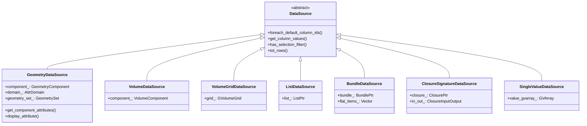
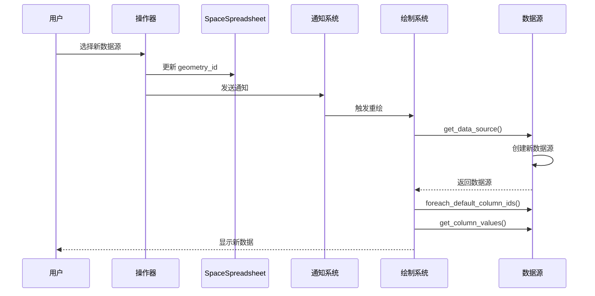

# Blender 电子表格系统 - 数据源管理与绑定

## 目录
- [1. 数据源架构概述](#1-数据源架构概述)
- [2. DataSource 抽象基类](#2-datasource-抽象基类)
  - [2.1. 核心接口](#21-核心接口)
  - [2.2. 虚函数定义](#22-虚函数定义)
- [3. 几何数据源](#3-几何数据源)
  - [3.1. GeometryDataSource 类](#31-geometrydatasource-类)
  - [3.2. 几何组件类型](#32-几何组件类型)
  - [3.3. 属性域](#33-属性域)
- [4. 其他数据源类型](#4-其他数据源类型)
  - [4.1. VolumeDataSource](#41-volumedatasource)
  - [4.2. VolumeGridDataSource](#42-volumegriddatasource)
  - [4.3. ListDataSource](#43-listdatasource)
  - [4.4. BundleDataSource](#44-bundledatasource)
  - [4.5. ClosureSignatureDataSource](#45-closuresignaturedatasource)
  - [4.6. SingleValueDataSource](#46-singlevaluedatasource)
- [5. 数据源获取流程](#5-数据源获取流程)
  - [5.1. 上下文获取](#51-上下文获取)
  - [5.2. 几何数据提取](#52-几何数据提取)
  - [5.3. 实例导航](#53-实例导航)
- [6. 列值管理](#6-列值管理)
  - [6.1. ColumnValues 类](#61-columnvalues-类)
  - [6.2. 通用虚拟数组 (GVArray)](#62-通用虚拟数组-gvarray)
  - [6.3. 列宽计算](#63-列宽计算)
- [7. 属性访问系统](#7-属性访问系统)
  - [7.1. AttributeAccessor](#71-attributeaccessor)
  - [7.2. 属性过滤](#72-属性过滤)
  - [7.3. 匿名属性处理](#73-匿名属性处理)
- [8. 实例引用系统](#8-实例引用系统)
  - [8.1. InstanceReference](#81-instancereference)
  - [8.2. 实例导航路径](#82-实例导航路径)
- [9. Bundle 和 Closure 支持](#9-bundle-和-closure-支持)
  - [9.1. Bundle 数据结构](#91-bundle-数据结构)
  - [9.2. Bundle 数据源](#92-bundle-数据源)
  - [9.3. Closure 签名数据源](#93-closure-签名数据源)
- [10. 数据绑定与更新](#10-数据绑定与更新)
  - [10.1. 数据源切换](#101-数据源切换)
  - [10.2. 缓存机制](#102-缓存机制)
  - [10.3. 响应式更新](#103-响应式更新)

---

## 1. 数据源架构概述

电子表格系统的数据源设计采用**策略模式**，通过抽象基类 `DataSource` 定义统一接口，不同的数据源类型实现具体的获取逻辑。



---

## 2. DataSource 抽象基类

### 2.1. 核心接口

**定义位置**: `source/blender/editors/space_spreadsheet/spreadsheet_data_source.hh`

```cpp
class DataSource {
 public:
  virtual ~DataSource();

  /**
   * 遍历所有默认列ID
   * @param fn: 回调函数，接收列ID和是否为特殊列（is_extra）的标志
   */
  virtual void foreach_default_column_ids(
      FunctionRef<void(const SpreadsheetColumnID &, bool is_extra)> fn) const;

  /**
   * 获取指定列的值
   * @param column_id: 列标识符
   * @return: 列值对象，如果列不存在返回空指针
   */
  virtual std::unique_ptr<ColumnValues> get_column_values(
      const SpreadsheetColumnID &column_id) const;

  /**
   * 是否支持选择过滤（编辑模式）
   */
  virtual bool has_selection_filter() const;

  /**
   * 获取总行数
   */
  virtual int tot_rows() const;
};
```

### 2.2. 虚函数定义

```cpp
// spreadsheet_data_source.cc
DataSource::~DataSource() = default;
```

<span style="background-color: #1e3a8a; color: white; padding: 2px 8px; border-radius: 4px;">★ 设计模式</span>

**策略模式的应用**：
- **解耦**：UI层不关心数据如何获取，只关心如何显示
- **扩展性**：新增数据源类型只需继承 `DataSource`
- **多态性**：统一接口，运行时动态选择数据源

---

## 3. 几何数据源

### 3.1. GeometryDataSource 类

**定义位置**: `source/blender/editors/space_spreadsheet/spreadsheet_data_source_geometry.cc`

```cpp
class GeometryDataSource : public DataSource {
 private:
  Object *object_orig_;              // 原始对象（用于编辑模式选择）
  bke::GeometrySet geometry_set_;    // 几何数据集
  bke::GeometryComponent::Type component_type_;  // 组件类型
  bke::AttrDomain domain_;           // 属性域
  bool show_internal_attributes_;    // 是否显示内部属性
  int layer_index_;                  // Grease Pencil层索引
  mutable std::mutex mutex_;         // 线程安全锁

 public:
  GeometryDataSource(Object *object_orig,
                     bke::GeometrySet geometry_set,
                     bke::GeometryComponent::Type component_type,
                     bke::AttrDomain domain,
                     bool show_internal_attributes,
                     int layer_index)
      : object_orig_(object_orig),
        geometry_set_(std::move(geometry_set)),
        component_type_(component_type),
        domain_(domain),
        show_internal_attributes_(show_internal_attributes),
        layer_index_(layer_index)
  {
  }

  // 实现基类接口
  void foreach_default_column_ids(
      FunctionRef<void(const SpreadsheetColumnID &, bool is_extra)> fn) const override;

  std::unique_ptr<ColumnValues> get_column_values(
      const SpreadsheetColumnID &column_id) const override;

  bool has_selection_filter() const override;

  int tot_rows() const override;

 private:
  // 辅助函数
  std::optional<const bke::AttributeAccessor> get_component_attributes() const;
  bool display_attribute(const StringRef name, const bke::AttrDomain domain) const;
  IndexMask apply_selection_filter(IndexMaskMemory &memory) const;
};
```

### 3.2. 几何组件类型

```cpp
// BKE_geometry_set.hh
namespace bke::GeometryComponent {
  enum Type {
    Mesh,          // 网格
    PointCloud,    // 点云
    Curve,         // 曲线
    Instance,      // 实例
    Volume,        // 体积
    GreasePencil,  // 蜡笔
  };
}
```

#### 3.2.1. 组件类型映射

| DNA 类型 | 几何组件 | 说明 |
|---------|---------|------|
| `OB_MESH` | `Mesh` | 多边形网格 |
| `OB_POINTCLOUD` | `PointCloud` | 点云数据 |
| `OB_CURVES` | `Curve` | 曲线（NURBS、贝塞尔等） |
| `OB_GREASE_PENCIL` | `GreasePencil` | 蜡笔数据 |

### 3.3. 属性域

```cpp
// BKE_attribute.hh
namespace bke::AttrDomain {
  enum Type {
    Point,    // 点（顶点）
    Edge,     // 边
    Face,     // 面
    Corner,   // 面角（循环）
    Layer,    // 层（蜡笔）
    Instance, // 实例
  };
}
```

#### 3.3.1. 域映射表

| 域 | 数据数量 | 适用组件 | 说明 |
|----|---------|---------|------|
| Point | 顶点数 | Mesh, PointCloud, Curve | 每个顶点一个值 |
| Edge | 边数 | Mesh | 每条边一个值 |
| Face | 面数 | Mesh | 每个面一个值 |
| Corner | 循环数 | Mesh | 每个面角一个值 |
| Layer | 层数 | GreasePencil | 每层一个值 |
| Instance | 实例数 | Instance | 每个实例一个值 |

---

## 4. 其他数据源类型

### 4.1. VolumeDataSource

**处理体积数据（OpenVDB）**

```cpp
class VolumeDataSource : public DataSource {
 private:
  bke::VolumeComponent component_;

 public:
  void foreach_default_column_ids(
      FunctionRef<void(const SpreadsheetColumnID &, bool is_extra)> fn) const override
  {
    // 列名：Grid Name, Data Type, Class, Extent, Voxels, Leaf Voxels, Tiles, Size
    for (const char *name : {"Grid Name", "Data Type", "Class", "Extent",
                             "Voxels", "Leaf Voxels", "Tiles", "Size"}) {
      SpreadsheetColumnID column_id{(char *)name};
      fn(column_id, false);
    }
  }

  std::unique_ptr<ColumnValues> get_column_values(
      const SpreadsheetColumnID &column_id) const override
  {
    // 根据列名返回不同的体积数据
    if (STREQ(column_id.name, "Grid Name")) {
      // 返回网格名称
    }
    // ... 其他列
  }

  int tot_rows() const override
  {
    // 返回网格数量
    return BKE_volume_num_grids(component_->get());
  }
};
```

### 4.2. VolumeGridDataSource

**处理单个体积网格**

```cpp
class VolumeGridDataSource : public DataSource {
 private:
  std::unique_ptr<bke::GVolumeGrid> grid_;

 public:
  void foreach_default_column_ids(...) const override
  {
    // 列名：Data Type, Class, Extent, Voxels, Leaf Voxels, Tiles, Size
  }

  std::unique_ptr<ColumnValues> get_column_values(...) const override
  {
    // 返回单个网格的属性
  }

  int tot_rows() const override
  {
    return 1;  // 单个网格
  }
};
```

### 4.3. ListDataSource

**处理节点列表数据**

```cpp
class ListDataSource : public DataSource {
 private:
  nodes::ListPtr list_;

 public:
  void foreach_default_column_ids(...) const override
  {
    SpreadsheetColumnID column_id{(char *)"Value"};
    fn(column_id, false);
  }

  std::unique_ptr<ColumnValues> get_column_values(...) const override
  {
    if (STREQ(column_id.name, "Value")) {
      return std::make_unique<ColumnValues>(IFACE_("Value"), list_->varray());
    }
    return {};
  }

  int tot_rows() const override
  {
    return list_->size();
  }
};
```

### 4.4. BundleDataSource

**处理 Bundle 数据（键值对集合）**

```cpp
class BundleDataSource : public DataSource {
 private:
  nodes::BundlePtr bundle_;
  Vector<std::string> flat_item_keys_;
  Vector<const nodes::BundleItemValue *> flat_items_;

 public:
  BundleDataSource(nodes::BundlePtr bundle) : bundle_(std::move(bundle))
  {
    // 递归展平所有 Bundle 项
    collect_flat_items(*bundle_, "");
  }

  void foreach_default_column_ids(...) const override
  {
    for (const char *name : {"Identifier", "Type", "Value"}) {
      SpreadsheetColumnID column_id{(char *)name};
      fn(column_id, false);
    }
  }

  std::unique_ptr<ColumnValues> get_column_values(...) const override
  {
    if (STREQ(column_id.name, "Identifier")) {
      // 返回所有键名
      return std::make_unique<ColumnValues>(
          IFACE_("Identifier"),
          VArray<std::string>::from_span(flat_item_keys_));
    }
    if (STREQ(column_id.name, "Type")) {
      // 返回每个项的类型
      return std::make_unique<ColumnValues>(
          IFACE_("Type"),
          VArray<std::string>::from_func(...));
    }
    if (STREQ(column_id.name, "Value")) {
      // 返回值
      return std::make_unique<ColumnValues>(
          IFACE_("Value"),
          VArray<nodes::BundleItemValue>::from_func(...));
    }
    return {};
  }

  int tot_rows() const override
  {
    return flat_item_keys_.size();
  }

 private:
  void collect_flat_items(const nodes::Bundle &bundle, const StringRef parent_path)
  {
    // 递归收集所有 Bundle 项
    for (const auto &item : bundle.items()) {
      const std::string path = parent_path.is_empty() ?
          item.key : nodes::Bundle::combine_path({parent_path, item.key});
      flat_item_keys_.append(path);
      flat_items_.append(&item.value);

      // 递归处理嵌套 Bundle
      if (const auto *value = std::get_if<nodes::BundleItemSocketValue>(&item.value.value)) {
        if (value->value.is_single()) {
          const GPointer ptr = value->value.get_single_ptr();
          if (ptr.is_type<nodes::BundlePtr>()) {
            const nodes::BundlePtr child_bundle = *ptr.get<nodes::BundlePtr>();
            if (child_bundle) {
              collect_flat_items(*child_bundle, path);
            }
          }
        }
      }
    }
  }
};
```

### 4.5. ClosureSignatureDataSource

**处理闭包签名数据**

```cpp
class ClosureSignatureDataSource : public DataSource {
 private:
  nodes::ClosurePtr closure_;
  SpreadsheetClosureInputOutput in_out_;

 public:
  ClosureSignatureDataSource(nodes::ClosurePtr closure,
                             SpreadsheetClosureInputOutput in_out)
      : closure_(std::move(closure)), in_out_(in_out)
  {
  }

  void foreach_default_column_ids(...) const override
  {
    Vector<StringRefNull> columns_names;
    if (in_out_ == SPREADSHEET_CLOSURE_NONE) {
      columns_names.append("Interface");
    }
    columns_names.extend({"Identifier", "Type"});

    for (const StringRefNull name : columns_names) {
      SpreadsheetColumnID column_id{(char *)name.c_str()};
      fn(column_id, false);
    }
  }

  std::unique_ptr<ColumnValues> get_column_values(...) const override
  {
    const Span<nodes::ClosureSignature::Item> input_items = closure_->signature().inputs;
    const Span<nodes::ClosureSignature::Item> output_items = closure_->signature().outputs;

    // 根据 in_out_ 返回输入、输出或全部
    // ...
  }

  int tot_rows() const override
  {
    switch (in_out_) {
      case SPREADSHEET_CLOSURE_NONE:
        return input_items.size() + output_items.size();
      case SPREADSHEET_CLOSURE_INPUT:
        return input_items.size();
      case SPREADSHEET_CLOSURE_OUTPUT:
        return output_items.size();
    }
    return 0;
  }
};
```

### 4.6. SingleValueDataSource

**处理单值数据**

```cpp
class SingleValueDataSource : public DataSource {
 private:
  GVArray value_gvarray_;

 public:
  SingleValueDataSource(const GPointer value)
      : value_gvarray_(GVArray::from_single(*value.type(), 1, value.get()))
  {
  }

  void foreach_default_column_ids(...) const override
  {
    SpreadsheetColumnID column_id{(char *)"Value"};
    fn(column_id, false);
  }

  std::unique_ptr<ColumnValues> get_column_values(...) const override
  {
    if (STREQ(column_id.name, "Value")) {
      return std::make_unique<ColumnValues>(IFACE_("Value"), value_gvarray_);
    }
    return {};
  }

  int tot_rows() const override
  {
    return 1;
  }
};
```

---

## 5. 数据源获取流程

### 5.1. 上下文获取

**定义位置**: `spreadsheet_data_source_geometry.cc:1191-1262`

```cpp
std::unique_ptr<DataSource> data_source_from_geometry(const bContext *C, Object *object_eval)
{
  SpaceSpreadsheet *sspreadsheet = CTX_wm_space_spreadsheet(C);

  // 1. 获取显示数据
  bke::SocketValueVariant display_data = geometry_display_data_get(sspreadsheet, object_eval);

  // 2. 根据数据类型创建对应的数据源
  if (display_data.is_context_dependent_field()) {
    return {};  // 字段数据无法直接显示
  }

  if (display_data.is_volume_grid()) {
#ifdef WITH_OPENVDB
    return std::make_unique<VolumeGridDataSource>(display_data.get<bke::GVolumeGrid>());
#else
    return {};
#endif
  }

  if (display_data.is_list()) {
    return std::make_unique<ListDataSource>(display_data.extract<nodes::ListPtr>());
  }

  if (!display_data.is_single()) {
    return {};
  }

  const GPointer ptr = display_data.get_single_ptr();

  if (ptr.is_type<bke::GeometrySet>()) {
    const bke::GeometrySet root_geometry_set = display_data.extract<bke::GeometrySet>();

    // 3. 处理实例导航
    const bke::GeometrySet geometry_set = get_geometry_set_for_instance_ids(
        root_geometry_set,
        Span{sspreadsheet->geometry_id.instance_ids, sspreadsheet->geometry_id.instance_ids_num});

    // 4. 获取组件和域
    const bke::AttrDomain domain = (bke::AttrDomain)sspreadsheet->geometry_id.attribute_domain;
    const auto component_type = bke::GeometryComponent::Type(
        sspreadsheet->geometry_id.geometry_component_type);
    const int layer_index = sspreadsheet->geometry_id.layer_index;

    if (!geometry_set.has(component_type)) {
      return {};
    }

    // 5. 创建几何数据源
    if (component_type == bke::GeometryComponent::Type::Volume) {
      return std::make_unique<VolumeDataSource>(std::move(geometry_set));
    }

    Object *object_orig = sspreadsheet->geometry_id.instance_ids_num == 0 ?
        DEG_get_original(object_eval) : nullptr;

    return std::make_unique<GeometryDataSource>(
        object_orig,
        std::move(geometry_set),
        component_type,
        domain,
        sspreadsheet->flag & SPREADSHEET_FLAG_SHOW_INTERNAL_ATTRIBUTES,
        layer_index);
  }

  if (ptr.is_type<nodes::BundlePtr>()) {
    const nodes::BundlePtr bundle_ptr = display_data.extract<nodes::BundlePtr>();
    if (bundle_ptr) {
      return std::make_unique<BundleDataSource>(bundle_ptr);
    }
    return {};
  }

  if (ptr.is_type<nodes::ClosurePtr>()) {
    const auto in_out = SpreadsheetClosureInputOutput(
        sspreadsheet->geometry_id.closure_input_output);
    const nodes::ClosurePtr closure_ptr = display_data.extract<nodes::ClosurePtr>();
    if (closure_ptr) {
      return std::make_unique<ClosureSignatureDataSource>(closure_ptr, in_out);
    }
    return {};
  }

  // 6. 单值数据
  const eSpreadsheetColumnValueType column_type = cpp_type_to_column_type(*ptr.type());
  if (column_type == SPREADSHEET_VALUE_TYPE_UNKNOWN) {
    return {};
  }
  return std::make_unique<SingleValueDataSource>(ptr);
}
```

### 5.2. 几何数据提取

#### 5.2.1. 从对象获取几何

```cpp
bke::SocketValueVariant geometry_display_data_get(const SpaceSpreadsheet *sspreadsheet,
                                                  Object *object_eval)
{
  // 1. 原始对象模式
  if (sspreadsheet->geometry_id.object_eval_state == SPREADSHEET_OBJECT_EVAL_STATE_ORIGINAL) {
    const Object *object_orig = DEG_get_original(object_eval);
    if (object_orig->type == OB_MESH) {
      const Mesh *mesh = static_cast<const Mesh *>(object_orig->data);
      if (object_orig->mode == OB_MODE_EDIT) {
        // 编辑模式：从 BMesh 转换
        if (const BMEditMesh *em = mesh->runtime->edit_mesh.get()) {
          Mesh *new_mesh = BKE_id_new_nomain<Mesh>(nullptr);
          BM_mesh_bm_to_me_for_eval(*em->bm, *new_mesh, nullptr);
          return bke::SocketValueVariant::From(bke::GeometrySet::from_mesh(new_mesh));
        }
      } else {
        // 对象模式：直接使用
        return bke::SocketValueVariant::From(bke::GeometrySet::from_mesh(
            const_cast<Mesh *>(mesh), bke::GeometryOwnershipType::ReadOnly));
      }
    }
    // ... 其他对象类型
  }

  // 2. 查看器节点模式
  if (BLI_listbase_is_single(&sspreadsheet->geometry_id.viewer_path.path)) {
    return bke::SocketValueVariant::From(bke::object_get_evaluated_geometry_set(*object_eval));
  }

  // 3. 从节点日志获取
  const nodes::geo_eval_log::ViewerNodeLog *viewer_log =
      nodes::geo_eval_log::GeoNodesLog::find_viewer_node_log_for_path(
          sspreadsheet->geometry_id.viewer_path);
  if (!viewer_log) {
    return {};
  }

  // 4. 处理 Bundle 路径导航
  const SpreadsheetTableIDGeometry &table_id = sspreadsheet->geometry_id;
  const int item_index = viewer_log->items.index_of_try_as(table_id.viewer_item_identifier);
  if (item_index == -1) {
    return {};
  }

  bke::SocketValueVariant value = viewer_log->items[item_index].value;

  // 5. 字段数据特殊处理
  if (value.is_context_dependent_field()) {
    // 查找前一个几何数据
    for (int i = item_index - 1; i >= 0; i--) {
      const bke::SocketValueVariant &prev_value = viewer_log->items[i].value;
      if (!prev_value.is_single()) {
        continue;
      }
      const GPointer ptr = prev_value.get_single_ptr();
      if (!ptr.is_type<bke::GeometrySet>()) {
        continue;
      }
      return prev_value;
    }
    return {};
  }

  // 6. Bundle 路径导航
  for (const SpreadsheetBundlePathElem &bundle_path_elem :
       Span(table_id.bundle_path, table_id.bundle_path_num)) {
    if (!value.is_single()) {
      return {};
    }
    const GPointer ptr = value.get_single_ptr();
    if (!ptr.is_type<nodes::BundlePtr>()) {
      return {};
    }
    const nodes::BundlePtr &bundle = *ptr.get<nodes::BundlePtr>();
    const nodes::BundleItemValue *item = bundle->lookup(bundle_path_elem.identifier);
    if (!item) {
      return {};
    }
    const auto *stored_value = std::get_if<nodes::BundleItemSocketValue>(&item->value);
    if (!stored_value) {
      return {};
    }
    value = stored_value->value;
  }

  return value;
}
```

### 5.3. 实例导航

```cpp
bke::GeometrySet get_geometry_set_for_instance_ids(const bke::GeometrySet &root_geometry,
                                                   const Span<SpreadsheetInstanceID> instance_ids)
{
  bke::GeometrySet geometry = root_geometry;

  // 遍历实例ID路径
  for (const SpreadsheetInstanceID &instance_id : instance_ids) {
    const bke::Instances *instances = geometry.get_instances();
    if (!instances) {
      return geometry;  // 返回当前可用的几何
    }

    const Span<bke::InstanceReference> references = instances->references();
    if (instance_id.reference_index < 0 || instance_id.reference_index >= references.size()) {
      return geometry;
    }

    const bke::InstanceReference &reference = references[instance_id.reference_index];
    bke::GeometrySet reference_geometry;
    reference.to_geometry_set(reference_geometry);
    geometry = reference_geometry;  // 进入下一层实例
  }

  return geometry;
}
```

---

## 6. 列值管理

### 6.1. ColumnValues 类

**定义位置**: `spreadsheet_column_values.hh`

```cpp
class ColumnValues final {
 protected:
  std::string name_;           // 列名称
  GVArray data_;               // 通用虚拟数组
  ColumnValueDisplayHint display_hint_;  // 显示提示

 public:
  ColumnValues(std::string name,
               GVArray data,
               const ColumnValueDisplayHint display_hint = ColumnValueDisplayHint::None)
      : name_(std::move(name)), data_(std::move(data)), display_hint_(display_hint)
  {
    BLI_assert(data_);  // 数组不应为空
  }

  virtual ~ColumnValues() = default;

  // 获取列类型
  eSpreadsheetColumnValueType type() const
  {
    return cpp_type_to_column_type(data_.type());
  }

  // 获取名称
  StringRefNull name() const
  {
    return name_;
  }

  // 获取大小（行数）
  int size() const
  {
    return data_.size();
  }

  // 获取数据
  const GVArray &data() const
  {
    return data_;
  }

  // 获取显示提示
  ColumnValueDisplayHint display_hint() const
  {
    return display_hint_;
  }

  // 计算列宽
  float fit_column_width_px(const std::optional<int64_t> &max_sample_size = std::nullopt) const;

  // 计算值宽度（忽略列名）
  float fit_column_values_width_px(const std::optional<int64_t> &max_sample_size = std::nullopt) const;
};
```

### 6.2. 通用虚拟数组 (GVArray)

GVArray 是 Blender 的通用虚拟数组系统，支持：

1. **类型擦除**：存储任意类型的数组
2. **延迟计算**：支持函数式数组生成
3. **内存高效**：避免不必要的数据拷贝

#### 6.2.1. 创建方式

```cpp
// 从现有数据
VArray<int>::from_span({data, size});

// 从标准函数
VArray<float3>::from_std_func(size, [transforms](int64_t index) {
  return transforms[index].location();
});

// 从单值
VArray<std::string>::from_single("Constant", size);

// 从 std::vector
VArray<int>::from_vector(vector);
```

### 6.3. 列宽计算

**定义位置**: `spreadsheet_column_values.hh:77-82`

```cpp
float ColumnValues::fit_column_width_px(const std::optional<int64_t> &max_sample_size) const
{
  // 1. 计算列名宽度
  float name_width = calculate_text_width(name_);

  // 2. 计算值宽度（采样）
  float values_width = fit_column_values_width_px(max_sample_size);

  // 3. 取最大值并添加边距
  const float min_width = SPREADSHEET_WIDTH_UNIT;  // 10.0f
  const float padding = 0.5f * SPREADSHEET_WIDTH_UNIT;  // 5.0f

  return std::max(min_width, padding + std::max(name_width, values_width));
}

float ColumnValues::fit_column_values_width_px(const std::optional<int64_t> &max_sample_size) const
{
  if (data_.size() == 0) {
    return 0.0f;
  }

  // 确定采样大小
  int64_t sample_size = data_.size();
  if (max_sample_size.has_value() && sample_size > *max_sample_size) {
    sample_size = *max_sample_size;
  }

  // 采样计算最大宽度
  float max_width = 0.0f;
  for (int64_t i = 0; i < sample_size; i++) {
    std::string formatted = format_value(data_[i], type(), display_hint_);
    float width = calculate_text_width(formatted);
    max_width = std::max(max_width, width);
  }

  // 如果采样，确保最小宽度
  if (max_sample_size.has_value() && data_.size() > *max_sample_size) {
    max_width = std::max(max_width, 20.0f);  // 最小20像素
  }

  return max_width;
}
```

---

## 7. 属性访问系统

### 7.1. AttributeAccessor

**定义位置**: `BKE_attribute.hh`

```cpp
namespace bke {
  class AttributeAccessor {
   public:
    // 获取属性
    GAttributeReader lookup(const StringRef name) const;

    // 获取属性或默认值
    template<typename T>
    const T *lookup_or_default(const StringRef name,
                               AttrDomain domain,
                               const T &default_value) const;

    // 遍历所有属性
    void foreach_attribute(FunctionRef<void(const AttributeIter &iter)> fn) const;

    // 获取域大小
    int domain_size(AttrDomain domain) const;
  };
}
```

#### 7.1.1. 属性迭代器

```cpp
struct AttributeIter {
  StringRef name;           // 属性名
  AttrDomain domain;        // 属性域
  const CPPType *type;      // 数据类型
  bool is_internal;         // 是否为内部属性
};
```

### 7.2. 属性过滤

**定义位置**: `spreadsheet_data_source_geometry.cc:203-220`

```cpp
bool GeometryDataSource::display_attribute(const StringRef name,
                                           const bke::AttrDomain domain) const
{
  // 1. 匿名属性不显示
  if (bke::attribute_name_is_anonymous(name)) {
    return false;
  }

  // 2. 内部属性过滤
  if (!show_internal_attributes_) {
    if (!bke::allow_procedural_attribute_access(name)) {
      return false;
    }

    // 特殊过滤：实例变换
    if (domain == bke::AttrDomain::Instance && name == "instance_transform") {
      return false;
    }
  }

  return true;
}
```

### 7.3. 匿名属性处理

```cpp
// BKE_attribute.hh
bool attribute_name_is_anonymous(const StringRef name)
{
  return name.startswith(".");
}
```

匿名属性（以 `.` 开头）：
- `.selection`：选择状态
- `.viewer`：查看器数据
- `.corner_selection`：角选择

---

## 8. 实例引用系统

### 8.1. InstanceReference

**定义位置**: `BKE_instances.hh`

```cpp
namespace bke {
  class InstanceReference {
   public:
    enum Type {
      None,
      Object,
      Collection,
      GeometrySet,
    };

    Type type() const;

    Object &object() const;
    Collection &collection() const;
    GeometrySet &geometry_set() const;

    void to_geometry_set(GeometrySet &r_geometry) const;
  };
}
```

#### 8.1.1. 实例引用图标

```cpp
int get_instance_reference_icon(const bke::InstanceReference &reference)
{
  switch (reference.type()) {
    case bke::InstanceReference::Type::Object:
      return ED_outliner_icon_from_id(reference.object().id);
    case bke::InstanceReference::Type::Collection:
      return ICON_OUTLINER_COLLECTION;
    case bke::InstanceReference::Type::GeometrySet:
      return ICON_GEOMETRY_SET;
    case bke::InstanceReference::Type::None:
      break;
  }
  return ICON_NONE;
}
```

### 8.2. 实例导航路径

#### 8.2.1. 数据结构

```cpp
typedef struct SpreadsheetInstanceID {
  int reference_index;  // 实例引用索引
} SpreadsheetInstanceID;

typedef struct SpreadsheetBundlePathElem {
  char *identifier;  // Bundle键名
} SpreadsheetBundlePathElem;
```

#### 8.2.2. 导航流程


---

## 9. Bundle 和 Closure 支持

### 9.1. Bundle 数据结构

```cpp
namespace blender::nodes {
  class Bundle {
   public:
    struct Item {
      std::string key;
      BundleItemValue value;
    };

    const Vector<Item> &items() const;
    const BundleItemValue *lookup(const StringRef key) const;

    static std::string combine_path(Span<StringRef> parts);
  };
}
```

#### 9.1.1. Bundle 项值

```cpp
namespace blender::nodes {
  struct BundleItemValue {
    std::variant<
      BundleItemSocketValue,
      BundleItemInternalValue
    > value;
  };

  struct BundleItemSocketValue {
    bke::SocketValueVariant value;
    const bke::SocketType *type;
  };

  struct BundleItemInternalValue {
    std::shared_ptr<bke::SocketValueVariant> value;
  };
}
```

### 9.2. Bundle 数据源

Bundle 数据源的关键特性：

1. **路径展平**：递归遍历嵌套 Bundle
2. **路径分隔符**：使用 `/` 分隔层级
3. **类型信息**：显示每个项的数据类型

```cpp
// 展平示例
Bundle {
  "position": float3,
  "normal": float3,
  "nested": Bundle {
    "color": float4,
    "uv": float2
  }
}

// 展平后
position      -> float3
normal        -> float3
nested/color  -> float4
nested/uv     -> float2
```

### 9.3. Closure 签名数据源

闭包签名用于显示几何节点组的输入/输出接口：

```cpp
// 输入
Identifier    Type
Position      Vector
Scale         Float
Enable        Boolean

// 输出
Identifier    Type
Geometry      Geometry
```

---

## 10. 数据绑定与更新

### 10.1. 数据源切换

#### 10.1.1. 操作器触发

```cpp
static wmOperatorStatus select_component_domain_invoke(bContext *C,
                                                       wmOperator *op,
                                                       const wmEvent * /*event*/)
{
  // 1. 从RNA获取参数
  const auto component_type = bke::GeometryComponent::Type(
      RNA_int_get(op->ptr, "component_type"));
  bke::AttrDomain domain = bke::AttrDomain(
      RNA_int_get(op->ptr, "attribute_domain_type"));

  // 2. 更新电子表格状态
  SpaceSpreadsheet *sspreadsheet = CTX_wm_space_spreadsheet(C);
  sspreadsheet->geometry_id.geometry_component_type = uint8_t(component_type);
  sspreadsheet->geometry_id.attribute_domain = uint8_t(domain);

  // 3. 触发更新
  WM_main_add_notifier(NC_SPACE | ND_SPACE_SPREADSHEET, nullptr);

  return OPERATOR_FINISHED;
}
```

#### 10.1.2. 更新流程



### 10.2. 缓存机制

#### 10.2.1. 表格缓存

```cpp
// 查找或创建表格
const SpreadsheetTable *spreadsheet_table_find(const SpaceSpreadsheet &sspreadsheet,
                                               const SpreadsheetTableID &table_id)
{
  // 1. 在缓存中查找
  for (const SpreadsheetTable *table : Span{sspreadsheet.tables, sspreadsheet.num_tables}) {
    if (spreadsheet_table_id_match(table_id, *table->id)) {
      // 找到：更新使用时间
      const_cast<SpreadsheetTable *>(table)->last_used = sspreadsheet.table_use_clock;
      return table;
    }
  }

  // 2. 未找到：创建新表格
  SpreadsheetTable *new_table = create_table_from_data_source(data_source);
  spreadsheet_table_add(sspreadsheet, new_table);

  // 3. 清理旧表格
  spreadsheet_table_remove_unused(sspreadsheet);

  return new_table;
}
```

#### 10.2.2. 列缓存

```cpp
void update_columns(SpreadsheetTable &table, const DataSource &data_source)
{
  // 1. 标记所有列为不可用
  for (SpreadsheetColumn *column : Span(table.columns, table.num_columns)) {
    column->flag |= SPREADSHEET_COLUMN_FLAG_UNAVAILABLE;
  }

  // 2. 遍历数据源的列
  data_source.foreach_default_column_ids([&](const SpreadsheetColumnID &id, bool) {
    // 3. 查找现有列
    SpreadsheetColumn *column = find_column_by_id(table, id);
    if (column) {
      // 复用：清除不可用标记
      column->flag &= ~SPREADSHEET_COLUMN_FLAG_UNAVAILABLE;
      column->last_used = table.column_use_clock;
    } else {
      // 创建新列
      column = create_column_from_id(id);
      table_add_column(table, column);
    }
  });

  // 4. 清理不可用列
  spreadsheet_table_remove_unused_columns(table);
}
```

### 10.3. 响应式更新

#### 10.3.1. 通知链

```
数据修改 → 通知发送 → 区域重绘 → 数据源获取 → 表格更新 → UI绘制
```

#### 10.3.2. 通知类型

```cpp
// 电子表格专用通知
NC_SPACE | ND_SPACE_SPREADSHEET

// 触发方式
WM_event_add_notifier(C, NC_SPACE | ND_SPACE_SPREADSHEET, sspreadsheet);
WM_main_add_notifier(NC_SPACE | ND_SPACE_SPREADSHEET, nullptr);
```

#### 10.3.3. 重绘触发

```cpp
// 在区域的draw函数中
void spreadsheet_main_region_draw(const bContext *C, ARegion *region)
{
  // 1. 获取数据源
  std::unique_ptr<DataSource> data_source = get_data_source(*C);
  if (!data_source) {
    return;
  }

  // 2. 获取或创建表格
  const SpreadsheetTable *table = get_or_create_table(*C, *data_source);

  // 3. 创建绘制器
  SpreadsheetDrawer drawer;
  drawer.tot_rows = data_source->tot_rows();
  drawer.tot_columns = table->num_columns;

  // 4. 绘制
  draw_spreadsheet_in_region(C, region, drawer);
}
```

---

## 总结

数据源管理系统的核心设计原则：

1. **多态设计**：统一接口，多种实现
2. **延迟加载**：按需获取数据，避免预加载
3. **缓存策略**：LRU算法平衡内存和性能
4. **类型安全**：强类型系统确保数据一致性
5. **响应式更新**：通知机制驱动UI更新
6. **灵活扩展**：支持多种数据类型和结构

这些机制使电子表格能够高效处理各种复杂数据源，同时保持良好的用户体验。

---

**文档版本**: 1.0
**最后更新**: 2025-12-19
**适用版本**: Blender 4.3+
